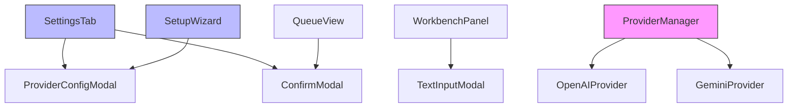

# 设计文档

## 概述

本设计文档旨在解决 Cognitive Razor 插件中的三个关键问题：

1. **Provider 简化**：移除冗余的 OpenRouter Provider，仅保留 OpenAI 和 Gemini 两种类型，并支持自定义端点配置
2. **设置界面修复**：修复 `prompt() is not supported` 错误，使用 Obsidian Modal 替代所有 prompt 调用
3. **功能完整实现**：实现所有待实现的功能，包括创建概念、队列详情、重复管理、增量改进和撤销等

## 架构

### 修改的组件

本次修改涉及以下组件：

1. **ProviderManager**：移除 OpenRouter 支持，添加自定义端点配置
2. **SettingsTab**：使用 Modal 替代 prompt()，实现所有按钮功能
3. **SetupWizard**：添加自定义端点配置，移除 OpenRouter 选项
4. **WorkbenchPanel**：实现完整的创建概念流程
5. **QueueView**：实现完整的队列详情和操作功能
6. **新增 Modal 组件**：TextInputModal、SelectModal、ConfirmModal

### 组件关系图



## 组件和接口

### Modal 组件接口

#### TextInputModal

用于替代 `prompt()` 的文本输入对话框。

```typescript
interface TextInputModalOptions {
  title: string;
  placeholder?: string;
  defaultValue?: string;
  validator?: (value: string) => string | null; // 返回错误消息或 null
  onSubmit: (value: string) => void;
  onCancel?: () => void;
}

class TextInputModal extends Modal {
  constructor(app: App, options: TextInputModalOptions);
}
```

#### SelectModal

用于选择选项的对话框。

```typescript
interface SelectOption {
  value: string;
  label: string;
  description?: string;
}

interface SelectModalOptions {
  title: string;
  options: SelectOption[];
  onSelect: (value: string) => void;
  onCancel?: () => void;
}

class SelectModal extends Modal {
  constructor(app: App, options: SelectModalOptions);
}
```

#### ConfirmModal

用于确认操作的对话框。

```typescript
interface ConfirmModalOptions {
  title: string;
  message: string;
  confirmText?: string;
  cancelText?: string;
  danger?: boolean;
  onConfirm: () => void;
  onCancel?: () => void;
}

class ConfirmModal extends Modal {
  constructor(app: App, options: ConfirmModalOptions);
}
```

#### ProviderConfigModal

用于配置 Provider 的对话框。

```typescript
interface ProviderConfigModalOptions {
  mode: 'add' | 'edit';
  providerId?: string;
  providerType?: ProviderType;
  currentConfig?: ProviderConfig;
  onSave: (id: string, config: ProviderConfig) => Promise<void>;
  onCancel?: () => void;
}

class ProviderConfigModal extends Modal {
  constructor(app: App, options: ProviderConfigModalOptions);
}
```

### ProviderManager 接口更新

```typescript
interface ProviderConfig {
  type: 'openai' | 'google'; // 移除 'openrouter'
  apiKey: string;
  baseUrl?: string; // 新增：自定义端点
  defaultChatModel: string;
  defaultEmbedModel: string;
  enabled: boolean;
}

// 默认端点配置
const DEFAULT_ENDPOINTS = {
  openai: 'https://api.openai.com/v1',
  google: 'https://generativelanguage.googleapis.com/v1beta'
};
```

### WorkbenchPanel 接口

```typescript
interface WorkbenchPanel {
  // 创建概念区域
  renderCreateSection(): void;
  handleStandardize(input: string): Promise<void>;
  handleCreate(standardizedData: StandardizedConcept): Promise<void>;
  
  // 重复概念区域
  renderDuplicatesSection(): void;
  handleMerge(pairId: string): Promise<void>;
  handleDismiss(pairId: string): Promise<void>;
  
  // 队列状态区域
  renderQueueSection(): void;
  openQueueView(): void;
  
  // 最近操作区域
  renderRecentSection(): void;
  handleUndo(snapshotId: string): Promise<void>;
}
```

### QueueView 接口

```typescript
interface QueueView {
  // 任务列表
  renderTaskList(): void;
  handleTaskClick(taskId: string): void;
  
  // 任务操作
  handleCancel(taskId: string): Promise<void>;
  handleRetry(taskId: string): Promise<void>;
  
  // 队列控制
  handlePause(): void;
  handleResume(): void;
  handleClear(): void;
}
```

## 数据模型

### Provider 配置模型

```typescript
// 简化后的 Provider 类型
type ProviderType = 'openai' | 'google';

// Provider 配置
interface ProviderConfig {
  type: ProviderType;
  apiKey: string;
  baseUrl?: string; // 自定义端点（可选）
  defaultChatModel: string;
  defaultEmbedModel: string;
  enabled: boolean;
}

// 默认配置
const DEFAULT_PROVIDER_CONFIGS: Record<ProviderType, Partial<ProviderConfig>> = {
  openai: {
    baseUrl: 'https://api.openai.com/v1',
    defaultChatModel: 'gpt-4-turbo-preview',
    defaultEmbedModel: 'text-embedding-3-small'
  },
  google: {
    baseUrl: 'https://generativelanguage.googleapis.com/v1beta',
    defaultChatModel: 'gemini-1.5-flash',
    defaultEmbedModel: 'text-embedding-004'
  }
};
```

### 标准化概念模型

```typescript
interface StandardizedConcept {
  standardName: {
    chinese: string;
    english: string;
  };
  aliases: string[];
  typeConfidences: {
    Domain: number;
    Issue: number;
    Theory: number;
    Entity: number;
    Mechanism: number;
  };
  coreDefinition: string;
}
```

### 任务详情模型

```typescript
interface TaskDetails extends TaskRecord {
  // 扩展字段用于 UI 显示
  providerName?: string;
  elapsedTime?: number;
  estimatedTime?: number;
}
```

## 正确性属性

*属性是一个应该在所有有效执行中保持为真的特征或行为——本质上是关于系统应该做什么的形式化陈述。属性作为人类可读规范和机器可验证正确性保证之间的桥梁。*

### 属性 1：Provider 类型限制

*对于任意*系统初始化，可用的 Provider 类型列表必须仅包含 'openai' 和 'google'，不得包含其他类型。

**验证需求**：1.1

### 属性 2：URL 格式验证

*对于任意*输入的端点 URL 字符串，验证函数必须正确识别有效的 HTTP/HTTPS URL 格式，拒绝无效格式。

**验证需求**：1.4, 3.3

### 属性 3：自定义端点持久化

*对于任意*保存的 Provider 配置，如果包含自定义端点，则后续的 API 调用必须使用该自定义端点而非默认端点。

**验证需求**：1.5

### 属性 4：Modal 替代 prompt

*对于任意*需要用户输入的场景，系统必须使用 Modal 组件（TextInputModal、SelectModal 或 ConfirmModal），不得调用 `window.prompt()`。

**验证需求**：2.1, 10.1, 10.2, 10.3

### 属性 5：Provider 类型表单映射

*对于任意*选择的 Provider 类型，配置表单必须显示对应类型的默认端点、默认模型和相关配置项。

**验证需求**：2.2, 3.2

### 属性 6：配置保存完整性

*对于任意*通过 Modal 保存的 Provider 配置，配置文件中必须包含所有必需字段（type、apiKey、baseUrl、defaultChatModel、defaultEmbedModel、enabled）。

**验证需求**：2.4, 3.4

### 属性 7：Modal 取消不保存

*对于任意*打开的配置 Modal，如果用户点击取消或按 Escape 键，则配置文件必须保持不变。

**验证需求**：2.5, 10.5

### 属性 8：标准化输出触发

*对于任意*在 Workbench 中输入的非空概念描述，点击标准化按钮必须创建一个 standardizeClassify 类型的任务。

**验证需求**：4.2

### 属性 9：标准化结果显示完整性

*对于任意*完成的标准化任务，UI 必须显示中文名、英文名、别名列表和五种类型的置信度分数。

**验证需求**：4.3

### 属性 10：笔记创建触发

*对于任意*确认的标准化结果，点击创建按钮必须生成一个 Stub 笔记文件，并创建对应类型的 enrich 任务。

**验证需求**：4.4

### 属性 11：队列视图任务完整性

*对于任意*打开的队列视图，显示的任务列表必须包含队列中的所有任务，且每个任务必须显示类型、状态、进度和创建时间。

**验证需求**：5.1, 5.2

### 属性 12：任务取消状态更新

*对于任意*队列中的任务，点击取消按钮后，任务状态必须更新为 Cancelled，且相关锁必须被释放。

**验证需求**：5.4

### 属性 13：任务重试入队

*对于任意*状态为 Failed 的任务，点击重试按钮后，必须创建一个新的任务（相同 payload）并加入队列。

**验证需求**：5.5

### 属性 14：重复对显示

*对于任意*检测到的重复概念对，Workbench 的重复面板中必须显示该重复对，包括两个笔记的名称、相似度和类型。

**验证需求**：6.1

### 属性 15：合并任务生成

*对于任意*重复对，点击合并按钮必须创建一个 reason:merge 类型的任务，payload 包含两个笔记的 nodeId。

**验证需求**：6.3

### 属性 16：重复对忽略状态

*对于任意*重复对，点击忽略按钮后，该重复对的状态必须更新为 dismissed，且不再显示在待处理列表中。

**验证需求**：6.4

### 属性 17：合并完成清理

*对于任意*完成的合并任务，系统必须从 DuplicatePairs 存储中移除该重复对，且 UI 列表中不再显示。

**验证需求**：6.5

### 属性 18：增量改进任务生成

*对于任意*输入的改进意图，确认后必须创建一个 reason:incremental 类型的任务，payload 包含当前笔记的 nodeId 和用户意图。

**验证需求**：7.3

### 属性 19：改进完成 DiffView 显示

*对于任意*完成的增量改进任务，系统必须打开 DiffView 显示原内容和新内容的差异。

**验证需求**：7.4

### 属性 20：改进确认快照创建

*对于任意*在 DiffView 中确认的改进，系统必须在写入前创建快照，写入后快照文件必须存在。

**验证需求**：7.5

### 属性 21：撤销按钮显示

*对于任意*写入操作，系统必须在通知中显示撤销按钮，且按钮在 5 秒内可点击。

**验证需求**：8.1

### 属性 22：撤销恢复内容

*对于任意*点击的撤销按钮，文件内容必须恢复到快照中保存的状态，且快照文件必须被删除。

**验证需求**：8.2

### 属性 23：操作历史完整性

*对于任意*打开的操作历史视图，显示的操作列表必须包含所有未过期的快照，且每个操作必须显示时间、文件路径和操作类型。

**验证需求**：8.3

### 属性 24：默认 Provider 更新

*对于任意*选中的 Provider，点击"设为默认"按钮后，配置文件中的 defaultProviderId 必须更新为该 Provider 的 ID。

**验证需求**：9.2

### 属性 25：日志清除

*对于任意*点击"清除日志"按钮的操作，日志文件必须被清空或删除，文件大小必须为 0 或文件不存在。

**验证需求**：9.3

### 属性 26：设置重置

*对于任意*确认的重置操作，所有配置项必须恢复到默认值，且 Providers 配置必须被清空。

**验证需求**：9.5

### 属性 27：Modal 焦点管理

*对于任意*打开的 Modal，焦点必须自动设置到第一个输入元素或主要操作按钮上。

**验证需求**：10.4

## 错误处理

### 新增错误码

| 代码 | 名称 | 触发条件 | 处理策略 |
|------|------|----------|----------|
| E300 | INVALID_URL | 自定义端点 URL 格式无效 | 显示错误提示，阻止保存 |
| E301 | PROVIDER_NOT_SUPPORTED | 尝试使用不支持的 Provider 类型 | 显示错误提示，引导用户选择支持的类型 |
| E302 | MODAL_CANCELLED | 用户取消 Modal 操作 | 静默处理，不显示错误 |

### URL 验证规则

```typescript
function validateUrl(url: string): string | null {
  // 必须以 http:// 或 https:// 开头
  if (!/^https?:\/\/.+/.test(url)) {
    return "URL 必须以 http:// 或 https:// 开头";
  }
  
  // 尝试解析 URL
  try {
    new URL(url);
    return null; // 有效
  } catch {
    return "无效的 URL 格式";
  }
}
```

## 测试策略

### 单元测试

单元测试覆盖以下场景：

1. **URL 验证**：测试各种有效和无效的 URL 格式
2. **Provider 配置**：测试配置的保存、加载和验证
3. **Modal 组件**：测试 Modal 的打开、关闭和回调
4. **默认值**：测试各种默认端点和模型配置

### 属性测试

属性测试使用 **fast-check** 库，每个测试运行至少 100 次迭代。

属性测试覆盖以下场景：

1. **Provider 类型限制**（属性 1）
2. **URL 格式验证**（属性 2）
3. **自定义端点持久化**（属性 3）
4. **Modal 替代 prompt**（属性 4）
5. **配置保存完整性**（属性 6）
6. **Modal 取消不保存**（属性 7）
7. **任务创建和状态更新**（属性 8-20）
8. **配置更新**（属性 24-26）
9. **焦点管理**（属性 27）

每个属性测试必须使用注释标记对应的属性编号：

```typescript
// **Feature: provider-simplification-and-ui-fixes, Property 1: Provider 类型限制**
test('provider types are limited to openai and google', () => {
  fc.assert(
    fc.property(fc.constantFrom('openai', 'google', 'openrouter', 'anthropic'), (type) => {
      const isValid = type === 'openai' || type === 'google';
      expect(isValidProviderType(type)).toBe(isValid);
    }),
    { numRuns: 100 }
  );
});
```

### 集成测试

集成测试覆盖以下场景：

1. **完整配置流程**：从打开设置到保存 Provider 配置
2. **完整创建流程**：从输入概念到创建笔记
3. **完整队列流程**：从任务入队到取消/重试
4. **完整合并流程**：从检测重复到合并完成
5. **完整撤销流程**：从写入到撤销恢复

## UI 设计

### ProviderConfigModal 布局

```
┌─────────────────────────────────────┐
│  配置 AI Provider                    │
├─────────────────────────────────────┤
│                                     │
│  Provider 类型: [OpenAI ▼]         │
│                                     │
│  Provider ID: [my-openai        ]  │
│                                     │
│  API Key: [••••••••••••••••••••]   │
│           [显示]                    │
│                                     │
│  自定义端点 (可选):                 │
│  [https://api.openai.com/v1    ]   │
│  💡 留空使用默认端点                │
│                                     │
│  聊天模型: [gpt-4-turbo-preview ]  │
│                                     │
│  嵌入模型: [text-embedding-3-small]│
│                                     │
│  [测试连接]                         │
│                                     │
│           [取消]  [保存]            │
└─────────────────────────────────────┘
```

### WorkbenchPanel 创建区域

```
┌─────────────────────────────────────┐
│  创建概念                            │
├─────────────────────────────────────┤
│                                     │
│  概念描述:                          │
│  ┌─────────────────────────────┐   │
│  │                             │   │
│  │                             │   │
│  └─────────────────────────────┘   │
│                    [标准化]         │
│                                     │
│  ─── 标准化结果 ───                 │
│  中文名: 人工智能                   │
│  英文名: Artificial Intelligence    │
│  别名: AI, 机器智能, ...            │
│  类型: Entity (0.85)                │
│                                     │
│                    [创建]           │
└─────────────────────────────────────┘
```

### QueueView 任务列表

```
┌─────────────────────────────────────┐
│  任务队列                [暂停]      │
├─────────────────────────────────────┤
│                                     │
│  ▶ 进行中 (2)                       │
│  ├─ standardizeClassify             │
│  │  人工智能 | 运行中 | 5s          │
│  │  [取消]                          │
│  └─ enrich                          │
│     深度学习 | 运行中 | 12s         │
│     [取消]                          │
│                                     │
│  ▶ 等待中 (3)                       │
│  ├─ embedding                       │
│  │  神经网络 | 等待 | 刚刚          │
│  └─ ...                             │
│                                     │
│  ▶ 已完成 (15)                      │
│  ▶ 失败 (1)                         │
│     reason:merge                    │
│     合并失败 | 失败 | 2分钟前       │
│     [重试] [查看详情]               │
│                                     │
└─────────────────────────────────────┘
```

## 性能要求

| 指标 | 目标值 | 测量方法 |
|------|--------|----------|
| Modal 打开延迟 | ≤ 50ms | 点击到 Modal 显示 |
| 配置保存延迟 | ≤ 100ms | 点击保存到完成 |
| 队列视图刷新 | ≤ 100ms | 任务状态变更到 UI 更新 |
| URL 验证延迟 | ≤ 10ms | 输入到验证结果显示 |

## 迁移策略

### 从 OpenRouter 迁移

对于已配置 OpenRouter 的用户：

1. 在插件启动时检测 OpenRouter 配置
2. 显示迁移提示：
   ```
   检测到 OpenRouter 配置。
   新版本不再支持 OpenRouter，但您可以：
   1. 使用 OpenAI Provider + 自定义端点指向 OpenRouter
   2. 配置其他支持的 Provider（OpenAI 或 Gemini）
   
   [配置 OpenAI] [配置 Gemini] [稍后]
   ```
3. 如果用户选择配置 OpenAI，自动填充：
   - baseUrl: `https://openrouter.ai/api/v1`
   - apiKey: 从 OpenRouter 配置复制
   - 模型: 保持原有配置

### 配置文件版本升级

```typescript
interface MigrationV2 {
  version: 2;
  changes: [
    {
      type: 'remove_provider_type';
      removed: 'openrouter';
    },
    {
      type: 'add_field';
      field: 'baseUrl';
      default: null;
    }
  ];
}

async function migrateToV2(oldSettings: any): Promise<Settings> {
  const newSettings = { ...oldSettings, version: 2 };
  
  // 移除 OpenRouter 配置
  for (const [id, config] of Object.entries(newSettings.providers)) {
    if (config.type === 'openrouter') {
      delete newSettings.providers[id];
    }
  }
  
  // 为现有 Provider 添加 baseUrl 字段（使用默认值）
  for (const [id, config] of Object.entries(newSettings.providers)) {
    if (!config.baseUrl) {
      config.baseUrl = DEFAULT_ENDPOINTS[config.type];
    }
  }
  
  return newSettings;
}
```

## 安全与隐私

1. **API Key 保护**：
   - 在 UI 中默认隐藏 API Key（显示为 ••••）
   - 提供"显示"按钮临时显示
   - 不在日志中记录 API Key

2. **自定义端点验证**：
   - 验证 URL 格式
   - 警告用户使用非官方端点的风险
   - 不自动发送数据到自定义端点（需用户确认）

3. **配置导出**：
   - 导出配置时提示用户 API Key 将被包含
   - 提供"导出时移除 API Key"选项

## 可访问性

1. **键盘导航**：
   - 所有 Modal 支持 Tab 键切换焦点
   - Enter 键确认，Escape 键取消
   - 焦点顺序符合视觉顺序

2. **屏幕阅读器**：
   - 所有输入框提供 label
   - 错误消息使用 aria-live
   - 按钮提供 aria-label

3. **视觉反馈**：
   - 焦点元素有明显的视觉指示
   - 错误消息使用红色高亮
   - 成功操作使用绿色提示
