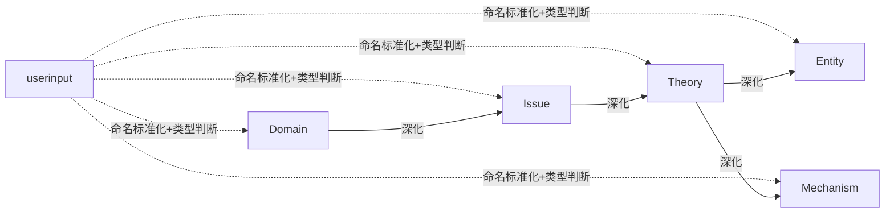

# Cognitive Razor (CR) - 产品需求文档

## 0. 引用
- `docs/System-Formalism.md`: 定义原语、系统公理与派生约束。
- `docs/PDD-提示词设计文档.md`: 提示词模板规范，确保符合 AX-5。
- `docs/UCD-用户使用设计文档.md`: 交互流程与界面约束，验证人机职责。

## 1. 系统定位

### 1.1 核心问题

系统协助具备高结构化意愿的知识工作者，将长周期学习或研究中产生的自然语言概念转化为一致、去重、可追溯的知识节点，缩减“无限信息流 vs. 有限认知”矛盾。

### 1.2 用户与场景
- **核心用户**: 以结构化建模驱动学习的研究者、策略分析师、知识工程师。
- **非目标用户**: 仅需快速记录、日记或轻量待办管理的用户。
- **使用节奏**: 低频高强度；攻克新领域时以小时级连续交互运行，维护期偶发触发。

### 1.3 目标函数

| ID | 目标 | 度量方式 |
|:--:|:--|:--|
| **G1** | 语义去重 | 同类型节点间余弦相似度 > `dedupThreshold` 的节点对数量趋近于 0。 |
| **G2** | 信息密度 | 任一节点可独立被理解：所有必填字段齐备，正文无需跳转即可回答完备性问题。 |
| **G3** | 智能自治 | 一切可由 AI 准确执行的操作由任务队列自动完成，无需用户重复劳动。 |

### 1.4 系统定义

**Cognitive Razor 是一个基于 Obsidian 的“认知编译器”。**
- **输入**: 用户在侧边栏输入的概念、文本、或命令。
- **输出**: 满足 `KnowledgeNode` 约束、具备双链的 Markdown 知识图谱。
- **引擎**: AI 任务队列 + 本地 JSON 数据层 + Prompt 模板。

## 2. 公理映射

`System-Formalism.md` 定义的 AX-1 ～ AX-10 为产品约束，下面给出其在产品层面的落实方式。

| AX | 产品义务 | 设计落地 |
|:--:|:--|:--|
| AX-1 | 节点语义完备 | 每个节点在 YAML 元数据中声明 `nodeType` 与 `nodeState`，正文遵循对应 Schema。任何字段缺失会导致任务失败并反馈到队列。 |
| AX-2 | 生命周期有限状态机 | UI 和 API 仅暴露 `Mark Stub`, `Generate Draft`, `Promote Evergreen`, `Downgrade Draft` 操作，防止非法状态跳转。 |
| AX-3 | 写入裁决权 | 所有写入任务先进入队列，经用户确认后执行；AI 不会自行创建任务。 |
| AX-4 | 可逆性 | 每个任务在写入前生成文件快照或变更集，并在队列中登记 `undoPointer`，可通过单独撤销恢复。 |
| AX-5 | Prompt 隔离 | PDD 中所有模板以 JSON 表达，使用显式段落标记 Instruction/Data/Schema/Examples。 |
| AX-6 | 本地数据 | 队列、向量、重复集群、提供商配置分别存储在 `.obsidian/plugins/cognitive-razor/data/*.json`。 |
| AX-7 | 去重闭环 | 相似度检测触发 Dedup 队列任务；系统强制执行合并或保留其一；不可忽略。 |
| AX-8 | 并发约束 | 队列尊重用户在设置中配置的 `maxConcurrency`，确保同一时间的写入任务作用于不同节点。 |
| AX-9 | 提供商抽象 | 设置面板允许定义多个 `ProviderProfile`；任务定义仅声明所需能力。 |
| AX-10 | 观察最小化 | 队列 UI 展示 `taskType`, `targetId`, `status`, `timestamps`, `providerId` 及撤销入口，不保留额外诊断信息。 |

## 3. 领域模型

### 3.1 知识类型分类与核心链路

> **Schema 单一事实来源**：所有节点字段的必填/可选状态、字段顺序与描述均在 `docs/schemas/node_schemas.json` 中维护，本节表格提供语义说明但不再单独列出可机读约束。任何字段改动需同步更新该 JSON 文件与 PDD 模板，确保 AX-1、AX-5 可被程序校验。

| 类型 | 英文 | 判定标准 |
|:--|:--|:--|
| 领域 | Domain | 可独立存在的知识边界，可被 MECE 分解并产出议题集合。 |
| 议题 | Issue | 领域中的矛盾或问题空间，存在 `X vs Y` 核心张力。 |
| 理论 | Theory | 针对议题的演绎体系，由公理、论证链和可证伪预测组成。 |
| 实体 | Entity | 静态对象，可在无需时间/过程的前提下定义。 |
| 机制 | Mechanism | 描述状态变化或因果链的过程，作用于实体并产出结果。 |

- **操作类型定义**:
    - **深化**: 一对多操作，从单个父节点笔记生成多个子节点列表。
    - **命名标准化+类型判断**: 利用 LLM 将用户的任意输入标准化为格式正确的笔记名，并输出类型置信度列表展示给用户，让用户选择笔记类型。
- 系统支持从链条任意节点执行深化操作，但推荐沿链条完整展开使用。

### 3.2 各类型详细定义

> **设计原则**: 本节设计遵循 **G2 目标（最大化信息密度）**——每个笔记必须自足完备，读者仅凭该笔记本身即可完全理解该概念的本质，无需跳转其他笔记。字段设计基于亚里士多德四因说（质料因、形式因、动力因、目的因）与现代认识论，确保覆盖理解一个概念所需的全部本质性问题。

#### 3.2.1 Domain (领域)

**本质**: 知识的边界划分，定义"什么属于/不属于这个学科"
**完备性问题**: 要完全理解一个领域，必须回答：
1. 它研究什么？（对象）
2. 它为何存在？（目的）
3. 它如何验证知识？（方法）
4. 它从何而来？（起源）
5. 它的边界在哪？（范围）
6. 它包含哪些核心问题？（议题）
**必要字段**:

| 字段                       | 中文名  | 哲学依据  | 说明                        |
|:----------------------- |:--- |:---- |:------------------------ |
| `definition`             | 定义   | 形式因   | 该领域研究什么对象？|
| `teleology`              | 目的论  | 目的因   | 该领域试图回答什么问题？解决什么需求？|
| `methodology`            | 方法论  | 动力因   | 该领域如何生产和验证知识？|
| `historical_genesis`     | 历史起源 | 质料因   | 该领域何时、为何、如何产生？|
| `boundaries`             | 边界   | 否定性定义 | 该领域明确**不**研究什么？与相邻领域的分界线？|
| `issues`                 | 议题   | 问题空间  | 该领域的议题列表                  |
| `holistic_understanding` | 整体理解 | 综合    | 综合同笔记已列结构化信息，回答如何理解该领域？|

**可选结构字段**:

| 字段 | 中文名 | 说明 |
|:-- |:-- |:-- |
| `sub_domains` | 子领域 | 仅在领域可划分时给出，一旦给出则需要符合子领域的划分规范 |

**议题完备性：为了确保系统给出的议题是完备的，我们要求：** 领域议题 = Σ(各子领域议题) + 本领域涌现议题（不属于任何子领域的议题），Domain 类型笔记的 `issues` 字段给出的是涌现议题，子领域议题在生成子领域笔记中展开。
**子领域划分规范**:
1. **分类维度**: 必须明确声明划分所依据的维度（如：研究对象、研究方法、应用场景等），可使用混合维度
2. **穷尽优先**，无重叠其次: 宁可多划不可漏划——遗漏的危害远大于重叠的危害。此处的"穷尽优先"指示划分维度与议题覆盖要足够全面，旨在避免遗漏重要问题空间；它并不意味着允许同一语义概念在同类型中重复创建。系统仍然遵循 A1 的语义唯一性约束，对同类型的语义等价概念执行去重与阻断。
3. **权威验证**: 必须参照权威来源验证划分体系（如：顶尖教科书目录、权威学术学会分类法、学科评估体系等）
4. **交叉处理**: 对于交叉领域，允许在多个父领域下同时出现

#### 3.2.2 Issue (议题)

**本质**: 尚未完全解决的问题，存在核心矛盾
**完备性问题**: 要完全理解一个议题，必须回答：
1. 矛盾的双方是什么？（张力）
2. 为什么这是个问题？（重要性）
3. 谁关心这个问题？（利益相关者）
4. 什么时候这不是问题？（边界条件）
5. 有哪些尝试解决它的方案？（理论景观）

| 字段                         | 中文名     | 哲学依据  | 说明                       |
|:------------------------- |:------ |:---- |:----------------------- |
| `core_tension`             | 核心张力    | 矛盾律   | 必须表述为 "X vs Y" 格式，揭示根本对立 |
| `significance`             | 重要性     | 价值论   | 为什么这是个问题？该议题的重要性和影响范围    |
| `historical_genesis`       | 历史起源    | 时间性   | 该议题何时被识别？什么事件触发了它？|
| `structural_analysis`      | 结构分析    | 分解    | 将议题拆解为子问题，揭示内部逻辑结构       |
| `stakeholder_perspectives` | 利益相关者视角 | 主体间性  | 不同立场的人如何看待此议题？|
| `boundary_conditions`      | 边界条件    | 否定性定义 | 在什么条件下该议题**不**成立或不相关？|
| `holistic_understanding`   | 整体理解    | 综合    | 综合同笔记已列结构化信息，回答如何理解该议题？|
| `theories`                 | 理论列表    | 解空间   | 尝试解决此议题的各种理论（主流/边缘/已证伪）|

**理论列表规范**:
1. **穷尽优先**，无重叠其次: 宁可多划不可漏划——遗漏的危害远大于重叠的危害。
2. 按照主流/边缘/已证伪，分类地给出理论列表。
3. 利用嵌入模型相似度+提示词，尽可能去重

#### 3.2.3 Theory (理论)

**本质**: 从公理出发的逻辑推演体系
**完备性问题**: 要完全理解一个理论，必须回答：
1. 它的基础假设是什么？（公理）
2. 它如何从假设推出结论？（论证链）
3. 它预测了什么可检验的结果？（可证伪性）
4. 它适用于哪些情况？（适用范围）
5. 它有什么已知缺陷？（局限性）
6. 它定义了哪些实体，描述了哪些机制？（组件）
**必要字段**:

| 字段                        | 中文名   | 哲学依据 | 说明                                      |
|:------------------------ |:---- |:--- |:-------------------------------------- |
| `axioms`                  | 公理    | 第一原理 | 不证自明的基础假设，每条需附带正当性说明                    |
| `argument_chain`          | 论证链   | 演绎推理 | 从公理到结论的完整推导，每步必须有逻辑连接词（因此、所以、若... 则...）|
| `core_predictions`        | 核心预测  | 可证伪性 | 该理论做出的可检验预测                             |
| `scope_and_applicability` | 适用范围  | 边界   | 该理论在什么条件下有效？|
| `limitations`             | 局限性   | 批判性  | 已知的缺陷、无法解释的现象                           |
| `historical_development`  | 历史发展  | 起源   | 该理论的创立、演变和修正历程                          |
| `extracted_components`    | 提取的组件 | 核心产出 | 该理论定义的实体 (Entity) 和描述的机制 (Mechanism)    |
| `holistic_understanding`  | 整体理解  | 综合   | 综合同笔记已列结构化信息，回答如何理解该理论？|

**组件提取规范**:
1. **穷尽优先**: 宁可多提取不可漏提取——遗漏实体/机制的危害远大于重复提取的危害
2. 按照实体/机制，分类地给出组件列表。
3. 利用嵌入模型相似度+提示词，尽可能去重

#### 3.2.4 Entity (实体)

**本质**: 静态概念，可在不引用时间/过程的前提下完成定义
**完备性问题**: 要完全理解一个实体，必须回答：
1. 它是什么？（定义）
2. 它属于哪个类别？（分类）
3. 它有什么属性？（性质）
4. 它与其他事物有何不同？（区分特征）
5. 什么是它？什么不是它？（例子与反例）

| 字段                        | 中文名  | 哲学依据  | 说明                        |
|:------------------------ |:--- |:---- |:------------------------ |
| `definition`              | 定义   | 本质    | 该实体是什么？使用属加种差定义法          |
| `classification`          | 分类   | 范畴    | 该实体属于哪个上位类？与同级概念的关系？|
| `properties`              | 属性   | 偶性    | 该实体的可测量/可观察特征，包括可能取值和度量方式 |
| `distinguishing_features` | 区分特征 | 个体化原则 | 使该实体区别于相似概念的关键特征          |
| `examples`                | 正例   | 外延    | 典型的、属于该实体的实例              |
| `counter_examples`        | 反例   | 否定外延  | 容易误认为是该实体、但实际不是的实例        |
| `holistic_understanding`  | 整体理解 | 综合    | 综合同笔记已列结构化信息，回答如何理解该实体？|

**关系字段**:

| 字段 | 中文名 | 说明 |
|:-- |:-- |:-- |
| `is_a` | 上位类 | 该实体是什么的一种？|
| `has_parts` | 组成部分 | 该实体由哪些部分构成？|
| `related_to` | 相关概念 | 其他相关但非层级关系的实体 |

#### 3.2.5 Mechanism (机制)

**本质**: 动态过程，描述状态变化或因果链
**完备性问题**: 要完全理解一个机制，必须回答：
1. 它是什么过程？（定义）
2. 什么触发它？（启动条件）
3. 它如何一步步进行？（因果链）
4. 它什么时候结束？（终止条件）
5. 它作用于什么？产生什么？（输入输出）

| 字段                       | 中文名  | 哲学依据 | 说明                            |
|:----------------------- |:--- |:--- |:---------------------------- |
| `definition`             | 定义   | 本质   | 该机制是什么过程？|
| `trigger_conditions`     | 触发条件 | 动力因  | 什么条件下该机制启动？|
| `causal_chain`           | 因果链  | 因果性  | 按步骤描述：第 N 步做什么→产生什么结果（至少 2 步）|
| `termination_conditions` | 终止条件 | 边界   | 什么条件下该机制停止？|
| `inputs`                 | 输入   | 质料因  | 该机制需要什么前提条件/资源？|
| `outputs`                | 输出   | 目的因  | 该机制产生什么结果/效果？|
| `process_description`    | 过程描述 | 叙事   | 对整个过程的连贯文字描述                  |
| `examples`               | 实例   | 外延   | 该机制的典型应用场景                    |
| `holistic_understanding` | 整体理解 | 综合   | 综合同笔记已列结构化信息，回答如何理解该机制？|

**关系字段**:

| 字段 | 中文名 | 说明 |
|:-- |:-- |:-- |
| `operates_on` | 作用对象 | 该机制作用于哪些实体？(≥1 个) |
| `produces` | 产出 | 该机制产生哪些新实体或状态？|
| `requires` | 依赖 | 该机制依赖哪些其他机制？|
| `inhibited_by` | 抑制因素 | 什么会阻止或削弱该机制？|

## 4. 流程与任务体系

### 4.1 节点生命周期

| 阶段 | 触发方式 | 任务类型 | 主要输入 | 主要输出 | 状态变更 |
|:--|:--|:--|:--|:--|:--|
| 标准化 | 用户在侧边栏输入概念后点击“分析” | `Normalization` | 原始文本、当前 Vault 上下文、命名模板配置 | `canonicalName`, `typeCandidates`（含置信度）、建议标签 | 无 |
| 元数据生成 | 用户确认笔记类型 | `MetadataSynthesis` | `nodeType`, `canonicalName`, Schema 定义 | YAML frontmatter（含 `nodeId`, `nodeType`, `nodeState=Stub`） | 创建节点（Stub） |
| 内容生成 | 用户点击“生成正文”或深化批量任务自动触发 | `ContentSynthesis` | 节点 YAML、Schema、引用上下文、命名模板 | 满足 Schema 的 Markdown 正文 | `Stub → Draft` |
| 增量修改 | 用户输入修订指令 | `ContentSynthesis` (带 diff 指示) | 当前正文、修订指令、Schema | 更新后的正文及变更摘要 | Evergreen 自动降级为 Draft；Draft 保持 |
| 事实核查 | 用户点击“Fact-check” | `FactVerification` | 节点正文、Grounding Provider | `## Verification` 区块追加条目 | 状态不变 |
| 永久化审阅 | 用户点击“Mark as Evergreen” | 无 AI 任务 | 当前节点 | YAML 中 `nodeState=Evergreen` | `Draft → Evergreen` |
| 撤销 | 用户在队列历史中选择撤销 | `UndoExecution`（系统本地执行） | `undoPointer`, 任务快照 | 恢复前置内容 | 状态回滚 |

### 4.2 任务队列机制
- 队列结构：基于 `TaskQueue` 原语实现持久优先队列，持久化于 `queue_state.json`。
- 批次分组：任何由用户一次操作触发的批处理都会创建 `parentTaskId`，在 `queue_state.json` 中维护 `taskGroups[]`，用于 UCD 中的分组展示与统计，但不改变调度算法。
- 并发策略：用户在设置中配置 `maxConcurrency`（默认 1），调度遵循 AX-8，确保并发写入作用于互斥节点。
- 用户能力：
    - 调整优先级：通过拖拽或命令更改等待任务的 `priority`。 
    - 暂停与恢复：切换 `status` 为 `Paused`，并记录 `pausedAt` 时间。
    - 重排：对 `Waiting` 任务改写序列号以更新执行顺序。
- 任务状态：`Waiting`, `Running`, `Paused`, `Completed`, `Failed`, `UndoPending`, `Reverted`。
- 撤销流程：撤销指令会生成 `UndoExecution` 任务，成功后原任务标记为 `Reverted` 并记录时间戳。
- 崩溃恢复：插件启动读取队列，所有 `Running` 任务回退为 `Waiting` 并提示用户重试。

### 4.3 去重与合并
- 相似度判定：每次 `ContentSynthesis` 完成后更新节点嵌入至 `embeddings.json`，使用余弦相似度与 `dedupThreshold` 评估。
- 集群持久化：满足阈值的节点组成 `DedupCluster`，写入 `dedup_clusters.json` 并创建 `DedupResolution` 任务。
- AI 操作：
    - **合并**：AI 输出统一 YAML 和正文、保留节点 ID、被移除节点列表及重定向映射。系统保留指定节点，重写双链，再将被移除节点移动到 `.trash/cognitive-razor/`。
    - **保留其一**：AI 输出唯一保留节点 ID，系统执行双链重定向并生成对比报告写入归档目录。
- 去重锁：一旦节点进入 `DedupCluster` 且状态为 `Pending/Resolving`，对应 `nodeId` 会被打上 `dedupLocked` 标记，UI 与调度器会阻止新的 `ContentSynthesis`、`FactVerification`、`MetadataSynthesis` 等写入任务，直到 `Resolved/Reverted`。
- 用户职责：查看结果、在 UI 中确认合并/保留，并（如有需要）执行撤销；只要集群未被确认为 `Resolved`，相关节点上的写入按钮保持禁用状态，不存在“忽略”路径。
- 集群状态：`Pending`, `Resolving`, `Resolved`, `Reverted`。

### 4.4 深化批处理
- 用户从任意节点触发“深化”命令，输入目标子节点数量上限与约束提示。
- 系统生成对应数量的 `Normalization` 子任务；父任务记录在队列中作为 `TaskGroup`（`parentTaskId`），供 QueueMonitor 聚合展示并追踪进度。
- 每个子任务独立排队、执行、撤销；批量撤销需逐个执行以符合 AX-4。

### 4.5 事实核查
- 使用具备 Grounding 能力的 Provider（如 Google Grounding API）。
- 输出字段：`timestamp`, `claim`, `sources[] (url, title, confidence)`。
- 系统在笔记末尾追加 `## Verification` 区块，条目格式：`- [YYYY-MM-DD HH:MM] Claim … Sources: …`。
- 重复执行追加新条目；撤销删除最近条目并恢复 Markdown。

## 5. 数据与持久化设计

| 文件 | 说明 | 核心字段 |
|:--|:--|:--|
| `queue_state.json` | 当前任务队列与调度器状态 | `tasks[]`, `taskGroups[]`, `dedupLocks[]`, `maxConcurrency`, `lastUpdated` |
| `task_history.json` | 已完成任务及撤销信息 | `taskId`, `taskType`, `targetId`, `status`, `timestamps`, `undoPointer`, `providerId` |
| `embeddings.json` | 节点嵌入索引 | `nodeId`, `vector`, `model`, `updatedAt` |
| `dedup_clusters.json` | 去重集群记录 | `clusterId`, `members`, `lockedNodeIds`, `threshold`, `status`, `resolutionTaskId` |
| `providers.json` | ProviderProfile 配置 | `providerId`, `apiType`, `baseUrl`, `model`, `capabilities`, `apiKeyReference` |
| `settings.json` | 用户首选项 | `namingTemplate`, `dedupThreshold`, `maxConcurrency`, `defaultProvider` |
| `naming_cache.json` | 历史标准化结果缓存 | `inputHash`, `canonicalName`, `nodeType`, `createdAt` |
| `data/prompts/*.json` | PromptTemplate 仓库 | `id`, `version`, `segments[]`, `providerHints`, `schemaHash` |
| `ui_state.json` | 侧边栏布局与选择状态 | `expandedPanels`, `selectedTaskId`, `queueFilters`, `locale`, `updatedAt` |
| `snapshots/<taskId>-<timestamp>.bak` | 写入任务快照 | `undoPointer`, `files[] (path, checksum, content)`, `nodeStateBefore`, `createdAt` |
| `docs/schemas/node_schemas.json` | 节点 Schema 仓库 | `types`, `required`, `optional`, `fields`, `version` |

- 所有 JSON 文件位于 `.obsidian/plugins/cognitive-razor/data/`，采用 UTF-8 编码。
- `snapshots/` 子目录专门存放 `.bak` 文件，命名为 `<taskId>-<timestamp>.bak` 并以 JSON 包含待修改文件的 Base64 内容与校验和；写入成功且撤销窗口关闭后自动清理。
- 每次写入前创建快照并将路径登记在 `TaskRecord.undoPointer`，撤销成功后删除快照；崩溃恢复时若发现未消费的 `.bak` 则提示用户回滚。

## 6. 配置与首选项
- **命名模板 (`namingTemplate`)**：字符串模板，支持占位符 `{{chinese}}`, `{{english}}`, `{{type}}`, `{{type_cn}}`；默认值 `{{chinese}} ({{english}})`。
- **相似度阈值 (`dedupThreshold`)**：范围 `[0,1)`，默认 `0.85`，用于触发去重任务。
- **最大并发数 (`maxConcurrency`)**：正整数，默认 `1`，决定同时运行的写入任务数量。
- **模型提供商**：设置页提供 ProviderProfile 管理，任务类型可绑定默认 provider；用户可为不同任务指定不同模型。
- **命令面板**：暴露“打开侧边栏”“深化当前节点”“重新执行事实核查”“撤销上次任务”等命令以便用户配置快捷键。

## 7. 非功能需求
- **性能**：调度器操作需在 100 ms 内完成；队列 UI 更新需保持 60 FPS (16 ms) 渲染预算。
- **可靠性**：任务失败时必须提供错误原因与重试按钮；连续失败超过 3 次自动暂停任务并通知用户。
- **数据安全**：除 API 调用外不得写出 Vault 数据； API 密钥使用 Obsidian 安全存储并在调用时解密。
- **可测试性**：提供离线 Mock Provider，所有任务输入输出均通过 JSON Schema 校验。
- **可扩展性**：新增节点类型或任务类型时需同步更新 System Formalism、PDD 模板和本 PRD 中的相关表格。
