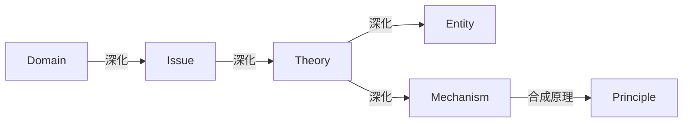
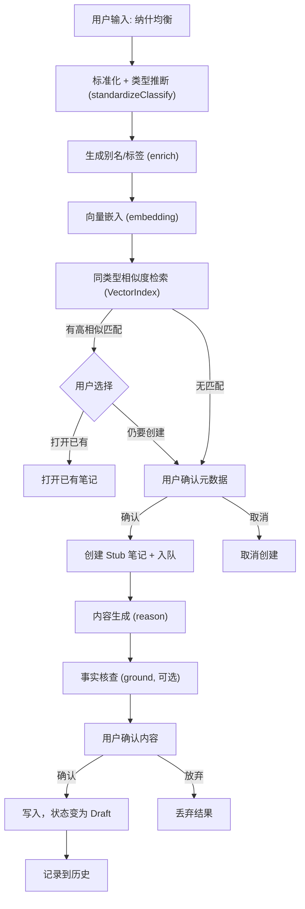
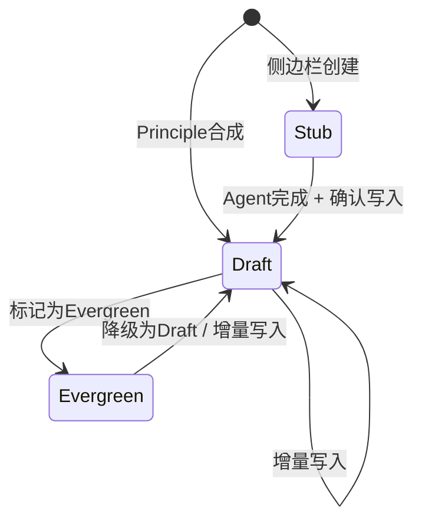
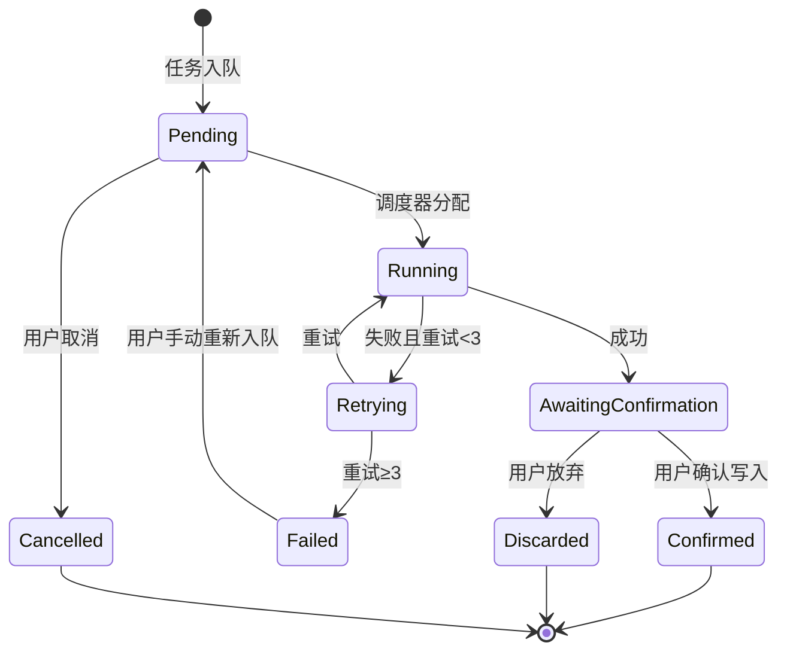

# Cognitive Razor (CR) - 产品需求文档

## 1. 系统定位

### 1.1 核心问题 (First Principles)

本系统解决三个一阶问题：

|   ID   | 问题名称 |              问题描述              |
|:----: |:--: |:----------------------------: |
| **P1** | 高熵压缩 | 如何将自由形式的自然语言，转化为结构化、可复用的知识对象？|
| **P2** | 语义去重 | 如何确保"同一本体"在知识库中只存在一个实例，避免语义重复？|
| **P3** | 人机协作 | 如何在 AI 辅助生成的同时，保证人类对知识库的最终控制权？|

### 1.2 目标函数 (Optimization Targets)

|   ID   |   目标    |            度量方式            |
|:----: |:-----: |:------------------------: |
| **G1** | 最小化语义重复 |   同类型节点中，相似度 > dedupThreshold 的节点对数量趋近于 0    |
| **G2** | 最大化信息密度 | 单个节点可独立作为参考单元，无需跳转即可理解核心概念 |
| **G3** | 最小化认知负载 |    单次操作中用户必须做出的决策数量尽可能少    |
| **G4** | 最小化操作摩擦 |      日常知识注入流程尽可能快速完成       |
| **G5** | 最大化智能决策 | 系统自动处理的决策占比大于用户，用户仅审核边界案例  |

### 1.3 系统定义

**Cognitive Razor 是一个基于 Obsidian 的"认知编译器"。**
- **输入**: 自然语言概念
- **输出**: 结构化、去重、带双链的 Markdown 知识图谱

## 2. 系统公理 (Inviolable Constraints)

以下规则为系统设计的硬约束，任何功能设计不得违背。

### A1. 语义唯一性

> 系统中任一同类型节点只能存在一个 UID。

- **实施要求**: 任何新建节点在写入前，必须经过基于向量检索的等价候选检查。若发现高相似度匹配，系统必须向用户展示潜在的重复项，并**进行阻断式提醒**（如禁用创建按钮），强制引导用户查看已有笔记。仅当用户显式勾选“忽略重复”选项后，才允许创建新节点（Override）。
- **跨类型共存**: 同一概念可作为不同类型的节点分别存在。例如「博弈论」可同时作为 Domain（描述学科边界）和 Theory（描述具体理论体系）存在，因为它们刻画的是该概念的不同认知层面。去重检查仅在**同类型**节点间执行。
- **违反后果**: 语义重复，目标 G1 失败。

### A2. 因果层级性

> 知识节点必须且只能属于 6 种类型之一。

| 类型 | 英文 | 判定标准 |
|:--: |:--: |:--: |
| 领域 | Domain | 可独立存在的知识边界，可 MECE 分解 |
| 议题 | Issue | 领域的问题空间，存在核心矛盾 (X vs Y)，有多个理论尝试解决 |
| 理论 | Theory | 议题的解空间，从公理出发，通过逻辑推演得出结论的体系，由实体与机制构成 |
| 实体 | Entity | 定义时不需引用时间/过程，静态对象 |
| 机制 | Mechanism | 定义中必须包含状态变化或因果链，作用于 Entity |
| 原理 | Principle | 可表述为 IF-THEN 形式，从 ≥2 个不同机制中抽象的结构不变量 |

**关于终端性与合成的说明**:
- **Mechanism**: 不支持进一步的“深化/分解”以生成子类型（即无向下的深化链），但可以作为**合成（多对一）**的输入参与生成 `Principle`。
- **Principle**: 为真正的终端节点，既不支持深化也不支持作为合成输入再次生成其他类型。Principle 只能通过 Mechanism 的合成流程创建，不能通过普通的创建/类型推断流程直接产生。

- **违反后果**: 类型混淆，知识图谱逻辑断裂。

### A3. 人机共生性

> AI 生成建议，人类拥有唯一写入裁决权。

- **实施要求**:
    - 禁止静默写入：任何文件修改必须经用户显式确认。
    - 可追溯性：任何写入操作可在日志中回溯到具体的用户确认事件。
    - 可撤销性：所有写入操作支持撤销。
    - 可中断恢复性：长时间操作可暂存进度，用户可在之后恢复。
- **违反后果**: 用户失去对知识库的控制权，问题 P3 (人机协作) 失败。

### A4. 命名规范性

> 所有知识节点的规范名称默认采用 `中文术语 (English Term)` 格式，但用户可通过设置自定义命名模板。

- **自定义机制**:
    - 用户可在设置中配置 `namingTemplate`，支持的占位符见 7.3 节
    - 系统优先使用用户设定的模板，仅在未配置时使用默认格式
    - 支持的格式示例：
        - `{{chinese}} ({{english}})` — 默认，如「纳什均衡 (Nash Equilibrium)」
        - `{{english}} ({{chinese}})` — 英文优先，如「Nash Equilibrium (纳什均衡)」
        - `{{english}}` — 纯英文，如「Nash Equilibrium」
        - `{{chinese}}` — 纯中文，如「纳什均衡」
        - `{{type_cn}}-{{chinese}}` — 带类型前缀，如「实体-纳什均衡」
- **例外处理**:
    - 无共识中文译名：文件名用英文，`aliases` 中补充描述性中文。
    - 数学符号/缩写：保留原形式，`aliases` 中维护说明。
- **违反后果**: 学术精确性丧失，搜索召回率下降。

### A5. 本地优先性

> **索引存储本地化**: 向量数据必须存储于本地文件，不依赖外部向量数据库服务 (Vector DB as a Service)。

- **实施要求**:
    - 允许调用外部 API (如 Google Embedding API) 进行向量计算。
    - 向量数据本身必须以 JSON 形式持久化在用户本地 Vault 中。
- **违反后果**: 数据迁移困难，增加外部服务依赖成本。

> **离线可用性说明**: 离线时 AI 功能（向量嵌入、内容生成、事实核查等）不可用，但本地数据（已创建的笔记、向量索引、队列状态）可正常访问和浏览。

### A6. 渐进披露性

> 系统复杂度应按用户熟练度逐步展现。

- **实施要求**:
    - 新用户默认启用简化模式
    - 高级功能可通过设置解锁
    - 类型判断由系统自动完成，用户仅在必要时介入
    - 新用户无需完全理解 Entity/Mechanism 等术语，系统用自然语言描述类型差异
    - 系统自动给出初始类型建议（Principle 不在推断或可选范围内）；用户可在确认界面对建议类型进行修改（仅限非 Principle 类型），一旦修改系统会重新执行对应的同类型去重检索。
- **违反后果**: 新用户流失，目标 G3、G4 失败。

### A7. 注意力尊重性

> 系统通知应尊重用户当前注意力状态。

- **实施要求**:
    - 用户活跃输入时，仅更新状态栏数字，不弹出通知
    - 免打扰模式下，所有非关键通知静默
- **违反后果**: 打断用户心流，降低工具信任度。

## 3. 领域模型

### 3.1 知识类型关系图及核心使用链条



**核心使用链条**: Domain → Issue → Theory → Entity/Mechanism → Principle

注：Principle 仅通过 Mechanism 合成产生，不能通过普通创建或类型推断生成。

**操作类型定义**:
- **深化 (Deepen)**: 一对多操作，从单个父节点生成多个子节点列表
- **合成 (Synthesize)**: 多对一操作，从多个源节点抽象出单个新节点

**各类型操作规则**:
- **Domain**（知识边界划分）：支持**深化**，产生该领域的 **Issue**（议题）列表
- **Issue**（领域的问题空间）：支持**深化**，产生尝试解决该议题的 **Theory**（理论）列表
- **Theory**（议题的解决方案）：支持**深化**，提取该理论定义的 **Entity**（实体）和描述的 **Mechanism**（机制）列表
- **Entity**: 终端叶节点，无深化操作，无合成操作
- **Mechanism**: 终端叶节点，**无深化操作**；但支持**合成**操作——选择 ≥2 个不同的 Mechanism 合成 **Principle**
- **Principle**: 终端叶节点，无深化操作，无合成操作；只能通过 Mechanism 的合成操作产生

系统支持从链条任意节点开始操作，但推荐的完整流程是沿上述链条展开。

### 3.2 各类型详细定义

> **设计原则**: 本节设计遵循 **G2 目标（最大化信息密度）**——每个笔记必须自足完备，读者仅凭该笔记本身即可完全理解该概念的本质，无需跳转其他笔记。字段设计基于亚里士多德四因说（质料因、形式因、动力因、目的因）与现代认识论，确保覆盖理解一个概念所需的全部本质性问题。

#### 3.2.1 Domain (领域)

**本质**: 知识的边界划分，定义"什么属于/不属于这个学科"
**完备性问题**: 要完全理解一个领域，必须回答：
1. 它研究什么？（对象）
2. 它为何存在？（目的）
3. 它如何验证知识？（方法）
4. 它从何而来？（起源）
5. 它的边界在哪？（范围）
6. 它包含哪些核心问题？（议题）
**必要字段**:

| 字段                       | 中文名  | 哲学依据  | 说明                        |
|:----------------------- |:--- |:---- |:------------------------ |
| `definition`             | 定义   | 形式因   | 该领域研究什么对象？|
| `teleology`              | 目的论  | 目的因   | 该领域试图回答什么问题？解决什么需求？|
| `methodology`            | 方法论  | 动力因   | 该领域如何生产和验证知识？|
| `historical_genesis`     | 历史起源 | 质料因   | 该领域何时、为何、如何产生？|
| `boundaries`             | 边界   | 否定性定义 | 该领域明确**不**研究什么？与相邻领域的分界线？|
| `issues`                 | 议题   | 问题空间  | 该领域的议题列表                  |
| `holistic_understanding` | 整体理解 | 综合    | 自由形式的深度综述，将上述要素融会贯通       |

**可选结构字段**:

| 字段 | 中文名 | 说明 |
|:-- |:-- |:-- |
| `sub_domains` | 子领域 | 若非原子领域，按清晰的分类维度进行划分 |

**议题完备性：为了确保系统给出的议题是完备的，我们要求：**议题完备性公式**: 领域议题 = Σ(各子领域议题) + 本领域涌现议题（不属于任何子领域的议题），Domain 类型笔记的 `issues` 字段应该给出的是本领域涌现议题，子领域议题在子领域自己的笔记中给出。
**子领域划分规范**:
1. **分类维度**: 必须明确声明划分所依据的维度（如：研究对象、研究方法、应用场景等），可使用混合维度
2. **穷尽优先**，无重叠其次: 宁可多划不可漏划——遗漏的危害远大于重叠的危害
    说明：此处的“穷尽优先”指示划分维度与议题覆盖要足够全面，旨在避免遗漏重要问题空间；它并不意味着允许同一语义概念在同类型中重复创建。系统仍然遵循 A1 的语义唯一性约束，对同类型的语义等价概念执行去重与阻断。
3. **权威验证**: 必须参照权威来源验证划分体系（如：顶尖教科书目录、权威学术学会分类法、学科评估体系等）
4. **交叉处理**: 对于交叉领域，允许在多个父领域下同时出现
5. 利用嵌入模型相似度+提示词，尽可能去重。

#### 3.2.2 Issue (议题)

**本质**: 尚未完全解决的问题，存在核心矛盾
**完备性问题**: 要完全理解一个议题，必须回答：
1. 矛盾的双方是什么？（张力）
2. 为什么这是个问题？（重要性）
3. 谁关心这个问题？（利益相关者）
4. 什么时候这不是问题？（边界条件）
5. 有哪些尝试解决它的方案？（理论景观）

| 字段                         | 中文名     | 哲学依据  | 说明                       |
|:------------------------- |:------ |:---- |:----------------------- |
| `core_tension`             | 核心张力    | 矛盾律   | 必须表述为 "X vs Y" 格式，揭示根本对立 |
| `significance`             | 重要性     | 价值论   | 为什么这是个问题？该议题的重要性和影响范围 |
| `historical_genesis`       | 历史起源    | 时间性   | 该议题何时被识别？什么事件触发了它？|
| `structural_analysis`      | 结构分析    | 分解    | 将议题拆解为子问题，揭示内部逻辑结构       |
| `stakeholder_perspectives` | 利益相关者视角 | 主体间性  | 不同立场的人如何看待此议题？|
| `boundary_conditions`      | 边界条件    | 否定性定义 | 在什么条件下该议题**不**成立或不相关？|
| `holistic_understanding`   | 整体理解    | 综合    | 自由形式的深度综述                |
| `theories`                 | 理论列表    | 解空间   | 尝试解决此议题的各种理论（主流/边缘/已证伪）|

**理论列表规范**:
1. **穷尽优先**，无重叠其次: 宁可多划不可漏划——遗漏的危害远大于重叠的危害。
2. 按照主流/边缘/已证伪，分类地给出理论列表。
3. 利用嵌入模型相似度+提示词，尽可能去重

#### 3.2.3 Theory (理论)

**本质**: 从公理出发的逻辑推演体系
**完备性问题**: 要完全理解一个理论，必须回答：
1. 它的基础假设是什么？（公理）
2. 它如何从假设推出结论？（论证链）
3. 它预测了什么可检验的结果？（可证伪性）
4. 它适用于哪些情况？（适用范围）
5. 它有什么已知缺陷？（局限性）
6. 它定义了哪些实体，描述了哪些机制？（组件）
**必要字段**:

| 字段 | 中文名 | 哲学依据 | 说明 |
|:-- |:-- |:-- |:-- |
| `axioms` | 公理 | 第一原理 | 不证自明的基础假设，每条需附带正当性说明 |
| `argument_chain` | 论证链 | 演绎推理 | 从公理到结论的完整推导，每步必须有逻辑连接词（因此、所以、若... 则...）|
| `core_predictions` | 核心预测 | 可证伪性 | 该理论做出的可检验预测 |
| `scope_and_applicability` | 适用范围 | 边界 | 该理论在什么条件下有效？|
| `limitations` | 局限性 | 批判性 | 已知的缺陷、无法解释的现象 |
| `historical_development` | 历史发展 | 起源 | 该理论的创立、演变和修正历程 |
| `extracted_components` | 提取的组件 | 核心产出 | 该理论定义的实体 (Entity) 和描述的机制 (Mechanism) |
| `holistic_understanding` | 整体理解 | 综合 | 自由形式的深度综述 |

**组件提取规范**:
1. **穷尽优先**: 宁可多提取不可漏提取——遗漏实体/机制的危害远大于重复提取的危害
2. 按照实体/机制，分类地给出组件列表。
3. 利用嵌入模型相似度+提示词，尽可能去重

#### 3.2.4 Entity (实体)

**本质**: 静态概念，可在不引用时间/过程的前提下完成定义
**完备性问题**: 要完全理解一个实体，必须回答：
1. 它是什么？（定义）
2. 它属于哪个类别？（分类）
3. 它有什么属性？（性质）
4. 它与其他事物有何不同？（区分特征）
5. 什么是它？什么不是它？（例子与反例）

| 字段 | 中文名 | 哲学依据 | 说明 |
|:-- |:-- |:-- |:-- |
| `definition` | 定义 | 本质 | 该实体是什么？使用属加种差定义法 |
| `classification` | 分类 | 范畴 | 该实体属于哪个上位类？与同级概念的关系？|
| `properties` | 属性 | 偶性 | 该实体的可测量/可观察特征，包括可能取值和度量方式 |
| `distinguishing_features` | 区分特征 | 个体化原则 | 使该实体区别于相似概念的关键特征 |
| `examples` | 正例 | 外延 | 典型的、属于该实体的实例 |
| `counter_examples` | 反例 | 否定外延 | 容易误认为是该实体、但实际不是的实例 |
| `holistic_understanding` | 整体理解 | 综合 | 自由形式的深度综述 |

**关系字段**:

| 字段 | 中文名 | 说明 |
|:-- |:-- |:-- |
| `is_a` | 上位类 | 该实体是什么的一种？|
| `has_parts` | 组成部分 | 该实体由哪些部分构成？|
| `related_to` | 相关概念 | 其他相关但非层级关系的实体 |

#### 3.2.5 Mechanism (机制)

**本质**: 动态过程，描述状态变化或因果链
**完备性问题**: 要完全理解一个机制，必须回答：
1. 它是什么过程？（定义）
2. 什么触发它？（启动条件）
3. 它如何一步步进行？（因果链）
4. 它什么时候结束？（终止条件）
5. 它作用于什么？产生什么？（输入输出）

| 字段 | 中文名 | 哲学依据 | 说明 |
|:-- |:-- |:-- |:-- |
| `definition` | 定义 | 本质 | 该机制是什么过程？|
| `trigger_conditions` | 触发条件 | 动力因 | 什么条件下该机制启动？|
| `causal_chain` | 因果链 | 因果性 | 按步骤描述：第 N 步做什么→产生什么结果（至少 2 步）|
| `termination_conditions` | 终止条件 | 边界 | 什么条件下该机制停止？|
| `inputs` | 输入 | 质料因 | 该机制需要什么前提条件/资源？|
| `outputs` | 输出 | 目的因 | 该机制产生什么结果/效果？|
| `process_description` | 过程描述 | 叙事 | 对整个过程的连贯文字描述 |
| `examples` | 实例 | 外延 | 该机制的典型应用场景 |
| `holistic_understanding` | 整体理解 | 综合 | 自由形式的深度综述 |

**关系字段**:

| 字段 | 中文名 | 说明 |
|:-- |:-- |:-- |
| `operates_on` | 作用对象 | 该机制作用于哪些实体？(≥1 个) |
| `produces` | 产出 | 该机制产生哪些新实体或状态？|
| `requires` | 依赖 | 该机制依赖哪些其他机制？|
| `inhibited_by` | 抑制因素 | 什么会阻止或削弱该机制？|

#### 3.2.6 Principle (原理)

**本质**: 跨机制抽象，从多个机制中提取的结构不变量
**完备性问题**: 要完全理解一个原理，必须回答：
1. 它的形式化表述是什么？（公式）
2. 其中的变量代表什么？（语义）
3. 它在什么条件下成立？（约束）
4. 它在不同领域如何体现？（同构映射）
5. 它能预测什么新现象？（预测力）

| 字段 | 中文名 | 哲学依据 | 说明 |
|:-- |:-- |:-- |:-- |
| `formal_statement` | 形式化陈述 | 逻辑形式 | 必须为 "若[条件]，则[结果]" 格式 |
| `mathematical_form` | 数学形式 | 形式化 | LaTeX 表达式（若适用）|
| `variables` | 变量定义 | 语义 | 形式陈述中每个抽象变量的含义 |
| `scope_and_constraints` | 适用范围与约束 | 边界 | 该原理在什么条件下成立？|
| `isomorphism_analysis` | 同构分析 | 结构映射 | 该原理在不同领域中如何体现？具体变量如何对应？|
| `predictive_power` | 预测力 | 科学价值 | 该原理能预测哪些新现象？可应用于哪些新领域？|
| `historical_precedents` | 历史先例 | 起源 | 该原理是否曾以其他名称被发现？|
| `holistic_understanding` | 整体理解 | 综合 | 自由形式的深度综述 |

**关系字段**:

| 字段 | 中文名 | 说明 |
|:-- |:-- |:-- |
| `source_mechanisms` | 来源机制 | 该原理从哪些机制中抽象而来？必须来自 ≥2 个不同的机制 |

### 3.3 去重检查实现机制

> **术语定义**: **概念签名 (Concept Signature)** 是用于语义去重和上下文检索的向量表示，基于 `Title + Aliases + CoreDefinition` 计算（详见 4.6 节）。

**两阶段去重策略**：
1. **创建前检查**（同类型去重）：用户输入概念后，系统依次执行：**标准化与类型推断** → **生成别名 (Enrich)** → **构建概念签名 (Stub Signature)** → **向量嵌入**。随后，系统基于该签名在**同类型**节点中进行向量相似度检索。若相似度 >= dedupThreshold（默认 0.9），则在侧边栏展示匹配候选，由用户决定是否仍要创建。
2. **生成时检查**（同类型上下文）：Agent 生成笔记内容时，通过 `VectorIndex` 检索**同类型** Top-N 相似节点（基于**概念签名**），并将这些节点的标题和内容摘要作为上下文提供给 Agent，帮助 Agent 避免生成与已有笔记重复的内容，并鼓励建立双链引用。

**去重 vs 上下文参考的边界澄清**：
- **去重检查**: 严格限于**同类型**节点，用于防止语义重复（服务 A1 公理）
- **上下文参考**: Agent 在生成内容时，可根据需要参考**跨类型**节点（如 Agent C 生成 Theory 时，可参考已有的 Entity/Mechanism 以建立双链），但这不影响去重判定

## 4. 系统架构

### 4.1 组件概览

**组件职责与问题/目标映射**:

| 组件                | 职责                                                 | 服务的问题/目标               |
|:---------------- |:------------------------------------------------- |:--------------------- |
| **CommandMgr**    | 注册和分发命令，命令的设计目的在于便于设置快捷键，插件核心的操作应该主要在 SidePanel 中实现。| G4 (操作摩擦)              |
| **SidePanel**     | 插件的核心，渲染侧边栏，显示状态、操作、队列                             | G3 (认知负载), A3 (人机共生)   |
| **StatusBar**     | 显示全局状态，用于提醒                                        | G3, A7 (注意力尊重)         |
| **TaskScheduler** | 位于 SidePanel 中，用来管理任务队列，协调并行执行，撤销等操作                 | G4, G5, A3 (可撤销性、智能决策) |
| **AgentExecutor** | 调用 LLM 执行 Agent 任务                                 | P1 (高熵压缩), G5          |
| **LLMClient**     | 封装多 provider API 调用                                | P1, 可替换性               |
| **VectorIndex**   | 管理本地向量索引，支持相似度检索                                   | P2 (语义去重), A1, A5      |
| **FileMgr**       | 封装文件读写，确保原子性                                       | A5 (本地优先), 可靠性         |

### 4.2 任务模型配置

系统采用**任务驱动的模型配置**，每个任务可独立设置 API、模型、参数。

| 任务 ID | 任务名称 | 默认模型 | 说明 |
|:-- |:-- |:-- |:-- |
| `embedding` | 向量嵌入 | text-embedding-004 | 文本向量化，用于相似度检索和语义去重 |
| `standardizeClassify` | 输入标准化 + 类型推断 | gemini-2.5-flash | 将用户输入标准化为「中文术语 (English Term)」格式，并推断知识类型（单次 API 调用完成）|
| `enrich` | 别名/标签生成 | gemini-2.5-flash | 生成别名和分类标签，在 Stub 阶段执行 |
| `reason` | 内容生成 | gemini-3.0-pro | Agent A/B/C/D/E/F 的核心推理，生成完整知识结构 |
| `ground` | 事实核查 (Grounding) | gemini-2.5-pro | 基于 Google Search 验证事实准确性，在内容生成后、用户确认写入前执行（可选）|

**配置结构**:

```typescript
interface TaskModelConfig {
  taskId: string;
  provider: "google" | "openai" | "openrouter";
  apiKey: string;           // 可独立设置，或引用全局
  apiEndpoint?: string;     // 自定义端点，用于第三方代理
  model: string;            // 模型名称
  params: {
    temperature: number;
    topP: number;
    topK: number;
    maxOutputTokens: number;
    thinkingLevel?: "low" | "medium" | "high";  // 仅适用于支持思考的模型
    thinkingBudget?: number;  // 可选，精细控制 thinking token 数量（范围 1-24576）
  };
}
```

**设计优势**:
- **灵活性**: 轻量任务用便宜快速的模型，重量任务用强力模型
- **成本控制**: 按任务优化 API 调用成本
- **可替换性**: 任意任务可切换到其他提供商

### 4.3 Agent 体系

系统内置 6 个核心 Agent，它们复用底层的 `reason` 任务配置，但拥有不同的 Prompt 策略和职责。

| Agent ID | 名称 | 对应知识类型 | 职责 |
|:--:|:--:|:--:|:--|
| **Agent A** | 领域制图师 (Cartographer) | Domain | 生成领域型笔记，绘制领域地图，识别子领域和核心议题 |
| **Agent B** | 矛盾侦探 (Detective) | Issue | 生成议题型笔记，分析议题结构，挖掘核心张力，列举相关理论 |
| **Agent C** | 理论解构者 (Deconstructor) | Theory | 生成理论型笔记，解构理论逻辑，提取实体 (Entity) 和机制 (Mechanism) |
| **Agent D** | 实体生成器 (Entity Generator) | Entity | 生成实体型笔记，定义静态概念的本质、分类和属性 |
| **Agent E** | 机制生成器 (Mechanism Generator) | Mechanism | 生成机制型笔记，描述动态过程的因果链和触发条件 |
| **Agent F** | 原理合成器 (Synthesizer) | Principle | 分析多个机制，抽象出同构的原理 (Principle) |

**映射关系**:
所有 Agent 在执行时，均调用 `reason` 任务定义的模型配置 (默认 gemini-3.0-pro)，但加载不同的 System Prompt 和 Context。

### 4.4 Grounding（事实核查）规格

> **设计原则**: Grounding 用于验证 AI 生成内容的事实准确性，在 Agent 生成内容后、用户确认写入前执行。**Grounding 为可选功能**，用户可在设置中关闭。

**启用控制**: 
- 默认启用，用户可在设置中关闭（`enableGrounding: boolean`）
- 关闭后，Agent 生成内容直接进入用户确认界面，跳过事实核查步骤
- 离线状态下自动跳过 Grounding

**触发时机**: Agent 执行完成，生成内容后（此时笔记仍为 Stub 状态，内容尚未持久化）
**实现机制**: 调用 LLM Provider 的原生 Grounding 能力（如 Gemini with Google Search）或集成专用搜索工具。
**核查范围**: 核查所有非整体理解字段，交叉验证多个来源
**配置与成本控制**: 为避免无限制扩张成本，Grounding 的实际执行范围可配置：默认对生成内容中所有非 `holistic_understanding` 的字段执行核查；高级设置允许用户指定仅对某些字段或某些类型（如 `Theory`、`Entity`）执行 Grounding，从而在准确性与成本之间做权衡。
**核查结果展示**:
- 在用户确认界面显示核查结果
- 标记可能有误的字段（黄色警告），并附带 Google Search 来源链接
- **交互逻辑**:
    - 用户点击警告图标可查看详细来源和冲突点
    - 用户可直接在确认界面的文本框中**手动修正**内容
    - 用户修正后，警告标记不自动消失，但 [确认写入] 按钮始终可用（允许用户 Override）

### 4.5 数据流

> **第一原理**: 数据流应体现从「自然语言输入」到「结构化知识输出」的编译过程，每个阶段有明确的输入/输出契约。

**主数据流** (侧边栏创建新笔记 → 填充内容):



**数据契约**:

| 阶段       | 输入                  | 输出                            | 失败处理      |
|:------- |:------------------ |:---------------------------- |:-------- |
| 标准化 + 类型推断 | 原始用户输入 | `中文 (English)` 格式 + 推荐类型 + **完整的 5 种类型置信度分布** + 消歧义选项（Principle 仅通过合成产生，不在推断范围）| 显示"类型推断失败，已默认设为 Entity，请确认或修改" |
| 别名/标签生成  | 标准化名称 + 类型          | aliases[], tags[]             | 返回空列表     |
| 向量嵌入     | 标准化名称 + 别名 (Stub Signature) | 浮点数组（维度取决于 embedding 模型，如 text-embedding-004 为 768 维）| 提示 API 不可用，AI 功能受限 |
| 同类型相似度检索    | 向量 + Top-K + 类型   | 候选列表 (uid, similarity, title) | 返回空列表     |
| 内容生成 | 笔记元数据 + 同类型 VectorIndex | 结构化 JSON + **wikilink 格式的引用**（在生成时就创建，非事后更新）| 重试 3 次后报错 |
| 事实核查（可选）| 内容生成的待确认内容     | 核查结果 + 警告标记                   | 跳过核查，显示警告 |
| 原子写入     | 文件路径 + 内容           | 成功/失败                         | 完全回滚      |

注：检索与上下文装载说明 — 所有基于向量的相似度检索均使用“概念签名 (Concept Signature)” 的 embedding；匹配到候选条目后，系统再读取对应笔记的正文内容作为提供给 LLM 的上下文。避免将全文 embedding 直接用于去重，以防稀释概念核心语义。

### 4.6 向量索引存储

> **设计原则**: 遵循 A5 公理（本地优先），向量数据存储在本地。

**存储位置**: `.obsidian/plugins/obsidian-cognitive-razor/`
**索引文件结构**:

```
.obsidian/plugins/obsidian-cognitive-razor/
├── vector-index.json     # 向量索引主文件
├── vector-index.backup   # 自动备份
└── queue-state.json      # 队列状态持久化
```

`vector-index.json` 结构:

```typescript
interface VectorIndex {
  version: string;           // 索引版本号
  lastUpdated: string;       // ISO 8601 时间戳
  embeddingModel: string;    // 当前使用的 embedding 模型名称
  embeddingDimension: number; // 向量维度（取决于模型，如 text-embedding-004 为 768）
  entries: {
    [uid: string]: {
      title: string;
      type: KnowledgeType;
      path: string;          // 相对于 Vault 根目录的路径
      vector: number[];      // 概念向量 (Concept Embedding)，基于 "Title + Aliases + Definition" 计算
      contentHash: string;   // 用于检测内容变更（仅计算正文有效内容，排除 frontmatter）
    }
  }
}
```

**向量内容定义**:
为了同时满足 A1 (语义去重) 和 G2 (上下文检索) 的需求，`vector` 字段存储的是**概念签名 (Concept Signature)** 的 Embedding，而非全文 Embedding。概念签名分为两种状态：

- **Stub Signature** (创建前/Stub 阶段): `Title + Aliases`。用于创建流程中的同类型去重检索。
- **Full Signature** (Draft/Evergreen 阶段): `Title + Aliases + CoreDefinition`。用于内容生成时的上下文检索。其中 `CoreDefinition` 根据知识类型映射如下：
    - **Domain**: `definition`
    - **Issue**: `core_tension`
    - **Theory**: `axioms`
    - **Entity**: `definition`
    - **Mechanism**: `definition`
    - **Principle**: `formal_statement`
- **理由**: 概念的本质由其名称和核心定义决定。全文包含大量论证细节，直接 Embedding 会稀释概念的核心语义，导致去重和检索的准确性下降。

**性能策略**:
- **内存驻留**: 插件启动时将完整索引加载至内存，确保检索延迟 < 50ms。
- **异步持久化**: 索引变更操作（添加/更新）在内存中立即生效，并防抖（Debounce 5s）异步写入磁盘。

## 5. 功能规格

> **设计原则**: 整个插件以**侧边栏为核心交互界面**，辅以状态栏显示全局状态。命令仅作为快捷键入口，方便高级用户快速触发操作。不引入额外的浮动面板或弹窗（所有确认交互均在侧边栏内以覆盖层或内嵌方式呈现）。

### 5.1 交互架构概述

> **第一性原理**:
> - **侧边栏**：核心交互界面，负责搜索、创建、深化、队列管理、确认/撤销等所有操作
> - **状态栏**：全局状态显示，包括当前笔记状态、统计信息、队列数量
> - **命令**：便于设置快捷键，触发侧边栏中的对应操作，方便高级用户
> - **新用户引导面板**：首次使用时显示，负责渐进披露性

**组件职责分配**:

| 组件 | 核心职责 | 服务的公理 |
|:-- |:-- |:-- |
| **侧边栏** | 搜索/创建、深化、队列管理、确认/撤销 | A3 (人机共生), A6 (渐进披露) |
| **状态栏** | 状态显示、统计显示、快捷入口 | A7 (注意力尊重) |
| **命令** | 快捷键触发侧边栏操作 | G4 (操作摩擦) |
| **引导面板** | 新用户配置与教学 | A6 (渐进披露) |

### 5.2 命令设计（快捷键入口）

> **设计原则**: 命令的主要目的是为高级用户提供快捷键，而非主要使用方式。所有命令触发的操作最终都在侧边栏中完成。

| 命令 ID | 中文名称 | 快捷键 | 功能 |
|:-- |:-- |:-- |:-- |
| `cr:toggle-panel` | 切换侧边栏 | `Ctrl/Cmd+Shift+K` | 打开/关闭侧边栏，并聚焦到搜索框 |
| `cr:deepen` | 深化当前笔记 | `Ctrl/Cmd+Shift+D` | 触发当前笔记的深化操作（等同于点击侧边栏中的深化按钮）|
| `cr:synthesize` | 合成原理 | `Ctrl/Cmd+Shift+P` | 打开机制选择器（在侧边栏中展开）|
| `cr:undo` | 撤销 |—| 撤销最近一次写入操作 |
| `cr:rebuild-index` | 重建索引 |—| 重建本地向量索引 |
| `cr:settings` | 打开设置 |—| 打开 CR 设置页 |

### 5.3 侧边栏规格（核心交互界面）

侧边栏是用户与 CR 交互的**唯一持久界面**，采用**固定分区布局**，集成搜索、创建、深化、队列管理等所有核心功能。

#### 5.3.1 触发方式

- 点击状态栏 CR 图标
- 命令 `cr:toggle-panel` / 快捷键 `Ctrl/Cmd+Shift+K`
- 命令面板

#### 5.3.2 界面结构

侧边栏由 5 个固定区域组成，各区域内容动态更新：

1. **标题栏**
	- "Cognitive Razor" 标题 + [⚙️] 设置图标
2. **搜索/创建区**
	- 搜索输入框：支持中英文混合输入
	- **搜索触发**: 按回车键触发搜索，显示匹配结果列表
	- **创建触发**: 点击 [创建新笔记] 按钮启动创建流程（与搜索独立）
	- **搜索逻辑**: 
	  - 优先进行**精确匹配**（文件名、aliases 字段）
	  - 同时进行**向量检索**（基于语义相似度）
	  - 搜索结果按相似度排序，精确匹配项置顶
	  - 搜索范围仅限带有 CR frontmatter 的笔记
	- 显示 [创建新笔记] 按钮（始终可见，点击后使用输入框内容启动创建流程）
	- 创建流程（标准化 → 类型推断 → 同类型去重检索 → 别名生成）在此区域内完成
3. **当前笔记区**
	- 笔记名称+类型徽章（Domain/Issue/Theory/Entity/Mechanism/Principle）
	- 状态标签 + 状态操作区：
	    - **Stub**: 笔记已创建，等待 AI 生成内容→ 自动入队执行，操作区显示 [生成内容] 按钮（仅用于失败重试或手动触发）
	    - **Draft**: AI 已生成内容，待人工审核 → 操作区显示 [标记为 Evergreen] 按钮、[增量改进] 按钮和 [深化笔记] 按钮（仅对 Domain/Issue/Theory 类型显示；Entity/Principle 为终端节点无深化按钮；Mechanism 显示 [合成原理] 按钮而非深化按钮）
	    - **Evergreen**: 用户已确认内容稳定 → 操作区显示 [降级为 Draft] 按钮、[增量改进] 按钮和 [深化笔记] 按钮（按类型规则同上）
	- 点击 [生成内容] 按钮将任务加入队列并开始执行内容生成（通常在 Stub 创建后自动触发，此按钮用于手动重试）。
	- 点击 [深化笔记] 按钮触发 Agent 按照**核心使用链条**生成下一阶段类型的笔记列表：
	    - **Domain** → 生成该领域的 Issue 列表
	    - **Issue** → 生成尝试解决该议题的 Theory 列表
	    - **Theory** → 生成该理论定义的 Entity 和描述的 Mechanism 列表
	    - **去重检查**: 系统自动检查生成列表中的节点是否已存在（基于名称或向量），并在列表中标记已存在的节点（提供 [打开] 或 [关联] 选项），避免重复创建。
	    - 用户在侧边栏确认列表中需要创建的节点后，系统批量创建这些节点的 Stub，并自动将内容生成任务加入队列。
	- 点击 [合成原理] 按钮（仅 Mechanism 类型可用）打开机制选择器，需选择 ≥2 个 Mechanism 合成 Principle。
	- 若当前打开的不是 CR 笔记，按情况显示"非 CR 笔记"或"未打开笔记"
4. **队列区**
	- **进行中的任务**（可能有多个并行）：
	    - 每个任务显示：任务名称 + [取消]
	    - 任务完成后显示：[打开笔记] + [确认写入] [放弃]
	- **等待队列**（若有）：
	    - 任务列表，每项可 [↑] [↓] [✕] [▶]
	    - [清空] [全部执行]
	- **历史记录**（可折叠）：
	    - 最近完成的操作列表，支持单独撤销
	- **空队列时**：显示"无待执行任务"
5. **统计区**（可折叠）
	- 各类型节点数量统计
	- 索引状态和上次更新时间
	- [重建索引] 按钮

#### 5.3.3 创建流程规格（搜索/创建区）
**创建流程**（用户点击 [创建新笔记] 后）:
1. 系统调用 LLM 进行标准化 + 类型推断（单次 API 调用）：输出 `中文术语 (English Term)` 格式和知识类型（注：Principle 类型不在推断范围内，只能通过合成操作创建）
2. **生成元数据**: 系统调用 LLM 生成别名和标签 (`enrich` 任务)。
3. **向量嵌入**: 系统对 `标准化名称 + 别名` (即 Stub Signature) 调用 embedding 任务进行向量嵌入。
4. **同类型去重检索**: 系统基于推断出的类型和计算出的概念签名向量，在**同类型**节点中进行向量相似度检索。
5. **匹配处理**（步骤 4 完成后）:
    - **若存在高相似度匹配** (similarity >= dedupThreshold)：
        - 显示匹配笔记列表，每项显示：标题、相似度百分比
        - 用户点击即可打开该笔记
        - 列表底部显示 [仍要创建新笔记] 选项
    - **若无匹配** 或 **用户选择[仍要创建]**：
        - 进入确认界面
6. **显示确认界面**：
    - 标准化名称（可编辑）
    - 推断类型（可修改下拉选择，Principle 不在可选列表中）
    - **动态查重**: 若用户修改了类型，系统立即在后台对新类型进行向量检索。若发现高相似度匹配，在确认按钮上方显示黄色警告 "发现同类型相似概念: [标题]"，并禁用 [确认创建] 按钮（需用户显式勾选 "忽略重复强制创建" 才能启用）。
    - 生成的别名列表（可编辑）
    - [确认创建] [取消] 按钮
    - [确认创建] [取消] 按钮
7. 用户确认后：
    - 创建 Stub 笔记（含 frontmatter），保存到对应类型目录。**Stub 笔记正文初始内容**为一个 Callout 提示块：`> [!INFO] Cognitive Razor\n> 内容生成中，请稍候...`，以便用户打开时知晓状态。
    - 自动将内容生成任务加入队列
    - 打开新笔记
**搜索范围**: 仅限带有 CR frontmatter (含 `uid` 和 `type` 字段) 的笔记
**文件名冲突处理**:
- 若检索到非 CR 笔记（无 uid）但文件名完全匹配：
    - 在搜索结果中明确标识 "已存在同名普通笔记"
    - 用户点击 [创建新笔记] 后，在确认界面显示 "文件名冲突" 警告
    - **禁止创建**，直到用户修改标准化名称以消除冲突，或手动处理原文件
**向量检索参数**:
- Top-K: 10
- 相似度阈值: dedupThreshold (默认 0.9)

#### 5.3.4 Agent 路由规则

> **设计原则**: Agent 路由基于笔记类型和状态确定。每种类型的 Stub 笔记由对应的 Agent 生成内容。

**内容生成路由**（Stub → Draft）:

|   笔记类型    |   显示的操作   |   对应 Agent   | 说明                   |
|:-------: |:--------: |:----------: |:------------------- |
| Domain   | [生成内容]  | Agent A    | 生成完整领域结构（定义、目的论、方法论、历史起源、边界、整体理解）|
| Issue    | [生成内容]  | Agent B    | 生成完整议题结构（核心张力、重要性、历史起源、结构分析、边界条件、利益相关者视角、整体理解）|
| Theory   | [生成内容]  | Agent C    | 生成完整理论结构（公理、论证链、预测、适用范围、局限性、历史发展、整体理解）|
| Entity   | [生成内容]  | Agent D    | 生成完整实体结构（定义、分类、属性、区分特征、正例/反例、整体理解）|
| Mechanism| [生成内容]  | Agent E    | 生成完整机制结构（定义、触发条件、因果链、终止条件、输入输出、整体理解）|
| Principle| (仅合成)    | Agent F    | 通过合成操作触发，分析多个 Mechanism 的同构性，生成 Principle 结构 |

> **内容生成与深化的职责边界**:
> - **内容生成（Stub → Draft）**: Agent 负责填充当前笔记的**所有字段内容**，包括 `issues`、`theories`、`extracted_components` 等列表字段。此时这些列表**同时**以 `[[wikilink]]` 格式写入笔记正文（作为文本引用）和结构化元数据块（如 HTML 注释或 YAML 扩展）中，**不自动创建对应的子笔记**。
> - **wikilink 生成时机**: Agent 在生成内容时就直接以 `[[xxx]]` 格式生成 wikilink，**而非**在创建子笔记后再回去更新父笔记。这避免了低效的二次文件操作，也利用了 Obsidian 对未创建链接的自动处理（显示为未创建链接，创建后自动变为有效链接）。
> - **深化操作（Draft/Evergreen）**: 用户显式触发深化后，系统从**笔记正文的结构化数据块**中提取列表数据（如 `issues[]`、`theories[]`、`extracted_components[]`），为每个列表项**创建独立的子笔记（Stub）**，并建立 `parentUid` 关联。深化操作是将「结构化引用」转化为「实体笔记」的过程。
> - **数据源说明**: 深化操作的数据源是笔记正文中的结构化数据块，而非仅从 Markdown 正文中解析 wikilink。这确保了数据的准确性和可靠性。
> - **设计理由**: 这种分离确保用户可以先审核 Agent 生成的列表内容质量，再决定是否展开为子笔记，符合 A3 公理（人机共生性）。

**深化操作路由**（仅 Draft/Evergreen 状态可用）:

|   笔记类型    |   显示的操作   | 产出类型 | 说明                   |
|:-------: |:--------: |:----: |:------------------- |
| Domain   | [深化笔记]  | Issue 列表 | 生成该领域的议题列表 |
| Issue    | [深化笔记]  | Theory 列表 | 生成尝试解决该议题的理论列表 |
| Theory   | [深化笔记]  | Entity + Mechanism 列表 | 提取该理论定义的实体和描述的机制 |
| Entity   | —        | — | 终端叶节点，无深化操作 |
| Mechanism| [合成原理]  | Principle | 多对一操作，需选择 ≥2 个 Mechanism |
| Principle| —        | — | 终端叶节点，无深化/合成操作 |

**Principle 合成规格** (`cr:synthesize`):
1. 用户通过命令 `cr:synthesize` 或侧边栏「合成原理」按钮触发
2. 侧边栏展开机制选择器，列出所有 Mechanism 类型笔记（仅 Draft/Evergreen 状态）
3. 用户必须选择 ≥2 个不同的 Mechanism
4. **来源去重检查**: 系统检查是否已存在包含完全相同 `sourceUids` 组合的 Principle 笔记。若存在，提示用户直接打开该笔记，阻止重复合成。
5. 系统调用 Agent F，分析选中机制的结构同构性，生成 Principle 完整内容
6. **结果去重检查**: 系统对生成的 Principle 名称进行向量检索和精确匹配检查。若发现重复，在预览界面显示警告（同创建流程）。
7. 显示预览界面，用户确认元数据（名称、别名）和生成内容
8. 用户确认后，**直接以 Draft 状态创建** Principle 笔记（跳过 Stub 阶段）
9. Frontmatter 中的 `sourceUids` 字段自动记录参与合成的所有 Mechanism 的 UID

注：Principle 的合成流程同样必须经过预览与用户显式确认（点击 [确认写入]）才会写入文件；该确认步骤为不可跳过的写入门槛。

> **设计说明**: Principle 不经历 Stub 阶段，因为合成操作本身已包含完整的内容生成，无需额外的"填充"步骤。

#### 5.3.5 增量模式规格

> **设计原则**: 增量模式用于用户对现有 Draft 内容不满意时，让 AI 在现有基础上进行改进，以 **Diff View** 形式展示变更。遵循 A3 公理（人机共生性），所有增量修改必须经用户确认后才写入。

**触发条件**:
- 笔记状态为 Draft 或 Evergreen
- 用户点击侧边栏中的 [增量改进] 按钮

**交互流程**:
1. **触发**: 用户在 Draft/Evergreen 状态的笔记上点击 [增量改进]
2. **输入**: 系统弹出输入框，用户描述改进意图（如："补充更多正例"、"优化论证链的逻辑"）
3. **执行**: 系统将当前笔记内容 + 用户改进意图发送给对应 Agent，Agent 生成改进后的完整内容
4. **事实核查 (可选)**: 若启用了 Grounding，系统对改进后的内容进行事实核查。核查结果将在预览界面中以警告标记形式展示。
5. **预览**: 以 **Diff View** 形式展示变更：
   - 删除的内容标红
   - 新增的内容标绿
   - 未修改的内容保持原样
5. **确认**: 用户可执行以下操作：
   - **[接受全部]**: 应用所有变更
   - **[放弃]**: 丢弃所有变更，保持原内容
   - **[逐项审核]**: 展开详细对比，逐字段决定是否接受

**技术约束**:
- 增量模式复用对应类型的 Agent（如 Entity 笔记使用 Agent D）
- Agent 接收的 Context 包含：当前笔记**全文内容** (Full Text) + 用户改进意图 + 同类型 vault_index
- 增量任务同样进入队列管理，支持取消和重试

**状态变更规则**:
- Draft 笔记增量改进后仍为 Draft
- Evergreen 笔记增量改进确认写入后，自动降级为 Draft（因为内容已变更，需重新审核）

#### 5.3.6 队列管理规格

> **设计原则**: 队列管理是实现 A3 公理（可追溯性、可撤销性、可中断恢复性）的核心机制。

| 规格项      | 定义               | 理由           |
|:------- |:--------------- |:----------- |
| **容量**   | 无限制              | 用户可能批量添加大量任务 |
| **并发数** | 默认 1，用户可在设置中调整（范围 1-5）| 平衡 API 速率限制与执行效率 |
| **执行方式** | 按并发数并行执行 | 在 API 限制内最大化吞吐量 |
| **失败处理** | 自动重试（最多 3 次，指数退避）；3 次后仍失败则标记为 Failed | 避免阻塞后续任务，同时给予足够重试机会 |
| **Failed 任务** | 在队列历史中显示，用户可手动点击 [重新入队] | 用户保留最终控制权，符合 A3 公理 |
| **历史保留** | 保留最近 50 条完成的操作   | 支持撤销和追溯      |

**批量深化任务处理**:
- 深化操作产生的多个子节点（如 Domain 深化产生 10 个 Issue），系统为每个子节点创建**独立的内容填充任务**
- 每个任务独立执行、独立确认、独立回滚，互不影响
- 用户可选择性确认部分任务的结果，放弃其他任务

**队列状态持久化**:
- 插件关闭时，自动保存队列状态到本地
- 插件重启时，恢复未完成的任务
- 实现 A3 公理的可中断恢复性

### 5.4 状态栏规格

状态栏提供**全局概览**和**快捷入口**。

#### 5.4.1 显示内容

`CR: [状态图标] │ 📊 [节点数] │ ⏳ [队列数]`

| 元素 | 含义 | 点击行为 |
|:--: |:--: |:--: |
| `CR:` | 插件标识 | 切换侧边栏显示/隐藏 |
| 状态图标 | 当前笔记状态：⚪ Stub / 📝 Draft / 🌲 Evergreen /—非 CR 笔记 | 在侧边栏显示当前笔记区 |
| `📊 1,234` | 索引节点数 | 在侧边栏显示统计详情 |
| `⏳ 3` | 队列中任务数 | 在侧边栏显示队列管理 |

### 5.5 确认与撤销机制

> **设计原则**: 严格遵循 A3 公理，确保用户对每一次写入拥有绝对控制权和后悔权。

**确认机制 (Confirmation)**:
- **预览模式**: 所有 Agent 生成的内容在写入文件前，必须在**主编辑器**中以完整笔记形式展示。编辑器顶部显示**悬浮操作栏**，包含 Grounding 警告摘要和 [确认写入] / [放弃] 按钮。对于增量改进，以 "Diff View" 形式高亮显示变更。
- **显式动作**: 必须通过点击悬浮栏中的 [确认写入] 按钮触发写入，不支持倒计时自动确认。
- **粒度控制**: 允许用户在确认前直接在编辑器中对生成内容进行修改。
- **Grounding 警告**: 若事实核查发现潜在错误，悬浮栏显示警告摘要，点击可查看详细来源和冲突点，但允许用户忽略警告强制写入。
**撤销机制 (Undo)**:
- **操作栈**: 系统维护一个独立的 `OperationStack`，记录最近 50 次写入操作。
- **原子性**: 每次 [确认写入] 视为一个原子操作。撤销时，完全回滚该次操作对文件的所有修改（包括 frontmatter 和正文）。
- **向量索引同步**: 撤销创建操作时，同步删除向量索引中的对应条目；撤销修改操作时，恢复索引中的旧向量。
- **触发方式**:
    - 侧边栏历史记录区的 [撤销] 按钮。
    - 快捷键 (需绑定命令 `cr:undo`)。
- **状态同步**: 撤销操作后，笔记状态自动回滚（如从 Draft 回滚到 Stub），队列状态相应更新（任务标记为"已撤销"并允许重新执行）。
- **Stub 状态撤销后的处理**: 若撤销 Stub → Draft 的内容写入操作，笔记回滚到 Stub 状态后，用户可通过侧边栏「当前笔记区」的 [生成内容] 按钮**手动重新触发**内容生成任务入队。系统**不自动重新入队**，以避免用户无意中重复执行（符合 A3 公理的显式确认原则）。

### 5.6 新用户引导

#### 5.6.1 欢迎界面

> **设计原则**: 首次启动时，侧边栏应展示引导状态，而非空白或错误信息。

**界面元素**:
1. **欢迎语**: "欢迎使用 Cognitive Razor——您的第二大脑认知编译器。"
2. **核心配置**: 
   - 提供商选择下拉框（Google Gemini / OpenAI / OpenRouter）
   - API Key 输入框（附带 "如何获取?" 链接）
   - 自定义端点输入框（可选，用于第三方代理）
3. **开始按钮**: [验证并开始]，点击后测试 API 连接。
4. **演示模式**: [使用演示数据体验] (可选，若不配置 Key 可浏览 UI 但无法生成)。
    说明：即使不配置 API Key 或处于离线状态，用户仍可正常浏览与搜索已有带 CR frontmatter 的笔记；所有需要 LLM 的操作（如生成/增量改进/去重标准化等）将被禁用并提示不可用。

#### 5.6.2 模式切换

> **设计原则**: 简化模式通过减少可配置项数量来降低用户的认知负载。所有六种知识类型在任何模式下都可见且可用。

**模式差异**:

| 配置维度       | 简化模式           | 高级模式                       |
|:--------- |:------------- |:------------------------- |
| **可见知识类型** | 全部 6 种         | 全部 6 种                     |
| **设置项数量**  | 仅基础项（API、存储路径）| 全部设置项                      |
| **去重阈值**   | 使用默认值 (0.9)    | 可自定义                       |
| **模型参数**   | 使用默认值          | 可自定义                       |
| **调试选项**   | 隐藏             | 可见                         |

**切换方式**: 设置 → 启用高级模式 (开/关)

## 6. 用户交互规格

### 6.1 交互设计原则

> **推导逻辑**: 从系统公理 (A1-A7) 和目标函数 (G1-G5) 推导出具体的交互设计原则。

| 原则 | 来源公理/目标 | 设计要求 |
|:-- |:-- |:-- |
| **侧边栏为核心** | G3 (认知负载), A3 (人机共生) | 所有核心操作在侧边栏中完成，命令仅为快捷键入口 |
| **确认优先** | A3 (人机共生) | 任何 AI 生成内容写入前必须显示预览并获得用户确认 |
| **渐进复杂** | A6 (渐进披露) | 新用户看到简化界面，高级选项通过设置解锁 |
| **静默后台** | A7 (注意力尊重) | 长时间任务在后台执行，仅在需要用户决策时打断 |
| **即时反馈** | G4 (操作摩擦) | 任何操作在 200ms 内必须有视觉响应（至少显示加载状态）|
| **队列集中管理** | A3 (可追溯/可撤销/可中断) | 所有任务通过队列管理，支持撤销和恢复 |
| **语义一致** | A1 (语义唯一) | 创建新笔记前必须展示相似候选，避免误创重复 |
| **本地感知** | A5 (本地优先) | 离线时明确提示 AI 功能不可用，本地数据可正常访问，不静默失败 |

### 6.2 快捷键设计

> **设计原则**: 快捷键应符合 Obsidian 生态习惯，使用 `Ctrl/Cmd+Shift` 作为插件专属前缀，避免与核心功能冲突。快捷键是侧边栏操作的快捷入口，而非主要使用方式。

### 6.3 通知系统

> **设计原则**: 遵循 A7 公理（注意力尊重性），区分信息层级，最小化打扰。

**通知分级**:

| 等级 | 场景 | 表现形式 | 是否打断 |
|:-- |:-- |:-- |:-- |
| **Info** | 任务入队、后台处理中 | 状态栏图标动画 / 侧边栏微弱提示 | 否 |
| **Success** | 任务完成等待确认 | 状态栏图标变色 / 侧边栏高亮 | 否 |
| **Warning** | 语义重复、Grounding 发现疑点 | 侧边栏黄色警告条 | 否（但在确认时必须处理）|
| **Error** | API 失败、网络错误 | 顶部 Toast 弹窗 (自动消失) | 是 (轻微) |
| **Critical** | 索引损坏、写入失败 | 模态弹窗 (需手动关闭) | 是 (严重) |

**免打扰策略**:
- **输入保护**: 当用户在 Obsidian 编辑器中进行键盘输入时（检测到 `keypress` 事件），暂停所有 Toast 弹窗 5 秒，仅更新状态栏。
- **聚焦模式**: 若用户开启 Obsidian 的"专注模式"，所有非 Critical 通知自动静默。

### 6.4 错误处理与恢复

**常见错误诊断映射**:

| 错误码/关键词 | 诊断结果 | 建议操作 |
|:--: |:--: |:--: |
| `401` / `Invalid API key` | API 密钥无效 | 跳转设置页 |
| `429` / `Rate limit` | 请求频率超限 | 等待 1 分钟后重试 |
| `timeout` | 网络超时 | 检查网络 / 使用代理 |
| `ENOTFOUND` | DNS 解析失败 | 检查网络连接 |
| `JSON parse error` | 响应格式错误 | 自动重试 / 报告问题 |

### 6.5 完整用户旅程

#### 6.5.1 新用户首次使用

**场景**: 用户刚安装插件，尚未配置 API Key

| 用户动作 | 系统响应 |
|:-- |:-- |
| 启用插件 | 自动弹出侧边栏，显示"欢迎向导" |
| (向导界面) | 提示输入 Google Gemini API Key (提供获取链接) |
| 输入 Key 并点击 [保存] | 验证 Key 有效性 → 成功显示 ✅ → 解锁主界面 |
| (主界面) | 搜索框自动聚焦，显示提示文本 "输入一个概念，例如：熵增定律" |
| 输入 "熵增定律" 并回车 | 开始创建流程 (见 6.5.2) |

#### 6.5.2 日常知识注入

**场景**: 用户在阅读中遇到新概念，想快速记录

| 用户动作           | 系统响应                         |
|:------------- |:--------------------------- |
| 按 Ctrl+Shift+K | 打开侧边栏, 聚焦搜索框                 |
| 输入 "纳什均衡"      | 输入框显示文本，等待用户操作              |
| 点击 [创建新笔记]     | 显示进度: 标准化+类型推断... → 同类型检索... → 别名生成... |
| (系统)           | 无相似匹配，显示确认界面：名称="纳什均衡 (Nash Equilibrium)"/类型=Entity/别名 |
| 点击 [确认创建]      | 创建 Stub, 打开笔记, 自动将内容生成任务入队（根据类型路由到对应 Agent）|
| (Agent 完成)   | 侧边栏队列区显示任务完成 + [确认写入] 按钮                |
| 点击 [确认写入]      | 写入完成, 状态变为 Draft             |

#### 6.5.3 处理语义冲突

**场景**: 用户输入 "苹果"，库中已有 "Apple (Fruit)"

| 用户动作 | 系统响应 |
|:-- |:-- |
| 输入 "苹果" 并点击创建 | 标准化为 "苹果 (Apple)"，类型推断为 Entity |
| (系统后台) | 向量检索发现 "Apple (Fruit)" 相似度 0.95 |
| (界面展示) | 显示 "发现相似概念: Apple (Fruit) (95%)" |
| 用户查看匹配项 | 发现确实是同一个概念 |
| 点击匹配项标题 | 打开现有的 "Apple (Fruit)" 笔记 |
| (可选) 用户意图是科技公司 | 用户修改输入为 "苹果公司"，重新点击创建 |
| (系统后台) | 重新标准化为 "苹果公司 (Apple Inc.)"，检索无高相似项 |
| (界面展示) | 进入确认界面 |

#### 6.5.4 批量深化操作

**场景**: 用户对已有的 "博弈论 (Game Theory)" 领域笔记进行深化，生成议题列表

| 用户动作 | 系统响应 |
|:-- |:-- |
| 打开 "博弈论" 笔记（Draft 状态）| 侧边栏当前笔记区显示 [深化笔记] 按钮 |
| 点击 [深化笔记] | 系统读取笔记中的 `issues` 字段，生成议题列表预览 |
| (预览界面) | 显示 8 个议题候选，其中 2 个标记为"已存在"（绿色），6 个为"新建"（蓝色）|
| 取消勾选 2 个不想创建的议题 | 列表更新，显示 4 个待创建 |
| 点击 [确认创建 4 个议题] | 系统批量创建 4 个 Issue 类型的 Stub 笔记，4 个内容生成任务入队 |
| (队列区) | 显示 4 个任务：任务1 Running / 任务2-4 Pending |
| (任务1 完成) | 任务1 显示 [确认写入] [放弃]，任务2 变为 Running |
| 点击任务1 [确认写入] | 任务1 完成，继续处理任务2 |
| (可选) 点击任务3 [放弃] | 任务3 丢弃，对应 Stub 笔记保留（用户可手动重试或删除）|

**批量确认 UI 说明**：
- 每个任务独立显示确认按钮，用户可逐个确认或放弃
- 若用户希望快速确认全部，可在设置中启用"自动确认模式"（默认关闭，需在高级模式中开启）
- 自动确认模式下，任务完成后自动写入，但仍记录到历史支持撤销

## 7. 配置规格

### 7.1 配置结构 (TypeScript)

```typescript
interface PluginSettings {
  // --- 通用设置 ---
  language: 'zh' | 'en';
  advancedMode: boolean; // 开启高级模式
  
  // --- 存储设置 ---
  indexStoragePath: string; // 向量索引存储路径，默认 .obsidian/plugins/obsidian-cognitive-razor/
  
  // --- API 调用格式配置 ---
  // 提供商本质上是 API 调用格式的选择：
  // - google: Google Generative AI API 调用格式
  // - openai: OpenAI API 调用格式（兼容所有 OpenAI 格式的第三方服务）
  // - openrouter: OpenRouter API 调用格式（聚合多模型的统一接口）
  apiProviders: {
    google: { apiKey: string; baseUrl?: string };
    openai: { apiKey: string; baseUrl?: string };
    openrouter: { apiKey: string; baseUrl?: string };
  };
  
  // --- 任务模型映射 (高级模式可见) ---
  // 见 4.2 节 TaskModelConfig 定义
  taskModels: {
    embedding: TaskModelConfig;
    standardizeClassify: TaskModelConfig;  // 统一为 camelCase
    enrich: TaskModelConfig;
    reason: TaskModelConfig;
    ground: TaskModelConfig;
  };
  
  // --- 算法参数 (高级模式可见) ---
  dedupThreshold: number;      // 去重相似度阈值，默认 0.9
  topK: number;                // 向量检索返回的候选数量，默认 10
  maxConcurrency: number;      // 队列最大并发数，默认 1，范围 1-5
  
  // --- 功能开关 ---
  enableGrounding: boolean;    // 是否启用事实核查，默认 true
  autoConfirmWrite: boolean;   // 自动确认写入模式（高级），默认 false
  
  // --- 模板设置 ---
  namingTemplate: string; // 默认 "{{chinese}} ({{english}})"
}
```

### 7.2 设置界面分区

> **设计原则**: 遵循 A6 公理（渐进披露性），默认隐藏复杂配置。

1. **通用 (General)**
    - 语言选择
    - **高级模式开关**: 开启后显示 "模型配置" 和 "算法参数" 分区。
2. **API 设置 (API Providers / 调用格式)**
    - **Google Gemini**（推荐）：使用 Google Generative AI API 调用格式
    - **OpenAI**（可选）：使用 OpenAI API 调用格式，兼容所有 OpenAI 格式的第三方服务
    - **OpenRouter**（可选）：使用 OpenRouter API 调用格式，聚合多模型的统一接口
    - 各调用格式支持自定义端点，便于使用第三方代理或私有部署
    - *说明: 提供商本质上是 API 调用格式的选择，至少配置一个才能使用插件*。
3. **模型配置 (Model Configuration)** *[仅高级模式]*
    - 针对每个任务 (Embedding, Standardize, Reason, etc.) 提供下拉菜单选择 Provider 和 Model。
    - 允许自定义模型参数 (Temperature, TopK)。
4. **知识库管理 (Knowledge Base)**
    - 索引状态显示 (节点数, 大小)
    - [重建索引] 按钮
    - [清除缓存] 按钮
5. **模板与命名 (Templates)**
    - 文件命名模板输入框
    - 预览示例

### 7.3 命名模板占位符

| 占位符 | 说明 | 示例 |
|:--: |:--: |:--: |
| ` {{chinese}} ` | 中文术语 | 纳什均衡 |
| ` {{english}} ` | 英文术语 | Nash Equilibrium |
| ` {{type}} ` | 类型 (英文) | Entity |
| ` {{type_cn}} ` | 类型 (中文) | 实体 |
| ` {{date}} ` | 日期 | 2025-11-28 |

## 8. 非功能需求

### 8.1 性能

> **设计原则**: 性能指标应直接服务于目标函数 G4 (最小化操作摩擦) 和用户体验，追求尽可能快的响应，但不设硬性时间约束。

**关键性能指标（参考值，非硬约束）**：

| 操作 | 目标响应时间 | 说明 |
|:-- |:-- |:-- |
| 向量索引加载 | < 2s | 插件启动时，1000 节点规模 |
| 向量相似度检索 | < 100ms | 内存中检索，Top-10 |
| UI 交互响应 | < 200ms | 任何按钮点击应有视觉反馈 |
| 标准化 + 类型推断 | 网络延迟 + 1-3s | 取决于 API 响应 |
| 内容生成（Agent） | 网络延迟 + 10-60s | 取决于内容复杂度和模型 |

**大规模 Vault 支持**：
- 设计目标支持 10,000+ 节点的 Vault
- 向量索引采用内存驻留 + 异步持久化策略
- 若索引文件超过 50MB，考虑分片加载策略（可在后续版本优化）

### 8.2 可靠性

- **数据完整性**: 任何文件写入操作必须保证原子性。若写入过程中插件崩溃或断电，文件不应损坏（通过先写临时文件再重命名实现）。
- **队列持久化**: 任务队列状态必须实时（或高频）写入磁盘 `queue-state.json`。插件重启后，必须能从断点恢复未完成的任务。
- **API 容错**: 对所有外部 API 调用实施指数退避重试机制（默认 3 次）。若最终失败，任务标记为 Failed 并保留在队列历史中供用户手动重新入队，绝不静默丢弃。

### 8.3 可观察性

- **日志记录**: 插件应维护一个循环日志文件 (`plugin.log`)，记录关键操作（任务状态变更、文件写入、API 错误），保留最近 1MB 数据。
- **成本透明**: 在设置页或状态栏提供本次会话/本月的 Token 消耗估算（若 API 提供相关数据）。
- **调试模式**: 开启高级模式后，可在控制台输出详细的 Prompt 和 Raw Response，便于 Prompt Engineering 调试。

### 8.4 可访问性

- **键盘导航**: 侧边栏的所有交互元素（按钮、列表项、输入框）必须支持 Tab 键遍历和 Enter/Space 激活。
- **快捷键覆盖**: 核心高频操作（打开面板、创建、撤销）必须绑定快捷键。
- **屏幕阅读器**: 所有图标按钮必须包含 `aria-label` 属性，状态变更必须通过 `aria-live` 区域通知辅助技术。

### 8.5 技术实现注意事项

> **设计原则**: 本节为开发者提供关键实现约束和潜在风险提示。

**Obsidian API 约束**：
- 文件操作必须使用 `vault.create()`, `vault.modify()`, `vault.adapter.write()` 等 Obsidian API，不可直接使用 Node.js fs 模块
- 侧边栏使用 `ItemView` 实现，需正确处理 `onOpen()`, `onClose()` 生命周期
- 状态栏使用 `addStatusBarItem()` API

**向量计算约束**：
- Embedding API 调用为异步操作，需处理网络延迟和失败
- 向量相似度计算使用余弦相似度：$\text{similarity} = \frac{\vec{a} \cdot \vec{b}}{|\vec{a}| \cdot |\vec{b}|}$
- 建议在 Web Worker 中执行大规模向量运算（若支持）

**并发控制**：
- 多任务并发执行时，需确保对同一文件的写入操作串行化
- 向量索引的内存更新与磁盘持久化需正确处理竞态条件
- 使用 Mutex 或队列机制保护共享资源

**API Rate Limiting**：
- Gemini API 有请求频率限制，需实现 Token Bucket 或类似机制
- 批量深化操作产生多个任务时，应控制并发数避免触发限流
- 在设置中提供 `maxConcurrency` 配置（默认 1，范围 1-5）

## 附录 A: 默认目录结构

```
Vault Root/
├── 1-领域/
├── 2-议题/
├── 3-理论/
├── 4-实体/
├── 5-机制/
└── 6-原则/
```

## 附录 B: Frontmatter Schema

```yaml
uid: string          # UUID v4, 必填
type: string         # Domain|Issue|Theory|Entity|Mechanism|Principle, 必填
aliases: string[]    # 搜索别名, 选填
tags: string[]       # 标签, 选填
status: string       # Stub|Draft|Evergreen, 默认 Stub
created: string      # yyyy-MM-DD HH:mm:ss 格式, 自动生成
updated: string      # yyyy-MM-DD HH:mm:ss 格式, 自动更新

# --- 结构化关联字段 (选填) ---
parentUid: string    # 父节点 UID，用于深化产生的子节点
parentType: string   # 父节点类型，便于反向查询
sourceUids: string[] # 来源节点 UID 列表，用于 Principle 合成（记录来源 Mechanism）
```

**关联字段使用规则**:
- **深化产生的节点**: 自动填充 `parentUid` 和 `parentType`，指向触发深化的父节点
  - Domain 深化 → Issue: `parentType: Domain`
  - Issue 深化 → Theory: `parentType: Issue`
  - Theory 深化 → Entity/Mechanism: `parentType: Theory`
- **合成产生的节点**: Principle 笔记的 `sourceUids` 记录参与合成的所有 Mechanism 的 UID
- **用户直接创建的节点**: 关联字段为空，表示该节点为独立创建
- **双向链接**: 系统在笔记正文中自动生成 Obsidian 双链 `[[父节点名称]]`，与 Frontmatter 关联字段互补

## 附录 C: 组件状态机

### C.1 笔记状态机 (NoteStatus)

> **状态定义**: 每个 CR 笔记在其生命周期中经历的状态转换。



| 状态 | 含义 | 进入条件 | 可用操作 |
|:-- |:-- |:-- |:-- |
| **Stub** | 占位符，已写入最小 frontmatter 与占位正文（Callout），内容生成前该文件已存在于磁盘上 | 侧边栏确认创建新笔记 (Principle 除外) | 等待 Agent 填充（自动入队）|
| **Draft** | AI 已生成内容，待审核 | Agent 完成 + 用户确认写入；或 Principle 合成确认 | 标记为 Evergreen, 增量改进, 深化（非终端类型）|
| **Evergreen** | 用户已审核，内容稳定 | 用户点击 [标记为 Evergreen] | 降级为 Draft, 增量改进, 深化（非终端类型）|

**Evergreen 审核机制**:
- 用户点击 [标记为 Evergreen] 按钮即完成审核，无需满足额外条件
- 系统不强制要求所有字段非空或内容完整度达标
- 若用户误将未完善的 Draft 标记为 Evergreen，可通过 [降级为 Draft] 按钮撤回
- 除降级外，无其他自动纠正机制——用户对内容状态拥有完全控制权

**状态转换触发器**:

| 转换 | 触发器 | 自动/手动 |
|:-- |:-- |:-- |
| (无) → Stub | 侧边栏 [确认创建] | 手动确认元数据 |
| (无) → Draft | Principle 合成 + [确认写入] | 手动确认（Principle 跳过 Stub）|
| Stub → Draft | Agent 完成 + [确认写入] | 手动确认内容 |
| Draft → Evergreen | [标记为 Evergreen] | 手动 |
| Evergreen → Draft | [降级为 Draft] 或增量写入 | 手动 |
| Draft → Draft | 增量 Agent 完成 + [确认写入] | 手动确认 |

> **关键说明**: 
> - 创建 Stub 需要用户在侧边栏中审核并确认标准化名称、类型、别名后才执行，这不是"静默写入"。
> - Principle 类型通过合成操作创建，直接以 Draft 状态写入，跳过 Stub 阶段。

### C.2 任务状态机 (TaskStatus)

> **状态定义**: 队列中每个任务的生命周期状态。



| 状态 | 含义 | 进入条件 |
|:-- |:-- |:-- |
| **Pending** | 等待执行 | 任务入队，或用户从 Failed 状态手动重新入队 |
| **Running** | 正在执行 | 调度器分配执行 |
| **AwaitingConfirmation** | 执行成功，等待用户确认 | Agent 返回有效结果 |
| **Confirmed** | 用户已确认写入 | 用户点击 [确认写入] |
| **Discarded** | 用户已放弃结果 | 用户点击 [放弃] |
| **Retrying** | 重试中 | 执行失败，重试次数 < maxRetries |
| **Failed** | 最终失败 | 重试次数 ≥ maxRetries，用户可手动重新入队 |
| **Cancelled** | 已取消 | 用户点击 [取消] |

**任务完成后的用户决策**:
- **[确认写入]**: 写入文件, 更新笔记状态为 Draft, 记录到历史, 任务状态变为 Confirmed
- **[放弃]**: 丢弃结果, 笔记状态不变, 任务状态变为 Discarded
- **[重新入队]** (仅 Failed 状态可用): 将任务重新加入队列，状态变为 Pending

### C.3 状态机约束 (Invariants)

> **第一原理**: 状态机必须满足系统公理约束。

| 约束 | 对应公理 | 验证方式 |
|:-- |:-- |:-- |
| 创建 Stub 需经过元数据确认界面 | A3 (禁止静默写入) | 用户点击 [确认创建] |
| 任何内容写入需经过 [确认写入] | A3 (禁止静默写入) | 状态转换日志 |
| Stub → Draft 必须有用户确认事件 | A3 (可追溯性) | 操作 ID 记录 |
| 所有已确认写入可通过历史记录撤销 | A3 (可撤销性) | 历史记录快照 |
| 队列状态持久化到本地文件 | A3 (可中断恢复性) | queue-state.json |
| 任务 Failed 后不自动重新入队，但用户可手动操作 | 避免无限循环 + 用户控制权 | 用户点击 [重新入队] |

### C.4 边界条件处理规则

> **设计原则**: 明确各种异常场景的处理策略，确保系统行为可预测。

| 边界条件 | 处理策略 | 理由 |
|:-- |:-- |:-- |
| **Stub 状态笔记被手动删除** | 队列中对应的任务自动取消并从队列移除 | 避免任务执行后找不到目标文件 |
| **Agent 执行过程中用户关闭笔记** | 任务继续在后台执行，完成后在队列区显示 [确认写入] 按钮 | 不干扰用户当前工作，符合 A7 (注意力尊重) |
| **用户手动修改 frontmatter 中的 status 为无效值** | 系统将此笔记视为非 CR 笔记，不在侧边栏显示 CR 操作 | 容错处理，避免系统崩溃 |
| **用户手动修改 frontmatter 中的 type 为无效值** | 同上，视为非 CR 笔记 | 容错处理 |
| **离线状态下触发需要 API 的操作** | 明确提示"AI 功能不可用：无法连接到 API 服务"，本地数据（笔记浏览、队列历史查看）可正常使用，不静默失败 | 符合 A5 (本地优先)，用户知情 |
