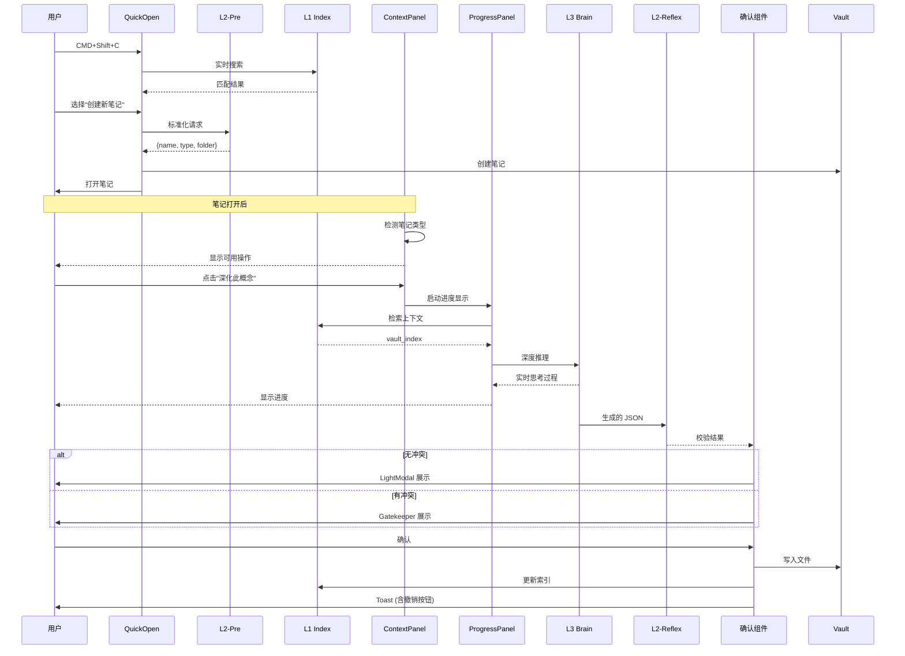

# Cognitive Razor (CR) - 产品需求文档

> **文档版本**: 2.2  
> **最后更新**: 2025-11-28  
> **文档性质**: 需求规格说明书，定义"做什么"而非"怎么做"

---

## 0. 元信息

### 0.1 文档结构说明

| 章节 | 内容 | 读者 |
| :--- | :--- | :--- |
| §1 系统定位 | 核心问题与目标 | 所有人 |
| §2 系统公理 | 不可违背的设计约束 | 架构师、开发者 |
| §3 领域模型 | 知识类型体系定义 | 所有人 |
| §4 系统架构 | 组件划分与数据流 | 架构师、开发者 |
| §5 功能规格 | 具体功能需求 | 产品、开发者 |
| §6 用户交互 | 交互原则与组件规格 | 产品、设计师、开发者 |
| §7 配置规格 | 可配置项定义 | 开发者 |
| §8 非功能需求 | 性能、可扩展性约束 | 架构师、开发者 |

### 0.2 术语表

| 术语 | 定义 |
| :--- | :--- |
| **知识节点** | 系统中的一个 Markdown 文件，对应一个语义唯一的概念 |
| **知识类型** | 知识节点的分类，共 6 种：Domain, Issue, Theory, Entity, Mechanism, Principle |
| **UID** | 每个知识节点的全局唯一标识符 (UUID v4) |
| **双链** | Obsidian 的 `[[WikiLink]]` 语法 |
| **Frontmatter** | Markdown 文件开头的 YAML 元数据块 |
| **QuickOpen** | 统一入口的智能搜索框组件 |
| **ContextPanel** | 上下文感知的侧边栏面板组件 |
| **Gatekeeper** | 用户确认写入操作的交互界面（仅在有冲突时触发） |
| **智能默认** | 系统根据相似度自动选择复用/新建的决策机制 |
| **动作修饰键** | 通过组合键触发不同操作深度的交互模式 |
| **暂存任务** | 用户中断后可恢复的进行中操作状态 |
| **批量快注** | 一次性输入多个概念并批量创建笔记的功能 |

---

## 1. 系统定位

### 1.1 核心问题 (First Principles)

本系统解决三个一阶问题：

| ID | 问题名称 | 问题描述 |
| :--- | :--- | :--- |
| **P1** | 高熵压缩 | 如何将自由形式的自然语言，转化为结构化、可复用的知识对象？ |
| **P2** | 语义去重 | 如何确保"同一本体"在知识库中只存在一个实例，避免语义重复？ |
| **P3** | 人机协作 | 如何在 AI 辅助生成的同时，保证人类对知识库的最终控制权？ |

### 1.2 目标函数 (Optimization Targets)

| ID | 目标 | 度量方式 |
| :--- | :--- | :--- |
| **G1** | 最小化语义重复 | 相似度 > 0.9 的节点对数量趋近于 0 |
| **G2** | 最大化信息密度 | 单个节点可独立作为参考单元（无需跳转即可理解核心概念） |
| **G3** | 最小化认知负载 | 单次操作中用户必须做出的决策数量 ≤ 3 |
| **G4** | 最小化操作摩擦 | 日常知识注入流程 ≤ 30 秒完成 |
| **G5** | 最大化智能决策 | 系统自动处理的决策占比 ≥ 80%（用户仅审核边界案例） |

### 1.3 系统定义

**Cognitive Razor 是一个基于 Obsidian 的"认知编译器"。**

- **输入**: 自然语言概念
- **输出**: 结构化、去重、带双链的 Markdown 知识图谱

---

## 2. 系统公理 (Inviolable Constraints)

以下规则为系统设计的硬约束，任何功能设计不得违背。

### A1. 语义唯一性

> 系统中任一"本体"只能存在一个 UID。

- **实施要求**: 任何新建节点在写入前，必须经过基于向量检索的等价候选检查。
- **违反后果**: 语义重复，目标 G1 失败。

### A2. 因果层级性

> 知识节点必须且只能属于 6 种类型之一。

| 类型 | 英文 | 判定标准 |
| :--- | :--- | :--- |
| 领域 | Domain | 可独立存在的知识边界，可 MECE 分解 |
| 议题 | Issue | 存在核心矛盾 (X vs. Y)，有多个理论尝试解决 |
| 理论 | Theory | 从公理出发，通过逻辑推演得出结论的体系 |
| 实体 | Entity | 定义时不需引用时间/过程，静态对象 |
| 机制 | Mechanism | 定义中必须包含状态变化或因果链，作用于 Entity |
| 原理 | Principle | 可表述为 IF-THEN 形式，在至少 2 个 Domain 中存在同构 |

- **违反后果**: 类型混淆，知识图谱逻辑断裂。

### A3. 人机共生性

> AI 生成建议，人类拥有唯一写入裁决权。

- **实施要求**: 
  - 禁止静默写入：任何文件修改必须经用户显式确认（确认摩擦与风险成正比）。
  - 可追溯性：任何写入操作可在日志中回溯到具体的用户确认事件。
  - 可撤销性：所有写入操作支持上下文感知撤销窗口（基础 10 秒，浏览新建文件时自动延长）。
  - 可中断恢复性：长时间操作可暂存进度，用户可在之后恢复。
- **违反后果**: 用户失去对知识库的控制权，目标 G3 失败。

### A4. 命名规范性

> 所有知识节点的规范名称必须采用 `中文术语 (English Term)` 格式。

- **例外处理**:
  - 无共识中文译名：文件名用英文，`aliases` 中补充描述性中文。
  - 数学符号/缩写：保留原形式，`aliases` 中维护说明。
- **违反后果**: 学术精确性丧失，搜索召回率下降。

### A5. 本地优先性

> 向量索引必须常驻本地，以 JSON 形式持久化。

- **实施要求**: 不得强依赖外部向量数据库。
- **违反后果**: 离线不可用，数据迁移困难。

### A6. 渐进披露性

> 系统复杂度应按用户熟练度逐步展现。

- **实施要求**:
  - 新用户默认启用简化模式
  - 高级功能可通过设置解锁
  - 类型判断由系统自动完成，用户仅在必要时介入
  - **零类型感知**：新用户无需理解 Entity/Mechanism 等术语，系统用自然语言描述类型差异
- **违反后果**: 新用户流失，目标 G3、G4 失败。

### A7. 注意力尊重性

> 系统推荐和提示应尊重用户当前注意力状态。

- **实施要求**:
  - 用户活跃输入时，仅更新状态栏数字，不弹出通知
  - 用户空闲时（无输入 ≥ 30秒），可展示完整洞察面板
  - 免打扰模式下，所有非关键通知静默
- **违反后果**: 打断用户心流，降低工具信任度。

---

## 3. 领域模型

### 3.1 知识类型关系图

```
Domain ──┬──> Issue ──> Theory ──┬──> Entity
         │                       └──> Mechanism ──> Principle
         └──────────────────────────────────────────↑
                    (跨域同构提取)
```

### 3.2 各类型详细定义

#### 3.2.1 Domain (领域)

| 属性 | 说明 |
| :--- | :--- |
| **本质** | 知识的边界划分，定义"什么属于/不属于这个学科" |
| **必要字段** | definition, teleology, methodology, boundaries |
| **可选结构** | sub_domains (若非原子领域), emergent_issues |
| **验证条件** | 定义不引用其他 Domain 的概念作为基础 |

#### 3.2.2 Issue (议题)

| 属性 | 说明 |
| :--- | :--- |
| **本质** | 尚未完全解决的问题，存在核心矛盾 |
| **必要字段** | core_tension (X vs. Y 格式), theories |
| **验证条件** | 必须存在 ≥2 个不同理论尝试解决此议题 |

#### 3.2.3 Theory (理论)

| 属性 | 说明 |
| :--- | :--- |
| **本质** | 从公理出发的逻辑推演体系 |
| **必要字段** | axioms, argument_chain, core_predictions |
| **验证条件** | argument_chain 中每步推理必须有逻辑连接词 |

#### 3.2.4 Entity (实体)

| 属性 | 说明 |
| :--- | :--- |
| **本质** | 静态概念，可在不引用时间/过程的前提下完成定义 |
| **必要字段** | definition, properties |
| **验证条件** | definition 中不包含"过程"、"变化"、"演化"等动态词汇 |

#### 3.2.5 Mechanism (机制)

| 属性 | 说明 |
| :--- | :--- |
| **本质** | 动态过程，描述状态变化或因果链 |
| **必要字段** | causal_chain (非空), operates_on (≥1 个 Entity) |
| **验证条件** | causal_chain.length ≥ 2 |

#### 3.2.6 Principle (原理)

| 属性 | 说明 |
| :--- | :--- |
| **本质** | 跨域抽象，从多个 Mechanism 中提取的不变量 |
| **必要字段** | formal_statement (IF-THEN 格式), source_mechanisms |
| **验证条件** | source_mechanisms 来自 ≥2 个不同 Domain |

### 3.3 简化模式类型映射

| 完整模式 | 简化模式 | 说明 |
| :--- | :--- | :--- |
| Domain | (隐藏) | 新用户无需管理领域边界 |
| Issue | (隐藏) | 议题作为 Domain 的附属展示 |
| Theory | (隐藏) | 理论作为背景知识引用 |
| Entity | Entity | 保留 |
| Mechanism | Mechanism | 保留 |
| Principle | Principle | 保留 |

---

## 4. 系统架构

### 4.1 组件概览

```
┌─────────────────────────────────────────────────────────────┐
│                        用户交互层                            │
│   [QuickOpen] [ContextPanel] [ProgressPanel] [Gatekeeper]   │
│   [StatusBar] [Toast] [SettingsTab]                         │
└───────────────────────────┬─────────────────────────────────┘
                            │
┌───────────────────────────▼─────────────────────────────────┐
│                        业务逻辑层                            │
│  ┌──────────────────────────────────────────────────────┐  │
│  │                   AgentRouter                         │  │
│  │   (根据笔记类型自动路由到对应 Agent)                   │  │
│  └──────────────────────────────────────────────────────┘  │
│  ┌──────────┐  ┌──────────┐  ┌──────────┐  ┌──────────┐    │
│  │  Agent A │  │  Agent B │  │  Agent C │  │  Agent D │    │
│  │  Mapper  │  │  Probe   │  │ Deconst. │  │  Synth.  │    │
│  └────┬─────┘  └────┬─────┘  └────┬─────┘  └────┬─────┘    │
│       └─────────────┴─────────────┴─────────────┘          │
│                            │                                │
│  ┌─────────────────────────▼─────────────────────────────┐ │
│  │              Prompt Manager (变量注入)                 │ │
│  └───────────────────────────────────────────────────────┘ │
└───────────────────────────┬─────────────────────────────────┘
                            │
┌───────────────────────────▼─────────────────────────────────┐
│                        服务层                                │
│  ┌────────────────┐  ┌────────────────┐  ┌───────────────┐ │
│  │  LLM Service   │  │ Vector Manager │  │ File Manager  │ │
│  │  (L2/L3 调用)   │  │  (L1 索引)     │  │ (读写 Vault)  │ │
│  └────────────────┘  └────────────────┘  └───────────────┘ │
│  ┌────────────────┐  ┌────────────────┐                    │
│  │ WriteOperation │  │ UndoManager    │                    │
│  │   (写入追踪)    │  │  (撤销管理)    │                    │
│  └────────────────┘  └────────────────┘                    │
└─────────────────────────────────────────────────────────────┘
```

### 4.2 模型分层

| 层级 | 名称 | 模型 | 职责 |
| :--- | :--- | :--- | :--- |
| **L2-Pre** | Standardizer | Gemini 2.5 Flash | 输入标准化、类型推断 |
| **L1** | Index | Embedding + 本地内存 | 向量计算、相似度检索、去重 |
| **L3** | Brain | Gemini 3.0 Pro | 深度推理、结构化生成 |
| **L2-Reflex** | Validator | Gemini 2.5 Flash + Search | 格式校验、事实核查 |

### 4.3 数据流



---

## 5. 功能规格

### 5.1 命令列表

| 命令 ID | 名称 | 快捷键 | 功能 |
| :--- | :--- | :--- | :--- |
| `cr:open` | Cognitive Razor | `CMD+Shift+C` | 打开 QuickOpen 智能搜索框 |
| `cr:enhance` | 深化当前概念 | `CMD+Shift+D` | 对当前笔记触发对应 Agent |
| `cr:undo` | 撤销上次写入 | `CMD+Z` (上下文) | 撤销最近一次 CR 写入操作 |
| `cr:rebuild-index` | 重建索引 | - | 重建向量缓存 |
| `cr:toggle-panel` | 切换侧边栏 | - | 显示/隐藏 ContextPanel |

### 5.2 QuickOpen (智能搜索框) 规格

#### 5.2.1 触发方式

- 快捷键: `CMD+Shift+C` (macOS) / `Ctrl+Shift+C` (Windows)
- 命令面板: "Cognitive Razor: Open"

#### 5.2.2 界面规格

```
┌─────────────────────────────────────────────────────┐
│  🔍 │ 输入框                                    │ × │
├─────────────────────────────────────────────────────┤
│  搜索结果区域                                       │
│  ┌───────────────────────────────────────────────┐ │
│  │ 📄 现有笔记: 纳什均衡 (Nash Equilibrium)      │ │
│  │    Entity │ 相似度 98% │ 04_Entities/        │ │
│  ├───────────────────────────────────────────────┤ │
│  │ ✨ 创建新笔记                                  │ │
│  │    预测类型: Entity │ 置信度: 0.92            │ │
│  │    ─────────────────────────────────────────  │ │
│  │    ⏎ 创建  │  ⇧⏎ 创建+深化  │  ^⏎ 创建+侧栏  │ │
│  └───────────────────────────────────────────────┘ │
├─────────────────────────────────────────────────────┤
│  最近访问: 博弈论 │ 囚徒困境 │ 帕累托最优          │
└─────────────────────────────────────────────────────┘
```

#### 5.2.3 交互逻辑

| 用户操作 | 系统响应 |
| :--- | :--- |
| 输入文字 | 防抖 150ms 后触发搜索，实时更新结果 |
| `↑` / `↓` | 在搜索结果中导航 |
| `Enter` | 执行选中项（打开现有 / 创建空白笔记） |
| `Shift+Enter` | 创建并立即触发深化（一键流程） |
| `Ctrl+Enter` | 创建并打开 ContextPanel（半自动） |
| `Tab` | 在现有笔记和"创建新笔记"之间切换 |
| `Escape` | 关闭 QuickOpen |
| 点击最近访问项 | 直接打开该笔记 |
| 输入逗号分隔的多个词 | 切换至批量快注模式 |

#### 5.2.4 批量快注模式

当用户输入包含逗号分隔的多个词时，自动切换至批量模式：

```
┌─────────────────────────────────────────────────────┐
│  🔍 │ 纳什均衡, 帕累托最优, 囚徒困境            │ × │
├─────────────────────────────────────────────────────┤
│  📦 批量创建 3 个笔记                               │
│  ┌───────────────────────────────────────────────┐ │
│  │ ☑️ 纳什均衡 (Nash Equilibrium)                │ │
│  │    预测类型: Entity │ 置信度: 0.94            │ │
│  ├───────────────────────────────────────────────┤ │
│  │ ⚠️ 帕累托最优 (Pareto Optimality)             │ │
│  │    与现有笔记相似度 92% → 需审核               │ │
│  ├───────────────────────────────────────────────┤ │
│  │ ☑️ 囚徒困境 (Prisoner's Dilemma)              │ │
│  │    预测类型: Mechanism │ 置信度: 0.88         │ │
│  └───────────────────────────────────────────────┘ │
├─────────────────────────────────────────────────────┤
│    [取消]        [逐个审核]        [一键创建]       │
└─────────────────────────────────────────────────────┘
```

**批量模式交互**:
- 无冲突项直接勾选
- 有冲突项（相似度 ≥ 0.9）标记警告
- [一键创建]: 创建所有无冲突项，冲突项跳过
- [逐个审核]: 切换到 Gatekeeper 逐项处理

#### 5.2.5 搜索逻辑

```typescript
interface SearchResult {
  type: "EXISTING" | "CREATE_NEW" | "BATCH_CREATE";
  // EXISTING 时
  file?: TFile;
  similarity?: number;
  // CREATE_NEW 时
  predictedType?: KnowledgeType;
  confidence?: number;
  standardName?: string;
  // BATCH_CREATE 时
  items?: BatchItem[];
}

interface BatchItem {
  input: string;
  standardName: string;
  predictedType: KnowledgeType;
  confidence: number;
  conflict?: {
    existingFile: TFile;
    similarity: number;
  };
}

// 搜索优先级
1. 精确匹配文件名 → 置顶
2. 向量相似度 > 0.8 → 按相似度排序
3. 别名匹配 → 次优先
4. 始终显示"创建新笔记"选项
5. 检测逗号分隔 → 切换批量模式
```

### 5.3 ContextPanel (上下文侧边栏) 规格

#### 5.3.1 触发方式

- 自动: 打开任意 CR 管理的笔记时显示
- 手动: 命令面板 "CR: Toggle Panel"

#### 5.3.2 界面规格

```
┌─────────────────────────────────────┐
│ 📊 Cognitive Razor            [−]  │
├─────────────────────────────────────┤
│ 当前笔记                            │
│ ┌─────────────────────────────────┐ │
│ │ 博弈论 (Game Theory)            │ │
│ │ 类型: Domain │ 状态: Stub       │ │
│ └─────────────────────────────────┘ │
├─────────────────────────────────────┤
│ 可用操作                            │
│ ┌─────────────────────────────────┐ │
│ │ 🗺️ 绘制领域地图                  │ │
│ │ 生成子领域 + 核心议题            │ │
│ │ ⏱️ 预计耗时: ~15秒               │ │
│ │                    [执行]       │ │
│ └─────────────────────────────────┘ │
├─────────────────────────────────────┤
│ 知识库洞察                   [刷新] │
│ • 3 个相关 Entity 已存在           │
│ • 发现 1 个潜在重复                 │
│ • 建议: 先完成 [[微观经济学]]       │
└─────────────────────────────────────┘
```

#### 5.3.3 Agent 路由规则

| 笔记类型 | 笔记状态 | 显示的操作 | 对应 Agent |
| :--- | :--- | :--- | :--- |
| Domain | Stub | 绘制领域地图 | Agent A |
| Domain | Draft+ | 刷新子领域 / 深入子领域 | Agent A (增量) |
| Issue | Any | 探索理论解空间 | Agent B |
| Theory | Stub | 解构理论 | Agent C |
| Theory | Draft+ | 补充组件 / 验证论证链 | Agent C (增量) |
| Entity | Any | 查找相关机制 | L1 检索 |
| Mechanism | Any | 查看可合成原理 | Agent D (预览) |
| Any | Any (多选) | 合成原理 | Agent D |

### 5.4 ProgressPanel (进度面板) 规格

#### 5.4.1 触发方式

- 任何 L3 调用自动触发

#### 5.4.2 界面规格

```
┌─────────────────────────────────────────────────┐
│ 🧠 解构理论: 纳什均衡               [暂存] [取消] │
├─────────────────────────────────────────────────┤
│ ████████████░░░░░░░░ 60%  预计剩余 8s           │
├─────────────────────────────────────────────────┤
│ ✓ 解析理论结构                         2.1s    │
│ ✓ 检索知识库 (找到 23 个相关概念)      1.8s    │
│ ● 深度推理中...                                 │
│   └─ 正在分析公理基础                           │
│ ○ 校验输出                                      │
│ ○ 事实核查                                      │
├─────────────────────────────────────────────────┤
│ 💭 思考过程 (实时):                             │
│ "该理论基于理性人假设，我需要首先识别其         │
│  公理基础，然后追踪论证链..."                   │
└─────────────────────────────────────────────────┘
```

#### 5.4.3 阶段定义

```typescript
enum ProcessStage {
  PARSING = "解析输入",
  RETRIEVING = "检索知识库",
  THINKING = "深度推理",
  VALIDATING = "校验输出",
  FACT_CHECKING = "事实核查",
  PREPARING = "准备结果"
}

interface StageProgress {
  stage: ProcessStage;
  status: "pending" | "running" | "completed" | "failed" | "suspended";
  duration?: number;  // 毫秒
  detail?: string;    // 如 "找到 23 个相关概念"
}
```

#### 5.4.4 暂存与恢复机制

当用户点击 [取消] 时：

```
┌─────────────────────────────────────────────────┐
│ 💾 是否保存当前进度？                           │
├─────────────────────────────────────────────────┤
│ 任务: 解构理论 - 纳什均衡                       │
│ 当前进度: 60%                                   │
│                                                 │
│ 暂存后可在下次打开该笔记时恢复。                │
├─────────────────────────────────────────────────┤
│        [丢弃]              [暂存]               │
└─────────────────────────────────────────────────┘
```

**暂存数据结构**:

```typescript
interface SuspendedTask {
  id: string;
  targetFile: string;           // 关联笔记路径
  agentType: string;            // Agent A/B/C/D
  stage: ProcessStage;          // 中断时的阶段
  progress: number;             // 0-100
  partialResult?: any;          // 已完成阶段的结果
  context: {
    vaultIndex: string[];       // 已检索的上下文
    llmResponse?: string;       // 部分 LLM 响应
  };
  suspendedAt: number;          // 时间戳
  expiresAt: number;            // 24小时后过期
}
```

**恢复入口 (ContextPanel)**:

```
┌─────────────────────────────────────┐
│ 📦 发现未完成任务                   │
│ ┌─────────────────────────────────┐ │
│ │ 解构理论: 纳什均衡               │ │
│ │ 进度: 60% │ 暂存于 2 小时前     │ │
│ │              [恢复] [丢弃]       │ │
│ └─────────────────────────────────┘ │
└─────────────────────────────────────┘
```

**状态栏暂存指示器**:

```
... │ CR: 📊 1,234 │ 🔔 2 │ 📦 1 │
                          ↑
                     暂存任务数
```

### 5.5 确认系统规格 (分级)

#### 5.5.1 确认级别定义

| 级别 | 名称 | 触发条件 | 确认方式 |
| :--- | :--- | :--- | :--- |
| **L0** | 无确认 | 创建空白笔记 | 直接执行 |
| **L1** | Toast | 复用现有组件 / 智能默认自动处理 | 通知 + 撤销 |
| **L2** | LightModal | 新建组件，无冲突 | 列表 + 一键确认 |
| **L3** | Gatekeeper | 新建组件，有边界冲突 | 逐项审核 |

#### 5.5.2 智能默认机制 (Smart Defaults)

> 原则：系统自动处理高置信度决策，仅将边界案例交由用户裁决。

**相似度分层处理**:

| 相似度范围 | 系统行为 | 用户体验 |
| :--- | :--- | :--- |
| **≥ 0.95** | 自动选择"复用现有" | Toast 提示，可撤销 |
| **[0.9, 0.95)** | 展开 Gatekeeper | 需用户审核 |
| **< 0.9** | 视为新建 | 进入 LightModal |

**智能默认 Toast**:

```
┌─────────────────────────────────────────────────────────────┐
│ 🔗 已自动复用现有笔记: 均衡 (Equilibrium)   [查看] [撤销]  │
│    原因: 相似度 97%，与 "均衡状态" 语义等价                │
└─────────────────────────────────────────────────────────────┘
```

**决策日志** (供高级用户审计):

```typescript
interface SmartDefaultLog {
  timestamp: number;
  action: "AUTO_REUSE" | "AUTO_CREATE";
  input: string;
  decision: {
    chosenOption: string;
    similarity?: number;
    reason: string;
  };
  canUndo: boolean;
  undoExpiresAt: number;
}
```

#### 5.5.3 LightModal 规格

```
┌─────────────────────────────────────────────────────┐
│ ✨ 将创建 3 个新笔记                                │
├─────────────────────────────────────────────────────┤
│ ☑️ 纳什均衡 (Nash Equilibrium)                      │
│    类型: Entity │ 目录: 04_Entities/               │
│ ☑️ 策略空间 (Strategy Space)                        │
│    类型: Entity │ 目录: 04_Entities/               │
│ ☑️ 均衡选择 (Equilibrium Selection)                 │
│    类型: Mechanism │ 目录: 05_Mechanisms/          │
├─────────────────────────────────────────────────────┤
│           [取消]              [✓ 创建全部] (Enter) │
└─────────────────────────────────────────────────────┘
```

**交互**:
- 点击复选框: 切换该项的选中状态
- `Enter`: 创建所有选中项
- `Escape`: 取消

#### 5.5.3 Gatekeeper 规格

```
┌───────────────────────────────────────────────────────────────┐
│ ⚠️ 发现潜在重复 - 请审核                               [×]   │
├───────────────────────────────────────────────────────────────┤
│ AI 建议新建              │  可能重复的现有笔记                │
├──────────────────────────┼────────────────────────────────────┤
│ ⚠️ 均衡状态               │  🔗 均衡 (Equilibrium)            │
│    Entity                │     相似度: 92%                   │
│ ┌──────────────────────┐ │  ┌────────────────────────────┐   │
│ │ "博弈中各方策略相互  │ │  │ "系统无净变化的稳定状态，  │   │
│ │  最优响应的稳定状态" │ │  │  广泛用于物理和经济学..."  │   │
│ └──────────────────────┘ │  └────────────────────────────┘   │
│                          │                                    │
│  决策: ○ 使用现有笔记   ● 仍然新建                           │
├──────────────────────────┴────────────────────────────────────┤
│ ☑️ 支付矩阵 (Payoff Matrix)                                   │
│    Entity │ 无冲突                                            │
├───────────────────────────────────────────────────────────────┤
│ 统计: 1 项冲突 │ 1 项无冲突                                   │
├───────────────────────────────────────────────────────────────┤
│    [取消]        [跳过冲突项]        [确认并写入]             │
└───────────────────────────────────────────────────────────────┘
```

**交互**:
- 点击现有笔记链接: 在新标签页预览
- 单选按钮: 选择"使用现有"或"仍然新建"
- [跳过冲突项]: 只写入无冲突的项
- [确认并写入]: 按当前选择写入所有项

### 5.6 撤销系统规格

#### 5.6.1 上下文感知撤销窗口

> 原则：撤销窗口应与用户审核新内容的时间成正比。

**窗口时长规则**:

| 场景 | 撤销窗口 |
| :--- | :--- |
| 基础窗口 | 10 秒 |
| 用户正在浏览新创建的笔记 | 延长至离开该笔记 + 5 秒 |
| 最大上限 | 60 秒 |

**实现逻辑**:

```typescript
interface WriteOperation {
  id: string;
  timestamp: number;
  files: Array<{
    path: string;
    action: "CREATE" | "UPDATE" | "DELETE";
    previousContent?: string;
    newContent?: string;
  }>;
  indexChanges: Array<{
    uid: string;
    action: "ADD" | "UPDATE" | "REMOVE";
    previousVector?: number[];
  }>;
  baseExpiresAt: number;      // timestamp + 10000
  extendedExpiresAt?: number; // 动态延长
  
  // 上下文感知
  isUserViewingCreatedFile(): boolean;
  getCurrentExpiresAt(): number;
}

// 动态计算过期时间
function getCurrentExpiresAt(op: WriteOperation): number {
  if (op.isUserViewingCreatedFile()) {
    // 用户正在查看新建文件，持续延长
    return Math.min(
      Date.now() + 5000,        // 离开后再给 5 秒
      op.timestamp + 60000      // 最大 60 秒
    );
  }
  return op.baseExpiresAt;
}
```

#### 5.6.2 Toast 通知

```
┌─────────────────────────────────────────────────────────────┐
│ ✓ 已创建 3 个笔记                           [撤销] ████░░  │
│   正在浏览新笔记，撤销窗口已延长                            │
└─────────────────────────────────────────────────────────────┘
```

#### 5.6.3 撤销操作

1. 用户点击 [撤销] 或按 `CMD+Z` (在 CR 上下文中)
2. 系统检查 `WriteOperation.getCurrentExpiresAt()`
3. 若未过期:
   - 逆向执行所有文件操作
   - 逆向执行所有索引变更
   - Toast: "已撤销"
4. 若已过期:
   - Toast: "撤销窗口已关闭"

### 5.7 新用户引导规格

#### 5.7.1 首次启动检测

```typescript
interface OnboardingState {
  hasCompletedOnboarding: boolean;
  onboardingVersion: string;  // 用于未来引导更新
  simpleModeEnabled: boolean;
  tutorialProgress: number;   // 0-100
}
```

#### 5.7.2 欢迎界面

```
┌─────────────────────────────────────────────────────────────┐
│ 🎯 欢迎使用 Cognitive Razor                                 │
├─────────────────────────────────────────────────────────────┤
│                                                             │
│ CR 帮助你将知识结构化为可复用的"知识图谱"。                 │
│                                                             │
│ 选择你的起点:                                               │
│                                                             │
│ ┌─────────────────────┐  ┌─────────────────────┐            │
│ │  🌱 从零开始         │  │  📚 导入现有笔记    │            │
│ │  创建第一个概念      │  │  扫描并分类现有文件 │            │
│ └─────────────────────┘  └─────────────────────┘            │
│                                                             │
│ ┌─────────────────────┐                                     │
│ │  🎓 交互式教程       │                                    │
│ │  5 分钟了解核心概念  │                                    │
│ └─────────────────────┘                                     │
│                                                             │
│                              [跳过，我已了解 CR]             │
└─────────────────────────────────────────────────────────────┘
```

#### 5.7.3 交互式教程流程

| 步骤 | 内容 | 用户操作 |
| :--- | :--- | :--- |
| 1 | 介绍 CR 核心理念 | 阅读 → 下一步 |
| 2 | 演示 QuickOpen | 按 `CMD+Shift+C` |
| 3 | 创建第一个 Entity: "苹果" | 输入并确认 |
| 4 | 演示 ContextPanel | 观察侧边栏 |
| 5 | 创建第一个 Mechanism: "光合作用" | 使用 QuickOpen |
| 6 | 展示自动双链 | 观察链接关系 |
| 7 | 完成！ | 开始使用 |

#### 5.7.4 简化模式规格

| 配置项 | 完整模式 | 简化模式 |
| :--- | :--- | :--- |
| 可见类型 | 6 种 | 3 种 (Entity, Mechanism, Principle) |
| Frontmatter 字段 | 完整 | 仅 uid, type, aliases |
| 可用 Agent | 全部 | 仅 Agent C |
| 冲突检测 | 详细分析 | 简单提示 |
| 隐式推荐 | 开启 | 关闭 |
| 类型显示 | 技术术语 | 自然语言描述 |

切换方式: 设置 → 高级 → 简化模式 (开/关)

#### 5.7.5 零类型感知模式 (Type-Transparent Mode)

> 原则：新用户无需理解 Entity/Mechanism 等术语，系统用自然语言描述类型差异。

**类型歧义询问界面** (仅当置信度 < 0.7 时触发):

```
┌─────────────────────────────────────────────────────────────┐
│ 💡 "光合作用" 更接近哪种概念？                              │
├─────────────────────────────────────────────────────────────┤
│                                                             │
│ ┌─────────────────────────────────────────────────────────┐ │
│ │  🔄 一个过程或机制                                      │ │
│ │     描述"如何发生"、有步骤、有因果关系                  │ │
│ │     例如: 消化、光合作用、市场调节                      │ │
│ └─────────────────────────────────────────────────────────┘ │
│                                                             │
│ ┌─────────────────────────────────────────────────────────┐ │
│ │  📦 一个静态概念                                        │ │
│ │     描述"是什么"、可定义、不涉及变化                    │ │
│ │     例如: 细胞、原子、纳什均衡                          │ │
│ └─────────────────────────────────────────────────────────┘ │
│                                                             │
│                              [让系统自动判断]               │
└─────────────────────────────────────────────────────────────┘
```

**技术术语到自然语言的映射**:

| 技术类型 | 简化模式显示 | 自然语言描述 |
| :--- | :--- | :--- |
| Entity | 概念 | 静态的、可定义的对象 |
| Mechanism | 过程 | 有步骤、有因果的动态变化 |
| Principle | 规律 | 跨领域的通用模式 |
| Domain | (隐藏) | — |
| Issue | (隐藏) | — |
| Theory | (隐藏) | — |

### 5.8 状态栏规格

#### 5.8.1 显示内容

```
... [其他状态栏项] ... │ CR: 📊 1,234 │ 🔔 2 │ 📦 1 │
```

| 元素 | 含义 | 点击行为 |
| :--- | :--- | :--- |
| `📊 1,234` | 索引中的节点数量 | 打开索引统计面板 |
| `🔔 2` | 待查看的洞察数量 | 打开洞察面板 |
| `📦 1` | 暂存任务数量 | 打开暂存任务列表 |

#### 5.8.2 索引统计面板

```
┌─────────────────────────────────────┐
│ 📊 知识库统计                       │
├─────────────────────────────────────┤
│ 总节点数: 1,234                     │
│ ├─ Domain: 12                       │
│ ├─ Issue: 34                        │
│ ├─ Theory: 56                       │
│ ├─ Entity: 678                      │
│ ├─ Mechanism: 345                   │
│ └─ Principle: 109                   │
├─────────────────────────────────────┤
│ 索引状态: ✓ 已同步                  │
│ 上次更新: 2 分钟前                  │
├─────────────────────────────────────┤
│ [重建索引]                          │
└─────────────────────────────────────┘
```

### 5.9 隐式推荐规格 (注意力感知)

#### 5.9.1 触发条件

基础条件：
- 新增/更新 Mechanism ≥ 3 个
- 距上次推荐 ≥ 5 分钟
- 简化模式关闭
- 免打扰模式关闭

**注意力感知条件** (新增):
- **活跃态** (用户正在输入): 仅更新状态栏 🔔 数字，不弹出通知
- **空闲态** (无输入 ≥ 30秒): 可展示 ContextPanel 轻动画提示
- **手动查看**: 用户点击状态栏时完整展开洞察面板

#### 5.9.2 用户状态检测

```typescript
enum UserAttentionState {
  ACTIVE = "active",       // 30秒内有输入
  IDLE = "idle",           // 30秒无输入
  AWAY = "away"            // 5分钟无任何活动
}

interface AttentionTracker {
  lastInputTime: number;
  lastActivityTime: number;
  getCurrentState(): UserAttentionState;
}

// 推荐展示策略
function shouldShowInsight(state: UserAttentionState, priority: "low" | "high"): ShowStrategy {
  if (state === "ACTIVE") {
    return "STATUS_BAR_ONLY";  // 仅状态栏数字
  } else if (state === "IDLE") {
    return priority === "high" ? "PANEL_ANIMATION" : "STATUS_BAR_ONLY";
  } else {
    return "DEFER";  // 用户不在，延迟到回来后
  }
}
```

#### 5.9.3 推荐逻辑

1. 对新增 Mechanism 计算跨 Domain 相似度
2. 筛选：相似度 > insight_threshold 且与现有 Principle 相似度 < 0.7
3. 聚类为推荐组
4. **检查用户注意力状态**
5. 按策略更新状态栏或展示面板

#### 5.9.4 洞察面板

```
┌─────────────────────────────────────────────────────────────┐
│ 💡 发现潜在原理                                      [×]   │
├─────────────────────────────────────────────────────────────┤
│ 以下机制可能存在共同的抽象原理:                            │
│                                                             │
│ ┌─────────────────────────────────────────────────────────┐ │
│ │ 组 1: 反馈循环模式                                      │ │
│ │ • [[负反馈调节 (Negative Feedback)]] (生物学)          │ │
│ │ • [[市场均衡调整 (Market Equilibration)]] (经济学)     │ │
│ │ • [[PID 控制 (PID Control)]] (控制论)                  │ │
│ │                                                         │ │
│ │ 置信度: 87% │ 预计新原理: 稳态维持原理                  │ │
│ │                              [合成原理] [稍后再说]      │ │
│ └─────────────────────────────────────────────────────────┘ │
│                                                             │
│ ┌─────────────────────────────────────────────────────────┐ │
│ │ 组 2: 级联放大模式                                      │ │
│ │ ...                                                     │ │
│ └─────────────────────────────────────────────────────────┘ │
└─────────────────────────────────────────────────────────────┘
```

---

## 6. 用户交互规格

### 6.1 交互设计原则

| 原则 | 说明 | 对应公理 |
| :--- | :--- | :--- |
| **单一入口** | 所有 CR 功能通过统一热键 `CMD+Shift+C` 访问 | A6 |
| **类型透明** | 用户无需预先判断知识类型，系统自动推断 | A6 |
| **渐进确认** | 确认摩擦与操作风险成正比 | A3 |
| **智能默认** | 高置信度决策自动处理，仅边界案例需用户介入 | G5 |
| **实时反馈** | 任何超过 2 秒的操作必须有进度指示 | G4 |
| **上下文感知撤销** | 撤销窗口随用户审核行为动态延长 | A3 |
| **注意力尊重** | 根据用户状态选择通知方式 | A7 |
| **批量友好** | 支持一次性处理多个概念 | G4 |

### 6.2 快捷键设计

| 快捷键 | macOS | Windows | 功能 | 适用场景 |
| :--- | :--- | :--- | :--- | :--- |
| 主入口 | `CMD+Shift+C` | `Ctrl+Shift+C` | 打开 QuickOpen | 全局 |
| 深化 | `CMD+Shift+D` | `Ctrl+Shift+D` | 触发当前笔记的 Agent | CR 笔记内 |
| 创建+深化 | `Shift+Enter` | `Shift+Enter` | 创建并立即深化 | QuickOpen 中 |
| 创建+侧栏 | `Ctrl+Enter` | `Ctrl+Enter` | 创建并打开侧栏 | QuickOpen 中 |
| 撤销 | `CMD+Z` | `Ctrl+Z` | 撤销 CR 写入 | 撤销窗口内 |
| 关闭 | `Escape` | `Escape` | 关闭当前 Modal | 任意 Modal |
| 确认 | `Enter` | `Enter` | 确认默认操作 | 任意 Modal |
| 导航 | `Tab` / `↑↓` | `Tab` / `↑↓` | 在选项间移动 | QuickOpen / Modal |

### 6.3 通知系统

| 级别 | 触发场景 | 展示方式 | 持续时间 | 可交互 |
| :--- | :--- | :--- | :--- | :--- |
| **Info** | 操作成功 | Toast (右下) | 3秒 | 否 |
| **Success** | 写入完成 | Toast + 撤销按钮 | 上下文感知 | 是 |
| **SmartDefault** | 智能默认自动处理 | Toast + 查看/撤销 | 10秒 | 是 |
| **Warning** | 潜在问题 | Toast (黄色) | 5秒 | 否 |
| **Error** | 操作失败 | Modal + 诊断 | 需关闭 | 是 |
| **Insight** | 新洞察 | 按注意力状态 | 持久 | 是 |

### 6.4 错误处理与恢复 (智能诊断)

| 错误类型 | 触发条件 | 处理方式 | 用户操作 |
| :--- | :--- | :--- | :--- |
| 网络超时 | API 调用 > 30秒 | 指数退避重试 (max 3次) | 等待 / 取消 / 暂存 |
| 网络失败 | 3次重试均失败 | 智能诊断 Modal | 一键修复建议 |
| JSON 解析失败 | LLM 输出格式错误 | L2-Reflex 自动修复 | 通常无感知 |
| 修复失败 | 自动修复失败 | 输出原始响应到 Debug | 手动处理 / 报告问题 |
| 索引损坏 | 向量数据不一致 | 提示重建 | 点击重建 |
| 写入冲突 | 文件被外部修改 | 提示冲突 | 覆盖 / 跳过 / 合并 |
| API 密钥无效 | 认证失败 | 智能诊断 + 一键跳转 | [打开设置 →] |

#### 智能诊断错误 Modal 规格

```
┌─────────────────────────────────────────────────────────────┐
│ ❌ 操作失败: API 密钥无效                             [×]   │
├─────────────────────────────────────────────────────────────┤
│ 🔍 诊断结果: Gemini API 认证失败                            │
│                                                             │
│ 🛠️ 建议操作:                                                │
│ ┌─────────────────────────────────────────────────────────┐ │
│ │ 1. [打开设置并跳转到 API 配置 →]  ← 一键跳转            │ │
│ │ 2. 确保密钥以 "AIza" 开头                               │ │
│ │ 3. 检查是否有多余空格或换行                             │ │
│ │ 4. 确认 API 配额未用尽                                  │ │
│ └─────────────────────────────────────────────────────────┘ │
│                                                             │
│ 错误详情:                                                   │
│ ┌─────────────────────────────────────────────────────────┐ │
│ │ AuthError: Invalid API key provided                    │ │
│ │ at GeminiService.authenticate (...)                    │ │
│ └─────────────────────────────────────────────────────────┘ │
│                                                             │
│    [复制错误日志]              [重试]                       │
└─────────────────────────────────────────────────────────────┘
```

**常见错误诊断映射**:

| 错误码/关键词 | 诊断结果 | 建议操作 |
| :--- | :--- | :--- |
| `401` / `Invalid API key` | API 密钥无效 | 跳转设置页 |
| `429` / `Rate limit` | 请求频率超限 | 等待 1 分钟后重试 |
| `timeout` | 网络超时 | 检查网络 / 使用代理 |
| `ENOTFOUND` | DNS 解析失败 | 检查网络连接 |
| `JSON parse error` | 响应格式错误 | 自动重试 / 报告问题 |

### 6.5 完整用户旅程

#### 6.5.1 新用户首次使用 (5分钟)

```
安装插件
    ↓
首次启动 → 欢迎界面
    ↓
选择 "🎓 交互式教程"
    ↓
步骤1: 阅读核心理念介绍
    ↓
步骤2: 按 CMD+Shift+C 体验 QuickOpen
    ↓
步骤3: 创建第一个 Entity "苹果 (Apple)"
    ↓
步骤4: 观察 ContextPanel 侧边栏
    ↓
步骤5: 创建 Mechanism "光合作用 (Photosynthesis)"
    ↓
步骤6: 观察自动生成的双链关系
    ↓
完成！开始正式使用
```

#### 6.5.2 日常知识注入 (30秒)

```
CMD+Shift+C 打开 QuickOpen
    ↓
输入 "纳什均衡"
    ↓
系统实时显示:
├─ 无精确匹配
└─ ✨ 创建新笔记 (预测: Entity, 置信度 92%)
    ↓
按 Enter → 笔记创建并打开
    ↓
ContextPanel 显示: "🗺️ 深化此概念"
    ↓
点击 [执行] → ProgressPanel 显示推理过程
    ↓
~15秒后 → LightModal 显示待创建组件
    ↓
Enter 确认 → Toast: "已创建 3 个笔记 [撤销]"
```

#### 6.5.3 处理冲突 (约1分钟)

```
(同上至 ProgressPanel 完成)
    ↓
检测到相似度 > 0.9 的现有节点
    ↓
Gatekeeper 弹出，显示冲突详情
    ↓
用户审核:
├─ 点击现有笔记链接 → 新标签预览
├─ 比较定义差异
└─ 选择 "使用现有" 或 "仍然新建"
    ↓
点击 [确认并写入]
    ↓
Toast: "已创建 2 个笔记，复用 1 个 [撤销]"
```

---

## 7. 配置规格

### 7.1 配置结构 (TypeScript)

```typescript
interface CognitiveRazorSettings {
  // ===== API 配置 =====
  api: {
    geminiApiKey: string;
    customEndpoint?: string;
  };
  
  // ===== 存储配置 =====
  storage: {
    folders: {
      index: string;      // 默认 "00_Index"
      domain: string;     // 默认 "01_Domains"
      issue: string;      // 默认 "02_Issues"
      theory: string;     // 默认 "03_Theories"
      entity: string;     // 默认 "04_Entities"
      mechanism: string;  // 默认 "05_Mechanisms"
      principle: string;  // 默认 "06_Principles"
    };
    namingTemplates: {
      [type: string]: string;  // 默认 "{{chinese}} ({{english}})"
    };
  };
  
  // ===== 向量索引配置 =====
  vectorIndex: {
    embeddingModel: string;
    deduplicationThreshold: number;    // 默认 0.9, 范围 [0.7, 1.0]
    insightThreshold: number;          // 默认 0.85, 范围 [0.6, 1.0]
    contextRetrievalCount: number;     // 默认 50
  };
  
  // ===== 模型参数配置 =====
  modelParams: {
    l2Pre: ModelParams;
    l3: { [agentId: string]: L3ModelParams };
    l2Reflex: ModelParams;
  };
  
  // ===== 校验配置 =====
  validation: {
    enableGrounding: boolean;          // 默认 true
    groundingDepth: "QUICK" | "STANDARD" | "THOROUGH";
  };
  
  // ===== 用户体验配置 =====
  ux: {
    simpleMode: boolean;               // 默认 true (新用户)
    typeTransparentMode: boolean;      // 默认 true，零类型感知模式
    showThoughtTrace: boolean;         // 默认 true
    undoWindowSeconds: number;         // 基础撤销窗口，默认 10
    undoWindowMaxSeconds: number;      // 最大撤销窗口，默认 60
    contextAwareUndo: boolean;         // 上下文感知撤销，默认 true
    toastDurationMs: number;           // 默认 3000
    searchDebounceMs: number;          // 默认 150
    enableImplicitInsights: boolean;   // 默认 true (完整模式)
    doNotDisturbMode: boolean;         // 默认 false
    attentionIdleThresholdMs: number;  // 空闲检测阈值，默认 30000
  };
  
  // ===== 智能默认配置 =====
  smartDefaults: {
    enabled: boolean;                  // 默认 true
    autoReuseThreshold: number;        // 自动复用阈值，默认 0.95
    reviewThresholdLow: number;        // 审核阈值下限，默认 0.9
    logDecisions: boolean;             // 记录决策日志，默认 true
  };
  
  // ===== 暂存配置 =====
  suspend: {
    enabled: boolean;                  // 默认 true
    maxSuspendedTasks: number;         // 最大暂存数，默认 5
    suspendExpiryHours: number;        // 暂存过期时间，默认 24
  };
  
  // ===== 引导状态 =====
  onboarding: {
    hasCompletedOnboarding: boolean;
    onboardingVersion: string;
    tutorialProgress: number;
  };
  
  // ===== 高级配置 =====
  advanced: {
    debugMode: boolean;
    networkTimeout: number;            // 秒, 默认 30
    maxRetries: number;                // 默认 3
    logLevel: "ERROR" | "WARN" | "INFO" | "DEBUG";
    enableBatchMode: boolean;          // 批量快注模式，默认 true
    batchSeparator: string;            // 批量分隔符，默认 ","
  };
  
  // ===== 语言配置 =====
  localization: {
    outputLanguage: "zh-CN" | "en";
  };
}

interface ModelParams {
  temperature: number;
  topP: number;
  topK: number;
  maxOutputTokens: number;
}

interface L3ModelParams extends ModelParams {
  thinkingLevel: "low" | "high";
}
```

### 7.2 设置界面分区

| 分区 | 包含配置项 | 可见性 |
| :--- | :--- | :--- |
| API | geminiApiKey, customEndpoint | 所有用户 |
| 存储 | folders, namingTemplates | 所有用户 |
| 体验 | simpleMode, typeTransparentMode, showThoughtTrace | 所有用户 |
| 智能默认 | autoReuseThreshold, reviewThresholdLow | 完整模式 |
| 向量索引 | dedup/insight threshold | 完整模式 |
| 校验 | enableGrounding, depth | 完整模式 |
| 暂存 | maxSuspendedTasks, suspendExpiryHours | 完整模式 |
| 模型参数 | 所有 modelParams | 高级 |
| 高级 | debugMode, timeout, retries, batchMode | 高级 |

### 7.3 命名模板占位符

| 占位符 | 说明 | 示例 |
| :--- | :--- | :--- |
| `{{chinese}}` | 中文术语 | 纳什均衡 |
| `{{english}}` | 英文术语 | Nash Equilibrium |
| `{{type}}` | 类型 (英文) | Entity |
| `{{type_cn}}` | 类型 (中文) | 实体 |
| `{{date}}` | 日期 | 2025-11-28 |
| `{{uid_short}}` | UID 前 8 位 | a1b2c3d4 |

---

## 8. 非功能需求

### 8.1 性能

| 指标 | 要求 | 备注 |
| :--- | :--- | :--- |
| QuickOpen 响应 | ≤ 200ms | 输入到首个结果显示 |
| L2 调用延迟 | ≤ 3 秒 | 超时则显示进度 |
| L3 调用延迟 | ≤ 30 秒 | 全程进度反馈 |
| 向量索引冷启动 | ≤ 5 秒 | 1000 篇笔记基准 |
| 增量索引 | 单篇 ≤ 500ms | |
| UI 渲染 | ≤ 16ms/帧 | 60fps 流畅度 |

### 8.2 可靠性

| 场景 | 处理方式 |
| :--- | :--- |
| 网络超时 | 指数退避重试，最多 3 次 |
| JSON 解析失败 | L2-Reflex 自动修复，失败则输出原文到 Debug 章节 |
| 向量服务不可用 | 退化为纯 LLM 模式，禁用去重功能 |
| 插件崩溃 | 自动保存进行中的操作状态，重启后可恢复 |
| 写入中断 | 原子写入，失败则完全回滚 |

### 8.3 可观察性

| 要求 | 实现方式 |
| :--- | :--- |
| 调用日志 | debugMode 开启时记录所有 API 调用 |
| 写入追溯 | 每次写入生成唯一操作 ID，记录到日志 |
| 错误报告 | 异常时弹出可复制的错误信息 |
| 性能指标 | debugMode 下显示各阶段耗时 |

### 8.4 可访问性

| 要求 | 实现方式 |
| :--- | :--- |
| 键盘导航 | 所有功能可纯键盘操作 |
| 屏幕阅读器 | Modal 和通知支持 ARIA 标签 |
| 高对比度 | 遵循 Obsidian 主题变量 |

---

## 附录 A: 目录结构

```
Vault Root/
├── 00_Index/
├── 01_Domains/
├── 02_Issues/
├── 03_Theories/
├── 04_Entities/
├── 05_Mechanisms/
└── 06_Principles/
```

## 附录 B: Frontmatter Schema

### 完整模式

```yaml
---
uid: string          # UUID v4, 必填
type: string         # Domain|Issue|Theory|Entity|Mechanism|Principle, 必填
aliases: string[]    # 搜索别名, 选填
tags: string[]       # 标签, 选填
status: string       # Stub|Draft|Evergreen, 默认 Stub
created: string      # ISO 8601, 自动生成
updated: string      # ISO 8601, 自动更新
---
```

### 简化模式

```yaml
---
uid: string          # UUID v4, 必填
type: string         # Entity|Mechanism|Principle, 必填
aliases: string[]    # 搜索别名, 选填
---
```

## 附录 C: 组件状态机

### QuickOpen 状态

```
IDLE → SEARCHING → DISPLAYING_RESULTS → SELECTED → CLOSED
                ↘ NO_RESULTS ↗
```

### ProgressPanel 状态

```
HIDDEN → PARSING → RETRIEVING → THINKING → VALIDATING → FACT_CHECKING → COMPLETED
                                                                      ↘ FAILED
```

### WriteOperation 状态

```
PENDING → CONFIRMED → WRITING → COMPLETED → UNDOABLE → FINALIZED
                            ↘ FAILED     ↗           ↘ UNDONE
```