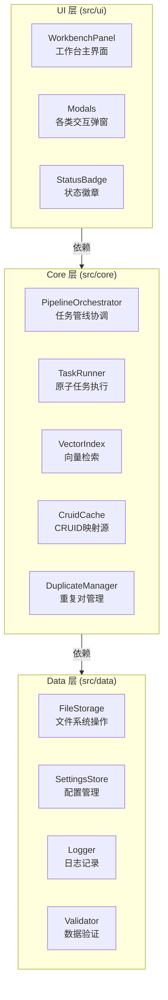

# Cognitive Razor — 技术设计文档

**版本**: 1.0.0
**最后更新**: 2025-12-16
**状态**: 单一真理源（SSOT）

## 0. 愿景与 SSOT 守则
- **愿景**：打造个人知识图谱的“认知剃刀”。利用 AI 将模糊的知识、想法转化为结构化、可复用、可演进的知识节点（Structured Nodes），帮助用户构建专属的外部第二大脑。
- **SSOT (Single Source of Truth) 守则**：
  - 本文档是项目的最高指导原则。代码实现、测试用例、Prompt 设计均需以此为准。
  - 任何架构变更、术语调整或数据契约修改，必须先更新本文档，再实施代码。
- **核心原则**：
  - **SOLID**：保持模块的高内聚低耦合，特别是 UI、Core、Data 三层分离。
  - **KISS**：保持系统简单，避免过度设计。
  - **DRY**：逻辑与定义不重复，Prompt 模板复用基础组件。
  - **YAGNI**：不开发当前不需要的功能（如移动端支持、实时协作）。

## 1. 系统边界与技术栈
- **边界**：
  - **仅桌面端** (`isDesktopOnly: true`)。
  - **本地优先**：所有数据存储在 Obsidian Vault 中，不依赖外部数据库。
  - **异步处理**：所有 AI 操作均为异步任务，通过队列管理。
- **技术栈**：
  - **Core**: TypeScript 5.7+, Node.js 22+ LTS
  - **Build**: esbuild 0.25.x
  - **Test**: Vitest 4.x
  - **AI**: OpenAI Compatible API (Default: `gpt-4o`, `text-embedding-3-small`)

## 2. 统一语言 (Ubiquitous Language)
本系统采用以下术语作为通用语言，贯穿 UI、代码与文档：

### 2.1 核心对象 (Objects)
| 术语 (Term) | 代码 (Code) | 定义 (Definition) |
|---|---|---|
| **概念节点** | `ConceptNode` | 知识图谱中的原子单元，包含 Frontmatter 和正文。 |
| **cruid** | `cruid` | 概念的全局唯一标识符 (UUIDv4)，字段小写。 |
| **Domain** | `Domain` | 知识所属的范畴或学科背景。 |
| **Issue** | `Issue` | 需要解决的难题、疑问或研究课题。 |
| **Theory** | `Theory` | 对问题的解释、理论、观点或假设。 |
| **Entity** | `Entity` | 具体的对象、事物或名词性概念。 |
| **Mechanism** | `Mechanism` | 事物间的交互机制、流程或动态演变。 |

### 2.2 剃刀操作 (Razor Actions)
| 术语 (Term) | 代码 (Code) | 定义 (Definition) |
|---|---|---|
| **Define** | `Define` | 识别输入所属的概念类型 (Domain/Issue/Theory/Entity/Mechanism)。 |
| **Tag** | `Tag` | 为概念生成别名、标签、关键词等元数据。 |
| **Write** | `Write` | 根据概念类型 Schema 生成结构化正文内容。 |
| **Merge** | `Merge` | 将两个语义重复的概念合并为一个，清理索引。 |
| **Amend** | `Amend` | 对现有概念进行增量优化、润色或修正。 |
| **Expand** | `Expand` | 基于现有概念发现上下位或相关的新概念。 |
| **Visualize** | `Visualize` | 为概念生成视觉化表达（配图）。 |

### 2.3 系统组件
- **工作台 (Workbench)**: 用户操作的主界面，展示管线状态。
- **管线 (Pipeline)**: 处理异步任务的流水线。
- **快照 (Snapshot)**: 变更前的状态备份，用于回滚。


## 3. 架构设计 (Architecture)
遵循 Clean Architecture 分层原则，确保依赖单向流动，实现高内聚低耦合。

### 3.1 分层结构


### 3.2 分层职责
- **UI Layer**: 呈现与交互
  - `WorkbenchPanel`: 核心工作台，展示四区（创建、重复、队列、历史）
  - `Modals`: 输入、确认、Diff 预览等弹窗
  - `StatusBadge`: 插件状态徽章
  
- **Core Layer**: 业务逻辑与用例
  - `PipelineOrchestrator`: 协调 Define→Tag→Write→Index→Verify 等任务序列
  - `TaskRunner`: 执行具体的原子任务（调用 LLM、生成向量等）
  - `VectorIndex`: 向量化与相似度检索
  - `CruidCache` **(SSOT)**: 维护 `cruid` ↔ `TFile` 的映射，是数据一致性的根基
  - `DuplicateManager`: 管理重复对的生成、状态转移
  - `LockManager`: 节点级与类型级的并发锁
  
- **Data Layer**: 持久化与基础设施
  - `FileStorage`: Obsidian Vault 文件操作（读、写、删除、重命名）
  - `SettingsStore`: 用户配置持久化
  - `Logger`: JSONL 日志
  - `Validator`: frontmatter、数据契约校验

### 3.3 设计约束 (SOLID)
| 原则 | 规范 | 示例 |
|---|---|---|
| **S** (Single Responsibility) | 每个类只有一个职责 | `VectorIndex` 只负责向量操作，不负责文件 I/O |
| **O** (Open/Closed) | 对扩展开放，对修改关闭 | 通过接口定义 Provider，支持切换 AI 服务商 |
| **L** (Liskov Substitution) | 基类与子类可互换 | `TaskRunner` 的各个任务处理器实现通一接口 |
| **I** (Interface Segregation) | 细粒度接口，避免依赖过多 | 分离 `FileStorage` 的读、写、删除接口 |
| **D** (Dependency Inversion) | 依赖抽象，不依赖具体 | 通过构造注入 `IFileStorage`，方便测试 |

### 3.4 关键设计模式
| 模式 | 应用场景 | 实现 |
|---|---|---|
| **Result Monad** | 错误处理 | `Result<T, E>` 替代异常抛出 |
| **Observer** | 文件变更监听 | Obsidian `metadataCache.changed` 事件 |
| **Factory** | 任务创建 | `TaskFactory.create(type, payload)` |
| **Strategy** | 多种操作流程 | Define/Merge/Amend 各有独立的 Strategy |
| **State Machine** | 任务状态转移 | Pending → Running → Completed/Failed |

### 3.5 插件生命周期 (Plugin Lifecycle)
管理插件的启动、关闭及资源释放，确保数据安全。

**onload (启动)**:
1. **配置加载**: `SettingsStore.load()`。
2. **服务初始化**:
   - `CruidCache`: 扫描 Vault 建立内存映射。
   - `VectorIndex`: 加载 `index.json` 元数据。
   - `DuplicateManager`: 加载 `duplicate-pairs.json`。
   - `PipelineOrchestrator`: 加载 `queue-state.json`，恢复 Pending 任务（但不自动开始，需用户或配置触发）。
3. **事件注册**: 监听 `metadataCache.changed`, `vault.rename/delete`。
4. **UI 渲染**: 注册 View 和 Ribbon Icon。

**onunload (关闭)**:
1. **管线暂停**: `PipelineOrchestrator.pause()`，停止分发新任务。
2. **状态持久化**: 强制保存 `queue-state.json` 和所有内存中的数据索引。
3. **锁释放**: `LockManager.clear()`，防止死锁残留。
4. **清理**: 销毁定时器和事件监听器。

## 4. 核心概念模型
### 4.1 知识类型 (Concept Types)
| 类型 | 示例 | 特征 | 常见父类 |
|---|---|---|---|
| **Domain** | 认知科学、机器学习 | 宏观领域或学科，通常是树的根或中间层 | 无或其他 Domain |
| **Issue** | 意识难题、梯度消失问题 | 具体的待解决问题或研究课题 | Domain（一个领域内的核心议题） |
| **Theory** | 预测加工理论、反向传播 | 理论模型或解决方案，用于解释或解决 Issue | Issue（回答某个问题）|
| **Entity** | 神经元、张量、变量 | 基础概念单元，是组成其他知识的原子 | Theory（理论中的对象） |
| **Mechanism** | 突触传递、梯度下降、权重更新 | 动态的交互过程、流程或演变机制 | Theory（理论中的机制） |

**类型关系**：
```
Domain
  └─ Issue (该领域的核心问题)
      └─ Theory (问题的解释/解决方案)
          ├─ Entity (理论涉及的对象)
          └─ Mechanism (理论中的机制)
```

### 4.2 笔记状态 (Note State)
- **Stub**: 仅有标题、`cruid` 和基本 frontmatter，内容为空占位符（通常由 Expand 生成）
- **Draft**: 内容生成中或待人工校验，可能不完整
- **Evergreen**: 经过验证、结构稳定的永久笔记，不再频繁修改

**状态转移**:
```
Stub → Draft → Evergreen
```
*注：Amend 是一个操作，不改变笔记的生命周期状态，但会更新 `updated` 时间戳。*

### 4.3 操作风险分级
| 操作 | 风险等级 | 要求 | 是否可撤销 |
|---|---|---|---|
| Define/Tag/Write | 🟢 Low | 无 | ✓ (删除文件可恢复) |
| Merge | 🔴 High | 快照 + Diff 确认 + 双笔记各备份 | ✓ (通过快照恢复) |
| Amend | 🟠 Medium | 快照 + Diff 确认 | ✓ (通过快照恢复) |
| Expand | 🟡 Low | 用户勾选候选项 | ✓ (删除新建笔记) |
| Visualize | 🟢 Low | 无 | ✓ (删除附件) |


## 5. 数据契约 (Data Contracts)
### 5.1 Frontmatter (YAML)
```yaml
cruid: "550e8400-e29b-41d4-a716-446655440000"
type: "Domain"  # 对应 ConceptType
name: "认知科学"
status: "Draft"
created: "2025-12-13 10:30:00"
updated: "2025-12-13 15:45:00"
aliases: ["认知研究", "Cognitive Science"]
tags: ["科学", "心智"]
parents: ["[[数学 (Mathematics)]]", "[[物理学 (Physics)]]"]
```
字段约束：
- 时间格式固定 `yyyy-MM-DD HH:mm:ss`（非 ISO）。
- `aliases` 只存别名，不含 cruid。
- `parents` 只存笔记标题/链接，便于人读和跳转。

### 5.2 任务记录 (Task Record)
```typescript
type TaskType =
  | "define" | "tag" | "write" | "index" | "verify"  // Clarify/Refine 的子任务
  | "image-generate";                                // Visualize 任务

interface TaskRecord {
  id: string;
  nodeId: string;                // cruid
  taskType: TaskType;
  state: TaskState;
  attempt: number;
  maxAttempts: number;
  payload: Record<string, unknown>;
  result?: Record<string, unknown>;
  created: string;
  updated: string;
  errors?: TaskError[];
}

type TaskState =
  | "Pending" | "Running" | "Completed" | "Failed" | "Cancelled";
```

### 5.3 向量索引 (Vector Index)
元数据（`data/vectors/index.json`）：
```typescript
interface VectorIndexMeta {
  version: string;
  lastUpdated: number;
  stats: { totalConcepts: number; byType: Record<ConceptType, number>; };
  concepts: Record<string, ConceptMeta>;
}
interface ConceptMeta {
  id: string;          // cruid
  type: ConceptType;
  vectorFilePath: string;
  lastModified: number;
  hasEmbedding: boolean;
}
```
向量文件（`data/vectors/{type}/{cruid}.json`）：
```typescript
interface ConceptVector {
  id: string;
  type: ConceptType;
  embedding: number[]; // 1536 维
  metadata: { createdAt: number; updatedAt: number; embeddingModel: string; dimensions: number; };
}
```
约束：
- 索引不存 `name/path`，运行时由 `CruidCache` 解析。
- `vectorFilePath` 仅内部使用，不对外暴露。

### 5.4 重复对 (Duplicate Pair)
```typescript
interface DuplicatePair {
  id: string;
  nodeIdA: string;   // cruid
  nodeIdB: string;   // cruid
  type: ConceptType;
  similarity: number;    // 0-1
  detectedAt: string;
  status: "pending" | "merging" | "merged" | "dismissed";
}
```

### 5.5 快照 (Snapshot)
```typescript
interface SnapshotRecord {
  id: string;
  nodeId: string;     // cruid
  taskId: string;
  path: string;
  content: string;
  created: string;
  fileSize: number;
  checksum: string;   // MD5
}
```

## 6. 核心流程 (Core Workflows)
每个流程由多个原子任务组成，通过 Pipeline 顺序执行，支持暂停/恢复和错误重试。

### 6.1 Define (识别类型)
识别用户输入属于哪种概念类型。
- **入口**: 用户输入文本或上传内容
- **流程**: 
  1. 提取关键特征
  2. 调用 LLM 生成类型候选与置信度
  3. 呈现给用户选择
- **输出**: 确定的 `type` (Domain/Issue/Theory/Entity/Mechanism)
- **可能失败**: LLM 超时、无法识别
- **约束**: 支持用户手动覆盖系统推荐

### 6.2 Tag (生成元数据)
为概念生成别名、标签、关键词。
- **入口**: 输入文本 + 已确定的 `type`
- **流程**:
  1. 调用 LLM 分析语义
  2. 生成别名列表（同义词、缩写）
  3. 生成标签（分类、属性）
- **输出**: `aliases`, `tags`
- **可能失败**: LLM 调用失败、输出格式错误
- **约束**: 别名中不得包含 `cruid`

### 6.3 Write (生成正文)
根据概念类型 Schema 生成结构化正文。
- **入口**: 输入文本 + `type` + 可选的 `sources` (来自 Expand 的上下文)
- **流程**:
  1. 加载类型特定的 Prompt 模板（如 `_type/domain-core.md`）
  2. 注入 `{{BASE_TERMINOLOGY}}` 等全局上下文
  3. 调用 LLM 生成正文（JSON 格式）
  4. 解析 JSON 并验证必需字段
- **输出**: 结构化的正文内容（按类型有不同的 Schema）
- **可能失败**: JSON 解析失败、字段缺失、不符合规范
- **约束**: 输出必须是原始 JSON（无 markdown fence）

#### 6.3.1 各类型的 Write Schema 与处理逻辑
收到 LLM 返回的 JSON 后，系统按以下规则处理各字段：

**通用处理**:
- `definition`: 写入 Frontmatter 的 `definition` 字段，并在正文顶部以引用块展示。
- `historical_genesis`, `holistic_understanding`: 作为正文的一级标题 (`# Historical Genesis`, `# Holistic Understanding`) 写入详细内容。

**Domain Schema**:
```typescript
interface DomainWriteOutput {
  definition: string;
  teleology: string;        // → 正文 # Teleology
  methodology: string;      // → 正文 # Methodology
  boundaries: string[];     // → 正文列表
  historical_genesis: string;
  holistic_understanding: string;
  sub_domains: {            // → 正文列表，尝试创建 [[Link]]
    name: string;
    description: string;
  }[];
  issues: {                 // → 正文列表，尝试创建 [[Link]]
    name: string;
    description: string;
  }[];
}
```

**Issue Schema**:
```typescript
interface IssueWriteOutput {
  definition: string;
  core_tension: string;     // → Frontmatter `core_tension`
  significance: string;     // → 正文 # Significance
  epistemic_barrier: string;// → 正文 # Epistemic Barrier
  counter_intuition: string;// → 正文 # Counter Intuition
  historical_genesis: string;
  sub_issues: {             // → 正文列表，尝试创建 [[Link]]
    name: string;
    description: string;
  }[];
  stakeholder_perspectives: { // → 正文表格
    stakeholder: string;
    perspective: string;
  }[];
  boundary_conditions: string[]; // → 正文列表
  theories: {               // → 正文列表，尝试创建 [[Link]]
    name: string;
    status: string;
    brief: string;
  }[];
}
```

**Theory Schema**:
```typescript
interface TheoryWriteOutput {
  definition: string;
  axioms: {                 // → 正文列表
    statement: string;
    justification: string;
  }[];
  sub_theories: {           // → 正文列表，尝试创建 [[Link]]
    name: string;
    description: string;
  }[];
  logical_structure: string;// → 正文 # Logical Structure
  entities: {               // → 正文列表，尝试创建 [[Link]]
    name: string;
    role: string;
    attributes: string;
  }[];
  mechanisms: {             // → 正文列表，尝试创建 [[Link]]
    name: string;
    process: string;
    function: string;
  }[];
  core_predictions: string[]; // → 正文列表
  limitations: string[];      // → 正文列表
  historical_genesis: string;
  holistic_understanding: string;
}
```

**Entity Schema**:
```typescript
interface EntityWriteOutput {
  definition: string;
  classification: {         // → Frontmatter 或正文信息栏
    genus: string;
    differentia: string;
  };
  properties: {             // → 正文表格
    name: string;
    type: string;
    description: string;
  }[];
  states: {                 // → 正文列表
    name: string;
    description: string;
  }[];
  constraints: string[];    // → 正文列表
  composition: {            // → 正文列表，尝试创建 [[Link]]
    has_parts: string[];
    part_of: string;
  };
  distinguishing_features: string[]; // → 正文列表
  examples: string[];       // → 正文列表
}
```

**Mechanism Schema**:
```typescript
interface MechanismWriteOutput {
  definition: string;
  trigger_conditions: string[]; // → 正文列表
  operates_on: {            // → 正文列表，尝试创建 [[Link]]
    entity: string;
    role: string;
  }[];
  causal_chain: {           // → 正文有序列表 (1. Step...)
    step: number;
    description: string;
    interaction: string;
  }[];
  modulation: {             // → 正文表格
    factor: string;
    effect: string;
    mechanism: string;
  }[];
  inputs: string[];         // → 正文列表
  outputs: string[];        // → 正文列表
  side_effects: string[];   // → 正文列表
  termination_conditions: string[]; // → 正文列表
  holistic_understanding: string;
}
```

### 6.4 Index (向量化)
将概念内容转化为向量表示，用于后续检索与去重。
- **入口**: 概念的完整 Frontmatter + 正文
- **流程**:
  1. 拼接 frontmatter 和正文为单一文本
  2. 调用 Embedding 模型生成 1536 维向量
  3. 存储到 `data/vectors/{type}/{cruid}.json`
  4. 更新索引元数据 (`data/vectors/index.json`)
- **输出**: 向量文件 + 索引元数据
- **可能失败**: Embedding 服务超时、网络错误
- **约束**: 1536 维固定，不支持更换维度

### 6.5 Deduplicate (去重检测)
在同类型向量桶中检索相似的概念。
- **入口**: 新概念的向量 + 已索引同类型概念
- **流程**:
  1. 加载同类型所有向量
  2. 计算新向量与各概念向量的余弦相似度
  3. 筛选相似度 > 阈值（默认 0.85）的概念对
  4. 生成 `DuplicatePair` 记录
- **输出**: 重复对列表（存入 `data/duplicate-pairs.json`）
- **可能失败**: 向量比对失败（维度不匹配、NaN 值）
- **约束**: 只在同类型内检索；新概念与已有概念比对

### 6.6 Merge (融合)
合并两个语义重复的概念，保留主概念，删除被删概念。
- **入口**: 选定的主概念 A 和被删概念 B + 用户确认
- **流程**:
  1. **备份**: 为 A 和 B 各创建快照 (`SnapshotRecord`)
  2. **融合**: 调用 LLM 生成合并后的内容
  3. **Diff 确认**: 呈现原→新的 Diff，用户确认是否写入
  4. **写入**: 更新 A 的内容和 `aliases` (追加 B 的标题)
  5. **删除**: 从 Vault 删除 B 的文件
  6. **清理**:
     - `VectorIndex.delete(B.cruid)`
     - `DuplicateManager.removePairsByNodeId(B.cruid)` (保留 `merging` 状态避免竞态)
     - 如果 B 是其他笔记的父，自动更新相关笔记的 `parents` 字段
- **输出**: 融合后的 A + 已删除的 B
- **可能失败**: LLM 调用失败、Diff 用户拒绝、文件删除失败
- **约束**:
  - 必须创建快照
  - 被删 cruid 必须从所有数据结构彻底清除
  - 被删标题追加到 A 的 `aliases`（不是 `cruid`）

### 6.7 Amend (修订)
对现有概念进行增量优化、润色或纠正。
- **入门**: 选定的概念 + 修订指令 (如"补充实验证据")
- **流程**:
  1. **备份**: 创建快照 (`SnapshotRecord`)
  2. **改进**: 调用 LLM，输入原内容 + 修订指令，生成改进稿
  3. **Diff 确认**: 呈现原→改进的 Diff，用户确认
  4. **写入**: 更新文件（保持 `cruid`、`created` 不变，更新 `updated`）
  5. **索引更新**: 重新生成向量，更新索引
  6. **重检去重**: 在同类型内重新检测是否产生新的重复对
- **输出**: 改进后的概念文件 + 可能的新重复对
- **可能失败**: LLM 调用失败、Diff 用户拒绝、向量生成失败
- **约束**:
  - 必须创建快照并得到用户确认
  - 不改变概念的 `type` 和 `cruid`
  - 快照在 Diff 显示前就已创建

### 6.8 Expand (拓展)
基于当前概念发现上下位或相关的新概念。
- **入门**: 选定的概念 A
- **流程**:
  1. **候选生成**: 调用 LLM，根据 A 的内容和类型，生成相关概念的候选列表
     - 若 A 是 Domain→ 生成可能的 Issue、Entity
     - 若 A 是 Issue→ 生成可能的 Theory、Entity
     - 若 A 是 Theory/Entity/Mechanism→ 生成相关的其他 Entity/Mechanism
  2. **去重过滤**: 检查候选概念是否已存在（通过 `CruidCache` 查询）
  3. **用户勾选**: 用户选择要创建的候选项（支持批量，上限 200）
  4. **批量创建**: 对每个勾选项调用 `Define/Tag/Write/Index/Deduplicate`
     - 新概念的 `parents` 字段填入 A 的标题（可能需要追加 `parentUid`、`parentType` 等元数据）
- **输出**: 新建的概念列表（状态为 Stub）
- **可能失败**: LLM 调用失败、用户取消、某个创建任务失败
- **约束**:
  - 候选数不超过 200（防止超载）
  - 新概念只写 `parents`，不修改原概念
  - 可能出现网络等临时故障导致部分创建失败，需提示用户重试

### 6.9 Visualize (可视化)
为概念生成配图。
- **入门**: 当前编辑的概念 + 光标位置 + 用户输入的描述（可选）
- **流程**:
  1. **上下文提取**: 获取当前笔记的 Frontmatter 和光标附近的正文
  2. **Prompt 生成**: 根据描述 + 概念类型 + 上下文生成图像生成的 Prompt
  3. **调用 Provider**: 发送到 Gemini 或其他图像生成服务
  4. **保存附件**: 解码返回的图像数据，调用 `vault.getAvailablePathForAttachment()` 计算路径，保存为 Attachment
  5. **插入链接**: 在光标位置插入 `` 链接
  6. **支持撤销**: 通过 `UndoManager` 记录此操作
- **输出**: 保存的图片 Attachment + Markdown 链接
- **可能失败**: 图像生成失败、网络超时、磁盘空间不足
- **约束**:
  - 支持撤销（删除附件、移除链接）
  - 不创建快照（图片生成失败不影响原笔记）
  - 图片大小、格式由配置指定

### 6.10 Verify (事实核查)
利用具有联网能力的模型对笔记内容进行事实核查，减少幻觉。
- **入口**: 
  - **自动**: `Write` 任务完成后自动触发（若配置 `enableAutoVerify: true`）。
  - **手动**: 用户在工作台或命令面板触发。
- **流程**:
  1. **提取内容**: 获取当前笔记的全文。
  2. **调用 Verifier**: 将内容发送给配置的联网模型（如 Perplexity/Gemini）。
  3. **执行核查**: 模型搜索网络，验证关键事实（数据、日期、引用）。
  4. **生成报告**: 返回核查结果（通过/存疑/错误）及修正建议。
  5. **追加结果**: 将报告以 Callout 或特定格式追加到笔记末尾 (`## Verification Report`)。
- **输出**: 修改后的笔记（追加了报告）。
- **可能失败**: 网络搜索失败、模型超时。
- **约束**:
  - 仅追加内容，不修改原文。
  - 需配置支持联网的模型 Provider。

## 7. Prompt 系统 (Prompt Management)
Prompt 是连接用户意图与 AI 输出的桥梁，采用模块化设计以支持复用与多语言。

### 7.1 目录结构与文件组织
```
prompts/
  _base/
    terminology.md         # 统一语言定义
    output-format.md       # 输出格式规范
    writing-style.md       # 写作风格指南
    anti-patterns.md       # 常见错误模式
    operations/
      define.md            # Define 操作的通用指令
      tag.md               # Tag 操作的通用指令
      write.md             # Write 通用框架（各类型覆盖）
      merge.md             # Merge 操作指令
      amend.md             # Amend 操作指令
  _type/
    domain-core.md         # Domain 特定的 Write schema
    issue-core.md
    theory-core.md
    entity-core.md
    mechanism-core.md
  visualize.md             # 图像生成 Prompt
```

### 7.2 模板块结构
每个操作 Prompt 包含以下块：
```markdown
<system_instructions>
系统级指令，定义 AI 的角色和行为规范。
</system_instructions>

<task_instruction>
具体任务的指令，包含输入描述和期望输出。
</task_instruction>

<output_schema>
定义输出的结构（通常为 JSON schema）。
</output_schema>

<examples>
（可选）具体示例。
</examples>
```

### 7.3 模板变量注入
| 变量 | 值来源 | 使用场景 |
|---|---|---|
| `{{BASE_TERMINOLOGY}}` | `_base/terminology.md` | 所有任务（确保术语一致） |
| `{{BASE_OUTPUT_FORMAT}}` | `_base/output-format.md` | 所有任务（JSON 格式规范） |
| `{{BASE_WRITING_STYLE}}` | `_base/writing-style.md` | Write/Amend（文章质量） |
| `{{BASE_ANTI_PATTERNS}}` | `_base/anti-patterns.md` | All tasks（避免常见错误） |
| `{{OPERATION_BLOCK}}` | 对应操作文件 | 各操作（如 `define.md`） |
| `{{TYPE}}` | 运行时传入 | Write 族操作（Domain/Issue/...） |
| `{{TYPE_SCHEMA}}` | `_type/{type}-core.md` | Write 操作（类型特定 schema） |
| `{{CONTEXT}}` | 运行时提取 | Expand（用户笔记上下文） |
| `{{INSTRUCTION}}` | 用户输入 | Amend（用户的修订指令） |

### 7.4 构建与校验
```typescript
interface PromptBuilder {
  // 加载基础块
  loadBase(): Promise<BaseBlocks>;
  
  // 注入变量并校验
  inject(template: string, vars: Record<string, string>): Result<string, ValidationError>;
  
  // 检查是否有残留占位符
  validateNoPlaceholders(text: string): Result<void, string[]>;
  
  // 构建完整 Prompt
  build(operation: TaskType, context?: Record<string, unknown>): Result<string, BuildError>;
}

interface BuildError {
  code: string;          // E7xx
  message: string;
  unresolvedVars?: string[]; // 未解析的变量
}
```

### 7.5 输出校验规则
- 必须是原始 JSON（无 markdown fence 如 ` ```json ... ``` `）
- 所有必需字段必须存在
- 字段值类型必须匹配 schema
- 嵌套对象递归校验

## 8. 索引、存储与数据一致性 (Storage & SSOT)
### 8.1 文件系统布局
```
vault/
  ├─ 1-Domains/
  │   ├─ 认知科学.md
  │   └─ ...
  ├─ 2-Issues/
  ├─ 3-Theories/
  ├─ 4-Entities/
  ├─ 5-Mechanisms/
  └─ .obsidian/plugins/obsidian-cognitive-razor/
      └─ data/
          ├─ app.log                    # JSONL 格式的日志
          ├─ queue-state.json           # 持久化队列状态
          ├─ duplicate-pairs.json       # 重复对列表
          ├─ snapshots/
          │   ├─ index.json             # 快照元数据索引
          │   ├─ {snapshotId}.md        # 快照内容
          │   └─ ...
          └─ vectors/
              ├─ index.json             # 向量索引元数据
              ├─ Domain/
              │   ├─ {cruid}.json       # 单个向量
              │   └─ ...
              ├─ Issue/
              ├─ Theory/
              ├─ Entity/
              └─ Mechanism/
```

### 8.2 单一真理源 (SSOT) 机制
**CruidCache 是绝对的真理源**，其他所有数据结构应从它推导。

```typescript
interface CruidCache {
  // 查询方向1：cruid → TFile
  getCruidToFileMap(): Map<string, TFile>;
  getFileByCreuid(cruid: string): TFile | undefined;
  
  // 查询方向2：TFile → cruid
  getCreuidByFile(file: TFile): string | undefined;
  
  // 监听文件变化
  on('created', (cruid: string, file: TFile) => void);
  on('deleted', (cruid: string) => void);
  on('renamed', (oldCreuid: string, newCreuid: string, newFile: TFile) => void);
}
```

**CruidCache 维护的规则**:
1. 监听 Obsidian 的 `metadataCache.changed` 事件，提取 frontmatter 中的 `cruid`
2. 监听 `vault.rename` 和 `vault.delete` 事件，更新映射
3. 如果文件被删除：
   - `VectorIndex.delete(cruid)` 清空该 cruid 的向量
   - `DuplicateManager.removePairsByNodeId(cruid)` 清空相关重复对（但保留 `merging` 状态避免竞态条件）
4. 如果文件被重命名：不需要更新索引和重复对（因为它们只存储 cruid）

### 8.3 向量索引 (Vector Index)
**元数据** (`data/vectors/index.json`):
```typescript
interface VectorIndexMeta {
  version: string;               // 版本号（数据契约版本）
  lastUpdated: number;           // Unix 时间戳
  stats: {
    totalConcepts: number;
    byType: Record<ConceptType, number>;
  };
  concepts: Record<string, ConceptMeta>;
}

interface ConceptMeta {
  id: string;               // cruid
  type: ConceptType;
  vectorFilePath: string;   // 相对路径，如 "Domain/550e8400.json"
  lastModified: number;     // Unix 时间戳
  hasEmbedding: boolean;    // 是否成功生成向量
}
```

**向量文件** (`data/vectors/{type}/{cruid}.json`):
```typescript
interface ConceptVector {
  id: string;                    // cruid
  type: ConceptType;
  embedding: number[];           // 1536 维浮点数数组
  metadata: {
    createdAt: number;           // Unix 时间戳
    updatedAt: number;
    embeddingModel: string;      // 如 "text-embedding-3-small"
    dimensions: number;          // 1536
  };
}
```

**索引操作**:
- 增：调用 Embedding 模型生成向量后，存储新文件并更新元数据
- 删：`VectorIndex.delete(cruid)` → 删除向量文件 + 更新元数据
- 改：重新调用 Embedding 模型，覆盖原文件
- 查：加载类型元数据 → 读取目标向量文件 → 与其他同类向量计算相似度

### 8.4 重复对 (Duplicate Pair)
```typescript
interface DuplicatePair {
  id: string;                          // UUID
  nodeIdA: string;                     // cruid
  nodeIdB: string;                     // cruid
  type: ConceptType;                   // A 和 B 必须同类型
  similarity: number;                  // 0-1，余弦相似度
  detectedAt: string;                  // ISO 8601 时间戳
  status: "pending" | "merging" | "merged" | "dismissed";
  // pending: 新检测到，未处理
  // merging: 用户正在处理，避免竞态
  // merged: 已融合
  // dismissed: 用户拒绝了融合
}
```

**生命周期**:
1. 去重检测 → 生成 `pending` 状态重复对
2. 用户选择融合 → 状态转为 `merging`
3. 融合完成 → 状态转为 `merged` 或 `dismissed`

**清理**:
- 当被删 cruid 被彻底删除时，删除所有涉及该 cruid 的重复对（保留 `merging` 以避免竞态）

### 8.5 快照 (Snapshot)
快照用于记录"变更前"的状态，支持回滚。

```typescript
interface SnapshotRecord {
  id: string;               // UUID
  nodeId: string;           // cruid
  taskId: string;           // 触发快照的任务 ID
  path: string;             // 快照时的文件路径（仅用于参考）
  content: string;          // 完整的 Frontmatter + 正文
  created: string;          // ISO 8601 时间戳
  fileSize: number;         // 字节数
  checksum: string;         // MD5 校验和（便于去重与完整性校验）
}
```

**生成策略**:
- **Merge 操作**: 必须为主与被删笔记各创建快照
- **Amend 操作**: 必须创建快照（写入前）
- **Expand 操作**: 不创建快照（新建笔记不需要）
- **Define/Tag/Write**: 不创建快照（若创建失败可删除文件）

**保留策略**:
- 配置 `maxSnapshots` (默认 100) 和 `maxSnapshotAgeDays` (默认 30)
- 定期清理过期或超额的快照

**恢复流程**:
1. 用户选择恢复某个快照
2. 系统使用"原子写"（写到临时文件 + 原子重命名）保证一致性
3. 重新生成向量索引

## 9. 任务队列与管线 (Task Queue & Pipeline)
### 9.1 任务队列模型
```typescript
interface MinimalQueueState {
  pendingTasks: TaskRecord[];     // 待执行任务列表
  paused: boolean;                // 管线是否暂停
  lastUpdated: number;            // Unix 时间戳
}

interface TaskRecord {
  id: string;                     // UUID
  nodeId: string;                 // cruid（任务所属的概念）
  taskType: TaskType;             // define/tag/write/index/merge/amend/expand/visualize
  state: TaskState;               // Pending/Running/Completed/Failed/Cancelled
  attempt: number;                // 当前重试次数
  maxAttempts: number;            // 最多重试次数
  payload: Record<string, unknown>; // 任务输入数据
  result?: Record<string, unknown>; // 任务输出结果（成功时）
  error?: TaskError;              // 错误信息（失败时）
  created: string;                // ISO 8601 时间戳
  updated: string;
  startedAt?: string;             // 开始执行的时间
  completedAt?: string;           // 完成的时间
}

type TaskState = "Pending" | "Running" | "Completed" | "Failed" | "Cancelled";

interface TaskError {
  code: string;                   // 如 "E201_PROVIDER_TIMEOUT"
  message: string;
  details?: unknown;
}
```

### 9.2 管线协调器 (PipelineOrchestrator)
负责任务的调度、执行和状态管理。

```typescript
interface PipelineOrchestrator {
  // 入队操作
  enqueueDefine(input: string): Promise<Result<string, E>>;         // 返回 taskId
  enqueueTag(cruid: string, text: string): Promise<Result<string, E>>;
  enqueueWrite(cruid: string, type: ConceptType): Promise<Result<string, E>>;
  enqueueMerge(cruidA: string, cruidB: string): Promise<Result<string, E>>;
  enqueueAmend(cruid: string, instruction: string): Promise<Result<string, E>>;
  enqueueExpand(cruid: string): Promise<Result<string, E>>;
  enqueueVisualize(cruid: string, description?: string): Promise<Result<string, E>>;
  
  // 队列控制
  pause(): void;
  resume(): void;
  cancelTask(taskId: string): void;
  getQueueState(): MinimalQueueState;
  
  // 事件
  on('taskCompleted', (taskId: string, result: Record<string, unknown>) => void);
  on('taskFailed', (taskId: string, error: TaskError) => void);
  on('taskRunning', (taskId: string) => void);
}
```

### 9.3 任务执行流程
```
[Entry] → Enqueue → State: Pending
           ↓
        [Check Paused]
           ↓
        [Acquire Lock] (获取并发锁)
           ↓
        State: Running, startedAt = now
           ↓
        [Execute Task]
           ├─ 成功 → State: Completed, result = {...}
           ├─ 失败（可重试）→ attempt++, maxAttempts 检查
           │   ├─ 未超限 → exponential backoff，重新 Enqueue
           │   └─ 已超限 → State: Failed, error = {...}
           └─ 失败（不可重试）→ State: Failed, error = {...}
           ↓
        completedAt = now
           ↓
        [Release Lock]
           ↓
        通知 UI 更新
```

### 9.4 并发锁 (Locking)
```typescript
interface SimpleLockManager {
  // 按 cruid 加锁（防止同笔记并发写入）
  tryAcquireNodeLock(cruid: string, timeout?: number): boolean;
  releaseNodeLock(cruid: string): void;
  
  // 按类型加锁（防止去重时竞态）
  tryAcquireTypeLock(type: ConceptType, timeout?: number): boolean;
  releaseTypeLock(type: ConceptType): void;
  
  // 查询
  isNodeLocked(cruid: string): boolean;
  isTypeLocked(type: ConceptType): boolean;
  
  // 清空（重启时）
  clear(): void;
}
```

**锁的语义**:
- **NodeLock**: 同时只有一个任务可以修改某个笔记的文件内容
- **TypeLock**: 去重时，同类型的向量扫描互斥，防止并发修改同类向量索引

**重启行为**: 锁自动清空（内存结构），不持久化。重启后再次运行可能出现竞态，但通过版本号、校验和等机制检测并恢复。

### 9.5 重试策略
```typescript
interface RetryStrategy {
  maxRetryAttempts: number;           // 默认 3
  canRetry(error: TaskError): boolean;
  getBackoffDelay(attempt: number): number; // 指数退避
}

// 可重试的错误码：E2xx (Provider/AI)、部分 E3xx (临时网络错误)
// 不可重试：E1xx (输入错误)、E002 (配置错误)、权限错误
```

**指数退避**:
- attempt 1: 1s
- attempt 2: 2s
- attempt 3: 4s

## 10. 错误处理与恢复 (Error Handling & Recovery)
### 10.1 Result Monad
所有可能失败的操作都返回 `Result<T, E>` 类型，禁止抛出未捕获异常。

```typescript
type Result<T, E = AppError> = 
  | { ok: true; value: T; }
  | { ok: false; error: E; };

interface AppError {
  code: string;          // 如 "E101_INVALID_INPUT"
  message: string;       // 用户友好的错误信息
  details?: unknown;     // 调试信息
  timestamp: number;     // Unix 时间戳
}
```

**错误码前缀规范**:
| 前缀 | 范围 | 含义 | 可重试 |
|---|---|---|---|
| E1xx | E101-E199 | 输入/验证错误 | ✗ 不可重试 |
| E2xx | E201-E299 | Provider/AI 错误 | ✓ 可重试 |
| E3xx | E301-E399 | 系统/IO 错误 | △ 视情况 |
| E4xx | E401-E499 | 配置错误 | ✗ 不可重试 |
| E5xx | E501-E599 | 内部错误/BUG | △ 视情况 |

**具体错误码示例**:
- `E101_INVALID_INPUT`: 输入格式错误或无效
- `E102_MISSING_FIELD`: 必需字段缺失
- `E201_PROVIDER_TIMEOUT`: AI 提供商超时
- `E202_RATE_LIMITED`: 触发速率限制（429）
- `E203_INVALID_API_KEY`: API 密钥无效
- `E301_FILE_NOT_FOUND`: 文件不存在
- `E302_PERMISSION_DENIED`: 没有文件操作权限
- `E303_DISK_FULL`: 磁盘空间不足
- `E304_SNAPSHOT_FAILED`: 快照创建失败
- `E305_VECTOR_MISMATCH`: 向量维度不匹配
- `E401_PROVIDER_NOT_CONFIGURED`: Provider 未配置
- `E500_INTERNAL_ERROR`: 内部程序错误

### 10.2 错误通知
UI 层统一使用 `WorkbenchPanel.showErrorNotice()` 展示错误。

```typescript
interface ErrorNotification {
  code: string;
  message: string;        // 国际化处理
  level: "error" | "warn" | "info";
  duration: number;       // 毫秒，error 默认 6000
  action?: {
    text: string;
    callback: () => void;  // 如"重试"、"查看日志"
  };
}
```

**通知规则**:
- 🔴 **Error** (6000ms): 操作失败，用户需要感知
- 🟡 **Warning** (4000ms): 可能有问题但不阻塞
- 🟢 **Info** (2000ms): 正常操作结果

### 10.3 日志记录
日志采用 JSONL 格式，便于后续分析。

```typescript
interface LogEntry {
  timestamp: number;      // Unix 时间戳，精确到毫秒
  level: "debug" | "info" | "warn" | "error";
  context: {
    taskId?: string;
    nodeId?: string;      // cruid
    operation?: string;   // define/tag/write/...
    userId?: string;      // 若支持
  };
  message: string;
  details?: unknown;
  stackTrace?: string;    // 仅 error 级别
}

// 示例：
// {"timestamp":1702701600000,"level":"info","context":{"taskId":"abc123","operation":"define"},"message":"Define task started","details":{"inputLength":256}}
```

**日志级别配置** (`settings.logLevel`):
- `debug`: 所有细节（开发环境）
- `info`: 重要操作（生产环境）
- `warn`: 异常警告
- `error`: 错误

### 10.4 恢复机制
| 故障场景 | 恢复策略 |
|---|---|
| **AI 调用超时** | 重试 3 次（指数退避），若仍失败则标记为 Failed |
| **文件被外部修改** | 检测 checksum 差异，提示用户冲突解决 |
| **快照创建失败** | 操作被中止，用户收到通知 |
| **向量生成失败** | 任务重试，仍失败则概念无 embedding（可手动重试） |
| **队列状态损坏** | 重启时检测 queue-state.json 完整性，损坏则清空队列 |
| **Vault 被外部删除** | 监听器检测到 delete 事件，更新 CruidCache 和索引 |

### 10.5 调试与支持
```typescript
interface DebugInfo {
  pluginVersion: string;
  vaultPath: string;
  obsidianVersion: string;
  config: PluginSettings;
  queueState: MinimalQueueState;
  cacheStats: {
    totalCruids: number;
    cacheSize: number;
  };
  recentErrors: AppError[]; // 最近 10 个错误
}

// 用户可导出 DebugInfo 用于问题诊断
exportDebugInfo(): Result<string, E>;
```

## 11. UI/UX 设计规范 (UI/UX Standards)
### 11.1 核心设计原则
- **简洁**: 最少化 UI 元素，避免信息过载
- **无干扰**: 后台任务不中断用户工作流
- **键盘友好**: 所有主要操作支持快捷键
- **可访问**: 遵循 WAI-ARIA 标准，支持屏幕阅读器

### 11.2 Workbench 面板布局
```
┌─────────────────────────────────────────────┐
│ 🔧 Cognitive Razor Workbench                 │ [Settings]
├─────────────────────────────────────────────┤
│ 📝 Create New Concept                        │ [+]
│ Input: [________________]                   │
│ [Define] [Cancel]                           │
├─────────────────────────────────────────────┤
│ 🔗 Duplicate Concepts                        │ [▼]
│ • "Concept A" vs "Concept B" (0.92 sim)     │
│ • ...                                        │
├─────────────────────────────────────────────┤
│ ⏳ Queue Status                              │ [▼]
│ Running: Define (Task #1)                   │
│ Pending: 3 tasks                            │
│ [⏸ Pause] [🗑 Clear]                        │
├─────────────────────────────────────────────┤
│ 📊 Recent Operations                         │ [▼]
│ • Merge: A + B → A (5 min ago)              │
│ • Amend: C (10 min ago)                     │
├─────────────────────────────────────────────┤
│ 📌 Active Note Actions                       │ [▼]
│ [Amend] [Expand] [Visualize] [Verify]       │
└─────────────────────────────────────────────┘
```

**默认折叠**:
- 创建区、重复区总是展开（主操作）
- 队列、历史区默认折叠（辅助信息）
- 当前笔记操作区：仅当有活跃笔记时显示并展开

### 11.3 Diff View 设计
展示"原 → 改"的对比，所有破坏性操作前必须确认。

```
┌──────────────────────────────────────────────┐
│ 📋 Diff Preview — Amend: "Domain X"          │
├────────────────────┬─────────────────────────┤
│      Before        │         After           │
├────────────────────┼─────────────────────────┤
│ **Definition**      │ **Definition**          │
│ The study of...     │ The study of cognition │
│                     │ and mental processes,  │
│                     │ including perception,  │
│ ...                 │ memory, attention...   │
│                     │                        │
│ 📌 ✓ Auto-snapshot enabled                  │
├────────────────────┴─────────────────────────┤
│ [✓ Confirm]  [✗ Cancel]  [⤴ Show Original] │
└────────────────────────────────────────────────┘
```

**特性**:
- 支持 Side-by-Side（默认）和 Unified 两种模式
- 顶部徽章提示"自动快照已启用"
- 支持高亮改动部分（可选）


### 11.5 Modal 与弹窗
| Modal | 用途 | 交互 |
|---|---|---|
| `ExpandModal` | 选择要拓展的概念候选 | 勾选 + 批量操作 |
| `MergeConfirmModal` | 确认融合操作 | Diff + 确认/取消 |
| `AmendModal` | 输入修订指令 | 文本 + 建议 |
| `VisualizationModal` | 生成图片的描述 | 可选文本 + 预览 |
| `SimpleInputModal` | 快速定义 | 用于快速触发命名标准化 Define，等同于工作台输入框 |

**设计规范**:
- 使用 `AbstractModal` 基类，统一样式
- 所有 icon 通过 `setIcon()` 使用 Obsidian 主题
- 标题 + 内容 + 操作按钮 的标准布局
- 支持 Escape 快速关闭（非破坏性操作）

### 11.6 样式指南
- **Scope**: 所有样式限定在 `.cr-scope` 内（防止全局污染）
- **主题变量**: 仅使用 Obsidian 主题变量
  - `--text-normal`, `--text-muted`, `--text-error`
  - `--interactive-normal`, `--interactive-hover`
  - `--background-primary`, `--background-secondary`
- **禁止硬编码颜色** 和 `!important`
- **类名前缀**: 所有类名以 `cr-` 开头

```css
.cr-scope {
  --local-accent: var(--interactive-accent);
}

.cr-button-primary {
  background-color: var(--interactive-normal);
  color: var(--text-normal);
}

.cr-button-primary:hover {
  background-color: var(--interactive-hover);
}
```

### 11.7 无障碍 (Accessibility)
- **键盘导航**: Tab 顺序合理，焦点可见
- **ARIA 标签**: 所有交互元素有 `aria-label` 或 `aria-labelledby`
- **Modal**: `role="dialog"` + `aria-modal="true"` + `aria-labelledby`
- **快捷键**: 主要操作支持 Enter/Space 触发
- **运动敏感**: 尊重 `prefers-reduced-motion` 媒体查询
  - 加载动画在 reduce 模式下提供静态替代
  - 进度条用百分比文字替代动画

### 11.8 国际化 (i18n)
支持中文 (zh) 和英文 (en)。

```typescript
interface I18n {
  get(key: string, context?: Record<string, string>): string;
  setLanguage(lang: "zh" | "en"): void;
}

// 使用示例：
i18n.get("menu.clarify")           // "厘清概念"
i18n.get("error.E101_INVALID_INPUT") // "输入格式不正确"
i18n.get("notification.task_completed", { count: "3" }) // "3 个任务已完成"
```

## 12. 命令系统 (Command System)
### 12.1 命令列表
| 命令 ID | 名称 | 对应操作 | 快捷键建议 | 说明 |
|---|---|---|---|---|
| `open-workbench` | 打开工作台 | - | Ctrl+P: workbench | 显示/隐藏 Workbench 面板 |
| `define-concept` | 定义概念类型 | Define | - | 打开输入框识别类型 |
| `write-concept` | 撰写概念内容 | Write | - | 根据类型生成正文 |
| `amend-current-note` | 修订当前笔记 | Amend | Ctrl+Shift+E | 打开修订指令输入框 |
| `expand-current-note` | 拓展当前笔记 | Expand | Ctrl+Shift+X | 发现相关新概念 |
| `visualize-concept` | 可视化概念 | Visualize | Ctrl+Shift+V | 为当前笔记生成配图 |
| `verify-concept` | 核查当前笔记 | Verify | - | 联网核查事实准确性 |
| `pause-queue` | 暂停任务队列 | - | - | 暂停所有待执行任务 |
| `resume-queue` | 恢复任务队列 | - | - | 继续执行队列中的任务 |
| `clear-queue` | 清空任务队列 | - | - | 取消所有 Pending 任务 |

### 12.2 命令交互约定
- **入口**: 命令面板 (Ctrl/Cmd+P)
- **快捷键**: 用户自配置，插件不预设（避免冲突）
- **上下文菜单**: 编辑器右键菜单支持 `amend-current-note` 等当前笔记操作
- **触发条件**: 
  - `amend-current-note` 仅当编辑器有活跃笔记时可用
  - 其他命令可全局使用

### 12.3 命令回调示例
```typescript
// 定义命令
this.addCommand({
  id: 'amend-current-note',
  name: 'Amend current note',
  editorCallback: (editor: Editor, view: MarkdownView) => {
    const cruid = view.file?.frontmatter?.cruid;
    if (!cruid) {
      this.showNotice(i18n.get('error.no_cruid'), 'warn');
      return;
    }
    new AmendModal(this.app, cruid, (instruction: string) => {
      this.pipelineOrchestrator.enqueueAmend(cruid, instruction);
    }).open();
  },
});

// 注册快捷键监听（用户自配）
this.addCommand({
  id: 'amend-current-note',
  hotkeys: [
    {
      modifiers: ['Ctrl', 'Shift'],
      key: 'e',
    },
  ],
  ...
});
```


## 13. 配置与扩展 (Configuration & Extension)
### 13.1 插件设置接口
```typescript
interface PluginSettings {
  // 版本与语言
  version: string;                           // 数据格式版本
  language: "zh" | "en";
  
  // 目录方案
  directoryScheme: {
    Domain: string;      // 默认 "1-Domains"
    Issue: string;       // 默认 "2-Issues"
    Theory: string;      // 默认 "3-Theories"
    Entity: string;      // 默认 "4-Entities"
    Mechanism: string;   // 默认 "5-Mechanisms"
  };
  
  // 向量与搜索
  embeddingDimension: number;                // 固定 1536
  similarityThreshold: number;               // 默认 0.85
  topK: number;                              // 返回最相似的 K 个（默认 10）
  
  // 队列与并发
  concurrency: number;                       // 默认 2（同时执行任务数）
  taskTimeoutMs: number;                     // 默认 30000 (30s)
  maxTaskHistory: number;                    // 默认 1000
  
  // 重试策略
  autoRetry: boolean;                        // 默认 true
  maxRetryAttempts: number;                  // 默认 3
  
  // 快照
  maxSnapshots: number;                      // 默认 100
  maxSnapshotAgeDays: number;                // 默认 30
  
  // AI Provider 配置
  providers: Record<string, ProviderConfig>;
  defaultProviderId: string;
  providerTimeoutMs: number;                 // 默认 30000
  
  // 任务模型配置
  taskModels: Record<TaskType, TaskModelConfig>;
  
  // 图像生成
  imageGeneration: {
    enabled: boolean;
    defaultSize: "1024x1024" | "1792x1024" | "1024x1792";
    defaultQuality: "standard" | "hd";
    defaultStyle: "vivid" | "natural";
    contextWindowSize: number;               // 默认 4000
  };
  
  // 日志与调试
  logLevel: "debug" | "info" | "warn" | "error";
  enableAutoVerify: boolean;                 // 是否在 Write 后自动触发 Verify
}

interface ProviderConfig {
  name: string;                              // 如 "OpenAI"
  apiKey: string;
  baseUrl?: string;                          // 用于兼容 OpenRouter 等
  defaultChatModel: string;                  // 如 "gpt-4o"
  defaultEmbedModel: string;                 // 如 "text-embedding-3-small"
  enabled: boolean;
}

interface TaskModelConfig {
  provider: string;                          // providerId
  chatModel: string;
  embedModel: string;
  temperature?: number;
  topP?: number;
}
```

### 13.2 设置面板
Settings Tab 分为以下部分：

**1. 基础配置**
- 语言选择
- 目录方案设置
- 并发数、超时时间

**2. Provider 管理**
- 添加/删除 Provider
- API Key 配置
- 默认 Provider 选择
- 连接测试

**3. 模型配置**
- 为各任务选择 Chat 模型和 Embed 模型
- 支持单项配置或全量重置

**4. 高级选项**
- 相似度阈值调整
- 快照保留策略
- 日志级别
- 图像生成参数

### 13.3 首次运行向导 (Setup Wizard)
新用户安装插件后触发：

```
1️⃣  欢迎 → 简介 Cognitive Razor 的核心功能
2️⃣  Provider 配置 → 添加至少一个 AI Provider（OpenAI/Azure/etc.)
3️⃣  目录初始化 → 创建 5 个分类目录
4️⃣  完成 → 打开 Workbench，已准备好使用
```

### 13.4 扩展点 (Extension Points)
不支持第三方插件扩展。

### 13.5 数据迁移
由于暂时没有发布旧版本，无正式用户和，当前无数据迁移需求。

## 14. 实施检查清单 (Implementation Checklist)
本 SSOT 最终交付质量保证清单。

### 数据与前端合约
✓ Frontmatter 字段完整且格式正确
✓ `aliases` 不含 `cruid`；`parents` 仅存标题
✓ 时间格式统一为 `yyyy-MM-DD HH:mm:ss`

### 索引、存储与 SSOT
✓ `CruidCache` 是唯一真理源
✓ 向量索引仅存储 `cruid`，不存路径
✓ 文件删除自动清理索引和重复对

### 操作流程与快照
✓ Define/Tag/Write 不创建快照
✓ Merge/Amend 必有快照 + Diff 确认
✓ Expand/Visualize 不创建快照

### 错误处理与日志
✓ 所有可失败操作返回 Result<T, E>
✓ 错误码规范（E1xx~E5xx）
✓ 日志采用 JSONL 格式

### UI/UX 规范
✓ 键盘友好、样式规范、无障碍
✓ Modal 设置 ARIA 属性，icon 使用 setIcon()
✓ 尊重 prefers-reduced-motion 媒体查询

### 并发与配置
✓ 按 cruid/type 加锁，重启自动清空
✓ 首次运行触发向导（Provider + 目录）
✓ 国际化支持中英文（zh/en）