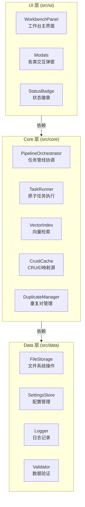

# Cognitive Razor — 技术设计文档

**版本**: 1.0.0
**最后更新**: 2025-12-18
**状态**: 设计基线（Design SSOT）

## 0. 愿景与 SSOT 守则
- **愿景**：打造个人知识图谱的“认知剃刀”。利用 AI 将模糊的知识、想法转化为结构化、可复用、可演进的知识节点（Structured Nodes），帮助用户构建专属的外部第二大脑。
- **设计基线（Design SSOT）守则**：
  - 本文档定义“术语、数据契约、不变量、交互语义”的基线，并与当前实现保持一致。
  - 本次修订以当前代码实现为准同步文档；后续需求变更需先更新本文档，再同步实现与测试，避免长期漂移。
- **SSOT 权威索引（防漂移/去歧义）**：
  - **类型/枚举/默认值**：`src/types.ts` 与 `src/data/settings-store.ts`。
  - **Prompt 槽位与模板**：`src/core/prompt-manager.ts` 与 `prompts/`。
  - **JSON Schema 与渲染顺序**：`src/core/schema-registry.ts` 与 `src/core/content-renderer.ts`。
  - **数据文件格式/路径**：`src/data/file-storage.ts` + 各 `src/core/*-store.ts`。
  - **管线/队列/锁语义**：`src/core/pipeline-orchestrator.ts`、`src/core/task-queue.ts`、`src/core/lock-manager.ts`。
  - **UI 行为与交互**：`src/ui/**`。
- **核心原则**：
  - **SOLID**：保持模块的高内聚低耦合，特别是 UI、Core、Data 三层分离。
  - **KISS**：保持系统简单，避免过度设计。
  - **DRY**：逻辑与定义不重复，Prompt 模板复用基础组件。
  - **YAGNI**：不开发当前不需要的功能（如移动端支持、实时协作）。

## 1. 系统边界与技术栈
- **边界**：
  - **仅桌面端** (`isDesktopOnly: true`)。
  - **本地优先**：所有数据存储在 Obsidian Vault 中，不依赖外部数据库。
  - **异步处理**：AI 操作以异步任务为主；Define 与 Index/Deduplicate 为直调（不入队），其余通过队列管理。
- **技术栈**：
  - **Dev/Build**: TypeScript 5.7+, Node.js 22+（仅用于本仓库构建/测试）
  - **Runtime**: Obsidian Desktop ≥ 1.5.7（Electron 运行时；插件产物为单文件 `main.js`）
  - **Build**: esbuild 0.25.x
  - **Test**: Vitest 4.x
  - **AI**: OpenAI-Compatible API（默认：`gemini-3-flash-preview` / `text-embedding-3-small` / `gemini-3-pro-image-preview`）参考：https://ai.google.dev/gemini-api/docs/openai

## 2. 统一语言 (Ubiquitous Language)
本系统采用以下术语作为通用语言，贯穿 UI、代码与文档：

### 2.1 核心对象 (Objects)
| 术语 (Term) | 代码 (Code) | 定义 (Definition) |
|---|---|---|
| **概念节点** | `CRFrontmatter` + Markdown 正文 | 知识图谱中的原子单元，包含 Frontmatter 和正文。 |
| **cruid** | `cruid` | 概念的全局唯一标识符 (UUIDv4)，字段小写。 |
| **Domain** | `Domain` | 知识所属的范畴或学科背景。 |
| **Issue** | `Issue` | 需要解决的难题、疑问或研究课题。 |
| **Theory** | `Theory` | 对问题的解释、理论、观点或假设。 |
| **Entity** | `Entity` | 具体的对象、事物或名词性概念。 |
| **Mechanism** | `Mechanism` | 事物间的交互机制、流程或动态演变。 |

### 2.2 剃刀操作 (Razor Actions)
| 术语 (Term) | 代码 (Code) | 定义 (Definition) |
|---|---|---|
| **Define** | `Define` | 识别输入所属的概念类型 (Domain/Issue/Theory/Entity/Mechanism)。 |
| **Tag** | `Tag` | 为概念生成别名、标签、关键词等元数据。 |
| **Write** | `Write` | 根据概念类型 Schema 生成结构化正文内容。 |
| **Merge** | `Merge` | 将两个语义重复的概念合并为一个，清理索引。 |
| **Amend** | `Amend` | 对现有概念进行增量优化、润色或修正。 |
| **Expand** | `Expand` | 基于现有概念发现上下位或相关的新概念。 |
| **Visualize** | `Visualize` | 为概念生成视觉化表达（配图）。 |

### 2.3 系统组件
- **工作台 (Workbench)**: 用户操作的主界面，展示管线状态。
- **管线 (Pipeline)**: 处理异步任务的流水线。
- **快照 (Snapshot)**: 变更前的状态备份，用于回滚。


## 3. 架构设计 (Architecture)
遵循 Clean Architecture 分层原则，确保依赖单向流动，实现高内聚低耦合。

### 3.1 分层结构


### 3.2 分层职责
- **UI Layer**: 呈现与交互
  - `WorkbenchPanel`: 工作台容器，负责布局与事件订阅；四个区域拆分为 `src/ui/workbench/*-section.ts`
  - `Modals`: 输入、确认、Diff 预览等弹窗
  - `StatusBadge`: 插件状态徽章
  
- **Core Layer**: 业务逻辑与用例
  - `PipelineOrchestrator`: 用例编排（Define→Tag→Write→Index→Verify / Merge / Amend），会通过注入的 `NoteRepository`/`App` 读取笔记，并通过 `ProviderManager` 发起网络请求；其职责聚焦“编排 + 一致性”，底层读写仍集中在 `NoteRepository`/`FileStorage`
  - `TaskQueue`: 任务调度 + 锁（NodeLock/TypeLock），队列持久化通过 `TaskQueueStore`
  - `TaskRunner`: 原子任务执行（调用 Provider、生成向量、驱动写入等）；文件落盘通过 `NoteRepository`
  - `NoteRepository`: Vault 读写、原子写、附件写入与快照协助
  - `ContentRenderer`: 结构化 JSON → Markdown（顺序由 SchemaRegistry 驱动）
  - `VectorIndex`: 向量化与相似度检索
  - `CruidCache`: 运行时索引，维护 `cruid` ↔ `TFile` 的映射（可重建）
  - `DuplicateManager`: 管理重复对的生成、状态转移
  - `LockManager`: 节点级与类型级的并发锁
  
- **Data Layer**: 持久化与基础设施
  - `FileStorage`: Obsidian Vault 文件操作（读、写、删除、重命名）
  - `SettingsStore`: 用户配置持久化
  - `Logger`: JSONL 日志
  - `Validator`: LLM 输出 JSON 解析 + 顶层 Schema/必填校验（不做递归）；frontmatter 解析/归一化由 `src/core/frontmatter-utils.ts` 承担

### 3.3 设计约束 (SOLID)
| 原则 | 规范 | 示例 |
|---|---|---|
| **S** (Single Responsibility) | 每个类只有一个职责 | `ContentRenderer` 只负责 JSON→Markdown，不触发 I/O/Provider |
| **O** (Open/Closed) | 对扩展开放，对修改关闭 | 通过接口定义 Provider，支持切换 AI 服务商 |
| **L** (Liskov Substitution) | 基类与子类可互换 | `TaskRunner` 的 `TaskHandler`（任务处理器）遵循同一接口（见 `src/core/task-runner.ts`） |
| **I** (Interface Segregation) | 细粒度接口，避免依赖过多 | `PromptManager` 仅使用其所需的模板读取能力（如 `FileStorage.read`），避免“胖依赖” |
| **D** (Dependency Inversion) | 依赖抽象，不依赖具体 | 通过构造注入 `ProviderManager` / `FileStorage` / `TaskQueue` 等依赖，测试可替换 |

### 3.4 关键设计模式
| 模式 | 应用场景 | 实现 |
|---|---|---|
| **Result Monad** | 错误处理 | `src/types.ts`（`Result` / `ok()` / `err()` / `toErr()` / `CognitiveRazorError`） |
| **Observer** | 文件变更监听 | Obsidian `metadataCache.changed` 事件 |
| **Factory** | 任务创建 | `src/core/task-factory.ts`（`TaskFactory.create(...)`，供 `TaskQueue.enqueue(...)` 使用） |
| **Strategy** | 多种操作流程 | `src/core/task-runner.ts`（按 `TaskType` 分发的 `TaskHandler` 策略映射）与 `src/core/prompt-manager.ts`（`buildOperation()`） |
| **State Machine** | 任务状态转移 | Pending → Running → Completed/Failed |

### 3.5 插件生命周期 (Plugin Lifecycle)
管理插件的启动、关闭及资源释放，确保数据安全。

**onload (启动)**:
1. **配置加载**: `SettingsStore.load()`。
2. **服务初始化**:
   - `CruidCache`: 扫描 Vault 建立内存映射。
   - `VectorIndex`: 加载 `index.json` 元数据。
   - `DuplicateManager`: 加载 `duplicate-pairs.json`。
   - `TaskQueue`: 加载 `data/queue-state.json`（通过 `TaskQueueStore`），恢复 Pending 任务；若存在 Pending 则强制 `paused=true`（不自动调度，需用户显式 resume）。
3. **事件注册**: 监听 `metadataCache.changed`, `vault.rename/delete`。
4. **UI 渲染**: 注册 View 和 Ribbon Icon。

**onunload (关闭)**:
1. **队列暂停**: `TaskQueue.pause()` 并停止调度（pause 会持久化队列状态）。
2. **资源释放**: `PipelineOrchestrator.dispose()`、`CruidCache.dispose()` 等释放订阅与内存资源。
3. **锁释放**: 锁为内存结构，随队列实例释放（启动时默认清空，避免死锁残留）。
4. **清理**: 销毁定时器和事件监听器。

## 4. 核心概念模型
### 4.1 知识类型 (Concept Types)
| 类型 | 示例 | 特征 | 常见父类 |
|---|---|---|---|
| **Domain** | 认知科学、机器学习 | 宏观领域或学科，通常是树的根或中间层 | 无或其他 Domain |
| **Issue** | 意识难题、梯度消失问题 | 具体的待解决问题或研究课题 | Domain（一个领域内的核心议题） |
| **Theory** | 预测加工理论、反向传播 | 理论模型或解决方案，用于解释或解决 Issue | Issue（回答某个问题）|
| **Entity** | 神经元、张量、变量 | 基础概念单元，是组成其他知识的原子 | Theory（理论中的对象） |
| **Mechanism** | 突触传递、梯度下降、权重更新 | 动态的交互过程、流程或演变机制 | Theory（理论中的机制） |

**类型关系**：
```
Domain
  └─ Issue (该领域的核心问题)
      └─ Theory (问题的解释/解决方案)
          ├─ Entity (理论涉及的对象)
          └─ Mechanism (理论中的机制)
```

### 4.2 笔记状态 (Note State)
- **Stub**: Tag 完成后自动落盘的占位符，仅含 frontmatter（`status: Stub`），正文为空
- **Draft**: Write 完成后生成正文内容（`status: Draft`），可继续人工校验/补充
- **Evergreen**: 由用户手动标记的稳定笔记；插件不会自动提升状态

**状态转移**:
```
Stub → Draft → Evergreen
```

### 4.3 操作风险分级
| 操作 | 风险等级 | 要求 | 是否可撤销 |
|---|---|---|---|
| Define/Tag/Write | 🟢 Low | 无 | ✓ (删除文件可恢复) |
| Merge | 🔴 High | 快照 + Diff 确认 + 双笔记各备份 | ✓ (通过快照恢复) |
| Amend | 🟠 Medium | 快照 + Diff 确认 | ✓ (通过快照恢复) |
| Expand | 🟡 Low | 用户勾选候选项 | ✓ (删除新建笔记) |
| Visualize | 🟢 Low | 无 | ✓ (删除附件) |


## 5. 数据契约 (Data Contracts)
### 5.1 Frontmatter (YAML)
```yaml
cruid: "550e8400-e29b-41d4-a716-446655440000"
type: "Domain"  # 对应 ConceptType
name: "认知科学"
status: "Draft"
created: "2025-12-13 10:30:00"
updated: "2025-12-13 15:45:00"
aliases: ["认知研究", "Cognitive Science"]
tags: ["科学", "心智"]
parents: ["[[数学 (Mathematics)]]", "[[物理学 (Physics)]]"]
```
字段约束：
- 必填字段：`cruid` / `type` / `name` / `status` / `created` / `updated` / `parents`（`parents` 必须存在且为数组，可为空）。
- 时间格式固定 `yyyy-MM-DD HH:mm:ss`（本地时区，无时区信息，非 ISO；仅用于展示/排序）。
- `aliases` 只存别名，不含 cruid。
- `parents` 只存父概念的 Obsidian wikilink，规范形态 **仅** `[[Title]]`（Title=文件名，不含 `.md`；不允许 `[[Title|alias]]` 或 `[[Title#Heading]]`）；允许多父，允许形成环（插件不做无环/DAG 校验）。
- 插件写入/解析时会对 `parents` 做归一化，确保落盘为上述规范形态（见 `src/core/frontmatter-utils.ts`）。

### 5.2 任务记录 (Task Record)
**唯一来源**：`src/types.ts`（`TaskType` / `TaskState` / `TaskRecord` / `QueueStateFile`）。  
本文只约束以下不变量：
- `nodeId` 优先使用目标概念的 `cruid`；对于无 `cruid` 的文件级任务（如图片插入），允许回退为 `filePath`（仍用于节点级互斥）。
- `payload` 只承载执行所需的最小上下文；`result` 只写入可序列化数据。
- 队列持久化格式以 `QueueStateFile` 为准（读写/trim 实现位于 `src/core/task-queue-store.ts`），避免在文档中重复维护字段列表。

### 5.3 向量索引 (Vector Index)
元数据（`data/vectors/index.json`）：
**唯一来源**：`src/types.ts`（`VectorIndexMeta` / `ConceptMeta` / `ConceptVector`）、`src/core/vector-index.ts`（读写与迁移逻辑）与 `src/data/file-storage.ts`（文件路径与原子写）。  
本文只约束：
- 索引元数据不存 `name/path`，运行时通过 `CruidCache` 解析（见 `src/core/cruid-cache.ts`）。
- 向量文件必须记录 `embeddingModel` 与 `dimensions`（见 `ConceptVector.metadata`），避免模型/维度漂移造成的隐性错误。
向量文件（`data/vectors/{type}/{cruid}.json`）：
约束：
- 索引不存 `name/path`，运行时由 `CruidCache` 解析。
- `vectorFilePath` 仅内部使用，不对外暴露。

### 5.4 重复对 (Duplicate Pair)
> **唯一来源**：`src/types.ts`（`DuplicatePair` 等类型定义）与 `src/core/duplicate-manager.ts`（存储/状态更新/订阅通知）。

不变量：
- `nodeIdA` / `nodeIdB` 均为目标概念的 `cruid`。
- `similarity` ∈ [0, 1]。
- 状态迁移由 DuplicateManager 统一维护，UI 只通过 API 触发更新。

### 5.5 快照 (Snapshot)
> **唯一来源**：`src/types.ts`（`SnapshotRecord` / `SnapshotMetadata` / `SnapshotIndex` 等）与 `src/core/undo-manager.ts`（创建/恢复/清理）。

不变量：
- 快照以“文件路径 + 内容 + 校验”为最小可恢复单元。
- 破坏性写入（Merge/Amend 等）必须在落盘前创建快照，并支持从快照恢复。
- Visualize 不创建快照，用户删除附件即可回退。

## 6. 核心流程 (Core Workflows)
每个流程由多个原子任务组成，通过 Pipeline 顺序执行，支持暂停/恢复和错误重试。

### 6.0 概念层 / 实现层映射（防混用）
- **用户操作（Pipeline kind）**：Create / Amend / Merge / Verify；Expand 会批量触发 Create；Visualize 对应图像生成。
- **队列任务（`TaskType`）**：当前入队 `tag` / `write` / `amend` / `merge` / `verify` / `image-generate`；`define` / `index` 任务类型存在但未入队（保留）。
- **同步步骤**：
  - Define：由 `PipelineOrchestrator.defineDirect()` 直调（不入队，用于 UI 立即呈现类型置信度与标准名）。
  - Index：当前实现为 embedding 直调（`PipelineOrchestrator.executeEmbeddingDirect()`），不作为 `TaskType` 独立入队。
  - Deduplicate：由 `DuplicateManager.detect(...)` 在 embedding 后触发，不作为 `TaskType` 独立入队；内部使用 `SimpleLockManager` 的 `type:${CRType}` 锁（最佳努力）。

### 6.1 Define（类型识别 + 标准化命名）
对输入做本体分类，并为每个类型生成可用的标准命名；UI 基于结果让用户选择最终类型。
- **入口**: 用户输入文本
- **流程**: 
  1. 提取关键特征
  2. 调用 LLM 生成 **5 类类型候选**的标准名与置信度分布（置信度总和=1.0）
  3. 呈现给用户选择最终 `type`
- **输出**: `StandardizedConcept`（唯一来源：`src/types.ts`），包含：
  - `standardNames`: 每种 `CRType` 的 `{ chinese, english }`
  - `typeConfidences`: 每种 `CRType` 的置信度（总和=1.0）
- **可能失败**: LLM 超时、无法识别
- **约束**:
  - 支持用户手动覆盖系统推荐
  - UI 调用 `PipelineOrchestrator.defineDirect()` 获取结果（不入队），用户选择类型后 Create 管线从 Tag 开始
  - 输出要求 JSON；实现会尝试剥离 markdown fence 以提高容错，但推荐 raw JSON

### 6.2 Tag (生成元数据)
为概念生成别名、标签、关键词。
- **入口**: 输入文本 + 已确定的 `type`
- **流程**:
  1. 调用 LLM 分析语义
  2. 生成别名列表（同义词、缩写）
  3. 生成标签（分类、属性）
- **输出**: `aliases`, `tags`
- **可能失败**: LLM 调用失败、输出格式错误
- **约束**:
  - 别名不应包含 `cruid`（目前仅通过 Prompt 约束，不做强校验）
  - Tag 完成后 Create 自动进入 Stub → Write → Index → Deduplicate，无需显式用户确认

### 6.3 Write (生成正文)
根据概念类型 Schema 生成结构化正文。
- **入口**: 输入文本 + `type` 
- **流程**:
  1. 加载类型特定的 Prompt 模板（如 `_type/domain-core.md`）
  2. 注入 `{{BASE_TERMINOLOGY}}` 等全局上下文
  3. 调用 LLM 生成正文（JSON 格式）
  4. 解析 JSON 并执行浅层校验（顶层类型 + 必填字段）
- **输出**: 结构化的正文内容（按类型有不同的 Schema）
- **可能失败**: JSON 解析失败、字段缺失、不符合规范
- **约束**: 输出必须是原始 JSON（无 markdown fence）

#### 6.3.1 各类型的 Write Schema 与处理逻辑
> **唯一来源**：
> - Schema：`src/core/schema-registry.ts`（按 `CRType` 注册 JSON Schema 与字段描述）
> - Prompt：`prompts/_type/*-core.md`（Write 类型模板）与 `prompts/_base/operations/*.md`（通用约束/操作块；Write 通过 `{{OPERATION_BLOCK}}` 注入 `_base/operations/write.md`）
> - 渲染：`src/core/content-renderer.ts`（JSON → Markdown）

不变量：
- LLM 输出必须是 raw JSON（无 markdown fence），并能通过当前实现的浅层 Schema 校验（顶层字段类型 + 必填字段）。
- 渲染顺序由 SchemaRegistry 的字段描述顺序驱动；具体 Markdown 结构以 ContentRenderer 为准（避免在文档中手抄字段清单导致漂移）。
- `definition` 作为结构化输出的必填字段（由 SchemaRegistry 约束），可选写入 frontmatter（生成/解析以 `src/core/frontmatter-utils.ts` 为准）。

### 6.4 Index (向量化)
将概念内容转化为向量表示，用于后续检索与去重。
- **入口**: 由概念签名生成的嵌入文本（主要来自 frontmatter；正文不参与）
- **流程**:
  1. 生成嵌入文本：
     - Create：标准名 + 核心定义 + 类型 + 标签
     - Amend/Merge：从 frontmatter 读取 name/aliases/definition/type/tags 组合
  2. 调用 Embedding 模型生成向量（维度可配置，默认 1536）
  3. 存储到 `data/vectors/{type}/{cruid}.json`
  4. 更新索引元数据 (`data/vectors/index.json`)
- **输出**: 向量文件 + 索引元数据
- **可能失败**: Embedding 服务超时、网络错误
- **约束**:
  - 维度可配置，但全量索引需保持一致。
  - 增量改进/合并完成后必须重算 embedding 再去重，避免陈旧向量。

### 6.5 Deduplicate (去重检测)
在同类型向量桶中检索相似的概念。
- **入口**: 新概念的向量 + 已索引同类型概念
- **流程**:
  1. 加载同类型所有向量
  2. 计算新向量与各概念向量的余弦相似度
  3. 筛选相似度 > 阈值（默认 0.85）的概念对
  4. 生成 `DuplicatePair` 记录
- **输出**: 重复对列表（存入 `data/duplicate-pairs.json`）
- **可能失败**: 向量比对失败（维度不匹配、NaN 值）
- **约束**: 只在同类型内检索；新概念与已有概念比对

### 6.6 Merge (融合)
合并两个语义重复的概念，保留主概念，删除被删概念。
- **入口**: 选定的主概念 A 和被删概念 B + 用户确认
- **流程**:
  1. **备份**: 为 A 和 B 各创建快照 (`SnapshotRecord`)
  2. **融合**: 入队 `merge` 任务，由 LLM 生成合并后的内容
  3. **Diff 确认**: 任务完成后使用 `SimpleDiffView` 展示统一行级 Diff，用户确认后由 `confirmWrite()` 落盘
  4. **冲突检测**: 若 A/B 在确认写入前被外部修改，则中止（避免覆盖/误删）
  5. **写入**: 更新 A 的内容和 `aliases`（追加 B 的标题）
  6. **重写 parents 引用**（落地）：在删除 B 前，扫描 Vault 中所有笔记：若其 frontmatter.parents 包含 `[[B]]`，则替换为 `[[A]]`（去重）；对每个受影响笔记先创建快照，再写入更新后的 frontmatter。
  7. **删除**: 从 Vault 删除 B 的文件
  8. **清理**:
      - `VectorIndex.delete(B.cruid)`
      - `DuplicateManager.removePairsByNodeId(B.cruid)` (保留 `merging` 状态避免竞态)
- **输出**: 融合后的 A + 已删除的 B
- **可能失败**: LLM 调用失败、Diff 用户拒绝、文件删除失败
- **约束**:
  - 必须创建快照
  - 被删 cruid 必须从所有数据结构彻底清除
  - 被删标题追加到 A 的 `aliases`（不是 `cruid`）
  - 若 “重写 parents 引用” 失败：Merge 会中止删除 B，并将重复对状态从 `merging` 回退到 `pending`，提示用户重试（避免留下孤儿 parents）

### 6.7 Amend (修订)
对现有概念进行增量优化、润色或纠正。
- **入门**: 选定的概念 + 用户输入修订指令 (如"补充实验证据")
- **流程**:
  1. **备份**: 创建快照 (`SnapshotRecord`)
  2. **改进**: 入队 `amend` 任务，输入原内容 + 修订指令，生成改进稿
  3. **Diff 确认**: 任务完成后使用 `SimpleDiffView` 展示统一行级 Diff，用户确认后由 `confirmWrite()` 落盘
  4. **写入**: 更新文件（保持 `cruid`、`created` 不变，更新 `updated`）
  5. **索引更新**: 重新生成向量，更新索引
  6. **重检去重**: 在同类型内重新检测是否产生新的重复对
- **输出**: 改进后的概念文件 + 可能的新重复对
- **可能失败**: LLM 调用失败、Diff 用户拒绝、向量生成失败
- **约束**:
  - 必须创建快照并得到用户确认
  - 不改变概念的 `type` 和 `cruid`
  - 快照在 Diff 显示前就已创建
  - 确认写入前若检测到外部修改，会中止写入并提示重新生成 Diff

### 6.8 Expand (拓展)
基于当前概念发现上下位或相关的新概念。
- **入门**: 选定的概念 A
- **流程**:
  1. **候选提取**（两种模式）：
     - **层级拓展（Domain/Issue/Theory）**：从 A 的正文按固定格式解析候选（不调用 LLM 生成候选；见 `src/core/expand-orchestrator.ts`）。
     - **抽象拓展（Entity/Mechanism）**：基于向量相似检索候选来源，再调用 LLM 标准化生成一个更抽象的同类型概念（会调用模型）。
  2. **去重过滤**: 按目标落盘路径检查是否已存在（`vault.getAbstractFileByPath`），标记 `creatable / existing / invalid`。
  3. **用户勾选**: 用户选择要创建的候选项（支持批量，上限 200）。
  4. **批量创建**: 对每个勾选项启动 Create 管线（跳过 Define，从 Tag 开始）：
     - `Tag → (Stub) → Write → Index → Deduplicate`
     - 新概念的 `parents` 字段填入 A 的标题（`[[A]]`）。
- **输出**: 新建概念最终落盘为 `Draft`；在 Tag 后、Write 前的短暂阶段为 `Stub`。
- **可能失败**: LLM 调用失败、用户取消、某个创建任务失败
- **约束**:
  - 候选数不超过 200（防止超载）
  - 新概念只写 `parents`，不修改原概念
  - 可能出现网络等临时故障导致部分创建失败，需提示用户重试

### 6.9 Visualize (可视化)
为概念生成配图。
- **入门**: 当前编辑的概念 + 光标位置 + 用户输入的描述（可选）
- **流程**:
  1. **上下文提取**: 获取当前笔记的 Frontmatter 和光标附近的正文
  2. **Prompt 生成（两段式）**: 先通过 LLM 生成结构化 JSON `{ prompt, altText }`（必须 raw JSON，无 markdown fence）
  3. **调用 Provider**: 通过 OpenAI-Compatible Images API（`POST /images/generations`）生成图片（默认模型：`gemini-3-pro-image-preview`）
  4. **保存附件**: 解码返回的图像数据，调用 `vault.getAvailablePathForAttachment()` 计算路径，保存为 Attachment
  5. **插入链接**: 在光标位置插入 `` 链接
  6. **撤销方式**: 用户删除图片链接/附件即可回退
- **输出**: 保存的图片 Attachment + Markdown 链接
- **可能失败**: 图像生成失败、网络超时、磁盘空间不足
- **约束**:
  - 不创建快照（图片生成失败不影响原笔记）
  - 图片大小、格式由配置指定

### 6.10 Verify (事实核查)
对笔记内容进行事实核查，减少幻觉。插件本身不直接发起“网络搜索”请求；若所选 provider/model 具备联网/检索能力，可提升核查效果。
- **入口**: 
  - **自动**: 写入落盘后自动触发（若配置 `enableAutoVerify: true`）。
  - **手动**: 用户在工作台或命令 `cognitive-razor:verify-current-note` 触发。
- **流程**:
  1. **提取内容**: 获取当前笔记的全文。
  2. **手动触发预快照**: 手动 Verify 会在入队前尝试创建快照（自动触发不做此步；失败不阻断）。
  3. **调用 Verifier**: 通过 OpenAI-Compatible Chat Completions 调用配置的 Verify 模型，输入全文并要求结构化输出。
  4. **生成报告**: Verifier 返回 **raw JSON（无 markdown fence）**，并至少包含：`overall_assessment` / `confidence_score` / `issues` / `verified_claims` / `recommendations` / `requires_human_review`。
  5. **追加结果**: 追加报告前再次创建快照；随后以 `## Verification Report` 追加到笔记末尾（Markdown 仅用于呈现；原始 JSON 会以代码块嵌入）。
- **输出**: 修改后的笔记（追加了报告）。
- **可能失败**: 模型超时、输出格式不可解析、快照创建失败。
- **约束**:
  - 仅追加内容，不修改原文。
  - 需要配置可用的 Provider/模型；若模型不具备联网能力，核查将退化为“基于模型知识的审阅”。
  - 追加阶段快照失败会导致 Verify 失败；手动触发的预快照失败不会阻断入队。

## 7. Prompt 系统 (Prompt Management)
Prompt 是连接用户意图与 AI 输出的桥梁，采用模块化设计以支持复用与多语言。

### 7.1 目录结构与文件组织
```
prompts/
  _base/
    terminology.md         # 统一语言定义
    output-format.md       # 输出格式规范
    writing-style.md       # 写作风格指南
    anti-patterns.md       # 常见错误模式
    operations/
      define.md            # Define 操作的通用指令
      tag.md               # Tag 操作的通用指令
      write.md             # Write 通用框架（各类型覆盖）
      verify.md            # Verify（事实核查）操作指令
      merge.md             # Merge 操作指令
      amend.md             # Amend 操作指令
  _type/
    domain-core.md         # Domain 特定的 Write schema
    issue-core.md
    theory-core.md
    entity-core.md
    mechanism-core.md
  visualize.md             # Visualize / image-generate（图像生成）任务模板（当前在用）
```
> 兼容提示：根目录的 `prompts/*.md` 可能存在历史遗留（如 `define.md`、`write-*.md`、`generate-image.md` 等）；运行时加载清单以 `src/core/prompt-manager.ts` 的 `preloadAllTemplates()` 为准，未在清单中的模板视为 Legacy/不生效。

### 7.2 模板块结构
每个 Prompt 模板包含以下块（`<task_instruction>` 与 `<task>` 二选一；`<examples>` 可选）：
```markdown
<system_instructions>
系统级指令，定义 AI 的角色和行为规范。
</system_instructions>

<task_instruction>
具体任务的指令，包含输入描述和期望输出。
</task_instruction>

<context_slots>
运行时上下文槽位（由系统注入）。
</context_slots>

<output_schema>
定义输出的结构（通常为 JSON schema）。
</output_schema>

<examples>
（可选）具体示例。
</examples>
```

### 7.3 模板变量注入
| 变量 | 值来源 | 使用场景 |
|---|---|---|
| `{{BASE_TERMINOLOGY}}` | `_base/terminology.md` | 所有任务（确保术语一致） |
| `{{BASE_OUTPUT_FORMAT}}` | `_base/output-format.md` | 所有任务（JSON 格式规范） |
| `{{BASE_WRITING_STYLE}}` | `_base/writing-style.md` | Write/Amend（文章质量） |
| `{{BASE_ANTI_PATTERNS}}` | `_base/anti-patterns.md` | 所有任务（避免常见错误） |
| `{{OPERATION_BLOCK}}` | `_base/operations/write.md`（由 PromptManager 注入） | `_type/*-core.md`（Write） |
| `{{CONCEPT_TYPE}}` | 运行时传入 | Merge/Amend 等操作模板（可选） |
| `{{CONTEXT}}` | 运行时提取 | Expand（用户笔记上下文，Planned） |
| `{{USER_INSTRUCTION}}` | 用户输入 | Amend（用户的修订指令） |

### 7.4 构建与校验
> **唯一来源**：
> - 槽位/拼装：`src/core/prompt-manager.ts`（`TASK_SLOT_MAPPING` / `OPERATION_SLOT_MAPPING`）
> - Schema：`src/core/schema-registry.ts`（Write 类型 schema）
> - JSON 校验：`src/data/validator.ts`（LLM 输出解析与浅层校验）
> - 通用静态校验：`src/data/validators.ts`（UUID/时间戳等基础校验，非 LLM 输出管线）

不变量：
- 构建后不得残留未解析的占位符。
- 输出必须是 raw JSON（无 markdown fence），且通过当前实现的浅层校验（顶层字段类型 + 必填字段）。

### 7.5 输出校验规则
- 必须是原始 JSON（无 markdown fence 如 ` ```json ... ``` `）
- 所有必需字段必须存在
- 顶层字段类型必须匹配 schema（array/object/primitive）
- 目前不做：嵌套对象递归校验、minLength/minItems/pattern/enum 等约束

## 8. 索引、存储与数据一致性 (Storage & SSOT)
### 8.1 文件系统布局
```
vault/
  ├─ 1-领域/
  │   ├─ 认知科学.md
  │   └─ ...
  ├─ 2-议题/
  ├─ 3-理论/
  ├─ 4-实体/
  ├─ 5-机制/
  └─ .obsidian/plugins/obsidian-cognitive-razor/
      └─ data/
          ├─ app.log                    # JSONL 格式的日志
          ├─ queue-state.json           # 持久化队列状态
          ├─ pipeline-state.json        # 持久化管线状态（用于重启恢复确认阶段）
          ├─ duplicate-pairs.json       # 重复对列表
          ├─ snapshots/
          │   ├─ index.json             # 快照元数据索引
          │   ├─ {snapshotId}.json      # 快照内容
          │   └─ ...
          └─ vectors/
              ├─ index.json             # 向量索引元数据
              ├─ Domain/
              │   ├─ {cruid}.json       # 单个向量
              │   └─ ...
              ├─ Issue/
              ├─ Theory/
              ├─ Entity/
              └─ Mechanism/
```

### 8.2 单一真理源 (SSOT) 机制
Vault 中的 Markdown 文件（frontmatter + 正文）是源数据（SSOT）。`CruidCache` / `VectorIndex` / `DuplicateManager` / 队列状态等均为派生数据：可在需要时清理并从 Vault 重建/重算，用于性能与一致性辅助。

> **唯一来源**：`src/core/cruid-cache.ts`

**CruidCache 维护的规则**:
1. 监听 Obsidian 的 `metadataCache.changed` 事件，提取 frontmatter 中的 `cruid`
2. 监听 `vault.rename` 和 `vault.delete` 事件，更新映射
3. 如果文件被删除：
   - `VectorIndex.delete(cruid)` 清空该 cruid 的向量
   - `DuplicateManager.removePairsByNodeId(cruid)` 清空相关重复对（但保留 `merging` 状态避免竞态条件）
4. 如果文件被重命名：不需要更新索引和重复对（因为它们只存储 cruid）

### 8.3 向量索引 (Vector Index)
**元数据** (`data/vectors/index.json`):
> **唯一来源**：`src/types.ts`（`VectorIndexMeta` / `ConceptMeta` / `ConceptVector` 等）与 `src/core/vector-index.ts`（读写/迁移逻辑）。

**向量文件** (`data/vectors/{type}/{cruid}.json`):
约束要点：
- 向量文件必须记录 `embeddingModel` 与 `dimensions`，用于检测模型/维度漂移并触发重算。

**索引操作**:
- 增：调用 Embedding 模型生成向量后，存储新文件并更新元数据
- 删：`VectorIndex.delete(cruid)` → 删除向量文件 + 更新元数据
- 改：重新调用 Embedding 模型，覆盖原文件
- 查：加载类型元数据 → 读取目标向量文件 → 与其他同类向量计算相似度

### 8.4 重复对 (Duplicate Pair)
> **唯一来源**：`src/types.ts`（`DuplicatePair` 等类型定义）与 `src/core/duplicate-manager.ts`（存储/状态更新/订阅通知）。

**生命周期**:
1. 去重检测 → 生成 `pending` 状态重复对
2. 用户选择融合 → 状态转为 `merging`
3. 融合完成 → 状态转为 `merged` 或 `dismissed`

**清理**:
- 当被删 cruid 被彻底删除时，删除所有涉及该 cruid 的重复对（保留 `merging` 以避免竞态）

### 8.5 快照 (Snapshot)
快照用于记录"变更前"的状态，支持回滚。

> **唯一来源**：`src/types.ts`（`SnapshotRecord` / `SnapshotMetadata` / `SnapshotIndex` 等）与 `src/core/undo-manager.ts`（创建/恢复/清理）。

**生成策略**:
- **Merge 操作**: 必须为主与被删笔记各创建快照
- **Amend 操作**: 必须创建快照（写入前）
- **Verify 操作**: 追加报告前创建快照；手动 Verify 在入队前会额外尝试创建快照（失败不阻断）
- **Expand 操作**: 不创建快照（新建笔记不需要）
- **Define/Tag/Write**: 不创建快照（若创建失败可删除文件）
- **Visualize 操作**: 不创建快照（删除图片附件即可回退）

**保留策略**:
- 配置 `maxSnapshots` (默认 100) 和 `maxSnapshotAgeDays` (默认 30)
- 定期清理过期或超额的快照

**恢复流程**:
1. 用户选择恢复某个快照
2. 系统使用"原子写"（写到临时文件 + 原子重命名）保证一致性
3. 重新生成向量索引

## 9. 任务队列与管线 (Task Queue & Pipeline)
### 9.1 任务队列模型（防漂移）
> **唯一来源**：
> - 类型：`src/types.ts`（`TaskRecord` / `TaskState` / `QueueStateFile` / `TaskError`）
> - 持久化：`src/core/task-queue-store.ts`
> - 调度/状态机/锁：`src/core/task-queue.ts`、`src/core/lock-manager.ts`

不变量：
- 持久化文件：`data/queue-state.json` 持久化 `pendingTasks` + `paused` + `version`；保存时 `pendingTasks` 包含 Pending + Running，恢复时统一视为 Pending。
- 启动恢复：若存在 `pendingTasks`，强制 `paused=true`，不会自动调度（需用户显式 `resume`）。
- 入队与锁：入队不会因锁冲突失败；调度阶段获取 NodeLock，仅当任务显式设置 `typeLockKey` 时获取 TypeLock（当前任务未使用）。

### 9.2 管线协调器 (PipelineOrchestrator)
> **唯一来源**：`src/core/pipeline-orchestrator.ts`

职责与入口（语义层，不手抄签名）：
- Create：UI 先 `defineDirect()` 取得 Define 结果（类型置信度 + 标准名），用户选择类型后再 `startCreatePipelineWithStandardized(...)` 入队后续任务；Tag 完成后自动创建 Stub 并继续 Write → Index → Deduplicate（无显式用户确认）。
- Merge：`startMergePipeline(...)` 创建快照并入队 `merge` 任务，任务完成后进入 `review_changes`，用户确认后 `confirmWrite()` 落盘。
- Amend：`startAmendPipeline(...)` 创建快照并入队 `amend` 任务，任务完成后进入 `review_changes`，用户确认后 `confirmWrite()` 落盘。
- 事件：通过 `subscribe()` 发布 pipeline 事件；UI 在 `src/ui/workbench-panel.ts` 订阅并驱动预览/通知。
- 持久化：通过 `src/core/pipeline-state-store.ts` 写入 `data/pipeline-state.json`，用于重启后恢复管线上下文（尤其是确认阶段）。

### 9.3 任务执行流程（事件驱动）
- 入队 → Pending
- 若 `paused`：保持 Pending
- 调度器扫描可运行任务：
  - 获取 NodeLock；若任务显式设置 `typeLockKey` 则获取 TypeLock
  - 标记 Running，调用 `TaskRunner.run()`
  - 成功：Completed（释放锁）
  - 失败：
    - 若可重试：Pending（attempt++，释放锁）
    - 否则：Failed（释放锁）
- 发布队列事件，驱动 UI 更新

### 9.4 并发锁 (Locking)
> **唯一来源**：`src/core/lock-manager.ts`（`SimpleLockManager`）与 `src/core/task-queue.ts`（调度获取/释放）。

语义：
- **NodeLock**：同一 `cruid` 的写入互斥（必需）。
- **TypeLock**：任务显式设置 `typeLockKey` 时才获取；当前队列任务未使用该字段，去重检测由 `DuplicateManager` 直接在 `SimpleLockManager` 上获取 `type:${CRType}` 锁（最佳努力）。

### 9.5 重试策略
> **唯一来源**：`src/core/retry-handler.ts`（错误分类与建议策略）与 `src/core/task-queue.ts`（应用策略）。

不变量：
- 由设置 `autoRetry` 控制是否自动重试；重试次数上限由错误分类建议与任务 `maxAttempts` 共同决定。
- 当前实现不引入显式 backoff；如需节流应在 RetryHandler/调度层引入并配套测试。

## 10. 错误处理与恢复 (Error Handling & Recovery)
### 10.1 Result Monad
所有可能失败的操作都返回 `Result<T, E>` 类型，禁止抛出未捕获异常。

> **唯一来源**：`src/types.ts`（`Result` / `ok()` / `err()` / `CognitiveRazorError` / `toErr()`）。

约束：
- 业务层不得抛出未捕获异常；边界处将异常转换为 `Result` 或记录日志。
- 同步路径允许抛出 `CognitiveRazorError`（携带错误码）；必须在异步/边界处捕获并通过 `toErr()` 归一化。

**错误码前缀规范**:
| 前缀 | 范围 | 含义 | 可重试 |
|---|---|---|---|
| E1xx | E101-E199 | 输入/验证错误 | ✗ 不可重试 |
| E2xx | E201-E299 | Provider/AI 错误 | ✓ 可重试 |
| E3xx | E301-E399 | 系统/IO/状态错误 | △ 视情况 |
| E4xx | E401-E499 | 配置错误 | ✗ 不可重试 |
| E5xx | E501-E599 | 内部错误/BUG | △ 视情况 |

**具体错误码示例**（非穷举）:
- `E101_INVALID_INPUT`: 输入格式错误或无效
- `E102_MISSING_FIELD`: 必需字段缺失
- `E211_MODEL_SCHEMA_VIOLATION`: 模型输出不符合 Schema
- `E201_PROVIDER_TIMEOUT`: AI 提供商超时
- `E202_RATE_LIMITED`: 触发速率限制（429）
- `E203_INVALID_API_KEY`: API 密钥无效
- `E301_FILE_NOT_FOUND`: 文件不存在
- `E302_PERMISSION_DENIED`: 没有文件操作权限
- `E303_DISK_FULL`: 磁盘空间不足
- `E304_SNAPSHOT_FAILED`: 快照创建失败
- `E305_VECTOR_MISMATCH`: 向量维度不匹配
- `E310_INVALID_STATE`: 状态不合法/未初始化
- `E311_NOT_FOUND`: 资源/任务/管线不存在
- `E320_TASK_CONFLICT`: 同一节点存在冲突任务
- `E404_TEMPLATE_NOT_FOUND`: Prompt 模板缺失
- `E405_TEMPLATE_INVALID`: Prompt 模板结构/占位符错误
- `E401_PROVIDER_NOT_CONFIGURED`: Provider 未配置
- `E500_INTERNAL_ERROR`: 内部程序错误

### 10.2 错误通知
UI 层统一使用 `WorkbenchPanel.showErrorNotice()` 展示错误。

> **唯一来源**：`src/ui/workbench-panel.ts`（`showErrorNotice()`）与 `src/ui/workbench/workbench-section-deps.ts`（依赖注入）。

**通知规则**:
- 🔴 **Error** (6000ms): 操作失败，用户需要感知
- 🟡 **Warning** (4000ms): 可能有问题但不阻塞
- 🟢 **Info** (2000ms): 正常操作结果

### 10.3 日志记录
日志采用 JSONL 格式，便于后续分析。

> **唯一来源**：`src/data/logger.ts`（`LogEntry` / `Logger`）。

**日志级别配置** (`settings.logLevel`):
- `debug`: 所有细节（开发环境）
- `info`: 重要操作（生产环境）
- `warn`: 异常警告
- `error`: 错误

### 10.4 恢复机制
| 故障场景 | 恢复策略 |
|---|---|
| **AI 调用超时** | 由 `RetryHandler` 分类为可重试时自动重试（attempt++，上限由分类与 `maxAttempts` 决定）；否则标记为 Failed |
| **文件被外部修改** | 对 Amend/Merge 的确认写入阶段，比较“Diff 预览基线内容”与“确认时当前文件内容”，不一致则中止写入并提示用户重新生成 Diff（避免覆盖/误删） |
| **快照创建失败** | 操作被中止，用户收到通知 |
| **向量生成失败** | 任务重试，仍失败则概念无 embedding（可手动重试） |
| **队列状态损坏** | 重启时检测 queue-state.json 完整性，损坏则清空队列 |
| **Vault 被外部删除** | 监听器检测到 delete 事件，更新 CruidCache 和索引 |

### 10.5 调试与支持
Planned（M4）：提供“导出诊断信息”命令，输出最小化的可分享信息（版本、设置摘要、队列统计、日志路径与最近错误）。

## 11. UI/UX 设计规范 (UI/UX Standards)
### 11.1 核心设计原则
- **简洁**: 最少化 UI 元素，避免信息过载
- **无干扰**: 后台任务不中断用户工作流
- **键盘友好**: 所有主要操作支持快捷键
- **可访问**: 遵循 WAI-ARIA 标准，支持屏幕阅读器

### 11.2 Workbench 面板布局
```
┌─────────────────────────────────────────────┐
│ 🔧 Cognitive Razor Workbench                 │ [Settings]
├─────────────────────────────────────────────┤
│ 📝 Create New Concept                        │ [+]
│ Input: [________________]                   │
│ [Define] [Clear Input]                      │
│ [Amend] [Expand] [Visualize] [Verify]       │ (有活跃笔记时显示)
├─────────────────────────────────────────────┤
│ 🔗 Duplicate Concepts                        │ [▼]
│ • "Concept A" vs "Concept B" (0.92 sim)     │
│ • ...                                        │
├─────────────────────────────────────────────┤
│ ⏳ Queue Status                              │ [▼]
│ Running: Define (Task #1)                   │
│ Pending: 3 tasks                            │
│ [⏸ Pause]                                  │
│ Details: [Retry Failed] [Clear Pending] ... │
├─────────────────────────────────────────────┤
│ 📊 Recent Operations                         │ [▼]
│ • Merge: A + B → A (5 min ago)              │
│ • Amend: C (10 min ago)                     │
├─────────────────────────────────────────────┤
└─────────────────────────────────────────────┘
```

**默认折叠**:
- 创建区、重复区总是展开（主操作）
- 队列、历史区默认折叠（辅助信息）
- 当前笔记操作按钮位于创建区底部：仅当有活跃笔记时显示
- 创建区提供“清空输入”以复位输入与类型候选
- 队列详情提供批量操作：重试失败、清除待处理/已完成/失败

### 11.3 Diff View 设计（当前实现）
展示"原 → 改"的对比，所有破坏性操作前必须确认。当前实现以统一行级 diff 为主。

```
┌──────────────────────────────────────────────┐
│ 🧾 Diff Preview — Amend: "Domain X"          │
├──────────────────────────────────────────────┤
│ - The study of...                            │
│ + The study of cognition...                  │
│ ...                                          │
├──────────────────────────────────────────────┤
│ [接受] [放弃]                                │
└──────────────────────────────────────────────┘
```

**特性**:
- 统一行级 diff（`SimpleDiffView`），用于 Amend/Merge/确认写入
- Side-by-Side 视图由 `renderSideBySideDiff` / `MergeDiffModal` / `DiffView` 提供，但当前未接入主流程
- 当前不展示“自动快照已启用”徽章


### 11.4 Modal 与弹窗
| Modal | 用途 | 交互 |
|---|---|---|
| `SimpleInputModal` | 单行输入（创建概念/修订指令） | 文本输入 + 确认/取消 |
| `SimpleDiffView` | 变更预览（统一行级 diff） | 接受/放弃 |
| `MergeNameSelectionModal` | 合并名称与主体选择 | 选项选择 + 确认/取消 |
| `DuplicatePreviewModal` | 重复对预览与合并/忽略 | 预览 + 合并/忽略 |
| `MergeHistoryModal` | 重复对历史（合并/忽略） | 标签页切换 + 操作 |
| `ConfirmDialog` | 重复对删除确认 | 确认/取消 |
| `ExpandModal` | 层级拓展候选选择 | 勾选 + 批量操作 |
| `AbstractExpandModal` | 抽象拓展候选选择 | 勾选 + 确认/取消 |
| `VisualizationModal` | 生成图片描述 | 文本输入 + 预览/确认 |
| `SnapshotDiffModal` | 快照预览/恢复 | 查看差异 + 恢复 |
| `ConfirmModal` | 通用确认对话框 | 确认/取消 |
| `ProviderConfigModal` | Provider 配置 | 表单输入 + 保存/取消 |

**设计规范**:
- 使用 `AbstractModal` 基类，统一样式
- 所有 icon 通过 `setIcon()` 使用 Obsidian 主题
- 标题 + 内容 + 操作按钮 的标准布局
- 支持 Escape 快速关闭（非破坏性操作）

### 11.5 样式指南
- **Scope**: `.cr-scope` 作为变量作用域，主面板/Modal/Notice 会添加该类；样式选择器以 `.cr-` 前缀为主，不强制嵌套在 `.cr-scope` 内
- **主题变量**: 仅使用 Obsidian 主题变量
  - `--text-normal`, `--text-muted`, `--text-error`
  - `--interactive-normal`, `--interactive-hover`
  - `--background-primary`, `--background-secondary`
- **禁止硬编码颜色** 和 `!important`
- **类名前缀**: 所有类名以 `cr-` 开头

```css
.cr-scope {
  --local-accent: var(--interactive-accent);
}

.cr-button-primary {
  background-color: var(--interactive-normal);
  color: var(--text-normal);
}

.cr-button-primary:hover {
  background-color: var(--interactive-hover);
}
```

### 11.6 无障碍 (Accessibility)
- **键盘导航**: Tab 顺序合理，焦点可见
- **ARIA 标签**: 所有交互元素有 `aria-label` 或 `aria-labelledby`
- **Modal**: `role="dialog"` + `aria-modal="true"` + `aria-labelledby`
- **快捷键**: 主要操作支持 Enter/Space 触发
- **运动敏感**: 尊重 `prefers-reduced-motion` 媒体查询
  - 加载动画在 reduce 模式下提供静态替代
  - 进度条用百分比文字替代动画

### 11.7 国际化 (i18n)
支持中文 (zh) 和英文 (en)。

> **唯一来源**：`src/core/i18n.ts`（`I18n` 类、`Translations` 结构、`formatMessage()`）。

约束与使用方式：
- UI 通过 `plugin.getI18n().t()` 获取当前语言的 `Translations` 对象。
- 语言切换通过 `plugin.getI18n().setLanguage("zh" | "en")` 完成。
- 需要插值时使用 `formatMessage()`（例如 `"已完成 {count} 项"` → `formatMessage(template, { count })`）。

## 12. 命令系统 (Command System)
### 12.1 命令列表
> **唯一来源**：`src/ui/command-utils.ts`（`COMMAND_IDS`）与 `src/ui/command-dispatcher.ts`（实际注册）。本文只维护语义与实现状态。

| 命令 ID | 名称 | 实现状态 | 说明 | 入口 |
|---|---|---|---|---|
| `cognitive-razor:open-workbench` | 打开工作台 | Implemented | 打开 Workbench 面板 | CommandDispatcher |
| `cognitive-razor:create-concept` | 创建概念 | Implemented | 打开输入框并进入 Create 流程 | Workbench |
| `cognitive-razor:improve-note` | 修订当前笔记 | Implemented | 启动 Amend 流程（Diff 确认后落盘） | Editor/FileMenu |
| `cognitive-razor:merge-duplicates` | 合并重复对 | Implemented | 对选中重复对启动 Merge 流程 | Workbench |
| `cognitive-razor:expand-current-note` | 拓展当前笔记 | Implemented | 对当前笔记生成拓展候选并批量创建 | Editor |
| `cognitive-razor:insert-image` | 插入图片 | Implemented | 基于上下文生成图片并插入 | Editor |
| `cognitive-razor:verify-current-note` | 事实核查当前笔记 | Implemented | 对当前笔记启动 Verify 流程（报告追加到笔记末尾） | Editor/Workbench |
| `cognitive-razor:view-duplicates` | 查看重复概念 | Implemented | 打开并定位到 Duplicates 区域 | Workbench |
| `cognitive-razor:pause-queue` | 暂停队列 | Implemented | 暂停调度（不取消任务） | Workbench |
| `cognitive-razor:resume-queue` | 恢复队列 | Implemented | 恢复调度（需要显式操作） | Workbench |
| `cognitive-razor:clear-queue` | 清空队列 | Implemented | 取消所有 Pending 任务 | Workbench |
| `cognitive-razor:view-operation-history` | 查看操作历史 | Implemented | 打开历史列表（快照/撤销相关） | Workbench |
| `cognitive-razor:retry-failed` | 重试失败任务 | Implemented | 将 Failed 任务重置为 Pending 并重新调度 | StatusBadge / CommandDispatcher |

### 12.2 命令交互约定
- **入口**: 命令面板 (Ctrl/Cmd+P)
- **快捷键**: 用户自配置，插件不预设（避免冲突）
- **上下文菜单**: 编辑器右键菜单支持当前笔记相关命令（如 `cognitive-razor:improve-note`）
- **触发条件**: 
  - `cognitive-razor:improve-note` / `cognitive-razor:expand-current-note` 仅当编辑器有活跃笔记时可用
  - 其他命令可全局使用

### 12.3 命令回调示例
命令注册与分发由 `CommandDispatcher` 统一处理：
- 注册入口：`src/ui/command-dispatcher.ts`（`registerAllCommands()`）
- ID 常量：`src/ui/command-utils.ts`（`COMMAND_IDS`）
- 插件装配：`main.ts` 的 `registerCommands()` 调用 `CommandDispatcher.registerAllCommands()`


## 13. 配置与扩展 (Configuration & Extension)
### 13.1 插件设置接口
> **唯一来源**：`src/types.ts`（`PluginSettings` / `ProviderConfig` / `TaskModelConfig` 等）与 `src/data/settings-store.ts`（`DEFAULT_SETTINGS` 与校验/合并逻辑）。  
本文只描述关键语义与约束：
- **语言**：`zh | en`，影响 i18n 与 Prompt 的 `CTX_LANGUAGE`。
- **目录/命名**：`directoryScheme` 与 `namingTemplate` 控制落盘路径与标题渲染（见 `src/core/naming-utils.ts`）。
- **队列**：`concurrency`/`taskTimeoutMs`/`autoRetry`/`maxRetryAttempts`/`maxTaskHistory` 控制调度、重试与历史裁剪（见 `src/core/task-queue.ts`）。
- **向量**：`embeddingDimension` 必须与向量文件元数据一致（见 `src/core/vector-index.ts` 与 `ConceptVector.metadata.dimensions`）。
- **Provider**：`providers`/`defaultProviderId`/`providerTimeoutMs` 控制 LLM/Embedding/Image 请求（见 `src/core/provider-manager.ts`）。

### 13.2 设置面板
Settings Tab 分为以下部分：

**1. 基础配置**
- 语言选择
- 目录方案设置
- 并发数、超时时间

**2. Provider 管理**
- 添加/删除 Provider
- API Key 配置
- 默认 Provider 选择
- 连接测试

**3. 模型配置**
- 为各任务选择 Chat 模型和 Embed 模型
- 支持单项配置或全量重置
- 可配置 Temperature / TopP / Max Tokens 等参数（除 index 任务）

**4. 高级选项**
- 相似度阈值调整
- 快照保留策略
- 日志级别
- 自动核查开关（Auto Verify）
- 任务历史上限（已完成/失败/取消）
- 图像生成参数

### 13.3 首次运行向导 (Setup Wizard)
新用户安装插件后触发：

```
1️⃣  欢迎 → 简介 Cognitive Razor 的核心功能
2️⃣  Provider 配置 → 添加至少一个 AI Provider（Gemini/OpenAI/Azure 等 OpenAI-Compatible 服务）
3️⃣  目录初始化 → 创建 5 个分类目录
4️⃣  完成 → 打开 Workbench，已准备好使用
```

### 13.4 扩展点 (Extension Points)
不支持第三方插件扩展。

### 13.5 数据迁移
当前实现包含轻量迁移/规范化逻辑：
- `data/queue-state.json`：旧格式 `tasks[]` 迁移为 `pendingTasks[]`；恢复时 Running 任务视为 Pending（见 `src/core/task-queue-store.ts`）。
- `data/vectors/index.json`：移除冗余字段、修复旧字段命名并升级版本标识（见 `src/core/vector-index.ts`）。
- `data/duplicate-pairs.json`：旧格式 `noteA/noteB` 迁移为 `nodeIdA/nodeIdB`（见 `src/core/duplicate-manager.ts`）。
- 设置项：加载时与 `DEFAULT_SETTINGS` 合并，补齐缺失字段（见 `src/data/settings-store.ts`）。

## 14. 已实现/未接入清单（Implementation Status）
本节用于区分“代码已实现”与“已接入主流程”，避免误判范围。

### 14.1 已实现并接入（UI/流程）
| 项 | 入口/触发 | 说明 | 代码 |
|---|---|---|---|
| `WorkbenchPanel` + Workbench Sections | Ribbon/命令打开 | Create/Duplicates/Queue/Recent Ops | `src/ui/workbench-panel.ts`、`src/ui/workbench/*-section.ts` |
| `SimpleDiffView` | Merge/Amend/确认写入 | 统一行级 diff 预览 | `src/ui/diff-view.ts` |
| `DuplicatePreviewModal` | 重复对预览 | 预览 + 合并/忽略 | `src/ui/workbench/workbench-modals.ts` |
| `MergeNameSelectionModal` | 合并重复对 | 选择主体与名称 | `src/ui/merge-modals.ts` |
| `ExpandModal` / `AbstractExpandModal` | Expand | 候选选择 | `src/ui/expand-modal.ts`、`src/ui/abstract-expand-modal.ts` |
| `VisualizationModal` | Insert Image | 图像描述与确认 | `src/ui/image-insert-modal.ts` |
| `SnapshotDiffModal` | 快照预览 | 快照对比/恢复 | `src/ui/workbench/workbench-modals.ts` |
| `SettingsTab` / `SetupWizard` / `StatusBadge` | 设置/首次启动/状态 | 面板与状态入口 | `src/ui/settings-tab.ts`、`src/ui/setup-wizard.ts`、`src/ui/status-badge.ts` |

### 14.2 已实现但未接入（UI 组件）
| 组件 | 能力 | 未接入说明 | 代码 |
|---|---|---|---|
| `DiffView` | 逐项选择差异 + Side-by-Side/Tabbed 预览 | 未被任何入口调用（主流程使用 `SimpleDiffView`） | `src/ui/diff-view.ts` |
| `MergeDiffModal` | 合并预览（差异/完整视图切换） | 未被任何入口调用 | `src/ui/merge-modals.ts` |

### 14.3 预留能力（非 UI）
| 能力 | 现状 | 说明 | 代码 |
|---|---|---|---|
| `TaskType` 中的 `define` / `index` | Handler 已实现但未入队 | Define/Index 当前走直调（非队列） | `src/core/task-runner.ts`、`src/core/pipeline-orchestrator.ts` |
| `TaskQueue` 的 `typeLockKey` | 支持但未被任务使用 | 当前仅 `DuplicateManager` 直接加 `type:${CRType}` 锁 | `src/core/task-queue.ts`、`src/core/duplicate-manager.ts` |
