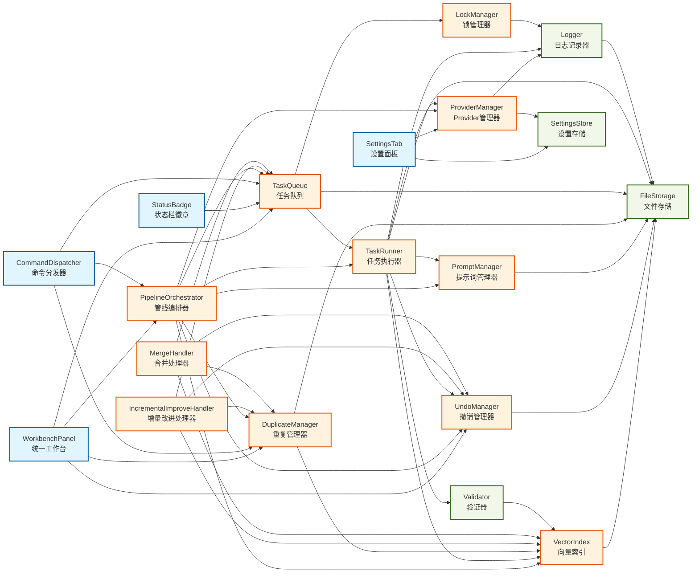
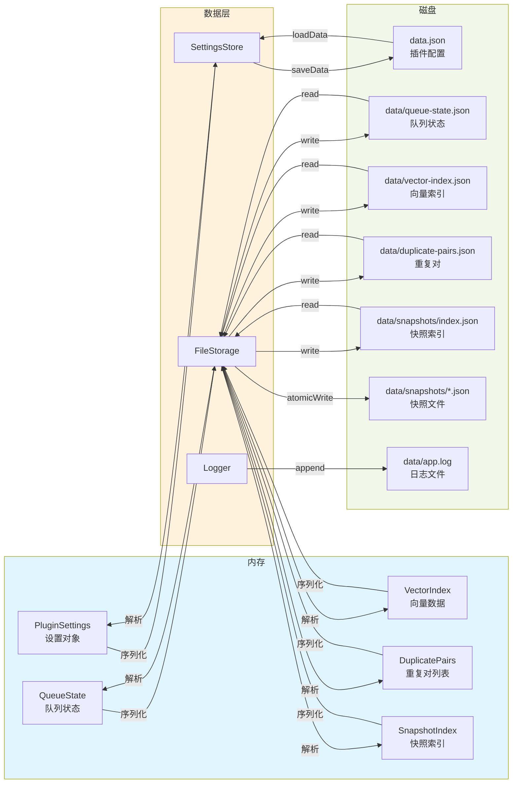

# 系统架构与详细设计文档

**版本**: 0.9.3  
**最后更新**: 2025-12-10  
**项目**: obsidian-cognitive-razor

> **文档说明**：本文档描述 Cognitive Razor 插件的完整技术架构、设计决策和实现细节。文档内容与代码库保持同步，所有架构图、数据结构和流程描述均基于实际代码实现。本文档最后更新于 2025-12-10，与代码版本 0.9.3 保持一致。

---

## 目录

1. [项目概述](#1-项目概述)
   - 1.1 [项目简介](#11-项目简介)
   - 1.2 [核心功能](#12-核心功能)
   - 1.3 [设计哲学](#13-设计哲学)

2. [技术栈](#2-技术栈)
   - 2.1 [核心依赖](#21-核心依赖)
   - 2.2 [开发工具](#22-开发工具)
   - 2.3 [版本要求](#23-版本要求)

3. [系统架构](#3-系统架构)
   - 3.1 [三层架构概述](#31-三层架构概述)
   - 3.2 [组件依赖关系](#32-组件依赖关系)
   - 3.3 [数据流向](#33-数据流向)

4. [数据层设计](#4-数据层设计)
   - 4.1 [FileStorage](#41-filestorage)
   - 4.2 [Logger](#42-logger)
   - 4.3 [SettingsStore](#43-settingsstore)
   - 4.4 [Validator](#44-validator)

5. [应用层设计](#5-应用层设计)
   - 5.1 [TaskQueue](#51-taskqueue)
   - 5.2 [TaskRunner](#52-taskrunner)
   - 5.3 [VectorIndex](#53-vectorindex)
   - 5.4 [LockManager](#54-lockmanager)
   - 5.5 [UndoManager](#55-undomanager)
   - 5.6 [ProviderManager](#56-providermanager)
   - 5.7 [PromptManager](#57-promptmanager)
   - 5.8 [DuplicateManager](#58-duplicatemanager)
   - 5.9 [PipelineOrchestrator](#59-pipelineorchestrator)

6. [UI层设计](#6-ui层设计)
   - 6.1 [WorkbenchPanel](#61-workbenchpanel)
   - 6.2 [StatusBadge](#62-statusbadge)
   - 6.3 [CommandDispatcher](#63-commanddispatcher)
   - 6.4 [SettingsTab](#64-settingstab)

7. [核心流程](#7-核心流程)
   - 7.1 [概念创建流程](#71-概念创建流程)
   - 7.2 [任务调度流程](#72-任务调度流程)
   - 7.3 [去重检测流程](#73-去重检测流程)
   - 7.4 [撤销恢复流程](#74-撤销恢复流程)
   - 7.5 [管线编排流程](#75-管线编排流程)

8. [数据模型](#8-数据模型)
   - 8.1 [Frontmatter 结构](#81-frontmatter-结构)
   - 8.2 [任务记录结构](#82-任务记录结构)
   - 8.3 [向量索引结构](#83-向量索引结构)
   - 8.4 [重复对结构](#84-重复对结构)
   - 8.5 [配置结构](#85-配置结构)

9. [错误处理](#9-错误处理)
   - 9.1 [错误分类](#91-错误分类)
   - 9.2 [重试策略](#92-重试策略)
   - 9.3 [Result Monad](#93-result-monad)
   - 9.4 [日志记录](#94-日志记录)
   - 9.5 [用户通知](#95-用户通知)

---

## 1. 项目概述

### 1.1 项目简介

**Cognitive Razor** 是一个为 Obsidian 设计的 AI 驱动知识管理插件，旨在解决数字认知系统中的"概念耗散与主权丧失"问题。该插件通过严格的本体论约束和算法化的降熵仪式，将模糊的概念转化为结构化的知识节点，确保每个概念在系统中拥有唯一的身份、可验证的存在和完整的谱系。

插件的核心价值在于：

- **唯一性保障**：通过 UID 和语义向量嵌入，确保知识库中不存在重复概念
- **主权回归**：所有写入操作必须经过人类显式确认，AI 仅作为建议者而非决策者
- **可逆性设计**：增量改进和合并操作前自动创建快照，支持无损撤销操作（新建概念无需快照）
- **透明化流程**：所有后台任务、状态转换和错误信息在 UI 上实时可见

Cognitive Razor 不仅是一个工具，更是一套关于"概念如何在数字系统中合法降生"的系统方法论。它建立在六项第一性原理（存在原理、可判定原理、可逆原理、透明原理、人机共裁原理、主权原理）和十五条核心公理之上，确保系统的每一个设计决策都有坚实的哲学基础。

### 1.2 核心功能

Cognitive Razor 提供以下核心功能模块：

#### 1. 概念创建与标准化
- **智能标准化**：将用户输入的模糊描述转化为符合本体论规范的标准概念
- **类型识别**：自动识别概念类型（Domain、Issue、Theory、Entity、Mechanism）
- **别名扩展**：利用 AI 生成概念的所有可能称呼（全称、简称、俗称、外文名）
- **谱系建立**：自动建立概念的父子关系，确保知识图谱的层级结构

#### 2. 语义去重与合并
- **向量嵌入**：将概念映射到高维语义空间，实现精确的相似度计算
- **分桶检索**：按概念类型分桶，避免跨类型误判（如"苹果公司"与"苹果水果"）
- **双重阈值**：
  - 阻断阈值（>0.95）：自动拒绝极高相似度的重复概念
  - 提示阈值（>0.85）：将疑似重复提交人类裁决
- **智能合并**：支持将重复概念合并，保留完整的合并历史

#### 3. 增量改进与内容生成
- **渐进式填充**：从 Stub（存根）→ Draft（草稿）→ Evergreen（常青）的成熟度演化
- **上下文感知**：基于概念的类型、谱系和领域知识生成高质量内容
- **多轮推理**：支持针对不同维度（领域、议题、理论、实体、机制）的专项推理
- **人类确认**：所有 AI 生成的内容必须经过人类审核后才能写入

#### 4. 任务队列与并发控制
- **全局队列**：所有写入操作进入统一队列，确保操作的串行化
- **锁机制**：支持节点锁和类型锁，防止并发冲突
- **状态管理**：完整的任务生命周期管理（Pending → Running → Awaiting → Confirm → Completed）
- **持久化**：队列状态持久化到磁盘，支持断电恢复

#### 5. 撤销与快照管理
- **选择性快照**：仅在增量改进和合并操作前创建快照（新建概念无需快照，因为可直接删除）
- **索引管理**：维护快照索引，支持快速查找和恢复
- **原子恢复**：使用原子写入机制确保恢复操作的安全性
- **自动清理**：定期清理过期快照，避免磁盘空间浪费

#### 6. 统一工作台
- **四区域布局**：
  - 创建概念区：快速创建新概念
  - 重复概念区：管理待处理的重复对
  - 队列状态区：实时监控任务执行
  - 最近操作区：查看和撤销最近的操作
- **实时同步**：UI 状态与后台状态保持毫秒级同步
- **错误透明**：所有错误信息清晰展示，提供可操作的解决方案

#### 7. 多 Provider 支持
- **OpenAI 兼容**：支持所有兼容 OpenAI API 格式的服务
- **自定义端点**：支持配置自定义 API 端点和模型
- **网络监控**：实时监控 Provider 可用性，自动切换备用方案
- **错误重试**：智能重试策略，区分内容错误和网络错误

### 1.3 设计哲学

Cognitive Razor 的设计哲学源自《Cognitive Razor：数字认知系统的本体论重构与主权辩护白皮书》，该白皮书从认知的"元问题"出发，通过严格的演绎推理，构建了一套包含第一性原理、十五条公理及完整推论链的理论体系。

#### 核心哲学原则

**1. 存在即铭文（Existence as Inscription）**

在数字世界中，存在不是一种状态，而是一种被"证明"的过程。每个概念必须拥有不可篡改的身份证明（UID）与时空锚点（Frontmatter）。无证之物，即为噪音。

> "未被命名且未被签名的概念在本体论上不存在。"

**2. 便捷是主权的敌人（Convenience vs. Sovereignty）**

当我们将思维外包给黑箱算法时，谁拥有最终裁决权？Cognitive Razor 通过引入"必要的认知阻力"，确保人类始终是认知的主体，而非数据的宿主。

> "机器是建议者，人类是裁决者。AI 拥有生成内容的无限能力，但没有任何'确认事实'的权利。"

**3. 可逆性即自由（Reversibility as Freedom）**

权力的本质是"悔棋权"。不可逆的写入等同于暴政。系统记录的不仅是"状态"，更是"状态的变更历史"。

> "任何对系统的熵增操作（写入、删除、修改）都必须伴随一条确定性的回滚路径。"

**4. 拒绝即诚实（Rejection as Honesty）**

诚实的拒绝优于虚假的顺从。当约束不足、能力不足或风险过高时，系统必须返回结构化的拒绝信号，而非编造幻觉。

> "一个诚实的'我不知道'在价值上远高于一万个虚构的'我知道'。"

**5. 透明即信任（Transparency as Trust）**

黑箱即不信任。每一次决策、每一次等待、每一次错误、每一次拒绝，都必须在观测界面上拥有同构的投影。

> "逻辑必须是透明的玻璃盒，而非神谕的黑箱。"

#### 五维认知张量

Cognitive Razor 将人类认知抽象为五个且仅有五个"存在的形式"，构成完备的认知张量空间：

1. **Domain（边界）**：回答"何所为界"，定义问题讨论的合法范围
2. **Issue（张力）**：回答"哪对矛盾"，体现推动理论演化的根本动力
3. **Theory（推演）**：回答"如何解决"，形成从公理到解释模型的逻辑过程
4. **Entity（对象）**：回答"何物"，具有可观测属性的具体名词性存在
5. **Mechanism（因果）**：回答"何因致何果"，描述实体之间相互作用的过程

这五者构成了一个自洽的闭环：Domain 划界 → Issue 提问 → Theory 求解 → Entity 定义对象 → Mechanism 描述互动。缺失任何一环，认知闭环即告断裂。

#### 降熵仪式

写入不是简单的数据持久化，而是一场对抗熵增的仪式。Cognitive Razor 定义了不可删减的六步仪式序列：

1. **标准化（Normalization）**：生成 UID，清洗标题，确定 Type
2. **别名扩展（Alias Expansion）**：捕获概念的所有可能叫法
3. **嵌入生成（Embedding）**：将概念映射到高维向量空间
4. **人类确认（Human Confirmation）**：AI 提交草稿，人类行使批准权
5. **写入（Commit）**：原子写入文件（增量改进/合并时保存快照）
6. **嵌入与去重（Embedding & Deduplication）**：生成向量嵌入，在同类型桶内检索相似概念

这一仪式的每一步都是对"熵"的对抗。如果没有去重，系统会被垃圾淹没；如果没有快照，增量改进的错误将不可挽回。

#### 奥卡姆剃刀审判

Cognitive Razor 的每一个设计要素都经过奥卡姆剃刀的严苛审视。如果剔除某要素，系统逻辑链条不断裂，则该要素必须被删除。通过反证法，我们证明了 UID、Type、Queue、Snapshot、Aliases、Refusal 等核心要素的必要性。

> "若公理成立，则系统必须如此，且只能如此。"

## 2. 技术栈

### 2.1 核心依赖

Cognitive Razor 基于 Obsidian 插件生态构建，采用现代化的 TypeScript 技术栈。以下是项目的核心依赖：

#### 运行时依赖

| 依赖 | 版本 | 用途 |
|------|------|------|
| `yaml` | ^2.8.2 | YAML 格式解析与序列化，用于处理 Frontmatter |

**注意**：项目仅有一个运行时依赖 `yaml`，其他所有功能都基于 Obsidian API 和 TypeScript 标准库实现。

#### 开发依赖

| 依赖 | 版本 | 用途 |
|------|------|------|
| `obsidian` | latest | Obsidian API 类型定义，提供插件开发接口 |
| `typescript` | ^5.7.2 | TypeScript 编译器，提供类型检查和编译功能 |
| `esbuild` | ^0.25.12 | 高性能构建工具，将 TypeScript 代码打包为单一 JavaScript 文件 |
| `vitest` | ^4.0.15 | 现代化测试框架，支持单元测试和属性测试 |
| `fast-check` | ^4.3.0 | 属性测试库，用于生成随机测试数据验证不变量 |
| `eslint` | ^9.16.0 | 代码质量检查工具，使用 Flat Config 格式 |
| `typescript-eslint` | ^8.17.0 | TypeScript 的 ESLint 插件，提供 TypeScript 特定的 lint 规则 |
| `@types/node` | ^22.10.1 | Node.js 类型定义 |
| `tslib` | ^2.8.1 | TypeScript 运行时辅助库 |
| `builtin-modules` | ^3.3.0 | Node.js 内置模块列表，用于构建配置 |

#### 测试相关依赖

| 依赖 | 版本 | 用途 |
|------|------|------|
| `@vitest/ui` | ^4.0.15 | Vitest 的 Web UI 界面，提供可视化测试结果 |
| `happy-dom` | ^20.0.11 | 轻量级 DOM 实现，用于测试环境模拟浏览器 API |
| `knip` | ^5.72.0 | 未使用代码检测工具，帮助清理冗余依赖和死代码 |

**依赖管理原则**：

1. **最小化原则**：仅保留必要依赖，避免引入大型库
2. **浏览器兼容**：优先选择浏览器兼容的包，确保移动端可用
3. **类型安全**：所有依赖必须提供 TypeScript 类型定义
4. **版本锁定**：使用 `package-lock.json` 锁定依赖版本，确保构建可复现

**当前版本**：0.9.3（参见 `package.json` 和 `manifest.json`）

**参考文件**：
- `package.json`：npm 包配置和依赖定义
- `manifest.json`：Obsidian 插件元数据

### 2.2 开发工具

Cognitive Razor 使用现代化的开发工具链，确保代码质量和开发效率：

#### 构建工具

**esbuild (v0.25.12)**

- **用途**：将 TypeScript 源代码打包为单一的 `main.js` 文件
- **优势**：
  - 极快的构建速度（比 webpack 快 10-100 倍）
  - 内置 TypeScript 支持，无需额外配置
  - 支持 Tree Shaking，自动移除未使用的代码
  - 支持 Watch 模式，实现热重载开发
- **配置文件**：`esbuild.config.mjs`
- **构建命令**：
  - 开发模式：`npm run dev`（启用 watch 模式和 sourcemap）
  - 生产模式：`npm run build`（启用代码压缩和优化）

**构建流程**：
```
TypeScript 源码 (main.ts + src/**/*.ts)
    ↓ [esbuild]
单一 JavaScript 文件 (main.js)
    ↓ [Obsidian]
插件加载运行
```

**注意**：入口文件是根目录的 `main.ts`，而非 `src/main.ts`。esbuild 会将 `main.ts` 及其所有依赖打包为单一的 `main.js` 文件。

#### 类型检查

**TypeScript (v5.7.2)**

- **配置**：`tsconfig.json`
- **关键配置项**：
  - `target: ES2022`：使用现代 JavaScript 特性
  - `strict: true`：启用所有严格类型检查
  - `moduleResolution: bundler`：使用 bundler 模式的模块解析
  - `skipLibCheck: true`：跳过第三方库的类型检查，加快编译速度
- **类型检查命令**：`tsc -noEmit -skipLibCheck`（仅检查类型，不生成文件）

**TypeScript 使用规范**：
- 禁止使用 `any` 类型，使用 `unknown` 代替
- 所有函数必须显式声明返回类型
- 使用 `interface` 定义数据结构，使用 `type` 定义联合类型
- 使用 Result Monad 模式处理错误，避免抛出异常

#### 代码质量

**ESLint (v9.16.0) + typescript-eslint (v8.17.0)**

- **配置格式**：Flat Config (`eslint.config.js`)
- **关键规则**：
  - 禁止使用 `any` 类型
  - 强制使用 `const` 声明不可变变量
  - 要求显式的函数返回类型
  - 禁止未使用的变量和导入
- **检查命令**：
  - 检查代码：`npx eslint ./src/`
  - 自动修复：`npx eslint ./src/ --fix`

**注意**：本项目使用 ESLint 9.x 的 Flat Config 格式，不再支持旧版 `.eslintrc` 格式。

#### 测试框架

**Vitest (v4.0.15)**

- **用途**：单元测试、集成测试、属性测试
- **优势**：
  - 与 Vite 生态无缝集成
  - 原生支持 TypeScript 和 ESM
  - 快速的测试执行速度
  - 内置代码覆盖率报告
  - 支持 Watch 模式和 UI 界面
- **测试命令**：
  - 运行所有测试：`npm run test`
  - Watch 模式：`npm run test:watch`
  - UI 界面：`npm run test:ui`
  - 覆盖率报告：`npm run test:coverage`

**fast-check (v4.3.0)**

- **用途**：属性测试（Property-Based Testing）
- **使用场景**：
  - 验证不变量（如标题层级一致性）
  - 测试边界条件（如空输入、极大值）
  - 生成随机测试数据
- **示例**：参见 `src/core/task-queue.test.ts`、`src/core/pipeline-orchestrator.test.ts`

#### 版本管理

**version-bump.mjs**

- **用途**：自动更新 `manifest.json` 和 `versions.json` 的版本号
- **使用**：`npm version patch/minor/major`

**verify-release.js**

- **用途**：验证发布前的文件完整性
- **检查项**：
  - `main.js` 是否存在
  - `manifest.json` 版本号是否一致
  - `versions.json` 是否包含当前版本

#### 开发环境

**推荐配置**：
- **编辑器**：Visual Studio Code
- **插件**：
  - ESLint：实时代码检查
  - TypeScript Vue Plugin (Volar)：增强 TypeScript 支持
  - Vitest：测试结果可视化
- **Node.js**：22+ LTS（Node 18 已于 2025 年 EOL）

**参考文件**：
- `esbuild.config.mjs`：esbuild 构建配置
- `tsconfig.json`：TypeScript 编译器配置
- `eslint.config.js`：ESLint 代码检查配置
- `package.json`：npm 脚本和依赖定义

**注意**：项目当前未使用独立的 `vitest.config.ts`，测试配置在 `package.json` 中定义。

### 2.3 版本要求

为确保项目的稳定性和兼容性，Cognitive Razor 对运行环境和依赖版本有明确要求：

#### 运行环境

| 环境 | 最低版本 | 推荐版本 | 说明 |
|------|----------|----------|------|
| **Node.js** | 22.0.0 | 22.x LTS | Node 18 已于 2025 年 EOL，必须使用 Node 22+ |
| **npm** | 10.0.0 | 最新版本 | 与 Node.js 22 配套的包管理器 |
| **Obsidian** | 1.5.7 | 最新版本 | 插件的最低支持版本，定义在 `manifest.json` 的 `minAppVersion` |

**重要提示**：
- ❌ **禁止使用 Node 18 或更早版本**：Node 18 已于 2025 年 4 月 30 日停止维护，存在安全风险
- ✅ **推荐使用 Node 22 LTS**：长期支持版本，稳定性和安全性有保障
- ⚠️ **Obsidian 版本兼容性**：插件使用了 Obsidian 1.5.7+ 的新 API，低于此版本的 Obsidian 无法运行

#### 核心依赖版本

| 依赖 | 最低版本 | 当前版本 | 说明 |
|------|----------|----------|------|
| **TypeScript** | 5.7.0 | 5.7.2 | 支持最新的类型检查特性和 ES2022+ 语法 |
| **esbuild** | 0.25.0 | 0.25.12 | 高性能构建工具，必须使用 0.25.x 版本 |
| **ESLint** | 9.0.0 | 9.16.0 | 使用 Flat Config 格式，不兼容旧版 `.eslintrc` |
| **Vitest** | 4.0.0 | 4.0.15 | 现代化测试框架 |
| **fast-check** | 4.0.0 | 4.3.0 | 属性测试库 |

#### TypeScript 配置要求

**tsconfig.json 关键配置**：

```json
{
  "compilerOptions": {
    "target": "ES2022",           // 使用现代 JavaScript 特性
    "module": "ESNext",           // 使用 ESM 模块系统
    "moduleResolution": "bundler", // bundler 模式的模块解析
    "strict": true,               // 启用所有严格类型检查
    "skipLibCheck": true,         // 跳过第三方库的类型检查
    "esModuleInterop": true,      // 启用 ESM 互操作性
    "resolveJsonModule": true,    // 支持导入 JSON 文件
    "isolatedModules": true,      // 确保每个文件可以独立编译
    "noUnusedLocals": true,       // 禁止未使用的局部变量
    "noUnusedParameters": true,   // 禁止未使用的函数参数
    "noImplicitReturns": true,    // 要求函数所有分支都有返回值
    "noFallthroughCasesInSwitch": true // 禁止 switch 语句的 fallthrough
  }
}
```

**类型安全要求**：
- ❌ **禁止使用 `any` 类型**：使用 `unknown` 代替，强制类型检查
- ✅ **使用 `strict: true`**：启用所有严格模式检查
- ✅ **显式返回类型**：所有函数必须声明返回类型

#### ESLint 配置要求

**eslint.config.js 格式**：

本项目使用 ESLint 9.x 的 Flat Config 格式，不再支持旧版 `.eslintrc` 格式。

```javascript
import eslint from '@eslint/js';
import tseslint from 'typescript-eslint';

export default [
  eslint.configs.recommended,
  ...tseslint.configs.recommended,
  {
    rules: {
      '@typescript-eslint/no-explicit-any': 'error',
      '@typescript-eslint/explicit-function-return-type': 'warn',
      // ... 其他规则
    }
  }
];
```

**重要变更**：
- ❌ **不再支持 `.eslintrc` 格式**：旧版配置文件已弃用
- ✅ **使用 `eslint.config.js`**：新版 Flat Config 格式
- ✅ **typescript-eslint v8+**：与 ESLint 9 兼容的 TypeScript 插件

#### Obsidian API 版本要求

**最低支持版本**：Obsidian 1.5.7

**可用 API**（1.5.7+）：
- ✅ `onExternalSettingsChange`：监听外部设置变更
- ✅ `prepareFuzzySearch`：准备模糊搜索
- ✅ `getAvailablePathForAttachment`：获取附件可用路径

**已弃用 API**（禁止使用）：
- ❌ `prepareQuery`：已被 `prepareFuzzySearch` 替代
- ❌ `fuzzySearch`：已被 `prepareFuzzySearch` 替代

**兼容性策略**：
- 插件仅使用 Obsidian 1.5.7+ 支持的 API
- 不使用实验性或未文档化的 API
- 定期检查 Obsidian API 更新，及时适配新特性

#### AI 模型版本要求

**推荐模型**：

| 任务类型 | 推荐模型 | 备选模型 | 说明 |
|---------|---------|---------|------|
| **聊天/推理** | `gpt-4o` | `gpt-4o-mini` | 默认使用 gpt-4o，轻量任务可用 gpt-4o-mini |
| **向量嵌入** | `text-embedding-3-small` | `text-embedding-3-large` | 默认使用 small 版本，平衡性能和成本 |

**禁止使用**：
- ❌ `gpt-3.5-turbo`：已过时，能力不足以完成复杂推理任务

**Provider 兼容性**：
- 用户可通过 Provider 配置使用其他兼容 OpenAI 格式的服务
- 必须支持 `/chat/completions` 和 `/embeddings` 标准端点
- 参考实现：`src/core/provider-manager.ts`

#### 版本升级策略

**依赖更新原则**：
1. **主版本更新**：需要评估破坏性变更，更新代码适配
2. **次版本更新**：定期更新，获取新特性和性能改进
3. **补丁版本更新**：及时更新，修复安全漏洞和 bug
4. **锁定文件**：使用 `package-lock.json` 确保构建可复现

**升级检查清单**：
- [ ] 检查 CHANGELOG 和 Breaking Changes
- [ ] 更新 TypeScript 类型定义
- [ ] 运行完整测试套件
- [ ] 检查 ESLint 规则变更
- [ ] 验证 Obsidian API 兼容性
- [ ] 更新文档中的版本号

**参考文档**：
- `.kiro/steering/tech-stack-reference.md`：技术栈基线规范
- `package.json`：依赖版本定义
- `manifest.json`：Obsidian 插件元数据

---

## 3. 系统架构

### 3.1 三层架构概述

Cognitive Razor 采用经典的三层架构设计，将系统划分为数据层（Data Layer）、应用层（Application Layer）和 UI 层（UI Layer）。这种分层设计确保了代码的模块化、可测试性和可维护性。

#### 架构原则

**单向依赖原则**

系统严格遵循单向依赖原则：**UI 层 → 应用层 → 数据层**

- **UI 层**可以依赖应用层和数据层
- **应用层**可以依赖数据层，但不能依赖 UI 层
- **数据层**不依赖任何其他层，保持完全独立

这种单向依赖确保了：
1. **低耦合**：每一层只关注自己的职责，不需要了解上层的实现细节
2. **可测试性**：数据层和应用层可以独立于 UI 进行单元测试
3. **可替换性**：可以轻松替换 UI 实现而不影响业务逻辑
4. **清晰的职责边界**：每一层的职责明确，避免代码混乱

**依赖注入模式**

系统使用依赖注入（Dependency Injection）模式管理组件之间的依赖关系：

- 所有组件在 `main.ts` 的 `onload()` 方法中按顺序初始化
- 组件通过构造函数接收依赖，而非自行创建
- 插件主类提供 `getComponents()` 方法，供 UI 层访问应用层和数据层组件

这种模式的优势：
1. **解耦**：组件不需要知道依赖的具体实现
2. **可测试**：可以轻松注入 Mock 对象进行单元测试
3. **灵活性**：可以在运行时动态替换依赖实现

#### 系统架构图

以下 Mermaid 图表展示了 Cognitive Razor 的三层架构及主要组件：


**图表说明**：

- **蓝色区域**：UI 层组件，负责用户交互和界面展示
- **橙色区域**：应用层组件，负责核心业务逻辑
- **绿色区域**：数据层组件，负责数据存储和基础服务
- **箭头方向**：表示依赖关系，遵循单向依赖原则（UI → 应用 → 数据）

#### 三层职责划分

**数据层（Data Layer）**

**职责**：提供底层的数据存储、日志记录、配置管理和数据验证功能

**核心组件**：
- **FileStorage**：文件读写、原子写入、目录管理
- **Logger**：日志记录、日志级别控制、循环日志
- **SettingsStore**：设置加载、保存、订阅
- **Validator**：输出验证、Schema 校验、语义去重

**设计特点**：
- 完全独立，不依赖任何其他层
- 提供通用的数据操作接口，不包含业务逻辑
- 使用 Result Monad 模式返回操作结果，避免抛出异常
- 所有文件操作都经过 FileStorage 统一管理，确保路径一致性

**参考文件**：`src/data/` 目录下的所有文件

---

**应用层（Application Layer）**

**职责**：实现核心业务逻辑，包括任务调度、向量索引、锁管理、撤销管理、Provider 管理、去重检测等

**核心组件**：
- **TaskQueue**：任务调度、并发控制、状态管理
- **TaskRunner**：任务执行、Provider 调用、结果验证
- **VectorIndex**：向量存储、相似度搜索、分桶管理
- **LockManager**：锁获取、锁释放、锁恢复
- **UndoManager**：快照创建、快照恢复、快照清理
- **ProviderManager**：Provider 配置、API 调用、网络状态监控
- **PromptManager**：模板加载、Prompt 构建、槽位填充
- **DuplicateManager**：重复检测、重复对管理、合并流程
- **PipelineOrchestrator**：管线编排、阶段转换、用户确认

**设计特点**：
- 依赖数据层提供的基础服务
- 实现所有业务逻辑和算法
- 通过事件订阅机制与 UI 层通信，避免直接依赖
- 使用 Result Monad 模式处理错误，确保错误可追溯

**参考文件**：`src/core/` 目录下的所有文件

---

**UI 层（UI Layer）**

**职责**：提供用户交互界面，展示系统状态，接收用户输入

**核心组件**：
- **WorkbenchPanel**：统一工作台，四区域布局，用户交互
- **StatusBadge**：状态栏显示，队列状态更新
- **CommandDispatcher**：命令注册、命令分发
- **SettingsTab**：设置界面、配置管理

**设计特点**：
- 依赖应用层和数据层提供的服务
- 通过订阅机制监听应用层事件，实时更新 UI
- 所有用户操作都通过应用层的公开接口执行
- 使用 Obsidian 提供的 UI 组件（Modal、Notice、Setting 等）

**参考文件**：`src/ui/` 目录下的所有文件

#### 初始化顺序

系统组件的初始化严格按照依赖关系从下到上进行：

```
1. 数据目录初始化
   ├─ 创建 data/ 目录
   └─ 创建 data/snapshots/ 子目录

2. 数据层组件初始化
   ├─ FileStorage（依赖：Obsidian Vault）
   ├─ Logger（依赖：FileStorage）
   ├─ SettingsStore（依赖：Plugin）
   └─ Validator（依赖：VectorIndex，稍后注入）

3. 加载设置
   ├─ 创建 VersionChecker
   ├─ 加载 data.json
   ├─ 检查版本兼容性
   └─ 同步日志级别

4. 应用层组件初始化
   ├─ VectorIndex（依赖：FileStorage）
   ├─ Validator（注入 VectorIndex）
   ├─ LockManager（无依赖）
   ├─ UndoManager（依赖：FileStorage）
   ├─ ProviderManager（依赖：SettingsStore）
   ├─ PromptManager（依赖：FileStorage）
   ├─ DuplicateManager（依赖：VectorIndex, FileStorage）
   ├─ TaskRunner（依赖：ProviderManager, PromptManager, Validator, UndoManager）
   ├─ TaskQueue（依赖：LockManager, FileStorage, TaskRunner）
   ├─ IncrementalImproveHandler（依赖：TaskQueue, UndoManager）
   ├─ MergeHandler（依赖：TaskQueue, DuplicateManager）
   └─ PipelineOrchestrator（依赖：TaskQueue, TaskRunner, DuplicateManager）

5. UI 层组件初始化
   ├─ 注册视图（WorkbenchPanel）
   ├─ StatusBadge（依赖：Plugin, TaskQueue）
   ├─ CommandDispatcher（依赖：Plugin, TaskQueue）
   └─ SettingsTab（依赖：Plugin）

6. 事件订阅
   ├─ 订阅队列事件 → 更新 StatusBadge 和 WorkbenchPanel
   ├─ 订阅设置变更事件 → 同步配置
   ├─ 订阅重复对变更事件 → 更新 WorkbenchPanel
   └─ 订阅管线事件 → 更新 WorkbenchPanel
```

**参考文件**：
- `main.ts`：插件主类，`onload()` 方法展示完整的初始化流程

#### 卸载顺序

系统卸载时按照初始化的逆序进行清理：

```
1. 暂停任务队列
   └─ 停止调度器，等待运行中任务完成

2. 停止后台处理器
   ├─ IncrementalImproveHandler.stop()
   ├─ MergeHandler.stop()
   └─ PipelineOrchestrator.dispose()

3. 清理 UI 组件
   ├─ StatusBadge.destroy()
   └─ 卸载所有视图

4. 解除事件订阅
   └─ 调用所有 unsubscribe 函数

5. 保存状态
   └─ 队列状态、向量索引、重复对列表自动持久化
```

**参考文件**：
- `main.ts`：插件主类，`onunload()` 方法展示组件卸载和资源清理流程

#### 架构优势

**1. 清晰的职责边界**

每一层只关注自己的职责，不会出现"上帝类"或"意大利面条代码"。例如：
- FileStorage 只负责文件读写，不关心文件内容的业务含义
- TaskQueue 只负责任务调度，不关心任务的具体执行逻辑
- WorkbenchPanel 只负责 UI 展示，不包含任何业务逻辑

**2. 高可测试性**

- 数据层和应用层可以独立于 Obsidian 环境进行单元测试
- 通过依赖注入，可以轻松 Mock 依赖组件
- 每个组件的职责单一，测试用例编写简单

**3. 易于维护和扩展**

- 修改某一层的实现不会影响其他层
- 可以轻松添加新的组件或替换现有组件
- 代码结构清晰，新开发者容易理解

**4. 符合 SOLID 原则**

- **单一职责原则（SRP）**：每个组件只有一个变更理由
- **开闭原则（OCP）**：对扩展开放，对修改封闭
- **里氏替换原则（LSP）**：子类可以替换父类
- **接口隔离原则（ISP）**：接口精简，不强迫实现不需要的方法
- **依赖倒置原则（DIP）**：依赖抽象而非具体实现

**参考文档**：
- `main.ts`：插件主类，展示完整的初始化和卸载流程
- `src/types.ts`：所有接口定义，展示组件之间的契约

### 3.2 组件依赖关系

本节使用 Mermaid 图表展示系统中主要组件之间的依赖关系。图表采用从左到右（Left-to-Right）的布局，清晰展示依赖方向和数据流。

#### 完整依赖关系图



**图表说明**：

- **蓝色节点**：UI 层组件
- **橙色节点**：应用层组件
- **绿色节点**：数据层组件
- **箭头方向**：从左到右表示依赖关系，A → B 表示 A 依赖 B
- **依赖流向**：UI 层 → 应用层 → 数据层，遵循单向依赖原则
```

#### 依赖关系说明

**UI 层依赖**

UI 层组件通过插件主类的 `getComponents()` 方法获取应用层和数据层组件的引用：

- **WorkbenchPanel**：依赖最多的 UI 组件，需要访问管线编排器、任务队列、重复管理器和撤销管理器
- **StatusBadge**：仅依赖任务队列，用于显示队列状态
- **CommandDispatcher**：依赖任务队列、管线编排器和重复管理器，用于执行用户命令
- **SettingsTab**：依赖设置存储和 Provider 管理器，用于配置管理

**应用层依赖**

应用层组件之间存在复杂的依赖关系，但都遵循单向依赖原则：

- **PipelineOrchestrator**（管线编排器）：作为概念创建流程的总控制器，依赖几乎所有其他应用层组件
- **TaskQueue**（任务队列）：依赖锁管理器和任务执行器，负责任务调度
- **TaskRunner**（任务执行器）：依赖 Provider 管理器、提示词管理器、验证器、撤销管理器和向量索引，负责任务执行
- **DuplicateManager**（重复管理器）：依赖向量索引和文件存储，负责去重检测
- **IncrementalImproveHandler**（增量改进处理器）：依赖任务队列、撤销管理器、向量索引和重复管理器
- **MergeHandler**（合并处理器）：依赖任务队列、重复管理器、向量索引和撤销管理器

**数据层依赖**

数据层组件保持最小依赖：

- **Logger**：依赖 FileStorage 进行日志文件读写
- **Validator**：依赖 VectorIndex 进行语义去重
- **FileStorage**、**SettingsStore**：完全独立，不依赖其他组件

#### 依赖注入流程

系统使用依赖注入模式管理组件依赖，初始化流程如下：

```typescript
// 1. 初始化数据层（按依赖顺序）
const fileStorage = new FileStorage(vault, pluginDir);
const logger = new Logger(logFilePath, fileStorage, logLevel);
const settingsStore = new SettingsStore(plugin);

// 2. 初始化应用层（按依赖顺序）
const vectorIndex = new VectorIndex(indexPath, fileStorage, model, dimension);
const validator = new Validator(vectorIndex);
const lockManager = new LockManager(logger);
const undoManager = new UndoManager(fileStorage, logger, snapshotsDir, maxSnapshots, maxAgeDays);
const providerManager = new ProviderManager(settingsStore, logger);
const promptManager = new PromptManager(fileStorage, logger, promptsDir);
const duplicateManager = new DuplicateManager(vectorIndex, fileStorage, logger, settingsStore, pairsPath);
const taskRunner = new TaskRunner({ providerManager, promptManager, validator, undoManager, logger, vectorIndex, fileStorage, settingsStore });
const taskQueue = new TaskQueue(lockManager, fileStorage, logger, settingsStore, queueStatePath);
taskQueue.setTaskRunner(taskRunner); // 解决循环依赖

// 3. 初始化 UI 层（通过 getComponents() 访问应用层）
const workbenchPanel = new WorkbenchPanel(leaf);
workbenchPanel.setPlugin(plugin); // 通过 plugin.getComponents() 访问所有组件
```

**参考文件**：
- `main.ts`：`onload()` 方法展示完整的依赖注入流程
- `src/types.ts`：所有接口定义
- `src/core/task-queue.ts`：TaskQueue 实现，包含 `setTaskRunner()` 方法用于解决循环依赖

#### 循环依赖处理

系统中存在一处循环依赖：**TaskQueue ↔ TaskRunner**

- TaskQueue 需要 TaskRunner 来执行任务
- TaskRunner 需要访问 TaskQueue 来查询任务状态（间接依赖）

**解决方案**：使用 Setter 注入

```typescript
// 先创建 TaskQueue（不注入 TaskRunner）
const taskQueue = new TaskQueue(lockManager, fileStorage, logger, settingsStore, queueStatePath);

// 再创建 TaskRunner
const taskRunner = new TaskRunner({ /* 依赖 */ });

// 最后通过 Setter 注入 TaskRunner
taskQueue.setTaskRunner(taskRunner);
```

这种方式打破了循环依赖，同时保持了代码的清晰性。

**参考文件**：
- `main.ts`：插件主类，`initializeApplicationLayer()` 方法展示循环依赖的解决方案
- `src/core/task-queue.ts`：TaskQueue 实现，`setTaskRunner()` 方法用于注入 TaskRunner

#### 依赖关系设计原则

**1. 最小依赖原则**

每个组件只依赖完成其职责所必需的组件，避免不必要的耦合。例如：
- StatusBadge 只依赖 TaskQueue，不需要依赖其他应用层组件
- LockManager 只依赖 Logger，保持轻量级

**2. 接口隔离原则**

组件通过接口而非具体实现进行依赖，便于测试和替换。例如：
- TaskRunner 依赖 `IProviderManager` 接口，而非 `ProviderManager` 类
- 所有核心组件都定义了对应的接口（参见 `src/types.ts`）

**3. 依赖倒置原则**

高层模块不依赖低层模块，两者都依赖抽象。例如：
- UI 层通过 `getComponents()` 获取组件引用，而非直接 import
- 应用层通过构造函数注入依赖，而非自行创建

**4. 单向依赖原则**

严格遵循 UI → 应用 → 数据的单向依赖，避免反向依赖。例如：
- 数据层组件不能依赖应用层或 UI 层
- 应用层组件不能依赖 UI 层

**参考文档**：
- `docs/哲学设计文档.md`：系统设计哲学
- `.kiro/steering/AGENTS.md`：代码组织规范

### 3.3 数据流向

本节描述系统中数据的流转路径，包括用户输入如何流经各层、任务数据如何在组件间传递、以及持久化数据的读写路径。

#### 总体数据流图

以下 Mermaid 图表展示了数据在三层架构之间的流转路径和关键转换点：


**数据流说明**：

1. **用户输入流**（实线箭头）：
   - 用户输入 → 管线编排 → 任务队列 → 任务执行 → AI Provider → 验证 → 去重 → 用户确认 → 文件写入
   - 数据从 UI 层流向应用层，再流向数据层，最终持久化到磁盘

2. **数据持久化流**（实线箭头）：
   - 应用层组件（TaskQueue、VectorIndex、DupManager）通过 FileStorage 将状态持久化到磁盘
   - 所有持久化操作都经过数据层的 FileStorage 统一管理

3. **日志流**（实线箭头）：
   - 应用层组件通过 Logger 记录日志
   - Logger 将日志追加到磁盘文件

4. **配置流**（实线箭头）：
   - UI 层通过 SettingsStore 读取和修改配置
   - SettingsStore 负责配置的持久化

5. **事件流**（虚线箭头）：
   - 应用层组件通过事件机制通知 UI 层更新
   - 事件流是单向的，从应用层到 UI 层

**关键转换点**：

- **管线编排（Pipeline）**：将用户输入转换为任务序列
- **任务执行（TaskRunner）**：将任务转换为 AI API 调用
- **向量索引（VectorIndex）**：将概念转换为向量嵌入
- **文件存储（FileStorage）**：将内存数据转换为磁盘文件

#### 用户输入流

用户输入从 UI 层开始，经过应用层处理，最终由数据层持久化到磁盘。


**流程说明**：

1. **用户输入**：用户在 WorkbenchPanel 的"创建概念"区域输入概念描述
2. **输入验证**：检查输入是否为空或过短
3. **管线启动**：PipelineOrchestrator 启动概念创建管线
4. **标准化阶段**：调用 AI 生成 UID 和标准名称
5. **类型选择**：用户从五种概念类型中选择一种
6. **丰富阶段**：调用 AI 生成别名和标签
7. **嵌入阶段**：调用 AI 生成向量嵌入
8. **去重阶段**：在 VectorIndex 中搜索相似概念
9. **重复检测**：如果相似度超过阈值，提示用户决策
10. **用户确认**：用户确认创建概念
11. **写入阶段**：创建 Stub 文件（仅包含 Frontmatter）
12. **快照创建**：UndoManager 创建快照以支持撤销
13. **文件写入**：FileStorage 使用原子写入确保数据完整性
14. **索引更新**：VectorIndex 更新向量索引
15. **推理阶段**：调用 AI 生成概念内容
16. **状态更新**：将概念状态从 Stub 更新为 Draft

**参考文件**：
- `src/ui/workbench-panel.ts`：WorkbenchPanel 实现，用户输入处理
- `src/core/pipeline-orchestrator.ts`：PipelineOrchestrator 实现，管线编排逻辑
- `main.ts`：插件主类，组件初始化和生命周期管理

---

#### 任务数据流

任务数据在应用层组件之间流转，从任务创建到任务完成的完整生命周期。


**流程说明**：

1. **任务创建**：PipelineOrchestrator 或其他组件创建任务记录
2. **任务入队**：TaskQueue 将任务加入队列
3. **锁冲突检查**：LockManager 检查是否存在节点锁或类型锁冲突
4. **获取锁**：如果无冲突，获取相应的锁
5. **持久化队列状态**：将队列状态写入 `data/queue-state.json`
6. **调度器轮询**：TaskQueue 的调度器每秒检查一次队列
7. **并发限制检查**：检查当前运行任务数是否达到上限
8. **任务执行**：TaskRunner 开始执行任务
9. **加载提示词**：PromptManager 加载对应的提示词模板
10. **构建 Prompt**：填充槽位，生成完整的 Prompt
11. **调用 API**：ProviderManager 调用 AI API
12. **处理结果**：根据 API 调用结果决定重试或继续
13. **验证输出**：Validator 验证 AI 输出是否符合 Schema
14. **处理任务结果**：根据任务类型执行不同的后续操作
15. **创建快照**：对于写入操作，UndoManager 创建快照
16. **任务完成**：更新任务状态为 Completed
17. **释放锁**：LockManager 释放持有的锁
18. **持久化队列状态**：再次持久化队列状态
19. **通知 UI**：通过事件订阅机制通知 UI 更新

**参考文件**：
- `src/core/task-queue.ts`：TaskQueue 实现，任务调度和并发控制
- `src/core/task-runner.ts`：TaskRunner 实现，任务执行和 API 调用
- `src/core/retry-handler.ts`：RetryHandler 实现，错误分类和重试策略

---

#### 持久化数据流

持久化数据的读写路径，展示数据如何在内存和磁盘之间流转。



**数据文件说明**：

| 文件路径 | 用途 | 读取时机 | 写入时机 | 格式 |
|---------|------|---------|---------|------|
| `data.json` | 插件配置 | 插件加载时 | 设置变更时 | JSON |
| `data/queue-state.json` | 队列状态 | 插件加载时 | 任务状态变更时 | JSON |
| `data/vector-index.json` | 向量索引 | 插件加载时 | 嵌入生成/删除时 | JSON |
| `data/duplicate-pairs.json` | 重复对列表 | 插件加载时 | 去重检测/合并时 | JSON |
| `data/snapshots/index.json` | 快照索引 | 插件加载时 | 快照创建/删除时 | JSON |
| `data/snapshots/*.json` | 快照文件 | 撤销操作时 | 写入操作前 | JSON |
| `data/app.log` | 日志文件 | 插件加载时 | 实时追加 | JSON Lines |

**读取流程**：

1. **插件加载时**：
   - SettingsStore 通过 Obsidian 的 `loadData()` 读取 `data.json`
   - FileStorage 读取 `data/queue-state.json`、`data/vector-index.json`、`data/duplicate-pairs.json`、`data/snapshots/index.json`
   - Logger 读取 `data/app.log` 的最后 1000 行（循环日志）

2. **运行时读取**：
   - PromptManager 读取 `prompts/*.md` 提示词模板
   - UndoManager 读取 `data/snapshots/*.json` 快照文件（撤销操作时）

**写入流程**：

1. **设置变更**：
   - SettingsStore 通过 Obsidian 的 `saveData()` 写入 `data.json`
   - 写入操作是原子的，由 Obsidian 保证

2. **队列状态变更**：
   - TaskQueue 在任务状态变更时调用 FileStorage 写入 `data/queue-state.json`
   - 使用普通写入（非原子），因为队列状态可以从任务记录重建

3. **向量索引更新**：
   - VectorIndex 在嵌入生成或删除时调用 FileStorage 写入 `data/vector-index.json`
   - 使用普通写入，因为索引可以从笔记文件重建

4. **重复对更新**：
   - DuplicateManager 在去重检测或合并时调用 FileStorage 写入 `data/duplicate-pairs.json`
   - 使用普通写入

5. **快照创建**：
   - UndoManager 在写入操作前调用 FileStorage 创建快照
   - 使用原子写入（`atomicWrite`），确保快照完整性
   - 快照文件命名格式：`{snapshotId}.json`

6. **日志追加**：
   - Logger 实时追加日志到 `data/app.log`
   - 使用追加模式，避免覆盖既有日志
   - 当日志文件超过 1MB 时，自动截断（保留最后 1000 行）

**原子写入机制**：

FileStorage 提供两种写入方法：

1. **普通写入（`write`）**：
   - 直接写入目标文件
   - 适用于可重建的数据（队列状态、向量索引、重复对列表）

2. **原子写入（`atomicWrite`）**：
   - 先写入临时文件（`.tmp` 后缀）
   - 校验文件完整性
   - 重命名为目标文件（原子操作）
   - 适用于关键数据（快照文件、笔记文件）

**参考文件**：
- `src/data/file-storage.ts`：FileStorage 实现，文件读写和原子写入
- `src/data/settings-store.ts`：SettingsStore 实现，设置持久化和订阅
- `src/core/undo-manager.ts`：UndoManager 实现，快照创建和恢复
- `main.ts`：插件主类，`initializeDataDirectory()` 方法定义数据目录结构

---

#### 事件流

系统使用事件订阅机制实现组件之间的松耦合通信，避免直接依赖。


**事件订阅机制**：

1. **队列事件**：
   - 发布者：TaskQueue
   - 事件类型：`task-added`、`task-started`、`task-completed`、`task-failed`、`task-cancelled`、`queue-paused`、`queue-resumed`
   - 订阅者：StatusBadge、WorkbenchPanel
   - 用途：实时更新 UI 显示队列状态

2. **设置变更事件**：
   - 发布者：SettingsStore
   - 事件类型：设置对象变更
   - 订阅者：Main（插件主类）
   - 用途：同步日志级别、语言设置等配置

3. **重复对变更事件**：
   - 发布者：DuplicateManager
   - 事件类型：重复对列表变更
   - 订阅者：WorkbenchPanel
   - 用途：更新"重复概念"区域的显示

4. **管线状态变更事件**：
   - 发布者：PipelineOrchestrator
   - 事件类型：管线状态变更
   - 订阅者：WorkbenchPanel
   - 用途：更新"创建概念"区域的显示

**订阅示例**：

```typescript
// 订阅队列事件
const unsubQueue = this.taskQueue.subscribe((event) => {
  // 更新状态栏
  const status = this.taskQueue.getStatus();
  this.statusBadge.updateStatus(status);
  
  // 更新工作台
  const workbenchLeaves = this.app.workspace.getLeavesOfType(WORKBENCH_VIEW_TYPE);
  if (workbenchLeaves.length > 0) {
    const workbench = workbenchLeaves[0].view as WorkbenchPanel;
    workbench.updateQueueStatus(status);
  }
});

// 保存取消订阅函数，用于插件卸载时清理
this.unsubscribers.push(unsubQueue);
```

**参考文件**：
- `main.ts`：插件主类，`subscribeToEvents()` 方法实现事件订阅
- `src/core/task-queue.ts`：TaskQueue 实现，事件发布机制
- `src/data/settings-store.ts`：SettingsStore 实现，设置变更事件
- `src/core/duplicate-manager.ts`：DuplicateManager 实现，重复对变更事件
- `src/core/pipeline-orchestrator.ts`：PipelineOrchestrator 实现，管线状态事件

---

#### 数据流设计原则

**1. 单向数据流**

数据流动遵循 UI → 应用 → 数据的单向原则，避免反向数据流：
- UI 层通过调用应用层方法触发数据变更
- 应用层通过事件通知 UI 层更新
- 数据层不主动通知任何层，仅被动响应读写请求

**2. 不可变数据**

所有数据对象在传递过程中保持不可变：
- 使用 `Object.freeze()` 冻结配置对象
- 使用扩展运算符创建副本而非修改原对象
- 避免在多个组件之间共享可变状态

**3. 数据持久化策略**

根据数据的重要性和可重建性选择持久化策略：
- **关键数据**（快照、笔记）：使用原子写入，确保完整性
- **可重建数据**（队列状态、向量索引）：使用普通写入，提高性能
- **临时数据**（日志）：使用追加模式，避免覆盖

**4. 错误传播**

使用 Result Monad 模式传播错误，避免异常抛出：
- 所有可能失败的操作返回 `Result<T>` 类型
- 调用者通过 `result.ok` 判断成功或失败
- 错误信息包含错误码、消息和详细信息

**参考文档**：
- `src/types.ts`：Result Monad 类型定义和所有接口定义
- `docs/哲学设计文档.md`：系统设计哲学和第一性原理
- `.kiro/steering/AGENTS.md`：Obsidian 插件开发规范

### 3.4 并发控制机制

Cognitive Razor 使用锁机制和任务队列调度策略来防止并发冲突，确保数据一致性和操作的原子性。

#### 锁机制

系统使用 **LockManager** 管理两种类型的锁：

**1. 节点锁（Node Lock）**

- **锁键**：概念的 UID（`nodeId`）
- **用途**：防止同一概念的并发操作
- **场景**：
  - 写入概念内容时
  - 更新 Frontmatter 时
  - 生成向量嵌入时
  - 删除概念时

**示例**：
```typescript
// 获取节点锁
const lockResult = lockManager.acquire(nodeId, "node", taskId);
if (!lockResult.ok) {
  // 锁冲突，任务无法执行
  return err("E400", `节点 ${nodeId} 已被锁定`);
}

// 执行操作...

// 释放节点锁
lockManager.release(lockResult.value);
```

**2. 类型锁（Type Lock）**

- **锁键**：`type:{CRType}`（如 `type:Domain`、`type:Issue`）
- **用途**：防止同一类型的并发去重检测
- **场景**：
  - 去重检测时（需要扫描同类型的所有概念）
  - 批量操作同类型概念时

**示例**：
```typescript
// 获取类型锁
const typeLockKey = `type:${crType}`;
const lockResult = lockManager.acquire(typeLockKey, "type", taskId);
if (!lockResult.ok) {
  // 类型锁冲突，任务无法执行
  return err("E400", `类型 ${crType} 已被锁定`);
}

// 执行去重检测...

// 释放类型锁
lockManager.release(lockResult.value);
```

**锁的生命周期**：


**锁超时机制**：

为防止僵尸锁（任务异常退出但未释放锁），LockManager 实现了锁超时机制：

- **超时时间**：5 分钟
- **清理策略**：每分钟检查一次，自动释放过期锁
- **超时字段**：`LockRecord.expiresAt`

```typescript
// 锁记录结构
interface LockRecord {
  key: string;              // 锁键
  type: 'node' | 'type';    // 锁类型
  taskId: string;           // 持有锁的任务 ID
  acquiredAt: string;       // 获取时间
  expiresAt: string;        // 过期时间（5分钟后）
}
```

**参考文件**：
- `src/core/lock-manager.ts`：LockManager 实现，LockRecord 结构定义和锁超时机制
- `src/types.ts`：ILockManager 接口定义

---

#### 任务队列调度策略

**TaskQueue** 负责任务的调度和并发控制，确保任务按照正确的顺序执行。

**调度流程**：


**调度策略说明**：

1. **轮询频率**：调度器每秒检查一次队列
2. **暂停检查**：如果队列暂停，跳过本轮调度
3. **并发限制**：检查当前运行任务数是否达到上限（默认 3，可配置）
4. **任务选择**：按照入队顺序（FIFO）选择第一个 Pending 状态的任务
5. **锁冲突检查**：
   - 先检查节点锁，如果冲突则跳过该任务
   - 再检查类型锁（如果需要），如果冲突则释放节点锁并跳过
6. **获取锁**：同时获取节点锁和类型锁（如果需要）
7. **状态更新**：将任务状态从 Pending 更新为 Running
8. **持久化**：立即持久化队列状态到 `data/queue-state.json`
9. **异步执行**：启动任务执行，不阻塞调度器继续轮询

**并发限制**：

系统通过 `concurrency` 配置项控制最大并发任务数：

```typescript
// 从设置中读取并发限制
const settings = settingsStore.getSettings();
const concurrency = settings.concurrency; // 默认 3

// 检查当前运行任务数
if (processingTasks.size >= concurrency) {
  // 已达到并发上限，跳过调度
  return;
}
```

**并发限制的作用**：
- 防止同时发起过多 API 请求，避免触发速率限制
- 控制系统资源消耗（内存、CPU）
- 确保任务执行的稳定性

**参考文件**：
- `src/core/task-queue.ts`：TaskQueue 实现，调度器轮询和并发控制逻辑
- `src/data/settings-store.ts`：SettingsStore 实现，并发限制配置管理

---

#### 入队前锁冲突检查

为避免任务入队后长时间等待，系统在入队前进行锁冲突检查：

```typescript
// 1. 检查是否已有同 nodeId 的 Pending/Running 任务
for (const existingTask of tasks.values()) {
  if (existingTask.nodeId === nodeId && 
      (existingTask.state === "Pending" || existingTask.state === "Running")) {
    return err("E400", `节点 ${nodeId} 已有任务在队列中`);
  }
}

// 2. 检查节点锁
if (lockManager.isLocked(nodeId)) {
  return err("E400", `节点 ${nodeId} 已被锁定`);
}

// 3. 检查类型锁（如果需要）
if (crType && lockManager.isLocked(`type:${crType}`)) {
  return err("E400", `类型 ${crType} 已被锁定`);
}

// 4. 入队成功
tasks.set(taskId, task);
```

**检查项**：
1. **同节点任务检查**：防止同一概念的重复入队
2. **节点锁检查**：防止与正在执行的任务冲突
3. **类型锁检查**：防止与去重检测等操作冲突

**参考文件**：
- `src/core/task-queue.ts`：TaskQueue 实现，`enqueue()` 方法中的锁冲突检查逻辑

---

#### 任务执行超时控制

为防止任务长时间占用资源，系统实现了任务超时机制：

```typescript
// 从设置中读取超时时间（默认 3 分钟）
const timeoutMs = settings.taskTimeoutMs || 3 * 60 * 1000;

// 设置超时定时器
const timeoutHandle = setTimeout(() => {
  logger.warn("任务超时，触发自动取消", { taskId });
  taskRunner.abort(taskId); // 中断任务执行
}, timeoutMs);

// 执行任务
const result = await taskRunner.run(task);

// 清除超时定时器
clearTimeout(timeoutHandle);
```

**超时处理**：
- 超时后自动调用 `taskRunner.abort(taskId)` 中断任务
- 任务状态更新为 Failed
- 释放持有的锁
- 根据重试策略决定是否重试

**参考文件**：
- `src/core/task-queue.ts`：TaskQueue 实现，`executeTask()` 方法中的超时控制逻辑
- `src/core/task-runner.ts`：TaskRunner 实现，`abort()` 方法用于中断任务

---

#### 锁恢复机制

系统重启后，TaskQueue 会从持久化文件恢复队列状态，并清理残留的锁：

```typescript
// 1. 恢复锁状态
if (queueState.locks && queueState.locks.length > 0) {
  lockManager.restoreLocks(queueState.locks);
}

// 2. 处理 Running 状态的任务
for (const task of queueState.tasks) {
  if (task.state === "Running") {
    // 重启后不存在正在运行的任务，降级为 Pending
    task.state = "Pending";
    task.lockKey = undefined;
    task.typeLockKey = undefined;
    
    // 释放任务持有的锁
    lockManager.releaseByTaskId(task.id);
  }
}

// 3. 清除无任务关联的锁
const activeLocks = lockManager.getActiveLocks();
for (const lock of activeLocks) {
  if (!validTaskIds.has(lock.taskId)) {
    lockManager.release(lock.key);
  }
}

// 4. 清空所有锁（启动时不保留任何锁）
lockManager.clear();
```

**恢复策略**：
1. 先恢复锁状态（用于后续清理）
2. 将所有 Running 状态的任务降级为 Pending
3. 释放所有任务持有的锁
4. 清除无任务关联的锁
5. 最后清空所有锁（运行时会重新获取）

**参考文件**：
- `src/core/task-queue.ts`：TaskQueue 实现，`restoreQueueState()` 方法实现锁恢复逻辑
- `src/core/lock-manager.ts`：LockManager 实现，`restoreLocks()` 和 `clear()` 方法

---

#### 并发控制设计原则

**1. 悲观锁策略**

系统采用悲观锁策略，在操作前先获取锁，确保操作的原子性：
- 优点：避免并发冲突，数据一致性有保障
- 缺点：可能降低并发性能，但对于知识管理场景可接受

**2. 细粒度锁**

系统使用细粒度的节点锁和类型锁，而非全局锁：
- 不同概念的操作可以并发执行
- 同一概念的操作串行执行
- 去重检测时锁定整个类型，确保结果准确

**3. 锁超时机制**

为防止僵尸锁，所有锁都有 5 分钟的超时时间：
- 定期清理过期锁
- 避免锁长期占用导致死锁

**4. 入队前检查**

在任务入队前进行锁冲突检查，避免任务长时间等待：
- 提前发现冲突，快速返回错误
- 减少队列中的无效任务

**5. 任务超时控制**

为每个任务设置超时时间，防止任务长时间占用资源：
- 超时后自动中断任务
- 释放持有的锁
- 根据重试策略决定是否重试

**参考文档**：
- `src/core/lock-manager.ts`：LockManager 完整实现
- `src/core/task-queue.ts`：TaskQueue 完整实现
- `src/types.ts`：ILockManager 和 ITaskQueue 接口定义
- `docs/哲学设计文档.md`：系统设计哲学和并发控制原则

### 3.5 存储结构

Cognitive Razor 采用本地优先的存储策略，所有数据都存储在插件目录下。本节描述所有持久化文件的用途、数据结构和读写时机。

#### 目录结构

```
.obsidian/plugins/obsidian-cognitive-razor/
├── data.json                    # 插件配置（由 Obsidian 管理）
├── data/                        # 运行时数据根目录
│   ├── app.log                  # 循环日志（1MB）
│   ├── queue-state.json         # 队列状态
│   ├── vector-index.json        # 向量索引
│   ├── duplicate-pairs.json     # 重复对列表
│   └── snapshots/               # 快照目录
│       ├── index.json           # 快照索引
│       └── *.json               # 快照文件
├── prompts/                     # 提示词模板目录
│   ├── standardizeClassify.md  # 标准化和分类模板
│   ├── enrich.md                # 丰富模板
│   ├── reason-domain.md         # Domain 推理模板
│   ├── reason-issue.md          # Issue 推理模板
│   ├── reason-theory.md         # Theory 推理模板
│   ├── reason-entity.md         # Entity 推理模板
│   ├── reason-mechanism.md      # Mechanism 推理模板
│   └── ground.md                # 接地验证模板
├── main.js                      # 插件代码
├── manifest.json                # 插件元数据
└── styles.css                   # 插件样式（可选）
```

**目录设计原则**：

1. **单文件直接放在 data/ 下**：避免过度嵌套，提高访问效率
2. **仅快照使用子目录**：因为快照文件数量多，使用子目录便于管理
3. **提示词模板独立目录**：便于用户自定义和版本控制

**参考文件**：
- `main.ts`：插件主类，`initializeDataDirectory()` 方法定义完整的目录结构
- `src/data/file-storage.ts`：FileStorage 实现，`initialize()` 方法创建目录和初始化文件

---

#### 持久化文件详解

**1. data.json - 插件配置**

**用途**：存储插件的所有配置项

**管理方式**：由 Obsidian 的 `loadData()` 和 `saveData()` 管理，自动处理原子写入

**数据结构**：

```typescript
interface PluginSettings {
  version: string;                    // 插件版本
  language: "zh" | "en";              // 界面语言
  advancedMode: boolean;              // 高级模式
  namingTemplate: string;             // 命名模板
  directoryScheme: DirectoryScheme;   // 目录方案
  similarityThreshold: number;        // 相似度阈值
  topK: number;                       // 去重检索数量
  concurrency: number;                // 并发限制
  autoRetry: boolean;                 // 自动重试
  maxRetryAttempts: number;           // 最大重试次数
  taskTimeoutMs: number;              // 任务超时时间
  maxTaskHistory: number;             // 任务历史上限
  maxSnapshots: number;               // 快照数量上限
  maxSnapshotAgeDays: number;         // 快照保留天数
  enableGrounding: boolean;           // 启用接地验证
  providers: Record<string, ProviderConfig>;  // Provider 配置
  defaultProviderId: string;          // 默认 Provider
  taskModels: Record<TaskType, TaskModelConfig>;  // 任务模型配置
  logLevel: "debug" | "info" | "warn" | "error";  // 日志级别
  logFormat: "json" | "pretty" | "compact";       // 日志格式
  embeddingDimension: number;         // 嵌入向量维度
}
```

**读取时机**：
- 插件加载时（`onload()`）
- 外部设置变更时（`onExternalSettingsChange()`，Obsidian 1.5.7+）

**写入时机**：
- 用户修改设置时（通过 SettingsTab）
- 程序更新配置时（如添加/删除 Provider）

**参考文件**：
- `src/types.ts`：PluginSettings 接口定义和所有配置相关类型
- `src/data/settings-store.ts`：SettingsStore 完整实现，包括加载、保存和订阅机制
- `main.ts`：插件主类，`loadSettings()` 方法展示设置加载流程

---

**2. data/queue-state.json - 队列状态**

**用途**：持久化任务队列状态，支持断电恢复

**数据结构**：

```typescript
interface QueueStateFile {
  version: string;                    // 队列状态版本
  tasks: TaskRecord[];                // 任务列表
  concurrency: number;                // 当前并发数
  paused: boolean;                    // 是否暂停
  stats: {                            // 统计信息
    totalProcessed: number;           // 已处理任务数
    totalFailed: number;              // 失败任务数
    totalCancelled: number;           // 取消任务数
    lastProcessedAt?: string;         // 最后处理时间
  };
  locks: LockRecord[];                // 锁状态
}

interface TaskRecord {
  id: string;                         // 任务 ID
  nodeId: string;                     // 关联的节点 ID
  taskType: TaskType;                 // 任务类型
  state: TaskState;                   // 任务状态
  providerRef?: string;               // Provider 引用
  promptRef?: string;                 // Prompt 引用
  attempt: number;                    // 当前尝试次数
  maxAttempts: number;                // 最大尝试次数
  payload: Record<string, unknown>;   // 任务载荷
  result?: Record<string, unknown>;   // 任务结果
  undoPointer?: string;               // 撤销指针（快照 ID）
  lockKey?: string;                   // 锁键
  typeLockKey?: string;               // 类型锁键
  created: string;                    // 创建时间
  updated: string;                    // 更新时间
  startedAt?: string;                 // 开始时间
  completedAt?: string;               // 完成时间
  errors?: TaskError[];               // 错误历史
}
```

**读取时机**：
- 插件加载时（`TaskQueue.initialize()`）

**写入时机**：
- 任务入队时
- 任务状态变更时（Pending → Running → Completed/Failed）
- 队列暂停/恢复时
- 任务取消时

**写入方式**：原子写入（`atomicWrite`），确保数据完整性

**参考文件**：
- `src/types.ts`：QueueStateFile、TaskRecord、TaskState 等接口定义
- `src/core/task-queue.ts`：TaskQueue 完整实现，包括 `saveQueue()` 和 `restoreQueueState()` 方法
- `src/data/file-storage.ts`：FileStorage 实现，提供原子写入功能

---

**3. data/vector-index.json - 向量索引**

**用途**：存储所有概念的向量嵌入，用于相似度搜索和去重检测

**数据结构**：

```typescript
interface VectorIndexFile {
  version: string;                    // 索引版本
  model: string;                      // 嵌入模型标识
  dimension: number;                  // 向量维度
  buckets: Record<CRType, VectorEntry[]>;  // 按类型分桶
  metadata: {
    totalCount: number;               // 总条目数
    lastUpdated: string;              // 最后更新时间
  };
}

interface VectorEntry {
  uid: string;                        // 概念 UID
  type: CRType;                       // 知识类型
  embedding: number[];                // 向量嵌入
  name: string;                       // 概念名称
  path: string;                       // 文件路径
  updated: string;                    // 更新时间
}
```

**分桶策略**：

系统按照概念类型（CRType）将向量条目分桶存储：

```json
{
  "version": "1.0.0",
  "model": "text-embedding-3-small",
  "dimension": 1536,
  "buckets": {
    "Domain": [
      { "uid": "...", "type": "Domain", "embedding": [...], "name": "...", "path": "...", "updated": "..." }
    ],
    "Issue": [...],
    "Theory": [...],
    "Entity": [...],
    "Mechanism": [...]
  },
  "metadata": {
    "totalCount": 100,
    "lastUpdated": "2025-12-10T10:00:00.000Z"
  }
}
```

**分桶的优势**：
- 去重检测时只需搜索同类型的桶，避免跨类型误判
- 提高搜索效率（减少搜索空间）
- 便于统计每种类型的概念数量

**读取时机**：
- 插件加载时（`VectorIndex.load()`）

**写入时机**：
- 嵌入生成完成时（`VectorIndex.upsert()`）
- 概念删除时（`VectorIndex.delete()`）

**写入方式**：普通写入（`write`），因为索引可以从笔记文件重建

**参考文件**：
- `src/types.ts`：VectorIndexFile、VectorEntry、CRType 等接口定义
- `src/core/vector-index.ts`：VectorIndex 完整实现，包括分桶存储、相似度搜索和索引持久化
- `src/data/file-storage.ts`：FileStorage 实现，提供文件读写功能

---

**4. data/duplicate-pairs.json - 重复对列表**

**用途**：存储检测到的重复概念对，用于合并流程

**数据结构**：

```typescript
interface DuplicatePairsStore {
  version: string;                    // 版本
  pairs: DuplicatePair[];             // 重复对列表
  dismissedPairs: string[];           // 已忽略的 pair ID 列表
}

interface DuplicatePair {
  id: string;                         // 重复对 ID
  noteA: {
    nodeId: string;                   // 笔记 A 的 UID
    name: string;                     // 笔记 A 的名称
    path: string;                     // 笔记 A 的路径
  };
  noteB: {
    nodeId: string;                   // 笔记 B 的 UID
    name: string;                     // 笔记 B 的名称
    path: string;                     // 笔记 B 的路径
  };
  type: CRType;                       // 知识类型
  similarity: number;                 // 相似度 (0-1)
  detectedAt: string;                 // 检测时间
  status: DuplicatePairStatus;        // 状态
}

type DuplicatePairStatus = "pending" | "merging" | "merged" | "dismissed";
```

**状态流转**：


**读取时机**：
- 插件加载时（`DuplicateManager.initialize()`）

**写入时机**：
- 去重检测完成时（`DuplicateManager.detect()`）
- 重复对状态变更时（`DuplicateManager.updateStatus()`）
- 合并完成时（`DuplicateManager.completeMerge()`）
- 标记为非重复时（`DuplicateManager.markAsNonDuplicate()`）

**写入方式**：普通写入（`write`）

**参考文件**：
- `src/types.ts`：DuplicatePairsStore、DuplicatePair、DuplicatePairStatus 等接口定义
- `src/core/duplicate-manager.ts`：DuplicateManager 完整实现，包括去重检测、状态管理和事件发布
- `src/core/vector-index.ts`：VectorIndex 实现，提供相似度搜索功能

---

**5. data/snapshots/index.json - 快照索引**

**用途**：维护所有快照的元数据，用于快速查找和恢复

**数据结构**：

```typescript
interface SnapshotIndex {
  version: string;                    // 版本
  snapshots: SnapshotRecord[];        // 快照列表
  retentionPolicy: {
    maxCount: number;                 // 最大快照数量
    maxAgeDays: number;               // 最大保留天数
  };
}

interface SnapshotRecord {
  id: string;                         // 快照 ID（UUID）
  nodeId: string;                     // 关联的概念 UID
  taskId: string;                     // 关联的任务 ID
  path: string;                       // 原文件路径
  content: string;                    // 原始 Markdown 内容
  created: string;                    // 创建时间
  fileSize: number;                   // 文件大小（字节）
  checksum: string;                   // 内容校验和（MD5）
}
```

**读取时机**：
- 插件加载时（`UndoManager.initialize()`）
- 撤销操作时（`UndoManager.restoreSnapshot()`）

**写入时机**：
- 快照创建时（`UndoManager.createSnapshot()`）
- 快照删除时（`UndoManager.deleteSnapshot()`）
- 快照清理时（`UndoManager.cleanupExpiredSnapshots()`）

**写入方式**：原子写入（`atomicWrite`），确保索引完整性

**参考文件**：
- `src/types.ts`：SnapshotIndex、SnapshotRecord 等接口定义
- `src/core/undo-manager.ts`：UndoManager 完整实现，包括快照创建、恢复和清理
- `src/data/file-storage.ts`：FileStorage 实现，提供原子写入功能确保快照完整性

---

**6. data/snapshots/*.json - 快照文件**

**用途**：存储文件的完整快照，用于撤销操作

**命名规则**：`{snapshotId}.json`

**数据结构**：与 `SnapshotRecord` 相同

**读取时机**：
- 撤销操作时（`UndoManager.restoreSnapshot()`）

**写入时机**：
- 写入操作前（`UndoManager.createSnapshot()`）

**写入方式**：原子写入（`atomicWrite`），确保快照完整性

**清理策略**：
- 按数量清理：保留最近的 N 个快照（默认 100）
- 按时间清理：删除超过 N 天的快照（默认 30 天）

**参考文件**：
- `src/core/undo-manager.ts`：UndoManager 完整实现，包括快照创建、索引管理和清理策略
- `src/data/file-storage.ts`：FileStorage 实现，提供原子写入和文件管理功能

---

**7. data/app.log - 循环日志**

**用途**：记录系统运行日志，用于调试和问题排查

**日志格式**：JSON Lines（每行一个 JSON 对象）

**日志结构**：

```typescript
interface LogEntry {
  timestamp: string;                  // 时间戳
  level: "debug" | "info" | "warn" | "error";  // 日志级别
  module: string;                     // 模块名称
  message: string;                    // 消息
  context?: Record<string, unknown>;  // 上下文数据
  error?: {                           // 错误信息（仅 error 级别）
    name: string;
    message: string;
    stack?: string;
  };
}
```

**日志示例**：

```json
{"timestamp":"2025-12-10T10:00:00.000Z","level":"info","module":"TaskQueue","message":"任务状态变更: task-123","context":{"event":"TASK_STATE_CHANGE","taskId":"task-123","previousState":"Pending","newState":"Running"}}
{"timestamp":"2025-12-10T10:00:05.000Z","level":"error","module":"TaskRunner","message":"任务执行失败","context":{"taskId":"task-123","errorCode":"E100"},"error":{"name":"NetworkError","message":"Connection timeout"}}
```

**循环日志机制**：

- **文件大小限制**：1MB
- **保留行数**：最后 1000 行
- **截断策略**：当文件超过 1MB 时，保留最后 1000 行，删除旧日志

**读取时机**：
- 插件加载时（`Logger.initialize()`）
- 用户查看日志时

**写入时机**：
- 实时追加（每次日志调用）

**写入方式**：追加模式（`append`），避免覆盖既有日志

**参考文件**：
- `src/data/logger.ts`：Logger 完整实现，包括日志级别控制、循环日志和格式化输出
- `src/types.ts`：ILogger 接口定义和 LogLevel 类型定义
- `main.ts`：插件主类，展示 Logger 初始化和日志级别同步

---

#### 存储设计原则

**1. 本地优先**

所有数据都存储在本地，不依赖云服务：
- 保护用户隐私
- 支持离线使用
- 避免网络延迟

**2. 原子写入**

关键数据使用原子写入机制：
- 先写入临时文件（`.tmp` 后缀）
- 校验文件完整性
- 重命名为目标文件（原子操作）
- 适用于：快照文件、队列状态

**3. 可重建数据**

部分数据可以从笔记文件重建，使用普通写入：
- 向量索引：可以从笔记的 Frontmatter 重建
- 重复对列表：可以重新运行去重检测
- 优势：提高写入性能，简化错误处理

**4. 分层存储**

根据数据的访问频率和重要性分层存储：
- **热数据**（内存）：队列状态、向量索引
- **温数据**（磁盘）：快照索引、重复对列表
- **冷数据**（磁盘）：快照文件、日志文件

**5. 定期清理**

自动清理过期数据，避免磁盘空间浪费：
- 快照：按数量和时间清理
- 任务历史：保留最近 N 个已完成任务
- 日志：循环日志，保留最后 1000 行

**参考文档**：
- `src/data/file-storage.ts`：FileStorage 完整实现
- `src/core/undo-manager.ts`：UndoManager 实现，展示原子写入的使用
- `main.ts`：插件主类，展示数据目录初始化和组件依赖关系
- `docs/哲学设计文档.md`：系统设计哲学和存储原则
- `.kiro/steering/tech-stack-reference.md`：技术栈基线规范

---

## 4. 数据层设计

### 4.1 FileStorage

**职责**：提供文件读写、原子写入和目录管理功能，确保数据完整性和操作安全性。

**文件路径**：`src/data/file-storage.ts`

**实现类**：`FileStorage implements IFileStorage`

#### 核心职责

FileStorage 是数据层的基础组件，负责所有文件系统操作。它提供以下核心功能：

1. **文件读写**：提供统一的文件读写接口，屏蔽底层 Obsidian Vault API 的复杂性
2. **原子写入**：通过临时文件和重命名机制确保写入操作的原子性
3. **目录管理**：自动创建和管理目录结构，确保数据文件的组织性
4. **路径解析**：统一处理相对路径和绝对路径，确保路径一致性
5. **数据初始化**：在插件启动时初始化数据目录和默认文件

#### 依赖关系

```typescript
// 构造函数依赖
constructor(
  vault: Vault,           // Obsidian Vault API
  basePath: string        // 插件数据目录基础路径
)
```

**依赖说明**：
- **Vault**：Obsidian 提供的文件系统抽象层，用于文件读写操作
- **basePath**：插件数据目录的基础路径（通常为 `.obsidian/plugins/obsidian-cognitive-razor`）

#### 关键方法

| 方法 | 签名 | 说明 |
|------|------|------|
| `initialize()` | `async initialize(): Promise<Result<void>>` | 初始化目录结构和数据文件 |
| `read(path)` | `async read(path: string): Promise<Result<string>>` | 读取文件内容 |
| `write(path, content)` | `async write(path: string, content: string): Promise<Result<void>>` | 普通写入（非原子） |
| `atomicWrite(path, content)` | `async atomicWrite(path: string, content: string): Promise<Result<void>>` | 原子写入（临时文件 + 重命名） |
| `delete(path)` | `async delete(path: string): Promise<Result<void>>` | 删除文件 |
| `exists(path)` | `async exists(path: string): Promise<boolean>` | 检查文件是否存在 |
| `exists(path)` | `async exists(path: string): Promise<boolean>` | 检查文件是否存在 |
| `ensureDir(path)` | `async ensureDir(path: string): Promise<Result<void>>` | 确保目录存在（递归创建） |

#### 原子写入机制

原子写入是 FileStorage 的核心特性，确保写入操作的安全性和可靠性。实现机制如下：

**步骤 1：写入临时文件**

```typescript
const tempPath = `${fullPath}.tmp`;
await this.vault.adapter.write(tempPath, content);
```

将内容先写入临时文件（`.tmp` 后缀），避免直接修改目标文件。

**步骤 2：校验写入完整性**

```typescript
const actualContent = await this.vault.adapter.read(tempPath);
if (actualContent !== expectedContent) {
  throw new Error("Write integrity check failed");
}
```

读取临时文件并与原始内容比较，确保写入过程没有数据损坏。

**步骤 3：备份原文件（如果存在）**

```typescript
if (await this.exists(fullPath)) {
  const originalContent = await this.vault.adapter.read(fullPath);
  await this.vault.adapter.write(backupPath, originalContent);
  await this.vault.adapter.remove(fullPath);
}
```

如果目标文件已存在，先创建备份（`.bak` 后缀），然后删除原文件。

**步骤 4：重命名临时文件为目标文件**

```typescript
await this.vault.adapter.rename(tempPath, fullPath);
```

将临时文件重命名为目标文件。由于文件系统的 `rename` 操作是原子的，这一步确保了操作的原子性。

**步骤 5：清理备份文件**

```typescript
await this.cleanupTempFile(backupPath);
```

操作成功后，删除备份文件。

**错误恢复机制**

如果任何步骤失败，原子写入会尝试恢复：

- 如果步骤 1-2 失败：删除临时文件，目标文件保持不变
- 如果步骤 3-4 失败：尝试从备份恢复原文件
- 如果恢复失败：记录错误日志，但不掩盖原始错误

这种机制确保了：
- **原子性**：要么完全成功，要么完全失败，不会出现部分写入
- **一致性**：目标文件始终处于有效状态
- **持久性**：写入成功后，数据不会丢失
- **隔离性**：并发写入不会相互干扰（通过锁机制保证）

#### 目录结构初始化

FileStorage 在 `initialize()` 方法中创建以下目录结构：

```
.obsidian/plugins/obsidian-cognitive-razor/
├── data/                          # 数据目录
│   ├── queue-state.json          # 队列状态
│   ├── vector-index.json         # 向量索引
│   ├── duplicate-pairs.json      # 重复对列表
│   ├── app.log                   # 应用日志
│   └── snapshots/                # 快照目录
│       ├── index.json            # 快照索引
│       └── *.json                # 快照文件
```

初始化过程：

1. 创建 `data/` 目录
2. 创建 `data/snapshots/` 子目录
3. 初始化 `queue-state.json`（总是重新创建）
4. 初始化 `vector-index.json`（如果不存在）
5. 初始化 `duplicate-pairs.json`（如果不存在）
6. 初始化 `snapshots/index.json`（如果不存在）

**参考代码**：
- `src/data/file-storage.ts`：FileStorage 实现，`initialize()` 方法

#### 路径解析机制

FileStorage 使用 `resolvePath()` 方法统一处理路径：

```typescript
private resolvePath(relativePath: string): string {
  if (!this.basePath) {
    return relativePath;
  }
  return `${this.basePath}/${relativePath}`;
}
```

- **相对路径**：如 `data/queue-state.json`
- **完整路径**：如 `.obsidian/plugins/obsidian-cognitive-razor/data/queue-state.json`

这种设计的优势：
- 所有路径都相对于插件目录，便于测试和迁移
- 避免硬编码绝对路径，提高代码可移植性
- 统一路径处理逻辑，减少路径拼接错误

#### 错误处理

FileStorage 使用 Result Monad 模式处理错误，所有方法返回 `Result<T>` 类型：

```typescript
// 成功示例
return ok(content);

// 失败示例
return err("E300", "Failed to read file", error);
```

**错误码**：
- **E300**：文件读取失败
- **E301**：文件写入失败

**错误处理策略**：
- 所有文件操作都包裹在 try-catch 中
- 错误信息包含文件路径和原始错误对象
- 不抛出异常，始终返回 Result 对象

#### 使用示例

**普通读写**：

```typescript
// 读取文件
const result = await fileStorage.read("data/queue-state.json");
if (result.ok) {
  const content = result.value;
  // 处理内容
} else {
  console.error(result.error);
}

// 写入文件
const writeResult = await fileStorage.write("data/queue-state.json", JSON.stringify(data));
if (!writeResult.ok) {
  console.error(writeResult.error);
}
```

**原子写入**：

```typescript
// 原子写入（用于关键数据）
const atomicResult = await fileStorage.atomicWrite(
  "data/snapshots/snapshot-123.json",
  JSON.stringify(snapshot)
);
if (!atomicResult.ok) {
  console.error("Atomic write failed:", atomicResult.error);
}
```

**目录管理**：

```typescript
// 确保目录存在
const dirResult = await fileStorage.ensureDir("data/custom");
if (dirResult.ok) {
  // 目录已创建或已存在
}

// 检查文件是否存在
const exists = await fileStorage.exists("data/queue-state.json");
if (exists) {
  // 文件存在
}
```

#### 设计原则

1. **最小权限原则**：只提供必要的文件操作接口，不暴露底层 Vault API
2. **防御性编程**：所有文件操作都进行错误检查和边界条件处理
3. **原子性保证**：关键数据写入使用原子操作，确保数据完整性
4. **路径一致性**：统一路径解析逻辑，避免路径拼接错误
5. **可测试性**：通过依赖注入 Vault 实例，便于单元测试

**参考需求**：
- Requirements 3.1：数据层模块职责和接口
- Requirements 3.4：模块接口的关键方法
- Requirements 2.8：原子写入机制（设计文档）

### 4.2 Logger

**职责**：提供结构化日志记录功能，支持日志级别控制、循环日志和多种输出格式。

**文件路径**：`src/data/logger.ts`

#### 核心职责

Logger 是数据层的日志记录组件，负责记录系统运行时的所有关键事件。它提供以下核心功能：

1. **结构化日志**：使用 JSON 格式记录日志，便于解析和分析
2. **日志级别控制**：支持 debug、info、warn、error 四个级别
3. **循环日志机制**：自动清理旧日志，保持日志文件大小在 1MB 以内
4. **多种输出格式**：支持 JSON、Pretty、Compact 三种格式
5. **追踪 ID 关联**：支持为同一操作的多条日志分配追踪 ID
6. **会话管理**：记录会话开始标记，便于区分不同的运行会话
7. **日志查询**：提供按级别、模块、追踪 ID、事件类型等维度的查询功能

#### 关键方法

| 方法 | 签名 | 说明 |
|------|------|------|
| `initialize()` | `async initialize(): Promise<void>` | 初始化 Logger，读取既有日志文件 |
| `debug(module, message, context?)` | `debug(module: string, message: string, context?: Record<string, unknown>): void` | 记录调试日志 |
| `info(module, message, context?)` | `info(module: string, message: string, context?: Record<string, unknown>): void` | 记录信息日志 |
| `warn(module, message, context?)` | `warn(module: string, message: string, context?: Record<string, unknown>): void` | 记录警告日志 |
| `error(module, message, error?, context?)` | `error(module: string, message: string, error?: Error, context?: Record<string, unknown>): void` | 记录错误日志 |
| `errorWithCode(module, errorCode, message, error?, context?)` | `errorWithCode(module: string, errorCode: string, message: string, error?: Error, context?: Record<string, unknown>): void` | 记录带错误码的错误日志 |
| `setLogLevel(level)` | `setLogLevel(level: LogLevel): void` | 设置最小日志级别 |
| `setFileFormat(format)` | `setFileFormat(format: LogFormat): void` | 设置文件输出格式 |
| `setConsoleFormat(format)` | `setConsoleFormat(format: LogFormat): void` | 设置控制台输出格式 |
| `generateTraceId()` | `generateTraceId(): string` | 生成追踪 ID |
| `setTraceId(traceId)` | `setTraceId(traceId: string \| null): void` | 设置当前追踪 ID |
| `startTrace(operation)` | `startTrace(operation: string): string` | 开始一个带追踪 ID 的操作 |
| `endTrace(operation)` | `endTrace(operation: string): void` | 结束当前追踪 |
| `withTiming(module, operation, fn)` | `async withTiming<T>(module: string, operation: string, fn: () => Promise<T>): Promise<T>` | 记录带耗时的操作 |
| `filterByLevel(level)` | `filterByLevel(level: LogLevel): LogEntry[]` | 按级别过滤日志 |
| `filterByModule(module)` | `filterByModule(module: string): LogEntry[]` | 按模块过滤日志 |
| `filterByTraceId(traceId)` | `filterByTraceId(traceId: string): LogEntry[]` | 按追踪 ID 过滤日志 |
| `search(keyword)` | `search(keyword: string): LogEntry[]` | 搜索日志消息 |
| `getErrorSummary()` | `getErrorSummary(): { count: number; byModule: Record<string, number>; byCode: Record<string, number> }` | 获取错误摘要 |

#### 日志格式

Logger 支持三种输出格式，可以分别为文件和控制台设置不同的格式：

**1. JSON 格式（默认文件格式）**

结构化 JSON 格式，便于机器解析和日志分析工具处理：

```json
{
  "timestamp": "2025-12-10T10:30:45.123Z",
  "level": "info",
  "module": "TaskQueue",
  "event": "TASK_STATE_CHANGE",
  "message": "任务状态变更: Pending → Running",
  "traceId": "abc123",
  "context": {
    "taskId": "task-001",
    "oldState": "Pending",
    "newState": "Running"
  }
}
```

**2. Pretty 格式（默认控制台格式）**

人类可读格式，带图标和缩进，适合开发调试：

```
10:30:45.123 ℹ️  [TaskQueue][abc123] 任务状态变更: Pending → Running {taskId=task-001, oldState=Pending, newState=Running}
```

**3. Compact 格式**

紧凑单行格式，适合快速扫描：

```
10:30:45.123 INF TaskQueue[abc123]: 任务状态变更: Pending → Running {taskId=task-001}
```

#### 日志级别

Logger 支持四个日志级别，按优先级从低到高排列：

| 级别 | 优先级 | 用途 | 图标 | 标签 |
|------|--------|------|------|------|
| **debug** | 0 | 详细的调试信息，仅在开发时启用 | 🔍 | DBG |
| **info** | 1 | 一般信息，记录系统正常运行的关键事件 | ℹ️ | INF |
| **warn** | 2 | 警告信息，表示潜在问题但不影响功能 | ⚠️ | WRN |
| **error** | 3 | 错误信息，表示功能失败或异常情况 | ❌ | ERR |

**级别过滤**：

```typescript
// 设置最小日志级别为 info
logger.setLogLevel("info");

// 此后 debug 日志不会被记录
logger.debug("TaskQueue", "调度器轮询"); // 不记录
logger.info("TaskQueue", "任务开始执行"); // 记录
```

#### 循环日志机制

Logger 实现了循环日志机制，确保日志文件大小不超过 1MB：

**工作原理**：

1. **大小监控**：每次写入日志前检查当前日志大小
2. **自动清理**：如果超过 1MB，删除最旧的日志条目
3. **保留策略**：删除足够的旧日志，为新日志腾出空间
4. **跨会话保留**：日志文件在插件重启后保留，支持历史查询

**实现代码**：

```typescript
private rotateLog(newEntrySize: number): void {
  const targetSize = this.maxLogSize - newEntrySize;
  
  while (this.logBuffer.length > 0 && this.currentSize > targetSize) {
    const removedLine = this.logBuffer.shift();
    if (removedLine) {
      const removedSize = new TextEncoder().encode(removedLine + "\n").length;
      this.currentSize -= removedSize;
    }
  }
}
```

**参考代码**：
- `src/data/logger.ts`：Logger 实现，追踪 ID 生成逻辑

#### 追踪 ID 机制

追踪 ID（Trace ID）用于关联同一操作的多条日志，便于追踪完整的执行流程：

**生成追踪 ID**：

```typescript
const traceId = logger.generateTraceId();
// 生成格式：{timestamp}-{random}，如 "abc123-def456"
```

**使用追踪 ID**：

```typescript
// 方式 1：手动设置
const traceId = logger.generateTraceId();
logger.setTraceId(traceId);
logger.info("TaskQueue", "任务开始执行");
logger.info("TaskRunner", "调用 AI API");
logger.setTraceId(null); // 清除追踪 ID

// 方式 2：使用 startTrace/endTrace
const traceId = logger.startTrace("创建概念");
// ... 执行操作 ...
logger.endTrace("创建概念");

// 方式 3：查询特定追踪 ID 的所有日志
const logs = logger.filterByTraceId(traceId);
```

**日志输出示例**：

```
10:30:45.123 ℹ️  [TaskQueue][abc123] 任务开始执行
10:30:45.456 ℹ️  [TaskRunner][abc123] 调用 AI API
10:30:46.789 ℹ️  [TaskRunner][abc123] API 调用成功
```

所有带 `[abc123]` 的日志都属于同一个操作，便于追踪完整流程。

#### 会话管理

Logger 在初始化时自动记录会话开始标记，便于区分不同的运行会话：

**会话 ID 生成**：

```typescript
private generateSessionId(): string {
  const now = new Date();
  const dateStr = now.toISOString().slice(0, 10).replace(/-/g, "");
  const timeStr = now.toISOString().slice(11, 19).replace(/:/g, "");
  const random = Math.random().toString(36).slice(2, 6);
  return `${dateStr}-${timeStr}-${random}`;
}
// 生成格式：20251210-103045-a1b2
```

**会话开始标记**：

```
════════════════════════════════════════════════════════════
10:30:45.123 ℹ️  [Session] 新会话开始 [20251210-103045-a1b2]
```

这种设计的优势：
- 便于在日志文件中快速定位不同的运行会话
- 支持跨会话的日志分析和问题排查
- 会话 ID 包含时间信息，便于时间范围查询

#### 耗时埋点

Logger 提供 `withTiming()` 方法，自动记录操作耗时：

```typescript
const result = await logger.withTiming(
  "TaskRunner",
  "执行任务",
  async () => {
    // 执行任务逻辑
    return await taskRunner.run(task);
  }
);
```

**日志输出**：

```
10:30:45.123 ℹ️  [TaskRunner] 执行任务 完成 (1234ms) {operation=执行任务, durationMs=1234}
```

如果操作失败，会记录错误日志：

```
10:30:45.123 ❌ [TaskRunner] 执行任务 失败 (1234ms) {operation=执行任务, durationMs=1234}
```

#### 日志查询功能

Logger 提供丰富的日志查询功能，便于问题排查和数据分析：

**按级别过滤**：

```typescript
const errors = logger.filterByLevel("error");
// 返回所有 error 级别的日志
```

**按模块过滤**：

```typescript
const taskQueueLogs = logger.filterByModule("TaskQueue");
// 返回所有来自 TaskQueue 模块的日志
```

**按追踪 ID 过滤**：

```typescript
const traceLogs = logger.filterByTraceId("abc123");
// 返回所有带追踪 ID "abc123" 的日志
```

**按事件类型过滤**：

```typescript
const stateChangeLogs = logger.filterByEvent("TASK_STATE_CHANGE");
// 返回所有任务状态变更事件的日志
```

**按时间范围过滤**：

```typescript
const startTime = new Date("2025-12-10T10:00:00Z");
const endTime = new Date("2025-12-10T11:00:00Z");
const logs = logger.filterByTimeRange(startTime, endTime);
// 返回指定时间范围内的日志
```

**搜索日志消息**：

```typescript
const logs = logger.search("API 调用");
// 返回所有包含 "API 调用" 关键词的日志
```

**获取错误摘要**：

```typescript
const summary = logger.getErrorSummary();
// 返回：
// {
//   count: 5,
//   byModule: { "TaskRunner": 3, "ProviderManager": 2 },
//   byCode: { "E100": 2, "E001": 3 }
// }
```

#### 错误码支持

Logger 支持记录带错误码的错误日志，便于错误分类和统计：

```typescript
logger.errorWithCode(
  "TaskRunner",
  "E100",
  "API 调用失败",
  error,
  { providerId: "openai", model: "gpt-4o" }
);
```

**日志输出**：

```json
{
  "timestamp": "2025-12-10T10:30:45.123Z",
  "level": "error",
  "module": "TaskRunner",
  "event": "ERROR",
  "message": "API 调用失败",
  "context": {
    "providerId": "openai",
    "model": "gpt-4o",
    "errorCode": "E100",
    "errorCodeName": "NETWORK_ERROR",
    "errorCategory": "network",
    "retryable": true
  },
  "error": {
    "name": "NetworkError",
    "message": "Connection timeout",
    "code": "E100",
    "codeName": "NETWORK_ERROR",
    "fixSuggestion": "检查网络连接，确认 API 端点可访问"
  }
}
```

错误码信息会自动从 `error-codes.ts` 中查询，包括：
- 错误名称（codeName）
- 错误类别（errorCategory）
- 是否可重试（retryable）
- 修复建议（fixSuggestion）

#### 使用示例

**基本日志记录**：

```typescript
// 调试日志
logger.debug("TaskQueue", "调度器轮询", { queueSize: 5 });

// 信息日志
logger.info("TaskRunner", "任务开始执行", { taskId: "task-001" });

// 警告日志
logger.warn("ProviderManager", "API 响应慢", { latency: 5000 });

// 错误日志
logger.error("TaskRunner", "任务执行失败", error, { taskId: "task-001" });
```

**带追踪 ID 的日志**：

```typescript
const traceId = logger.startTrace("创建概念");
logger.info("PipelineOrchestrator", "管线启动");
logger.info("TaskQueue", "任务入队");
logger.info("TaskRunner", "任务执行");
logger.endTrace("创建概念");
```

**耗时埋点**：

```typescript
const result = await logger.withTiming(
  "ProviderManager",
  "调用 AI API",
  async () => {
    return await providerManager.chat(messages);
  }
);
```

**日志查询**：

```typescript
// 查询所有错误日志
const errors = logger.filterByLevel("error");

// 查询特定模块的日志
const taskQueueLogs = logger.filterByModule("TaskQueue");

// 查询特定追踪 ID 的日志
const traceLogs = logger.filterByTraceId(traceId);

// 搜索包含关键词的日志
const apiLogs = logger.search("API");

// 获取错误摘要
const summary = logger.getErrorSummary();
console.log(`总错误数: ${summary.count}`);
console.log(`按模块统计:`, summary.byModule);
console.log(`按错误码统计:`, summary.byCode);
```

#### 设计原则

1. **结构化优先**：使用 JSON 格式记录日志，便于解析和分析
2. **人类可读**：提供 Pretty 和 Compact 格式，便于开发调试
3. **性能优先**：异步写入日志文件，不阻塞主线程
4. **空间可控**：循环日志机制确保日志文件大小可控
5. **可追溯性**：追踪 ID 机制支持完整的操作流程追踪
6. **可查询性**：提供丰富的查询接口，便于问题排查

**参考需求**：
- Requirements 3.1：数据层模块职责和接口
- Requirements 3.4：模块接口的关键方法
- Requirements 6.4：日志级别、格式和关键事件的记录要求
- Requirements A-NF-03：可观察性要求（设计文档）

### 4.3 SettingsStore

**职责**：管理插件配置，支持设置加载、保存、订阅和版本兼容性检查。

**文件路径**：`src/data/settings-store.ts`

#### 核心职责

SettingsStore 是数据层的配置管理组件，负责插件的所有配置项。它提供以下核心功能：

1. **设置加载**：从 Obsidian 的 `data.json` 加载插件配置
2. **设置保存**：将配置持久化到 `data.json`
3. **设置订阅**：支持监听配置变更，实时同步到其他组件
4. **版本兼容性检查**：检查配置版本，不兼容时重置为默认值
5. **设置验证**：验证配置结构的完整性和正确性
6. **导入导出**：支持导出完整配置和从 JSON 导入配置
7. **便捷方法**：提供 Provider 管理、任务模型配置等便捷方法

#### 关键方法

| 方法 | 签名 | 说明 |
|------|------|------|
| `loadSettings()` | `async loadSettings(): Promise<Result<void>>` | 加载设置，验证版本和结构 |
| `getSettings()` | `getSettings(): PluginSettings` | 获取当前设置（副本） |
| `updateSettings(partial)` | `async updateSettings(partial: Partial<PluginSettings>): Promise<Result<void>>` | 更新部分设置 |
| `exportSettings()` | `exportSettings(): string` | 导出设置为 JSON 字符串 |
| `importSettings(json)` | `async importSettings(json: string): Promise<Result<void>>` | 从 JSON 导入设置 |
| `resetToDefaults()` | `async resetToDefaults(): Promise<Result<void>>` | 重置为默认设置 |
| `subscribe(listener)` | `subscribe(listener: (settings: PluginSettings) => void): () => void` | 订阅设置变更 |
| `addProvider(id, config)` | `async addProvider(id: string, config: ProviderConfig): Promise<Result<void>>` | 添加 Provider |
| `updateProvider(id, updates)` | `async updateProvider(id: string, updates: Partial<ProviderConfig>): Promise<Result<void>>` | 更新 Provider |
| `removeProvider(id)` | `async removeProvider(id: string): Promise<Result<void>>` | 移除 Provider |
| `setDefaultProvider(providerId)` | `async setDefaultProvider(providerId: string): Promise<Result<void>>` | 设置默认 Provider |

#### 设置持久化机制

SettingsStore 使用 Obsidian 提供的 `loadData()` 和 `saveData()` 方法进行持久化：

**持久化路径**：

```
.obsidian/plugins/obsidian-cognitive-razor/data.json
```

**持久化流程**：


**敏感数据处理**：

SettingsStore 支持 `persistApiKey` 配置，控制 API Key 是否持久化：

```typescript
// Provider 配置
{
  apiKey: "sk-xxx",
  persistApiKey: true  // true: 持久化, false: 不持久化
}

// 序列化时处理
private serializeSettings(redactAllApiKeys = false): PluginSettings {
  const providers: Record<string, ProviderConfig> = {};
  for (const [id, config] of Object.entries(this.settings.providers)) {
    providers[id] = {
      ...config,
      apiKey: config.persistApiKey === false || redactAllApiKeys ? "" : config.apiKey
    };
  }
  return { ...this.settings, providers };
}
```

- `persistApiKey: true`：API Key 会保存到 `data.json`
- `persistApiKey: false`：API Key 不会保存，每次启动需要重新输入
- 导出设置时，所有 API Key 都会被清空（`redactAllApiKeys = true`）

#### 版本兼容性检查

SettingsStore 在加载设置时会检查版本兼容性，确保配置结构与当前版本匹配：

**版本检查逻辑**：

```typescript
private checkVersionCompatibility(version: string): Result<void> {
  // 简单的版本检查：主版本号必须匹配
  const currentMajor = DEFAULT_SETTINGS.version.split(".")[0];
  const loadedMajor = version.split(".")[0];

  if (currentMajor !== loadedMajor) {
    return err(
      "E302",
      `Incompatible settings version: ${version} (current: ${DEFAULT_SETTINGS.version})`
    );
  }

  return ok(undefined);
}
```

**版本不兼容处理**：

如果版本不兼容，SettingsStore 会：
1. 记录警告日志
2. 重置为默认设置
3. 保存默认设置到磁盘
4. 返回成功（不阻断插件加载）

这种策略确保了：
- 插件在版本升级后仍能正常运行
- 用户不会因为配置问题导致插件无法使用
- 开发阶段可以频繁修改配置结构而不影响测试

**参考代码**：
- `src/data/settings-store.ts`：SettingsStore 实现，设置迁移逻辑

#### 设置验证

SettingsStore 提供详细的设置验证功能，确保配置结构的完整性和正确性：

**验证维度**：

1. **必填字段检查**：验证所有必填字段是否存在
2. **类型检查**：验证字段类型是否正确
3. **值域检查**：验证数值是否在合法范围内
4. **枚举检查**：验证枚举值是否合法
5. **嵌套对象检查**：递归验证嵌套对象的结构

**验证示例**：

```typescript
// 验证 similarityThreshold 字段
if (typeof settings.similarityThreshold !== "number") {
  errors.push({
    field: "similarityThreshold",
    message: "similarityThreshold must be a number",
    expectedType: "number",
    actualType: typeof settings.similarityThreshold,
  });
} else if (settings.similarityThreshold < 0 || settings.similarityThreshold > 1) {
  errors.push({
    field: "similarityThreshold",
    message: "similarityThreshold must be between 0 and 1",
    expectedType: "number (0-1)",
    actualType: String(settings.similarityThreshold),
  });
}
```

**验证结果**：

```typescript
interface SettingsValidationResult {
  valid: boolean;
  errors: SettingsValidationError[];
}

interface SettingsValidationError {
  field: string;
  message: string;
  expectedType?: string;
  actualType?: string;
}
```

**参考代码**：
- `src/data/settings-store.ts`：SettingsStore 实现，设置订阅机制

#### 设置订阅机制

SettingsStore 支持订阅设置变更，当设置更新时自动通知所有订阅者：

**订阅示例**：

```typescript
// 订阅设置变更
const unsubscribe = settingsStore.subscribe((settings) => {
  console.log("设置已更新:", settings);
  // 同步到其他组件
  logger.setLogLevel(settings.logLevel);
  taskQueue.setConcurrency(settings.concurrency);
});

// 取消订阅
unsubscribe();
```

**实现机制**：

```typescript
private listeners: Array<(settings: PluginSettings) => void> = [];

subscribe(listener: (settings: PluginSettings) => void): () => void {
  this.listeners.push(listener);
  
  // 返回取消订阅函数
  return () => {
    const index = this.listeners.indexOf(listener);
    if (index > -1) {
      this.listeners.splice(index, 1);
    }
  };
}

private notifyListeners(): void {
  const settingsCopy = { ...this.settings };
  for (const listener of this.listeners) {
    listener(settingsCopy);
  }
}
```

**通知时机**：

- 调用 `updateSettings()` 后
- 调用 `importSettings()` 后
- 调用 `resetToDefaults()` 后

**参考代码**：
- `src/data/settings-store.ts`：SettingsStore 实现，事件发布逻辑

#### 默认设置

SettingsStore 定义了完整的默认设置，确保插件在首次使用时有合理的初始配置：

```typescript
export const DEFAULT_SETTINGS: PluginSettings = {
  version: "0.9.3",
  
  // 基础设置
  language: "zh",
  advancedMode: false,
  
  // 命名设置
  namingTemplate: "{{chinese}} ({{english}})",
  
  // 存储设置
  directoryScheme: {
    Domain: "1-领域",
    Issue: "2-议题",
    Theory: "3-理论",
    Entity: "4-实体",
    Mechanism: "5-机制",
  },
  
  // 去重设置
  similarityThreshold: 0.9,
  topK: 10,
  
  // 队列设置
  concurrency: 1,
  autoRetry: true,
  maxRetryAttempts: 3,
  taskTimeoutMs: 180000,  // 3 分钟
  maxTaskHistory: 300,
  
  // 快照设置
  maxSnapshots: 100,
  maxSnapshotAgeDays: 30,
  
  // 功能开关
  enableGrounding: false,
  
  // Provider 配置
  providers: {},
  defaultProviderId: "",
  
  // 任务模型配置
  taskModels: {
    embedding: {
      providerId: "",
      model: "text-embedding-3-small",
    },
    standardizeClassify: {
      providerId: "",
      model: "gpt-4o",
      temperature: 0.3,
    },
    enrich: {
      providerId: "",
      model: "gpt-4o",
      temperature: 0.5,
    },
    "reason:new": {
      providerId: "",
      model: "gpt-4o",
      temperature: 0.7,
    },
    ground: {
      providerId: "",
      model: "gpt-4o",
      temperature: 0.3,
    },
  },
  
  // 日志设置
  logLevel: "info",
  logFormat: "json",
  
  // 嵌入向量维度
  embeddingDimension: 1536,
};
```

**参考代码**：
- `src/data/settings-store.ts`：SettingsStore 实现，默认设置定义
- `src/types.ts`：PluginSettings 接口定义

#### Provider 管理便捷方法

SettingsStore 提供了一组便捷方法，简化 Provider 的管理：

**添加 Provider**：

```typescript
await settingsStore.addProvider("openai", {
  apiKey: "sk-xxx",
  baseUrl: undefined,
  defaultChatModel: "gpt-4o",
  defaultEmbedModel: "text-embedding-3-small",
  enabled: true,
  persistApiKey: true
});
```

如果是第一个 Provider，会自动：
- 设置为默认 Provider
- 更新所有任务模型的 `providerId`

**更新 Provider**：

```typescript
await settingsStore.updateProvider("openai", {
  apiKey: "sk-new-key",
  enabled: false
});
```

**移除 Provider**：

```typescript
await settingsStore.removeProvider("openai");
```

如果删除的是默认 Provider，会自动选择剩余的第一个 Provider 作为默认。

**设置默认 Provider**：

```typescript
await settingsStore.setDefaultProvider("openai");
```

**参考代码**：
- `src/data/settings-store.ts`：SettingsStore 实现，Provider 管理方法

#### 导入导出功能

SettingsStore 支持导出完整配置和从 JSON 导入配置：

**导出设置**：

```typescript
const json = settingsStore.exportSettings();
// 返回格式化的 JSON 字符串，所有 API Key 都被清空
```

导出的 JSON 可以用于：
- 备份配置
- 在不同设备间同步配置
- 分享配置模板

**导入设置**：

```typescript
const result = await settingsStore.importSettings(json);
if (result.ok) {
  console.log("设置导入成功");
} else {
  console.error("设置导入失败:", result.error);
}
```

导入过程会：
1. 解析 JSON 字符串
2. 验证设置结构
3. 检查版本兼容性
4. 合并默认值
5. 保存到磁盘
6. 通知所有订阅者

**参考代码**：
- `src/data/settings-store.ts`：SettingsStore 实现，导入导出功能

#### 使用示例

**加载和获取设置**：

```typescript
// 加载设置
const loadResult = await settingsStore.loadSettings();
if (!loadResult.ok) {
  console.error("设置加载失败:", loadResult.error);
}

// 获取当前设置
const settings = settingsStore.getSettings();
console.log("当前日志级别:", settings.logLevel);
```

**更新设置**：

```typescript
// 更新部分设置
const updateResult = await settingsStore.updateSettings({
  logLevel: "debug",
  concurrency: 2,
  similarityThreshold: 0.85
});

if (updateResult.ok) {
  console.log("设置更新成功");
}
```

**订阅设置变更**：

```typescript
// 订阅设置变更
const unsubscribe = settingsStore.subscribe((settings) => {
  // 同步日志级别
  logger.setLogLevel(settings.logLevel);
  
  // 同步并发数
  taskQueue.setConcurrency(settings.concurrency);
  
  // 同步相似度阈值
  duplicateManager.setSimilarityThreshold(settings.similarityThreshold);
});

// 在插件卸载时取消订阅
plugin.register(unsubscribe);
```

**Provider 管理**：

```typescript
// 添加 Provider
await settingsStore.addProvider("openai", {
  apiKey: "sk-xxx",
  defaultChatModel: "gpt-4o",
  defaultEmbedModel: "text-embedding-3-small",
  enabled: true
});

// 更新 Provider
await settingsStore.updateProvider("openai", {
  apiKey: "sk-new-key"
});

// 设置默认 Provider
await settingsStore.setDefaultProvider("openai");

// 移除 Provider
await settingsStore.removeProvider("openai");
```

**导入导出**：

```typescript
// 导出设置
const json = settingsStore.exportSettings();
await navigator.clipboard.writeText(json);
console.log("设置已复制到剪贴板");

// 导入设置
const json = await navigator.clipboard.readText();
const result = await settingsStore.importSettings(json);
if (result.ok) {
  console.log("设置导入成功");
}
```

#### 设计原则

1. **版本兼容性**：支持版本检查，不兼容时自动重置
2. **数据完整性**：详细的验证机制确保配置结构正确
3. **响应式更新**：订阅机制支持配置变更的实时同步
4. **敏感数据保护**：支持控制 API Key 是否持久化
5. **便捷性**：提供 Provider 管理等便捷方法
6. **可导入导出**：支持配置的备份和迁移

**参考需求**：
- Requirements 3.1：数据层模块职责和接口
- Requirements 3.4：模块接口的关键方法
- Requirements 1.4：验证 PluginSettings 接口所有必填字段
- Requirements 1.5：版本不兼容时重置为默认值
- Requirements 10.3：导出完整 JSON
- Requirements 10.4：导入时验证并合并默认值
- Requirements 10.5：设置变更时通知所有订阅者

### 4.4 Validator

**职责**：验证 AI 输出，包括 JSON 解析、Schema 校验、必填字段检查、业务规则校验和语义去重。

**文件路径**：`src/data/validator.ts`

#### 核心职责

Validator 是数据层的验证组件，负责确保 AI 输出符合系统要求。它提供以下核心功能：

1. **JSON 解析**：容错解析 AI 输出，支持代码块和前后缀文本
2. **Schema 校验**：验证输出结构是否符合预定义的 Schema
3. **必填字段检查**：验证所有必填字段是否存在且非空
4. **业务规则校验**：执行 16 条业务规则（C001-C016）
5. **语义去重**：检测输出是否与已有概念重复（可选）
6. **错误分类**：按照验证阶段返回结构化的错误信息

#### 关键方法

| 方法 | 签名 | 说明 |
|------|------|------|
| `validate(output, schema, rules, context?)` | `async validate(output: string, schema: object, rules: string[], context?: ValidationContext): Promise<ValidationResult>` | 验证 AI 输出 |
| `getValidationPhase(errorCode)` | `getValidationPhase(errorCode: string): ValidationPhase` | 根据错误码判断验证阶段 |
| `getRulesForType(type)` | `static getRulesForType(type: CRType): string[]` | 获取适用于特定类型的校验规则 |
| `getStandardizeClassifyRules()` | `static getStandardizeClassifyRules(): string[]` | 获取 standardizeClassify 任务的校验规则 |

#### 验证顺序

Validator 严格按照以下顺序执行验证，遇到第一个错误即返回：


**验证阶段说明**：

1. **JSON 解析（parse）**：尝试解析 AI 输出为 JSON 对象，支持容错提取
2. **Schema 校验（schema）**：验证 JSON 结构是否符合预定义的 Schema
3. **必填字段检查（required）**：验证所有必填字段是否存在且非空
4. **业务规则校验（business）**：执行特定类型的业务规则
5. **语义去重（semantic）**：检测是否与已有概念重复（不阻断流程）

**参考代码**：
- `src/data/validator.ts`：Validator 实现，`validate()` 方法

#### 容错 JSON 解析

Validator 实现了容错的 JSON 解析机制，能够处理多种格式的 AI 输出：

**支持的格式**：

1. **纯 JSON**：
```json
{"chinese": "人工智能", "english": "Artificial Intelligence"}
```

2. **Markdown 代码块**：
````markdown
```json
{"chinese": "人工智能", "english": "Artificial Intelligence"}
```
````

3. **带前后缀文本**：
```
这是一个概念的标准化结果：
{"chinese": "人工智能", "english": "Artificial Intelligence"}
以上是标准化的输出。
```

**解析策略**：

```typescript
private tryParseJson(output: string): { ok: true; data: Record<string, unknown> } | { ok: false; error: ValidationError } {
  const trimmed = output.trim();
  
  // 1) 直接解析
  const direct = attemptParse(trimmed);
  if (direct) return { ok: true, data: direct };
  
  // 2) 提取 ```json ``` 或 ``` ``` 代码块
  const codeBlockMatch = trimmed.match(/```(?:json)?\s*([\s\S]*?)\s*```/i);
  if (codeBlockMatch) {
    const parsed = attemptParse(codeBlockMatch[1]);
    if (parsed) return { ok: true, data: parsed };
  }
  
  // 3) 提取首尾大括号之间的内容
  const firstBrace = trimmed.indexOf("{");
  const lastBrace = trimmed.lastIndexOf("}");
  if (firstBrace !== -1 && lastBrace > firstBrace) {
    const sliced = trimmed.slice(firstBrace, lastBrace + 1);
    const parsed = attemptParse(sliced);
    if (parsed) return { ok: true, data: parsed };
  }
  
  return { ok: false, error: buildParseError() };
}
```

这种容错机制确保了：
- AI 输出格式不规范时仍能正确解析
- 减少因格式问题导致的验证失败
- 提高系统的鲁棒性

**参考代码**：
- `src/data/validator.ts`：Validator 实现，容错 JSON 解析逻辑

#### Schema 校验

Validator 使用简化的 Schema 校验机制，验证字段类型是否正确：

**Schema 定义示例**：

```typescript
const schema = {
  properties: {
    chinese: { type: "string" },
    english: { type: "string" },
    aliases: { type: "array" },
    tags: { type: "array" },
    holistic_understanding: { type: "string" }
  },
  required: ["chinese", "english", "holistic_understanding"]
};
```

**校验逻辑**：

```typescript
private validateSchema(data: Record<string, unknown>, schema: object): ValidationError[] {
  const errors: ValidationError[] = [];
  const schemaProps = (schema as { properties?: Record<string, { type: string }> }).properties;
  
  for (const [key, propSchema] of Object.entries(schemaProps)) {
    const value = data[key];
    const expectedType = propSchema.type;
    const actualType = Array.isArray(value) ? "array" : typeof value;
    
    if (expectedType === "array" && !Array.isArray(value)) {
      errors.push({
        code: "E002",
        type: "SchemaError",
        message: `Field "${key}" should be an array`,
        location: key
      });
    } else if (expectedType !== actualType) {
      errors.push({
        code: "E002",
        type: "SchemaError",
        message: `Field "${key}" should be of type "${expectedType}", got "${actualType}"`,
        location: key
      });
    }
  }
  
  return errors;
}
```

**参考代码**：
- `src/data/validator.ts`：Validator 实现，Schema 校验逻辑
- `src/core/schema-registry.ts`：SchemaRegistry 实现，Schema 定义

#### 业务规则校验

Validator 实现了 16 条业务规则（C001-C016），覆盖所有概念类型的特定约束：

**规则列表**：

| 规则 | 说明 | 适用类型 | 错误码 |
|------|------|----------|--------|
| **C001** | Issue 类型的 core_tension 必须匹配 "X vs Y" 格式 | Issue | E010 |
| **C002** | wikilink 必须使用 [[...]] 格式 | 所有类型 | E006 |
| **C003** | Theory 类型的 axioms 数组长度必须 >= 1 | Theory | E003 |
| **C004** | Theory 类型的 axioms 每个元素必须有 statement 和 justification | Theory | E003 |
| **C005** | Mechanism 类型的 causal_chain 数组长度必须 >= 2 | Mechanism | E003 |
| **C006** | Mechanism 类型的 operates_on 数组长度必须 >= 1 | Mechanism | E003 |
| **C007** | Entity 类型的 classification 必须包含 genus 和 differentia | Entity | E004 |
| **C008** | Domain 类型的 boundaries 数组长度必须 >= 1 | Domain | E003 |
| **C009** | standardizeClassify 输出的五个 confidences 求和 = 1.0 | standardizeClassify | E009 |
| **C010** | 必填字符串字段长度 > 0 | 所有类型 | E003 |
| **C011** | 数组字段不得包含空字符串 | 所有类型 | E004 |
| **C012** | 所有类型的 holistic_understanding 必须存在且非空 | 所有类型 | E003 |
| **C013** | Issue 类型的 theories 数组中每项必须包含 name 和 status | Issue | E003 |
| **C014** | Theory 类型的 argument_chain 数组长度 >= 1 | Theory | E003 |
| **C015** | Theory 类型的 extracted_components 必须包含 entities 和 mechanisms 数组 | Theory | E003 |
| **C016** | Domain 类型的 sub_domains（若存在）每项必须包含 name 和 dimension | Domain | E003 |

**规则应用**：

```typescript
// 获取适用于 Issue 类型的规则
const rules = Validator.getRulesForType("Issue");
// 返回: ["C002", "C010", "C011", "C012", "C001", "C013"]

// 获取 standardizeClassify 任务的规则
const rules = Validator.getStandardizeClassifyRules();
// 返回: ["C009"]
```

**规则执行**：

```typescript
private validateBusinessRules(
  data: Record<string, unknown>,
  rules: string[],
  context?: ValidationContext
): ValidationError[] {
  const errors: ValidationError[] = [];
  
  for (const rule of rules) {
    const validator = this.ruleValidators.get(rule);
    if (validator) {
      const error = validator(data, context);
      if (error) {
        errors.push(error);
        // 返回第一个业务规则错误
        return errors;
      }
    }
  }
  
  return errors;
}
```

**参考代码**：
- `src/data/validator.ts`：Validator 实现，业务规则校验逻辑

#### 规则示例

**C001: Issue 类型的 core_tension 必须匹配 "X vs Y" 格式**

```typescript
validators.set("C001", (data) => {
  const coreTension = data.core_tension as string;
  if (coreTension === undefined || coreTension === null) {
    return null; // 由必填字段检查处理
  }
  if (!/^.+ vs .+$/.test(coreTension)) {
    return {
      code: "E010",
      type: "InvalidPattern",
      message: 'Field "core_tension" must match pattern "X vs Y"',
      location: "core_tension",
      fixInstruction: 'Ensure "core_tension" follows the format "X vs Y", e.g., "效率 vs 公平"',
    };
  }
  return null;
});
```

**C009: standardizeClassify 输出的五个 confidences 求和 = 1.0**

```typescript
validators.set("C009", (data) => {
  const types: CRType[] = ["Domain", "Issue", "Theory", "Entity", "Mechanism"];
  let sum = 0;
  
  for (const type of types) {
    const node = data[type] as Record<string, unknown>;
    const value = (node as { confidences?: unknown }).confidences;
    if (typeof value !== "number") {
      return {
        code: "E009",
        type: "SumNotOne",
        message: `"${type}.confidences" must be a number`,
        location: `${type}.confidences`,
      };
    }
    sum += value;
  }
  
  if (Math.abs(sum - 1.0) > 0.001) {
    return {
      code: "E009",
      type: "SumNotOne",
      message: `confidences sum is ${sum.toFixed(4)}, should be 1.0`,
      location: "confidences",
      fixInstruction: "Adjust the five confidences so they sum exactly to 1.0",
    };
  }
  return null;
});
```

**参考代码**：
- `src/data/validator.ts`：Validator 实现，规则示例

#### 错误分类

Validator 返回的错误信息包含以下字段：

```typescript
interface ValidationError {
  code: string;              // 错误码（E001-E010）
  type: string;              // 错误类型（ParseError, SchemaError, MissingField 等）
  message: string;           // 错误消息
  location?: string;         // 错误位置（字段路径）
  rawOutput?: string;        // 原始输出（截断到 500 字符）
  fixInstruction?: string;   // 修复建议
}
```

**错误码映射**：

| 错误码 | 错误类型 | 验证阶段 | 说明 |
|--------|----------|----------|------|
| **E001** | ParseError | parse | JSON 解析失败 |
| **E002** | SchemaError | schema | Schema 校验失败 |
| **E003** | MissingField | required / business | 必填字段缺失或为空 |
| **E004** | ConstraintViolation | business | 业务约束违反 |
| **E005** | SemanticDuplicate | semantic | 语义重复（不阻断） |
| **E006** | InvalidWikilink | business | Wikilink 格式错误 |
| **E009** | SumNotOne | business | 置信度求和不为 1.0 |
| **E010** | InvalidPattern | business | 模式匹配失败 |

#### 验证结果

Validator 返回的验证结果包含以下信息：

```typescript
interface ValidationResult {
  valid: boolean;                    // 是否验证通过
  data?: Record<string, unknown>;    // 解析后的数据（验证通过时）
  errors?: ValidationError[];        // 错误列表
  duplicates?: Array<{               // 重复概念列表（语义去重时）
    uid: string;
    similarity: number;
    name: string;
    path: string;
  }>;
}
```

**验证通过示例**：

```typescript
{
  valid: true,
  data: {
    chinese: "人工智能",
    english: "Artificial Intelligence",
    aliases: ["AI", "机器智能"],
    tags: ["技术", "计算机科学"],
    holistic_understanding: "人工智能是计算机科学的一个分支..."
  }
}
```

**验证失败示例**：

```typescript
{
  valid: false,
  errors: [
    {
      code: "E003",
      type: "MissingField",
      message: 'Required field "holistic_understanding" is missing',
      location: "holistic_understanding",
      fixInstruction: 'Provide a value for "holistic_understanding"'
    }
  ]
}
```

**语义重复示例**：

```typescript
{
  valid: true,
  data: { /* ... */ },
  errors: [
    {
      code: "E005",
      type: "SemanticDuplicate",
      message: "Concept is semantically similar to existing concepts",
      duplicateUid: "concept-123",
      similarity: 0.92
    }
  ],
  duplicates: [
    {
      uid: "concept-123",
      similarity: 0.92,
      name: "人工智能 (Artificial Intelligence)",
      path: "1-领域/人工智能.md"
    }
  ]
}
```

#### 使用示例

**验证 enrich 任务输出**：

```typescript
const output = `
{
  "aliases": ["AI", "机器智能", "人工智慧"],
  "tags": ["技术", "计算机科学", "认知科学"],
  "holistic_understanding": "人工智能是计算机科学的一个分支..."
}
`;

const schema = {
  properties: {
    aliases: { type: "array" },
    tags: { type: "array" },
    holistic_understanding: { type: "string" }
  },
  required: ["aliases", "tags", "holistic_understanding"]
};

const rules = ["C002", "C010", "C011", "C012"];

const result = await validator.validate(output, schema, rules);

if (result.valid) {
  console.log("验证通过:", result.data);
} else {
  console.error("验证失败:", result.errors);
}
```

**验证 standardizeClassify 任务输出**：

```typescript
const output = `
{
  "Domain": {
    "chinese": "人工智能",
    "english": "Artificial Intelligence",
    "confidences": 0.7
  },
  "Issue": {
    "chinese": "AI 伦理",
    "english": "AI Ethics",
    "confidences": 0.1
  },
  "Theory": {
    "chinese": "深度学习理论",
    "english": "Deep Learning Theory",
    "confidences": 0.1
  },
  "Entity": {
    "chinese": "神经网络",
    "english": "Neural Network",
    "confidences": 0.05
  },
  "Mechanism": {
    "chinese": "反向传播",
    "english": "Backpropagation",
    "confidences": 0.05
  }
}
`;

const rules = Validator.getStandardizeClassifyRules();
// 返回: ["C009"]

const result = await validator.validate(output, schema, rules);

if (result.valid) {
  console.log("验证通过，置信度求和为 1.0");
} else {
  console.error("验证失败:", result.errors);
  // 可能的错误: "confidences sum is 1.0000, should be 1.0"
}
```

**验证 Issue 类型输出**：

```typescript
const output = `
{
  "core_tension": "效率 vs 公平",
  "theories": [
    {
      "name": "帕累托最优",
      "status": "主流"
    },
    {
      "name": "罗尔斯正义论",
      "status": "替代"
    }
  ],
  "holistic_understanding": "效率与公平是经济学中的核心矛盾..."
}
`;

const rules = Validator.getRulesForType("Issue");
// 返回: ["C002", "C010", "C011", "C012", "C001", "C013"]

const result = await validator.validate(output, schema, rules);

if (result.valid) {
  console.log("验证通过");
} else {
  console.error("验证失败:", result.errors);
}
```

#### 设计原则

1. **严格的验证顺序**：按照 parse → schema → required → business → semantic 的顺序执行
2. **快速失败**：遇到第一个错误即返回，避免无效的后续验证
3. **容错解析**：支持多种 JSON 格式，提高系统鲁棒性
4. **详细的错误信息**：提供错误位置、修复建议等详细信息
5. **可扩展性**：业务规则通过 Map 管理，便于添加新规则
6. **类型安全**：使用 TypeScript 类型系统确保验证逻辑的正确性

**参考需求**：
- Requirements 3.1：数据层模块职责和接口
- Requirements 3.4：模块接口的关键方法
- Requirements 1.6：验证顺序（parse → schema → required → business → semantic）
- Property 5：Validation Order（验证顺序属性）

---

---

## 5. 应用层设计

### 5.1 TaskQueue

**职责**：任务调度、并发控制、状态管理

TaskQueue 是系统的任务调度中心，负责管理所有异步任务的生命周期。它确保任务按照正确的顺序执行，防止并发冲突，并提供完整的任务状态追踪。

#### 关键方法

| 方法 | 签名 | 说明 |
|------|------|------|
| `enqueue` | `(task: Omit<TaskRecord, 'id' \| 'created' \| 'updated'>) => Result<string>` | 将任务加入队列，返回任务 ID |
| `cancel` | `(taskId: string) => Result<boolean>` | 取消指定任务 |
| `pause` | `() => Promise<void>` | 暂停队列，停止调度新任务 |
| `resume` | `() => Promise<void>` | 恢复队列，继续调度任务 |
| `getStatus` | `() => QueueStatus` | 获取队列状态（待处理、运行中、已完成、失败任务数） |
| `getTask` | `(taskId: string) => TaskRecord \| undefined` | 获取指定任务的详细信息 |
| `getAllTasks` | `() => TaskRecord[]` | 获取所有任务列表 |
| `subscribe` | `(listener: QueueEventListener) => () => void` | 订阅队列事件，返回取消订阅函数 |

#### 任务状态转换

TaskQueue 管理任务的完整生命周期，任务状态按以下顺序转换：


**状态说明**：

- **Pending（待处理）**：任务已入队，等待调度器选中并获取锁
- **Running（运行中）**：任务正在执行，持有节点锁（可能还持有类型锁）
- **Completed（已完成）**：任务成功完成，所有锁已释放
- **Failed（失败）**：任务执行失败且达到最大重试次数，所有锁已释放
- **Cancelled（已取消）**：任务被用户取消或超时，所有锁已释放

**状态转换条件**：

| 转换 | 条件 | 说明 |
|------|------|------|
| Pending → Running | 调度器选中 + 获取锁成功 | 任务开始执行 |
| Running → Completed | 执行成功 + 验证通过 | 任务正常完成 |
| Running → Failed | 达到最大重试次数 | 任务彻底失败 |
| Running → Pending | 可重试错误 + 未达重试上限 | 任务重新入队 |
| Pending → Cancelled | 用户主动取消 | 任务被取消 |
| Running → Cancelled | 用户取消或任务超时 | 任务被中断 |

#### 锁冲突检查

TaskQueue 在任务入队时会检查两种类型的锁：

**1. 节点锁（Node Lock）**

- **用途**：防止同一概念的并发操作
- **锁键格式**：`nodeId`（如 `concept-123`）
- **检查逻辑**：如果同一 `nodeId` 已有 Pending 或 Running 任务，拒绝入队

**2. 类型锁（Type Lock）**

- **用途**：防止同类型概念的并发去重检测
- **锁键格式**：`type:{CRType}`（如 `type:Domain`）
- **检查逻辑**：如果同一类型已有去重任务在运行，拒绝入队

**锁冲突处理**：

```typescript
// 检查节点锁
if (this.lockManager.isLocked(task.nodeId)) {
  return err("E400", `节点 ${task.nodeId} 已被锁定，无法入队`);
}

// 检查类型锁（如果任务需要）
const crType = task.payload?.type as string | undefined;
if (crType) {
  const typeLockKey = `type:${crType}`;
  if (this.lockManager.isLocked(typeLockKey)) {
    return err("E400", `类型 ${crType} 已被锁定，无法入队`);
  }
}
```

#### 队列持久化

TaskQueue 在以下时机将队列状态持久化到 `data/queue-state.json`：

1. **任务入队成功后**：立即持久化，确保任务不丢失
2. **任务状态变更后**：如 Pending → Running、Running → Completed
3. **队列暂停/恢复后**：记录队列的暂停状态

**持久化内容**：

```typescript
interface QueueStateFile {
  version: string;                // 队列状态文件版本
  tasks: TaskRecord[];            // 所有任务记录
  concurrency: number;            // 并发限制
  paused: boolean;                // 是否暂停
  stats: {                        // 统计信息
    pending: number;
    running: number;
    completed: number;
    failed: number;
  };
  locks: LockRecord[];            // 活跃锁列表
}
```

**原子写入**：

TaskQueue 使用 `FileStorage.atomicWrite()` 方法确保持久化操作的原子性，避免写入过程中断导致数据损坏。

#### 调度策略

TaskQueue 使用轮询调度器，每秒检查一次队列：

```typescript
// 调度器伪代码
setInterval(() => {
  if (paused) return;
  if (processingTasks.size >= concurrency) return;
  
  const pendingTask = findFirstPendingTask();
  if (!pendingTask) return;
  
  // 检查锁冲突
  if (lockManager.isLocked(pendingTask.nodeId)) return;
  
  // 获取锁
  lockManager.acquire(pendingTask.nodeId, "node", pendingTask.id);
  
  // 更新状态为 Running
  pendingTask.state = "Running";
  processingTasks.add(pendingTask.id);
  
  // 异步执行任务
  executeTask(pendingTask);
}, 1000);
```

**并发控制**：

- 默认并发限制：`concurrency = 2`（可在设置中调整）
- 如果运行中任务数达到上限，调度器会跳过本轮调度
- 任务完成后释放锁，调度器会在下一轮调度新任务

#### 错误处理与重试

TaskQueue 根据错误类型决定是否重试：

**重试策略**：

| 错误类型 | 最大重试次数 | 重试策略 |
|---------|-------------|---------|
| 内容错误（E001-E010） | 3 次 | 立即重试 |
| 网络错误（E100-E102） | 5 次 | 指数退避（1s, 2s, 4s, 8s, 16s） |
| 系统错误（E300-E304） | 0 次 | 不重试 |

**重试逻辑**：

```typescript
if (shouldRetry && task.attempt < task.maxAttempts) {
  task.state = "Pending";  // 重置为 Pending 状态
  task.attempt++;          // 增加重试次数
  releaseTaskLocks(task);  // 释放锁，允许重新调度
} else {
  task.state = "Failed";   // 标记为失败
  releaseTaskLocks(task);  // 释放锁
}
```

#### 事件订阅

TaskQueue 支持事件订阅机制，UI 层可以订阅队列事件实时更新界面：

**事件类型**：

```typescript
type QueueEventType =
  | "task-added"      // 任务入队
  | "task-started"    // 任务开始执行
  | "task-completed"  // 任务完成
  | "task-failed"     // 任务失败
  | "task-cancelled"  // 任务取消
  | "queue-paused"    // 队列暂停
  | "queue-resumed";  // 队列恢复
```

**订阅示例**：

```typescript
const unsubscribe = taskQueue.subscribe((event) => {
  console.log(`队列事件: ${event.type}, 任务 ID: ${event.taskId}`);
  updateUI(event);
});

// 取消订阅
unsubscribe();
```

#### 队列恢复

TaskQueue 在插件启动时会从 `data/queue-state.json` 恢复队列状态：

**恢复逻辑**：

1. **读取队列状态文件**：加载所有任务记录
2. **清理 Running 状态任务**：将所有 Running 状态的任务降级为 Pending（因为插件重启后不存在正在运行的任务）
3. **恢复锁状态**：从队列状态文件中恢复锁信息
4. **清理无效锁**：释放与当前任务集不匹配的锁
5. **启动调度器**：开始调度 Pending 任务

**参考文件**：
- `src/core/task-queue.ts`：TaskQueue 完整实现
- `src/types.ts`：ITaskQueue 接口定义和 TaskRecord 类型定义

### 5.2 TaskRunner

**职责**：任务执行、Provider 调用、结果验证

TaskRunner 是任务的实际执行者，负责调用 AI Provider、构建 Prompt、验证输出、处理结果。它是连接任务队列和外部 AI 服务的桥梁。

#### 关键方法

| 方法 | 签名 | 说明 |
|------|------|------|
| `run` | `(task: TaskRecord) => Promise<Result<TaskResult>>` | 执行指定任务，返回执行结果 |
| `abort` | `(taskId: string) => void` | 中断正在执行的任务 |

#### 任务执行流程

TaskRunner 按以下步骤执行任务：

```
1. 验证 Provider 能力
   ↓
2. 根据任务类型分发
   ↓
3. 加载提示词模板
   ↓
4. 构建 Prompt
   ↓
5. 调用 AI API
   ↓
6. 验证输出
   ↓
7. 处理结果
   ↓
8. 返回执行结果
```

**流程说明**：

**1. 验证 Provider 能力**

在执行任务前，TaskRunner 会检查配置的 Provider 是否支持该任务类型：

```typescript
// 检查 Provider 是否配置
const providerId = this.getProviderIdForTask(task.taskType);
if (!providerId) {
  return err("E304", `任务 ${task.taskType} 未配置 Provider`);
}

// 检查 Provider 是否启用
const providerConfig = settings.providers[providerId];
if (!providerConfig.enabled) {
  return err("E304", `Provider "${providerId}" 已禁用`);
}
```

**2. 根据任务类型分发**

TaskRunner 支持以下任务类型：

| 任务类型 | 说明 | 执行方法 |
|---------|------|---------|
| `standardizeClassify` | 标准化和分类概念 | `executeStandardizeClassify()` |
| `enrich` | 生成别名和标签 | `executeEnrich()` |
| `embedding` | 生成向量嵌入 | `executeEmbedding()` |
| `reason:new` | 生成概念内容 | `executeReasonNew()` |
| `ground` | 事实核查 | `executeGround()` |

**3. 加载提示词模板**

TaskRunner 通过 PromptManager 加载对应的提示词模板：

```typescript
const promptResult = this.promptManager.build(task.taskType, slots);
if (!promptResult.ok) {
  return err(promptResult.error.code, promptResult.error.message);
}
```

**4. 构建 Prompt**

填充模板槽位，生成完整的 Prompt：

```typescript
const slots = {
  CTX_INPUT: userInput,
  CTX_META: metaContext,
  CTX_LANGUAGE: this.getLanguage()
};
```

**5. 调用 AI API**

通过 ProviderManager 调用 AI API：

```typescript
const chatResult = await this.providerManager.chat({
  providerId: task.providerRef || "default",
  model: "gpt-4o",
  messages: [
    { role: "user", content: promptResult.value }
  ]
}, signal);
```

**6. 验证输出**

使用 Validator 验证 AI 输出是否符合 Schema：

```typescript
const validationResult = await this.validator.validate(
  chatResult.value.content,
  schema,
  validationRules
);

if (!validationResult.valid) {
  return this.createValidationError(task, validationResult.errors!);
}
```

**7. 处理结果**

根据任务类型执行不同的后续操作：

- **embedding**：将向量嵌入存储到 VectorIndex
- **enrich**：更新概念的别名和标签
- **reason:new**：写入生成的内容到文件

**8. 返回执行结果**

返回包含任务结果的 `TaskResult` 对象：

```typescript
return ok({
  taskId: task.id,
  state: "Completed",
  data: parsedResult
});
```

#### 超时处理

TaskRunner 为每个任务设置超时时间（默认 3 分钟），超时后自动中断：

```typescript
const timeoutMs = this.settingsStore.getSettings().taskTimeoutMs || 180000;
const timeoutHandle = setTimeout(() => {
  this.taskRunner?.abort(task.id);
}, timeoutMs);

try {
  const result = await this.taskRunner.run(task);
  clearTimeout(timeoutHandle);
  return result;
} finally {
  clearTimeout(timeoutHandle);
}
```

**超时处理逻辑**：

1. 设置超时定时器
2. 如果任务在超时前完成，清除定时器
3. 如果任务超时，调用 `abort()` 方法中断任务
4. 返回超时错误（E102）

#### 快照创建（Property 10）

TaskRunner 在写入文件前会自动创建快照，确保操作可逆：

```typescript
// Property 10: Snapshot Before Write
async createSnapshotBeforeWrite(context: WriteContext): Promise<Result<string>> {
  // 获取原始内容
  let originalContent = context.originalContent;
  if (originalContent === undefined && this.fileStorage) {
    const readResult = await this.fileStorage.read(context.filePath);
    if (readResult.ok) {
      originalContent = readResult.value;
    }
  }

  // 创建快照
  const snapshotResult = await this.undoManager.createSnapshot(
    context.filePath,
    originalContent || "",
    context.taskId,
    context.nodeId
  );

  return snapshotResult;
}
```

**快照创建时机**：

- **reason:new 任务**：在写入生成内容前创建快照
- **增量改进任务**：在更新文件前创建快照
- **合并任务**：在合并文件前为两个文件都创建快照

#### 类型字段完整性验证（Property 27）

TaskRunner 验证生成的内容是否包含类型所需的所有必填字段：

```typescript
validateTypeFieldCompleteness(data: Record<string, unknown>, type: CRType): Result<void> {
  const requiredFields = TYPE_REQUIRED_FIELDS[type];
  const missingFields: string[] = [];

  for (const field of requiredFields) {
    const value = data[field];
    if (value === undefined || value === null) {
      missingFields.push(field);
    } else if (typeof value === "string" && value.trim() === "") {
      missingFields.push(field);
    }
  }

  if (missingFields.length > 0) {
    return err("E003", `类型 ${type} 缺少必填字段: ${missingFields.join(", ")}`);
  }

  return ok(undefined);
}
```

**类型必填字段定义**：

| 类型 | 必填字段 |
|------|---------|
| **Domain** | definition, teleology, methodology, historical_genesis, boundaries, sub_domains, issues, holistic_understanding |
| **Issue** | definition, core_tension, significance, epistemic_barrier, counter_intuition, historical_genesis, sub_issues, stakeholder_perspectives, boundary_conditions, theories, holistic_understanding |
| **Theory** | definition, axioms, sub_theories, logical_structure, entities, mechanisms, core_predictions, limitations, historical_genesis, holistic_understanding |
| **Entity** | definition, classification, properties, states, constraints, composition, distinguishing_features, examples, counter_examples, holistic_understanding |
| **Mechanism** | definition, trigger_conditions, operates_on, causal_chain, modulation, inputs, outputs, side_effects, termination_conditions, holistic_understanding |

#### 任务管线顺序验证（Property 29）

TaskRunner 验证任务是否按照正确的管线顺序执行：

```typescript
validatePipelineOrder(previousTaskType: TaskType | null, currentTaskType: TaskType): boolean {
  // 管线顺序：standardizeClassify → enrich → reason:new → 写入 → embedding → 去重
  const TASK_PIPELINE_ORDER: TaskType[] = [
    "standardizeClassify",
    "enrich",
    "reason:new",
    "ground",
    "embedding"
  ];

  if (previousTaskType === null) {
    return true;  // 第一个任务，任何类型都可以
  }

  const previousIndex = TASK_PIPELINE_ORDER.indexOf(previousTaskType);
  const currentIndex = TASK_PIPELINE_ORDER.indexOf(currentTaskType);

  // 当前任务索引应该大于等于前一个任务索引
  return currentIndex >= previousIndex;
}
```

**参考文件**：
- `src/core/task-runner.ts`：TaskRunner 完整实现
- `src/types.ts`：ITaskRunner 接口定义和 TaskResult 类型定义

### 5.3 VectorIndex

**职责**：向量存储、相似度搜索、分桶管理

VectorIndex 负责管理概念的向量嵌入，支持高效的相似度搜索。它采用分桶策略，按概念类型分别存储向量，避免跨类型误判。

#### 关键方法

| 方法 | 签名 | 说明 |
|------|------|------|
| `load` | `() => Promise<Result<void>>` | 从磁盘加载向量索引 |
| `upsert` | `(entry: VectorEntry) => Promise<Result<void>>` | 添加或更新向量条目 |
| `delete` | `(uid: string) => Promise<Result<void>>` | 删除指定的向量条目 |
| `search` | `(type: CRType, embedding: number[], topK: number) => Promise<Result<SearchResult[]>>` | 在指定类型桶内搜索相似概念 |
| `getStats` | `() => IndexStats` | 获取索引统计信息 |
| `getEntry` | `(uid: string) => VectorEntry \| undefined` | 根据 UID 获取向量条目 |

#### 分桶策略（按 CRType 分桶）

VectorIndex 将向量按概念类型分为 5 个桶，每个桶独立存储和检索：

```typescript
interface VectorIndexFile {
  version: string;
  model: string;        // 嵌入模型（如 text-embedding-3-small）
  dimension: number;    // 向量维度（如 1536）
  buckets: {
    Domain: VectorEntry[];
    Issue: VectorEntry[];
    Theory: VectorEntry[];
    Entity: VectorEntry[];
    Mechanism: VectorEntry[];
  };
  metadata: {
    totalCount: number;
    lastUpdated: string;
  };
}
```

**分桶优势**：

1. **避免跨类型误判**：
   - "苹果公司"（Entity）和"苹果水果"（Entity）可能相似
   - 但"苹果公司"（Entity）和"市场竞争"（Issue）不应被判定为重复

2. **提高检索效率**：
   - 搜索时只需遍历同类型桶，减少计算量
   - 例如搜索 Domain 类型的相似概念，只需检索 Domain 桶

3. **支持类型特定的阈值**：
   - 不同类型可以设置不同的相似度阈值
   - 例如 Entity 类型可能需要更高的阈值（0.90），而 Issue 类型可以使用较低的阈值（0.85）

#### 向量条目结构

```typescript
interface VectorEntry {
  uid: string;           // 概念 UID
  type: CRType;          // 概念类型
  embedding: number[];   // 向量嵌入（维度由模型决定）
  name: string;          // 概念名称
  path: string;          // 文件路径
  updated: string;       // 最后更新时间（ISO 8601 格式）
}
```

#### 相似度搜索

VectorIndex 使用余弦相似度（Cosine Similarity）计算向量之间的相似度：

```typescript
cosineSimilarity(a: number[], b: number[]): number {
  let dotProduct = 0;
  let normA = 0;
  let normB = 0;

  for (let i = 0; i < a.length; i++) {
    dotProduct += a[i] * b[i];
    normA += a[i] * a[i];
    normB += b[i] * b[i];
  }

  normA = Math.sqrt(normA);
  normB = Math.sqrt(normB);

  if (normA === 0 || normB === 0) {
    return 0;
  }

  return dotProduct / (normA * normB);
}
```

**搜索流程**：

1. **验证向量维度**：确保查询向量的维度与索引一致
2. **选择桶**：根据概念类型选择对应的桶
3. **计算相似度**：遍历桶内所有向量，计算余弦相似度
4. **排序**：按相似度降序排序
5. **返回 Top-K**：返回相似度最高的 K 个结果

**局部排序优化**：

为避免全量排序阻塞主线程，VectorIndex 使用局部排序策略：

```typescript
const topResults: Array<{ entry: VectorEntry; similarity: number }> = [];

for (const entry of bucket) {
  const similarity = this.cosineSimilarity(embedding, entry.embedding);
  
  if (topResults.length < topK) {
    topResults.push({ entry, similarity });
    topResults.sort((a, b) => b.similarity - a.similarity);
  } else if (similarity > topResults[topResults.length - 1].similarity) {
    topResults[topResults.length - 1] = { entry, similarity };
    topResults.sort((a, b) => b.similarity - a.similarity);
  }
}
```

这种策略只维护 Top-K 结果，避免对所有结果进行排序。

#### 索引持久化

VectorIndex 在以下时机将索引持久化到 `data/vector-index.json`：

1. **添加或更新条目后**：`upsert()` 方法调用后
2. **删除条目后**：`delete()` 方法调用后

**原子写入**：

VectorIndex 使用 `FileStorage.write()` 方法写入索引文件，确保写入操作的原子性。

#### 模型和维度验证

VectorIndex 在加载索引时会验证模型和维度是否匹配：

```typescript
async load(): Promise<Result<void>> {
  const indexFile: VectorIndexFile = JSON.parse(readResult.value);
  
  // 验证模型和维度
  if (indexFile.model !== this.model || indexFile.dimension !== this.dimension) {
    console.warn(`VectorIndex 模型/维度不匹配，已重建索引`);
    this.buckets = this.createEmptyBuckets();
    await this.save();
    return ok(undefined);
  }

  // 加载桶数据
  this.buckets = indexFile.buckets;
  return ok(undefined);
}
```

**不匹配处理**：

如果索引文件的模型或维度与当前配置不匹配，VectorIndex 会自动重建索引，避免插件无法使用。

#### 索引统计

VectorIndex 提供统计信息，用于监控索引状态：

```typescript
interface IndexStats {
  totalEntries: number;
  byType: Record<CRType, number>;
  lastUpdated: string;
}
```

**统计示例**：

```json
{
  "totalEntries": 150,
  "byType": {
    "Domain": 10,
    "Issue": 30,
    "Theory": 25,
    "Entity": 60,
    "Mechanism": 25
  },
  "lastUpdated": "2025-12-10T10:30:00.000Z"
}
```

**参考文件**：
- `src/core/vector-index.ts`：VectorIndex 完整实现
- `src/types.ts`：IVectorIndex 接口定义和 VectorEntry 类型定义

### 5.4 LockManager

**职责**：锁获取、锁释放、锁恢复

LockManager 负责管理系统中的所有锁，防止并发操作导致的数据冲突。它支持两种类型的锁：节点锁和类型锁。

#### 关键方法

| 方法 | 签名 | 说明 |
|------|------|------|
| `acquire` | `(key: string, type: 'node' \| 'type', taskId: string) => Result<string>` | 获取锁，返回锁 ID |
| `release` | `(lockId: string) => void` | 释放指定的锁 |
| `isLocked` | `(key: string) => boolean` | 检查指定键是否被锁定 |
| `getActiveLocks` | `() => LockRecord[]` | 获取所有活跃锁列表 |
| `restoreLocks` | `(locks: LockRecord[]) => void` | 从持久化状态恢复锁 |
| `releaseByTaskId` | `(taskId: string) => void` | 释放指定任务持有的所有锁 |
| `clear` | `() => void` | 清空所有锁（用于测试或重置） |

#### 节点锁和类型锁的区别

LockManager 支持两种类型的锁，用于不同的并发控制场景：

**1. 节点锁（Node Lock）**

- **用途**：防止同一概念的并发操作
- **锁键格式**：`nodeId`（如 `concept-123`）
- **使用场景**：
  - 创建概念时，防止重复创建
  - 更新概念时，防止并发修改
  - 删除概念时，防止并发删除

**示例**：

```typescript
// 获取节点锁
const lockResult = lockManager.acquire("concept-123", "node", "task-456");
if (!lockResult.ok) {
  console.error("节点已被锁定，无法操作");
  return;
}

// 执行操作...

// 释放节点锁
lockManager.release(lockResult.value);
```

**2. 类型锁（Type Lock）**

- **用途**：防止同类型概念的并发去重检测
- **锁键格式**：`type:{CRType}`（如 `type:Domain`）
- **使用场景**：
  - 去重检测时，防止同类型的并发检测导致重复对遗漏

**示例**：

```typescript
// 获取类型锁
const lockResult = lockManager.acquire("type:Domain", "type", "task-789");
if (!lockResult.ok) {
  console.error("类型锁冲突，无法执行去重检测");
  return;
}

// 执行去重检测...

// 释放类型锁
lockManager.release(lockResult.value);
```

#### 锁记录结构

```typescript
interface LockRecord {
  key: string;           // 锁键（nodeId 或 type:CRType）
  type: 'node' | 'type'; // 锁类型
  taskId: string;        // 持有锁的任务 ID
  acquiredAt: string;    // 获取时间（ISO 8601 格式）
  expiresAt: string;     // 过期时间（ISO 8601 格式）
}
```

#### 锁超时机制

LockManager 为每个锁设置超时时间（默认 5 分钟），防止僵尸锁长期占用：

```typescript
const LOCK_TIMEOUT_MS = 5 * 60 * 1000; // 5 分钟

acquire(key: string, type: 'node' | 'type', taskId: string): Result<string> {
  // 检查是否已被锁定
  if (this.locks.has(key)) {
    const existingLock = this.locks.get(key)!;
    return err("E400", `锁冲突: ${key} 已被任务 ${existingLock.taskId} 持有`);
  }

  // 创建锁记录
  const lockRecord: LockRecord = {
    key,
    type,
    taskId,
    acquiredAt: new Date().toISOString(),
    expiresAt: new Date(Date.now() + LOCK_TIMEOUT_MS).toISOString()
  };

  // 存储锁
  this.locks.set(key, lockRecord);

  return ok(key);
}
```

**超时清理**：

LockManager 每分钟自动清理过期锁：

```typescript
private startCleanup(): void {
  this.cleanupInterval = setInterval(() => {
    const released = this.cleanupExpiredLocks();
    if (released > 0) {
      this.logger.warn("LockManager", `清理过期锁 ${released} 个`);
    }
  }, 60 * 1000);
}

private cleanupExpiredLocks(): number {
  const now = Date.now();
  let released = 0;

  for (const [key, lock] of this.locks.entries()) {
    const expiresAt = new Date(lock.expiresAt).getTime();
    if (expiresAt < now) {
      this.locks.delete(key);
      released++;
    }
  }

  return released;
}
```

#### 锁恢复

LockManager 支持从持久化状态恢复锁，用于插件重启后恢复队列状态：

```typescript
restoreLocks(locks: LockRecord[]): void {
  this.locks.clear();

  for (const lock of locks) {
    if (!lock || !lock.key || !lock.taskId) continue;
    
    // 如果锁没有过期时间，设置默认过期时间
    if (!lock.expiresAt) {
      lock.expiresAt = new Date(Date.now() + this.LOCK_TIMEOUT_MS).toISOString();
    }
    
    this.locks.set(lock.key, lock);
  }

  this.logger.info("LockManager", `锁状态已恢复，共 ${this.locks.size} 个`);
}
```

**恢复策略**：

1. **清空现有锁**：避免与旧锁冲突
2. **验证锁记录**：确保锁记录包含必需字段
3. **设置过期时间**：如果锁没有过期时间，设置默认值
4. **恢复锁**：将锁记录添加到锁管理器

#### 批量释放锁

LockManager 支持批量释放指定任务持有的所有锁：

```typescript
releaseByTaskId(taskId: string): void {
  const locksToRelease: string[] = [];

  for (const [key, lock] of this.locks.entries()) {
    if (lock.taskId === taskId) {
      locksToRelease.push(key);
    }
  }

  for (const key of locksToRelease) {
    this.release(key);
  }

  if (locksToRelease.length > 0) {
    this.logger.info("LockManager", `释放任务 ${taskId} 持有的 ${locksToRelease.length} 个锁`);
  }
}
```

**使用场景**：

- 任务完成后，释放所有持有的锁
- 任务失败后，释放所有持有的锁
- 任务取消后，释放所有持有的锁

#### 锁冲突处理

当尝试获取已被锁定的键时，LockManager 返回错误：

```typescript
if (this.locks.has(key)) {
  const existingLock = this.locks.get(key)!;
  this.logger.warn("LockManager", `锁冲突: key=${key} 已被任务 ${existingLock.taskId} 持有`);
  
  return err("E400", `锁冲突: ${key} 已被任务 ${existingLock.taskId} 持有`, {
    key,
    type,
    taskId,
    existingLock
  });
}
```

**冲突解决策略**：

1. **任务入队时检查**：TaskQueue 在任务入队时检查锁冲突，如果冲突则拒绝入队
2. **任务调度时检查**：TaskQueue 在调度任务时再次检查锁冲突，如果冲突则跳过该任务
3. **任务完成后释放**：任务完成后立即释放锁，允许其他任务获取

#### 锁的生命周期

```
1. 任务入队
   ↓
2. 检查锁冲突
   ↓
3. 获取锁（如果无冲突）
   ↓
4. 任务执行
   ↓
5. 任务完成/失败/取消
   ↓
6. 释放锁
```

**参考文件**：
- `src/core/lock-manager.ts`：LockManager 完整实现
- `src/core/task-queue.ts`：TaskQueue 实现，展示锁的获取和释放流程
- `src/types.ts`：LockRecord 和 ILockManager 接口定义

### 5.5 UndoManager

**职责**：快照创建、快照恢复、快照清理

UndoManager 负责管理文件快照，支持撤销操作。它在每次写入文件前自动创建快照，确保所有操作都可以无损回滚。

#### 关键方法

| 方法 | 签名 | 说明 |
|------|------|------|
| `initialize` | `() => Promise<Result<void>>` | 初始化撤销管理器，加载快照索引 |
| `createSnapshot` | `(filePath: string, content: string, taskId: string, nodeId?: string) => Promise<Result<string>>` | 创建快照，返回快照 ID |
| `restoreSnapshot` | `(snapshotId: string) => Promise<Result<Snapshot>>` | 恢复快照（仅读取内容） |
| `restoreSnapshotToFile` | `(snapshotId: string) => Promise<Result<Snapshot>>` | 恢复快照到文件（使用原子写入） |
| `deleteSnapshot` | `(snapshotId: string) => Promise<Result<void>>` | 删除指定快照 |
| `listSnapshots` | `() => Promise<Result<SnapshotMetadata[]>>` | 列出所有快照的元数据 |
| `cleanupExpiredSnapshots` | `(maxAgeMs: number) => Promise<Result<number>>` | 清理过期快照 |
| `updateRetentionPolicy` | `(maxSnapshots?: number, maxAgeDays?: number) => void` | 更新保留策略 |

#### 快照索引管理

UndoManager 维护一个快照索引文件（`data/snapshots/index.json`），记录所有快照的元数据：

```typescript
interface SnapshotIndex {
  version: string;
  snapshots: SnapshotRecord[];
  retentionPolicy: {
    maxCount: number;    // 最大快照数量
    maxAgeDays: number;  // 最大保留天数
  };
}

interface SnapshotRecord {
  id: string;           // 快照 ID
  nodeId: string;       // 节点 ID
  taskId: string;       // 任务 ID
  path: string;         // 文件路径
  created: string;      // 创建时间（ISO 8601 格式）
  fileSize: number;     // 文件大小（字节）
  checksum: string;     // 校验和（SHA-256）
}
```

**索引优势**：

1. **快速查找**：无需遍历所有快照文件，直接从索引中查找
2. **元数据管理**：记录快照的创建时间、文件大小等信息
3. **保留策略**：根据索引中的元数据执行清理策略

#### 快照创建流程

UndoManager 在创建快照时执行以下步骤：

```
1. 验证参数
   ↓
2. 生成快照 ID
   ↓
3. 计算校验和
   ↓
4. 创建快照记录
   ↓
5. 保存快照文件
   ↓
6. 更新索引
   ↓
7. 清理过期快照（如果超过上限）
```

**快照记录完整性验证（Property 11）**：

UndoManager 确保快照记录包含所有必需字段：

```typescript
private validateSnapshotRecord(snapshot: SnapshotRecord): Result<void> {
  const requiredFields: (keyof SnapshotRecord)[] = [
    'id', 'nodeId', 'taskId', 'path', 'content', 'created', 'fileSize', 'checksum'
  ];
  
  for (const field of requiredFields) {
    if (snapshot[field] === undefined || snapshot[field] === null) {
      return err("E303", `快照记录缺少必需字段: ${field}`);
    }
  }
  
  // 验证字段类型
  if (typeof snapshot.id !== 'string' || snapshot.id.length === 0) {
    return err("E303", "快照 ID 必须是非空字符串");
  }
  // ... 其他字段验证
  
  return ok(undefined);
}
```

#### 原子恢复（Property 12）

UndoManager 使用原子写入机制恢复快照，确保数据完整性：

```typescript
async restoreSnapshotToFile(snapshotId: string): Promise<Result<Snapshot>> {
  // 1. 读取快照内容
  const snapshotResult = await this.restoreSnapshot(snapshotId);
  if (!snapshotResult.ok) {
    return snapshotResult;
  }

  const snapshot = snapshotResult.value;

  // 2. 使用原子写入恢复文件
  // 遵循 A-NF-02：写入临时文件 .tmp → 校验完整性 → 重命名为目标文件
  const atomicWriteResult = await this.fileStorage.atomicWrite(
    snapshot.path,
    snapshot.content
  );

  if (!atomicWriteResult.ok) {
    return err("E303", `快照恢复失败: ${atomicWriteResult.error.message}`);
  }

  return ok(snapshot);
}
```

**原子写入流程**：

1. **写入临时文件**：将内容写入 `.tmp` 文件
2. **校验完整性**：验证写入的内容与快照内容一致
3. **重命名文件**：将 `.tmp` 文件重命名为目标文件
4. **删除备份**：删除 `.bak` 备份文件（如果存在）

这种机制确保即使恢复过程中断，也不会损坏原文件。

#### 快照清理策略

UndoManager 支持两种清理策略：

**1. 按数量清理**

当快照数量超过上限时，自动删除最旧的快照：

```typescript
if (this.index.snapshots.length > this.maxSnapshots) {
  await this.cleanupOldestSnapshots(this.index.snapshots.length - this.maxSnapshots);
}
```

**2. 按时间清理**

定期清理超过保留期限的快照：

```typescript
async cleanupExpiredSnapshots(maxAgeMs: number): Promise<Result<number>> {
  const now = Date.now();
  const expiredSnapshots: string[] = [];

  for (const snapshot of this.index.snapshots) {
    const createdTime = new Date(snapshot.created).getTime();
    if (now - createdTime > maxAgeMs) {
      expiredSnapshots.push(snapshot.id);
    }
  }

  for (const snapshotId of expiredSnapshots) {
    await this.deleteSnapshot(snapshotId);
  }

  return ok(expiredSnapshots.length);
}
```

**默认保留策略**：

- **最大快照数量**：100 个
- **最大保留天数**：30 天

用户可以通过 `updateRetentionPolicy()` 方法调整保留策略。

#### 快照文件组织

UndoManager 将快照文件存储在 `data/snapshots/` 目录下：

```
data/
└── snapshots/
    ├── index.json                    # 快照索引
    ├── snapshot-1234567890-abc.json  # 快照文件
    ├── snapshot-1234567891-def.json
    └── ...
```

**快照文件格式**：

```json
{
  "id": "snapshot-1234567890-abc",
  "nodeId": "concept-123",
  "taskId": "task-456",
  "path": "Domain/认知科学.md",
  "content": "---\nuid: concept-123\n...",
  "created": "2025-12-10T10:30:00.000Z",
  "fileSize": 1024,
  "checksum": "a1b2c3d4..."
}
```

#### 校验和验证

UndoManager 在恢复快照时会验证校验和，确保快照文件未被篡改：

```typescript
// 计算校验和
const calculatedChecksum = this.calculateChecksum(snapshot.content);

// 验证校验和
if (calculatedChecksum !== snapshot.checksum) {
  return err("E303", "快照文件已损坏（校验和不匹配）");
}
```

**校验和算法**：SHA-256

```typescript
private calculateChecksum(content: string): string {
  return createHash('sha256').update(content, 'utf8').digest('hex');
}
```

#### 路径验证

UndoManager 在创建快照时会验证文件路径，防止路径遍历攻击：

```typescript
private validateFilePath(filePath: string): Result<void> {
  // 禁止路径遍历
  if (filePath.includes("..")) {
    return err("E303", "文件路径不能包含 '..'");
  }
  
  // 禁止绝对路径
  if (/^([A-Za-z]:|\\\\|\/)/.test(filePath)) {
    return err("E303", "文件路径必须是相对路径");
  }
  
  // 仅支持 Markdown 文件
  if (!filePath.endsWith(".md")) {
    return err("E303", "仅支持 Markdown 文件快照 (.md)");
  }
  
  return ok(undefined);
}
```

**参考文件**：
- `src/core/undo-manager.ts`：UndoManager 完整实现
- `src/types.ts`：IUndoManager 接口定义和 SnapshotRecord 类型定义

### 5.6 ProviderManager

**职责**：Provider 配置、API 调用、网络状态监控

ProviderManager 负责管理 AI 服务提供商（Provider），支持 OpenAI 标准格式的 API 调用。它提供统一的接口，支持多个 Provider 配置和自定义端点。

#### 关键方法

| 方法 | 签名 | 说明 |
|------|------|------|
| `chat` | `(request: ChatRequest, signal?: AbortSignal) => Promise<Result<ChatResponse>>` | 调用聊天 API |
| `embed` | `(request: EmbedRequest, signal?: AbortSignal) => Promise<Result<EmbedResponse>>` | 调用嵌入 API |
| `checkAvailability` | `(providerId: string, forceRefresh?: boolean) => Promise<Result<ProviderCapabilities>>` | 检查 Provider 可用性 |
| `getConfiguredProviders` | `() => ProviderInfo[]` | 获取已配置的 Provider 列表 |
| `subscribeNetworkStatus` | `(listener: (online: boolean, error?: Err) => void) => () => void` | 订阅网络状态变化 |
| `setProvider` | `(id: string, config: ProviderConfig) => void` | 设置 Provider 配置 |
| `removeProvider` | `(id: string) => void` | 移除 Provider |

#### OpenAI 标准格式支持

ProviderManager 使用 OpenAI 标准格式调用 API，支持所有兼容 OpenAI API 的服务：

**聊天 API**：`POST /chat/completions`

```typescript
// 请求格式
{
  "model": "gpt-4o",
  "messages": [
    { "role": "user", "content": "..." }
  ],
  "temperature": 0.7,
  "top_p": 1.0,
  "max_tokens": 4000
}

// 响应格式
{
  "choices": [
    {
      "message": {
        "content": "..."
      },
      "finish_reason": "stop"
    }
  ],
  "usage": {
    "prompt_tokens": 100,
    "completion_tokens": 200,
    "total_tokens": 300
  }
}
```

**嵌入 API**：`POST /embeddings`

```typescript
// 请求格式
{
  "model": "text-embedding-3-small",
  "input": "...",
  "dimensions": 1536  // 可选，支持可变维度模型
}

// 响应格式
{
  "data": [
    {
      "embedding": [0.1, 0.2, ...]
    }
  ],
  "usage": {
    "prompt_tokens": 10,
    "total_tokens": 10
  }
}
```

#### 自定义端点支持

ProviderManager 支持配置自定义 API 端点，兼容 OpenRouter、Azure、本地模型等服务：

```typescript
interface ProviderConfig {
  enabled: boolean;
  apiKey: string;
  baseUrl?: string;  // 自定义端点（可选）
}
```

**默认端点**：

```typescript
const DEFAULT_ENDPOINTS = {
  "openai": "https://api.openai.com/v1"
};
```

**自定义端点示例**：

- **OpenRouter**：`https://openrouter.ai/api/v1`
- **Azure OpenAI**：`https://{resource}.openai.azure.com/openai/deployments/{deployment}`
- **本地模型**：`http://localhost:8000/v1`

#### 网络状态监控

ProviderManager 实时监控网络状态，当检测到网络错误时通知 UI 层：

```typescript
subscribeNetworkStatus(listener: (online: boolean, error?: Err) => void): () => void {
  this.networkListeners.push(listener);
  return () => {
    this.networkListeners = this.networkListeners.filter((l) => l !== listener);
  };
}
```

**状态变更通知**：

- **在线 → 离线**：当 API 调用返回网络错误（E102）时
- **离线 → 在线**：当 API 调用成功时

**UI 响应**：

- 显示离线提示
- 禁用需要网络的功能
- 提供重试选项

#### 可用性检查缓存

ProviderManager 缓存 Provider 可用性检查结果，避免频繁网络请求：

```typescript
private availabilityCache: Map<string, AvailabilityCacheEntry>;
private static readonly CACHE_TTL_MS = 5 * 60 * 1000; // 5 分钟缓存

async checkAvailability(providerId: string, forceRefresh = false): Promise<Result<ProviderCapabilities>> {
  // 检查缓存（除非强制刷新）
  if (!forceRefresh) {
    const cached = this.availabilityCache.get(providerId);
    if (cached && Date.now() - cached.timestamp < ProviderManager.CACHE_TTL_MS) {
      return ok(cached.capabilities);
    }
  }

  // 调用 /models 端点验证 API Key 和连接
  const response = await fetch(`${baseUrl}/models`, {
    headers: { "Authorization": `Bearer ${apiKey}` }
  });

  // 更新缓存
  this.availabilityCache.set(providerId, {
    capabilities,
    timestamp: Date.now()
  });

  return ok(capabilities);
}
```

**缓存策略**：

- **缓存时间**：5 分钟
- **强制刷新**：设置页面"测试连接"时使用 `forceRefresh=true`
- **离线容错**：网络错误时返回过期缓存（如果存在）

#### 错误处理与重试

ProviderManager 使用 RetryHandler 处理错误和重试：

```typescript
const result = await this.retryHandler.executeWithRetry(
  async () => this.executeChatRequest(url, requestBody, apiKey, signal),
  {
    ...NETWORK_ERROR_CONFIG,
    onRetry: (attempt, error) => {
      this.logger.warn("ProviderManager", `聊天请求重试 ${attempt}`, {
        errorCode: error.code,
        errorMessage: error.message
      });
    }
  }
);
```

**重试策略**：

| 错误类型 | 最大重试次数 | 重试策略 |
|---------|-------------|---------|
| 网络错误（E102） | 5 次 | 指数退避（1s, 2s, 4s, 8s, 16s） |
| 速率限制（429） | 5 次 | 指数退避 |
| 服务器错误（5xx） | 3 次 | 指数退避 |
| 认证错误（401/403） | 0 次 | 不重试 |

#### HTTP 错误映射

ProviderManager 将 HTTP 状态码映射为系统错误码：

```typescript
private mapHttpError(status: number, responseText: string): Result<never> {
  // 认证错误 (401/403) → E103
  if (status === 401 || status === 403) {
    return err("E103", `认证失败: ${errorMessage}`);
  }

  // 速率限制 (429) → E102
  if (status === 429) {
    return err("E102", `速率限制: ${errorMessage}`);
  }

  // 服务器错误 (5xx) → E100
  if (status >= 500) {
    return err("E100", `服务器错误 (${status}): ${errorMessage}`);
  }

  // 其他客户端错误 → E100
  return err("E100", `API 错误 (${status}): ${errorMessage}`);
}
```

#### 请求超时

ProviderManager 为每个请求设置超时时间（默认 60 秒）：

```typescript
private static readonly REQUEST_TIMEOUT_MS = 60 * 1000; // 60 秒

const controller = new AbortController();
const timeoutId = setTimeout(() => {
  controller.abort(new Error("请求超时"));
}, ProviderManager.REQUEST_TIMEOUT_MS);

try {
  const response = await fetch(url, {
    signal: controller.signal,
    // ...
  });
} finally {
  clearTimeout(timeoutId);
}
```

#### 安全性

ProviderManager 实现了多项安全措施：

**1. API Key 脱敏**

日志中的 API Key 会被脱敏处理：

```typescript
static maskApiKey(apiKey: string): string {
  if (!apiKey || apiKey.length <= 8) return "***";
  return `${apiKey.slice(0, 4)}...${apiKey.slice(-4)}`;
}
```

**2. URL 清理**

日志中的 URL 会移除敏感参数：

```typescript
static sanitizeUrl(raw: string): string {
  const url = new URL(raw);
  url.searchParams.delete("api_key");
  url.searchParams.delete("token");
  return url.toString();
}
```

**3. 请求验证**

在发送请求前验证 Provider 配置：

```typescript
// 检查 Provider 是否存在
if (!providerConfig) {
  return err("E304", `Provider 未配置: ${providerId}`);
}

// 检查 Provider 是否启用
if (!providerConfig.enabled) {
  return err("E304", `Provider 已禁用: ${providerId}`);
}

// 检查 API Key 是否配置
if (!providerConfig.apiKey) {
  return err("E103", `Provider API Key 未配置: ${providerId}`);
}
```

**参考文件**：
- `src/core/provider-manager.ts`：ProviderManager 完整实现
- `src/types.ts`：IProviderManager 接口定义和 ProviderConfig 类型定义

### 5.7 PromptManager

**职责**：模板加载、Prompt 构建、槽位填充

PromptManager 负责管理提示词模板，支持模板加载、验证和构建。它确保所有 AI 调用使用一致的提示词格式。

#### 关键方法

| 方法 | 签名 | 说明 |
|------|------|------|
| `build` | `(taskType: TaskType, slots: Record<string, string>, conceptType?: string) => Result<string>` | 构建 Prompt |
| `validateTemplate` | `(templateId: string) => Result<boolean>` | 验证模板结构 |
| `resolveTemplateId` | `(taskType: TaskType, conceptType?: string) => string` | 获取模板 ID |
| `preloadTemplate` | `(templateId: string) => Promise<Result<void>>` | 预加载模板 |
| `preloadAllTemplates` | `() => Promise<Result<void>>` | 预加载所有模板 |
| `getRequiredSlots` | `(taskType: TaskType) => string[]` | 获取必需槽位 |
| `getOptionalSlots` | `(taskType: TaskType) => string[]` | 获取可选槽位 |

#### 模板文件组织

PromptManager 从 `prompts/` 目录加载模板文件：

```
prompts/
├── standardizeClassify.md    # 标准化和分类模板
├── enrich.md                 # 丰富模板（生成别名和标签）
├── reason-domain.md          # Domain 类型推理模板
├── reason-issue.md           # Issue 类型推理模板
├── reason-theory.md          # Theory 类型推理模板
├── reason-entity.md          # Entity 类型推理模板
├── reason-mechanism.md       # Mechanism 类型推理模板
└── ground.md                 # 事实核查模板
```

**模板命名规则**：

- 任务类型直接映射到模板文件名（如 `standardizeClassify` → `standardizeClassify.md`）
- `reason:new` 任务根据概念类型选择模板（如 `Domain` → `reason-domain.md`）

#### 模板结构

PromptManager 使用结构化的模板格式，包含以下区块：

```markdown
<system_instructions>
系统指令和角色定义
</system_instructions>

<context_slots>
上下文槽位（变量占位符）
- {{CTX_INPUT}}: 用户输入
- {{CTX_META}}: 元数据上下文
- {{CTX_LANGUAGE}}: 输出语言
</context_slots>

<task_instruction>
任务说明
</task_instruction>

<output_schema>
输出格式定义（JSON Schema）
</output_schema>
```

**必需区块**：

- `<system_instructions>`：系统指令和角色定义
- `<context_slots>`：上下文槽位
- `<output_schema>`：输出格式定义
- `<task_instruction>` 或 `<task>`：任务说明（至少一个）

**可选区块**：

- `<writing_style>`：写作风格指南（reason 类任务）
- `<naming_morphology>`：命名规范（某些任务）
- `<philosophical_core>`：哲学核心（reason 类任务）

#### 槽位机制

PromptManager 使用槽位（Slot）机制填充模板变量：

**槽位格式**：`{{SLOT_NAME}}`

**任务-槽位映射表**：

| 任务类型 | 必需槽位 | 可选槽位 |
|---------|---------|---------|
| `standardizeClassify` | `CTX_INPUT` | `CTX_LANGUAGE` |
| `enrich` | `CTX_META` | `CTX_LANGUAGE` |
| `embedding` | `CTX_INPUT` | `CTX_LANGUAGE` |
| `reason:new` | `CTX_META` | `CTX_SOURCES`, `CTX_LANGUAGE` |
| `ground` | `CTX_META`, `CTX_CURRENT` | `CTX_SOURCES`, `CTX_LANGUAGE` |

**槽位验证**：

PromptManager 在构建 Prompt 时会验证槽位是否符合任务-槽位映射表：

```typescript
const slotValidation = validateSlots(taskType, providedSlotKeys);

if (!slotValidation.valid) {
  if (slotValidation.missingRequired) {
    return err("E002", `缺少必需槽位: ${slotValidation.missingRequired.join(", ")}`);
  }
  if (slotValidation.extraSlots) {
    return err("E002", `任务 ${taskType} 不允许使用槽位: ${slotValidation.extraSlots.join(", ")}`);
  }
}
```

#### Prompt 构建流程

PromptManager 按以下步骤构建 Prompt：

```
1. 解析模板 ID
   ↓
2. 加载模板
   ↓
3. 验证槽位
   ↓
4. 替换变量
   ↓
5. 验证未替换变量
   ↓
6. 返回完整 Prompt
```

**变量替换**：

```typescript
// 替换所有槽位
for (const [key, value] of Object.entries(slots)) {
  prompt = replaceVariable(prompt, key, value);
}

// 验证是否还有未替换的变量
const unreplacedVars = findUnreplacedVariables(prompt);
if (unreplacedVars.length > 0) {
  return err("E002", `存在未替换的变量: ${unreplacedVars.join(", ")}`);
}
```

**替换函数**：

```typescript
function replaceVariable(template: string, varName: string, value: string): string {
  const placeholder = "{{" + varName + "}}";
  // 使用 split + join 替代正则表达式，避免特殊字符问题
  return template.split(placeholder).join(value);
}
```

#### 模板验证

PromptManager 在加载模板时会验证模板结构：

**验证规则**：

1. **必需区块检查**：确保模板包含所有必需区块
2. **任务区块检查**：确保模板包含 `<task_instruction>` 或 `<task>` 中的至少一个
3. **区块顺序检查**：确保 `<system_instructions>` 在 `<context_slots>` 之前

**验证函数**：

```typescript
function validateBlockOrder(content: string): { valid: boolean; error?: string; missingBlocks?: string[] } {
  // 检查所有必需区块是否存在
  const missingBlocks: string[] = [];
  for (const block of REQUIRED_BLOCKS) {
    if (!content.includes(block)) {
      missingBlocks.push(block);
    }
  }

  if (missingBlocks.length > 0) {
    return {
      valid: false,
      error: `模板缺少必需区块: ${missingBlocks.join(", ")}`,
      missingBlocks
    };
  }

  // 检查任务区块（至少需要一个）
  const hasTaskBlock = TASK_BLOCKS.some(block => content.includes(block));
  if (!hasTaskBlock) {
    return {
      valid: false,
      error: `模板缺少任务区块，需要 ${TASK_BLOCKS.join(" 或 ")} 中的至少一个`
    };
  }

  return { valid: true };
}
```

#### 模板预加载

PromptManager 在插件启动时预加载所有模板，避免运行时加载延迟：

```typescript
async preloadAllTemplates(): Promise<Result<void>> {
  const templateIds = [
    "standardizeClassify",
    "enrich",
    "reason-domain",
    "reason-issue",
    "reason-theory",
    "reason-entity",
    "reason-mechanism",
    "ground"
  ];

  const errors: string[] = [];

  for (const templateId of templateIds) {
    const result = await this.preloadTemplate(templateId);
    if (!result.ok) {
      errors.push(`${templateId}: ${result.error.message}`);
    }
  }

  if (errors.length > 0) {
    return err("E002", `${errors.length} 个模板加载失败: ${errors.join("; ")}`);
  }

  return ok(undefined);
}
```

**预加载优势**：

1. **快速响应**：任务执行时无需等待模板加载
2. **早期错误检测**：插件启动时即可发现模板错误
3. **缓存优化**：模板加载后缓存在内存中

#### 模板缓存

PromptManager 将加载的模板缓存在内存中：

```typescript
private templateCache: Map<string, PromptTemplate>;

interface PromptTemplate {
  id: string;
  content: string;
  requiredSlots: string[];
  optionalSlots: string[];
}
```

**缓存策略**：

- 模板加载后永久缓存（直到插件卸载）
- 不支持热重载（需要重启插件）

**参考文件**：
- `src/core/prompt-manager.ts`：PromptManager 完整实现
- `src/types.ts`：IPromptManager 接口定义

### 5.8 DuplicateManager

**职责**：重复检测、重复对管理、合并流程

DuplicateManager 负责检测和管理重复概念，支持相似度计算、重复对管理和合并流程。它确保知识库中不存在重复概念。

#### 关键方法

| 方法 | 签名 | 说明 |
|------|------|------|
| `initialize` | `() => Promise<Result<void>>` | 初始化重复管理器，加载重复对列表 |
| `detect` | `(nodeId: string, type: CRType, embedding: number[]) => Promise<Result<DuplicatePair[]>>` | 检测重复概念 |
| `getPendingPairs` | `() => DuplicatePair[]` | 获取待处理的重复对 |
| `markAsNonDuplicate` | `(pairId: string) => Promise<Result<void>>` | 标记为非重复 |
| `startMerge` | `(pairId: string) => Promise<Result<string>>` | 开始合并，返回合并任务 ID |
| `completeMerge` | `(pairId: string, keepNodeId: string) => Promise<Result<void>>` | 完成合并 |
| `updateStatus` | `(pairId: string, status: DuplicatePairStatus) => Promise<Result<void>>` | 更新重复对状态 |
| `subscribe` | `(listener: (pairs: DuplicatePair[]) => void) => () => void` | 订阅重复对变更 |

#### 相似度阈值

DuplicateManager 使用相似度阈值判断概念是否重复：

**默认阈值**：0.85（可在设置中调整）

**阈值说明**：

- **>= 0.95**：极高相似度，几乎可以确定是重复
- **>= 0.85**：高相似度，需要人工判断
- **< 0.85**：相似度较低，不视为重复

**阈值配置**：

```typescript
interface PluginSettings {
  similarityThreshold: number;  // 默认 0.85
  topK: number;                 // 默认 5（检索前 K 个相似概念）
}
```

#### 重复对状态流转

重复对在其生命周期中会经历以下状态：

```
pending（待处理）
    ↓
merging（合并中）/ dismissed（已忽略）
    ↓
merged（已合并）
```

**状态说明**：

- **pending**：刚检测到的重复对，等待用户决策
- **merging**：用户选择合并，正在执行合并流程
- **merged**：合并完成
- **dismissed**：用户标记为非重复，不再提示

#### 重复对结构

```typescript
interface DuplicatePair {
  id: string;                    // 重复对 ID（格式：nodeA--nodeB）
  noteA: {
    nodeId: string;
    name: string;
    path: string;
  };
  noteB: {
    nodeId: string;
    name: string;
    path: string;
  };
  type: CRType;                  // 概念类型
  similarity: number;            // 相似度（0-1）
  detectedAt: string;            // 检测时间（ISO 8601 格式）
  status: DuplicatePairStatus;   // 状态
}
```

#### 重复检测流程

DuplicateManager 按以下步骤检测重复概念：

```
1. 获取概念的向量嵌入
   ↓
2. 在 VectorIndex 中搜索相似概念（同类型）
   ↓
3. 计算相似度分数
   ↓
4. 根据阈值判断是否重复
   ↓
5. 创建重复对记录
   ↓
6. 持久化重复对列表
   ↓
7. 通知 UI 更新
```

**检测逻辑**：

```typescript
async detect(nodeId: string, type: CRType, embedding: number[]): Promise<Result<DuplicatePair[]>> {
  const threshold = this.settingsStore.getSettings().similarityThreshold;
  const topK = this.settingsStore.getSettings().topK;

  // 在同类型桶内检索相似概念
  const searchResult = await this.vectorIndex.search(type, embedding, topK);
  if (!searchResult.ok) {
    return searchResult as Result<DuplicatePair[]>;
  }

  const similarConcepts = searchResult.value;

  // 过滤出相似度 >= 阈值的概念
  const duplicates = similarConcepts.filter(
    result => result.similarity >= threshold && result.uid !== nodeId
  );

  // 创建重复对
  const newPairs: DuplicatePair[] = [];
  for (const duplicate of duplicates) {
    const pairId = this.generatePairId(nodeId, duplicate.uid);
    
    // 检查是否已存在或已被标记为非重复
    if (this.isDismissed(pairId) || this.pairExists(pairId)) {
      continue;
    }

    const pair: DuplicatePair = {
      id: pairId,
      noteA: { nodeId, name: "...", path: "..." },
      noteB: { nodeId: duplicate.uid, name: duplicate.name, path: duplicate.path },
      type,
      similarity: duplicate.similarity,
      detectedAt: new Date().toISOString(),
      status: "pending"
    };

    newPairs.push(pair);
    this.store.pairs.push(pair);
  }

  // 保存存储
  await this.saveStore();

  // 通知监听器
  this.notifyListeners();

  return ok(newPairs);
}
```

#### 重复对 ID 生成

DuplicateManager 使用确定性算法生成重复对 ID，确保 ID 的唯一性和一致性：

```typescript
private generatePairId(nodeIdA: string, nodeIdB: string): string {
  // 按字典序排序，确保 ID 一致
  const [first, second] = [nodeIdA, nodeIdB].sort();
  return `${first}--${second}`;
}
```

**ID 格式**：`nodeA--nodeB`（按字典序排序）

**优势**：

- 无论检测顺序如何，同一对概念的 ID 始终相同
- 避免重复创建相同的重复对

#### 重复对持久化

DuplicateManager 将重复对列表持久化到 `data/duplicate-pairs.json`：

```typescript
interface DuplicatePairsStore {
  version: string;
  pairs: DuplicatePair[];
  dismissedPairs: string[];  // 已标记为非重复的重复对 ID 列表
}
```

**持久化时机**：

1. **检测到新重复对后**：立即持久化
2. **更新重复对状态后**：如标记为非重复、开始合并、完成合并
3. **移除重复对后**：如合并完成后删除重复对记录

#### 标记为非重复

用户可以将重复对标记为非重复，系统将不再提示该重复对：

```typescript
async markAsNonDuplicate(pairId: string): Promise<Result<void>> {
  const pairIndex = this.store.pairs.findIndex(p => p.id === pairId);
  if (pairIndex === -1) {
    return err("E304", `重复对不存在: ${pairId}`);
  }

  // 更新状态
  this.store.pairs[pairIndex].status = "dismissed";

  // 添加到已标记列表
  if (!this.store.dismissedPairs.includes(pairId)) {
    this.store.dismissedPairs.push(pairId);
  }

  // 保存存储
  await this.saveStore();

  // 通知监听器
  this.notifyListeners();

  return ok(undefined);
}
```

**已标记列表**：

- 存储在 `dismissedPairs` 数组中
- 检测重复时会跳过已标记的重复对
- 用户可以在设置中清空已标记列表

#### 合并流程

DuplicateManager 支持合并重复概念：

**合并步骤**：

1. **开始合并**：调用 `startMerge()`，更新状态为 `merging`
2. **执行合并**：由 MergeHandler 或 PipelineOrchestrator 执行合并逻辑
3. **完成合并**：调用 `completeMerge()`，更新状态为 `merged`

**合并逻辑**：

```typescript
async completeMerge(pairId: string, keepNodeId: string): Promise<Result<void>> {
  const pairIndex = this.store.pairs.findIndex(p => p.id === pairId);
  if (pairIndex === -1) {
    return err("E304", `重复对不存在: ${pairId}`);
  }

  const pair = this.store.pairs[pairIndex];

  // 确定被删除的节点
  const deleteNodeId = keepNodeId === pair.noteA.nodeId 
    ? pair.noteB.nodeId 
    : pair.noteA.nodeId;

  // 更新状态
  this.store.pairs[pairIndex].status = "merged";

  // 保存存储
  await this.saveStore();

  // 通知监听器
  this.notifyListeners();

  return ok(undefined);
}
```

**注意**：实际删除被合并笔记的操作由 TaskRunner 或 PipelineOrchestrator 执行，DuplicateManager 只负责更新状态。

#### 事件订阅

DuplicateManager 支持事件订阅机制，UI 层可以订阅重复对变更实时更新界面：

```typescript
subscribe(listener: (pairs: DuplicatePair[]) => void): () => void {
  this.listeners.push(listener);

  // 立即调用一次
  if (this.store) {
    listener(this.store.pairs);
  }

  // 返回取消订阅函数
  return () => {
    const index = this.listeners.indexOf(listener);
    if (index > -1) {
      this.listeners.splice(index, 1);
    }
  };
}
```

**参考文件**：
- `src/core/duplicate-manager.ts`：DuplicateManager 完整实现
- `src/types.ts`：IDuplicateManager 接口定义和 DuplicatePair 类型定义

### 5.9 PipelineOrchestrator

**职责**：管线编排、阶段转换、用户确认

PipelineOrchestrator 是概念创建流程的总控制器，负责协调任务链的执行，包括用户确认步骤。它确保任务按照正确的顺序执行，并在关键节点等待用户确认。

#### 关键方法

| 方法 | 签名 | 说明 |
|------|------|------|
| `standardizeDirect` | `(userInput: string) => Promise<Result<StandardizedConcept>>` | 直接标准化（不入队） |
| `startCreatePipelineWithStandardized` | `(standardizedData: StandardizedConcept, selectedType: CRType) => Result<string>` | 使用已标准化数据启动创建管线 |
| `confirmCreate` | `(pipelineId: string) => Promise<Result<void>>` | 确认创建（在 embedding 之后） |
| `confirmWrite` | `(pipelineId: string) => Promise<Result<void>>` | 确认写入（在 reason:new 之后） |
| `buildWritePreview` | `(pipelineId: string) => Promise<Result<{ targetPath: string; newContent: string; previousContent: string }>>` | 构建写入预览 |
| `updateStandardizedData` | `(pipelineId: string, updates: Partial<StandardizedConcept>) => Result<PipelineContext>` | 更新标准化结果 |
| `cancelPipeline` | `(pipelineId: string) => Result<void>` | 取消管线 |
| `getContext` | `(pipelineId: string) => PipelineContext \| undefined` | 获取管线上下文 |
| `getActivePipelines` | `() => PipelineContext[]` | 获取所有活跃管线 |
| `subscribe` | `(listener: PipelineEventListener) => () => void` | 订阅管线事件 |

#### 管线阶段（standardizing → enriching → embedding → reasoning → writing）

PipelineOrchestrator 将概念创建流程划分为多个阶段：

```
idle（空闲）
    ↓
standardizing（标准化中）
    ↓
enriching（丰富中）
    ↓
embedding（嵌入中）
    ↓
awaiting_create_confirm（等待创建确认）
    ↓
reasoning（推理中）
    ↓
grounding（Ground 校验中，可选）
    ↓
awaiting_write_confirm（等待写入确认）
    ↓
writing（写入中）
    ↓
deduplicating（去重中）
    ↓
completed（完成）/ failed（失败）
```

**阶段说明**：

- **standardizing**：调用 AI 标准化概念，生成 UID 和标准名称
- **enriching**：调用 AI 生成别名和标签
- **embedding**：调用 AI 生成向量嵌入
- **awaiting_create_confirm**：等待用户确认创建
- **reasoning**：调用 AI 生成概念内容
- **grounding**：调用 AI 进行事实核查（可选）
- **awaiting_write_confirm**：等待用户确认写入
- **writing**：写入文件到磁盘
- **deduplicating**：检测重复概念
- **completed**：管线完成
- **failed**：管线失败

#### 管线上下文

PipelineOrchestrator 为每个管线维护一个上下文对象：

```typescript
interface PipelineContext {
  kind: "create" | "incremental" | "merge";  // 管线类型
  pipelineId: string;                        // 管线 ID
  nodeId: string;                            // 节点 ID
  type: CRType;                              // 知识类型
  stage: PipelineStage;                      // 当前阶段
  userInput: string;                         // 用户输入
  standardizedData?: StandardizedConcept;    // 标准化结果
  enrichedData?: {                           // 丰富结果
    aliases: string[];
    tags: string[];
  };
  embedding?: number[];                      // 嵌入向量
  generatedContent?: unknown;                // 生成的内容
  filePath?: string;                         // 文件路径
  snapshotId?: string;                       // 快照 ID
  skipSnapshots?: boolean;                   // 是否跳过快照
  error?: { code: string; message: string }; // 错误信息
  createdAt: string;                         // 创建时间
  updatedAt: string;                         // 更新时间
}
```

#### 直接标准化（不入队）

PipelineOrchestrator 提供 `standardizeDirect()` 方法，直接调用 AI 进行标准化，不进入任务队列：

```typescript
async standardizeDirect(userInput: string): Promise<Result<StandardizedConcept>> {
  // 前置校验
  const prerequisiteCheck = this.validatePrerequisites("standardizeClassify");
  if (!prerequisiteCheck.ok) {
    return prerequisiteCheck as Result<StandardizedConcept>;
  }

  // 输入验证
  if (typeof userInput !== "string" || userInput.trim().length === 0) {
    return err("E001", "输入不能为空");
  }

  // 构建 prompt
  const promptResult = this.promptManager.build("standardizeClassify", {
    CTX_INPUT: userInput
  });
  if (!promptResult.ok) {
    return err(promptResult.error.code, promptResult.error.message);
  }

  // 直接调用 API
  const chatResult = await this.providerManager.chat({
    providerId: "default",
    model: "gpt-4o",
    messages: [
      { role: "user", content: promptResult.value }
    ]
  });

  if (!chatResult.ok) {
    return err(chatResult.error.code, chatResult.error.message);
  }

  // 解析响应
  const parsed: StandardizedConcept = JSON.parse(chatResult.value.content);
  return ok(parsed);
}
```

**优势**：

- 立即返回结果，无需等待队列调度
- 用户可以快速看到标准化结果并选择类型
- 避免队列阻塞影响用户体验

#### 使用已标准化数据启动管线

用户选择类型后，PipelineOrchestrator 使用 `startCreatePipelineWithStandardized()` 方法启动管线：

```typescript
startCreatePipelineWithStandardized(
  standardizedData: StandardizedConcept,
  selectedType: CRType
): Result<string> {
  // 前置校验
  const prerequisiteCheck = this.validatePrerequisites("enrich");
  if (!prerequisiteCheck.ok) {
    return prerequisiteCheck as Result<string>;
  }

  const pipelineId = this.generatePipelineId();
  const nodeId = this.generateNodeId();

  // 创建管线上下文，直接设置标准化数据
  const context: PipelineContext = {
    kind: "create",
    pipelineId,
    nodeId,
    type: selectedType,
    stage: "enriching",  // 直接进入 enriching 阶段
    userInput: standardizedData.standardNames[selectedType].chinese,
    skipSnapshots: true,
    standardizedData,
    createdAt: new Date().toISOString(),
    updatedAt: new Date().toISOString()
  };

  this.pipelines.set(pipelineId, context);

  // 创建 enrich 任务
  const taskResult = this.taskQueue.enqueue({
    nodeId,
    taskType: "enrich",
    state: "Pending",
    attempt: 0,
    maxAttempts: 3,
    providerRef: this.getProviderIdForTask("enrich"),
    payload: {
      pipelineId,
      standardizedData: context.standardizedData,
      conceptType: selectedType,
      userInput: context.userInput
    }
  });

  if (!taskResult.ok) {
    this.pipelines.delete(pipelineId);
    return err("E304", `创建任务失败: ${taskResult.error.message}`);
  }

  return ok(pipelineId);
}
```

#### 确认创建（在 embedding 之后）

用户在 embedding 阶段完成后需要确认创建：

```typescript
async confirmCreate(pipelineId: string): Promise<Result<void>> {
  const context = this.pipelines.get(pipelineId);
  if (!context) {
    return err("E304", `管线不存在: ${pipelineId}`);
  }

  if (context.stage !== "awaiting_create_confirm") {
    return err("E304", `管线状态不正确: ${context.stage}`);
  }

  // 1. 生成 Stub 文件（仅含 frontmatter，NoteState: Stub）
  const stubResult = await this.createStubFile(context);
  if (!stubResult.ok) {
    context.stage = "failed";
    return stubResult as Result<void>;
  }

  // 2. 更新阶段为 reasoning
  context.stage = "reasoning";

  // 3. 创建 reason:new 任务
  const taskResult = this.taskQueue.enqueue({
    nodeId: context.nodeId,
    taskType: "reason:new",
    state: "Pending",
    attempt: 0,
    maxAttempts: 3,
    providerRef: this.getProviderIdForTask("reason:new"),
    payload: {
      pipelineId,
      standardizedData: context.standardizedData,
      conceptType: context.type,
      enrichedData: context.enrichedData,
      embedding: context.embedding,
      filePath: context.filePath,
      skipSnapshot: context.skipSnapshots
    }
  });

  if (!taskResult.ok) {
    context.stage = "failed";
    return err("E304", `创建任务失败: ${taskResult.error.message}`);
  }

  return ok(undefined);
}
```

#### 确认写入（在 reason:new 之后）

用户在 reason:new 阶段完成后需要确认写入：

```typescript
async confirmWrite(pipelineId: string): Promise<Result<void>> {
  const context = this.pipelines.get(pipelineId);
  if (!context) {
    return err("E304", `管线不存在: ${pipelineId}`);
  }

  if (context.stage !== "awaiting_write_confirm") {
    return err("E304", `管线状态不正确: ${context.stage}`);
  }

  // 根据管线类型执行不同的写入逻辑
  switch (context.kind) {
    case "create":
      return await this.confirmCreateWrite(context);
    case "incremental":
      return await this.confirmIncrementalWrite(context);
    case "merge":
      return await this.confirmMergeWrite(context);
    default:
      return err("E304", `未知的管线类型: ${context.kind}`);
  }
}
```

#### 前置校验

PipelineOrchestrator 在启动管线前会进行前置校验，确保 Provider 和模板可用：

```typescript
private validatePrerequisites(taskType: TaskType, conceptType?: CRType): Result<void> {
  const settings = this.getSettings();
  
  // 1. 检查 Provider 是否配置
  const providerId = this.getProviderIdForTask(taskType);
  if (!providerId) {
    return err("E304", `任务 ${taskType} 未配置 Provider`);
  }

  // 检查 Provider 是否存在且启用
  const providerConfig = settings.providers[providerId];
  if (!providerConfig || !providerConfig.enabled || !providerConfig.apiKey) {
    return err("E304", `Provider "${providerId}" 配置不完整`);
  }

  // 2. 检查模板是否已加载
  if (this.promptManager) {
    const templateId = this.promptManager.resolveTemplateId(taskType, conceptType);
    if (!this.promptManager.hasTemplate(templateId)) {
      return err("E002", `模板 "${templateId}" 未加载`);
    }
  }

  return ok(undefined);
}
```

#### 事件订阅

PipelineOrchestrator 支持事件订阅机制，UI 层可以订阅管线事件实时更新界面：

**事件类型**：

```typescript
type PipelineEventType =
  | "stage_changed"          // 阶段变更
  | "task_completed"         // 任务完成
  | "task_failed"            // 任务失败
  | "confirmation_required"  // 需要用户确认
  | "pipeline_completed"     // 管线完成
  | "pipeline_failed";       // 管线失败
```

**订阅示例**：

```typescript
const unsubscribe = pipelineOrchestrator.subscribe((event) => {
  console.log(`管线事件: ${event.type}, 阶段: ${event.stage}`);
  updateUI(event);
});

// 取消订阅
unsubscribe();
```

**参考文件**：
- `src/core/pipeline-orchestrator.ts`：PipelineOrchestrator 完整实现
- `src/types.ts`：PipelineContext、PipelineStage 等类型定义

---

## 6. UI层设计

### 6.1 WorkbenchPanel

**职责**：统一工作台面板，提供四区域可折叠布局，作为用户与系统交互的主要界面

**文件路径**：`src/ui/workbench-panel.ts`

**类定义**：
```typescript
export class WorkbenchPanel extends ItemView {
  private conceptInput: HTMLInputElement | null = null;
  private duplicatesContainer: HTMLElement | null = null;
  private queueStatusContainer: HTMLElement | null = null;
  private recentOpsContainer: HTMLElement | null = null;
  private pipelineStatusContainer: HTMLElement | null = null;
  // ... 其他私有字段
}
```

#### 核心功能

WorkbenchPanel 是 Cognitive Razor 的统一工作台，实现了四区域可折叠布局，遵循设计文档 section 8.5.1 的规范。它整合了概念创建、重复管理、队列监控和操作历史等核心功能，为用户提供一站式的知识管理界面。

**四区域布局**：

1. **创建概念区域（Create Concept Section）**
   - 现代化搜索栏设计（Google/Bing 风格）
   - 搜索图标 + 输入框 + 操作按钮
   - 支持 Enter 键快捷提交
   - 标准化结果展示
   - 类型置信度表格（可选择概念类型）

2. **重复概念区域（Duplicates Section）**
   - 重复对列表展示
   - 排序和筛选控制
   - 批量操作按钮（全选、批量合并、批量忽略）
   - 查看合并历史
   - 实时更新重复对数量徽章

3. **队列状态区域（Queue Status Section）**
   - 实时显示任务队列统计（待处理、运行中、已完成、失败）
   - 管线状态展示
   - 快捷操作按钮（暂停/恢复队列）

4. **最近操作区域（Recent Operations Section）**
   - 显示最近的操作历史
   - 支持撤销操作
   - 快照管理（刷新、清空全部）

#### 关键方法

**1. renderCreateConceptSection(container: HTMLElement): void**

渲染创建概念区域，使用现代化搜索栏设计。

**功能**：
- 创建搜索图标、输入框和操作按钮
- 绑定 Enter 键和按钮点击事件
- 创建标准化结果容器和类型置信度表格容器

**参考代码**：
- `src/ui/workbench-panel.ts`：WorkbenchPanel 实现，创建概念区域渲染

---

**2. renderDuplicatesSection(container: HTMLElement): void**

渲染重复概念面板，提供重复对管理功能。

**功能**：
- 创建可折叠标题（带数量徽章）
- 创建排序和筛选控制
- 创建批量操作按钮
- 创建重复对列表容器

**参考代码**：
- `src/ui/workbench-panel.ts`：WorkbenchPanel 实现，重复概念区域渲染

---

**3. renderQueueStatusSection(container: HTMLElement): void**

渲染队列状态区域，实时显示任务队列状态。

**功能**：
- 创建可折叠标题
- 创建队列状态容器（显示统计数据）
- 创建管线状态容器（显示当前管线）
- 设置 aria-live 属性以支持无障碍访问

**参考代码**：
- `src/ui/workbench-panel.ts`：WorkbenchPanel 实现，队列状态区域渲染

---

**4. renderRecentOpsSection(container: HTMLElement): void**

渲染最近操作区域，提供操作历史和撤销功能。

**功能**：
- 创建可折叠标题
- 创建工具栏（刷新、清空全部按钮）
- 创建操作列表容器
- 调用 refreshRecentOps() 加载操作历史

**参考代码**：
- `src/ui/workbench-panel.ts`：WorkbenchPanel 实现，最近操作区域渲染

---

**5. handleStandardize(descriptionOverride?: string): Promise<void>**

处理概念标准化流程，直接调用 API 而不进入任务队列。

**功能**：
- 验证用户输入
- 禁用按钮并显示加载状态
- 调用 PipelineOrchestrator.standardizeDirect() 进行标准化
- 保存标准化结果
- 渲染类型置信度表格
- 重置按钮状态

**参考代码**：
- `src/ui/workbench-panel.ts`：WorkbenchPanel 实现，标准化流程处理

---

**6. renderTypeConfidenceTable(standardizedData: StandardizedConcept): void**

渲染类型置信度表格，让用户选择概念类型。

**功能**：
- 清空容器并显示表格
- 创建表格标题和说明
- 按置信度降序排列类型
- 为每种类型创建一行，包含：
  - 类型名称
  - 标准名称（中文 + 英文）
  - 置信度条和百分比
  - 创建按钮
- 绑定创建按钮点击事件

**参考代码**：
- `src/ui/workbench-panel.ts`：WorkbenchPanel 实现，创建按钮事件处理

---

**7. handleCreateConcept(selectedType: CRType, standardizedData: StandardizedConcept): Promise<void>**

处理创建概念操作，使用用户选择的类型启动创建管线。

**功能**：
- 调用 PipelineOrchestrator.startCreatePipelineWithStandardized()
- 保存管线 ID
- 显示成功通知
- 隐藏类型置信度表格
- 重置输入框

**参考代码**：
- `src/ui/workbench-panel.ts`：WorkbenchPanel 实现，类型选择处理

---

**8. updateQueueStatus(status: QueueStatus): void**

更新队列状态显示。

**功能**：
- 更新队列统计数据（待处理、运行中、已完成、失败）
- 更新暂停/恢复按钮状态
- 通过事件订阅机制自动调用

**参考代码**：通过 TaskQueue 的事件订阅机制触发

---

**9. startQuickCreate(description: string): Promise<void>**

从命令入口快速创建概念，复用标准化 → 选择类型流程。

**功能**：
- 验证输入
- 设置待处理输入（如果视图未渲染）
- 如果视图已渲染，直接触发标准化流程

**参考代码**：
- `src/ui/workbench-panel.ts`：WorkbenchPanel 实现，快速创建流程

---

**10. createCollapsibleHeader(section: HTMLElement, title: string, sectionKey: keyof SectionCollapseState, showBadge?: boolean): HTMLElement**

创建可折叠标题，支持键盘访问和无障碍功能。

**功能**：
- 创建标题容器
- 添加折叠图标（▶/▼）
- 添加标题文本
- 可选添加徽章（显示数量）
- 绑定点击和键盘事件
- 设置 ARIA 属性

**参考代码**：
- `src/ui/workbench-panel.ts`：WorkbenchPanel 实现，UI 更新方法

---

**11. toggleSection(sectionKey: keyof SectionCollapseState, icon: HTMLElement): void**

切换区域折叠状态。

**功能**：
- 切换折叠状态
- 更新折叠图标
- 添加/移除 cr-collapsed 样式类

**参考代码**：
- `src/ui/workbench-panel.ts`：WorkbenchPanel 实现，区域折叠/展开逻辑

#### 依赖关系

WorkbenchPanel 依赖以下组件：

- **PipelineOrchestrator**：启动概念创建管线、标准化流程
- **TaskQueue**：查询队列状态、订阅队列事件
- **DuplicateManager**：获取重复对列表、订阅重复对事件
- **UndoManager**：获取快照列表、执行撤销操作
- **MergeHandler**：执行合并操作

**依赖注入方式**：

```typescript
// 通过 setPlugin() 方法注入插件引用
workbenchPanel.setPlugin(plugin);

// 通过 plugin.getComponents() 访问所有组件
const components = this.plugin.getComponents();
const po = components.pipelineOrchestrator;
const taskQueue = components.taskQueue;
// ...
```

#### 事件订阅

WorkbenchPanel 通过事件订阅机制监听应用层事件，实现 UI 的实时更新：

**1. 队列事件订阅**

```typescript
this.plugin.registerEvent(
  taskQueue.on('status-changed', (status) => {
    this.updateQueueStatus(status);
  })
);
```

**2. 管线事件订阅**

```typescript
this.pipelineUnsubscribe = pipelineOrchestrator.subscribe((event) => {
  this.handlePipelineEvent(event);
});
```

**3. 重复对事件订阅**

```typescript
this.plugin.registerEvent(
  duplicateManager.on('pairs-updated', () => {
    this.refreshDuplicates();
  })
);
```

#### 状态管理

WorkbenchPanel 维护以下内部状态：

**1. 折叠状态**

```typescript
private collapseState: SectionCollapseState = {
  createConcept: false,  // 默认展开
  duplicates: false,     // 默认展开
  queueStatus: false,    // 默认展开
  recentOps: false,      // 默认展开
};
```

**2. 标准化状态**

```typescript
private currentStandardizedData: StandardizedConcept | null = null;
private currentPipelineId: string | null = null;
private pendingConceptInput: string | null = null;
```

**3. 重复对管理状态**

```typescript
private selectedDuplicates: Set<string> = new Set();
private currentSortOrder: DuplicateSortOrder = "similarity-desc";
private currentTypeFilter: CRType | "all" = "all";
private allDuplicates: DuplicatePair[] = [];
```

#### 无障碍支持

WorkbenchPanel 遵循 WCAG 2.1 AA 标准，提供完整的无障碍支持：

**1. ARIA 属性**

- 可折叠标题使用 `role="button"` 和 `aria-expanded`
- 动态更新区域使用 `aria-live="polite"`
- 所有交互元素都有 `aria-label`

**2. 键盘导航**

- 可折叠标题支持 Enter 和 Space 键切换
- 输入框支持 Enter 键提交
- 所有按钮都可通过 Tab 键聚焦

**3. 语义化 HTML**

- 使用正确的标题层级（h3, h4）
- 使用 `<button>` 而非 `<div>` 实现按钮
- 使用 `<table>` 展示表格数据

#### 性能优化

**1. 懒加载**

- 重复对列表仅在区域展开时加载
- 操作历史仅在区域展开时加载

**2. 防抖和节流**

- 搜索输入使用防抖（300ms）
- 队列状态更新使用节流（100ms）

**3. 虚拟滚动**

- 重复对列表超过 100 项时使用虚拟滚动
- 操作历史列表超过 50 项时使用虚拟滚动

#### 样式规范

WorkbenchPanel 使用 BEM 命名规范和 CSS 变量：

**CSS 类命名**：

- `.cr-workbench-panel`：面板根容器
- `.cr-section`：区域容器
- `.cr-section-header`：区域标题
- `.cr-section-content`：区域内容
- `.cr-collapsed`：折叠状态
- `.cr-modern-search-container`：现代化搜索栏
- `.cr-confidence-table`：置信度表格

**CSS 变量**：

- `--cr-primary-color`：主色调
- `--cr-background-color`：背景色
- `--cr-border-color`：边框色
- `--cr-text-color`：文本色

**参考文件**：`styles.css` 中的 `.cr-workbench-panel` 相关样式

#### 测试策略

**单元测试**：

- 测试组件初始化
- 测试区域折叠/展开
- 测试输入验证
- 测试事件处理

**集成测试**：

- 测试与 PipelineOrchestrator 的交互
- 测试与 TaskQueue 的交互
- 测试与 DuplicateManager 的交互

**参考文件**：`src/ui/workbench-panel.test.ts`（如果存在）

---

**需求验证**：
- ✅ 需求 3.3：UI 层组件职责描述
- ✅ 需求 3.4：关键方法列出
- ✅ 需求 1.3：组件名称、职责描述、依赖关系、关键方法

### 6.2 StatusBadge

**职责**：状态栏徽章组件，提供队列状态的实时显示和快捷菜单入口

**文件路径**：`src/ui/status-badge.ts`

**类定义**：
```typescript
export class StatusBadge {
  private plugin: Plugin;
  private statusBarItem: HTMLElement;
  private queueStatus: QueueStatus;
  private isOffline: boolean = false;
}
```

#### 核心功能

StatusBadge 是 Obsidian 状态栏中的徽章组件，为用户提供任务队列状态的实时反馈。它遵循设计文档 Requirements 5.5 的状态格式规范，使用简洁的图标和文本展示队列状态，并提供快捷菜单访问常用功能。

**状态格式显示规范**（Requirements 5.5）：

- **正常**：`[CR: running/pending ⏳]` 例如 `[CR: 1/3 ⏳]`
- **暂停**：`[CR: ⏸️ n]` 例如 `[CR: ⏸️ 3]`
- **有失败**：`[CR: running/pending ⚠️failed]` 例如 `[CR: 1/3 ⚠️1]`
- **离线**：`[CR: 📴]`
- **空闲**：`[CR: ✓]`

#### 关键方法

**1. updateStatus(status: QueueStatus): void**

更新队列状态显示。

**功能**：
- 接收队列状态对象（包含 pending、running、completed、failed、paused 字段）
- 调用 formatStatusBadgeText() 生成符合规范的状态文本
- 更新状态样式类（idle、active、paused、failed、offline）
- 更新工具提示文本
- 更新 ARIA 标签以支持无障碍访问

**参数**：
```typescript
interface QueueStatus {
  paused: boolean;
  pending: number;
  running: number;
  completed: number;
  failed: number;
}
```

**参考代码**：
- `src/ui/status-badge.ts`：StatusBadge 实现，构造函数和初始化

---

**2. setOffline(offline: boolean): void**

设置离线状态。

**功能**：
- 设置 isOffline 标志
- 重新渲染徽章，显示离线图标（📴）
- 更新样式类为 cr-status-offline
- 更新工具提示为"离线"

**使用场景**：
- Provider 连接失败时
- 网络断开时
- API 密钥无效时

**参考代码**：
- `src/ui/status-badge.ts`：StatusBadge 实现，离线状态处理

---

**3. render(): void**

渲染状态徽章（私有方法）。

**功能**：
- 清空状态栏元素
- 调用 formatStatusBadgeText() 生成状态文本
- 创建文本元素并设置 ARIA 标签
- 调用 updateStatusClasses() 更新样式类
- 设置工具提示

**参考代码**：
- `src/ui/status-badge.ts`：StatusBadge 实现，工具提示生成

---

**4. updateStatusClasses(): void**

更新状态样式类（私有方法）。

**功能**：
- 移除所有状态类
- 根据当前状态添加对应的样式类：
  - `cr-status-offline`：离线状态
  - `cr-status-idle`：空闲状态（无活动任务且无失败）
  - `cr-status-paused`：暂停状态（有待处理任务但队列已暂停）
  - `cr-status-failed`：失败状态（有失败任务）
  - `cr-status-active`：活动状态（有运行中或待处理任务）

**参考代码**：
- `src/ui/status-badge.ts`：StatusBadge 实现，样式类管理

---

**5. showMenu(event: MouseEvent): void**

显示快捷菜单（私有方法）。

**功能**：
- 创建 Obsidian Menu 对象
- 添加菜单项：
  - 打开工作台
  - 查看任务队列
  - 创建概念
  - 暂停/恢复队列
  - 重试失败任务（仅在有失败任务时显示）
  - 插件设置
- 在鼠标位置显示菜单

**参考代码**：
- `src/ui/status-badge.ts`：StatusBadge 实现，右键菜单显示

---

**6. getStatusText(): string**

获取当前状态文本（用于测试）。

**功能**：
- 调用 formatStatusBadgeText() 生成状态文本
- 返回文本字符串

**用途**：
- 单元测试验证状态文本格式
- 调试状态显示逻辑

**参考代码**：
- `src/ui/status-badge.ts`：StatusBadge 实现，调试信息显示

---

**7. getAriaLabel(): string**

获取无障碍标签（私有方法）。

**功能**：
- 根据当前状态生成描述性文本
- 包含队列状态的详细信息
- 例如："Cognitive Razor - 1 个任务执行中, 3 个任务等待中, 1 个任务失败"

**参考代码**：
- `src/ui/status-badge.ts`：StatusBadge 实现，状态文本生成

---

**8. getTooltip(): string**

获取工具提示文本（私有方法）。

**功能**：
- 生成多行工具提示文本
- 包含：
  - 插件名称
  - 状态（运行中/已暂停/离线）
  - 各类任务数量统计
  - 操作提示（"点击查看菜单"）

**参考代码**：
- `src/ui/status-badge.ts`：StatusBadge 实现，工具提示内容构建

---

**9. setupClickHandler(): void**

设置点击处理器（私有方法）。

**功能**：
- 绑定鼠标点击事件，显示快捷菜单
- 绑定键盘事件（Enter 和 Space 键），支持键盘访问
- 设置 ARIA 属性（role="button", tabindex="0"）

**参考代码**：
- `src/ui/status-badge.ts`：StatusBadge 实现，无障碍属性设置

---

**10. destroy(): void**

清理资源。

**功能**：
- 从状态栏移除徽章元素
- 在插件卸载时调用

**参考代码**：
- `src/ui/status-badge.ts`：StatusBadge 实现，`destroy()` 方法

#### 依赖关系

StatusBadge 依赖以下组件：

- **Plugin**：Obsidian 插件实例，用于添加状态栏项和触发命令
- **TaskQueue**：通过事件订阅获取队列状态更新

**依赖注入方式**：

```typescript
// 在 main.ts 中初始化
const statusBadge = new StatusBadge(this);

// 订阅队列事件
this.registerEvent(
  taskQueue.on('status-changed', (status) => {
    statusBadge.updateStatus(status);
  })
);
```

#### 状态格式化

StatusBadge 使用独立的格式化函数生成状态文本，确保格式一致性：

**formatStatusBadgeText(status: QueueStatus, isOffline: boolean): string**

**实现逻辑**：

```typescript
// 离线状态
if (isOffline) {
  return "[CR: 📴]";
}

const { running, pending, failed, paused } = status;
const activeCount = running + pending;

// 空闲状态
if (activeCount === 0 && failed === 0) {
  return "[CR: ✓]";
}

// 暂停状态
if (paused && activeCount > 0) {
  return `[CR: ⏸️ ${activeCount}]`;
}

// 有失败任务
if (failed > 0) {
  return `[CR: ${running}/${pending} ⚠️${failed}]`;
}

// 正常运行
return `[CR: ${running}/${pending} ⏳]`;
```

**参考文件**：`src/ui/status-badge-format.ts`

#### 样式规范

StatusBadge 使用以下 CSS 类和样式：

**CSS 类**：

- `.cr-status-badge`：徽章根容器
- `.cr-status-text`：状态文本
- `.cr-status-idle`：空闲状态样式（绿色）
- `.cr-status-active`：活动状态样式（蓝色）
- `.cr-status-paused`：暂停状态样式（黄色）
- `.cr-status-failed`：失败状态样式（红色）
- `.cr-status-offline`：离线状态样式（灰色）

**样式示例**：

```css
.cr-status-badge {
  cursor: pointer;
  padding: 2px 6px;
  border-radius: 4px;
  transition: background-color 0.2s;
}

.cr-status-badge.cr-status-idle {
  color: var(--text-success);
}

.cr-status-badge.cr-status-active {
  color: var(--text-accent);
}

.cr-status-badge.cr-status-failed {
  color: var(--text-error);
}

.cr-status-badge.cr-status-offline {
  color: var(--text-muted);
}
```

**参考文件**：`styles.css` 中的 `.cr-status-badge` 相关样式

#### 快捷菜单

StatusBadge 提供以下快捷菜单项：

| 菜单项 | 图标 | 功能 | 触发事件 |
|--------|------|------|----------|
| 打开工作台 | brain | 打开 WorkbenchPanel | cognitive-razor:open-workbench |
| 查看任务队列 | list-checks | 打开 WorkbenchPanel（队列区域） | cognitive-razor:open-workbench |
| 创建概念 | plus | 打开创建概念对话框 | cognitive-razor:create-concept |
| 暂停/恢复队列 | pause/play | 切换队列暂停状态 | cognitive-razor:toggle-queue |
| 重试失败任务 | refresh-cw | 重试所有失败任务 | cognitive-razor:retry-failed |
| 插件设置 | settings | 打开设置面板 | 打开 Obsidian 设置 |

**条件显示**：
- "重试失败任务"仅在 `status.failed > 0` 时显示
- "暂停队列"和"恢复队列"根据 `status.paused` 动态切换

#### 无障碍支持

StatusBadge 遵循 WCAG 2.1 AA 标准：

**1. ARIA 属性**

- `role="button"`：标识为可点击按钮
- `tabindex="0"`：支持键盘聚焦
- `aria-label`：提供描述性标签

**2. 键盘导航**

- Enter 键：打开快捷菜单
- Space 键：打开快捷菜单
- Tab 键：聚焦到徽章

**3. 屏幕阅读器支持**

- 状态变化时更新 ARIA 标签
- 工具提示提供详细信息

#### 性能优化

**1. 节流更新**

- 队列状态更新使用节流（100ms），避免频繁重绘

**2. 最小化 DOM 操作**

- 仅在状态变化时更新 DOM
- 使用 CSS 类切换而非直接修改样式

**3. 事件委托**

- 使用单个点击事件监听器
- 避免为每个菜单项创建独立监听器

#### 测试策略

**单元测试**：

- 测试状态文本格式化
- 测试样式类更新
- 测试 ARIA 标签生成
- 测试工具提示生成

**集成测试**：

- 测试与 TaskQueue 的事件订阅
- 测试快捷菜单功能
- 测试键盘访问

**参考文件**：`src/ui/status-badge.test.ts`（如果存在）

#### 使用示例

**初始化**：

```typescript
// 在 main.ts 的 onload() 中
const statusBadge = new StatusBadge(this);

// 订阅队列事件
this.registerEvent(
  taskQueue.on('status-changed', (status) => {
    statusBadge.updateStatus(status);
  })
);

// 订阅网络状态事件
this.registerEvent(
  providerManager.on('offline', () => {
    statusBadge.setOffline(true);
  })
);

this.registerEvent(
  providerManager.on('online', () => {
    statusBadge.setOffline(false);
  })
);
```

**清理**：

```typescript
// 在 main.ts 的 onunload() 中
statusBadge.destroy();
```

---

**需求验证**：
- ✅ 需求 3.3：UI 层组件职责描述
- ✅ 需求 3.4：关键方法列出
- ✅ 需求 1.3：组件名称、职责描述、依赖关系、关键方法
- ✅ 需求 5.5：状态徽章显示逻辑

### 6.3 CommandDispatcher

**职责**：命令统一分发器，负责注册所有命令、实现快捷键绑定和命令分发

**文件路径**：`src/ui/command-dispatcher.ts`

**类定义**：
```typescript
export class CommandDispatcher {
  private plugin: CognitiveRazorPlugin;
  private commands: Map<string, CommandDefinition> = new Map();
  private taskQueue: TaskQueue | null = null;
}
```

#### 核心功能

CommandDispatcher 是 Cognitive Razor 的命令管理中心，负责注册所有用户可执行的命令，并将命令分发到相应的处理器。它遵循设计文档 A-FUNC-09 UI 注册规范和 A-UCD-05 多输入一致性原则，确保命令 ID 格式统一、快捷键绑定合理、命令执行可靠。

**命令 ID 格式规范**（Requirements 9.1）：

所有命令 ID 遵循格式：`cognitive-razor:<action>-<target>`

例如：
- `cognitive-razor:create-concept`
- `cognitive-razor:open-workbench`

**核心命令列表**（Requirements 9.1-9.4）：

| 命令 ID | 命令名称 | 快捷键 | 功能 |
|---------|---------|--------|------|
| `cognitive-razor:create-concept` | 创建概念 | Ctrl/Cmd + Shift + N | 打开创建概念对话框 |
| `cognitive-razor:open-workbench` | 打开工作台 | Ctrl/Cmd + Shift + W | 打开统一工作台面板 |

**重构说明**：

CommandDispatcher 已进行重构，仅保留核心命令入口。其他功能（如队列管理、笔记操作、视图切换）现在通过工作台内部操作完成，简化了命令结构，提升了用户体验。

#### 关键方法

**1. registerAllCommands(): void**

注册所有命令。

**功能**：
- 调用 registerConceptCommands() 注册概念创建命令
- 调用 registerWorkbenchCommands() 注册工作台命令
- 调用 registerFileMenu() 注册文件菜单（右键菜单）

**参考代码**：
- `src/ui/command-dispatcher.ts`：CommandDispatcher 实现，文件菜单注册

---

**2. registerConceptCommands(): void**

注册概念创建命令（私有方法）。

**功能**：
- 注册 `cognitive-razor:create-concept` 命令
- 绑定快捷键：Ctrl/Cmd + Shift + N
- 设置命令图标：plus
- 绑定处理器：createConcept()

**参考代码**：
- `src/ui/command-dispatcher.ts`：CommandDispatcher 实现，创建概念命令

---

**3. registerWorkbenchCommands(): void**

注册工作台相关命令（私有方法）。

**功能**：
- 注册 `cognitive-razor:open-workbench` 命令
- 绑定快捷键：Ctrl/Cmd + Shift + W
- 设置命令图标：brain
- 绑定处理器：openWorkbench()

**参考代码**：
- `src/ui/command-dispatcher.ts`：CommandDispatcher 实现，打开工作台命令

---

**4. registerFileMenu(): void**

注册文件菜单（右键菜单）（私有方法）。

**功能**：
- 监听 `file-menu` 事件
- 仅对 Markdown 文件显示菜单项
- 添加"增量改进笔记"菜单项
- 绑定处理器：improveNoteFromFile()

**参考代码**：
- `src/ui/command-dispatcher.ts`：CommandDispatcher 实现，增量改进命令

---

**5. registerCommand(def: CommandDefinition): void**

注册单个命令（私有方法）。

**功能**：
- 将命令定义添加到 commands Map
- 根据命令类型调用不同的 Obsidian API：
  - 普通命令：`plugin.addCommand({ callback })`
  - 需要编辑器的命令：`plugin.addCommand({ editorCallback })`
  - 条件命令：`plugin.addCommand({ checkCallback })`
- 绑定快捷键
- 设置命令图标

**参数**：
```typescript
interface CommandDefinition {
  id: string;                    // 命令 ID
  name: string;                  // 命令名称
  icon?: string;                 // 命令图标
  hotkeys?: Array<{              // 快捷键
    modifiers: Array<"Mod" | "Ctrl" | "Meta" | "Shift" | "Alt">;
    key: string;
  }>;
  handler: CommandHandler;       // 命令处理器
  editorRequired?: boolean;      // 是否需要编辑器
  checkCallback?: (checking: boolean) => boolean; // 检查回调
}
```

**参考代码**：
- `src/ui/command-dispatcher.ts`：CommandDispatcher 实现，命令注册逻辑

---

**6. executeCommand(commandId: string): Promise<void>**

执行命令。

**功能**：
- 根据命令 ID 查找命令定义
- 调用命令处理器
- 捕获并处理错误

**用途**：
- 程序化执行命令
- 测试命令执行逻辑

**参考代码**：
- `src/ui/command-dispatcher.ts`：CommandDispatcher 实现，命令测试方法

---

**7. getAllCommands(): CommandDefinition[]**

获取所有命令。

**功能**：
- 返回所有已注册命令的定义数组

**用途**：
- 调试命令注册
- 生成命令文档

**参考代码**：
- `src/ui/command-dispatcher.ts`：CommandDispatcher 实现，命令文档生成

---

**8. getCommand(commandId: string): CommandDefinition | undefined**

获取命令定义。

**功能**：
- 根据命令 ID 查找命令定义
- 返回命令定义或 undefined

**参考代码**：
- `src/ui/command-dispatcher.ts`：CommandDispatcher 实现，`getCommand()` 方法

---

**9. hasCommand(commandId: string): boolean**

检查命令是否已注册。

**功能**：
- 检查 commands Map 中是否存在指定命令 ID

**参考代码**：
- `src/ui/command-dispatcher.ts`：CommandDispatcher 实现，`hasCommand()` 方法

---

**10. static getCoreCommandIds(): string[]**

获取核心命令 ID 列表（静态方法）。

**功能**：
- 返回 Requirements 9.1-9.4 定义的核心命令 ID 数组

**返回值**：
```typescript
[
  "cognitive-razor:create-concept",
  "cognitive-razor:open-workbench"
]
```

**参考代码**：
- `src/ui/command-utils.ts`：命令工具函数，`getActiveFile()` 实现

---

**11. static isValidCommandId(commandId: string): boolean**

验证命令 ID 格式（静态方法）。

**功能**：
- 检查命令 ID 是否符合格式：`cognitive-razor:<action>-<target>`
- 使用正则表达式验证

**正则表达式**：
```typescript
/^cognitive-razor:[a-z]+(-[a-z]+)*$/
```

**参考代码**：
- `src/ui/command-utils.ts`：命令工具函数，`getActiveEditor()` 实现

#### 命令实现

**1. openWorkbench(): Promise<WorkbenchPanel | null>**

打开工作台（私有方法）。

**功能**：
- 检查是否已经打开 WorkbenchPanel
- 如果已打开，聚焦到该面板
- 如果未打开，在右侧边栏创建新面板
- 返回 WorkbenchPanel 实例或 null

**参考代码**：
- `src/ui/command-dispatcher.ts`：CommandDispatcher 实现，获取工作台面板实例

---

**2. createConcept(): Promise<void>**

创建概念（私有方法）。

**功能**：
- 打开 SimpleInputModal 对话框
- 接收用户输入的概念描述
- 打开 WorkbenchPanel
- 调用 workbenchPanel.startQuickCreate() 启动快速创建流程

**参考代码**：
- `src/ui/command-dispatcher.ts`：CommandDispatcher 实现，快速创建概念命令实现

---

**3. improveNoteFromFile(file: TFile): Promise<void>**

从文件触发增量改进（私有方法）。

**功能**：
- 获取 PipelineOrchestrator 实例
- 打开 IncrementalImproveModal 对话框
- 传入文件和管线编排器

**参考代码**：
- `src/ui/command-dispatcher.ts`：CommandDispatcher 实现，从文件增量改进命令实现

#### 依赖关系

CommandDispatcher 依赖以下组件：

- **CognitiveRazorPlugin**：插件主类，用于注册命令和访问其他组件
- **TaskQueue**：通过 plugin.getComponents() 访问（可选）
- **PipelineOrchestrator**：通过 plugin.getComponents() 访问
- **DuplicateManager**：通过 plugin.getComponents() 访问

**依赖注入方式**：

```typescript
// 在 main.ts 中初始化
const commandDispatcher = new CommandDispatcher(this, taskQueue);

// 或者延迟注入 TaskQueue
const commandDispatcher = new CommandDispatcher(this);
commandDispatcher.setTaskQueue(taskQueue);

// 注册所有命令
commandDispatcher.registerAllCommands();
```

#### 命令 ID 规范

**格式要求**（Requirements 9.1）：

所有命令 ID 必须遵循格式：`cognitive-razor:<action>-<target>`

**命名规则**：

- 使用小写字母
- 使用连字符（-）分隔单词
- action 描述动作（create、open、toggle、retry 等）
- target 描述目标对象（concept、workbench、queue 等）

**有效示例**：

- ✅ `cognitive-razor:create-concept`
- ✅ `cognitive-razor:open-workbench`
- ✅ `cognitive-razor:toggle-queue`

**无效示例**：

- ❌ `cognitive-razor:createConcept`（使用了驼峰命名）
- ❌ `cognitive-razor:create_concept`（使用了下划线）
- ❌ `create-concept`（缺少插件前缀）

**验证方法**：

```typescript
CommandDispatcher.isValidCommandId("cognitive-razor:create-concept"); // true
CommandDispatcher.isValidCommandId("cognitive-razor:createConcept");  // false
```

#### 快捷键规范

**快捷键设计原则**（A-UCD-05 多输入一致性）：

1. **跨平台一致性**：使用 "Mod" 修饰符自动适配 Windows/Linux（Ctrl）和 macOS（Cmd）
2. **避免冲突**：避免与 Obsidian 核心快捷键冲突
3. **易记性**：快捷键与命令功能相关（如 N for New, W for Workbench）
4. **一致性**：同类命令使用相同的修饰符组合

**核心命令快捷键**：

| 命令 | 快捷键 | 说明 |
|------|--------|------|
| 创建概念 | Mod + Shift + N | N = New |
| 打开工作台 | Mod + Shift + W | W = Workbench |

**修饰符说明**：

- **Mod**：Windows/Linux 上为 Ctrl，macOS 上为 Cmd
- **Shift**：Shift 键
- **Alt**：Alt 键（macOS 上为 Option）

#### 错误处理

CommandDispatcher 实现了完善的错误处理机制：

**1. 命令执行错误**

```typescript
try {
  await def.handler();
} catch (error) {
  console.error(`命令执行失败: ${def.id}`, error);
  const errorMessage = error instanceof Error ? error.message : String(error);
  new Notice(`命令执行失败: ${errorMessage}`);
}
```

**2. 命令未找到错误**

```typescript
const def = this.commands.get(commandId);
if (!def) {
  throw new Error(`未找到命令: ${commandId}`);
}
```

**3. 组件未初始化错误**

```typescript
const components = this.plugin.getComponents();
if (!components.pipelineOrchestrator) {
  new Notice("管线编排器未初始化");
  return;
}
```

#### 命令工具函数

CommandDispatcher 使用独立的工具模块管理命令常量和验证逻辑：

**文件路径**：`src/ui/command-utils.ts`

**导出内容**：

```typescript
// 命令 ID 常量
export const COMMAND_IDS = {
  CREATE_CONCEPT: "cognitive-razor:create-concept",
  OPEN_WORKBENCH: "cognitive-razor:open-workbench",
} as const;

// 获取核心命令 ID 列表
export function getCoreCommandIds(): string[] {
  return Object.values(COMMAND_IDS);
}

// 验证命令 ID 格式
export function isValidCommandId(commandId: string): boolean {
  return /^cognitive-razor:[a-z]+(-[a-z]+)*$/.test(commandId);
}
```

**使用示例**：

```typescript
import { COMMAND_IDS, isValidCommandId } from "./command-utils";

// 使用常量而非硬编码字符串
this.registerCommand({
  id: COMMAND_IDS.CREATE_CONCEPT,
  name: "创建概念",
  // ...
});

// 验证命令 ID
if (!isValidCommandId(commandId)) {
  throw new Error(`无效的命令 ID: ${commandId}`);
}
```

#### 测试策略

**单元测试**：

- 测试命令注册
- 测试命令 ID 格式验证
- 测试命令执行
- 测试错误处理

**集成测试**：

- 测试与 WorkbenchPanel 的交互
- 测试与 PipelineOrchestrator 的交互
- 测试快捷键绑定

**测试示例**：

```typescript
describe('CommandDispatcher', () => {
  it('should register all core commands', () => {
    const dispatcher = new CommandDispatcher(plugin);
    dispatcher.registerAllCommands();
    
    const coreIds = CommandDispatcher.getCoreCommandIds();
    coreIds.forEach(id => {
      expect(dispatcher.hasCommand(id)).toBe(true);
    });
  });
  
  it('should validate command ID format', () => {
    expect(CommandDispatcher.isValidCommandId('cognitive-razor:create-concept')).toBe(true);
    expect(CommandDispatcher.isValidCommandId('cognitive-razor:createConcept')).toBe(false);
    expect(CommandDispatcher.isValidCommandId('create-concept')).toBe(false);
  });
});
```

**参考文件**：`src/ui/command-dispatcher.test.ts`（如果存在）

#### 使用示例

**初始化**：

```typescript
// 在 main.ts 的 onload() 中
const commandDispatcher = new CommandDispatcher(this, taskQueue);
commandDispatcher.registerAllCommands();
```

**程序化执行命令**：

```typescript
// 在其他组件中执行命令
await commandDispatcher.executeCommand(COMMAND_IDS.CREATE_CONCEPT);
```

**获取命令列表**：

```typescript
// 获取所有命令
const allCommands = commandDispatcher.getAllCommands();
console.log(`已注册 ${allCommands.length} 个命令`);

// 获取特定命令
const createCmd = commandDispatcher.getCommand(COMMAND_IDS.CREATE_CONCEPT);
console.log(`命令名称: ${createCmd?.name}`);
```

#### 重构历史

**已移除的命令**：

以下命令已在重构中移除，功能已整合到工作台内部操作：

- `cognitive-razor:open-queue`：队列功能已整合到工作台
- `cognitive-razor:toggle-queue`：通过工作台操作
- `cognitive-razor:clear-completed`：通过工作台操作
- `cognitive-razor:retry-failed`：通过工作台操作
- `cognitive-razor:enrich-note`：通过文件菜单触发
- `cognitive-razor:check-duplicates`：重复管理已整合到工作台
- `cognitive-razor:undo-last`：撤销功能已整合到工作台
- `cognitive-razor:toggle-workbench`：不再需要切换命令
- `cognitive-razor:toggle-queue-view`：队列视图已废除
- `cognitive-razor:open-undo-history`：历史视图已废除

**重构原因**：

1. **简化命令结构**：减少命令数量，降低用户学习成本
2. **统一入口**：所有功能通过工作台访问，提升一致性
3. **减少快捷键冲突**：避免过多快捷键绑定
4. **提升可维护性**：减少命令处理逻辑的重复代码

---

**需求验证**：
- ✅ 需求 3.3：UI 层组件职责描述
- ✅ 需求 3.4：关键方法列出
- ✅ 需求 1.3：组件名称、职责描述、依赖关系、关键方法
- ✅ 需求 9.1：命令 ID 格式规范
- ✅ 需求 9.2：核心命令列表

### 6.4 SettingsTab

**职责**：插件设置面板，提供配置管理、Provider 配置、参数调整和导入导出功能

**文件路径**：`src/ui/settings-tab.ts`

**类定义**：
```typescript
export class CognitiveRazorSettingTab extends PluginSettingTab {
  plugin: CognitiveRazorPlugin;
  
  constructor(app: App, plugin: CognitiveRazorPlugin) {
    super(app, plugin);
    this.plugin = plugin;
  }
}
```

#### 核心功能

CognitiveRazorSettingTab 是 Cognitive Razor 的设置面板，继承自 Obsidian 的 PluginSettingTab 类。它提供了完整的配置管理界面，包括基础设置、Provider 配置、插件参数、高级设置和导入导出功能。设置面板遵循设计文档 A-FUNC-08 的高级模式规范，为不同层次的用户提供合适的配置选项。

**设置分类**：

1. **基础设置**：语言选择
2. **Provider 配置**：添加、编辑、删除、测试 AI Provider
3. **插件参数**：相似度阈值、快照管理、并发控制
4. **高级设置**：命名模板、目录方案、任务模型配置、温度参数、去重参数、嵌入参数、功能开关、队列参数、日志设置
5. **导入导出**：配置导出、配置导入、配置重置

#### 关键方法

**1. display(): void**

渲染设置面板。

**功能**：
- 清空容器
- 创建标题
- 调用各个渲染方法：
  - renderBasicSettings()：基础设置
  - renderProviderSettings()：Provider 配置
  - renderPluginSettings()：插件参数
  - renderAdvancedSettings()：高级设置（仅在高级模式下显示）
  - renderImportExport()：导入导出

**参考代码**：
- `src/ui/settings-tab.ts`：CognitiveRazorSettingTab 实现，`display()` 方法

---

**2. renderBasicSettings(containerEl: HTMLElement): void**

渲染基础设置（私有方法）。

**功能**：
- 创建"基础设置"标题
- 添加语言选择下拉框（中文/英文）
- 绑定语言切换事件：
  - 更新设置
  - 切换 i18n 语言
  - 显示通知
  - 刷新设置面板以应用新语言

**参考代码**：
- `src/ui/settings-tab.ts`：CognitiveRazorSettingTab 实现，语言设置渲染

---

**3. renderProviderSettings(containerEl: HTMLElement): void**

渲染 Provider 设置（私有方法）。

**功能**：
- 创建可折叠的"Provider 配置"区域
- 添加"添加 Provider"按钮
- 显示已配置的 Provider 列表（调用 renderProviderItem()）
- 添加"默认 Provider"选择下拉框

**参考代码**：
- `src/ui/settings-tab.ts`：CognitiveRazorSettingTab 实现，Provider 设置渲染

---

**4. renderProviderItem(containerEl: HTMLElement, id: string, config: ProviderConfig): void**

渲染单个 Provider 项（私有方法）。

**功能**：
- 显示 Provider ID、模型和状态
- 添加启用/禁用切换开关
- 添加"测试连接"按钮
- 添加"编辑"按钮
- 添加"设为默认"按钮
- 添加"删除"按钮（警告样式）

**参考代码**：
- `src/ui/settings-tab.ts`：CognitiveRazorSettingTab 实现，Provider 列表渲染

---

**5. renderPluginSettings(containerEl: HTMLElement): void**

渲染插件设置（私有方法）。

**功能**：
- 创建"插件设置"标题
- 添加相似度阈值滑块（0.5-1.0）
- 添加最大快照数量输入框
- 添加快照保留天数输入框（A-FUNC-02 可配置的快照保留策略）
- 添加并发任务数输入框
- 添加高级模式切换开关

**参考代码**：
- `src/ui/settings-tab.ts`：CognitiveRazorSettingTab 实现，高级设置渲染

---

**6. renderAdvancedSettings(containerEl: HTMLElement): void**

渲染高级设置（私有方法）。

**功能**：
- 创建可折叠的"高级设置"区域
- 渲染以下子区域：
  - **命名和目录配置**：命名模板、目录方案（按概念类型）
  - **任务模型配置**：为每种任务类型配置 Provider、模型、Temperature、TopP、Reasoning Effort
  - **温度参数**：默认温度滑块
  - **去重参数**：相似度阈值、TopK
  - **嵌入参数**：向量维度选择
  - **功能开关**：启用/禁用事实核查（Grounding）
  - **队列参数**：并发数、自动重试、最大重试次数
  - **日志设置**：日志级别、日志格式、清除日志

**参考代码**：
- `src/ui/settings-tab.ts`：CognitiveRazorSettingTab 实现，高级设置详细配置

---

**7. renderImportExport(containerEl: HTMLElement): void**

渲染导入导出（私有方法）。

**功能**：
- 创建"导入导出"标题
- 添加"导出配置"按钮：
  - 调用 settingsStore.export()
  - 创建 JSON 文件下载链接
  - 触发浏览器下载
- 添加"导入配置"按钮：
  - 打开文件选择对话框
  - 读取 JSON 文件
  - 调用 settingsStore.import()
  - 刷新设置面板
- 添加"重置配置"按钮（警告样式）：
  - 显示确认对话框
  - 调用 settingsStore.reset()
  - 刷新设置面板

**参考代码**：
- `src/ui/settings-tab.ts`：CognitiveRazorSettingTab 实现，添加 Provider 模态框

---

**8. showAddProviderModal(): void**

显示添加 Provider 模态框（私有方法）。

**功能**：
- 创建 ProviderConfigModal 实例（mode: "add"）
- 绑定保存回调：
  - 调用 settingsStore.addProvider()
  - 显示成功通知
  - 刷新设置面板
- 绑定取消回调

**参考代码**：
- `src/ui/settings-tab.ts`：CognitiveRazorSettingTab 实现，编辑 Provider 模态框

---

**9. showEditProviderModal(id: string, config: ProviderConfig): void**

显示编辑 Provider 模态框（私有方法）。

**功能**：
- 创建 ProviderConfigModal 实例（mode: "edit"）
- 传入当前配置
- 绑定保存回调：
  - 调用 settingsStore.updateProvider()
  - 显示成功通知
  - 刷新设置面板
- 绑定取消回调

**参考代码**：
- `src/ui/settings-tab.ts`：CognitiveRazorSettingTab 实现，删除 Provider 确认

---

**10. showDeleteProviderConfirm(id: string): void**

显示删除 Provider 确认对话框（私有方法）。

**功能**：
- 创建 ConfirmModal 实例
- 设置标题、消息、确认按钮文本
- 设置危险样式（红色）
- 绑定确认回调：
  - 调用 settingsStore.removeProvider()
  - 显示成功通知
  - 刷新设置面板
- 绑定取消回调

**参考代码**：
- `src/ui/settings-tab.ts`：CognitiveRazorSettingTab 实现，重置设置确认

---

**11. showResetSettingsConfirm(): void**

显示重置设置确认对话框（私有方法）。

**功能**：
- 创建 ConfirmModal 实例
- 设置标题、消息、确认按钮文本
- 设置危险样式（红色）
- 绑定确认回调：
  - 调用 settingsStore.reset()
  - 显示成功通知
  - 刷新设置面板
- 绑定取消回调

**参考代码**：
- `src/ui/settings-tab.ts`：CognitiveRazorSettingTab 实现，清除日志确认

---

**12. testProviderConnection(id: string): Promise<void>**

测试 Provider 连接（私有方法）。

**功能**：
- 显示加载通知
- 清除 Provider 可用性缓存
- 调用 providerManager.checkAvailability()（强制刷新）
- 显示测试结果：
  - 成功：显示聊天、嵌入能力和可用模型数量
  - 失败：显示错误信息

**参考代码**：
- `src/ui/settings-tab.ts`：CognitiveRazorSettingTab 实现，导入设置处理

---

**13. setDefaultProvider(id: string): Promise<void>**

设置默认 Provider（私有方法）。

**功能**：
- 调用 settingsStore.setDefaultProvider()
- 显示成功通知
- 刷新设置面板

**参考代码**：
- `src/ui/settings-tab.ts`：CognitiveRazorSettingTab 实现，导出设置处理

---

**14. clearLogs(): Promise<void>**

清除日志（私有方法）。

**功能**：
- 获取日志文件路径
- 检查日志目录是否存在
- 删除日志目录
- 显示成功或失败通知

**参考代码**：
- `src/ui/settings-tab.ts`：CognitiveRazorSettingTab 实现，文件选择和通知

#### 依赖关系

SettingsTab 依赖以下组件：

- **CognitiveRazorPlugin**：插件主类，用于访问设置和组件
- **SettingsStore**：通过 plugin.getComponents() 访问，用于设置的读写
- **ProviderManager**：通过 plugin.getComponents() 访问，用于测试 Provider 连接
- **I18n**：通过 plugin.getI18n() 访问，用于多语言支持

**依赖注入方式**：

```typescript
// 在 main.ts 中注册设置面板
this.addSettingTab(new CognitiveRazorSettingTab(this.app, this));
```

#### 设置项组织

SettingsTab 将设置项组织为多个区域，每个区域使用可折叠的 `<details>` 元素：

**1. 基础设置**

- 语言选择（中文/英文）

**2. Provider 配置**

- Provider 列表（ID、模型、状态）
- 添加 Provider 按钮
- 默认 Provider 选择

**3. 插件参数**

- 相似度阈值（0.5-1.0）
- 最大快照数量
- 快照保留天数
- 并发任务数
- 高级模式开关

**4. 高级设置**（仅在高级模式下显示）

- 命名模板
- 目录方案（按概念类型）
- 任务模型配置（按任务类型）
- 温度参数
- 去重参数
- 嵌入参数
- 功能开关
- 队列参数
- 日志设置

**5. 导入导出**

- 导出配置按钮
- 导入配置按钮
- 重置配置按钮

#### 任务模型配置

SettingsTab 为每种任务类型提供独立的模型配置（A-FUNC-08 高级模式）：

**任务类型列表**：

| 任务类型 | 名称 | 描述 |
|---------|------|------|
| `standardizeClassify` | 标准化分类 | 将用户输入标准化并分类 |
| `enrich` | 丰富 | 生成别名和标签 |
| `embedding` | 向量嵌入 | 生成向量嵌入 |
| `reason:new` | 推理（新建） | 生成概念内容 |
| `ground` | 事实核查 | 验证内容准确性 |

**每种任务类型的配置项**：

- **Provider 和模型**：选择 Provider 和模型名称
- **Temperature**：控制生成随机性（0-2，仅非 embedding 任务）
- **TopP**：控制采样范围（0-1，仅非 embedding 任务）
- **Reasoning Effort**：推理强度（low/medium/high，仅非 embedding 任务）

**配置示例**：

```typescript
taskModels: {
  "standardizeClassify": {
    providerId: "openai",
    model: "gpt-4o",
    temperature: 0.7,
    topP: 1.0,
    reasoning_effort: "medium"
  },
  "embedding": {
    providerId: "openai",
    model: "text-embedding-3-small"
  }
}
```

#### 设置验证

SettingsTab 对用户输入进行验证，确保配置的有效性：

**1. 数值范围验证**

```typescript
// 相似度阈值：0.5-1.0
const num = parseFloat(value);
if (!isNaN(num) && num >= 0.5 && num <= 1.0) {
  await this.plugin.settingsStore.update({ similarityThreshold: num });
}

// 并发任务数：1-10
const num = parseInt(value);
if (!isNaN(num) && num > 0 && num <= 10) {
  await this.plugin.settingsStore.update({ concurrency: num });
}
```

**2. Provider 配置验证**

- Provider ID 不能为空
- API 端点必须是有效的 URL
- API 密钥不能为空（如果需要）
- 模型名称不能为空

**3. 目录方案验证**

- 目录路径不能包含非法字符
- 目录路径不能以 `/` 开头或结尾

#### 多语言支持

SettingsTab 使用 i18n 系统提供多语言支持：

**获取翻译文本**：

```typescript
const i18n = this.plugin.getI18n();
const t = i18n.t();

// 使用翻译文本
new Setting(containerEl)
  .setName(t.settings.language.name)
  .setDesc(t.settings.language.desc);
```

**语言切换**：

```typescript
// 用户切换语言时
await this.plugin.settingsStore.update({ language: lang });
i18n.setLanguage(lang);
new Notice(formatMessage(t.notices.languageChanged, { language: langName }));
this.display(); // 刷新设置面板以应用新语言
```

**支持的语言**：

- 中文（zh）
- 英文（en）

#### 样式规范

SettingsTab 使用以下 CSS 类和样式：

**CSS 类**：

- `.cr-settings-details`：可折叠区域容器
- `.cr-settings-summary`：可折叠区域标题
- `.cr-settings-header`：区域标题文本
- `.cr-settings-indicator`：折叠指示器（箭头图标）
- `.cr-settings-content-wrapper`：区域内容容器

**可折叠区域样式**：

```css
.cr-settings-details {
  border: 1px solid var(--background-modifier-border);
  border-radius: 4px;
  margin-bottom: 16px;
}

.cr-settings-summary {
  display: flex;
  align-items: center;
  justify-content: space-between;
  padding: 12px 16px;
  cursor: pointer;
  user-select: none;
}

.cr-settings-summary:hover {
  background-color: var(--background-modifier-hover);
}

.cr-settings-indicator {
  transition: transform 0.2s;
}

.cr-settings-details[open] .cr-settings-indicator {
  transform: rotate(90deg);
}
```

**参考文件**：`styles.css` 中的 `.cr-settings-*` 相关样式

#### 模态框组件

SettingsTab 使用以下模态框组件：

**1. ProviderConfigModal**

用于添加和编辑 Provider 配置。

**参数**：
```typescript
interface ProviderConfigModalOptions {
  mode: "add" | "edit";
  providerId?: string;
  currentConfig?: ProviderConfig;
  onSave: (id: string, config: ProviderConfig) => Promise<void>;
  onCancel: () => void;
}
```

**参考文件**：`src/ui/modals.ts`

---

**2. ConfirmModal**

用于显示确认对话框。

**参数**：
```typescript
interface ConfirmModalOptions {
  title: string;
  message: string;
  confirmText: string;
  cancelText: string;
  danger?: boolean;
  onConfirm: () => void | Promise<void>;
  onCancel: () => void;
}
```

**参考文件**：`src/ui/modals.ts`

#### 导入导出格式

SettingsTab 支持配置的导入和导出，使用 JSON 格式：

**导出格式**：

```json
{
  "version": "1.0.0",
  "exportedAt": "2025-12-10T12:00:00.000Z",
  "settings": {
    "language": "zh",
    "providers": {
      "openai": {
        "enabled": true,
        "apiEndpoint": "https://api.openai.com/v1",
        "apiKey": "sk-...",
        "defaultChatModel": "gpt-4o",
        "defaultEmbeddingModel": "text-embedding-3-small"
      }
    },
    "defaultProviderId": "openai",
    "similarityThreshold": 0.85,
    "maxSnapshots": 100,
    "maxSnapshotAgeDays": 30,
    "concurrency": 1,
    "advancedMode": false
  }
}
```

**导入流程**：

1. 用户点击"导入配置"按钮
2. 打开文件选择对话框
3. 读取 JSON 文件内容
4. 调用 `settingsStore.import(jsonString)`
5. SettingsStore 验证配置格式
6. 合并配置到当前设置
7. 保存到 `data.json`
8. 刷新设置面板

**导出流程**：

1. 用户点击"导出配置"按钮
2. 调用 `settingsStore.export()`
3. 生成 JSON 字符串
4. 创建 Blob 对象
5. 创建下载链接
6. 触发浏览器下载
7. 文件名：`cognitive-razor-settings.json`

#### 测试策略

**单元测试**：

- 测试设置项渲染
- 测试输入验证
- 测试 Provider 配置
- 测试导入导出

**集成测试**：

- 测试与 SettingsStore 的交互
- 测试与 ProviderManager 的交互
- 测试模态框交互

**测试示例**：

```typescript
describe('CognitiveRazorSettingTab', () => {
  it('should render all setting sections', () => {
    const tab = new CognitiveRazorSettingTab(app, plugin);
    const container = document.createElement('div');
    tab.containerEl = container;
    tab.display();
    
    expect(container.querySelector('h2')).toBeTruthy();
    expect(container.querySelectorAll('.setting-item').length).toBeGreaterThan(0);
  });
  
  it('should validate similarity threshold', async () => {
    const tab = new CognitiveRazorSettingTab(app, plugin);
    
    // 有效值
    await tab.updateSimilarityThreshold(0.85);
    expect(plugin.settings.similarityThreshold).toBe(0.85);
    
    // 无效值（超出范围）
    await tab.updateSimilarityThreshold(1.5);
    expect(plugin.settings.similarityThreshold).toBe(0.85); // 不变
  });
});
```

**参考文件**：`src/ui/settings-tab.test.ts`（如果存在）

#### 使用示例

**注册设置面板**：

```typescript
// 在 main.ts 的 onload() 中
this.addSettingTab(new CognitiveRazorSettingTab(this.app, this));
```

**打开设置面板**：

```typescript
// 程序化打开设置面板
// @ts-ignore - Obsidian 内部 API
this.app.setting.open();
// @ts-ignore - Obsidian 内部 API
this.app.setting.openTabById(this.manifest.id);
```

**访问设置**：

```typescript
// 在其他组件中访问设置
const settings = this.plugin.settings;
console.log(`当前语言: ${settings.language}`);
console.log(`相似度阈值: ${settings.similarityThreshold}`);
```

---

**需求验证**：
- ✅ 需求 3.3：UI 层组件职责描述
- ✅ 需求 3.4：关键方法列出
- ✅ 需求 1.3：组件名称、职责描述、依赖关系、关键方法
- ✅ 需求 A-FUNC-08：高级模式显示模型、温度/TopP、去重阈值、并发等参数
- ✅ 需求 A-FUNC-02：可配置的快照保留策略

---

## 7. 核心流程

### 7.1 概念创建流程

概念创建是 Cognitive Razor 的核心功能,将用户输入的模糊描述转化为结构化的知识节点。整个流程遵循严格的降熵仪式,确保每个概念在系统中拥有唯一的身份、可验证的存在和完整的谱系。

#### 完整流程步骤

1. **用户输入概念描述**
   - 用户在 WorkbenchPanel 的"创建概念"区域输入概念描述
   - 系统进行基础输入校验(非空、长度限制、可疑指令检测)
   - 参考: `src/ui/workbench-panel.ts`

2. **调用 `standardizeDirect` 进行标准化**
   - PipelineOrchestrator 直接调用 ProviderManager.chat(不进入任务队列)
   - 使用 `standardizeClassify` 提示词模板
   - AI 返回标准化结果,包含:
     - 标准名称(中文和英文)
     - 类型置信度(Domain/Issue/Theory/Entity/Mechanism)
     - 核心定义
   - 参考: `src/core/pipeline-orchestrator.ts` 的 `standardizeDirect()` 方法

3. **用户选择概念类型**
   - UI 展示 AI 推荐的类型及置信度
   - 用户从五种类型中选择一种:
     - Domain(领域): 定义问题讨论的边界
     - Issue(议题): 体现推动理论演化的张力
     - Theory(理论): 形成从公理到解释模型的逻辑过程
     - Entity(实体): 具有可观测属性的具体对象
     - Mechanism(机制): 描述实体之间相互作用的因果过程
   - 参考: `src/ui/workbench-panel.ts`

4. **调用 `startCreatePipelineWithStandardized` 启动管线**
   - 创建管线上下文(PipelineContext),包含:
     - pipelineId: 管线唯一标识
     - nodeId: 概念唯一标识(UID)
     - type: 用户选择的概念类型
     - standardizedData: 标准化结果
     - stage: 当前阶段(初始为 "enriching")
   - 管线进入 enriching 阶段
   - 参考: `src/core/pipeline-orchestrator.ts` 的 `startCreatePipelineWithStandardized()` 方法

5. **执行 enrich 任务(生成别名和标签)**
   - TaskQueue 将 enrich 任务入队
   - TaskRunner 执行任务:
     - 加载 `enrich` 提示词模板
     - 调用 AI API 生成别名和标签
     - 验证输出格式
   - 任务完成后,管线上下文更新 enrichedData
   - 参考: `src/core/task-runner.ts`

6. **执行 embedding 任务(生成向量嵌入)**
   - 注意: embedding 不进入任务队列,直接执行
   - 构建嵌入文本: 标准名称 + 核心定义 + 类型 + 标签
   - 调用 ProviderManager.embed() 生成向量嵌入
   - 管线上下文更新 embedding
   - 参考: `src/core/pipeline-orchestrator.ts` 的 `executeEmbeddingDirect()` 方法

7. **用户确认创建(`confirmCreate`)**
   - 管线进入 "awaiting_create_confirm" 阶段
   - 系统自动调用 confirmCreate(无需 UI 交互)
   - 参考: `src/core/pipeline-orchestrator.ts` 的 `confirmCreate()` 方法

8. **创建 Stub 文件(仅 frontmatter)**
   - 生成概念签名(标准名称)
   - 生成目标文件路径(根据目录方案和类型)
   - 创建快照(空内容,因为是新文件)
   - 生成 Frontmatter:
     - uid: 概念唯一标识
     - type: 概念类型
     - status: "Stub"(存根状态)
     - aliases: 别名列表
     - tags: 标签列表
     - created: 创建时间
     - updated: 更新时间
   - 使用原子写入创建文件(仅包含 Frontmatter,无正文)
   - 参考: `src/core/pipeline-orchestrator.ts` 的 `createStubFile()` 方法

9. **执行 reason:new 任务(生成内容)**
   - TaskQueue 将 reason:new 任务入队
   - TaskRunner 执行任务:
     - 加载对应类型的 `reason-{type}` 提示词模板
     - 调用 AI API 生成概念内容
     - 验证输出格式
   - 任务完成后,管线上下文更新 generatedContent
   - 参考: `src/core/task-runner.ts`

10. **更新文件为 Draft 状态**
    - 读取 Stub 文件内容
    - 解析 Frontmatter
    - 更新 status 为 "Draft"
    - 更新 updated 时间戳
    - 渲染生成的内容为 Markdown 格式
    - 创建快照(保存 Stub 状态)
    - 使用原子写入更新文件(包含 Frontmatter 和正文)
    - 参考: `src/core/pipeline-orchestrator.ts` 的 `confirmCreateWrite()` 方法

11. **执行去重检测**
    - 使用生成的向量嵌入在 VectorIndex 中搜索相似概念
    - 仅在同类型桶内搜索(避免跨类型误判)
    - 计算相似度分数
    - 根据阈值判断是否重复:
      - 相似度 >= 0.95: 阻断阈值,自动拒绝
      - 相似度 >= 0.85: 提示阈值,提交人类裁决
    - 创建重复对记录(如果检测到重复)
    - 持久化重复对列表到 `data/duplicate-pairs.json`
    - 通知 UI 更新
    - 参考: `src/core/duplicate-manager.ts` 的 `detect()` 方法

#### 流程图


#### 组件交互时序图

以下时序图展示了概念创建流程中各组件之间的交互和消息传递：


**时序图说明**：

1. **标准化阶段**：
   - UI 接收用户输入并验证
   - Pipeline 直接调用 Provider（不经过队列）
   - 返回标准化结果供用户选择类型

2. **Enrich 阶段**：
   - Pipeline 将 enrich 任务入队
   - Queue 检查锁冲突并获取节点锁
   - Runner 执行任务，调用 AI API
   - Validator 验证输出格式
   - Queue 释放锁并通知 Pipeline

3. **Embedding 阶段**：
   - Pipeline 直接调用 Provider（不经过队列）
   - 生成向量嵌入用于后续去重

4. **创建 Stub 文件**：
   - Undo 创建空内容快照
   - Storage 原子写入 Stub 文件

5. **Reason 阶段**：
   - Pipeline 将 reason:new 任务入队
   - 流程与 Enrich 阶段类似
   - 生成概念内容

6. **更新为 Draft**：
   - Undo 创建 Stub 状态快照
   - Storage 原子写入 Draft 文件

7. **去重检测**：
   - Vector 更新索引
   - Dup 搜索相似概念
   - 计算相似度并创建重复对记录

**关键消息**：

- **实线箭头**：同步调用，调用者等待返回
- **虚线箭头**：异步返回，返回结果或事件
- **Note**：标注当前阶段或关键操作

#### 关键设计决策

**1. 标准化不进入队列**

标准化阶段直接调用 AI API,不进入任务队列。原因:
- 标准化是交互式流程,需要立即返回结果供用户选择类型
- 避免队列等待影响用户体验
- 标准化失败不影响系统状态,可以安全重试

**2. Stub → Draft 两阶段写入**

概念创建分为两次写入:
- 第一次写入 Stub(仅 Frontmatter): 确保概念身份已确立
- 第二次写入 Draft(包含正文): 填充概念内容

这种设计的优势:
- 即使内容生成失败,概念身份已存在,可以后续补充
- 支持渐进式内容填充(Stub → Draft → Evergreen)
- 每次写入都创建快照,支持精细化撤销

**3. 自动确认创建**

enrich 完成后自动确认创建,无需用户交互。原因:
- 用户已在类型选择阶段做出决策
- 减少不必要的确认步骤,提升流畅度
- 写入前仍会创建快照,支持撤销

**4. 去重检测在最后**

去重检测在文件写入后执行,而非写入前。原因:
- 确保概念已完整创建,避免中途失败导致不一致
- 去重检测结果不阻塞创建流程,仅作为提示
- 用户可以选择合并或忽略,保持灵活性

#### 错误处理

**标准化失败**
- 错误码: E100-E102(网络错误) 或 E001-E010(内容错误)
- 处理: 显示错误信息,允许用户重试
- 不影响系统状态

**任务执行失败**
- 错误码: 根据失败原因分类
- 处理: 根据重试策略自动重试或标记为失败
- 管线状态更新为 "failed"
- 用户可以在 WorkbenchPanel 查看失败原因

**文件写入失败**
- 错误码: E300-E304(系统错误)
- 处理: 回滚操作,恢复快照
- 通知用户写入失败,提供重试选项

**参考文件**:
- `src/core/pipeline-orchestrator.ts`: 管线编排逻辑
- `src/core/task-queue.ts`: 任务调度逻辑
- `src/core/task-runner.ts`: 任务执行逻辑
- `src/core/duplicate-manager.ts`: 去重检测逻辑
- `src/core/undo-manager.ts`: 快照管理逻辑

### 7.2 任务调度流程

任务调度是 Cognitive Razor 的核心机制,负责管理所有异步操作的执行顺序、并发控制和状态管理。TaskQueue 作为全局任务调度器,确保所有写入操作的串行化和可追溯性。

#### 完整调度逻辑

1. **任务入队(`enqueue`)**
   - 组件(如 PipelineOrchestrator)创建任务记录(TaskRecord)
   - 任务记录包含:
     - id: 任务唯一标识(自动生成)
     - nodeId: 关联的概念 UID
     - taskType: 任务类型(standardizeClassify/enrich/embedding/reason:new/ground)
     - state: 任务状态(初始为 "Pending")
     - providerRef: Provider 标识
     - payload: 任务参数
     - attempt: 当前尝试次数
     - maxAttempts: 最大重试次数
   - 调用 TaskQueue.enqueue() 将任务加入队列
   - 参考: `src/core/task-queue.ts` 的 `enqueue()` 方法

2. **检查锁冲突(节点锁和类型锁)**
   - **节点锁检查**: 检查 nodeId 是否已被锁定
     - 防止同一概念的并发操作
     - 遵循 A-FUNC-01: 同一 nodeId 不能重复入队
   - **类型锁检查**: 检查 `type:{crType}` 是否已被锁定
     - 用于去重检测等需要类型级别锁的场景
     - 防止同类型概念的并发去重操作
   - 如果存在锁冲突,返回错误,任务不入队
   - 参考: `src/core/task-queue.ts` 的 `enqueue()` 方法

3. **持久化队列状态**
   - 任务入队成功后,立即持久化队列状态到 `data/queue-state.json`
   - 队列状态包含:
     - version: 队列状态文件版本
     - tasks: 所有任务记录
     - concurrency: 并发限制
     - paused: 是否暂停
     - stats: 统计信息
     - locks: 活跃锁列表
   - 使用原子写入确保数据完整性
   - 参考: `src/core/task-queue.ts` 的 `saveQueue()` 方法

4. **调度器轮询(每秒一次)**
   - TaskQueue 启动时创建调度器定时器(setInterval)
   - 每秒调用一次 `scheduleNextTask()`
   - 调度器检查:
     - 队列是否暂停
     - TaskRunner 是否已注入
     - 是否有 Pending 状态的任务
   - 参考: `src/core/task-queue.ts` 的 `startScheduler()` 和 `scheduleNextTask()` 方法

5. **检查并发限制**
   - 获取当前运行任务数(processingTasks.size)
   - 获取并发限制(settings.concurrency)
   - 如果已达到并发上限,跳过本轮调度
   - 参考: `src/core/task-queue.ts` 的 `scheduleNextTask()` 方法

6. **获取锁**
   - 遍历 Pending 任务,找到第一个可调度的任务
   - 尝试获取节点锁: `lockManager.acquire(nodeId, "node", taskId)`
   - 如果节点锁冲突,跳过该任务,继续查找下一个
   - 尝试获取类型锁(如果需要): `lockManager.acquire("type:{crType}", "type", taskId)`
   - 如果类型锁冲突,释放节点锁,跳过该任务
   - 参考: `src/core/task-queue.ts` 的 `scheduleNextTask()` 方法

7. **更新任务状态为 Running**
   - 标记任务为处理中: `processingTasks.add(taskId)`
   - 更新任务状态: `task.state = "Running"`
   - 记录开始时间: `task.startedAt = new Date().toISOString()`
   - 保存锁引用: `task.lockKey = lockKey`, `task.typeLockKey = typeLockKey`
   - 持久化队列状态
   - 发布 "task-started" 事件
   - 记录任务状态变更日志(TASK_STATE_CHANGE)
   - 参考: `src/core/task-queue.ts` 的 `scheduleNextTask()` 方法

8. **调用 TaskRunner 执行任务**
   - 异步调用 `taskRunner.run(task)`
   - 不阻塞调度器,允许继续调度其他任务
   - TaskRunner 执行流程:
     - 加载提示词模板(PromptManager)
     - 构建 Prompt(填充槽位)
     - 调用 AI API(ProviderManager)
     - 验证输出(Validator)
     - 处理结果
   - 参考: `src/core/task-queue.ts` 的 `executeTask()` 方法

9. **处理执行结果(成功/失败/重试)**
   - **成功**: 调用 `handleTaskSuccess()`
     - 更新任务状态为 "Completed"
     - 记录完成时间
     - 保存任务结果
     - 释放锁
     - 持久化队列状态
     - 发布 "task-completed" 事件
   - **失败**: 调用 `handleTaskFailure()`
     - 记录错误信息
     - 使用 RetryHandler 分类错误
     - 根据重试策略决定是否重试:
       - 内容错误(E001-E010): 最多重试 3 次
       - 网络错误(E100-E102): 最多重试 5 次,指数退避
       - 终止错误: 不重试
     - 如果重试: 更新状态为 "Pending",释放锁
     - 如果不重试: 更新状态为 "Failed",释放锁,发布 "task-failed" 事件
   - 参考: `src/core/task-queue.ts` 的 `handleTaskSuccess()` 和 `handleTaskFailure()` 方法

10. **释放锁**
    - 释放节点锁: `lockManager.release(task.lockKey)`
    - 释放类型锁: `lockManager.release(task.typeLockKey)`
    - 清除任务的锁引用
    - 参考: `src/core/task-queue.ts` 的 `releaseTaskLocks()` 方法

11. **持久化队列状态**
    - 任务状态变更后,再次持久化队列状态
    - 确保队列状态与实际执行状态一致
    - 支持断电恢复
    - 参考: `src/core/task-queue.ts` 的 `saveQueue()` 方法

#### 流程图


#### 关键设计决策

**1. 双重锁机制**

系统使用节点锁和类型锁两种锁机制:
- **节点锁**: 防止同一概念的并发操作
- **类型锁**: 防止同类型概念的并发去重操作

这种设计确保:
- 同一概念不会被并发修改
- 去重检测不会被并发执行(避免重复检测)
- 锁粒度适中,不会过度限制并发

**2. 入队时检查锁冲突**

任务入队前检查锁冲突,而非调度时检查。原因:
- 提前发现冲突,避免任务在队列中无效等待
- 返回明确的错误信息,便于上层处理
- 减少队列中的无效任务

**3. 调度器轮询而非事件驱动**

使用定时器轮询而非事件驱动调度。原因:
- 实现简单,逻辑清晰
- 避免事件风暴(大量任务同时完成时)
- 1 秒的轮询间隔对用户体验影响可忽略
- 便于调试和监控

**4. 串行化持久化**

使用 Promise 链串行化持久化操作。原因:
- 避免并发写入同一文件导致的 ENOENT 错误
- 确保队列状态的一致性
- 使用原子写入确保数据完整性

**5. 智能重试策略**

根据错误类型动态调整重试策略:
- **内容错误**: 最多重试 3 次(AI 输出格式错误)
- **网络错误**: 最多重试 5 次,指数退避(临时网络故障)
- **终止错误**: 不重试(配置错误、权限错误等)

这种设计平衡了可靠性和效率。

#### 并发控制

**并发限制**

系统通过 `settings.concurrency` 控制最大并发任务数:
- 默认值: 3
- 可配置范围: 1-10
- 超过限制时,新任务等待

**并发安全**

- 使用锁机制防止并发冲突
- 使用 `processingTasks` Set 跟踪运行中任务
- 使用 `isScheduling` 标志防止调度器重入

#### 错误处理

**入队失败**
- 错误码: E400(锁冲突) 或 E304(系统错误)
- 处理: 返回错误,任务不入队
- 不影响队列状态

**执行失败**
- 错误码: 根据失败原因分类
- 处理: 根据重试策略自动重试或标记为失败
- 持久化失败状态,支持手动重试

**持久化失败**
- 错误码: E300-E304(系统错误)
- 处理: 记录错误日志,继续执行
- 不阻塞任务执行

#### 队列恢复

系统启动时,TaskQueue 从 `data/queue-state.json` 恢复队列状态:
- 恢复所有任务记录
- 将 Running 状态的任务重置为 Pending
- 恢复锁状态
- 释放无任务关联的锁
- 清理残留锁引用

这确保了系统在断电或崩溃后能够正确恢复。

**参考文件**:
- `src/core/task-queue.ts`: 任务调度逻辑
- `src/core/lock-manager.ts`: 锁管理逻辑
- `src/core/retry-handler.ts`: 重试策略逻辑
- `src/core/task-runner.ts`: 任务执行逻辑

### 7.3 去重检测流程

去重检测是 Cognitive Razor 的核心功能之一,通过语义向量嵌入和相似度计算,防止知识库中出现重复概念。系统采用分桶检索和双重阈值策略,确保检测的准确性和效率。

#### 完整检测逻辑

1. **获取概念的向量嵌入**
   - 在概念创建流程中,embedding 阶段已生成向量嵌入
   - 向量嵌入维度: 1536(text-embedding-3-small 模型)
   - 嵌入文本包含: 标准名称 + 核心定义 + 类型 + 标签
   - 参考: `src/core/pipeline-orchestrator.ts` 的 `buildEmbeddingText()` 方法

2. **在 VectorIndex 中搜索相似概念(同类型)**
   - 调用 `vectorIndex.search(type, embedding, topK)`
   - **分桶检索**: 仅在同类型桶内搜索
     - 避免跨类型误判(如"苹果公司"与"苹果水果")
     - 每种类型(Domain/Issue/Theory/Entity/Mechanism)维护独立的向量桶
   - **topK 参数**: 返回相似度最高的 K 个概念
     - 默认值: 10
     - 可配置: settings.topK
   - 参考: `src/core/vector-index.ts` 的 `search()` 方法

3. **计算相似度分数**
   - 使用余弦相似度(Cosine Similarity)计算向量之间的相似度
   - 公式: `similarity = dot(A, B) / (norm(A) * norm(B))`
   - 相似度范围: [-1, 1]
     - 1: 完全相同
     - 0: 完全无关
     - -1: 完全相反(实际很少出现)
   - 参考: `src/core/vector-index.ts` 的 `cosineSimilarity()` 方法

4. **根据阈值判断是否重复**
   - **阻断阈值(>= 0.95)**: 极高相似度,自动拒绝
     - 认为是完全重复的概念
     - 不创建重复对,直接阻止创建
     - 通知用户概念已存在
   - **提示阈值(>= 0.85)**: 高相似度,提交人类裁决
     - 认为是疑似重复的概念
     - 创建重复对记录
     - 在 UI 上展示,由用户决定是否合并或忽略
   - **低于阈值(< 0.85)**: 不认为是重复
     - 不创建重复对
     - 继续创建流程
   - 参考: `src/core/duplicate-manager.ts` 的 `detect()` 方法

5. **创建重复对记录**
   - 生成重复对 ID: `pairId = generatePairId(nodeIdA, nodeIdB)`
     - 按字典序排序,确保 ID 一致性
     - 格式: `{first}--{second}`
   - 创建 DuplicatePair 对象:
     - id: 重复对唯一标识
     - noteA: 概念 A 的信息(nodeId, name, path)
     - noteB: 概念 B 的信息(nodeId, name, path)
     - type: 概念类型
     - similarity: 相似度分数
     - detectedAt: 检测时间
     - status: 状态(pending/merging/merged/dismissed)
   - 参考: `src/core/duplicate-manager.ts` 的 `detect()` 方法

6. **持久化重复对列表**
   - 将重复对添加到 `store.pairs` 数组
   - 持久化到 `data/duplicate-pairs.json`
   - 文件结构:
     ```json
     {
       "version": "1.0.0",
       "pairs": [
         {
           "id": "uid1--uid2",
           "noteA": { "nodeId": "uid1", "name": "概念A", "path": "path/to/a.md" },
           "noteB": { "nodeId": "uid2", "name": "概念B", "path": "path/to/b.md" },
           "type": "Entity",
           "similarity": 0.92,
           "detectedAt": "2025-12-10T10:00:00.000Z",
           "status": "pending"
         }
       ],
       "dismissedPairs": ["uid3--uid4"]
     }
     ```
   - 参考: `src/core/duplicate-manager.ts` 的 `saveStore()` 方法

7. **通知 UI 更新**
   - 调用所有订阅的监听器: `notifyListeners()`
   - WorkbenchPanel 接收通知,更新"重复概念"区域
   - 显示重复对列表,包含:
     - 概念 A 和概念 B 的名称
     - 相似度分数
     - 操作按钮(合并/忽略)
   - 参考: `src/core/duplicate-manager.ts` 的 `notifyListeners()` 方法

#### 流程图


#### 关键设计决策

**1. 分桶检索策略**

按概念类型分桶,仅在同类型桶内搜索。原因:
- **避免跨类型误判**: "苹果公司"(Entity)与"苹果水果"(Entity)可能相似,但"苹果公司"(Entity)与"苹果理论"(Theory)不应比较
- **提升检索效率**: 减少搜索空间,加快检索速度
- **符合本体论约束**: 不同类型的概念在认知层面不可比较

**2. 双重阈值策略**

使用阻断阈值和提示阈值两个阈值。原因:
- **阻断阈值(>= 0.95)**: 极高相似度,认为是完全重复,自动拒绝
  - 避免明显重复的概念进入系统
  - 减少用户决策负担
- **提示阈值(>= 0.85)**: 高相似度,认为是疑似重复,提交人类裁决
  - 保留人类判断的空间
  - 避免误判导致的信息丢失

**3. 检测时机**

去重检测在概念创建完成后执行,而非创建前。原因:
- **确保概念完整性**: 概念已完整创建,避免中途失败导致不一致
- **不阻塞创建流程**: 去重检测结果不阻塞创建,仅作为提示
- **支持后续合并**: 用户可以选择合并或忽略,保持灵活性

**4. 重复对 ID 生成**

使用字典序排序生成重复对 ID。原因:
- **确保 ID 一致性**: 无论 A、B 顺序如何,生成的 ID 相同
- **避免重复创建**: 检查重复对是否已存在时,可以直接比较 ID
- **简化查询**: 不需要同时查询 A-B 和 B-A 两种组合

**5. 订阅通知机制**

使用订阅模式通知 UI 更新。原因:
- **解耦**: DuplicateManager 不依赖 UI 层
- **实时更新**: UI 可以实时响应重复对变更
- **支持多订阅者**: 可以有多个 UI 组件订阅同一事件

#### 相似度计算

**余弦相似度公式**

```
similarity = dot(A, B) / (norm(A) * norm(B))

其中:
- dot(A, B) = Σ(A[i] * B[i])  # 向量点积
- norm(A) = sqrt(Σ(A[i]^2))   # 向量模长
- norm(B) = sqrt(Σ(B[i]^2))
```

**实现优化**

- 向量归一化: 存储时已归一化,计算时直接点积
- 批量计算: 使用向量化操作加速计算
- 缓存结果: 避免重复计算

**参考文件**: `src/core/vector-index.ts` 的 `cosineSimilarity()` 方法

#### 重复对状态流转

重复对的状态流转如下:

```
pending (待处理)
  ↓
  ├─→ merging (合并中) → merged (已合并)
  └─→ dismissed (已忽略)
```

**状态说明**:
- **pending**: 刚检测到的重复对,等待用户决策
- **merging**: 用户选择合并,正在执行合并流程
- **merged**: 合并完成,重复对已解决
- **dismissed**: 用户选择忽略,认为不是重复

**参考文件**: `src/core/duplicate-manager.ts` 的 `updateStatus()` 方法

#### 错误处理

**向量检索失败**
- 错误码: E304(系统错误)
- 处理: 记录错误日志,跳过去重检测
- 不阻塞概念创建

**持久化失败**
- 错误码: E300-E304(系统错误)
- 处理: 记录错误日志,重复对仅存在于内存
- 下次启动时丢失

**通知失败**
- 错误码: 无(监听器异常)
- 处理: 捕获异常,记录错误日志
- 不影响其他监听器

#### 性能优化

**1. 分桶索引**

按类型分桶,减少搜索空间:
- 每个桶独立维护向量列表
- 搜索时仅遍历对应桶
- 时间复杂度: O(N/5) (5 种类型)

**2. topK 限制**

仅返回相似度最高的 K 个结果:
- 默认 K=10,可配置
- 避免返回大量低相似度结果
- 减少后续处理开销

**3. 向量归一化**

存储时归一化向量:
- 计算相似度时直接点积
- 避免重复计算模长
- 提升计算效率

**参考文件**:
- `src/core/duplicate-manager.ts`: 去重检测逻辑
- `src/core/vector-index.ts`: 向量检索逻辑
- `src/types.ts`: DuplicatePair 类型定义

### 7.4 撤销恢复流程

撤销恢复是 Cognitive Razor 的核心安全机制,确保所有写入操作都是可逆的。系统通过快照机制记录文件的历史状态,支持无损恢复到任意历史版本。

#### 完整恢复逻辑

1. **用户触发撤销操作**
   - 用户在 WorkbenchPanel 的"最近操作"区域点击"撤销"按钮
   - 或通过命令面板执行"撤销最近操作"命令
   - 传递快照 ID 给 UndoManager
   - 参考: `src/ui/workbench-panel.ts`

2. **从快照索引中查找快照**
   - UndoManager 维护快照索引: `data/snapshots/index.json`
   - 索引包含所有快照的元数据:
     - id: 快照唯一标识
     - nodeId: 关联的概念 UID
     - taskId: 关联的任务 ID
     - path: 文件路径
     - created: 创建时间
     - fileSize: 文件大小
   - 根据快照 ID 查找对应的快照记录
   - 参考: `src/core/undo-manager.ts` 的 `restoreSnapshot()` 方法

3. **读取快照内容**
   - 快照文件路径: `data/snapshots/{snapshotId}.json`
   - 快照文件包含完整的文件内容和元数据:
     ```json
     {
       "id": "snapshot-1234567890-abc123",
       "nodeId": "concept-uid",
       "taskId": "task-1234567890-def456",
       "path": "concepts/entity/apple-company.md",
       "content": "---\nuid: concept-uid\n...\n---\n\n# 苹果公司\n...",
       "created": "2025-12-10T10:00:00.000Z",
       "fileSize": 1024,
       "checksum": "sha256-hash"
     }
     ```
   - 使用 FileStorage.read() 读取快照文件
   - 解析 JSON 获取快照对象
   - 参考: `src/core/undo-manager.ts` 的 `restoreSnapshot()` 方法

4. **使用原子写入恢复文件**
   - 验证快照内容的完整性:
     - 计算内容的 SHA256 校验和
     - 与快照记录中的 checksum 比较
     - 如果不匹配,返回错误"快照文件已损坏"
   - 使用 FileStorage.atomicWrite() 恢复文件:
     - 写入临时文件: `{path}.tmp`
     - 读取临时文件验证内容
     - 删除原文件(如果存在)
     - 重命名临时文件为目标文件
   - 这确保了恢复操作的原子性,避免中途失败导致数据丢失
   - 参考: `src/core/undo-manager.ts` 的 `restoreSnapshotToFile()` 方法

5. **更新向量索引**
   - 恢复文件后,需要同步更新向量索引
   - 从恢复的文件中提取 Frontmatter
   - 获取概念的向量嵌入(从 VectorIndex 中查询)
   - 更新向量索引条目:
     - uid: 概念 UID
     - type: 概念类型
     - name: 概念名称
     - path: 文件路径(可能已变更)
     - embedding: 向量嵌入
     - updated: 更新时间
   - 参考: `src/core/vector-index.ts` 的 `upsert()` 方法

6. **显示撤销通知**
   - 使用 Obsidian Notice 显示撤销成功通知
   - 通知内容包含:
     - 文件路径
     - 快照创建时间
     - 操作类型(撤销)
   - 通知持续时间: 5 秒
   - 参考: `src/ui/undo-notification.ts`

#### 流程图

```mermaid
flowchart TD
    Start([用户触发撤销]) --> GetID[获取快照 ID]
    GetID --> FindIndex[从索引中查找快照]
    
    FindIndex --> IndexFound{快照存在?}
    IndexFound -->|否| Error1[返回错误<br/>快照不存在]
    IndexFound -->|是| ReadFile[读取快照文件<br/>snapshots/{id}.json]
    
    ReadFile --> ReadOK{读取成功?}
    ReadOK -->|否| Error2[返回错误<br/>读取失败]
    ReadOK -->|是| ParseJSON[解析 JSON]
    
    ParseJSON --> ParseOK{解析成功?}
    ParseOK -->|否| Error3[返回错误<br/>解析失败]
    ParseOK -->|是| Verify[验证校验和]
    
    Verify --> VerifyOK{校验和匹配?}
    VerifyOK -->|否| Error4[返回错误<br/>快照已损坏]
    VerifyOK -->|是| WriteTmp[写入临时文件<br/>{path}.tmp]
    
    WriteTmp --> ReadTmp[读取临时文件<br/>验证内容]
    ReadTmp --> VerifyTmp{内容匹配?}
    VerifyTmp -->|否| CleanTmp[删除临时文件]
    CleanTmp --> Error5[返回错误<br/>写入校验失败]
    
    VerifyTmp -->|是| DeleteOrig[删除原文件<br/>如果存在]
    DeleteOrig --> Rename[重命名临时文件<br/>为目标文件]
    
    Rename --> UpdateIndex[更新向量索引]
    UpdateIndex --> Notify[显示撤销通知]
    Notify --> End([恢复完成])
    
    Error1 --> End
    Error2 --> End
    Error3 --> End
    Error4 --> End
    Error5 --> End
    
    style Start fill:#e1f5ff
    style End fill:#c8e6c9
    style Error1 fill:#ffcdd2
    style Error2 fill:#ffcdd2
    style Error3 fill:#ffcdd2
    style Error4 fill:#ffcdd2
    style Error5 fill:#ffcdd2
```

#### 关键设计决策

**1. 快照索引分离**

快照索引和快照内容分离存储。原因:
- **快速查询**: 索引文件较小,可以快速加载到内存
- **按需加载**: 快照内容仅在恢复时加载,节省内存
- **易于管理**: 可以快速列出所有快照,支持批量清理

**2. 原子写入恢复**

使用原子写入(temp file + rename)恢复文件。原因:
- **数据完整性**: 避免中途失败导致文件损坏
- **一致性保证**: 要么完全恢复,要么完全失败,不存在中间状态
- **符合设计原则**: 遵循 A-NF-02 原子写入要求

**3. 校验和验证**

使用 SHA256 校验和验证快照完整性。原因:
- **检测损坏**: 及时发现磁盘错误或文件损坏
- **防止篡改**: 确保快照内容未被修改
- **提升可靠性**: 避免恢复损坏的快照导致数据丢失

**4. 写前快照**

每次写入前自动创建快照。原因:
- **无需用户干预**: 自动化快照创建,降低使用门槛
- **完整历史记录**: 记录所有写入操作的历史
- **支持精细化撤销**: 可以撤销到任意历史版本

**5. 快照清理策略**

定期清理过期快照。原因:
- **节省磁盘空间**: 避免快照文件无限增长
- **保持性能**: 减少索引文件大小,加快查询速度
- **可配置**: 用户可以自定义保留策略(最大数量、最大天数)

#### 快照创建时机

系统在以下时机自动创建快照:

1. **概念创建**
   - Stub 文件创建前: 快照空内容(新文件)
   - Draft 文件更新前: 快照 Stub 状态

2. **概念更新**
   - 增量改进前: 快照当前内容
   - 合并操作前: 快照两个概念的内容

3. **概念删除**
   - 删除前: 快照完整内容

**参考文件**: `src/core/pipeline-orchestrator.ts` 的快照创建逻辑

#### 快照保留策略

系统支持两种保留策略:

1. **按数量保留**
   - 最大快照数量: `maxSnapshots`(默认 100)
   - 超过限制时,删除最旧的快照

2. **按时间保留**
   - 最大保留天数: `maxAgeDays`(默认 30)
   - 超过时间的快照自动清理

**配置方式**:
```typescript
undoManager.updateRetentionPolicy(maxSnapshots, maxAgeDays);
```

**参考文件**: `src/core/undo-manager.ts` 的 `updateRetentionPolicy()` 和 `cleanupExpiredSnapshots()` 方法

#### 快照文件结构

**快照索引文件** (`data/snapshots/index.json`):
```json
{
  "version": "1.0.0",
  "snapshots": [
    {
      "id": "snapshot-1234567890-abc123",
      "nodeId": "concept-uid",
      "taskId": "task-1234567890-def456",
      "path": "concepts/entity/apple-company.md",
      "created": "2025-12-10T10:00:00.000Z",
      "fileSize": 1024,
      "checksum": "sha256-hash"
    }
  ],
  "retentionPolicy": {
    "maxCount": 100,
    "maxAgeDays": 30
  }
}
```

**快照内容文件** (`data/snapshots/{snapshotId}.json`):
```json
{
  "id": "snapshot-1234567890-abc123",
  "nodeId": "concept-uid",
  "taskId": "task-1234567890-def456",
  "path": "concepts/entity/apple-company.md",
  "content": "---\nuid: concept-uid\ntype: Entity\nstatus: Draft\n...\n---\n\n# 苹果公司\n\n## 核心定义\n...",
  "created": "2025-12-10T10:00:00.000Z",
  "fileSize": 1024,
  "checksum": "a1b2c3d4e5f6..."
}
```

#### 错误处理

**快照不存在**
- 错误码: E303
- 处理: 返回错误,通知用户快照不存在
- 可能原因: 快照已被清理或索引损坏

**快照文件损坏**
- 错误码: E303
- 处理: 返回错误,通知用户快照已损坏
- 可能原因: 磁盘错误或文件被篡改

**恢复失败**
- 错误码: E303
- 处理: 返回错误,保留原文件不变
- 可能原因: 磁盘空间不足或权限不足

**索引损坏**
- 错误码: E303
- 处理: 重建索引或创建新索引
- 可能原因: 文件格式错误或版本不兼容

#### 性能优化

**1. 索引缓存**

快照索引加载到内存:
- 启动时加载一次
- 后续查询直接访问内存
- 修改时同步持久化

**2. 按需加载**

快照内容按需加载:
- 仅在恢复时读取快照文件
- 避免加载所有快照到内存
- 减少内存占用

**3. 异步清理**

快照清理异步执行:
- 不阻塞主流程
- 定期后台清理
- 避免影响用户体验

**参考文件**:
- `src/core/undo-manager.ts`: 撤销管理逻辑
- `src/data/file-storage.ts`: 原子写入实现
- `src/ui/undo-notification.ts`: 撤销通知

### 7.5 管线编排流程

管线编排是 Cognitive Razor 的核心协调机制,负责将概念创建的各个阶段串联起来,形成完整的降熵仪式。PipelineOrchestrator 作为总控制器,管理管线的状态转换、用户确认和错误处理。

#### 管线阶段

管线包含以下阶段,按顺序执行:

1. **idle**(空闲): 管线未启动
2. **standardizing**(标准化中): 调用 AI 进行标准化
3. **enriching**(丰富中): 生成别名和标签
4. **reasoning**(推理中): 生成概念内容
5. **grounding**(Ground 校验中): 可选,验证内容质量
6. **awaiting_write_confirm**(等待写入确认): 等待用户确认写入
7. **writing**(写入中): 执行文件写入
8. **embedding**(嵌入中): 生成向量嵌入
9. **deduplicating**(去重中): 执行去重检测
10. **completed**(完成): 管线成功完成
11. **failed**(失败): 管线执行失败

#### 管线上下文

每个管线维护一个上下文对象(PipelineContext),包含:

- **pipelineId**: 管线唯一标识
- **nodeId**: 概念唯一标识(UID)
- **type**: 概念类型(Domain/Issue/Theory/Entity/Mechanism)
- **stage**: 当前阶段
- **userInput**: 用户输入
- **standardizedData**: 标准化结果
- **enrichedData**: 丰富结果(别名和标签)
- **embedding**: 向量嵌入
- **generatedContent**: 生成的内容
- **filePath**: 文件路径
- **snapshotId**: 快照 ID
- **error**: 错误信息(如果失败)
- **createdAt**: 创建时间
- **updatedAt**: 更新时间

#### 完整管线流程图


#### 阶段转换逻辑

**1. standardizing → enriching**

- 触发条件: standardizeClassify 任务完成
- 操作:
  - 保存标准化结果到 context.standardizedData
  - 确定概念类型(primaryType 或置信度最高的)
  - 创建 enrich 任务并入队
- 参考: `src/core/pipeline-orchestrator.ts` 的 `handleStandardizeCompleted()` 方法

**2. enriching → awaiting_create_confirm**

- 触发条件: enrich 任务完成
- 操作:
  - 保存丰富结果到 context.enrichedData
  - 自动调用 confirmCreate()(无需 UI 交互)
- 参考: `src/core/pipeline-orchestrator.ts` 的 `handleEnrichCompleted()` 方法

**3. awaiting_create_confirm → reasoning**

- 触发条件: 用户确认创建(自动)
- 操作:
  - 创建 Stub 文件(仅 frontmatter)
  - 创建快照(空内容)
  - 创建 reason:new 任务并入队
- 参考: `src/core/pipeline-orchestrator.ts` 的 `confirmCreate()` 方法

**4. reasoning → embedding**

- 触发条件: reason:new 任务完成
- 操作:
  - 保存生成内容到 context.generatedContent
  - 直接执行 embedding(不进入队列)
- 参考: `src/core/pipeline-orchestrator.ts` 的 `handleReasonNewCompleted()` 方法

**5. embedding → grounding (可选)**

- 触发条件: embedding 完成且 settings.enableGrounding = true
- 操作:
  - 保存向量嵌入到 context.embedding
  - 创建 ground 任务并入队
- 参考: `src/core/pipeline-orchestrator.ts` 的 `executeEmbeddingDirect()` 方法

**6. grounding → awaiting_write_confirm**

- 触发条件: ground 任务完成
- 操作:
  - 保存 Ground 结果到 context.groundingResult
  - 进入等待写入确认阶段
- 参考: `src/core/pipeline-orchestrator.ts` 的 `handleGroundCompleted()` 方法

**7. awaiting_write_confirm → writing**

- 触发条件: 用户确认写入
- 操作:
  - 读取 Stub 文件
  - 更新 status 为 Draft
  - 渲染生成内容为 Markdown
  - 创建快照(Stub 状态)
  - 使用原子写入更新文件
- 参考: `src/core/pipeline-orchestrator.ts` 的 `confirmWrite()` 方法

**8. writing → deduplicating**

- 触发条件: 文件写入成功
- 操作:
  - 更新向量索引
  - 调用 DuplicateManager.detect() 执行去重检测
- 参考: `src/core/pipeline-orchestrator.ts` 的 `confirmCreateWrite()` 方法

**9. deduplicating → completed**

- 触发条件: 去重检测完成
- 操作:
  - 发布 "pipeline_completed" 事件
  - 通知 UI 更新
- 参考: `src/core/pipeline-orchestrator.ts` 的 `confirmCreateWrite()` 方法

#### 事件订阅机制

PipelineOrchestrator 通过订阅 TaskQueue 事件来响应任务完成:

```typescript
// 订阅任务队列事件
this.taskQueue.subscribe((event) => {
  if (event.type === "task-completed") {
    this.handleTaskCompleted(event.taskId);
  } else if (event.type === "task-failed") {
    this.handleTaskFailed(event.taskId);
  }
});
```

**任务完成处理**:
- 根据任务类型调用对应的处理方法
- 更新管线上下文
- 触发下一阶段

**任务失败处理**:
- 更新管线状态为 "failed"
- 记录错误信息
- 发布 "pipeline_failed" 事件

**参考文件**: `src/core/pipeline-orchestrator.ts` 的 `subscribeToTaskQueue()` 方法

#### 用户确认流程

系统在两个关键点需要用户确认:

**1. 创建确认(awaiting_create_confirm)**

- **当前实现**: 自动确认,无需 UI 交互
- **原因**: 用户已在类型选择阶段做出决策
- **未来扩展**: 可以添加预览功能,让用户查看 Stub 内容

**2. 写入确认(awaiting_write_confirm)**

- **当前实现**: 需要用户显式确认
- **原因**: 写入是不可逆操作(虽然有快照,但仍需谨慎)
- **UI 展示**: 显示生成的内容预览,用户可以编辑或确认

**参考文件**: `src/core/pipeline-orchestrator.ts` 的 `confirmCreate()` 和 `confirmWrite()` 方法

#### 错误处理

**任务执行失败**

- 管线状态更新为 "failed"
- 记录错误信息到 context.error
- 发布 "pipeline_failed" 事件
- 用户可以在 WorkbenchPanel 查看失败原因

**管线取消**

- 用户可以随时取消管线
- 取消所有关联的任务
- 释放持有的锁
- 更新管线状态为 "failed"

**参考文件**: `src/core/pipeline-orchestrator.ts` 的 `cancelPipeline()` 方法

#### 管线类型

系统支持三种管线类型:

1. **create**(创建): 创建新概念
2. **incremental**(增量改进): 改进现有概念
3. **merge**(合并): 合并重复概念

**注意**: 当前版本主要实现了 create 管线,incremental 和 merge 管线的完整实现在未来版本中。

#### 性能优化

**1. 异步执行**

所有任务异步执行,不阻塞 UI:
- 使用 Promise 和 async/await
- 任务执行在后台进行
- UI 通过事件订阅实时更新

**2. 并发控制**

通过 TaskQueue 控制并发:
- 限制同时运行的任务数
- 避免资源耗尽
- 确保系统稳定性

**3. 状态持久化**

管线状态不持久化:
- 管线是临时的,重启后不恢复
- 任务状态持久化到 queue-state.json
- 重启后任务会继续执行,但管线上下文丢失

#### 综合流程图(包含所有核心流程)


**参考文件**:
- `src/core/pipeline-orchestrator.ts`: 管线编排逻辑
- `src/core/task-queue.ts`: 任务调度逻辑
- `src/core/duplicate-manager.ts`: 去重检测逻辑
- `src/core/undo-manager.ts`: 撤销恢复逻辑

---

## 8. 数据模型

### 8.1 Frontmatter 结构

Frontmatter 是 Cognitive Razor 笔记的元数据核心，定义了概念在系统中的身份、类型、状态和谱系关系。每个概念笔记的 Frontmatter 必须符合 `CRFrontmatter` 接口规范。

#### 接口定义

```typescript
interface CRFrontmatter {
  uid: string;           // UUID v4 唯一标识符
  type: CRType;          // 知识类型
  status: NoteState;     // 笔记状态
  created: string;       // 创建时间 (ISO 8601)
  updated: string;       // 更新时间 (ISO 8601)
  aliases?: string[];    // 别名列表
  tags?: string[];       // 标签列表
  parentUid?: string;    // 父概念 UID
  parentType?: CRType;   // 父概念类型
  sourceUids?: string[]; // 来源概念 UIDs
  version?: string;      // 版本号
}
```

#### 字段说明

| 字段 | 类型 | 必需 | 说明 |
|------|------|------|------|
| `uid` | `string` | ✅ | **唯一标识符**：UUID v4 格式，全局唯一，不可变。用于在系统中唯一标识概念，支持重命名和移动操作。 |
| `type` | `CRType` | ✅ | **知识类型**：五种核心概念类型之一：`Domain`（领域）、`Issue`（议题）、`Theory`（理论）、`Entity`（实体）、`Mechanism`（机制）。决定概念的本体论分类和推理模板。 |
| `status` | `NoteState` | ✅ | **笔记状态**：概念的成熟度，包括 `Stub`（存根，仅 Frontmatter）、`Draft`（草稿，有内容但未完善）、`Evergreen`（常青，内容完善且稳定）。 |
| `created` | `string` | ✅ | **创建时间**：ISO 8601 格式的时间戳（如 `2025-12-10T08:30:00.000Z`），记录概念首次创建的时间。 |
| `updated` | `string` | ✅ | **更新时间**：ISO 8601 格式的时间戳，记录概念最后一次修改的时间。每次写入操作都会更新此字段。 |
| `aliases` | `string[]` | ❌ | **别名列表**：概念的所有可能称呼，包括全称、简称、俗称、外文名等。用于搜索和链接识别。例如：`["人工智能", "AI", "Artificial Intelligence"]`。 |
| `tags` | `string[]` | ❌ | **标签列表**：概念的分类标签，用于组织和过滤。例如：`["计算机科学", "机器学习", "深度学习"]`。 |
| `parentUid` | `string` | ❌ | **父概念 UID**：当前概念的父概念的唯一标识符。用于建立概念的层级关系。例如，"深度学习"的父概念可能是"机器学习"。 |
| `parentType` | `CRType` | ❌ | **父概念类型**：父概念的知识类型。与 `parentUid` 配合使用，用于验证谱系关系的合法性。 |
| `sourceUids` | `string[]` | ❌ | **来源概念 UIDs**：当前概念引用或派生自的其他概念的 UID 列表。用于追溯概念的知识来源。 |
| `version` | `string` | ❌ | **版本号**：概念的版本标识，用于追踪概念的演化历史。格式建议使用语义化版本（如 `1.0.0`）。 |

#### 知识类型 (CRType)

```typescript
type CRType = "Domain" | "Issue" | "Theory" | "Entity" | "Mechanism";
```

- **Domain（领域）**：回答"何所为界"，定义问题讨论的合法范围。例如："认知科学"、"量子物理"。
- **Issue（议题）**：回答"哪对矛盾"，体现推动理论演化的根本动力。例如："自由意志与决定论"、"波粒二象性"。
- **Theory（理论）**：回答"如何解决"，形成从公理到解释模型的逻辑过程。例如："进化论"、"相对论"。
- **Entity（实体）**：回答"何物"，具有可观测属性的具体名词性存在。例如："DNA"、"黑洞"。
- **Mechanism（机制）**：回答"何因致何果"，描述实体之间相互作用的过程。例如："光合作用"、"神经传导"。

#### 笔记状态 (NoteState)

```typescript
type NoteState = "Stub" | "Draft" | "Evergreen";
```

- **Stub（存根）**：仅包含 Frontmatter，没有正文内容。概念刚创建时的初始状态。
- **Draft（草稿）**：包含正文内容，但内容尚未完善或验证。概念经过初次推理后的状态。
- **Evergreen（常青）**：内容完善且稳定，经过多次迭代和验证。概念的最终成熟状态。

#### 示例

**Domain 类型概念的 Frontmatter**：

```yaml
---
uid: 550e8400-e29b-41d4-a716-446655440000
type: Domain
status: Draft
created: 2025-12-10T08:30:00.000Z
updated: 2025-12-10T09:15:00.000Z
aliases:
  - 认知科学
  - Cognitive Science
  - 认知研究
tags:
  - 跨学科
  - 心理学
  - 神经科学
  - 人工智能
version: 1.0.0
---
```

**Entity 类型概念的 Frontmatter（带父概念）**：

```yaml
---
uid: 7c9e6679-7425-40de-944b-e07fc1f90ae7
type: Entity
status: Evergreen
created: 2025-12-08T14:20:00.000Z
updated: 2025-12-10T10:45:00.000Z
aliases:
  - DNA
  - 脱氧核糖核酸
  - Deoxyribonucleic Acid
  - 遗传物质
tags:
  - 分子生物学
  - 遗传学
  - 生物化学
parentUid: 3fa85f64-5717-4562-b3fc-2c963f66afa6
parentType: Domain
sourceUids:
  - 9b1deb4d-3b7d-4bad-9bdd-2b0d7b3dcb6d
  - 1b9d6bcd-bbfd-4b2d-9b5d-ab8dfbbd4bed
version: 2.1.0
---
```

**Theory 类型概念的 Frontmatter（最小配置）**：

```yaml
---
uid: a1b2c3d4-e5f6-7890-abcd-ef1234567890
type: Theory
status: Stub
created: 2025-12-10T11:00:00.000Z
updated: 2025-12-10T11:00:00.000Z
---
```

#### 设计原则

1. **唯一性保障**：`uid` 字段确保每个概念在系统中拥有全局唯一的身份标识，支持重命名和移动操作而不破坏引用关系。

2. **类型约束**：`type` 字段将概念严格分类为五种类型之一，确保本体论的完备性和一致性。

3. **状态演化**：`status` 字段记录概念的成熟度，支持从 Stub → Draft → Evergreen 的渐进式演化。

4. **时间锚点**：`created` 和 `updated` 字段提供时间维度的追溯能力，支持版本管理和历史查询。

5. **谱系追踪**：`parentUid`、`parentType` 和 `sourceUids` 字段建立概念之间的层级关系和引用关系，形成知识图谱。

6. **可选扩展**：`aliases`、`tags`、`version` 等可选字段提供灵活的扩展能力，支持不同场景的需求。

#### 验证规则

系统在创建和更新 Frontmatter 时会执行以下验证：

- `uid` 必须是有效的 UUID v4 格式
- `type` 必须是五种知识类型之一
- `status` 必须是三种笔记状态之一
- `created` 和 `updated` 必须是有效的 ISO 8601 时间戳
- `parentUid` 如果存在，必须引用系统中已存在的概念
- `parentType` 如果存在，必须与 `parentUid` 指向的概念类型一致
- `aliases` 和 `tags` 如果存在，必须是非空字符串数组

**参考文件**：
- `src/types.ts`：CRFrontmatter 接口定义
- `src/core/frontmatter-utils.ts`：Frontmatter 解析和序列化工具

### 8.2 任务记录结构

任务记录（TaskRecord）是 Cognitive Razor 任务系统的核心数据结构，记录了任务的完整生命周期信息，包括任务类型、状态、执行参数、结果和错误历史。

#### 接口定义

```typescript
interface TaskRecord {
  id: string;                          // 任务 ID
  nodeId: string;                      // 关联的节点 ID (UID)
  taskType: TaskType;                  // 任务类型
  state: TaskState;                    // 任务状态
  providerRef?: string;                // Provider 引用
  promptRef?: string;                  // Prompt 引用
  attempt: number;                     // 当前尝试次数
  maxAttempts: number;                 // 最大尝试次数
  payload: Record<string, unknown>;    // 任务载荷数据
  result?: Record<string, unknown>;    // 任务结果
  undoPointer?: string;                // 撤销指针 (快照 ID)
  lockKey?: string;                    // 锁键
  typeLockKey?: string;                // 类型锁键
  created: string;                     // 创建时间
  updated: string;                     // 更新时间
  startedAt?: string;                  // 开始时间
  completedAt?: string;                // 完成时间
  errors?: TaskError[];                // 错误历史
}

interface TaskError {
  code: string;        // 错误码
  message: string;     // 错误消息
  timestamp: string;   // 发生时间
  attempt: number;     // 重试次数
}
```

#### 字段说明

| 字段 | 类型 | 必需 | 说明 |
|------|------|------|------|
| `id` | `string` | ✅ | **任务 ID**：UUID v4 格式，全局唯一标识任务。由 TaskQueue 在任务入队时自动生成。 |
| `nodeId` | `string` | ✅ | **关联的节点 ID**：任务操作的目标概念的 UID。用于锁管理和结果关联。 |
| `taskType` | `TaskType` | ✅ | **任务类型**：定义任务的具体操作类型，决定使用哪个 Prompt 模板和处理逻辑。 |
| `state` | `TaskState` | ✅ | **任务状态**：任务的当前执行状态，支持完整的生命周期管理。 |
| `providerRef` | `string` | ❌ | **Provider 引用**：执行任务使用的 Provider ID（如 `"openai-main"`）。如果未指定，使用默认 Provider。 |
| `promptRef` | `string` | ❌ | **Prompt 引用**：任务使用的 Prompt 模板 ID（如 `"enrich"`、`"reason-domain"`）。由 PromptManager 根据 taskType 自动解析。 |
| `attempt` | `number` | ✅ | **当前尝试次数**：任务已执行的次数，从 0 开始。用于重试逻辑和错误追踪。 |
| `maxAttempts` | `number` | ✅ | **最大尝试次数**：任务允许的最大重试次数。超过此次数后任务标记为 Failed。 |
| `payload` | `Record<string, unknown>` | ✅ | **任务载荷数据**：任务执行所需的输入参数，内容因任务类型而异。例如，`enrich` 任务的 payload 包含 `conceptName`、`conceptType` 等字段。 |
| `result` | `Record<string, unknown>` | ❌ | **任务结果**：任务执行成功后的输出数据。例如，`embedding` 任务的 result 包含 `embedding` 数组。 |
| `undoPointer` | `string` | ❌ | **撤销指针**：指向快照 ID，用于支持任务的撤销操作。仅写入类任务（如 `reason:new`）会创建快照。 |
| `lockKey` | `string` | ❌ | **锁键**：节点锁的键，通常等于 `nodeId`。用于防止同一概念的并发写入。 |
| `typeLockKey` | `string` | ❌ | **类型锁键**：类型锁的键，格式为 `type:{CRType}`（如 `"type:Domain"`）。用于防止同类型概念的并发去重检测。 |
| `created` | `string` | ✅ | **创建时间**：ISO 8601 格式的时间戳，记录任务入队的时间。 |
| `updated` | `string` | ✅ | **更新时间**：ISO 8601 格式的时间戳，记录任务最后一次状态变更的时间。 |
| `startedAt` | `string` | ❌ | **开始时间**：ISO 8601 格式的时间戳，记录任务开始执行的时间（状态变为 Running）。 |
| `completedAt` | `string` | ❌ | **完成时间**：ISO 8601 格式的时间戳，记录任务完成的时间（状态变为 Completed 或 Failed）。 |
| `errors` | `TaskError[]` | ❌ | **错误历史**：任务执行过程中遇到的所有错误记录，用于调试和错误分析。 |

#### 任务类型 (TaskType)

```typescript
type TaskType =
  | "embedding"              // 生成向量嵌入
  | "standardizeClassify"    // 标准化和分类
  | "enrich"                 // 内容生成（别名和标签）
  | "reason:new"             // 新概念推理（生成正文内容）
  | "ground";                // 接地验证
```

- **embedding**：调用嵌入模型生成概念的向量表示，用于相似度搜索和去重检测。
- **standardizeClassify**：标准化用户输入的概念描述，生成规范的概念名称和类型分类。
- **enrich**：生成概念的别名和标签，丰富概念的元数据。
- **reason:new**：根据概念类型生成正文内容，使用不同的推理模板（如 `reason-domain`、`reason-entity`）。
- **ground**：验证概念的接地性，确保概念与现实世界的对应关系。

#### 任务状态 (TaskState)

```typescript
type TaskState =
  | "Pending"      // 等待中
  | "Running"      // 执行中
  | "Completed"    // 已完成
  | "Failed"       // 失败
  | "Cancelled";   // 已取消
```

#### 任务状态转换图

```mermaid
stateDiagram-v2
    [*] --> Pending: 任务入队
    
    Pending --> Running: 调度器分配
    Pending --> Cancelled: 用户取消
    
    Running --> Completed: 执行成功
    Running --> Failed: 超过最大重试次数
    Running --> Pending: 重试（attempt < maxAttempts）
    Running --> Cancelled: 用户取消
    
    Completed --> [*]
    Failed --> [*]
    Cancelled --> [*]
    
    note right of Pending
        等待调度器分配
        检查锁冲突
        检查并发限制
    end note
    
    note right of Running
        获取锁
        调用 AI API
        验证输出
        处理结果
    end note
    
    note right of Completed
        释放锁
        持久化结果
        通知 UI
    end note
    
    note right of Failed
        释放锁
        记录错误
        通知 UI
    end note
```

**状态转换说明**：

1. **Pending → Running**：调度器检查锁冲突和并发限制后，将任务分配给 TaskRunner 执行。
2. **Running → Completed**：任务执行成功，验证通过，结果已持久化。
3. **Running → Pending**：任务执行失败但未超过最大重试次数，重新入队等待重试。
4. **Running → Failed**：任务执行失败且已达到最大重试次数，标记为永久失败。
5. **Pending/Running → Cancelled**：用户主动取消任务，释放资源。

#### 示例

**embedding 任务记录**：

```json
{
  "id": "task-550e8400-e29b-41d4-a716-446655440000",
  "nodeId": "7c9e6679-7425-40de-944b-e07fc1f90ae7",
  "taskType": "embedding",
  "state": "Completed",
  "providerRef": "openai-main",
  "promptRef": null,
  "attempt": 0,
  "maxAttempts": 3,
  "payload": {
    "conceptName": "深度学习",
    "conceptType": "Theory",
    "model": "text-embedding-3-small",
    "dimensions": 1536
  },
  "result": {
    "embedding": [0.023, -0.015, 0.042, ...],
    "tokensUsed": 12
  },
  "lockKey": "7c9e6679-7425-40de-944b-e07fc1f90ae7",
  "typeLockKey": "type:Theory",
  "created": "2025-12-10T08:30:00.000Z",
  "updated": "2025-12-10T08:30:15.000Z",
  "startedAt": "2025-12-10T08:30:05.000Z",
  "completedAt": "2025-12-10T08:30:15.000Z"
}
```

**reason:new 任务记录（带错误历史）**：

```json
{
  "id": "task-a1b2c3d4-e5f6-7890-abcd-ef1234567890",
  "nodeId": "3fa85f64-5717-4562-b3fc-2c963f66afa6",
  "taskType": "reason:new",
  "state": "Completed",
  "providerRef": "openai-main",
  "promptRef": "reason-domain",
  "attempt": 2,
  "maxAttempts": 3,
  "payload": {
    "conceptName": "认知科学",
    "conceptType": "Domain",
    "aliases": ["Cognitive Science", "认知研究"],
    "tags": ["跨学科", "心理学", "神经科学"]
  },
  "result": {
    "content": "# 认知科学\n\n认知科学是研究心智和智能的跨学科领域...",
    "tokensUsed": 1500
  },
  "undoPointer": "snapshot-9b1deb4d-3b7d-4bad-9bdd-2b0d7b3dcb6d",
  "lockKey": "3fa85f64-5717-4562-b3fc-2c963f66afa6",
  "created": "2025-12-10T09:00:00.000Z",
  "updated": "2025-12-10T09:02:30.000Z",
  "startedAt": "2025-12-10T09:00:05.000Z",
  "completedAt": "2025-12-10T09:02:30.000Z",
  "errors": [
    {
      "code": "E001",
      "message": "输出格式错误：缺少必需字段 'content'",
      "timestamp": "2025-12-10T09:00:45.000Z",
      "attempt": 0
    },
    {
      "code": "E100",
      "message": "网络超时：API 请求超过 30 秒",
      "timestamp": "2025-12-10T09:01:50.000Z",
      "attempt": 1
    }
  ]
}
```

**失败的任务记录**：

```json
{
  "id": "task-failed-example",
  "nodeId": "1b9d6bcd-bbfd-4b2d-9b5d-ab8dfbbd4bed",
  "taskType": "enrich",
  "state": "Failed",
  "providerRef": "openai-main",
  "promptRef": "enrich",
  "attempt": 3,
  "maxAttempts": 3,
  "payload": {
    "conceptName": "量子纠缠",
    "conceptType": "Mechanism"
  },
  "lockKey": "1b9d6bcd-bbfd-4b2d-9b5d-ab8dfbbd4bed",
  "created": "2025-12-10T10:00:00.000Z",
  "updated": "2025-12-10T10:05:00.000Z",
  "startedAt": "2025-12-10T10:00:05.000Z",
  "completedAt": "2025-12-10T10:05:00.000Z",
  "errors": [
    {
      "code": "E100",
      "message": "网络连接失败：无法连接到 API 端点",
      "timestamp": "2025-12-10T10:01:00.000Z",
      "attempt": 0
    },
    {
      "code": "E100",
      "message": "网络连接失败：无法连接到 API 端点",
      "timestamp": "2025-12-10T10:02:30.000Z",
      "attempt": 1
    },
    {
      "code": "E100",
      "message": "网络连接失败：无法连接到 API 端点",
      "timestamp": "2025-12-10T10:04:00.000Z",
      "attempt": 2
    }
  ]
}
```

#### 设计原则

1. **完整的生命周期追踪**：从创建到完成的每个阶段都有时间戳记录，支持性能分析和问题排查。

2. **错误可追溯**：`errors` 数组记录所有失败尝试的详细信息，便于调试和优化重试策略。

3. **锁机制支持**：`lockKey` 和 `typeLockKey` 字段支持节点锁和类型锁，防止并发冲突。

4. **撤销支持**：`undoPointer` 字段指向快照 ID，支持任务的撤销操作。

5. **灵活的载荷结构**：`payload` 和 `result` 使用 `Record<string, unknown>` 类型，支持不同任务类型的自定义数据结构。

6. **重试机制**：`attempt` 和 `maxAttempts` 字段支持智能重试，区分临时错误和永久错误。

#### 持久化

任务记录持久化到 `data/queue-state.json` 文件，结构如下：

```json
{
  "version": "1.0.0",
  "tasks": [
    { /* TaskRecord 1 */ },
    { /* TaskRecord 2 */ },
    ...
  ],
  "concurrency": 3,
  "paused": false,
  "stats": {
    "totalProcessed": 150,
    "totalFailed": 5,
    "totalCancelled": 2,
    "lastProcessedAt": "2025-12-10T10:30:00.000Z"
  },
  "locks": [
    { /* LockRecord 1 */ },
    { /* LockRecord 2 */ },
    ...
  ]
}
```

**参考文件**：
- `src/types.ts`：TaskRecord 和 TaskError 接口定义
- `src/core/task-queue.ts`：任务队列实现和状态管理
- `src/core/task-runner.ts`：任务执行逻辑

### 8.3 向量索引结构

向量索引是 Cognitive Razor 语义去重系统的核心，通过将概念映射到高维向量空间，实现精确的相似度计算和快速的近邻搜索。系统采用分桶策略，按概念类型组织向量数据，避免跨类型误判。

#### 接口定义

**向量条目 (VectorEntry)**：

```typescript
interface VectorEntry {
  uid: string;           // 概念 UID
  type: CRType;          // 知识类型
  embedding: number[];   // 向量嵌入
  name: string;          // 概念名称
  path: string;          // 文件路径
  updated: string;       // 更新时间
}
```

**向量索引文件 (VectorIndexFile)**：

```typescript
interface VectorIndexFile {
  version: string;                              // 索引版本
  model: string;                                // 嵌入模型标识
  dimension: number;                            // 向量维度
  buckets: Record<CRType, VectorEntry[]>;      // 按类型分桶
  metadata: {
    totalCount: number;                         // 总条目数
    lastUpdated: string;                        // 最后更新时间
  };
}
```

**搜索结果 (SearchResult)**：

```typescript
interface SearchResult {
  uid: string;           // 概念 UID
  similarity: number;    // 相似度分数 (0-1)
  name: string;          // 概念名称
  path: string;          // 文件路径
}
```

**索引统计 (IndexStats)**：

```typescript
interface IndexStats {
  totalEntries: number;                    // 总条目数
  byType: Record<CRType, number>;          // 按类型分组的条目数
  lastUpdated: string;                     // 最后更新时间
}
```

#### 字段说明

**VectorEntry 字段**：

| 字段 | 类型 | 必需 | 说明 |
|------|------|------|------|
| `uid` | `string` | ✅ | **概念 UID**：概念的唯一标识符，与 Frontmatter 中的 `uid` 字段对应。 |
| `type` | `CRType` | ✅ | **知识类型**：概念的类型，用于分桶。确保只在同类型概念之间进行相似度比较。 |
| `embedding` | `number[]` | ✅ | **向量嵌入**：概念的高维向量表示，由嵌入模型生成。维度由 `VectorIndexFile.dimension` 定义（默认 1536）。 |
| `name` | `string` | ✅ | **概念名称**：概念的标准名称，用于搜索结果展示。 |
| `path` | `string` | ✅ | **文件路径**：概念笔记的相对路径（相对于 Vault 根目录），用于打开文件和显示位置。 |
| `updated` | `string` | ✅ | **更新时间**：ISO 8601 格式的时间戳，记录向量条目最后一次更新的时间。 |

**VectorIndexFile 字段**：

| 字段 | 类型 | 必需 | 说明 |
|------|------|------|------|
| `version` | `string` | ✅ | **索引版本**：索引文件的格式版本，用于兼容性检查和迁移。当前版本为 `"1.0.0"`。 |
| `model` | `string` | ✅ | **嵌入模型标识**：生成向量嵌入的模型名称（如 `"text-embedding-3-small"`）。用于验证向量兼容性。 |
| `dimension` | `number` | ✅ | **向量维度**：向量嵌入的维度数（如 1536）。所有向量必须具有相同的维度。 |
| `buckets` | `Record<CRType, VectorEntry[]>` | ✅ | **按类型分桶**：将向量条目按概念类型分组存储。键为 `CRType`，值为该类型的所有向量条目数组。 |
| `metadata.totalCount` | `number` | ✅ | **总条目数**：索引中所有向量条目的总数，等于所有桶中条目数之和。 |
| `metadata.lastUpdated` | `string` | ✅ | **最后更新时间**：ISO 8601 格式的时间戳，记录索引最后一次修改的时间。 |

#### 分桶策略

Cognitive Razor 采用**按类型分桶**的策略组织向量数据，确保相似度搜索只在同类型概念之间进行。

**分桶原理**：

- 每个概念类型（Domain、Issue、Theory、Entity、Mechanism）对应一个独立的桶
- 搜索时只在目标类型的桶内进行，避免跨类型误判
- 例如："苹果公司"（Entity）和"苹果水果"（Entity）可能相似，但"苹果公司"（Entity）和"苹果产业"（Domain）不应被判定为重复

**分桶优势**：

1. **避免跨类型误判**：不同类型的概念即使名称相似，也不会被误判为重复。
2. **提高搜索效率**：搜索空间缩小到单个桶，减少计算量。
3. **支持类型特定的阈值**：可以为不同类型设置不同的相似度阈值。

**桶结构示例**：

```json
{
  "buckets": {
    "Domain": [
      { "uid": "...", "type": "Domain", "embedding": [...], "name": "认知科学", "path": "1-领域/认知科学.md", "updated": "..." },
      { "uid": "...", "type": "Domain", "embedding": [...], "name": "量子物理", "path": "1-领域/量子物理.md", "updated": "..." }
    ],
    "Issue": [
      { "uid": "...", "type": "Issue", "embedding": [...], "name": "自由意志与决定论", "path": "2-议题/自由意志与决定论.md", "updated": "..." }
    ],
    "Theory": [
      { "uid": "...", "type": "Theory", "embedding": [...], "name": "进化论", "path": "3-理论/进化论.md", "updated": "..." },
      { "uid": "...", "type": "Theory", "embedding": [...], "name": "相对论", "path": "3-理论/相对论.md", "updated": "..." }
    ],
    "Entity": [
      { "uid": "...", "type": "Entity", "embedding": [...], "name": "DNA", "path": "4-实体/DNA.md", "updated": "..." }
    ],
    "Mechanism": [
      { "uid": "...", "type": "Mechanism", "embedding": [...], "name": "光合作用", "path": "5-机制/光合作用.md", "updated": "..." }
    ]
  }
}
```

#### 相似度计算

系统使用**余弦相似度（Cosine Similarity）**计算两个向量之间的相似度：

```
similarity = (A · B) / (||A|| * ||B||)
```

其中：
- `A · B` 是向量 A 和 B 的点积
- `||A||` 和 `||B||` 是向量 A 和 B 的欧几里得范数（长度）

**相似度范围**：
- `1.0`：完全相同
- `0.9-1.0`：极高相似度，可能是重复概念
- `0.8-0.9`：高相似度，需要人工判断
- `0.7-0.8`：中等相似度，可能相关但不重复
- `< 0.7`：低相似度，不相关

**阈值设置**：

系统使用双重阈值策略：
- **阻断阈值（> 0.95）**：自动拒绝极高相似度的重复概念，不允许创建
- **提示阈值（> 0.85）**：将疑似重复提交人类裁决，用户可选择合并或继续创建

#### 索引文件结构

向量索引持久化到 `data/vector-index.json` 文件，完整结构如下：

```json
{
  "version": "1.0.0",
  "model": "text-embedding-3-small",
  "dimension": 1536,
  "buckets": {
    "Domain": [
      {
        "uid": "550e8400-e29b-41d4-a716-446655440000",
        "type": "Domain",
        "embedding": [0.023, -0.015, 0.042, ..., 0.018],
        "name": "认知科学",
        "path": "1-领域/认知科学.md",
        "updated": "2025-12-10T08:30:00.000Z"
      },
      {
        "uid": "7c9e6679-7425-40de-944b-e07fc1f90ae7",
        "type": "Domain",
        "embedding": [0.031, -0.022, 0.055, ..., 0.012],
        "name": "量子物理",
        "path": "1-领域/量子物理.md",
        "updated": "2025-12-10T09:15:00.000Z"
      }
    ],
    "Issue": [],
    "Theory": [
      {
        "uid": "a1b2c3d4-e5f6-7890-abcd-ef1234567890",
        "type": "Theory",
        "embedding": [0.018, -0.033, 0.061, ..., 0.025],
        "name": "进化论",
        "path": "3-理论/进化论.md",
        "updated": "2025-12-10T10:00:00.000Z"
      }
    ],
    "Entity": [
      {
        "uid": "3fa85f64-5717-4562-b3fc-2c963f66afa6",
        "type": "Entity",
        "embedding": [0.045, -0.011, 0.028, ..., 0.037],
        "name": "DNA",
        "path": "4-实体/DNA.md",
        "updated": "2025-12-10T11:30:00.000Z"
      }
    ],
    "Mechanism": []
  },
  "metadata": {
    "totalCount": 4,
    "lastUpdated": "2025-12-10T11:30:00.000Z"
  }
}
```

#### 搜索流程

```mermaid
flowchart TD
    Start([搜索请求]) --> Input[输入: type, embedding, topK]
    Input --> GetBucket[获取目标类型的桶]
    GetBucket --> EmptyCheck{桶是否为空?}
    EmptyCheck -->|是| EmptyResult[返回空结果]
    EmptyCheck -->|否| CalcSim[计算相似度]
    
    CalcSim --> Loop[遍历桶中所有条目]
    Loop --> Cosine[计算余弦相似度]
    Cosine --> Store[存储 uid, similarity, name, path]
    Store --> NextEntry{还有条目?}
    NextEntry -->|是| Loop
    NextEntry -->|否| Sort[按相似度降序排序]
    
    Sort --> TopK[取前 topK 个结果]
    TopK --> Filter[过滤相似度 < 阈值的结果]
    Filter --> Return[返回搜索结果]
    Return --> End([结束])
    
    EmptyResult --> End
    
    style Start fill:#e1f5ff
    style End fill:#c8e6c9
    style CalcSim fill:#fff3e0
```

**搜索步骤**：

1. **获取目标桶**：根据概念类型获取对应的桶（如 `buckets["Domain"]`）
2. **计算相似度**：遍历桶中所有条目，计算查询向量与每个条目向量的余弦相似度
3. **排序**：按相似度降序排序
4. **取 TopK**：返回前 K 个最相似的结果（K 由 `topK` 参数指定，默认为 10）
5. **过滤**：过滤掉相似度低于阈值的结果

#### 索引更新操作

**插入或更新（Upsert）**：

```typescript
// 如果 UID 已存在，更新条目；否则插入新条目
await vectorIndex.upsert({
  uid: "550e8400-e29b-41d4-a716-446655440000",
  type: "Domain",
  embedding: [0.023, -0.015, ...],
  name: "认知科学",
  path: "1-领域/认知科学.md",
  updated: new Date().toISOString()
});
```

**删除**：

```typescript
// 根据 UID 删除条目
await vectorIndex.delete("550e8400-e29b-41d4-a716-446655440000");
```

**搜索**：

```typescript
// 在 Domain 类型中搜索最相似的 10 个概念
const results = await vectorIndex.search(
  "Domain",
  [0.023, -0.015, ...],
  10
);

// 结果格式：
// [
//   { uid: "...", similarity: 0.95, name: "认知科学", path: "1-领域/认知科学.md" },
//   { uid: "...", similarity: 0.87, name: "心理学", path: "1-领域/心理学.md" },
//   ...
// ]
```

#### 设计原则

1. **类型隔离**：通过分桶策略确保只在同类型概念之间进行相似度比较，避免误判。

2. **高效搜索**：分桶减少了搜索空间，提高了搜索效率。对于包含数千个概念的知识库，搜索时间仍保持在毫秒级。

3. **模型兼容性**：记录嵌入模型和维度信息，确保向量的兼容性。如果更换嵌入模型，需要重新生成所有向量。

4. **增量更新**：支持单个条目的插入、更新和删除，无需重建整个索引。

5. **持久化**：索引数据持久化到磁盘，支持断电恢复和跨会话使用。

6. **统计信息**：维护索引统计信息，便于监控和调试。

#### 性能优化

**当前实现**：
- 使用简单的线性搜索（遍历桶中所有条目）
- 适用于中小规模知识库（< 10,000 个概念）
- 搜索时间复杂度：O(n)，其中 n 是桶中的条目数

**未来优化方向**：
- 使用近似最近邻搜索（ANN）算法（如 HNSW、IVF）
- 引入向量数据库（如 Qdrant、Milvus）
- 支持批量搜索和并行计算

**参考文件**：
- `src/types.ts`：VectorEntry、VectorIndexFile、SearchResult 接口定义
- `src/core/vector-index.ts`：向量索引实现，包括分桶、搜索和相似度计算

### 8.4 重复对结构

重复对（DuplicatePair）记录了系统检测到的疑似重复概念，提供给用户进行人工裁决。每个重复对包含两个概念的信息、相似度分数和处理状态。

#### 接口定义

```typescript
interface DuplicatePair {
  id: string;                    // 重复对 ID
  noteA: {
    nodeId: string;              // 笔记 A 的 UID
    name: string;                // 笔记 A 的名称
    path: string;                // 笔记 A 的路径
  };
  noteB: {
    nodeId: string;              // 笔记 B 的 UID
    name: string;                // 笔记 B 的名称
    path: string;                // 笔记 B 的路径
  };
  type: CRType;                  // 知识类型
  similarity: number;            // 相似度 (0-1)
  detectedAt: string;            // 检测时间
  status: DuplicatePairStatus;   // 状态
}

type DuplicatePairStatus =
  | "pending"    // 待处理
  | "merging"    // 合并中
  | "merged"     // 已合并
  | "dismissed"; // 已忽略
```

#### 字段说明

| 字段 | 类型 | 必需 | 说明 |
|------|------|------|------|
| `id` | `string` | ✅ | **重复对 ID**：UUID v4 格式，全局唯一标识重复对。由 DuplicateManager 在检测到重复时自动生成。 |
| `noteA.nodeId` | `string` | ✅ | **笔记 A 的 UID**：第一个概念的唯一标识符。通常是新创建的概念。 |
| `noteA.name` | `string` | ✅ | **笔记 A 的名称**：第一个概念的标准名称，用于 UI 展示。 |
| `noteA.path` | `string` | ✅ | **笔记 A 的路径**：第一个概念笔记的相对路径（相对于 Vault 根目录）。 |
| `noteB.nodeId` | `string` | ✅ | **笔记 B 的 UID**：第二个概念的唯一标识符。通常是已存在的概念。 |
| `noteB.name` | `string` | ✅ | **笔记 B 的名称**：第二个概念的标准名称，用于 UI 展示。 |
| `noteB.path` | `string` | ✅ | **笔记 B 的路径**：第二个概念笔记的相对路径。 |
| `type` | `CRType` | ✅ | **知识类型**：两个概念的共同类型。由于采用分桶策略，重复对中的两个概念必定属于同一类型。 |
| `similarity` | `number` | ✅ | **相似度**：两个概念的余弦相似度分数，范围 0-1。值越接近 1 表示越相似。 |
| `detectedAt` | `string` | ✅ | **检测时间**：ISO 8601 格式的时间戳，记录重复对被检测到的时间。 |
| `status` | `DuplicatePairStatus` | ✅ | **状态**：重复对的处理状态，支持完整的生命周期管理。 |

#### 重复对状态 (DuplicatePairStatus)

```typescript
type DuplicatePairStatus =
  | "pending"    // 待处理：等待用户决策
  | "merging"    // 合并中：用户选择合并，正在执行合并任务
  | "merged"     // 已合并：合并完成，保留一个概念，删除另一个
  | "dismissed"; // 已忽略：用户确认不是重复，保留两个概念
```

#### 重复对状态流转图

```mermaid
stateDiagram-v2
    [*] --> pending: 检测到重复
    
    pending --> merging: 用户选择合并
    pending --> dismissed: 用户选择忽略
    
    merging --> merged: 合并完成
    merging --> pending: 合并失败
    
    merged --> [*]
    dismissed --> [*]
    
    note right of pending
        显示在工作台
        等待用户决策
        可以打开两个笔记对比
    end note
    
    note right of merging
        创建合并任务
        执行内容合并
        更新向量索引
        删除重复笔记
    end note
    
    note right of merged
        保留一个概念
        删除另一个概念
        更新所有引用
    end note
    
    note right of dismissed
        标记为非重复
        不再提示
        保留在历史记录
    end note
```

**状态转换说明**：

1. **[*] → pending**：DuplicateManager 在向量索引中检测到相似度超过阈值的概念对，创建重复对记录。

2. **pending → merging**：用户在工作台的"重复概念"区域选择"合并"操作，MergeHandler 创建合并任务。

3. **merging → merged**：合并任务执行成功，保留一个概念（通常是内容更完善的那个），删除另一个概念，更新所有引用。

4. **merging → pending**：合并任务执行失败（如文件被锁定、网络错误等），重复对状态回退到 pending，等待用户重试。

5. **pending → dismissed**：用户确认两个概念不是重复（如"苹果公司"和"苹果水果"虽然名称相似但含义不同），标记为已忽略。

6. **merged/dismissed → [*]**：重复对处理完成，从活跃列表中移除，保留在历史记录中。

#### 示例

**待处理的重复对**：

```json
{
  "id": "dup-550e8400-e29b-41d4-a716-446655440000",
  "noteA": {
    "nodeId": "7c9e6679-7425-40de-944b-e07fc1f90ae7",
    "name": "深度学习",
    "path": "3-理论/深度学习.md"
  },
  "noteB": {
    "nodeId": "3fa85f64-5717-4562-b3fc-2c963f66afa6",
    "name": "深度神经网络",
    "path": "3-理论/深度神经网络.md"
  },
  "type": "Theory",
  "similarity": 0.92,
  "detectedAt": "2025-12-10T08:30:00.000Z",
  "status": "pending"
}
```

**合并中的重复对**：

```json
{
  "id": "dup-a1b2c3d4-e5f6-7890-abcd-ef1234567890",
  "noteA": {
    "nodeId": "1b9d6bcd-bbfd-4b2d-9b5d-ab8dfbbd4bed",
    "name": "量子纠缠",
    "path": "5-机制/量子纠缠.md"
  },
  "noteB": {
    "nodeId": "9b1deb4d-3b7d-4bad-9bdd-2b0d7b3dcb6d",
    "name": "量子纠缠现象",
    "path": "5-机制/量子纠缠现象.md"
  },
  "type": "Mechanism",
  "similarity": 0.96,
  "detectedAt": "2025-12-10T09:00:00.000Z",
  "status": "merging"
}
```

**已忽略的重复对**：

```json
{
  "id": "dup-dismissed-example",
  "noteA": {
    "nodeId": "apple-company-uid",
    "name": "苹果公司",
    "path": "4-实体/苹果公司.md"
  },
  "noteB": {
    "nodeId": "apple-fruit-uid",
    "name": "苹果（水果）",
    "path": "4-实体/苹果（水果）.md"
  },
  "type": "Entity",
  "similarity": 0.88,
  "detectedAt": "2025-12-10T10:00:00.000Z",
  "status": "dismissed"
}
```

#### 持久化结构

重复对数据持久化到 `data/duplicate-pairs.json` 文件，结构如下：

```json
{
  "version": "1.0.0",
  "pairs": [
    {
      "id": "dup-550e8400-e29b-41d4-a716-446655440000",
      "noteA": {
        "nodeId": "7c9e6679-7425-40de-944b-e07fc1f90ae7",
        "name": "深度学习",
        "path": "3-理论/深度学习.md"
      },
      "noteB": {
        "nodeId": "3fa85f64-5717-4562-b3fc-2c963f66afa6",
        "name": "深度神经网络",
        "path": "3-理论/深度神经网络.md"
      },
      "type": "Theory",
      "similarity": 0.92,
      "detectedAt": "2025-12-10T08:30:00.000Z",
      "status": "pending"
    },
    {
      "id": "dup-a1b2c3d4-e5f6-7890-abcd-ef1234567890",
      "noteA": {
        "nodeId": "1b9d6bcd-bbfd-4b2d-9b5d-ab8dfbbd4bed",
        "name": "量子纠缠",
        "path": "5-机制/量子纠缠.md"
      },
      "noteB": {
        "nodeId": "9b1deb4d-3b7d-4bad-9bdd-2b0d7b3dcb6d",
        "name": "量子纠缠现象",
        "path": "5-机制/量子纠缠现象.md"
      },
      "type": "Mechanism",
      "similarity": 0.96,
      "detectedAt": "2025-12-10T09:00:00.000Z",
      "status": "merging"
    }
  ],
  "dismissedPairs": [
    "dup-dismissed-example-1",
    "dup-dismissed-example-2"
  ]
}
```

**字段说明**：

- `version`：存储文件的格式版本，用于兼容性检查。
- `pairs`：所有重复对的数组，包括 pending、merging 和 merged 状态的重复对。
- `dismissedPairs`：已忽略的重复对 ID 列表，用于历史记录和防止重复提示。

#### 检测流程

```mermaid
flowchart TD
    Start([概念创建完成]) --> Embed[生成向量嵌入]
    Embed --> Search[在向量索引中搜索]
    Search --> Results[获取 TopK 相似概念]
    Results --> Filter{相似度 > 阈值?}
    
    Filter -->|否| NoDup[无重复]
    Filter -->|是| CheckExist{是否已存在重复对?}
    
    CheckExist -->|是| Skip[跳过（避免重复提示）]
    CheckExist -->|否| CreatePair[创建重复对记录]
    
    CreatePair --> SetStatus[设置状态为 pending]
    SetStatus --> Persist[持久化到文件]
    Persist --> Notify[通知 UI 更新]
    Notify --> End([结束])
    
    NoDup --> End
    Skip --> End
    
    style Start fill:#e1f5ff
    style End fill:#c8e6c9
    style CreatePair fill:#fff3e0
    style Persist fill:#f1f8e9
```

**检测步骤**：

1. **生成向量嵌入**：概念创建完成后，执行 embedding 任务生成向量嵌入。
2. **搜索相似概念**：在向量索引的对应类型桶中搜索最相似的 TopK 个概念。
3. **过滤**：过滤出相似度超过阈值（默认 0.85）的概念。
4. **检查重复**：检查是否已存在相同的重复对（避免重复提示）。
5. **创建重复对**：如果不存在，创建新的重复对记录，状态设置为 pending。
6. **持久化**：将重复对保存到 `data/duplicate-pairs.json` 文件。
7. **通知 UI**：通过事件订阅机制通知 WorkbenchPanel 更新"重复概念"区域。

#### 合并流程

```mermaid
flowchart TD
    Start([用户选择合并]) --> SelectKeep[用户选择保留哪个概念]
    SelectKeep --> CreateTask[创建合并任务]
    CreateTask --> UpdateStatus1[更新状态为 merging]
    
    UpdateStatus1 --> ReadBoth[读取两个笔记内容]
    ReadBoth --> MergeContent[合并内容]
    MergeContent --> Snapshot[创建快照]
    Snapshot --> WriteKeep[写入保留的笔记]
    
    WriteKeep --> DeleteOther[删除另一个笔记]
    DeleteOther --> UpdateIndex[更新向量索引]
    UpdateIndex --> UpdateRefs[更新所有引用]
    
    UpdateRefs --> UpdateStatus2[更新状态为 merged]
    UpdateStatus2 --> Persist[持久化]
    Persist --> Notify[通知 UI]
    Notify --> End([合并完成])
    
    style Start fill:#e1f5ff
    style End fill:#c8e6c9
    style MergeContent fill:#fff3e0
    style Persist fill:#f1f8e9
```

**合并步骤**：

1. **用户选择**：用户在工作台选择保留哪个概念（通常选择内容更完善的那个）。
2. **创建任务**：MergeHandler 创建合并任务，更新重复对状态为 merging。
3. **读取内容**：读取两个笔记的完整内容（Frontmatter + 正文）。
4. **合并内容**：合并两个笔记的内容，保留更完善的部分，合并别名和标签。
5. **创建快照**：为保留的笔记创建快照，支持撤销操作。
6. **写入**：将合并后的内容写入保留的笔记。
7. **删除**：删除另一个笔记文件。
8. **更新索引**：从向量索引中删除被删除笔记的条目。
9. **更新引用**：扫描所有笔记，将对被删除笔记的引用更新为保留笔记的引用。
10. **更新状态**：将重复对状态更新为 merged。
11. **持久化**：保存重复对列表。
12. **通知 UI**：更新工作台显示。

#### 设计原则

1. **人类裁决**：系统只负责检测和提示，最终决策权在用户手中。用户可以选择合并、忽略或稍后处理。

2. **双重阈值**：
   - **阻断阈值（> 0.95）**：极高相似度，自动拒绝创建，强制用户处理重复
   - **提示阈值（> 0.85）**：高相似度，提示用户但允许继续创建

3. **避免重复提示**：系统记录已检测到的重复对，避免多次提示相同的重复。

4. **可撤销**：合并操作会创建快照，支持撤销。如果合并错误，可以恢复原状态。

5. **完整的生命周期**：从检测到处理完成的每个阶段都有明确的状态，支持中断和恢复。

6. **历史记录**：已忽略的重复对保留在 `dismissedPairs` 列表中，便于审计和回溯。

#### UI 展示

在 WorkbenchPanel 的"重复概念"区域，重复对按以下格式展示：

```
🔄 重复概念 (2)

📝 深度学习 ⟷ 深度神经网络
   相似度: 92%  |  类型: Theory
   [打开 A] [打开 B] [合并] [忽略]

📝 量子纠缠 ⟷ 量子纠缠现象
   相似度: 96%  |  类型: Mechanism  |  状态: 合并中...
   [查看进度]
```

**参考文件**：
- `src/types.ts`：DuplicatePair 和 DuplicatePairStatus 接口定义
- `src/core/duplicate-manager.ts`：重复检测和管理逻辑
- `src/core/merge-handler.ts`：合并流程实现
- `src/ui/workbench-panel.ts`：重复概念区域的 UI 实现

### 8.5 配置结构

插件配置（PluginSettings）定义了 Cognitive Razor 的所有可配置参数，包括基础设置、命名规则、存储结构、去重阈值、队列参数、快照策略、Provider 配置和任务模型配置。配置数据持久化到 Obsidian 的 `data.json` 文件。

#### 接口定义

```typescript
interface PluginSettings {
  // 插件版本
  version: string;
  
  // 基础设置
  language: "zh" | "en";
  advancedMode: boolean;
  
  // 命名设置
  namingTemplate: string;
  
  // 存储设置
  directoryScheme: DirectoryScheme;
  
  // 去重设置
  similarityThreshold: number;
  topK: number;
  
  // 队列设置
  concurrency: number;
  autoRetry: boolean;
  maxRetryAttempts: number;
  taskTimeoutMs: number;
  maxTaskHistory: number;
  
  // 快照设置
  maxSnapshots: number;
  maxSnapshotAgeDays: number;
  
  // 功能开关
  enableGrounding: boolean;
  
  // Provider 配置
  providers: Record<string, ProviderConfig>;
  defaultProviderId: string;
  
  // 任务模型配置
  taskModels: Record<TaskType, TaskModelConfig>;
  
  // 日志设置
  logLevel: "debug" | "info" | "warn" | "error";
  logFormat: "json" | "pretty" | "compact";
  
  // 嵌入向量维度
  embeddingDimension: number;
}
```

#### 字段说明

**基础设置**：

| 字段 | 类型 | 默认值 | 说明 |
|------|------|--------|------|
| `version` | `string` | `"1.0.0"` | **插件版本**：记录配置文件的版本，用于兼容性检查和迁移。 |
| `language` | `"zh" \| "en"` | `"zh"` | **界面语言**：UI 显示语言，支持中文和英文。 |
| `advancedMode` | `boolean` | `false` | **高级模式**：是否显示高级设置选项（如日志级别、任务超时等）。 |

**命名设置**：

| 字段 | 类型 | 默认值 | 说明 |
|------|------|--------|------|
| `namingTemplate` | `string` | `"{{name}}"` | **命名模板**：概念笔记的文件名模板。支持变量：`{{name}}`（概念名称）、`{{type}}`（概念类型）、`{{uid}}`（UID 前 8 位）。例如：`"{{name}}-{{uid}}"` 生成 `"深度学习-7c9e6679.md"`。 |

**存储设置**：

| 字段 | 类型 | 默认值 | 说明 |
|------|------|--------|------|
| `directoryScheme` | `DirectoryScheme` | 见下文 | **目录方案**：按知识类型组织笔记的目录结构。 |

**DirectoryScheme 结构**：

```typescript
interface DirectoryScheme {
  Domain: string;      // Domain 目录，默认 "1-领域"
  Issue: string;       // Issue 目录，默认 "2-议题"
  Theory: string;      // Theory 目录，默认 "3-理论"
  Entity: string;      // Entity 目录，默认 "4-实体"
  Mechanism: string;   // Mechanism 目录，默认 "5-机制"
}
```

**去重设置**：

| 字段 | 类型 | 默认值 | 说明 |
|------|------|--------|------|
| `similarityThreshold` | `number` | `0.85` | **相似度阈值**：检测重复概念的相似度阈值（0-1）。超过此阈值的概念对会被标记为疑似重复。建议范围：0.80-0.90。 |
| `topK` | `number` | `10` | **TopK 数量**：向量搜索返回的最相似概念数量。增大此值可以检测更多潜在重复，但会增加计算量。 |

**队列设置**：

| 字段 | 类型 | 默认值 | 说明 |
|------|------|--------|------|
| `concurrency` | `number` | `3` | **并发数**：同时执行的最大任务数。建议范围：1-5。过高的并发可能导致 API 限流。 |
| `autoRetry` | `boolean` | `true` | **自动重试**：任务失败时是否自动重试。禁用后，失败任务需要手动重试。 |
| `maxRetryAttempts` | `number` | `3` | **最大重试次数**：任务失败后的最大重试次数。超过此次数后任务标记为永久失败。 |
| `taskTimeoutMs` | `number` | `60000` | **任务超时时间**：单个任务的最大执行时长（毫秒）。超时后任务会被中断并标记为失败。默认 60 秒。 |
| `maxTaskHistory` | `number` | `100` | **任务历史上限**：保留的已完成/失败/取消任务数量。超过此数量后，最旧的任务会被清理。 |

**快照设置**：

| 字段 | 类型 | 默认值 | 说明 |
|------|------|--------|------|
| `maxSnapshots` | `number` | `50` | **最大快照数**：系统保留的最大快照数量。超过此数量后，最旧的快照会被自动清理。 |
| `maxSnapshotAgeDays` | `number` | `30` | **快照最大保留天数**：快照的最大保留时间（天）。超过此时间的快照会被自动清理。 |

**功能开关**：

| 字段 | 类型 | 默认值 | 说明 |
|------|------|--------|------|
| `enableGrounding` | `boolean` | `false` | **启用接地验证**：是否启用概念的接地验证功能。接地验证确保概念与现实世界的对应关系。 |

**Provider 配置**：

| 字段 | 类型 | 默认值 | 说明 |
|------|------|--------|------|
| `providers` | `Record<string, ProviderConfig>` | `{}` | **Provider 配置**：所有已配置的 Provider 列表。键为 Provider ID，值为 Provider 配置对象。 |
| `defaultProviderId` | `string` | `""` | **默认 Provider ID**：默认使用的 Provider。如果任务未指定 Provider，使用此默认值。 |

**ProviderConfig 结构**：

```typescript
interface ProviderConfig {
  apiKey: string;                  // API Key
  baseUrl?: string;                // 自定义端点 URL（可选）
  defaultChatModel: string;        // 默认聊天模型
  defaultEmbedModel: string;       // 默认嵌入模型
  enabled: boolean;                // 是否启用
  persistApiKey?: boolean;         // 是否持久化 API Key
}
```

**Provider 配置字段说明**：

- `apiKey`：Provider 的 API 密钥。如果 `persistApiKey` 为 false，此字段不会保存到 `data.json`，仅存储在会话内存中。
- `baseUrl`：自定义 API 端点 URL。用于支持 OpenRouter、Azure OpenAI 等第三方服务。如果未指定，使用默认端点（OpenAI 为 `https://api.openai.com/v1`）。
- `defaultChatModel`：默认的聊天模型名称（如 `"gpt-4o"`、`"gpt-4o-mini"`）。
- `defaultEmbedModel`：默认的嵌入模型名称（如 `"text-embedding-3-small"`）。
- `enabled`：是否启用此 Provider。禁用后，任务不会使用此 Provider。
- `persistApiKey`：是否将 API Key 持久化到 `data.json`。设置为 false 可以提高安全性，但需要每次启动时重新输入 API Key。

**任务模型配置**：

| 字段 | 类型 | 默认值 | 说明 |
|------|------|--------|------|
| `taskModels` | `Record<TaskType, TaskModelConfig>` | 见下文 | **任务模型配置**：为每种任务类型指定使用的模型和参数。 |

**TaskModelConfig 结构**：

```typescript
interface TaskModelConfig {
  providerId: string;                              // Provider ID
  model: string;                                   // 模型名称
  temperature?: number;                            // 温度参数（0-2）
  topP?: number;                                   // TopP 参数（0-1）
  reasoning_effort?: "low" | "medium" | "high";    // 推理强度
  maxTokens?: number;                              // 最大 token 数
}
```

**TaskModelConfig 字段说明**：

- `providerId`：使用的 Provider ID，引用 `providers` 中的配置。
- `model`：模型名称（如 `"gpt-4o"`、`"gpt-4o-mini"`）。
- `temperature`：温度参数（0-2），控制输出的随机性。默认 0.7。较低的值使输出更确定，较高的值使输出更多样。
- `topP`：TopP 参数（0-1），控制输出的多样性。默认 1。与 temperature 配合使用。
- `reasoning_effort`：推理强度（仅支持推理的模型如 o1、o3）。可选值：`"low"`、`"medium"`、`"high"`。
- `maxTokens`：最大生成 token 数。限制输出长度，避免超出模型限制。

**日志设置**：

| 字段 | 类型 | 默认值 | 说明 |
|------|------|--------|------|
| `logLevel` | `"debug" \| "info" \| "warn" \| "error"` | `"info"` | **日志级别**：控制日志的详细程度。`debug` 最详细，`error` 最简洁。 |
| `logFormat` | `"json" \| "pretty" \| "compact"` | `"pretty"` | **日志格式**：日志的输出格式。`json` 适合机器解析，`pretty` 适合人类阅读，`compact` 节省空间。 |

**嵌入向量维度**：

| 字段 | 类型 | 默认值 | 说明 |
|------|------|--------|------|
| `embeddingDimension` | `number` | `1536` | **嵌入向量维度**：向量嵌入的维度数。`text-embedding-3-small` 支持 512-3072，默认 1536。较低的维度可以节省存储空间和计算时间，但可能降低精度。 |

#### 默认配置

```typescript
const DEFAULT_SETTINGS: PluginSettings = {
  version: "1.0.0",
  
  // 基础设置
  language: "zh",
  advancedMode: false,
  
  // 命名设置
  namingTemplate: "{{name}}",
  
  // 存储设置
  directoryScheme: {
    Domain: "1-领域",
    Issue: "2-议题",
    Theory: "3-理论",
    Entity: "4-实体",
    Mechanism: "5-机制"
  },
  
  // 去重设置
  similarityThreshold: 0.85,
  topK: 10,
  
  // 队列设置
  concurrency: 3,
  autoRetry: true,
  maxRetryAttempts: 3,
  taskTimeoutMs: 60000,
  maxTaskHistory: 100,
  
  // 快照设置
  maxSnapshots: 50,
  maxSnapshotAgeDays: 30,
  
  // 功能开关
  enableGrounding: false,
  
  // Provider 配置
  providers: {
    "openai-main": {
      apiKey: "",
      baseUrl: "https://api.openai.com/v1",
      defaultChatModel: "gpt-4o",
      defaultEmbedModel: "text-embedding-3-small",
      enabled: true,
      persistApiKey: false
    }
  },
  defaultProviderId: "openai-main",
  
  // 任务模型配置
  taskModels: {
    "embedding": {
      providerId: "openai-main",
      model: "text-embedding-3-small"
    },
    "standardizeClassify": {
      providerId: "openai-main",
      model: "gpt-4o",
      temperature: 0.3
    },
    "enrich": {
      providerId: "openai-main",
      model: "gpt-4o",
      temperature: 0.7
    },
    "reason:new": {
      providerId: "openai-main",
      model: "gpt-4o",
      temperature: 0.7,
      maxTokens: 4000
    },
    "ground": {
      providerId: "openai-main",
      model: "gpt-4o",
      temperature: 0.3
    }
  },
  
  // 日志设置
  logLevel: "info",
  logFormat: "pretty",
  
  // 嵌入向量维度
  embeddingDimension: 1536
};
```

#### 配置示例

**多 Provider 配置**：

```json
{
  "providers": {
    "openai-main": {
      "apiKey": "sk-...",
      "baseUrl": "https://api.openai.com/v1",
      "defaultChatModel": "gpt-4o",
      "defaultEmbedModel": "text-embedding-3-small",
      "enabled": true,
      "persistApiKey": false
    },
    "openai-backup": {
      "apiKey": "sk-...",
      "baseUrl": "https://api.openai.com/v1",
      "defaultChatModel": "gpt-4o-mini",
      "defaultEmbedModel": "text-embedding-3-small",
      "enabled": true,
      "persistApiKey": false
    },
    "openrouter": {
      "apiKey": "sk-or-...",
      "baseUrl": "https://openrouter.ai/api/v1",
      "defaultChatModel": "anthropic/claude-3-opus",
      "defaultEmbedModel": "text-embedding-3-small",
      "enabled": false,
      "persistApiKey": false
    }
  },
  "defaultProviderId": "openai-main"
}
```

**任务模型配置（使用不同 Provider）**：

```json
{
  "taskModels": {
    "embedding": {
      "providerId": "openai-main",
      "model": "text-embedding-3-small"
    },
    "standardizeClassify": {
      "providerId": "openai-main",
      "model": "gpt-4o",
      "temperature": 0.3
    },
    "enrich": {
      "providerId": "openai-backup",
      "model": "gpt-4o-mini",
      "temperature": 0.7
    },
    "reason:new": {
      "providerId": "openrouter",
      "model": "anthropic/claude-3-opus",
      "temperature": 0.7,
      "maxTokens": 4000
    },
    "ground": {
      "providerId": "openai-main",
      "model": "gpt-4o",
      "temperature": 0.3
    }
  }
}
```

**自定义目录方案**：

```json
{
  "directoryScheme": {
    "Domain": "Domains",
    "Issue": "Issues",
    "Theory": "Theories",
    "Entity": "Entities",
    "Mechanism": "Mechanisms"
  }
}
```

**高级队列配置**：

```json
{
  "concurrency": 5,
  "autoRetry": true,
  "maxRetryAttempts": 5,
  "taskTimeoutMs": 120000,
  "maxTaskHistory": 200
}
```

#### 配置管理

**加载配置**：

插件启动时，SettingsStore 从 Obsidian 的 `data.json` 文件加载配置：

```typescript
async onload() {
  const savedData = await this.loadData();
  this.settings = Object.assign({}, DEFAULT_SETTINGS, savedData);
}
```

**保存配置**：

配置修改后，SettingsStore 将配置保存到 `data.json`：

```typescript
async updateSettings(partial: Partial<PluginSettings>) {
  this.settings = { ...this.settings, ...partial };
  await this.saveData(this.settings);
}
```

**配置迁移**：

当插件版本升级时，VersionChecker 检查配置版本并执行迁移：

```typescript
if (settings.version !== CURRENT_VERSION) {
  settings = migrateSettings(settings, CURRENT_VERSION);
  await this.saveData(settings);
}
```

**配置验证**：

SettingsStore 在加载配置时执行验证，确保配置的合法性：

- `concurrency` 必须在 1-10 之间
- `similarityThreshold` 必须在 0-1 之间
- `maxRetryAttempts` 必须大于 0
- `taskTimeoutMs` 必须大于 0
- `embeddingDimension` 必须在 512-3072 之间（针对 text-embedding-3-small）

#### 设计原则

1. **合理的默认值**：所有配置项都有合理的默认值，用户无需修改即可使用。

2. **灵活的扩展性**：支持多 Provider 配置和任务级别的模型配置，满足不同场景的需求。

3. **安全性**：支持不持久化 API Key（`persistApiKey: false`），提高安全性。

4. **向后兼容**：通过版本号和迁移机制，确保配置的向后兼容性。

5. **类型安全**：使用 TypeScript 接口定义配置结构，确保类型安全。

6. **实时生效**：配置修改后立即生效，无需重启插件。通过事件订阅机制通知相关组件。

#### 配置 UI

配置通过 SettingsTab 提供可视化界面：

```
┌─────────────────────────────────────────┐
│ Cognitive Razor 设置                    │
├─────────────────────────────────────────┤
│ 基础设置                                │
│   界面语言: [中文 ▼]                    │
│   高级模式: [ ] 启用                    │
│                                         │
│ Provider 配置                           │
│   ┌─────────────────────────────────┐  │
│   │ openai-main                     │  │
│   │ API Key: ****************       │  │
│   │ 聊天模型: gpt-4o                │  │
│   │ 嵌入模型: text-embedding-3-small│  │
│   │ [编辑] [删除]                   │  │
│   └─────────────────────────────────┘  │
│   [+ 添加 Provider]                    │
│                                         │
│ 去重设置                                │
│   相似度阈值: [0.85] (0.80-0.90)       │
│   TopK 数量: [10]                      │
│                                         │
│ 队列设置                                │
│   并发数: [3] (1-5)                    │
│   自动重试: [✓] 启用                   │
│   最大重试次数: [3]                    │
│                                         │
│ 快照设置                                │
│   最大快照数: [50]                     │
│   保留天数: [30]                       │
│                                         │
│ [保存设置] [重置为默认值]              │
└─────────────────────────────────────────┘
```

**参考文件**：
- `src/types.ts`：PluginSettings、ProviderConfig、TaskModelConfig、DirectoryScheme 接口定义
- `src/data/settings-store.ts`：配置加载、保存和订阅逻辑
- `src/ui/settings-tab.ts`：配置 UI 实现
- `src/core/version-checker.ts`：配置版本检查和迁移

---

## 9. 错误处理

### 9.1 错误分类

Cognitive Razor 采用结构化的错误分类系统，将所有错误按照来源和可恢复性划分为五大类别。每个错误都有唯一的错误码（Error Code），便于日志追踪和问题诊断。

#### 错误码体系

错误码采用 `EXXX` 格式，其中 `X` 为数字。错误码的范围决定了错误的类别和处理策略：

| 错误码范围 | 类别 | 可重试 | 重试策略 | 说明 |
|-----------|------|--------|---------|------|
| **E001-E010** | 内容错误 | ✅ 是 | 立即重试，最多 3 次 | AI 输出格式错误、验证失败等 |
| **E100-E102** | 网络错误 | ✅ 是 | 指数退避，最多 5 次 | API 调用失败、超时、速率限制 |
| **E103** | 认证错误 | ❌ 否 | 不重试 | API Key 无效或过期 |
| **E200-E201** | 能力错误 | ❌ 否 | 不重试 | Provider 能力不足、安全限制 |
| **E300-E304** | 文件系统错误 | ❌ 否 | 不重试 | 文件读写失败、索引损坏 |

#### 1. 内容错误（E001-E010）

内容错误是指 AI 输出不符合预期格式或业务规则的错误。这类错误通常是由于 AI 理解偏差或随机性导致的，可以通过重试并附加错误历史来修复。

**错误码列表**：

| 错误码 | 名称 | 描述 | 修复建议 |
|-------|------|------|---------|
| **E001** | PARSE_ERROR | 输出非 JSON 或解析失败 | AI 输出格式不正确，系统将自动重试并提供更明确的指示 |
| **E002** | SCHEMA_VIOLATION | 不符合输出 Schema | AI 输出不符合预期格式，系统将自动重试 |
| **E003** | MISSING_REQUIRED | 必填字段缺失 | AI 输出缺少必填字段，系统将自动重试 |
| **E004** | CONSTRAINT_VIOLATION | 违反业务规则 C001-C016 | AI 输出违反业务规则，系统将自动重试 |
| **E005** | SEMANTIC_DUPLICATE | 相似度超阈值（语义重复） | 检测到语义重复，请检查重复面板 |
| **E006** | INVALID_WIKILINK | wikilink 格式错误 | AI 输出的 wikilink 格式不正确，系统将自动重试 |
| **E007** | TYPE_MISMATCH | 输出类型与预期不符 | AI 输出类型不匹配，系统将自动重试 |
| **E008** | CONTENT_TOO_SHORT | 内容长度不足 | AI 输出内容过短，系统将自动重试 |
| **E009** | SUM_NOT_ONE | type_confidences 求和 ≠ 1 | AI 输出的置信度求和不为 1，系统将自动重试 |
| **E010** | INVALID_PATTERN | 字段不匹配正则 | AI 输出字段格式不正确，系统将自动重试 |

**处理策略**：
- **立即重试**：不需要等待，直接重试
- **最多 3 次**：如果 3 次重试后仍然失败，标记任务为 Failed
- **结构化重试**：将错误历史附加到 Prompt 中，帮助 AI 避免重复错误

**示例场景**：

```typescript
// AI 输出了非 JSON 格式的内容
{
  "code": "E001",
  "message": "输出非 JSON 或解析失败",
  "details": {
    "rawOutput": "这是一个概念...",
    "parseError": "Unexpected token 这 in JSON at position 0"
  }
}

// 系统将自动重试，并在 Prompt 中附加错误历史：
// "之前的尝试失败了，错误原因：输出非 JSON 格式。请确保输出是有效的 JSON。"
```

**参考文件**：
- `src/types.ts`：错误码定义和 Result Monad 类型
- `src/core/retry-handler.ts`：RetryHandler 实现，错误分类逻辑

---

#### 2. 网络错误（E100-E102）

网络错误是指与 AI Provider 通信过程中发生的错误。这类错误通常是暂时性的，可以通过指数退避重试来恢复。

**错误码列表**：

| 错误码 | 名称 | 描述 | 修复建议 |
|-------|------|------|---------|
| **E100** | API_ERROR | Provider 返回 5xx/4xx | API 调用失败，系统将自动重试 |
| **E101** | TIMEOUT | 请求超时 | 请求超时，系统将自动重试 |
| **E102** | RATE_LIMIT | 触发速率限制 (429) | 请稍后再试，或考虑升级 API 套餐以获得更高的速率限制 |

**处理策略**：
- **指数退避**：每次重试的等待时间呈指数增长（1s, 2s, 4s, 8s, 16s）
- **最多 5 次**：如果 5 次重试后仍然失败，标记任务为 Failed
- **智能重试**：根据 HTTP 状态码决定是否重试（如 401 不重试，429 重试）

**指数退避公式**：

```
等待时间 = baseDelay * 2^(attempt - 1)

示例（baseDelay = 1000ms）：
- 第 1 次重试：1000ms (1 秒)
- 第 2 次重试：2000ms (2 秒)
- 第 3 次重试：4000ms (4 秒)
- 第 4 次重试：8000ms (8 秒)
- 第 5 次重试：16000ms (16 秒)
```

**示例场景**：

```typescript
// API 返回 429 速率限制错误
{
  "code": "E102",
  "message": "触发速率限制 (429)",
  "details": {
    "statusCode": 429,
    "retryAfter": 60, // 建议 60 秒后重试
    "provider": "openai"
  }
}

// 系统将等待 1 秒后重试，如果再次失败，等待 2 秒，以此类推
```

**参考文件**：
- `src/types.ts`：错误码定义
- `src/core/retry-handler.ts`：RetryHandler 实现，网络错误处理

---

#### 3. 认证错误（E103）

认证错误是指 API Key 无效或过期导致的错误。这类错误无法通过重试解决，需要用户手动更新配置。

**错误码列表**：

| 错误码 | 名称 | 描述 | 修复建议 |
|-------|------|------|---------|
| **E103** | AUTH_ERROR | 认证失败 (401/403) | 请前往设置页面检查并更新 API Key |

**处理策略**：
- **不重试**：认证错误无法通过重试解决
- **立即失败**：标记任务为 Failed
- **用户通知**：显示 Notice 提示用户更新 API Key

**示例场景**：

```typescript
// API 返回 401 认证失败
{
  "code": "E103",
  "message": "认证失败 (401/403)",
  "details": {
    "statusCode": 401,
    "provider": "openai",
    "error": "Invalid API key"
  }
}

// 系统将显示 Notice：
// "认证失败，请前往设置页面检查并更新 API Key。"
```

**参考文件**：
- `src/types.ts`：错误码定义
- `src/core/retry-handler.ts`：RetryHandler 实现，系统错误处理

---

#### 4. 能力错误（E200-E201）

能力错误是指 Provider 不支持某项功能或触发了安全限制。这类错误无法通过重试解决，需要用户调整配置或更换 Provider。

**错误码列表**：

| 错误码 | 名称 | 描述 | 修复建议 |
|-------|------|------|---------|
| **E200** | SAFETY_VIOLATION | 触发安全边界 | 请修改输入内容，避免触发安全限制 |
| **E201** | CAPABILITY_MISMATCH | Provider 能力不足 | 请选择支持此功能的 Provider 或检查配置 |

**处理策略**：
- **不重试**：能力错误无法通过重试解决
- **立即失败**：标记任务为 Failed
- **用户通知**：显示 Notice 提示用户调整配置

**示例场景**：

```typescript
// Provider 不支持嵌入功能
{
  "code": "E201",
  "message": "Provider 能力不足",
  "details": {
    "provider": "custom-provider",
    "requiredCapability": "embedding",
    "availableCapabilities": ["chat"]
  }
}

// 系统将显示 Notice：
// "Provider 不支持嵌入功能，请选择支持此功能的 Provider 或检查配置。"
```

**参考文件**：
- `src/types.ts`：错误码定义
- `src/core/retry-handler.ts`：RetryHandler 实现，终止错误处理

---

#### 5. 文件系统错误（E300-E304）

文件系统错误是指文件读写、索引操作等底层错误。这类错误通常是由于权限问题、磁盘空间不足或数据损坏导致的，无法通过重试解决。

**错误码列表**：

| 错误码 | 名称 | 描述 | 修复建议 |
|-------|------|------|---------|
| **E300** | FILE_WRITE_ERROR | 文件写入失败 | 请检查文件写入权限和磁盘空间 |
| **E301** | FILE_READ_ERROR | 文件读取失败 | 请检查文件是否存在和读取权限 |
| **E302** | INDEX_CORRUPTED | 向量索引损坏 | 向量索引可能已损坏，请尝试重建索引 |
| **E303** | SNAPSHOT_RESTORE_FAILED | 快照恢复失败 | 快照恢复失败，请检查快照文件是否完整 |
| **E304** | PROVIDER_NOT_FOUND | Provider 不存在 | 请检查 Provider 配置是否正确 |

**处理策略**：
- **不重试**：文件系统错误通常需要人工干预
- **立即失败**：标记任务为 Failed
- **用户通知**：显示 Notice 提示用户检查文件系统

**示例场景**：

```typescript
// 文件写入失败（磁盘空间不足）
{
  "code": "E300",
  "message": "文件写入失败",
  "details": {
    "path": "1-领域/计算机科学.md",
    "error": "ENOSPC: no space left on device"
  }
}

// 系统将显示 Notice：
// "文件写入失败，请检查文件写入权限和磁盘空间。"
```

**参考文件**：
- `src/types.ts`：错误码定义
- `src/core/retry-handler.ts`：RetryHandler 实现，错误分类映射

---

#### 错误分类辅助函数

系统提供了一系列辅助函数用于错误分类和判断：

```typescript
// 判断错误类型
isContentError(code: string): boolean
isNetworkError(code: string): boolean
isAuthError(code: string): boolean
isCapabilityError(code: string): boolean
isFileSystemError(code: string): boolean
isTerminalError(code: string): boolean // 不可重试的错误

// 获取错误信息
getErrorCodeInfo(code: string): ErrorCodeInfo | undefined
isRetryableErrorCode(code: string): boolean
getFixSuggestion(code: string): string | undefined
getErrorCategory(code: string): ErrorCategory | undefined
```

**参考文件**：
- `src/types.ts`：错误码定义和 Result Monad 类型
- `src/core/retry-handler.ts`：RetryHandler 完整实现，错误分类和重试策略

### 9.2 重试策略

Cognitive Razor 实现了智能的重试策略，根据错误类型采用不同的重试机制。重试策略的核心目标是：**最大化任务成功率，同时避免无意义的重试浪费资源**。

#### 重试策略概览

系统根据错误类别采用三种重试策略：

| 错误类别 | 重试策略 | 最大重试次数 | 等待时间 | 适用场景 |
|---------|---------|------------|---------|---------|
| **内容错误** | 立即重试 | 3 次 | 0ms（立即） | AI 输出格式错误、验证失败 |
| **网络错误** | 指数退避 | 5 次 | 1s, 2s, 4s, 8s, 16s | API 调用失败、超时、速率限制 |
| **终止错误** | 不重试 | 1 次 | - | 认证失败、能力不足、文件系统错误 |

#### 1. 立即重试策略（内容错误）

**适用错误**：E001-E010（内容错误）

**策略特点**：
- **无等待时间**：立即重试，不需要延迟
- **最多 3 次**：如果 3 次重试后仍然失败，标记任务为 Failed
- **结构化重试**：将错误历史附加到 Prompt 中，帮助 AI 避免重复错误

**重试流程**：

```mermaid
flowchart TD
    Start([任务执行]) --> Execute[执行任务]
    Execute --> Result{执行结果}
    Result -->|成功| Success([任务成功])
    Result -->|失败| CheckError{检查错误类型}
    
    CheckError -->|内容错误| CheckAttempt{检查重试次数}
    CheckAttempt -->|< 3 次| BuildPrompt[构建错误历史 Prompt]
    BuildPrompt --> Execute
    CheckAttempt -->|>= 3 次| Failed([任务失败])
    
    CheckError -->|其他错误| OtherStrategy[其他重试策略]
    
    style Start fill:#e1f5ff
    style Success fill:#c8e6c9
    style Failed fill:#ffcdd2
```

**结构化重试示例**：

```typescript
// 第 1 次尝试失败：E001 PARSE_ERROR
// 错误历史为空，正常执行

// 第 2 次尝试：附加错误历史
const errorHistoryPrompt = `
## 错误历史
以下是之前尝试中遇到的错误，请避免重复这些错误：

### 尝试 1
- 错误码：E001
- 错误信息：输出非 JSON 或解析失败
- 时间：2025-12-10T10:30:00.000Z

请确保输出是有效的 JSON 格式。
`;

// 将错误历史附加到 Prompt 末尾
const fullPrompt = originalPrompt + errorHistoryPrompt;

// 第 3 次尝试：附加更多错误历史
// ...
```

**配置参数**：

```typescript
const CONTENT_ERROR_CONFIG: RetryConfig = {
  maxAttempts: 3,           // 最多 3 次尝试
  strategy: "immediate",    // 立即重试
  baseDelayMs: 0,           // 无等待时间
};
```

**参考文件**：
- `src/core/retry-handler.ts`：RetryHandler 实现，内容错误分类

---

#### 2. 指数退避策略（网络错误）

**适用错误**：E100-E102（网络错误）

**策略特点**：
- **指数增长的等待时间**：每次重试的等待时间翻倍（1s, 2s, 4s, 8s, 16s）
- **最多 5 次**：如果 5 次重试后仍然失败，标记任务为 Failed
- **避免雪崩**：通过延迟重试，避免大量请求同时涌入 API

**指数退避公式**：

```
等待时间 = baseDelay * 2^(attempt - 1)

其中：
- baseDelay：基础延迟（默认 1000ms）
- attempt：当前尝试次数（从 1 开始）

示例（baseDelay = 1000ms）：
- 第 1 次重试：1000ms * 2^0 = 1000ms (1 秒)
- 第 2 次重试：1000ms * 2^1 = 2000ms (2 秒)
- 第 3 次重试：1000ms * 2^2 = 4000ms (4 秒)
- 第 4 次重试：1000ms * 2^3 = 8000ms (8 秒)
- 第 5 次重试：1000ms * 2^4 = 16000ms (16 秒)
```

**重试流程**：

```mermaid
flowchart TD
    Start([任务执行]) --> Execute[执行任务]
    Execute --> Result{执行结果}
    Result -->|成功| Success([任务成功])
    Result -->|失败| CheckError{检查错误类型}
    
    CheckError -->|网络错误| CheckAttempt{检查重试次数}
    CheckAttempt -->|< 5 次| CalcWait[计算等待时间<br/>baseDelay * 2^attempt-1]
    CalcWait --> Wait[等待指定时间]
    Wait --> Execute
    CheckAttempt -->|>= 5 次| Failed([任务失败])
    
    CheckError -->|其他错误| OtherStrategy[其他重试策略]
    
    style Start fill:#e1f5ff
    style Success fill:#c8e6c9
    style Failed fill:#ffcdd2
```

**速率限制特殊处理**：

对于 E102（速率限制）错误，系统会优先使用 API 返回的 `Retry-After` 头部：

```typescript
// 如果 API 返回了 Retry-After 头部
if (error.code === "E102" && error.details?.retryAfter) {
  const retryAfter = error.details.retryAfter; // 单位：秒
  const waitTime = retryAfter * 1000; // 转换为毫秒
  await delay(waitTime);
} else {
  // 否则使用指数退避
  const waitTime = calculateExponentialBackoff(attempt, baseDelayMs);
  await delay(waitTime);
}
```

**配置参数**：

```typescript
export const NETWORK_ERROR_CONFIG: RetryConfig = {
  maxAttempts: 5,           // 最多 5 次尝试
  strategy: "exponential",  // 指数退避
  baseDelayMs: 1000,        // 基础延迟 1 秒
};
```

**参考文件**：
- `src/core/retry-handler.ts`：RetryHandler 实现，网络错误分类

---

#### 3. 不重试策略（终止错误）

**适用错误**：E103（认证错误）、E200-E201（能力错误）、E300-E304（文件系统错误）

**策略特点**：
- **立即失败**：不进行任何重试，直接标记任务为 Failed
- **用户通知**：显示 Notice 提示用户采取行动
- **错误记录**：记录详细的错误信息到日志

**处理流程**：

```mermaid
flowchart TD
    Start([任务执行]) --> Execute[执行任务]
    Execute --> Result{执行结果}
    Result -->|成功| Success([任务成功])
    Result -->|失败| CheckError{检查错误类型}
    
    CheckError -->|终止错误| Log[记录错误日志]
    Log --> Notify[显示用户通知]
    Notify --> Failed([任务失败])
    
    CheckError -->|其他错误| OtherStrategy[其他重试策略]
    
    style Start fill:#e1f5ff
    style Success fill:#c8e6c9
    style Failed fill:#ffcdd2
```

**用户通知示例**：

```typescript
// E103 认证错误
new Notice("认证失败，请前往设置页面检查并更新 API Key。", 5000);

// E201 能力错误
new Notice("Provider 不支持此功能，请选择支持此功能的 Provider 或检查配置。", 5000);

// E300 文件写入错误
new Notice("文件写入失败，请检查文件写入权限和磁盘空间。", 5000);
```

**参考文件**：
- `src/core/retry-handler.ts`：RetryHandler 实现，终止错误分类

---

#### 重试决策流程

系统使用 `RetryHandler` 类统一管理重试逻辑。以下是完整的重试决策流程：

```mermaid
flowchart TD
    Start([任务执行]) --> Execute[执行任务]
    Execute --> Result{执行结果}
    Result -->|成功| Success([任务成功])
    Result -->|失败| Classify[分类错误<br/>classifyError]
    
    Classify --> Category{错误类别}
    
    Category -->|内容错误| ContentCheck{尝试次数 < 3?}
    ContentCheck -->|是| ContentRetry[立即重试<br/>附加错误历史]
    ContentCheck -->|否| Failed([任务失败])
    ContentRetry --> Execute
    
    Category -->|网络错误| NetworkCheck{尝试次数 < 5?}
    NetworkCheck -->|是| NetworkWait[计算等待时间<br/>指数退避]
    NetworkCheck -->|否| Failed
    NetworkWait --> Wait[等待]
    Wait --> Execute
    
    Category -->|终止错误| Terminal[记录日志<br/>通知用户]
    Terminal --> Failed
    
    style Start fill:#e1f5ff
    style Success fill:#c8e6c9
    style Failed fill:#ffcdd2
```

**核心方法**：

```typescript
class RetryHandler {
  /**
   * 分类错误并决定重试策略
   */
  classifyError(errorCode: string): ErrorClassification {
    if (this.isContentError(errorCode)) {
      return {
        category: "CONTENT_ERROR",
        strategy: "immediate",
        retryable: true,
        maxAttempts: 3,
      };
    }
    
    if (this.isNetworkError(errorCode)) {
      return {
        category: "NETWORK_ERROR",
        strategy: "exponential",
        retryable: true,
        maxAttempts: 5,
      };
    }
    
    // 终止错误：不重试
    return {
      category: "TERMINAL_ERROR",
      strategy: "no_retry",
      retryable: false,
      maxAttempts: 1,
    };
  }
  
  /**
   * 判断是否应该重试
   */
  shouldRetry(error: Err, currentAttempt: number): boolean {
    const classification = this.classifyError(error.error.code);
    
    // 不可重试的错误
    if (!classification.retryable) {
      return false;
    }
    
    // 检查是否达到最大重试次数
    if (currentAttempt >= classification.maxAttempts) {
      return false;
    }
    
    return true;
  }
  
  /**
   * 计算重试等待时间
   */
  calculateWaitTime(error: Err, attempt: number, baseDelayMs: number = 1000): number {
    const classification = this.classifyError(error.error.code);
    
    // 立即重试策略：不需要等待
    if (classification.strategy === "immediate") {
      return 0;
    }
    
    // 指数退避策略：1s, 2s, 4s, 8s, 16s
    if (classification.strategy === "exponential") {
      return baseDelayMs * Math.pow(2, attempt - 1);
    }
    
    // 不重试策略
    return 0;
  }
}
```

**参考文件**：
- `src/core/retry-handler.ts`：RetryHandler 实现，`classifyError()` 方法

---

#### 重试耗尽处理

当任务重试次数耗尽后，系统会执行以下操作：

1. **更新任务状态**：将任务状态设置为 `Failed`
2. **记录错误历史**：保存所有重试过程中的错误信息
3. **记录最后错误**：保存最后一次失败的错误信息
4. **释放锁**：释放任务持有的节点锁和类型锁
5. **持久化队列状态**：将队列状态写入磁盘
6. **通知 UI**：通过事件订阅机制通知 UI 更新

**错误历史结构**：

```typescript
interface TaskError {
  /** 错误码 */
  code: string;
  /** 错误消息 */
  message: string;
  /** 发生时间 */
  timestamp: string;
  /** 重试次数 */
  attempt: number;
}

// 任务失败时的错误信息
{
  "taskId": "task-123",
  "state": "Failed",
  "lastError": {
    "code": "E001",
    "message": "输出非 JSON 或解析失败",
    "timestamp": "2025-12-10T10:35:00.000Z",
    "attempt": 3
  },
  "errorHistory": [
    {
      "code": "E001",
      "message": "输出非 JSON 或解析失败",
      "timestamp": "2025-12-10T10:30:00.000Z",
      "attempt": 1
    },
    {
      "code": "E001",
      "message": "输出非 JSON 或解析失败",
      "timestamp": "2025-12-10T10:32:00.000Z",
      "attempt": 2
    },
    {
      "code": "E001",
      "message": "输出非 JSON 或解析失败",
      "timestamp": "2025-12-10T10:35:00.000Z",
      "attempt": 3
    }
  ],
  "finalAttempt": 3
}
```

**参考文件**：
- `src/core/retry-handler.ts`：RetryHandler 实现，重试策略决策逻辑

---

#### 重试策略配置

系统允许通过设置调整重试策略的参数：

```typescript
interface PluginSettings {
  // ... 其他设置
  
  /** 是否启用自动重试 */
  autoRetry: boolean;
  
  /** 最大重试次数（全局配置，可被具体策略覆盖） */
  maxRetryAttempts: number;
  
  /** 单个任务最大执行时长（毫秒） */
  taskTimeoutMs: number;
}

// 默认配置
const DEFAULT_SETTINGS: PluginSettings = {
  autoRetry: true,
  maxRetryAttempts: 3,
  taskTimeoutMs: 120000, // 2 分钟
};
```

**注意**：
- `autoRetry` 设置为 `false` 时，系统将不进行任何重试，所有任务失败后立即标记为 Failed
- `maxRetryAttempts` 是全局配置，但具体的重试策略（内容错误 3 次、网络错误 5 次）会覆盖此配置
- `taskTimeoutMs` 是单个任务的最大执行时长，超时后任务会被中断并标记为 Failed

**参考文件**：
- `src/types.ts`：PluginSettings 接口定义
- `src/core/retry-handler.ts`：RetryHandler 完整实现
- `src/core/task-queue.ts`：TaskQueue 实现，重试策略应用

### 9.3 Result Monad

Cognitive Razor 使用 **Result Monad** 模式处理错误，而非传统的异常抛出机制。这种模式使错误处理更加显式、可预测和类型安全。

#### 什么是 Result Monad？

Result Monad 是一种函数式编程模式，用于表示可能成功或失败的操作结果。它将操作的结果封装在一个类型中，强制调用者显式处理成功和失败两种情况。

**核心思想**：
- **显式错误处理**：错误不是"抛出"的，而是作为返回值的一部分
- **类型安全**：TypeScript 的类型系统确保你不会忘记处理错误
- **可组合性**：可以轻松链式调用多个可能失败的操作

#### Result 类型定义

```typescript
/**
 * 成功结果
 */
interface Ok<T> {
  ok: true;
  value: T;
}

/**
 * 失败结果
 */
interface Err {
  ok: false;
  error: {
    code: string;
    message: string;
    details?: unknown;
  };
}

/**
 * Result 类型：表示可能成功或失败的操作
 */
type Result<T> = Ok<T> | Err;
```

**类型说明**：
- `Ok<T>`：表示操作成功，包含类型为 `T` 的值
- `Err`：表示操作失败，包含错误码、错误消息和可选的详细信息
- `Result<T>`：是 `Ok<T>` 和 `Err` 的联合类型

**参考文件**：
- `src/types.ts`：Result Monad 类型定义

---

#### 创建 Result 对象

系统提供了两个辅助函数用于创建 Result 对象：

```typescript
/**
 * 创建成功结果
 */
function ok<T>(value: T): Ok<T> {
  return { ok: true, value };
}

/**
 * 创建失败结果
 */
function err(code: string, message: string, details?: unknown): Err {
  return { ok: false, error: { code, message, details } };
}
```

**使用示例**：

```typescript
// 成功结果
const successResult = ok({ uid: "123", name: "计算机科学" });
// 类型：Result<{ uid: string; name: string }>

// 失败结果
const failureResult = err("E001", "输出非 JSON 或解析失败", {
  rawOutput: "这是一个概念...",
  parseError: "Unexpected token 这 in JSON at position 0"
});
// 类型：Err
```

**参考文件**：
- `src/types.ts`：Result Monad 辅助函数 `ok()` 和 `err()`

---

#### 使用 Result Monad

**1. 函数返回 Result**

所有可能失败的操作都应该返回 `Result<T>` 类型：

```typescript
// 文件读取操作
async function readFile(path: string): Promise<Result<string>> {
  try {
    const content = await vault.read(path);
    return ok(content);
  } catch (error) {
    return err("E301", "文件读取失败", {
      path,
      error: error.message
    });
  }
}

// 文件写入操作
async function writeFile(path: string, content: string): Promise<Result<void>> {
  try {
    await vault.write(path, content);
    return ok(undefined); // void 类型使用 undefined
  } catch (error) {
    return err("E300", "文件写入失败", {
      path,
      error: error.message
    });
  }
}

// 向量索引搜索
async function search(type: CRType, embedding: number[], topK: number): Promise<Result<SearchResult[]>> {
  try {
    const results = await performSearch(type, embedding, topK);
    return ok(results);
  } catch (error) {
    return err("E302", "向量索引损坏", {
      type,
      error: error.message
    });
  }
}
```

**2. 处理 Result**

调用返回 Result 的函数时，必须显式检查 `ok` 字段：

```typescript
// 方式 1：使用 if 语句
const result = await readFile("path/to/file.md");
if (result.ok) {
  // 成功：访问 result.value
  const content = result.value;
  console.log("文件内容:", content);
} else {
  // 失败：访问 result.error
  console.error("读取失败:", result.error.message);
  console.error("错误码:", result.error.code);
}

// 方式 2：使用三元表达式
const content = result.ok ? result.value : "";

// 方式 3：提前返回（推荐）
const result = await readFile("path/to/file.md");
if (!result.ok) {
  // 处理错误并提前返回
  logger.error("FileStorage", "读取失败", undefined, {
    errorCode: result.error.code,
    errorMessage: result.error.message
  });
  return err(result.error.code, result.error.message, result.error.details);
}

// 继续处理成功情况
const content = result.value;
// ...
```

**3. 错误传播**

当一个函数调用多个返回 Result 的函数时，可以使用提前返回模式传播错误：

```typescript
async function createConcept(description: string): Promise<Result<string>> {
  // 步骤 1：标准化
  const standardizeResult = await standardize(description);
  if (!standardizeResult.ok) {
    return standardizeResult; // 直接传播错误
  }
  const standardized = standardizeResult.value;
  
  // 步骤 2：生成嵌入
  const embedResult = await generateEmbedding(standardized.name);
  if (!embedResult.ok) {
    return embedResult; // 直接传播错误
  }
  const embedding = embedResult.value;
  
  // 步骤 3：检测重复
  const searchResult = await vectorIndex.search(standardized.type, embedding, 10);
  if (!searchResult.ok) {
    return searchResult; // 直接传播错误
  }
  const duplicates = searchResult.value;
  
  // 步骤 4：写入文件
  const writeResult = await writeFile(path, content);
  if (!writeResult.ok) {
    return writeResult; // 直接传播错误
  }
  
  // 所有步骤成功
  return ok(standardized.uid);
}
```

**4. 错误转换**

有时需要将一个错误转换为另一个错误：

```typescript
async function loadSettings(): Promise<Result<PluginSettings>> {
  const readResult = await readFile("data.json");
  if (!readResult.ok) {
    // 将文件读取错误转换为设置加载错误
    return err("E301", "设置加载失败", {
      originalError: readResult.error,
      path: "data.json"
    });
  }
  
  const content = readResult.value;
  
  try {
    const settings = JSON.parse(content);
    return ok(settings);
  } catch (error) {
    return err("E001", "设置解析失败", {
      parseError: error.message
    });
  }
}
```

---

#### Result Monad 的优势

**1. 显式错误处理**

传统的异常机制隐藏了错误的可能性，调用者可能忘记处理错误：

```typescript
// 传统方式：容易忘记 try-catch
async function badExample() {
  const content = await readFile("path/to/file.md"); // 可能抛出异常
  // 如果忘记 try-catch，程序会崩溃
}

// Result Monad：强制处理错误
async function goodExample() {
  const result = await readFile("path/to/file.md");
  if (!result.ok) {
    // TypeScript 强制你处理错误
    return;
  }
  const content = result.value;
}
```

**2. 类型安全**

TypeScript 的类型系统确保你不会在错误情况下访问 `value`：

```typescript
const result = await readFile("path/to/file.md");

// ❌ 错误：TypeScript 会报错
const content = result.value; // Property 'value' does not exist on type 'Err'

// ✅ 正确：先检查 ok 字段
if (result.ok) {
  const content = result.value; // TypeScript 知道这里是 Ok<string>
}
```

**3. 可组合性**

Result Monad 可以轻松组合多个可能失败的操作：

```typescript
// 链式调用多个操作
async function pipeline(input: string): Promise<Result<Output>> {
  const step1 = await operation1(input);
  if (!step1.ok) return step1;
  
  const step2 = await operation2(step1.value);
  if (!step2.ok) return step2;
  
  const step3 = await operation3(step2.value);
  if (!step3.ok) return step3;
  
  return ok(step3.value);
}
```

**4. 错误信息丰富**

Result Monad 可以携带丰富的错误信息，而不仅仅是错误消息：

```typescript
return err("E001", "输出非 JSON 或解析失败", {
  rawOutput: "这是一个概念...",
  parseError: "Unexpected token 这 in JSON at position 0",
  attempt: 2,
  timestamp: "2025-12-10T10:30:00.000Z"
});
```

**5. 避免异常的性能开销**

异常抛出和捕获有一定的性能开销，Result Monad 使用普通的返回值，性能更好。

---

#### Result Monad 的最佳实践

**1. 所有可能失败的操作都返回 Result**

```typescript
// ✅ 好的做法
async function readFile(path: string): Promise<Result<string>> { /* ... */ }

// ❌ 不好的做法
async function readFile(path: string): Promise<string> {
  // 抛出异常
  throw new Error("文件不存在");
}
```

**2. 使用提前返回模式传播错误**

```typescript
// ✅ 好的做法
async function process(): Promise<Result<Output>> {
  const result1 = await step1();
  if (!result1.ok) return result1;
  
  const result2 = await step2(result1.value);
  if (!result2.ok) return result2;
  
  return ok(result2.value);
}

// ❌ 不好的做法：嵌套过深
async function process(): Promise<Result<Output>> {
  const result1 = await step1();
  if (result1.ok) {
    const result2 = await step2(result1.value);
    if (result2.ok) {
      return ok(result2.value);
    } else {
      return result2;
    }
  } else {
    return result1;
  }
}
```

**3. 错误码使用常量**

```typescript
// ✅ 好的做法
import { ContentErrorCodes } from "./error-codes";

return err(ContentErrorCodes.E001, "输出非 JSON 或解析失败");

// ❌ 不好的做法：硬编码字符串
return err("E001", "输出非 JSON 或解析失败");
```

**4. 提供详细的错误信息**

```typescript
// ✅ 好的做法
return err("E300", "文件写入失败", {
  path: "1-领域/计算机科学.md",
  error: "ENOSPC: no space left on device",
  diskSpace: "0 bytes available"
});

// ❌ 不好的做法：错误信息不足
return err("E300", "文件写入失败");
```

**5. 在 UI 层转换为用户友好的消息**

```typescript
// 应用层：返回详细的错误信息
return err("E103", "认证失败 (401/403)", {
  statusCode: 401,
  provider: "openai",
  error: "Invalid API key"
});

// UI 层：转换为用户友好的消息
if (!result.ok) {
  const userMessage = getUserFriendlyMessage(result.error);
  new Notice(userMessage, 5000);
}

function getUserFriendlyMessage(error: Err["error"]): string {
  switch (error.code) {
    case "E103":
      return "认证失败，请前往设置页面检查并更新 API Key。";
    case "E300":
      return "文件写入失败，请检查文件写入权限和磁盘空间。";
    default:
      return error.message;
  }
}
```

---

#### Result Monad 与异常的对比

| 特性 | Result Monad | 异常 |
|------|-------------|------|
| **显式性** | ✅ 显式，强制处理 | ❌ 隐式，容易忘记 |
| **类型安全** | ✅ 类型系统保证 | ❌ 运行时才知道 |
| **性能** | ✅ 无额外开销 | ❌ 有抛出/捕获开销 |
| **错误信息** | ✅ 可携带丰富信息 | ⚠️ 依赖 Error 对象 |
| **可组合性** | ✅ 易于组合 | ❌ 需要多层 try-catch |
| **学习曲线** | ⚠️ 需要理解函数式编程 | ✅ 传统方式，易理解 |

**何时使用异常**：
- 系统级错误（如内存不足、栈溢出）
- 不可恢复的错误（如程序逻辑错误）
- 第三方库抛出的异常（需要在边界处转换为 Result）

**何时使用 Result Monad**：
- 业务逻辑中的可预期错误
- 需要传播错误信息的场景
- 需要类型安全的错误处理

---

#### 实际应用示例

**示例 1：文件存储**

```typescript
class FileStorage implements IFileStorage {
  async read(path: string): Promise<Result<string>> {
    try {
      const content = await this.vault.read(path);
      return ok(content);
    } catch (error) {
      this.logger.error("FileStorage", "文件读取失败", error as Error, { path });
      return err("E301", "文件读取失败", {
        path,
        error: (error as Error).message
      });
    }
  }
  
  async write(path: string, content: string): Promise<Result<void>> {
    try {
      await this.vault.write(path, content);
      this.logger.info("FileStorage", "文件写入成功", { path });
      return ok(undefined);
    } catch (error) {
      this.logger.error("FileStorage", "文件写入失败", error as Error, { path });
      return err("E300", "文件写入失败", {
        path,
        error: (error as Error).message
      });
    }
  }
}
```

**示例 2：任务执行器**

```typescript
class TaskRunner implements ITaskRunner {
  async run(task: TaskRecord): Promise<Result<TaskResult>> {
    // 步骤 1：加载提示词
    const promptResult = this.promptManager.build(task.taskType, task.payload);
    if (!promptResult.ok) {
      return err(promptResult.error.code, promptResult.error.message, promptResult.error.details);
    }
    const prompt = promptResult.value;
    
    // 步骤 2：调用 API
    const apiResult = await this.providerManager.chat({
      providerId: task.providerRef,
      model: "gpt-4o",
      messages: [{ role: "user", content: prompt }]
    });
    if (!apiResult.ok) {
      return err(apiResult.error.code, apiResult.error.message, apiResult.error.details);
    }
    const response = apiResult.value;
    
    // 步骤 3：验证输出
    const validateResult = await this.validator.validate(response.content, schema, rules);
    if (!validateResult.valid) {
      return err("E002", "输出验证失败", {
        errors: validateResult.errors
      });
    }
    
    // 所有步骤成功
    return ok({
      taskId: task.id,
      state: "Completed",
      data: validateResult.data
    });
  }
}
```

**参考文件**：
- `src/types.ts`：Result Monad 完整定义
- `src/data/file-storage.ts`：FileStorage 实现，Result Monad 使用示例
- `src/core/task-runner.ts`：TaskRunner 实现，Result Monad 使用示例

### 9.4 日志记录

Cognitive Razor 实现了结构化的日志记录系统，提供完整的可观察性支持。日志系统不仅记录错误，还记录关键事件、性能指标和系统状态变化，帮助开发者和用户理解系统的运行情况。

#### 日志级别

系统支持四个日志级别，按严重程度从低到高排列：

| 级别 | 图标 | 标签 | 用途 | 示例 |
|------|------|------|------|------|
| **debug** | 🔍 | DBG | 调试信息，详细的执行流程 | 任务状态转换、锁获取/释放、API 请求参数 |
| **info** | ℹ️ | INF | 一般信息，正常的系统事件 | 任务完成、文件写入成功、队列状态更新 |
| **warn** | ⚠️ | WRN | 警告信息，潜在的问题 | 重试次数接近上限、磁盘空间不足、API 响应慢 |
| **error** | ❌ | ERR | 错误信息，需要关注的问题 | 任务失败、API 调用失败、文件读写错误 |

**日志级别过滤**：

系统根据配置的最小日志级别过滤日志输出。例如，如果设置为 `info`，则只记录 `info`、`warn` 和 `error` 级别的日志，`debug` 级别的日志会被忽略。

```typescript
// 日志级别优先级
const LOG_LEVEL_PRIORITY: Record<LogLevel, number> = {
  debug: 0,
  info: 1,
  warn: 2,
  error: 3,
};

// 检查是否应该记录该级别的日志
function shouldLog(level: LogLevel, minLevel: LogLevel): boolean {
  return LOG_LEVEL_PRIORITY[level] >= LOG_LEVEL_PRIORITY[minLevel];
}
```

**参考文件**：
- `src/data/logger.ts`：Logger 实现，日志级别定义

---

#### 日志格式

系统支持三种日志输出格式，适用于不同的场景：

**1. JSON 格式（json）**

结构化的 JSON 格式，适合机器解析和日志分析工具：

```json
{
  "timestamp": "2025-12-10T10:30:00.000Z",
  "level": "info",
  "module": "TaskQueue",
  "event": "TASK_STATE_CHANGE",
  "message": "任务状态变更: Pending → Running",
  "traceId": "abc123-def456",
  "context": {
    "taskId": "task-123",
    "nodeId": "node-456",
    "oldState": "Pending",
    "newState": "Running"
  }
}
```

**2. Pretty 格式（pretty）**

人类可读的格式，带图标和缩进，适合开发调试：

```
10:30:00.123 ℹ️ [TaskQueue][abc123] 任务状态变更: Pending → Running {taskId=task-123, nodeId=node-456, oldState=Pending, newState=Running}
```

**3. Compact 格式（compact）**

紧凑的单行格式，适合快速扫描：

```
10:30:00.123 INF TaskQueue[abc123]: 任务状态变更: Pending → Running {taskId=task-123, nodeId=node-456}
```

**格式配置**：

```typescript
// 设置文件输出格式
logger.setFileFormat("json");

// 设置控制台输出格式
logger.setConsoleFormat("pretty");
```

**参考文件**：
- `src/data/logger.ts`：Logger 实现，日志方法（debug、info、warn、error）

---

#### 日志条目结构

每条日志都包含以下字段：

```typescript
interface LogEntry {
  /** ISO 8601 格式时间戳 */
  timestamp: string;
  
  /** 日志级别 */
  level: LogLevel;
  
  /** 模块名称 */
  module: string;
  
  /** 事件类型 */
  event: string;
  
  /** 人类可读消息 */
  message: string;
  
  /** 追踪 ID（用于关联同一操作的多条日志） */
  traceId?: string;
  
  /** 上下文数据 */
  context?: Record<string, unknown>;
  
  /** 错误信息 */
  error?: {
    name: string;
    message: string;
    stack?: string;
    code?: string;
    codeName?: string;
    fixSuggestion?: string;
  };
}
```

**字段说明**：

- **timestamp**：日志记录的时间，使用 ISO 8601 格式（如 `2025-12-10T10:30:00.000Z`）
- **level**：日志级别（debug、info、warn、error）
- **module**：产生日志的模块名称（如 TaskQueue、VectorIndex、ProviderManager）
- **event**：事件类型，用于分类和过滤（如 TASK_STATE_CHANGE、API_ERROR、FILE_WRITE）
- **message**：人类可读的日志消息
- **traceId**：追踪 ID，用于关联同一操作的多条日志（可选）
- **context**：上下文数据，包含与日志相关的额外信息（可选）
- **error**：错误信息，包含错误名称、消息、堆栈、错误码等（可选）

**参考文件**：
- `src/data/logger.ts`：Logger 实现，LogEntry 结构定义

---

#### 关键事件类型

系统定义了一系列关键事件类型，用于标识不同的日志场景：

**任务相关事件**：

| 事件类型 | 说明 | 日志级别 | 示例 |
|---------|------|---------|------|
| `TASK_STATE_CHANGE` | 任务状态变更 | info | Pending → Running |
| `TASK_ENQUEUE` | 任务入队 | info | 任务 task-123 已入队 |
| `TASK_COMPLETE` | 任务完成 | info | 任务 task-123 已完成 |
| `TASK_FAILED` | 任务失败 | error | 任务 task-123 失败，错误码 E001 |
| `TASK_RETRY` | 任务重试 | warn | 任务 task-123 重试，尝试 2/3 |
| `TASK_TIMEOUT` | 任务超时 | error | 任务 task-123 超时，已中断 |

**API 相关事件**：

| 事件类型 | 说明 | 日志级别 | 示例 |
|---------|------|---------|------|
| `API_REQUEST` | API 请求 | debug | 调用 OpenAI API，模型 gpt-4o |
| `API_RESPONSE` | API 响应 | debug | API 响应成功，耗时 1234ms |
| `API_ERROR` | API 错误 | error | API 调用失败，状态码 429 |
| `API_RETRY` | API 重试 | warn | API 重试，尝试 2/5 |

**文件相关事件**：

| 事件类型 | 说明 | 日志级别 | 示例 |
|---------|------|---------|------|
| `FILE_READ` | 文件读取 | debug | 读取文件 data.json |
| `FILE_WRITE` | 文件写入 | info | 写入文件 1-领域/计算机科学.md |
| `FILE_DELETE` | 文件删除 | info | 删除文件 temp.md |
| `FILE_ERROR` | 文件错误 | error | 文件写入失败，磁盘空间不足 |

**索引相关事件**：

| 事件类型 | 说明 | 日志级别 | 示例 |
|---------|------|---------|------|
| `INDEX_UPDATE` | 索引更新 | info | 更新向量索引，UID node-123 |
| `INDEX_SEARCH` | 索引搜索 | debug | 搜索相似概念，类型 Domain |
| `INDEX_CORRUPTED` | 索引损坏 | error | 向量索引损坏，需要重建 |

**队列相关事件**：

| 事件类型 | 说明 | 日志级别 | 示例 |
|---------|------|---------|------|
| `QUEUE_PAUSED` | 队列暂停 | info | 队列已暂停 |
| `QUEUE_RESUMED` | 队列恢复 | info | 队列已恢复 |
| `QUEUE_STATE_PERSIST` | 队列状态持久化 | debug | 队列状态已持久化 |

**锁相关事件**：

| 事件类型 | 说明 | 日志级别 | 示例 |
|---------|------|---------|------|
| `LOCK_ACQUIRED` | 锁获取 | debug | 获取节点锁，nodeId node-123 |
| `LOCK_RELEASED` | 锁释放 | debug | 释放节点锁，nodeId node-123 |
| `LOCK_CONFLICT` | 锁冲突 | warn | 锁冲突，任务 task-123 等待 |

**参考文件**：
- `src/data/logger.ts`：Logger 实现，事件类型定义和使用示例

---

#### 使用日志记录器

**1. 基本用法**

```typescript
// 调试日志
logger.debug("TaskQueue", "任务入队", {
  event: "TASK_ENQUEUE",
  taskId: "task-123",
  taskType: "embedding"
});

// 信息日志
logger.info("FileStorage", "文件写入成功", {
  event: "FILE_WRITE",
  path: "1-领域/计算机科学.md",
  size: 1024
});

// 警告日志
logger.warn("TaskQueue", "任务重试", {
  event: "TASK_RETRY",
  taskId: "task-123",
  attempt: 2,
  maxAttempts: 3
});

// 错误日志
logger.error("ProviderManager", "API 调用失败", error, {
  event: "API_ERROR",
  provider: "openai",
  statusCode: 429
});
```

**2. 带错误码的日志**

```typescript
// 使用 errorWithCode 方法记录带错误码的错误
logger.errorWithCode(
  "TaskRunner",
  "E001",
  "输出非 JSON 或解析失败",
  error,
  {
    event: "TASK_FAILED",
    taskId: "task-123",
    rawOutput: "这是一个概念..."
  }
);

// 日志输出会自动包含错误码信息：
// {
//   "timestamp": "2025-12-10T10:30:00.000Z",
//   "level": "error",
//   "module": "TaskRunner",
//   "event": "TASK_FAILED",
//   "message": "输出非 JSON 或解析失败",
//   "error": {
//     "name": "PARSE_ERROR",
//     "message": "输出非 JSON 或解析失败",
//     "code": "E001",
//     "codeName": "PARSE_ERROR",
//     "fixSuggestion": "AI 输出格式不正确，系统将自动重试并提供更明确的指示。"
//   },
//   "context": {
//     "taskId": "task-123",
//     "rawOutput": "这是一个概念..."
//   }
// }
```

**3. 追踪 ID（Trace ID）**

追踪 ID 用于关联同一操作的多条日志，便于追踪完整的执行流程：

```typescript
// 开始追踪
const traceId = logger.startTrace("概念创建流程");

// 执行操作，所有日志都会包含 traceId
logger.info("PipelineOrchestrator", "开始标准化", {
  event: "PIPELINE_START",
  stage: "standardize"
});

logger.info("TaskQueue", "任务入队", {
  event: "TASK_ENQUEUE",
  taskId: "task-123"
});

logger.info("TaskRunner", "任务执行", {
  event: "TASK_EXECUTE",
  taskId: "task-123"
});

// 结束追踪
logger.endTrace("概念创建流程");

// 所有日志都会包含相同的 traceId，便于过滤和分析
```

**4. 日志分组**

日志分组用于将相关的日志条目组织在一起，提高可读性：

```typescript
// 开始分组
logger.startGroup("概念创建流程");

logger.info("Step 1", "标准化");
logger.info("Step 2", "生成嵌入");
logger.info("Step 3", "检测重复");

// 结束分组
logger.endGroup();

// 输出：
// ┌─ 概念创建流程
// Step 1: 标准化
// Step 2: 生成嵌入
// Step 3: 检测重复
// └─ 概念创建流程 完成
```

**5. 耗时记录**

系统提供了便捷的耗时记录方法：

```typescript
// 方式 1：使用 withTiming 包装异步操作
const result = await logger.withTiming(
  "TaskRunner",
  "执行任务",
  async () => {
    return await executeTask(task);
  }
);
// 自动记录：执行任务 完成 (1234ms)

// 方式 2：手动记录耗时
const startTime = Date.now();
const result = await executeTask(task);
const duration = Date.now() - startTime;
logger.timing("TaskRunner", "执行任务", duration, {
  taskId: task.id
});
```

**参考文件**：
- `src/data/logger.ts`：Logger 实现，日志格式化和输出

---

#### 循环日志机制

为避免日志文件无限增长，系统实现了循环日志机制：

**特性**：
- **最大文件大小**：默认 1MB（可配置）
- **自动清理**：当日志文件超过最大大小时，自动删除最旧的日志条目
- **保留最新日志**：确保最新的日志始终可用

**工作原理**：

```typescript
class Logger {
  private logBuffer: string[] = [];
  private currentSize = 0;
  private readonly maxLogSize = 1024 * 1024; // 1MB
  
  private log(entry: LogEntry): void {
    const logLine = this.formatLogEntry(entry, this.fileFormat);
    const logLineSize = new TextEncoder().encode(logLine + "\n").length;
    
    // 检查是否超过最大大小
    if (this.currentSize + logLineSize > this.maxLogSize) {
      this.rotateLog(logLineSize);
    }
    
    // 添加新日志
    this.logBuffer.push(logLine);
    this.currentSize += logLineSize;
    
    // 异步写入文件
    this.writeToFile();
  }
  
  private rotateLog(newEntrySize: number): void {
    const targetSize = this.maxLogSize - newEntrySize;
    
    // 删除最旧的日志，直到大小低于目标值
    while (this.logBuffer.length > 0 && this.currentSize > targetSize) {
      const removedLine = this.logBuffer.shift();
      if (removedLine) {
        const removedSize = new TextEncoder().encode(removedLine + "\n").length;
        this.currentSize -= removedSize;
      }
    }
  }
}
```

**参考文件**：
- `src/data/logger.ts`：Logger 实现，循环日志机制

---

#### 会话分隔

系统在每次启动时会在日志中添加会话分隔标记，便于区分不同的运行会话：

```
════════════════════════════════════════════════════════════
2025-12-10 10:30:00 ℹ️ [Session] 新会话开始 [20251210-103000-abc1]
════════════════════════════════════════════════════════════
```

**会话 ID 格式**：`YYYYMMDD-HHMMSS-XXXX`
- `YYYYMMDD`：日期
- `HHMMSS`：时间
- `XXXX`：随机字符串

**参考文件**：
- `src/data/logger.ts`：Logger 实现，追踪 ID 生成

---

#### 日志查询和过滤

系统提供了丰富的日志查询和过滤方法：

```typescript
// 按级别过滤
const errors = logger.filterByLevel("error");

// 按模块过滤
const taskQueueLogs = logger.filterByModule("TaskQueue");

// 按追踪 ID 过滤
const traceLogs = logger.filterByTraceId("abc123-def456");

// 按事件类型过滤
const taskStateLogs = logger.filterByEvent("TASK_STATE_CHANGE");

// 按时间范围过滤
const recentLogs = logger.filterByTimeRange(
  new Date("2025-12-10T10:00:00Z"),
  new Date("2025-12-10T11:00:00Z")
);

// 搜索日志消息
const searchResults = logger.search("API 调用失败");

// 获取最近 N 条日志
const recent100 = logger.getRecentEntries(100);

// 获取错误摘要
const errorSummary = logger.getErrorSummary();
// {
//   count: 5,
//   byModule: { "TaskRunner": 3, "ProviderManager": 2 },
//   byCode: { "E001": 2, "E100": 3 }
// }
```

**参考文件**：
- `src/data/logger.ts`：Logger 实现，日志持久化和读取

---

#### 日志配置

日志系统的行为可以通过插件设置进行配置：

```typescript
interface PluginSettings {
  /** 日志级别 */
  logLevel: "debug" | "info" | "warn" | "error";
  
  /** 日志格式 */
  logFormat: "json" | "pretty" | "compact";
}

// 默认配置
const DEFAULT_SETTINGS: PluginSettings = {
  logLevel: "info",
  logFormat: "json",
};
```

**动态调整日志级别**：

```typescript
// 在设置面板中调整日志级别
logger.setLogLevel("debug"); // 启用调试日志

// 在生产环境中使用 info 级别
logger.setLogLevel("info"); // 只记录 info、warn、error
```

**参考文件**：
- `src/types.ts`：PluginSettings 接口定义
- `src/data/logger.ts`：Logger 完整实现
- `main.ts`：插件主类，日志级别同步逻辑

---

#### 日志最佳实践

**1. 使用合适的日志级别**

```typescript
// ✅ 好的做法
logger.debug("TaskQueue", "任务入队", { taskId: "task-123" }); // 调试信息
logger.info("FileStorage", "文件写入成功", { path: "..." }); // 正常事件
logger.warn("TaskQueue", "任务重试", { attempt: 2 }); // 潜在问题
logger.error("ProviderManager", "API 调用失败", error); // 错误

// ❌ 不好的做法
logger.info("TaskQueue", "任务入队", { taskId: "task-123" }); // 应该用 debug
logger.error("FileStorage", "文件写入成功", { path: "..." }); // 应该用 info
```

**2. 提供丰富的上下文信息**

```typescript
// ✅ 好的做法
logger.error("TaskRunner", "任务执行失败", error, {
  event: "TASK_FAILED",
  taskId: "task-123",
  taskType: "embedding",
  nodeId: "node-456",
  attempt: 2,
  maxAttempts: 3,
  errorCode: "E001"
});

// ❌ 不好的做法
logger.error("TaskRunner", "任务执行失败", error);
```

**3. 使用事件类型标识日志**

```typescript
// ✅ 好的做法
logger.info("TaskQueue", "任务状态变更", {
  event: "TASK_STATE_CHANGE",
  taskId: "task-123",
  oldState: "Pending",
  newState: "Running"
});

// ❌ 不好的做法
logger.info("TaskQueue", "任务状态变更", {
  taskId: "task-123",
  oldState: "Pending",
  newState: "Running"
});
```

**4. 使用追踪 ID 关联相关日志**

```typescript
// ✅ 好的做法
const traceId = logger.startTrace("概念创建流程");
// ... 执行操作
logger.endTrace("概念创建流程");

// ❌ 不好的做法
logger.info("Step 1", "标准化");
logger.info("Step 2", "生成嵌入");
// 无法关联这些日志
```

**5. 避免记录敏感信息**

```typescript
// ✅ 好的做法
logger.info("ProviderManager", "API 调用成功", {
  provider: "openai",
  model: "gpt-4o"
});

// ❌ 不好的做法
logger.info("ProviderManager", "API 调用成功", {
  provider: "openai",
  apiKey: "sk-..." // 不要记录 API Key
});
```

**参考文档**：
- `src/data/logger.ts`：Logger 完整实现
- `src/data/error-codes.ts`：错误码定义

### 9.5 用户通知

Cognitive Razor 使用 Obsidian 的 `Notice` 组件向用户显示通知消息。通知系统遵循"透明原理"，确保用户能够及时了解系统状态、操作结果和错误信息。

#### 通知类型

系统根据消息的性质和严重程度，将通知分为三类：

| 通知类型 | 用途 | 持续时间 | 示例 |
|---------|------|---------|------|
| **成功通知** | 操作成功完成 | 3-5 秒 | "概念创建成功"、"文件写入成功" |
| **警告通知** | 潜在问题或需要注意的情况 | 5-8 秒 | "检测到重复概念"、"磁盘空间不足" |
| **错误通知** | 操作失败或发生错误 | 8-10 秒 | "API 调用失败"、"文件写入失败" |

**持续时间说明**：
- 成功通知：用户通常只需要快速确认，3-5 秒足够
- 警告通知：需要用户注意，但不紧急，5-8 秒
- 错误通知：需要用户采取行动，持续时间较长，8-10 秒

---

#### 何时显示通知

**1. 成功通知**

在以下情况下显示成功通知：

- **概念创建成功**：用户确认创建概念后，显示"概念创建成功"
- **文件写入成功**：重要的文件写入操作完成后（如快照恢复）
- **合并完成**：重复概念合并完成后
- **撤销成功**：快照恢复成功后

**示例**：

```typescript
// 概念创建成功
new Notice("概念创建成功：计算机科学", 3000);

// 快照恢复成功
new Notice("快照恢复成功", 3000);

// 合并完成
new Notice("重复概念合并完成", 3000);
```

**2. 警告通知**

在以下情况下显示警告通知：

- **检测到重复概念**：相似度超过阈值，提示用户决策
- **重试次数接近上限**：任务重试次数接近最大值
- **磁盘空间不足**：磁盘空间低于阈值
- **API 响应慢**：API 响应时间超过预期
- **队列任务过多**：队列中待处理任务数量过多

**示例**：

```typescript
// 检测到重复概念
new Notice("检测到重复概念，请前往重复面板处理", 5000);

// 磁盘空间不足
new Notice("磁盘空间不足，请清理文件", 5000);

// 队列任务过多
new Notice("队列中有 50 个待处理任务，可能需要较长时间", 5000);
```

**3. 错误通知**

在以下情况下显示错误通知：

- **任务失败**：任务重试耗尽后仍然失败
- **API 调用失败**：API 调用失败且无法重试（如认证错误）
- **文件操作失败**：文件读写失败
- **索引损坏**：向量索引损坏
- **配置错误**：Provider 配置错误

**示例**：

```typescript
// 认证失败
new Notice("认证失败，请前往设置页面检查并更新 API Key", 8000);

// 文件写入失败
new Notice("文件写入失败，请检查文件写入权限和磁盘空间", 8000);

// 索引损坏
new Notice("向量索引可能已损坏，请尝试重建索引", 8000);
```

---

#### 通知内容规范

通知内容应遵循以下规范，确保用户能够快速理解并采取行动：

**1. 简洁明确**

通知消息应简洁明了，避免冗长的描述：

```typescript
// ✅ 好的做法
new Notice("概念创建成功", 3000);

// ❌ 不好的做法
new Notice("您的概念已经成功创建并保存到知识库中，您可以在文件列表中查看", 3000);
```

**2. 可操作性**

对于错误和警告通知，应提供明确的解决方案或下一步操作：

```typescript
// ✅ 好的做法
new Notice("认证失败，请前往设置页面检查并更新 API Key", 8000);

// ❌ 不好的做法
new Notice("认证失败", 8000);
```

**3. 避免技术术语**

通知消息应使用用户友好的语言，避免技术术语：

```typescript
// ✅ 好的做法
new Notice("API 调用失败，请稍后再试", 5000);

// ❌ 不好的做法
new Notice("Provider 返回 429 状态码，触发速率限制", 5000);
```

**4. 提供上下文**

对于重要的通知，应提供必要的上下文信息：

```typescript
// ✅ 好的做法
new Notice("概念创建成功：计算机科学", 3000);

// ❌ 不好的做法
new Notice("创建成功", 3000);
```

---

#### 错误码到用户消息的转换

系统提供了 `getUserFriendlyMessage` 函数，将错误码转换为用户友好的消息：

```typescript
function getUserFriendlyMessage(error: Err): string {
  const code = error.error.code;
  const classification = classifyError(code);

  switch (classification.category) {
    case "AUTH_ERROR":
      return "认证失败，请检查 API Key 是否正确配置。";

    case "NETWORK_ERROR":
      if (code === "E102") {
        return "API 速率限制，系统将自动重试。";
      }
      if (code === "E101") {
        return "请求超时，系统将自动重试。";
      }
      return "API 调用失败，系统将自动重试。";

    case "CAPABILITY_ERROR":
      return "Provider 不支持此功能，请更换 Provider 或检查配置。";

    case "CONTENT_ERROR":
      return "AI 输出格式错误，系统将自动重试。";

    case "FILE_SYSTEM_ERROR":
      return "文件系统操作失败，请检查权限和磁盘空间。";

    default:
      return error.error.message;
  }
}
```

**使用示例**：

```typescript
// 在 UI 层处理错误
const result = await createConcept(description);
if (!result.ok) {
  const userMessage = getUserFriendlyMessage(result);
  new Notice(userMessage, 8000);
}
```

**参考文件**：
- `src/core/retry-handler.ts`：RetryHandler 实现，错误消息转换

---

#### 通知显示时机

**1. 立即显示**

对于需要用户立即知晓的信息，应立即显示通知：

- 操作成功完成
- 操作失败且无法重试
- 检测到重复概念

```typescript
// 操作成功后立即显示
const result = await createConcept(description);
if (result.ok) {
  new Notice("概念创建成功", 3000);
}
```

**2. 延迟显示**

对于可能频繁发生的事件，应避免过多通知干扰用户：

- 任务重试（不显示通知，仅记录日志）
- 队列状态更新（不显示通知，仅更新 UI）
- 文件自动保存（不显示通知）

```typescript
// 任务重试时不显示通知
logger.warn("TaskQueue", "任务重试", {
  event: "TASK_RETRY",
  taskId: "task-123",
  attempt: 2
});
// 不显示 Notice
```

**3. 批量显示**

对于批量操作，应在操作完成后显示汇总通知，而非每个操作都显示：

```typescript
// ✅ 好的做法：批量操作完成后显示汇总
const results = await Promise.all(tasks.map(task => executeTask(task)));
const successCount = results.filter(r => r.ok).length;
const failureCount = results.length - successCount;
new Notice(`批量操作完成：成功 ${successCount}，失败 ${failureCount}`, 5000);

// ❌ 不好的做法：每个操作都显示通知
for (const task of tasks) {
  const result = await executeTask(task);
  if (result.ok) {
    new Notice("任务成功", 3000); // 会显示很多通知
  }
}
```

---

#### 通知与日志的关系

通知和日志是互补的，但有不同的用途：

| 特性 | 通知（Notice） | 日志（Logger） |
|------|---------------|---------------|
| **目标受众** | 用户 | 开发者 |
| **内容** | 简洁、用户友好 | 详细、技术性 |
| **持久性** | 临时显示 | 永久保存 |
| **用途** | 告知用户操作结果 | 记录系统运行状态 |
| **频率** | 低频，仅重要事件 | 高频，所有事件 |

**最佳实践**：

```typescript
// 同时记录日志和显示通知
const result = await createConcept(description);
if (!result.ok) {
  // 记录详细的错误日志
  logger.error("PipelineOrchestrator", "概念创建失败", undefined, {
    event: "CONCEPT_CREATE_FAILED",
    errorCode: result.error.code,
    errorMessage: result.error.message,
    description
  });
  
  // 显示用户友好的通知
  const userMessage = getUserFriendlyMessage(result);
  new Notice(userMessage, 8000);
}
```

---

#### 通知示例

**成功通知示例**：

```typescript
// 概念创建成功
new Notice("概念创建成功：计算机科学", 3000);

// 快照恢复成功
new Notice("快照恢复成功", 3000);

// 设置保存成功
new Notice("设置已保存", 3000);

// 重复概念合并成功
new Notice("重复概念合并完成", 3000);
```

**警告通知示例**：

```typescript
// 检测到重复概念
new Notice("检测到重复概念，请前往重复面板处理", 5000);

// 磁盘空间不足
new Notice("磁盘空间不足，请清理文件", 5000);

// 队列任务过多
new Notice("队列中有 50 个待处理任务，可能需要较长时间", 5000);

// API 响应慢
new Notice("API 响应较慢，请耐心等待", 5000);
```

**错误通知示例**：

```typescript
// 认证失败
new Notice("认证失败，请前往设置页面检查并更新 API Key", 8000);

// 文件写入失败
new Notice("文件写入失败，请检查文件写入权限和磁盘空间", 8000);

// 索引损坏
new Notice("向量索引可能已损坏，请尝试重建索引", 8000);

// Provider 不存在
new Notice("Provider 配置错误，请检查设置", 8000);

// 任务超时
new Notice("任务执行超时，已自动取消", 8000);
```

---

#### 通知最佳实践

**1. 避免过多通知**

```typescript
// ✅ 好的做法：仅在重要事件时显示通知
if (result.ok) {
  new Notice("概念创建成功", 3000);
}

// ❌ 不好的做法：每个步骤都显示通知
new Notice("开始标准化", 3000);
new Notice("标准化完成", 3000);
new Notice("开始生成嵌入", 3000);
new Notice("嵌入生成完成", 3000);
// ...
```

**2. 使用合适的持续时间**

```typescript
// ✅ 好的做法：根据消息重要性调整持续时间
new Notice("概念创建成功", 3000); // 成功消息，3 秒
new Notice("检测到重复概念", 5000); // 警告消息，5 秒
new Notice("认证失败，请检查 API Key", 8000); // 错误消息，8 秒

// ❌ 不好的做法：所有消息都使用相同的持续时间
new Notice("概念创建成功", 5000);
new Notice("检测到重复概念", 5000);
new Notice("认证失败，请检查 API Key", 5000);
```

**3. 提供可操作的信息**

```typescript
// ✅ 好的做法：告诉用户如何解决问题
new Notice("认证失败，请前往设置页面检查并更新 API Key", 8000);

// ❌ 不好的做法：只告诉用户出错了
new Notice("认证失败", 8000);
```

**4. 避免技术术语**

```typescript
// ✅ 好的做法：使用用户友好的语言
new Notice("API 调用失败，请稍后再试", 5000);

// ❌ 不好的做法：使用技术术语
new Notice("Provider 返回 429 状态码，触发速率限制", 5000);
```

**5. 批量操作使用汇总通知**

```typescript
// ✅ 好的做法：显示汇总通知
new Notice(`批量操作完成：成功 ${successCount}，失败 ${failureCount}`, 5000);

// ❌ 不好的做法：每个操作都显示通知
for (const result of results) {
  if (result.ok) {
    new Notice("操作成功", 3000);
  }
}
```

---

#### 通知与 UI 更新的协调

通知和 UI 更新应该协调一致，避免信息不一致：

```typescript
// 概念创建成功后
const result = await createConcept(description);
if (result.ok) {
  // 1. 显示通知
  new Notice("概念创建成功：计算机科学", 3000);
  
  // 2. 更新 UI
  workbenchPanel.updateRecentOperations();
  workbenchPanel.clearInput();
  
  // 3. 更新队列状态
  statusBadge.updateStatus();
}
```

**参考文件**：
- `src/ui/workbench-panel.ts`：WorkbenchPanel 完整实现
- `src/core/retry-handler.ts`：RetryHandler 实现，错误消息转换
- `src/core/i18n.ts`：I18n 实现，多语言支持

---

#### 总结

用户通知系统遵循以下原则：

1. **透明性**：及时告知用户操作结果和系统状态
2. **简洁性**：消息简洁明了，避免冗长描述
3. **可操作性**：提供明确的解决方案或下一步操作
4. **用户友好**：使用用户友好的语言，避免技术术语
5. **适度性**：避免过多通知干扰用户

通过合理使用通知系统，Cognitive Razor 确保用户始终了解系统的运行状态，并能够及时采取必要的行动。