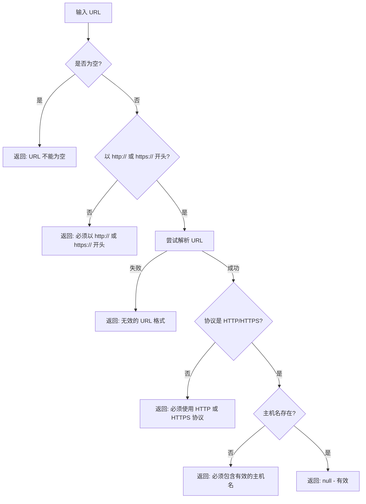

# URL 验证功能

## 概述

`validateUrl` 函数用于验证自定义 API 端点 URL 的格式，确保用户输入的 URL 符合 HTTP/HTTPS 协议标准。

## 功能特性

- ✅ 验证 HTTP/HTTPS 协议
- ✅ 检查 URL 格式完整性
- ✅ 验证主机名存在性
- ✅ 自动去除前后空格
- ✅ 提供友好的错误消息

## 使用方法

### 基本用法

```typescript
import { validateUrl } from './data/validators';

const url = 'https://api.openai.com/v1';
const error = validateUrl(url);

if (error === null) {
  console.log('URL 有效');
} else {
  console.log('URL 无效:', error);
}
```

### 在 Provider 配置中使用

```typescript
interface ProviderConfig {
  type: 'openai' | 'google';
  apiKey: string;
  baseUrl?: string;
  // ... 其他字段
}

function saveProviderConfig(config: ProviderConfig): void {
  // 如果提供了自定义端点，验证其格式
  if (config.baseUrl) {
    const error = validateUrl(config.baseUrl);
    if (error !== null) {
      throw new Error(`自定义端点无效: ${error}`);
    }
  }
  
  // 保存配置...
}
```

### 在 UI 中使用

```typescript
// 在输入框的 onChange 事件中实时验证
function handleUrlChange(url: string): void {
  const error = validateUrl(url);
  
  if (error !== null) {
    // 显示错误消息
    showError(error);
  } else {
    // 清除错误消息
    clearError();
  }
}
```

## 验证规则

### 有效的 URL

以下 URL 格式被认为是有效的：

- `https://api.openai.com/v1`
- `https://generativelanguage.googleapis.com/v1beta`
- `https://openrouter.ai/api/v1`
- `http://localhost:11434`
- `https://example.com:8080/path`
- `https://api.example.com?key=value`

### 无效的 URL

以下 URL 格式会被拒绝：

| URL | 错误原因 | 错误消息 |
|-----|---------|---------|
| `""` | 空字符串 | "URL 不能为空" |
| `"   "` | 仅包含空格 | "URL 不能为空" |
| `"example.com"` | 缺少协议 | "URL 必须以 http:// 或 https:// 开头" |
| `"ftp://example.com"` | 错误的协议 | "URL 必须以 http:// 或 https:// 开头" |
| `"https://"` | 缺少主机名 | "无效的 URL 格式" |
| `"https://exam ple.com"` | 包含空格 | "无效的 URL 格式" |

## 错误消息

`validateUrl` 函数返回以下类型的错误消息：

1. **"URL 不能为空"** - 当输入为空字符串或仅包含空格时
2. **"URL 必须以 http:// 或 https:// 开头"** - 当 URL 不以正确的协议开头时
3. **"URL 必须使用 HTTP 或 HTTPS 协议"** - 当 URL 使用其他协议时
4. **"URL 必须包含有效的主机名"** - 当 URL 缺少主机名时
5. **"无效的 URL 格式"** - 当 URL 格式不符合标准时

## 实现细节

### 验证流程



### 代码实现

```typescript
export function validateUrl(url: string): string | null {
  // 检查是否为空
  if (!url || typeof url !== "string") {
    return "URL 不能为空";
  }

  // 去除首尾空格
  const trimmedUrl = url.trim();

  if (trimmedUrl.length === 0) {
    return "URL 不能为空";
  }

  // 必须以 http:// 或 https:// 开头
  if (!/^https?:\/\/.+/.test(trimmedUrl)) {
    return "URL 必须以 http:// 或 https:// 开头";
  }

  // 尝试解析 URL
  try {
    const parsedUrl = new URL(trimmedUrl);
    
    // 验证协议
    if (parsedUrl.protocol !== "http:" && parsedUrl.protocol !== "https:") {
      return "URL 必须使用 HTTP 或 HTTPS 协议";
    }

    // 验证主机名
    if (!parsedUrl.hostname || parsedUrl.hostname.length === 0) {
      return "URL 必须包含有效的主机名";
    }

    return null; // 有效
  } catch (error) {
    return "无效的 URL 格式";
  }
}
```

## 测试覆盖

### 单元测试

- ✅ 接受标准的 HTTPS URL
- ✅ 接受标准的 HTTP URL
- ✅ 接受带端口的 URL
- ✅ 接受带路径的 URL
- ✅ 接受带查询参数的 URL
- ✅ 正确处理前后空格
- ✅ 拒绝空字符串
- ✅ 拒绝仅包含空格的字符串
- ✅ 拒绝不以 http:// 或 https:// 开头的字符串
- ✅ 拒绝缺少主机名的 URL
- ✅ 拒绝使用非 HTTP/HTTPS 协议的 URL
- ✅ 拒绝格式错误的 URL

### 属性测试

使用 fast-check 进行基于属性的测试，每个测试运行 100 次迭代：

- ✅ 对于任意有效的 HTTP/HTTPS URL，验证函数必须返回 null
- ✅ 对于任意不以 http:// 或 https:// 开头的字符串，验证函数必须返回错误消息
- ✅ 对于任意空字符串或仅包含空格的字符串，验证函数必须返回错误消息
- ✅ 对于任意包含无效字符的 URL，验证函数必须返回错误消息
- ✅ 对于任意缺少主机名的 URL，验证函数必须返回错误消息
- ✅ 对于任意使用非 HTTP/HTTPS 协议的 URL，验证函数必须返回错误消息
- ✅ 对于任意有效 URL 前后添加空格，验证函数必须正确处理

## 常见用例

### 1. OpenAI 自定义端点

```typescript
const openaiUrl = 'https://api.openai.com/v1';
const error = validateUrl(openaiUrl);
// error === null (有效)
```

### 2. Google Gemini 自定义端点

```typescript
const geminiUrl = 'https://generativelanguage.googleapis.com/v1beta';
const error = validateUrl(geminiUrl);
// error === null (有效)
```

### 3. OpenRouter 端点

```typescript
const openrouterUrl = 'https://openrouter.ai/api/v1';
const error = validateUrl(openrouterUrl);
// error === null (有效)
```

### 4. 本地模型端点

```typescript
const localUrl = 'http://localhost:11434';
const error = validateUrl(localUrl);
// error === null (有效)
```

### 5. 无效端点

```typescript
const invalidUrl = 'example.com';
const error = validateUrl(invalidUrl);
// error === "URL 必须以 http:// 或 https:// 开头"
```

## 相关需求

- **需求 1.4**: WHEN 用户修改自定义端点 THEN 系统应验证 URL 格式的有效性
- **需求 3.3**: WHEN 用户输入自定义端点 THEN 系统应验证 URL 格式

## 相关属性

- **属性 2: URL 格式验证** - 对于任意输入的端点 URL 字符串，验证函数必须正确识别有效的 HTTP/HTTPS URL 格式，拒绝无效格式。

## 参考

- [URL Standard](https://url.spec.whatwg.org/)
- [MDN: URL API](https://developer.mozilla.org/en-US/docs/Web/API/URL)
