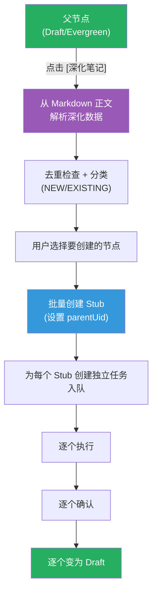

# Cognitive Razor - 用户使用设计文档

## 1. 概述

### 1.1 插件核心定位

Cognitive Razor 是一个基于 Obsidian 的"认知编译器"，帮助用户将自由形式的自然语言概念转化为结构化、去重、带双链的 Markdown 知识图谱。

### 1.2 用户价值主张

| 用户痛点 | CR 解决方案 |
|:--|:--|
| 概念记录零散，难以形成体系 | 6种知识类型强制结构化 |
| 同一概念重复记录多次 | 向量语义去重 + 阻断式提醒 |
| AI 生成内容不可控 | 人类拥有唯一写入裁决权 |
| 学习新工具认知负荷高 | 渐进披露，简化模式优先 |

### 1.3 核心交互界面

- **侧边栏**: 唯一持久交互界面，包含搜索/创建、当前笔记操作、队列管理、统计信息
- **状态栏**: 全局状态显示，提供快捷入口
- **命令**: 快捷键触发侧边栏操作

### 1.4 知识类型体系

> **详细定义见 PRD 3.1-3.2 节**

系统定义了 6 种知识类型，形成 **Domain → Issue → Theory → Entity/Mechanism → Principle** 的链条。各类型的详细定义、字段规范和操作规则请参阅 PRD 文档。

### 1.5 笔记生命周期

> **详细状态机见 PRD 附录 C**

每个 CR 笔记经历 **Stub → Draft → Evergreen** 的生命周期，具体状态定义和转换规则请参阅 PRD 附录 C。

## 2. 首次安装与配置

### 2.1 场景描述

用户刚从 Obsidian 社区插件市场安装了 Cognitive Razor 插件，首次启用并进行初始配置。

### 2.2 前置条件

- Obsidian 已安装并正常运行
- 用户拥有一个 Vault（知识库）
- 用户已获取以下任一 API Key（提供商即调用格式，系统支持三种 API 调用格式）：
  - **Google Gemini**（推荐）：使用 Google Generative AI API 调用格式
  - **OpenAI**：使用 OpenAI API 调用格式（兼容所有 OpenAI 格式的第三方服务）
  - **OpenRouter**：使用 OpenRouter API 调用格式（聚合多模型的统一接口）

### 2.3 详细操作流程

#### 步骤 1：启用插件

| 用户操作 | 系统响应 | 界面变化 |
|:--|:--|:--|
| 打开 Obsidian 设置 → 第三方插件 | 显示已安装的插件列表 | - |
| 找到 "Cognitive Razor" 并点击启用开关 | 插件初始化完成 | 侧边栏自动弹出，显示欢迎界面 |

**系统内部动作**:
1. 创建插件数据目录 `.obsidian/plugins/obsidian-cognitive-razor/`
2. 初始化配置文件 `data.json`（使用默认配置）
3. 创建空向量索引文件 `vector-index.json`
4. 创建空队列状态文件 `queue-state.json`

#### 步骤 2：欢迎界面引导

侧边栏显示欢迎界面，包含以下元素：

**欢迎界面元素**：
- 标题: "Cognitive Razor"
- 欢迎语: "您的第二大脑认知编译器"
- API 调用格式下拉选择: Google Gemini(推荐) / OpenAI / OpenRouter
- API Key 输入框
- 自定义端点输入框（可选，用于第三方代理）
- [验证并开始] 和 [使用演示数据体验] 按钮

**各提供商默认端点**:
- **Google Gemini**: `https://generativelanguage.googleapis.com`
- **OpenAI**: `https://api.openai.com`
- **OpenRouter**: `https://openrouter.ai/api`

#### 步骤 3：选择调用格式并输入 API Key

| 用户操作 | 系统响应 | 界面变化 |
|:--|:--|:--|
| 从下拉菜单选择调用格式 | 更新端点提示信息 | 显示所选格式的默认端点 |
| 在 API Key 输入框中粘贴密钥 | 输入框显示密钥（掩码显示后半部分）| 显示 `sk-...xxxx` 或 `AIza...xxxx` |
| (可选) 填写自定义端点 | 记录用户指定的端点地址 | 端点输入框显示地址 |
| 点击"验证并开始" | 系统发起测试 API 请求 | 按钮变为 "验证中..." 并显示加载动画 |

**验证成功场景**:
| 系统响应 | 界面变化 |
|:--|:--|
| API 连接测试成功 | 显示 ✅ "API 连接成功" |
| 保存 API Key 到配置 | 欢迎界面消失 |
| 加载主界面 | 显示搜索/创建区，搜索框自动聚焦 |

**验证失败场景**:
| 失败原因 | 界面变化 | 用户可采取的操作 |
|:--|:--|:--|
| API Key 无效 (401) | 显示 ❌ "API Key 无效，请检查后重试" | 重新输入正确的 Key |
| 网络超时 | 显示 ⚠️ "网络连接超时，请检查网络" | 检查网络后重试 |
| 请求频率超限 (429) | 显示 ⚠️ "请求过于频繁，请稍后重试" | 等待 1 分钟后重试 |

#### 步骤 4：演示模式（可选）

如果用户暂时没有 API Key，可以选择演示模式：

| 用户操作 | 系统响应 | 界面变化 |
|:--|:--|:--|
| 点击"使用演示数据体验" | 加载预置的示例知识节点 | 进入主界面，但 AI 功能被禁用 |
| 尝试创建新笔记 | - | 显示提示 "AI 功能不可用，请配置 API Key" |
| 浏览示例笔记 | 可正常打开和查看 | - |

### 2.4 首次配置后的界面状态

配置完成后，侧边栏显示主界面，包含以下区域：
- **标题栏**: "Cognitive Razor" + 设置图标
- **搜索/创建区**: 搜索输入框 + [创建新笔记] 按钮
- **当前笔记区**: 显示"未打开笔记"
- **队列区**: 显示"无待执行任务"
- **统计区**: 索引节点数、上次更新时间

**状态栏显示**: `CR: — │ 📊 0 │ ⏳ 0`

### 2.5 目录结构自动创建

首次创建笔记时（而非插件启用时），系统会自动创建默认目录结构：

```
Vault Root/
├── 1-领域/
├── 2-议题/
├── 3-理论/
├── 4-实体/
├── 5-机制/
└── 6-原则/
```

**设计说明**: 目录仅在实际需要时创建，避免污染用户的空 Vault。

## 3. 日常知识注入

### 3.1 场景描述

用户在阅读、学习或思考过程中遇到一个新概念，希望将其记录到知识库中。这是 CR 最核心的日常使用场景。

### 3.2 前置条件

- 插件已配置完成
- API Key 有效且网络正常
- 侧边栏可见（或可通过快捷键打开）

### 3.3 完整操作流程

#### 场景 A：创建全新概念（无重复）

**用户意图**: 用户想要记录"纳什均衡"这个概念

##### 步骤 1：打开侧边栏并输入概念

| 用户操作 | 系统响应 | 界面变化 |
|:--|:--|:--|
| 按 `Ctrl+Shift+K` | 打开侧边栏 | 侧边栏显示，搜索框自动聚焦 |
| 输入 "纳什均衡" | 等待用户进一步操作 | 输入框显示文本 |
| 点击 [创建新笔记] 按钮 | 启动创建流程 | 显示进度指示器 |

##### 步骤 2：标准化 + 类型推断

系统调用 LLM（`standardizeClassify` 任务）处理用户输入：

```
进度显示：🔄 标准化中...
```

**LLM 返回结果**（统一格式：每种类型都包含自然语言描述和示例）:

> **输出格式说明**: 详见 SPEC 5.3 节 `standardizeClassify` 任务定义。

```json
{
  "standard_name": "纳什均衡 (Nash Equilibrium)",
  "chinese_term": "纳什均衡",
  "english_term": "Nash Equilibrium",
  "primary_type": "Entity",
  "reasoning": "纳什均衡是一个静态概念，描述博弈中参与者的策略组合状态，可在不引用时间/过程的前提下定义",
  "type_confidences": [
    { "type": "Entity", "confidence": 0.92, "natural_label": "一个静态概念/事物", "natural_description": "可以用'是什么'来定义，不涉及时间或变化过程", "examples": ["策略组合", "帕累托最优点", "占优策略"] },
    { "type": "Theory", "confidence": 0.05, "natural_label": "一套解释性理论", "natural_description": "对议题的系统性解答", "examples": ["演化博弈论", "机制设计理论"] },
    { "type": "Mechanism", "confidence": 0.02, "natural_label": "一个动态过程", "natural_description": "描述因果链或变化过程", "examples": ["策略迭代过程", "学习动态"] },
    { "type": "Issue", "confidence": 0.01, "natural_label": "一个核心议题", "natural_description": "领域中待解决的问题", "examples": ["均衡选择问题", "理性假设问题"] },
    { "type": "Domain", "confidence": 0.00, "natural_label": "一个研究领域", "natural_description": "知识的边界划分", "examples": ["博弈论", "微观经济学"] }
  ]
}
```

##### 步骤 3：生成别名/标签

系统调用 LLM（`enrich` 任务）生成更多元数据：

```
进度显示：🔄 生成别名...
```

**LLM 返回结果**:
```json
{
  "aliases": ["纳什平衡", "纳什均衡点", "NE", "Nash Equilibrium", "均衡点"],
  "tags": ["economics/game-theory", "cr-type/entity", "mathematics"]
}
```

##### 步骤 4：向量嵌入 + 同类型去重检索

系统执行以下操作：

1. **计算概念签名**: `"纳什均衡 (Nash Equilibrium) 纳什平衡 纳什均衡点 NE Nash Equilibrium 均衡点"`
2. **调用 Embedding API**: 将概念签名转换为向量
3. **同类型检索**: 在 Entity 类型的节点中进行向量相似度检索（Top-10）

```
进度显示：🔄 检查重复...
```

**检索结果**: 无高相似度匹配（similarity < 0.9）

##### 步骤 5：显示确认界面

由于没有发现重复，系统直接显示确认界面。

**确认界面显示位置说明**：确认界面在侧边栏的 **[搜索/创建区] 下方**、**[当前笔记区] 上方** 的区域中**动态展开显示**，而非在全新窗口中显示，也不是整个侧边栏只显示确认界面。侧边栏的其他区域（如队列区、统计区）保持可见。

```
┌─────────────────────────────────────────┐
│  🧠 Cognitive Razor              [⚙️]   │
├─────────────────────────────────────────┤
│  [搜索/创建区]                          │
│  ┌─────────────────────────────────────┐│
│  │ 🔍 纳什均衡                         ││
│  └─────────────────────────────────────┘│
├─────────────────────────────────────────┤
│  ✨ 确认创建新笔记        ← 动态展开区域 │
│  ─────────────────────────────────────  │
│  规范名称                               │
│  ┌─────────────────────────────────────┐│
│  │ 纳什均衡 (Nash Equilibrium)         ││
│  └─────────────────────────────────────┘│
│                                         │
│  知识类型                               │
│  [Entity ▼] (92%) [查看全部类型置信度]  │
│                                         │
│  别名                                   │
│  ┌─────────────────────────────────────┐│
│  │ 纳什平衡, 纳什均衡点, NE, ...       ││
│  └─────────────────────────────────────┘│
│                                         │
│  标签                                   │
│  economics/game-theory, cr-type/entity  │
│                                         │
│      [确认创建]     [取消]              │
├─────────────────────────────────────────┤
│  [当前笔记区]                           │
│  未打开笔记                             │
├─────────────────────────────────────────┤
│  [队列区]                               │
│  无待执行任务                           │
├─────────────────────────────────────────┤
│  [统计区] ▼                             │
└─────────────────────────────────────────┘
```

> **类型置信度说明**: 系统始终返回所有 5 种类型的置信度分布，每种类型都包含 `natural_label`、`natural_description` 和 `examples` 字段。点击 [查看全部类型置信度] 可展开查看完整列表，帮助理解系统的类型判断依据。

**用户可进行的操作**:
- 编辑规范名称
- 修改知识类型（下拉选择 Domain/Issue/Theory/Entity/Mechanism）
- 编辑别名列表
- 编辑标签

##### 步骤 6：用户确认创建

| 用户操作 | 系统响应 | 界面变化 |
|:--|:--|:--|
| 点击 [确认创建] | 创建 Stub 笔记 | 侧边栏恢复主界面 |
| - | 自动打开新笔记 | 编辑器显示笔记内容 |
| - | 将内容生成任务加入队列 | 队列区显示 "⏳ 1" |

**创建的 Stub 笔记内容**:

```yaml
---
uid: "550e8400-e29b-41d4-a716-446655440000"
type: Entity
aliases:
  - 纳什平衡
  - 纳什均衡点
  - NE
  - Nash Equilibrium
  - 均衡点
tags:
  - economics/game-theory
  - cr-type/entity
  - mathematics
status: Stub
created: "2025-11-30 10:30:00"
updated: "2025-11-30 10:30:00"
---
```

**文件保存位置**: `Vault/4-实体/纳什均衡 (Nash Equilibrium).md`

#### 场景 B：发现语义重复

**用户意图**: 用户想要记录"苹果"，但库中已有"Apple (Fruit)"

##### 步骤 1-3：同场景 A

用户输入"苹果"，系统完成标准化：
- 标准名称：`苹果 (Apple)`
- 类型：`Entity`

##### 步骤 4：向量检索发现重复

系统在 Entity 类型中检索，发现高相似度匹配：

```json
{
  "matches": [
    {
      "uid": "existing-001",
      "title": "Apple (Fruit)",
      "type": "Entity",
      "similarity": 0.95
    }
  ]
}
```

##### 步骤 5：显示重复警告界面

```
┌─────────────────────────────────────────┐
│  ⚠️ 发现相似概念                        │
├─────────────────────────────────────────┤
│  您输入的 "苹果 (Apple)" 与以下概念高度  │
│  相似，可能是重复创建：                  │
│                                         │
│  ┌─────────────────────────────────────┐│
│  │ 📄 Apple (Fruit)                    ││
│  │    类型: Entity | 相似度: 95%       ││
│  │    [打开查看]                       ││
│  └─────────────────────────────────────┘│
│                                         │
│  ────────────────────────────────────── │
│  [仍要创建新笔记]                       │
└─────────────────────────────────────────┘
```

##### 用户选择路径

**路径 A：打开已有笔记**
| 用户操作 | 系统响应 | 界面变化 |
|:--|:--|:--|
| 点击 [打开查看] | 打开 "Apple (Fruit)" 笔记 | 编辑器显示已有笔记 |
| - | 侧边栏恢复搜索状态 | 搜索框清空 |

**路径 B：坚持创建（用户确认这是不同的"苹果"）**
| 用户操作 | 系统响应 | 界面变化 |
|:--|:--|:--|
| 点击 [仍要创建新笔记] | 显示确认界面 | 进入确认界面 |
| 修改名称为"苹果公司 (Apple Inc.)" | 系统重新进行类型推断 | 类型变为 Entity |
| - | 系统重新执行同类型检索 | 无新重复发现 |
| 点击 [确认创建] | 创建新 Stub | 正常创建流程 |

---

#### 场景 C：类型推断存在歧义

**用户意图**: 用户输入"细胞"，系统推断为 Entity 但存在其他可能性

##### 步骤 1-2：标准化 + 类型推断

LLM 返回结果（统一格式：每种类型都包含自然语言描述和示例）：

> **输出格式说明**: 详见 SPEC 5.3 节 `standardizeClassify` 任务定义。

```json
{
  "standard_name": "细胞 (Cell)",
  "primary_type": "Entity",
  "reasoning": "细胞作为生物学概念，可用静态定义描述，但也可能指代细胞生物学领域",
  "type_confidences": [
    { "type": "Entity", "confidence": 0.65, "natural_label": "一个静态概念/事物", "natural_description": "可以用'是什么'来定义，不涉及时间或变化过程", "examples": ["细胞膜", "原子", "蛋白质"] },
    { "type": "Domain", "confidence": 0.25, "natural_label": "一个研究领域", "natural_description": "一个学科或知识领域，包含多个子问题和理论", "examples": ["细胞生物学", "分子生物学", "遗传学"] },
    { "type": "Mechanism", "confidence": 0.05, "natural_label": "一个动态过程", "natural_description": "描述因果链或变化过程", "examples": ["细胞分裂", "信号传导"] },
    { "type": "Theory", "confidence": 0.03, "natural_label": "一套解释性理论", "natural_description": "对议题的系统性解答", "examples": ["细胞学说", "内共生理论"] },
    { "type": "Issue", "confidence": 0.02, "natural_label": "一个核心议题", "natural_description": "领域中待解决的问题", "examples": ["细胞衰老机制", "癌细胞起源"] }
  ]
}
```

##### 步骤 3：显示界面

> **UI 策略**: 系统始终返回完整的类型置信度分布（每种类型都包含 `natural_label`、`natural_description`、`examples`）。

**界面元素**:
- 标题: "🤔 请帮助我理解您的意图"
- 单选列表: 每项包含类型名称、置信度、自然语言描述、示例
- [确认选择] 按钮

| 用户操作 | 系统响应 | 界面变化 |
|:--|:--|:--|
| 选择 "一个静态概念/事物" | 更新类型为 Entity | 单选按钮选中状态变化 |
| 点击 [确认选择] | 继续创建流程 | 进入确认界面 |

---

#### 场景 D：用户修改类型后触发动态查重

**用户意图**: 用户输入"博弈论"，系统推断为 Domain，但用户想记录为 Theory

##### 步骤 1-4：正常流程

系统推断类型为 Domain，置信度 0.88，无重复发现。

##### 步骤 5：用户在确认界面修改类型

| 用户操作 | 系统响应 | 界面变化 |
|:--|:--|:--|
| 点击类型下拉框 | 显示可选类型列表 | Domain/Issue/Theory/Entity/Mechanism |
| 选择 "Theory" | 系统后台重新执行同类型检索 | 类型切换为 Theory |
| - | 发现已有 "博弈论 (Game Theory)" Theory 笔记 (相似度 0.92) | 显示黄色警告条 |

**警告条元素**:
- 标题: "⚠️ 发现同类型相似概念: 博弈论 (Game Theory) [Theory]"
- 复选框: "忽略重复强制创建"
- [确认创建] 按钮（默认禁用，勾选复选框后启用）

| 用户操作 | 系统响应 | 界面变化 |
|:--|:--|:--|
| 勾选 "忽略重复强制创建" | 解除创建按钮禁用 | [确认创建] 按钮变为可点击 |
| 点击 [确认创建] | 创建 Stub（带 Override 标记）| 正常创建流程 |

---

## 4. 内容生成与确认

### 4.1 场景描述

用户创建 Stub 笔记后，系统自动将内容生成任务加入队列，由对应类型的 Agent 生成结构化内容，经过可选的事实核查后，用户预览并确认写入。

### 4.2 前置条件

- Stub 笔记已创建
- 内容生成任务已加入队列
- API 连接正常

### 4.3 完整操作流程

#### 阶段 1：任务入队与执行

Stub 创建后，系统自动执行以下操作：

| 系统动作 | 界面变化 | 用户感知 |
|:--|:--|:--|
| 将任务加入队列 | 队列区显示任务条目 | 状态栏 `⏳ 1` |
| 根据并发设置开始执行 | 任务状态变为 "Running" | 任务条目显示进度动画 |
| 调用对应 Agent (如 Agent D) | - | - |

**队列区显示**:
- "▶ 进行中" 分组: 显示任务名称、类型、状态、[取消] 按钮

#### 阶段 2：Agent 内容生成

Agent 根据笔记类型生成结构化内容。以 Entity 类型（Agent D）为例：

**Agent 接收的上下文**:
- 笔记元数据（名称、类型、别名）
- 同类型 vault_index（Top-10 相似 Entity 节点的标题和摘要）
- 父节点上下文（若有）

**Agent 生成的 JSON 结构**:
```json
{
  "_thought_trace": "1. 纳什均衡是博弈论的核心概念...（思考过程）",
  "metadata": {
    "name": "纳什均衡 (Nash Equilibrium)",
    "type": "Entity"
  },
  "content": {
    "definition": "纳什均衡是指在非合作博弈中，每个参与者的策略都是对其他参与者策略的最优反应的策略组合状态。",
    "classification": "博弈论的均衡概念，属于解概念的一种，与帕累托最优、子博弈完美均衡等概念同级",
    "properties": [
      {
        "name": "稳定性",
        "description": "在均衡点上，没有任何参与者有动机单方面改变策略",
        "possible_values": "稳定/不稳定",
        "measurement": "通过检验是否存在可获利的单边偏离"
      }
    ],
    "distinguishing_features": "与帕累托最优的区别：纳什均衡强调个体最优，帕累托最优强调集体最优；两者可能不一致",
    "examples": ["囚徒困境中的(坦白,坦白)", "性别战博弈中的两个纯策略均衡"],
    "counter_examples": ["帕累托最优点（不一定是纳什均衡）", "占优策略均衡（是纳什均衡的特例）"],
    "holistic_understanding": "纳什均衡是博弈论最核心的概念之一，由约翰·纳什于1950年提出..."
  },
  "relations": {
    "is_a": ["[[均衡概念 (Equilibrium Concept)]]"],
    "has_parts": [],
    "related_to": ["[[博弈论 (Game Theory)]]", "[[帕累托最优 (Pareto Optimality)]]"]
  }
}
```

#### 阶段 3：事实核查（可选）

如果用户启用了 Grounding 功能（默认启用），系统会进行事实核查：

| 系统动作 | 界面变化 | 说明 |
|:--|:--|:--|
| 调用 Grounding API | 任务显示 "事实核查中..." | 排除 holistic_understanding 字段 |
| 交叉验证事实性陈述 | - | 使用 Google Search 验证 |
| 返回核查结果 | 任务状态更新 | 标记可能有误的字段 |

**Grounding 返回结果示例**:
```json
{
  "status": "WARN",
  "fact_checks": [
    {
      "claim": "纳什于1950年提出纳什均衡",
      "location": "$.content.holistic_understanding",
      "verdict": "VERIFIED",
      "sources": [{"uri": "https://...", "title": "Nobel Prize Biography"}]
    },
    {
      "claim": "性别战博弈中存在两个纯策略均衡",
      "location": "$.content.examples[1]",
      "verdict": "DISPUTED",
      "discrepancy": "性别战博弈实际有两个纯策略均衡和一个混合策略均衡"
    }
  ]
}
```

#### 阶段 4：显示预览界面

任务完成后，侧边栏队列区显示：
- "✅ 任务完成" 标题
- 笔记名称和类型
- Grounding 警告摘要（若有）
- [打开预览] [确认写入] [放弃] 按钮

#### 阶段 5：用户预览内容

任务完成后，用户点击 [打开预览] 按钮，系统在**主编辑器**中打开完整的笔记预览（而非在侧边栏中展示）。预览时，笔记内容与正常打开笔记完全一致，但编辑器顶部会显示一个**悬浮操作栏**，包含 Grounding 警告和确认/放弃按钮。

| 用户操作 | 系统响应 | 界面变化 |
|:--|:--|:--|
| 点击 [打开预览] | 在主编辑器中打开笔记预览 | 编辑器显示完整笔记内容 + 顶部悬浮操作栏 |

**预览界面说明**：

预览模式下，用户在主编辑器中看到完整的笔记内容。编辑器顶部显示**悬浮操作栏**，包含：
- **状态标识**: "⚠️ 待确认" 表示内容尚未写入
- **Grounding 警告摘要**: 若有事实核查警告，显示数量并提供 [查看详情] 链接
- **操作按钮**: [确认写入] 和 [放弃]

**Grounding 警告详情弹窗**（点击 [查看详情] 后显示）：
- 警告标题
- 每个警告的具体内容、来源链接、建议修改
- [关闭] 按钮

#### 阶段 6：用户处理警告（可选）

| 用户操作 | 系统响应 | 界面变化 |
|:--|:--|:--|
| 点击 [查看详情] | 弹出 Grounding 警告详情 | 显示来源链接和冲突描述 |
| 在编辑器中直接编辑内容 | 更新预览内容 | 编辑器实时反映修改 |
| (可选) 忽略警告直接确认 | - | 警告不阻止确认写入 |

**用户手动修正**:
用户可直接在主编辑器中编辑内容，例如将 "性别战博弈中的两个纯策略均衡" 修改为 "性别战博弈中的两个纯策略均衡（及一个混合策略均衡）"

#### 阶段 7：确认写入

| 用户操作 | 系统响应 | 界面变化 |
|:--|:--|:--|
| 点击悬浮栏中的 [确认写入] | 将内容写入笔记文件 | 悬浮操作栏消失 |
| - | 更新 frontmatter status 为 Draft | - |
| - | 更新向量索引 | 索引节点数 +1 |
| - | 记录到操作历史 | 侧边栏历史记录区新增条目 |
| - | 笔记保持在编辑器中打开 | 正常编辑模式 |

**写入后的笔记内容**:
```yaml
---
uid: "550e8400-e29b-41d4-a716-446655440000"
type: Entity
aliases: [纳什平衡, 纳什均衡点, NE, Nash Equilibrium, 均衡点]
tags: [economics/game-theory, cr-type/entity, mathematics]
status: Draft
created: "2025-11-30 10:30:00"
updated: "2025-11-30 10:35:00"
---

## 定义

纳什均衡是指在非合作博弈中，每个参与者的策略都是对其他参与者策略的最优反应的策略组合状态。

## 分类

博弈论的均衡概念，属于解概念的一种，与[[帕累托最优 (Pareto Optimality)]]、子博弈完美均衡等概念同级。

## 属性

| 属性名 | 描述 | 可能取值 | 测量方式 |
|:--|:--|:--|:--|
| 稳定性 | 在均衡点上，没有任何参与者有动机单方面改变策略 | 稳定/不稳定 | 通过检验是否存在可获利的单边偏离 |

## 区分特征

与[[帕累托最优 (Pareto Optimality)]]的区别：纳什均衡强调个体最优，帕累托最优强调集体最优；两者可能不一致。

## 正例

- 囚徒困境中的(坦白,坦白)
- 性别战博弈中的两个纯策略均衡（及一个混合策略均衡）

## 反例

- 帕累托最优点（不一定是纳什均衡）
- 占优策略均衡（是纳什均衡的特例）

## 整体理解

纳什均衡是博弈论最核心的概念之一，由约翰·纳什于1950年提出...

## 关系

- **上位类**: [[均衡概念 (Equilibrium Concept)]]
- **相关概念**: [[博弈论 (Game Theory)]], [[帕累托最优 (Pareto Optimality)]]
```

#### 阶段 8：放弃操作

如果用户对生成内容不满意，可以选择放弃：

| 用户操作 | 系统响应 | 界面变化 |
|:--|:--|:--|
| 点击 [放弃] | 丢弃生成结果 | 预览界面消失 |
| - | 任务标记为 Discarded | 历史记录显示 "已放弃" |
| - | 笔记保持 Stub 状态 | 笔记内容不变 |
| - | 用户可稍后重新触发 | 当前笔记区显示 [生成内容] 按钮 |

### 4.4 侧边栏当前笔记区状态

任务完成并确认写入后，当前笔记区更新：

```
┌─────────────────────────────────────────┐
│  [当前笔记区]                           │
├─────────────────────────────────────────┤
│  📄 纳什均衡 (Nash Equilibrium)         │
│  🏷️ Entity | 📝 Draft                  │
│                                         │
│  [标记为 Evergreen]                     │
│  [增量改进]                             │
│  (Entity 为终端节点，无深化按钮)         │
└─────────────────────────────────────────┘
```

---

## 5. 深化操作

### 5.1 场景描述

用户对已有的知识节点进行"深化"，即沿着知识类型链条展开下一层级的子节点。这是构建知识图谱的核心操作。

### 5.2 深化规则

| 父节点类型 | 深化产出 | 操作按钮 |
|:--|:--|:--|
| Domain | Issue 列表 | [深化笔记] |
| Issue | Theory 列表 | [深化笔记] |
| Theory | Entity + Mechanism 列表 | [深化笔记] |
| Entity | - | (无深化按钮，终端节点) |
| Mechanism | Principle | [合成原理] (见第6节) |
| Principle | - | (无深化按钮，终端节点) |

### 5.3 前置条件

- 笔记状态为 Draft 或 Evergreen
- 笔记类型为可深化类型（Domain/Issue/Theory）
- API 连接正常

### 5.4 完整操作流程：Domain → Issue

#### 场景：从"博弈论 (Game Theory)"领域深化出议题列表

##### 步骤 1：触发深化

| 用户操作 | 系统响应 | 界面变化 |
|:--|:--|:--|
| 打开 "博弈论 (Game Theory)" 笔记 | 侧边栏显示当前笔记信息 | 类型: Domain, 状态: Draft |
| 点击 [深化笔记] 按钮 | 启动深化流程 | 显示进度指示器 |

##### 步骤 2：系统读取笔记正文内容

> **数据源说明**: 系统从 Markdown 笔记正文中使用正则表达式（如 `/\[\[([^\]]+)\]\]/g`）解析 wikilink 及其上下文信息（列表项中的 `core_tension`、`definition` 等描述文本）。不依赖额外的结构化数据块。
>
> **wikilink 生成时机**: 在 Agent 内容生成阶段就以 `[[xxx]]` 格式生成 wikilink，**而非**在创建子笔记后再回去更新父笔记。这确保了 wikilink 在子笔记创建前就已存在（Obsidian 会将其显示为未创建链接，创建后自动变为有效链接）。

##### 步骤 3：系统执行去重检查

对每个候选议题，系统执行同类型（Issue）去重检索：

```
检查 "理性假设问题 (Rationality Assumption)"...
  → 无高相似度匹配 → 标记为 NEW

检查 "均衡选择问题 (Equilibrium Selection)"...
  → 发现匹配: "均衡选择 (Equilibrium Selection)" (相似度: 0.94)
  → 标记为 EXISTING

检查 "合作困境 (Cooperation Dilemma)"...
  → 无高相似度匹配 → 标记为 NEW
```

##### 步骤 4：显示深化预览界面

**深化预览界面元素**:
- 标题: "📂 深化: [父节点名称]" + "类型转换: Domain → Issue"
- 每个候选节点显示: 复选框 + 状态图标(🆕/🔗) + 名称 + 摘要信息
- 对于 EXISTING 节点: 显示 "⚠️ 已存在同名笔记" + [打开已有] [仍要创建] 按钮
- 底部统计: "已选择: X 个新建, Y 个关联"
- 操作按钮: [确认创建] [取消]

##### 步骤 5：用户调整选择

| 用户操作 | 系统响应 | 界面变化 |
|:--|:--|:--|
| 取消勾选 "合作困境" | 更新选择计数 | "已选择: 1 个新建" |
| 点击 "均衡选择问题" 的 [打开已有] | 打开已有笔记 | 编辑器显示已有笔记 |
| (或) 点击 [仍要创建] | 将其标记为强制创建 | 复选框变为勾选状态 |

##### 步骤 6：确认批量创建

| 用户操作 | 系统响应 | 界面变化 |
|:--|:--|:--|
| 点击 [确认创建 1 个议题] | 批量创建 Stub 笔记 | 深化界面消失 |
| - | 为每个 Stub 创建独立的内容生成任务 | 队列区显示 "⏳ 1" |
| - | 设置子节点的 parentUid 关联 | - |

> **wikilink 更新时机说明**: 父笔记正文中的 `[[xxx]]` wikilink **早在 Agent 生成内容时就已创建**，而非在创建子笔记后才回去更新父笔记。子笔记创建后，Obsidian 会自动将这些原本显示为未创建链接的 wikilink 识别为有效链接。

**创建的 Stub 笔记 (理性假设问题)**:
```yaml
---
uid: "issue-001-uuid"
type: Issue
aliases: [Rationality Assumption, 理性假设]
status: Stub
parentUid: "博弈论-uuid"
parentType: Domain
created: "2025-11-30 11:00:00"
updated: "2025-11-30 11:00:00"
---

```

**文件保存位置**: `Vault/2-议题/理性假设问题 (Rationality Assumption).md`

> **父笔记中的 wikilink**: 由于在 Agent 生成父笔记内容时就已创建了 `[[xxx]]` 格式的 wikilink，因此此时不需要再更新父笔记。原本显示为未创建链接的 `[[xxx]]` 在子笔记创建后会自动变为有效链接。

##### 步骤 7：队列执行与确认

每个深化产生的 Stub 独立执行内容生成任务，队列区显示：
- "▶ 进行中" 分组: 任务名称、类型、进度状态

任务完成后，用户可：
1. 逐个预览并确认写入
2. 逐个放弃
3. 混合操作（确认部分，放弃部分）

---

### 5.5 完整操作流程：Theory → Entity/Mechanism

#### 场景：从"纳什均衡理论"深化出实体和机制

##### 步骤 1-2：触发深化，系统读取笔记正文

> **数据源说明**: 与 Domain → Issue 深化相同，系统直接从 **Markdown 笔记正文**中解析 `extracted_components` 数据。Agent 在生成内容时已将 JSON 结构转换为格式化的 Markdown。

系统从笔记正文中提取的 `extracted_components` 数据：

```json
{
  "extracted_components": [
    {
      "name": "参与者 (Player)",
      "category": "Entity",
      "status": "NEW",
      "definition": "博弈中做出决策的个体或主体"
    },
    {
      "name": "策略 (Strategy)",
      "category": "Entity",
      "status": "EXISTING",
      "existing_uid": "strategy-uuid",
      "match_reason": "与已有节点语义等价"
    },
    {
      "name": "均衡形成过程 (Equilibrium Formation)",
      "category": "Mechanism",
      "status": "NEW",
      "definition": "参与者通过反复调整策略最终达到均衡的动态过程"
    }
  ]
}
```

##### 步骤 3：显示混合类型的深化预览

```
┌─────────────────────────────────────────┐
│  📂 深化: 纳什均衡理论                   │
│  Theory → Entity/Mechanism              │
├─────────────────────────────────────────┤
│  [实体 Entity]                          │
│  ┌─────────────────────────────────────┐│
│  │ ☑ 🆕 参与者 (Player)                ││
│  │    博弈中做出决策的个体或主体        ││
│  └─────────────────────────────────────┘│
│  ┌─────────────────────────────────────┐│
│  │ ☐ 🔗 策略 (Strategy)                ││
│  │    ⚠️ 已存在                        ││
│  │    [打开已有] [关联到此理论]         ││
│  └─────────────────────────────────────┘│
│                                         │
│  [机制 Mechanism]                       │
│  ┌─────────────────────────────────────┐│
│  │ ☑ 🆕 均衡形成过程                   ││
│  │    (Equilibrium Formation)          ││
│  └─────────────────────────────────────┘│
│                                         │
│  已选择: 2 个新建 (1 Entity, 1 Mech)    │
│  [确认创建]     [取消]                  │
└─────────────────────────────────────────┘
```

**"关联到此理论"操作说明**：
- 不创建新笔记
- 由于 Agent 在生成 Theory 内容时已创建了 `[[xxx]]` 格式的 wikilink，此操作仅用于**确认**该已有节点与此理论的关联关系
- 若已有节点的名称与 wikilink 中的名称不完全一致，系统会更新 wikilink 指向正确的文件（利用 Obsidian 的别名机制或修正链接）
- 表明该 Entity/Mechanism 是此 Theory 的组成部分

---

### 5.6 深化操作的状态流转

> **关键说明**: 深化数据源是 Markdown 笔记正文。wikilink 在 Agent 生成内容（Stub→Draft）时写入，深化时从 Markdown 解析所需信息。



**流程要点**:
1. **数据源**: 直接从 Markdown 笔记正文解析 wikilink 及其上下文信息
2. **wikilink 状态**: 父笔记中的 `[[xxx]]` 链接在 Agent 生成内容时写入（显示为未创建链接）
3. **创建子笔记后**: Obsidian 自动将未创建链接识别为有效链接，无需额外更新父笔记

### 5.7 深化失败场景

| 场景 | 系统响应 | 用户可采取的操作 |
|:--|:--|:--|
| 笔记无 issues/theories/components 字段 | 显示 "该笔记暂无可深化的内容" | 先完成内容生成或手动添加 |
| 所有候选都已存在 | 显示所有节点为 EXISTING 状态 | 选择"关联"或"强制创建" |
| API 调用失败 | 显示错误信息 | 重试或检查网络 |

---

## 6. 原理合成

### 6.1 场景描述

用户从多个已有的 Mechanism（机制）节点中抽象出共同的结构不变量，合成一个 Principle（原理）。这是创建 Principle 的**唯一途径**。

### 6.2 前置条件

- 至少存在 2 个 Mechanism 类型的笔记
- 这些 Mechanism 笔记状态为 Draft 或 Evergreen
- 用户需要从中识别出结构同构性

### 6.3 设计原理

> **详见 PRD A2 公理（因果层级性）**：Principle 只能通过 Mechanism 的合成流程创建，不能通过普通的创建/类型推断流程直接产生。

### 6.4 完整操作流程

#### 场景：从"细胞凋亡"和"企业破产清算"合成"资源回收原理"

##### 步骤 1：触发合成

**方式 A：从 Mechanism 笔记触发**
| 用户操作 | 系统响应 | 界面变化 |
|:--|:--|:--|
| 打开 "细胞凋亡 (Apoptosis)" 笔记 | 侧边栏显示当前笔记信息 | 类型: Mechanism, 状态: Draft |
| 点击 [合成原理] 按钮 | 打开机制选择器 | 侧边栏展开选择界面 |

**方式 B：通过命令触发**
| 用户操作 | 系统响应 | 界面变化 |
|:--|:--|:--|
| 按 `Ctrl+Shift+P` 或执行命令 `cr:synthesize` | 打开机制选择器 | 侧边栏展开选择界面 |

##### 步骤 2：选择参与合成的机制

**机制选择器界面元素**:
- 标题: "🔬 合成原理" + 副标题说明
- Mechanism 列表: 显示名称、所属领域、状态、触发条件摘要
- 列表筛选: 仅显示 Mechanism 类型、Draft/Evergreen 状态
- 底部: "已选择: N 个机制" + [开始分析] [取消] 按钮
- 需选择 ≥2 个机制才能启用 [开始分析] 按钮

| 用户操作 | 系统响应 | 界面变化 |
|:--|:--|:--|
| 勾选 "细胞凋亡" 和 "企业破产清算" | 更新选择计数 | "已选择: 2 个机制" |
| 点击 [开始分析] | 启动合成流程 | 显示进度指示器 |

##### 步骤 3：系统检查来源去重

系统检查是否已存在包含完全相同 `sourceUids` 组合的 Principle：

```
检查是否已有同来源组合的 Principle...
  来源组合: [apoptosis-uuid, liquidation-uuid]
  → 未发现重复 → 继续执行
```

**如果发现重复**：

显示警告界面，包含：
- 警告标题: "⚠️ 已存在同来源的原理"
- 说明文本: "这两个机制已被用于合成: [Principle名称]"
- [打开已有原理] [取消] 按钮

##### 步骤 4：Agent F 分析同构性

系统调用 Agent F（原理合成器）分析选中机制的结构同构性：

```
进度显示：🔄 分析同构性...
```

**Agent F 接收的上下文**：
- 选中的 Mechanism 笔记完整内容
- 已有 Principle 节点列表（用于去重）

**Agent F 分析过程**（记录在 `_thought_trace`）：
```
1. 分析细胞凋亡的因果链：
   - 触发条件: 信号 → 评估 → 决策 → 执行 → 资源释放
   - 输入: 活细胞, 凋亡信号
   - 输出: 细胞组分回收, 信号传递

2. 分析企业破产清算的因果链：
   - 触发条件: 财务困境 → 评估 → 决策 → 执行 → 资源分配
   - 输入: 企业资产, 债权人请求
   - 输出: 资产分配, 债务清偿

3. 识别同构结构：
   - 共同模式: [触发条件] → [评估] → [决策] → [有序执行] → [资源回收/再分配]
   - 抽象变量: R=资源, T=触发信号, E=评估者, P=执行程序
   - 形式化: 若 R 满足触发条件 T，则 E 启动 P，有序释放 R 供再利用

4. 验证普适性：✓ 两个机制都符合此模式
```

**Agent F 输出**（成功情况）：
```json
{
  "status": "SUCCESS",
  "_thought_trace": "...",
  "metadata": {
    "name": "有序资源回收原理 (Orderly Resource Recycling Principle)",
    "type": "Principle"
  },
  "content": {
    "formal_statement": "若资源持有者 R 接收到终止信号 T，则评估机制 E 启动有序的拆解程序 P，将 R 的组成部分释放给接收者池 A，使资源得以再利用",
    "mathematical_form": "T(R) → E(R) → P(R) → A ← components(R)",
    "variables": {
      "R": "资源持有者（细胞/企业/进程）",
      "T": "终止信号/触发条件",
      "E": "评估机制",
      "P": "有序拆解程序",
      "A": "资源接收者池"
    },
    "scope_and_constraints": "适用于任何需要有序终止并回收资源的系统",
    "isomorphism_analysis": "细胞凋亡: R=细胞, T=凋亡信号, E=Caspase级联, P=细胞自噬, A=周围细胞\n企业破产: R=企业, T=资不抵债, E=法院/清算人, P=清算程序, A=债权人",
    "predictive_power": "可应用于：软件进程终止、社会组织解散、生态系统物质循环等",
    "holistic_understanding": "..."
  },
  "source_mechanisms": [
    { "uid": "apoptosis-uuid", "name": "[[细胞凋亡 (Apoptosis)]]", "domain": "生物学" },
    { "uid": "liquidation-uuid", "name": "[[企业破产清算 (Corporate Liquidation)]]", "domain": "经济学" }
  ]
}
```

##### 步骤 5：结果去重检查

系统对生成的 Principle 名称进行向量检索：

```
检索 "有序资源回收原理 (Orderly Resource Recycling Principle)"...
  → 无高相似度匹配 → 继续
```

##### 步骤 6：显示合成预览

**合成预览界面元素**:
- 成功标题: "✨ 合成成功" + 原理名称
- 展示区块: [形式化陈述]、[变量定义]、[同构分析]、[来源机制]
- 可编辑区: 名称/别名输入框
- 操作按钮: [确认写入] [放弃]

##### 步骤 7：用户确认写入

| 用户操作 | 系统响应 | 界面变化 |
|:--|:--|:--|
| (可选) 编辑名称/别名 | 更新预览 | - |
| 点击 [确认写入] | **直接创建 Draft 状态笔记** | 预览界面消失 |
| - | 设置 frontmatter 中的 sourceUids | - |
| - | 在来源 Mechanism 笔记中添加反向链接 | - |
| - | 更新向量索引 | - |
| - | 打开新创建的 Principle 笔记 | 编辑器显示笔记 |

**创建的 Principle 笔记**（注意：直接为 Draft，跳过 Stub）：
```yaml
---
uid: "principle-uuid"
type: Principle
aliases: [资源回收原理, Orderly Resource Recycling]
status: Draft
sourceUids:
  - apoptosis-uuid
  - liquidation-uuid
created: "2025-11-30 12:00:00"
updated: "2025-11-30 12:00:00"
---

## 形式化陈述

若资源持有者 $R$ 接收到终止信号 $T$，则评估机制 $E$ 启动有序的拆解程序 $P$，将 $R$ 的组成部分释放给接收者池 $A$，使资源得以再利用。

$$T(R) \rightarrow E(R) \rightarrow P(R) \rightarrow A \leftarrow components(R)$$

## 变量定义

| 变量 | 含义 |
|:--|:--|
| $R$ | 资源持有者（细胞/企业/进程）|
| $T$ | 终止信号/触发条件 |
| $E$ | 评估机制 |
| $P$ | 有序拆解程序 |
| $A$ | 资源接收者池 |

## 同构分析

- **细胞凋亡**: $R$=细胞, $T$=凋亡信号, $E$=Caspase级联, $P$=细胞自噬, $A$=周围细胞
- **企业破产**: $R$=企业, $T$=资不抵债, $E$=法院/清算人, $P$=清算程序, $A$=债权人

## 预测力

可应用于：
- 软件进程终止（操作系统回收内存）
- 社会组织解散（非营利组织清算）
- 生态系统物质循环（落叶分解）

## 来源机制

- [[细胞凋亡 (Apoptosis)]]
- [[企业破产清算 (Corporate Liquidation)]]

## 整体理解

...
```

---

### 6.5 合成失败场景

#### 场景 A：无法找到结构同构

如果 Agent F 分析后认为选中的机制没有共同的结构不变量：

```json
{
  "status": "NO_PRINCIPLE_FOUND",
  "no_principle_reason": "选中的机制虽然都涉及'终止'，但因果链结构差异过大：\n- 细胞凋亡是内部信号驱动的程序性死亡\n- 市场淘汰是外部竞争压力导致的渐进衰退\n两者的触发机制、执行过程和资源处理方式不具有结构同构性"
}
```

**界面显示**：

**合成失败界面元素**:
- 错误标题: "❌ 未能识别共同原理"
- 原因说明: Agent F 返回的 `no_principle_reason` 内容
- 建议列表: 选择更相似的机制、添加桥梁机制等
- 操作按钮: [重新选择] [取消]

#### 场景 B：选择不足 2 个机制

| 用户操作 | 系统响应 | 界面变化 |
|:--|:--|:--|
| 仅勾选 1 个机制 | [开始分析] 按钮保持禁用 | 按钮显示灰色 |
| 点击禁用的按钮 | 显示提示 | "请至少选择 2 个机制" |

---

## 7. 增量改进

### 7.1 场景描述

用户对已有笔记的 AI 生成内容不满意，希望让 AI 基于现有内容进行针对性的改进，而不是完全重新生成。

### 7.2 前置条件

- 笔记状态为 Draft 或 Evergreen
- 笔记已有 AI 生成的内容（不适用于 Stub）
- API 连接正常

### 7.3 适用场景

| 场景 | 用户意图示例 |
|:--|:--|
| 内容不完整 | "补充更多正例和反例" |
| 论证不充分 | "加强论证链的逻辑推导" |
| 表述不清晰 | "用更简洁的语言重写定义" |
| 需要更新 | "补充 2023 年后的新发展" |
| 引用不足 | "添加更多学术引用" |

### 7.4 完整操作流程

#### 场景：改进"纳什均衡"实体笔记的正例部分

##### 步骤 1：触发增量改进

| 用户操作 | 系统响应 | 界面变化 |
|:--|:--|:--|
| 打开 "纳什均衡 (Nash Equilibrium)" 笔记 | 侧边栏显示当前笔记信息 | 状态: Draft |
| 点击 [增量改进] 按钮 | 弹出意图输入框 | 显示输入界面 |

##### 步骤 2：输入改进意图

**增量改进输入界面元素**:
- 标题: "✏️ 增量改进" + 笔记名称
- 意图输入框: 多行文本输入区
- 操作按钮: [开始改进] [取消]

| 用户操作 | 系统响应 | 界面变化 |
|:--|:--|:--|
| 输入改进意图 | - | 输入框显示文本 |
| 点击 [开始改进] | 启动增量改进任务 | 显示进度指示器 |

##### 步骤 3：Agent 执行增量改进

系统调用对应类型的 Agent（Entity → Agent D），但附加增量改进指令：

**Agent 接收的上下文**：
- 当前笔记完整内容（Full Text）
- 用户改进意图
- 同类型 vault_index（用于避免引入重复内容）

**Agent 输出**（完整的改进后 JSON）：
```json
{
  "_thought_trace": "用户要求补充正例，需要添加经济学以外的应用...",
  "content": {
    "definition": "...(保持不变)...",
    "examples": [
      "囚徒困境中的(坦白,坦白)",
      "性别战博弈中的两个纯策略均衡",
      "【新增】鹰鸽博弈中的混合策略均衡（生物学：动物争夺资源的进化稳定策略）",
      "【新增】选民投票中的杜弗杰定律均衡（政治学：两党制的稳定形成）",
      "【新增】交通流量均衡（城市规划：布雷斯悖论中的均衡点）"
    ],
    "...": "..."
  }
}
```

##### 步骤 4：事实核查（可选）

如果启用 Grounding，系统会对新增内容进行核查。

##### 步骤 5：显示 Diff View 预览

**Diff View 预览界面元素**:
- 标题: "📝 增量改进预览" + 笔记名称
- 变更字段标记: 显示哪些字段有变更
- 变更内容对比: 用颜色标记新增(绿色)、删除(红色)、未修改(无色)
- 操作按钮: [接受全部] [逐项审核] [放弃]

**Diff View 颜色规则**：
- 🟢 绿色：新增内容
- 🔴 红色：删除内容
- ⚪ 无色：未修改

##### 步骤 6：用户审核并确认

**选项 A：接受全部**
| 用户操作 | 系统响应 | 界面变化 |
|:--|:--|:--|
| 点击 [接受全部] | 应用所有变更 | 预览界面消失 |
| - | 写入文件 | 笔记内容更新 |
| - | 更新 updated 时间戳 | - |
| - | 记录到历史 | 历史新增条目 |

**选项 B：逐项审核**
| 用户操作 | 系统响应 | 界面变化 |
|:--|:--|:--|
| 点击 [逐项审核] | 展开详细对比 | 每个字段独立显示 |
| 对某个新增项点击 [保留] | 标记为接受 | 显示 ✓ |
| 对某个新增项点击 [忽略] | 标记为忽略 | 显示 ✗ 并灰色 |
| 点击 [应用选中的变更] | 写入选中的变更 | 完成 |

**选项 C：放弃**
| 用户操作 | 系统响应 | 界面变化 |
|:--|:--|:--|
| 点击 [放弃] | 丢弃所有变更 | 预览界面消失 |
| - | 笔记保持原样 | - |

### 7.5 状态变更规则

| 原状态 | 增量改进后 | 说明 |
|:--|:--|:--|
| Draft | Draft | 保持 Draft |
| Evergreen | **Draft** | 降级为 Draft，因为内容已变更需要重新审核 |

### 7.6 增量改进 vs 重新生成

| 特性 | 增量改进 | 重新生成（删除后重建）|
|:--|:--|:--|
| 保留原有内容 | ✓ 保留未修改部分 | ✗ 完全重写 |
| 用户意图 | ✓ 可指定具体改进方向 | ✗ 只能从头生成 |
| 成本 | 较高（需传入完整内容）| 较低 |
| 一致性 | 高（基于现有内容改进）| 可能不一致 |
| 适用场景 | 局部调整 | 彻底重构 |

---

## 8. 队列管理与撤销

### 8.1 场景描述

用户管理后台运行的任务队列，包括查看进度、取消任务、调整顺序，以及撤销已完成的操作。

### 8.2 队列区界面结构

**队列区界面元素**:
- **进行中分组** (▶): 显示当前执行的任务，每个任务包含名称、类型、进度、[取消]按钮
- **等待中分组** (⏳): 显示待执行任务，每个任务包含名称、状态、[↑][↓][✕][▶]操作按钮
- **批量操作**: [清空等待队列] [全部暂停] 按钮
- **历史记录区** (📜): 可折叠，显示已完成/失败任务，提供[撤销]或[重新入队]操作

### 8.3 任务状态说明

| 状态 | 图标 | 说明 | 可用操作 |
|:--|:--|:--|:--|
| Pending | ⏸ | 等待执行 | 上移、下移、删除、立即执行 |
| Running | 🔄 | 正在执行 | 取消 |
| AwaitingConfirmation | ✅ | 等待用户确认 | 预览、确认写入、放弃 |
| Retrying | 🔄 | 重试中 | 取消 |
| Failed | ❌ | 最终失败 | 重新入队 |
| Confirmed | ✅ | 已确认写入 | 撤销 |
| Discarded | 🗑 | 已放弃 | - |
| Cancelled | ⏹ | 已取消 | - |

### 8.4 队列操作详解

#### 8.4.1 调整任务顺序

| 用户操作 | 系统响应 | 说明 |
|:--|:--|:--|
| 点击 [↑] | 任务上移一位 | 更早执行 |
| 点击 [↓] | 任务下移一位 | 更晚执行 |
| 拖拽任务条目 | 任务移动到目标位置 | 支持拖拽排序 |

#### 8.4.2 取消正在执行的任务

| 用户操作 | 系统响应 | 界面变化 |
|:--|:--|:--|
| 点击 Running 任务的 [取消] | 终止 API 调用 | 任务移至历史，标记 Cancelled |
| - | 笔记保持 Stub 状态 | - |

#### 8.4.3 重新入队失败的任务

| 用户操作 | 系统响应 | 界面变化 |
|:--|:--|:--|
| 点击 Failed 任务的 [重新入队] | 任务重新加入等待队列 | 状态变为 Pending |
| - | 重试计数归零 | - |

#### 8.4.4 清空等待队列

| 用户操作 | 系统响应 | 界面变化 |
|:--|:--|:--|
| 点击 [清空等待队列] | 弹出确认对话框 | "确定要清空 3 个等待中的任务吗？" |
| 确认 | 移除所有 Pending 任务 | 等待队列清空 |
| - | 对应 Stub 笔记保留 | 用户可手动重新触发 |

### 8.5 撤销操作详解

#### 8.5.1 撤销范围

| 操作类型 | 可撤销 | 撤销效果 |
|:--|:--|:--|
| 内容生成写入 (Stub→Draft) | ✓ | 笔记回滚到 Stub，正文恢复占位符 |
| 增量改进写入 | ✓ | 笔记回滚到改进前状态 |
| 深化创建 (批量) | ✓ | 删除所有创建的子 Stub |
| 合成创建 (Principle) | ✓ | 删除创建的 Principle 笔记 |
| 标记 Evergreen | ✓ | 状态回滚到 Draft |

#### 8.5.2 撤销操作流程

##### 场景：撤销"纳什均衡"的内容写入

| 用户操作 | 系统响应 | 界面变化 |
|:--|:--|:--|
| 在历史记录中找到 "纳什均衡 - 10:30" | - | - |
| 点击 [撤销] | 弹出确认对话框 | "确定要撤销此操作吗？笔记将回滚到 Stub 状态" |
| 确认 | 执行撤销 | - |

**系统执行的撤销动作**：
1. 从 OperationStack 中取出该操作的快照
2. 用快照内容覆盖当前笔记文件
3. 更新 frontmatter 中的 status 为 Stub
4. 从向量索引中删除该节点（或恢复旧向量）
5. 更新历史记录条目为 "已撤销"

#### 8.5.3 撤销后重新生成

撤销后，用户可通过侧边栏手动重新触发：

| 用户操作 | 系统响应 | 界面变化 |
|:--|:--|:--|
| 打开已撤销的 Stub 笔记 | 侧边栏显示当前笔记区 | 状态: Stub |
| 点击 [生成内容] | 将任务重新加入队列 | 队列区显示任务 |

**设计说明**：系统不自动重新入队，避免用户无意中重复执行（符合人机共生性原则）。

### 8.6 并发控制

**默认并发数**：1（保守设置，避免 API 限流）
**可配置范围**：1-5（在高级模式设置中调整）

| 并发数 | 适用场景 | 注意事项 |
|:--|:--|:--|
| 1 | 免费 API 额度、网络不稳定 | 最安全 |
| 2-3 | 付费 API、稳定网络 | 平衡效率和稳定性 |
| 4-5 | 高额度 API、批量处理 | 可能触发限流 |

---

## 9. 边界场景与异常处理

### 9.1 网络与 API 异常

#### 9.1.1 离线状态

**触发条件**：网络断开或 API 服务不可用

| 用户操作 | 系统响应 | 界面变化 |
|:--|:--|:--|
| 尝试创建新笔记 | 显示错误提示 | "AI 功能不可用：无法连接到 API 服务" |
| 尝试深化/合成 | 显示错误提示 | 同上 |
| 尝试增量改进 | 显示错误提示 | 同上 |
| 浏览已有笔记 | 正常工作 | - |
| 搜索已有笔记 | 正常工作（精确匹配） | 向量检索不可用 |
| 查看队列/历史 | 正常工作 | - |

**离线时的状态栏显示**：`CR: 🔴 离线 │ 📊 1,234 │ ⏳ 0`

#### 9.1.2 API 错误处理

| 错误类型 | 错误码 | 系统响应 | 用户可见信息 |
|:--|:--|:--|:--|
| 密钥无效 | 401 | 停止任务，提示配置 | "API Key 无效，请检查设置" |
| 频率限制 | 429 | 等待后自动重试 | "请求过于频繁，等待重试中..." |
| 服务器错误 | 500 | 指数退避重试 | "服务暂时不可用，正在重试..." |
| 网络超时 | - | 重试 3 次后失败 | "网络超时，请检查连接" |
| JSON 解析错误 | - | 重试 3 次后失败 | "响应格式错误，请稍后重试" |

**重试机制**：
- 最大重试次数：3
- 退避策略：指数退避（1s, 2s, 4s）
- 重试期间：任务状态显示 "Retrying"
- 最终失败：任务标记 "Failed"，用户可手动重新入队

#### 9.1.3 任务执行中断网

| 场景 | 系统响应 | 恢复方式 |
|:--|:--|:--|
| 标准化阶段断网 | 任务失败 | 网络恢复后重新入队 |
| 内容生成阶段断网 | 任务失败 | 网络恢复后重新入队 |
| 事实核查阶段断网 | 跳过 Grounding，显示警告 | 用户可稍后手动核查 |
| 确认写入阶段断网 | 本地写入正常 | 向量索引可能需同步 |

---

### 9.2 笔记状态异常

#### 9.2.1 Stub 笔记被手动删除

| 场景 | 系统响应 | 说明 |
|:--|:--|:--|
| 任务执行前删除 | 任务自动取消 | 队列中显示 "目标文件已删除" |
| 任务执行中删除 | 任务完成但无法写入 | 显示错误 "目标文件不存在" |
| 任务完成后删除 | - | 用户自行处理 |

#### 9.2.2 Frontmatter 被手动破坏

| 破坏类型 | 系统响应 | 说明 |
|:--|:--|:--|
| uid 被删除 | 视为非 CR 笔记 | 侧边栏显示 "非 CR 笔记" |
| type 被改为无效值 | 视为非 CR 笔记 | 同上 |
| status 被改为无效值 | 视为非 CR 笔记 | 同上 |
| 关联字段被删除 | 不影响当前笔记 | 可能导致双向链接断裂 |

**恢复建议**：
- 用户可手动修复 frontmatter
- 或删除后重新创建

#### 9.2.3 文件名冲突

| 场景 | 系统响应 | 用户操作 |
|:--|:--|:--|
| 创建时同名文件已存在 | 阻止创建，显示警告 | 修改名称或处理原文件 |
| 深化时子节点同名 | 标记为 EXISTING | 选择关联或强制创建 |
| 撤销时原文件已被修改 | 显示冲突警告 | 选择覆盖或取消撤销 |

---

### 9.3 用户误操作处理

#### 9.3.1 误关闭 Obsidian

| 场景 | 系统保护机制 | 恢复方式 |
|:--|:--|:--|
| 任务执行中关闭 | 队列状态已持久化 | 重启后自动恢复队列 |
| 等待确认时关闭 | 生成结果暂存 | 重启后显示待确认任务 |
| 写入过程中关闭 | 原子写入保护 | 文件完整或完全回滚 |

#### 9.3.2 误删除笔记

| 场景 | 恢复方式 | 说明 |
|:--|:--|:--|
| 删除普通 Markdown | Obsidian 回收站 | 标准恢复流程 |
| 删除带队列任务的 Stub | 取消相关任务 + 回收站 | 需手动重新创建 |
| 删除有子节点的父节点 | 子节点 parentUid 成为孤儿引用 | 子节点仍可独立存在 |

#### 9.3.3 误确认写入

| 用户操作 | 恢复方式 | 时效性 |
|:--|:--|:--|
| 刚确认写入 | 历史记录中点击 [撤销] | 历史保留 50 条 |
| 确认后已进行其他操作 | 仍可撤销 | 按时间倒序找到条目 |
| 超过 50 条操作后 | 手动编辑或重新生成 | 历史已被覆盖 |

---

### 9.4 并发与竞态条件

#### 9.4.1 同一文件并发写入

| 场景 | 系统保护机制 | 说明 |
|:--|:--|:--|
| 用户编辑时 Agent 写入 | 写入前检查文件修改时间 | 若有变更，提示用户 |
| 两个任务写入同一文件 | 写入操作串行化 | 使用文件级锁 |

#### 9.4.2 向量索引并发更新

| 场景 | 系统保护机制 | 说明 |
|:--|:--|:--|
| 多任务同时更新索引 | 内存更新 + 防抖持久化 | 5s 防抖写入磁盘 |
| 读取时正在写入 | 读取内存中的最新版本 | 不受磁盘写入影响 |

---

### 9.5 性能边界

#### 9.5.1 大规模 Vault

| 规模 | 预期表现 | 优化建议 |
|:--|:--|:--|
| < 1,000 节点 | 流畅 | - |
| 1,000 - 5,000 节点 | 正常 | - |
| 5,000 - 10,000 节点 | 可能略有延迟 | 减少同时执行的任务 |
| > 10,000 节点 | 可能需要优化 | 考虑分片加载策略 |

#### 9.5.2 单个笔记过大

| 内容量 | 预期表现 | 说明 |
|:--|:--|:--|
| < 5,000 字 | 流畅 | 正常使用 |
| 5,000 - 20,000 字 | 正常 | 增量改进可能较慢 |
| > 20,000 字 | 可能超时 | 建议拆分笔记 |

---

### 9.6 边界场景速查表

| 场景 | 系统行为 | 用户感知 |
|:--|:--|:--|
| 创建时输入为空 | [创建新笔记] 按钮禁用 | 按钮灰色 |
| 同时触发多个深化 | 任务依次入队 | 队列显示多个任务 |
| Principle 合成选择同一机制两次 | 系统自动去重 | 实际只算 1 个 |
| 撤销已被手动修改的笔记 | 显示冲突警告 | 用户选择处理方式 |
| 在 Stub 状态执行增量改进 | 按钮不可见 | 无该选项 |
| 对 Principle 执行深化 | 按钮不可见 | 无该选项 |
| 离线时查看 Grounding 结果 | 显示缓存的结果 | 标注 "离线数据" |


## 附录 A：快捷键速查表

> **完整命令定义见 PRD 5.2 节**

---

## 附录 B：状态图标说明

### 笔记状态

| 图标 | 状态 | 含义 |
|:--|:--|:--|
| ⚪ | Stub | 占位符，等待内容生成 |
| 📝 | Draft | 草稿，AI 已生成内容 |
| 🌲 | Evergreen | 常青，用户已审核确认 |
| — | 非 CR | 普通 Obsidian 笔记 |

### 任务状态

| 图标 | 状态 | 含义 |
|:--|:--|:--|
| ⏸ | Pending | 等待执行 |
| 🔄 | Running | 正在执行 |
| ✅ | AwaitingConfirmation | 等待确认 |
| ❌ | Failed | 失败 |
| ⏹ | Cancelled | 已取消 |

### 类型徽章

| 徽章 | 类型 | 颜色建议 |
|:--|:--|:--|
| Domain | 领域 | 紫色 |
| Issue | 议题 | 橙色 |
| Theory | 理论 | 蓝色 |
| Entity | 实体 | 绿色 |
| Mechanism | 机制 | 黄色 |
| Principle | 原理 | 红色 |

---

## 附录 C：典型使用流程

### C.1 完整知识构建流程（文字版）

1. **输入概念** → 标准化 → 类型推断 → 去重检查
2. **去重处理**：无重复则确认创建；有重复则选择打开已有或强制创建
3. **创建 Stub** → Agent 生成内容 → (可选) Grounding 核查 → 用户预览确认 → 写入 Draft
4. **审核与深化**：用户审核 → 标记 Evergreen → 可选深化生成子节点

### C.2 典型知识图谱构建示例

以"博弈论"为例的知识图谱层级：

```
🟣 Domain: 博弈论 (Game Theory)
├── 🟠 Issue: 理性假设问题
│   ├── 🔵 Theory: 有限理性理论
│   │   ├── 🟢 Entity: 参与者
│   │   └── 🟡 Mechanism: 满意化决策 ──┐
│   └── 🔵 Theory: 完全理性理论        │
│       ├── 🟢 Entity: 理性人          │
│       └── 🟡 Mechanism: 效用最大化 ──┼──→ 🔴 Principle: 最优化原理
└── 🟠 Issue: 合作困境                 │
    └── 🔵 Theory: 囚徒困境理论        │
        └── 🟡 Mechanism: 相互背叛机制 ─┘
```