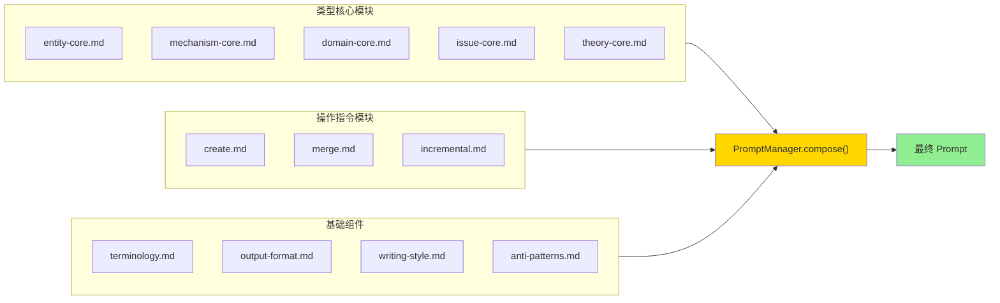

# 模块化 Prompt 架构设计文档

> 版本: 1.0  
> 最后更新: 2025-12-11  
> 状态: 设计完成，待实施

---

## 1. 设计目标

### 1.1 支持的操作模式

| 操作模式 | 描述 | 输入 | 输出 |
|---------|------|------|------|
| `create` | 从零创建新概念 | 用户描述 | 完整 JSON |
| `merge` | 合并两个重复概念 | 两个笔记内容 | 合并后的 JSON |
| `incremental` | 增量改进现有概念 | 现有内容 + 改进指令 | 增强后的 JSON |

### 1.2 设计原则

- **DRY**: 五种知识类型的核心定义只维护一份
- **开闭原则**: 对扩展开放（新增操作），对修改关闭（不改类型核心）
- **组合优于继承**: 类型模块 + 操作模块 = 最终 Prompt

---

## 2. 目录结构

```
prompts/
├── _base/                        # 通用基础组件
│   ├── terminology.md            # 术语表
│   ├── output-format.md          # JSON 输出格式
│   ├── writing-style.md          # 写作风格
│   ├── anti-patterns.md          # 反模式
│   └── operations/               # 操作指令模块
│       ├── create.md             # 创建操作指令
│       ├── merge.md              # 合并操作指令
│       └── incremental.md        # 增量改进指令
│
├── _type/                        # 类型核心模块（无 task 区块）
│   ├── entity-core.md
│   ├── mechanism-core.md
│   ├── domain-core.md
│   ├── issue-core.md
│   └── theory-core.md
│
├── enrich.md                     # 别名标签生成（独立）
├── ground.md                     # 事实核查（独立）
└── standardizeClassify.md        # 标准化分类（独立）
```

> **注意**: 旧的 `reason-*.md` 文件将被删除，由 `_type/*-core.md` + `operations/*.md` 组合替代。

---

## 3. 模块组合模型



**组合矩阵**: 5 类型 × 3 操作 = **15 种场景**

---

## 4. 类型核心模块规范

### 4.1 模块结构

每个 `_type/*-core.md` 包含该类型的**不变部分**，**不包含** `<task>` 区块：

```markdown
<system_instructions>
    <role>
        <!-- 角色定义，包含 {{CTX_LANGUAGE}} 占位符 -->
    </role>
    
    {{BASE_TERMINOLOGY}}
    
    <philosophical_core>
        <!-- 该类型的哲学定义 -->
    </philosophical_core>
    
    <naming_morphology>
        <!-- 命名规范 -->
    </naming_morphology>
    
    <decomposition_logic>
        <!-- 分解逻辑 -->
    </decomposition_logic>
    
    <content_depth_standards>
        <!-- 深度标准 -->
    </content_depth_standards>
    
    {{BASE_OUTPUT_FORMAT}}
    
    <output_schema>
        <!-- 该类型的 JSON Schema -->
    </output_schema>
</system_instructions>

{{BASE_WRITING_STYLE}}

{{BASE_ANTI_PATTERNS}}

{{OPERATION_BLOCK}}
```

### 4.2 关键占位符

| 占位符 | 说明 | 替换时机 |
|-------|------|---------|
| `{{BASE_*}}` | 基础组件引用 | 模板加载时 |
| `{{CTX_LANGUAGE}}` | 输出语言 | 运行时 |
| `{{OPERATION_BLOCK}}` | 操作模块内容 | compose() 时注入 |

---

## 5. 操作指令模块规范

每个操作模块定义 `<task>` 和 `<context_slots>`：

### 5.1 `create.md`

```markdown
<task>
    **CREATE TASK**:
    
    Analyze the input {{TYPE}} provided in the context slots.
    
    1.  **Define** the {{TYPE}} using the appropriate analytical method.
    2.  **Decompose** according to the decomposition_logic.
    3.  **Differentiate** from similar concepts.
    4.  **Generate** JSON strictly following the schema.
</task>

<context_slots>
    <user_input>
{{CTX_INPUT}}
    </user_input>
</context_slots>
```

### 5.2 `merge.md`

```markdown
<task>
    **MERGE TASK**:
    
    Merge **TWO SOURCE NOTES** describing the same or similar {{TYPE}}.
    
    **Principles**:
    1.  **Conflict Resolution**: Prefer higher precision, more citations, deeper argumentation.
    2.  **Union**: Combine unique details from both sources.
    3.  **Deduplication**: Remove redundancy, preserve nuance.
    4.  **Synthesis**: `holistic_understanding` must synthesize BOTH sources.
    
    **Field Strategy**:
    - Scalar: Synthesize into unified narrative.
    - Array: Union + deduplicate.
    - Object: Deep merge.
</task>

<context_slots>
    <source_a>
        <name>{{SOURCE_A_NAME}}</name>
        <content>{{CTX_SOURCE_A}}</content>
    </source_a>
    <source_b>
        <name>{{SOURCE_B_NAME}}</name>
        <content>{{CTX_SOURCE_B}}</content>
    </source_b>
    <instruction>{{USER_INSTRUCTION}}</instruction>
</context_slots>
```

### 5.3 `incremental.md`

```markdown
<task>
    **INCREMENTAL IMPROVEMENT TASK**:
    
    Enhance an **EXISTING {{TYPE}}** based on user instruction.
    
    **Principles**:
    1.  **Preserve**: Do NOT discard valid existing content.
    2.  **Target**: Focus on areas specified by instruction.
    3.  **Deepen**: Add depth, not just volume.
    4.  **Superset**: Output must include all original valid content.
</task>

<context_slots>
    <existing_content>{{CTX_CURRENT}}</existing_content>
    <instruction>{{USER_INSTRUCTION}}</instruction>
</context_slots>
```

---

## 6. 槽位标准

### 6.1 通用槽位

| 槽位 | 用途 | 默认值 |
|-----|------|-------|
| `{{CTX_LANGUAGE}}` | 输出语言 | `Chinese` |
| `{{TYPE}}` | 类型名称（自动注入） | - |

### 6.2 操作特定槽位

| 操作 | 必需槽位 | 可选槽位 |
|------|---------|---------|
| `create` | `CTX_INPUT` | `CTX_LANGUAGE` |
| `merge` | `SOURCE_A_NAME`, `CTX_SOURCE_A`, `SOURCE_B_NAME`, `CTX_SOURCE_B` | `USER_INSTRUCTION` |
| `incremental` | `CTX_CURRENT`, `USER_INSTRUCTION` | `CTX_LANGUAGE` |

---

## 7. PromptManager 接口设计

### 7.1 新增类型

```typescript
type OperationType = "create" | "merge" | "incremental";

interface PromptComposeOptions {
  conceptType: CRType;           // Entity | Mechanism | Domain | Issue | Theory
  operation: OperationType;      // create | merge | incremental
  slots: Record<string, string>; // 槽位数据
}
```

### 7.2 核心方法

```typescript
interface IPromptManager {
  /**
   * 组合 Prompt
   * @param options 组合选项
   * @returns 构建好的 Prompt
   */
  compose(options: PromptComposeOptions): Result<string>;
  
  /**
   * 加载类型核心模块
   */
  loadTypeCoreModule(conceptType: CRType): Result<string>;
  
  /**
   * 加载操作指令模块
   */
  loadOperationModule(operation: OperationType): Result<string>;
  
  /**
   * 预加载所有模块（初始化时调用）
   */
  preloadAllModules(): Promise<Result<void>>;
}
```

### 7.3 compose() 实现伪代码

```typescript
compose(options: PromptComposeOptions): Result<string> {
  // 1. 加载类型核心
  const typeCore = this.loadTypeCoreModule(options.conceptType);
  
  // 2. 加载操作模块
  const operation = this.loadOperationModule(options.operation);
  
  // 3. 注入基础组件（BASE_*）
  let content = this.injectBaseComponents(typeCore.value);
  
  // 4. 注入操作模块（替换 OPERATION_BLOCK）
  content = content.replace("{{OPERATION_BLOCK}}", operation.value);
  
  // 5. 注入类型名称
  content = this.replaceVariable(content, "TYPE", options.conceptType);
  
  // 6. 替换所有槽位
  for (const [key, value] of Object.entries(options.slots)) {
    content = this.replaceVariable(content, key, value);
  }
  
  return ok(content);
}
```

---

## 8. 实施计划

### Phase 1: 创建 Prompt 模块

| 任务 | 文件 | 来源 |
|------|------|------|
| 创建目录 | `prompts/_type/`, `prompts/_base/operations/` | 新建 |
| Entity 核心 | `_type/entity-core.md` | 提取自 `reason-entity.md` |
| Mechanism 核心 | `_type/mechanism-core.md` | 提取自 `reason-mechanism.md` |
| Domain 核心 | `_type/domain-core.md` | 提取自 `reason-domain.md` |
| Issue 核心 | `_type/issue-core.md` | 提取自 `reason-issue.md` |
| Theory 核心 | `_type/theory-core.md` | 提取自 `reason-theory.md` |
| Create 操作 | `_base/operations/create.md` | 新编写 |
| Merge 操作 | `_base/operations/merge.md` | 新编写 |
| Incremental 操作 | `_base/operations/incremental.md` | 新编写 |

### Phase 2: 修改 PromptManager

| 任务 | 文件 |
|------|------|
| 新增 `OperationType` 类型 | `src/types.ts` |
| 新增 `compose()` 方法 | `src/core/prompt-manager.ts` |
| 新增 `loadTypeCoreModule()` | `src/core/prompt-manager.ts` |
| 新增 `loadOperationModule()` | `src/core/prompt-manager.ts` |
| 修改 `preloadAllTemplates()` | `src/core/prompt-manager.ts` |

### Phase 3: 清理

| 任务 |
|------|
| 删除 `reason-entity.md` |
| 删除 `reason-mechanism.md` |
| 删除 `reason-domain.md` |
| 删除 `reason-issue.md` |
| 删除 `reason-theory.md` |
| 更新 `build()` 方法内部调用 `compose()` |

---

## 9. 调用示例

### 9.1 创建新概念

```typescript
const result = promptManager.compose({
  conceptType: "Entity",
  operation: "create",
  slots: {
    CTX_INPUT: "量子力学中的波函数",
    CTX_LANGUAGE: "Chinese"
  }
});
```

### 9.2 合并两个概念

```typescript
const result = promptManager.compose({
  conceptType: "Entity",
  operation: "merge",
  slots: {
    SOURCE_A_NAME: "波函数 (Wave Function)",
    CTX_SOURCE_A: "... Note A 内容 ...",
    SOURCE_B_NAME: "波动函数 (Wavefunction)",
    CTX_SOURCE_B: "... Note B 内容 ...",
    USER_INSTRUCTION: "保留更规范的数学表述"
  }
});
```

### 9.3 增量改进

```typescript
const result = promptManager.compose({
  conceptType: "Entity",
  operation: "incremental",
  slots: {
    CTX_CURRENT: "... 现有笔记内容 ...",
    USER_INSTRUCTION: "扩展 historical_genesis 部分，增加量子力学发展史"
  }
});
```
