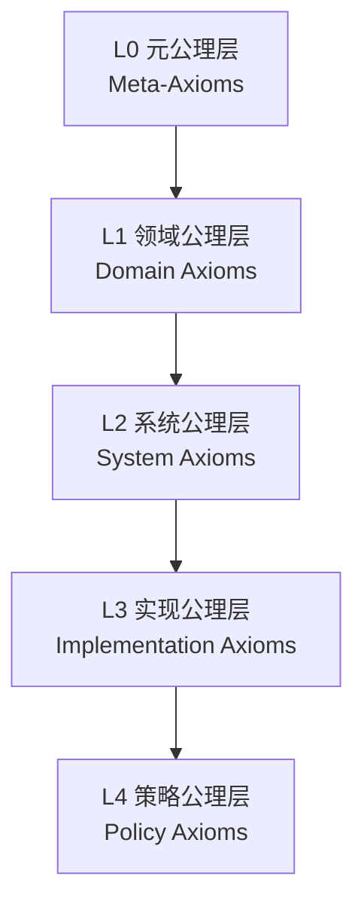
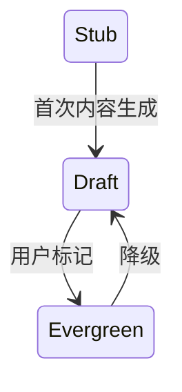
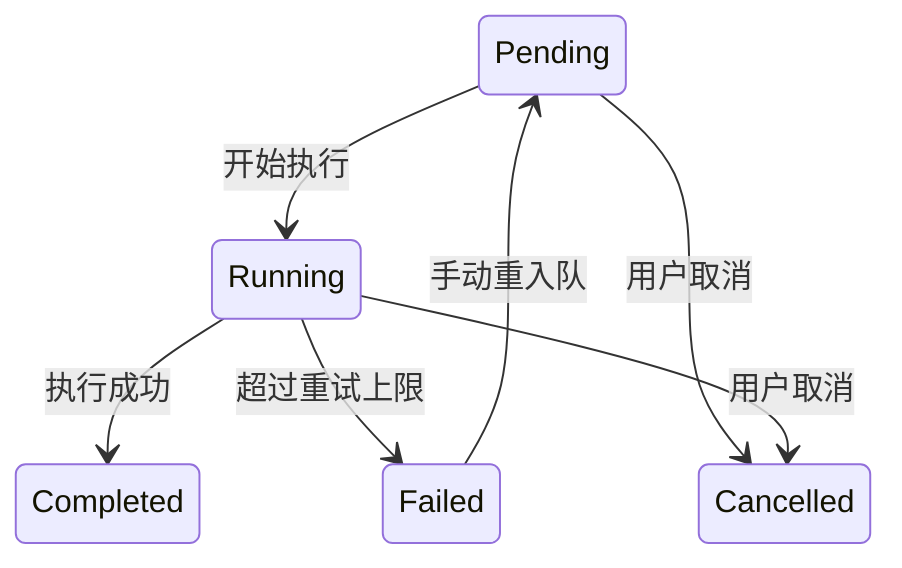
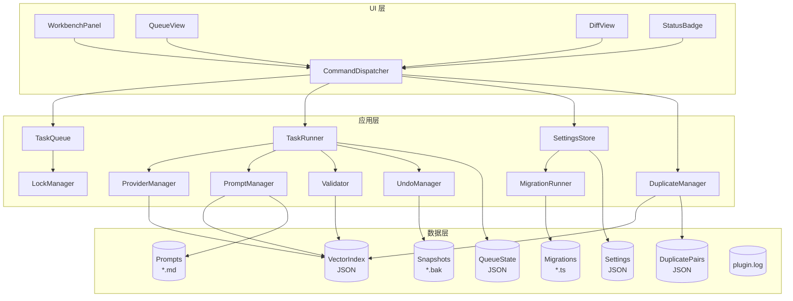
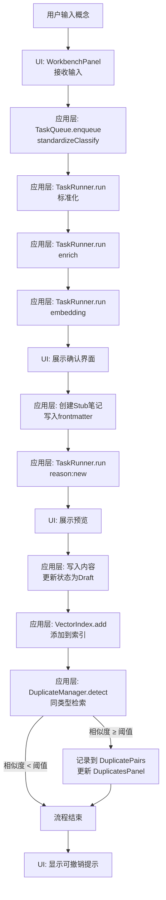
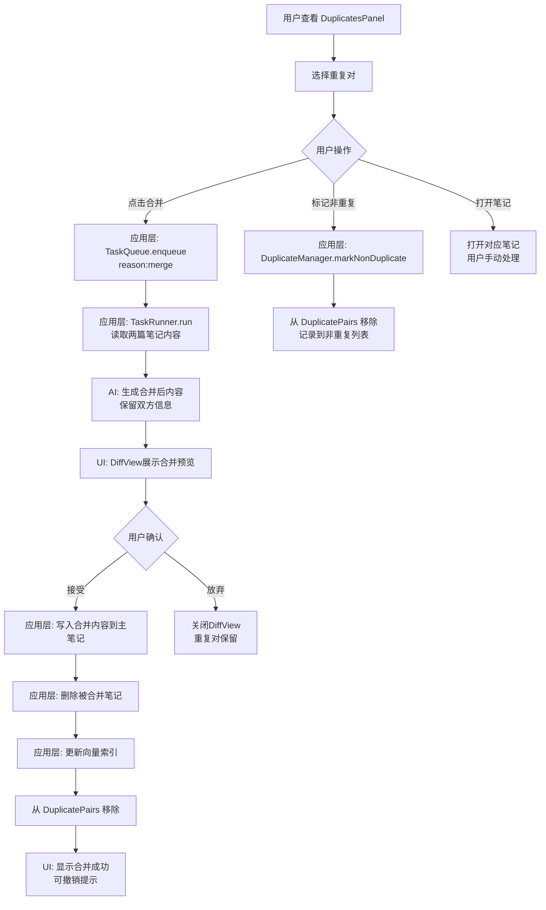
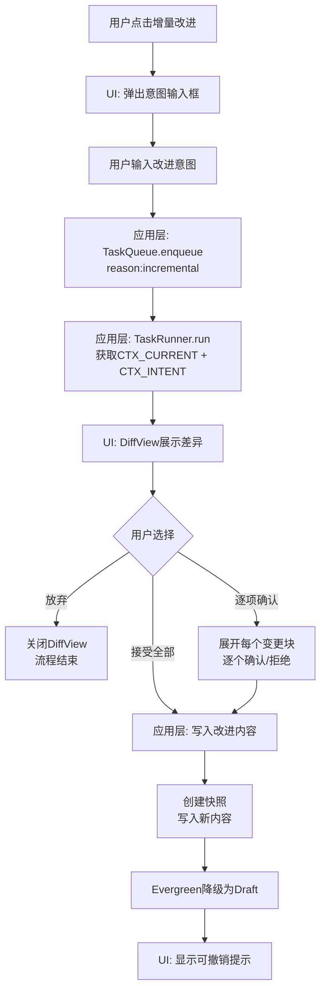
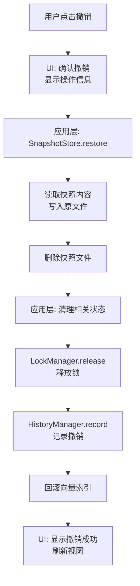

# Cognitive Razor 公理化设计文档

> **文档版本**：1.0.0  
> **最后更新**：2025-12-05  
> **文档性质**：整合 PRD/PDD/UCD/DD/TAD 的完整公理化设计规范  
> **目标读者**：产品策划、架构设计、前端开发、提示词工程、交互设计

---

## 第一部分：元理论基础

### 1.1 文档目的与方法论

本文档采用公理化方法构建 Obsidian 插件 "Cognitive Razor" 的完整设计规范。公理化方法的核心价值在于：

1. **一致性**：所有设计决策可追溯至有限的根公理，避免相互矛盾
2. **完备性**：通过公理推导覆盖所有必要的功能与约束
3. **可验证性**：每条规则都有明确的前提和结论，可被程序或人工验证
4. **可修改性**：修改某一公理时，可追踪其影响范围

### 1.2 公理体系层次结构

本文档的公理体系分为五个层次，每层仅依赖于上层公理：



### 1.3 符号约定

| 符号 | 含义 |
|------|------|
| `M-XX` | 元公理（Meta-Axiom） |
| `G-XX` | 根公理（Ground Axiom） |
| `A-XX` | 领域/系统公理（Axiom） |
| `O-XX` | Obsidian 平台约束（Obsidian Constraint） |
| `T-XX` | 定理/命题（Theorem） |
| `D-XX` | 定义（Definition） |
| `H-XX` | 假设（Hypothesis） |
| `R-XX` | 推导规则（Rule） |
| `C-XX` | 校验规则（Constraint） |
| `E-XX` | 错误码（Error Code） |

---

## 第二部分：元公理层（L0）

> 元公理是整个系统的哲学基础，不可由其他公理推导，是设计决策的终极依据。

### 2.1 存在性元公理

**M-01 概念实在性（Conceptual Realism）**
> 知识由可识别、可命名、可定义的概念构成；概念是知识管理的原子单位。

- **推论**：系统必须提供概念的创建、存储、检索、关联机制
- **推论**：每个概念必须具有唯一标识符（UID）

**M-02 结构可表达性（Structural Expressibility）**
> 概念之间的关系可以通过有限的结构化形式完整表达。

- **推论**：存在有限的知识类型集合，足以表达所有知识结构
- **推论**：概念间的关系可以通过类型化的链接表达

**M-03 语义可判定性（Semantic Decidability）**
> 两个概念是否语义等价，可以通过算法在有限时间内判定。

- **推论**：系统可以实现语义去重
- **推论**：相似度阈值是可配置的判定边界

### 2.2 认知论元公理

**M-04 人机协作性（Human-AI Collaboration）**
> AI 是人类认知的增强工具，而非替代；最终决策权归属于人类。

- **推论**：所有 AI 操作必须可追溯、可撤销

**M-05 渐进认知性（Progressive Cognition）**
> 知识的形成是渐进的过程，从模糊到清晰，从草稿到定稿。

- **推论**：笔记存在状态演进（Stub → Draft → Evergreen）
- **推论**：系统支持增量改进而非一次性生成

**M-06 注意力有限性（Attention Scarcity）**
> 人类注意力是稀缺资源，系统不应无谓消耗用户注意力。

- **推论**：通知必须分级，非关键信息不打断用户
- **推论**：界面采用渐进披露，隐藏高级功能

### 2.3 系统论元公理

**M-07 本地主权性（Local Sovereignty）**
> 用户数据的主权归属于用户本地环境，远程服务仅作为计算资源。

- **推论**：所有持久化数据必须存储在本地
- **推论**：远程 API 仅用于推理计算，不存储用户数据

**M-08 操作可逆性（Operational Reversibility）**
> 任何改变系统状态的操作都必须存在逆操作。

- **推论**：写入前必须创建快照
- **推论**：用户可以撤销任何已确认的写入

**M-09 系统透明性（System Transparency）**
> 系统的内部状态对用户可见，用户可以理解系统正在做什么。

- **推论**：任务队列状态可视化
- **推论**：错误信息必须可理解且提供修复建议

---

## 第三部分：根公理层（L1）

> 根公理从元公理推导而来，定义了 Cognitive Razor 的核心设计原则。

### 3.1 身份与唯一性公理

**G-01 概念身份公理（Concept Identity）**
> 每个概念以唯一 UID 标识；同一 UID 在系统生命周期内对应唯一语义对象。

- **来源**：M-01 概念实在性
- **形式化**：`∀c ∈ Concepts: ∃!uid ∈ UIDs: identity(c) = uid`
- **实现**：使用 UUID v4 作为 UID 生成策略

**G-02 语义唯一性公理（Semantic Uniqueness）**
> 同类型概念在语义空间中不得重复；写入前必须执行同类型去重检查。

- **来源**：M-03 语义可判定性
- **形式化**：`∀c1, c2 ∈ Concepts: type(c1) = type(c2) ∧ sim(c1, c2) ≥ θ → c1 ≡ c2`
- **实现**：向量相似度检索，默认阈值 θ = 0.9 ,用户可自行设定。 

### 3.2 知识结构公理

**G-03 类型有限性公理（Type Finiteness）**
> 知识类型属于有限有序集合 K = {Domain, Issue, Theory, Entity, Mechanism}。

- **来源**：M-02 结构可表达性
- **形式化**：`|K| = 5 ∧ K 是全序集`
- **语义**：
  - **Domain（领域）**：知识边界，可 MECE 分解
  - **Issue（议题）**：矛盾/问题空间，包含核心张力
  - **Theory（理论）**：公理化推演体系
  - **Entity（实体）**：静态对象，属加种差定义
  - **Mechanism（机制）**：动态因果链

**G-04 因果层级性公理（Causal Hierarchy）**
> 知识深化遵循固定路径：Domain → Issue → Theory → {Entity, Mechanism}。

- **来源**：M-02 结构可表达性
- **形式化**：`deepen: K → P(K)` 其中：
  - `deepen(Domain) = {Issue}`
  - `deepen(Issue) = {Theory}`
  - `deepen(Theory) = {Entity, Mechanism}`
  - `deepen(Entity) = deepen(Mechanism) = ∅`
- **约束**：跳级深化视为违规

### 3.3 人机交互公理

**G-05 人机共生性公理（Human-AI Symbiosis）**
> AI 生成内容的写入需可追溯、可撤销、可中断恢复。

- **来源**：M-04 人机协作性, M-08 操作可逆性
- **实现要求**：
  - 增量写入需要展示Diff预览
  - 确认后提供撤销入口
  - 任务可暂停、取消、重试

**G-06 渐进披露性公理（Progressive Disclosure）**
> 新手简化界面，高级功能显式解锁；功能复杂度与用户需求匹配。

- **来源**：M-06 注意力有限性
- **实现**：默认模式隐藏模型/阈值等高级参数

**G-07 注意力尊重性公理（Attention Respect）**
> 在用户输入时降噪通知，分级提示；关键操作提供立即反馈。

- **来源**：M-06 注意力有限性
- **通知分级**：
  - **Error**：模态对话框（数据丢失风险、操作失败）
  - **Warning**：Toast 通知（需要注意）
  - **Info**：状态栏更新（进度信息、操作成功）

### 3.4 数据主权公理

**G-08 本地优先性公理（Local First）**
> 索引、队列、快照、配置等持久化数据必须本地存储；远程 API 仅用于推理计算。

- **来源**：M-07 本地主权性
- **实现**：所有数据存储在 `.obsidian/plugins/obsidian-cognitive-razor/data/`

**G-09 可逆写入公理（Reversible Write）**
> 任何修改 Markdown 文件的操作必须先生成快照；撤销后清理对应快照。

- **来源**：M-08 操作可逆性
- **实现**：
  - 快照存储在 `data/snapshots/`
  - 写入采用临时文件+重命名原子化
  - 快照保留策略：默认保留最近 100 个，可配置
  - 撤销操作恢复快照内容并删除快照文件

### 3.5 命名规范公理

**G-10 命名规范性公理（Naming Convention）**
> 概念命名遵循可配置模板，默认格式为 `{{chinese}} ({{english}})`。

- **来源**：G-01 概念身份公理
- **占位符集合**：`{chinese, english, type, type_cn, uid}`
- **约束**：必须生成标准名 + 别名列表

## 第四部分：系统公理层（L2）

> 系统公理定义了 Cognitive Razor 作为 Obsidian 插件的具体约束和行为规范。

### 4.1 Obsidian 平台约束

**O-01 数据结构安全（Data Structure Safety）**
> 插件不得破坏 Obsidian 原生文件结构；不修改非本插件管理的文件。

- **来源**：G-08 本地优先性
- **约束**：
  - 仅操作插件目录 `data/` 下的文件
  - 用户笔记的 frontmatter 仅添加 CR 专属字段，不删除原有字段
  - 不修改 `.obsidian/` 下的非插件配置

**O-02 命令与快捷键规范（Command & Hotkey Convention）**
> 注册的命令 ID 必须稳定且无冲突；快捷键可自定义但有合理默认值。

- **来源**：Obsidian 插件规范
- **命令 ID 格式**：`cognitive-razor:<action>-<target>`
- **示例**：
  - `cognitive-razor:create-concept`
  - `cognitive-razor:open-queue`

**O-03 分层与非阻塞（Layering & Non-Blocking）**
> 渲染与数据处理分层；IO 操作不阻塞 UI 线程。

- **来源**：M-09 系统透明性
- **实现**：
  - 使用 async/await 处理所有 IO
  - 长时间操作显示进度指示器
  - UI 状态更新延迟 ≤100ms

**O-04 配置持久化（Configuration Persistence）**
> 插件配置存储在专属目录，支持导入导出。

- **来源**：G-08 本地优先性
- **存储位置**：`data/settings.json`
- **功能**：
  - 导出为 JSON 文件
  - 从 JSON 文件导入
  - 版本迁移支持

**O-05 迁移策略（Migration Strategy）**
> 插件升级时必须定义迁移脚本或阻止加载并提示。

- **来源**：O-04 配置持久化
- **实现**：
  - `data/versions.json` 定义迁移矩阵
  - 迁移脚本位于 `data/migrations/`
  - 版本不匹配时阻止加载，提示用户

### 4.2 功能公理集合

**A-FUNC-01 队列与锁机制（Queue & Lock）**
> 同一 nodeId 在任意时刻仅允许一个非完成状态任务运行；去重或写入锁存在时，新任务入队需拒绝并返回原因。

- **来源**：G-05 人机共生性
- **锁类型**：
  - **节点锁（Node Lock）**：针对特定 nodeId 的写入锁
  - **类型锁（Type Lock）**：针对特定类型的去重检查锁
- **锁生命周期**：任务开始时获取，任务完成/失败/取消时释放

**A-FUNC-02 可逆写入机制（Reversible Write）**
> 任何修改 Markdown 之前必须生成快照并记录 undoPointer；撤销后清理对应快照，禁止静默写入。

- **来源**：G-09 可逆写入公理
- **快照内容**：
  - 原始文件完整内容
  - 文件路径
  - 创建时间戳
  - 关联的 nodeId 和 taskId

**A-FUNC-03 Provider 与模板匹配（Provider & Template Matching）**
> 任务执行前必须找到匹配的 Provider 与 PDD 模板；缺失或能力不符时本地终止并返回可诊断错误。

- **来源**：G-05 人机共生性
- **匹配规则**：
  - Provider 必须支持任务所需的能力（embedding/chat/json-output）
  - 模板必须存在且通过结构校验
  - 语言设置必须与 Provider 能力匹配

**A-FUNC-04 语义去重检测（Semantic Duplicate Detection）**
> 新概念创建后必须以同类型概念签名执行相似度检索；高相似度对必须记录并展示在重复面板中供用户选择合并。

- **来源**：G-02 语义唯一性公理
- **概念签名构成**：
  - 标准名（经命名模板渲染）
  - 别名列表
  - 核心定义摘要
- **阈值**：默认 0.9，可配置
- **检测时机**：新概念创建完成后自动检测
- **处理方式**：
  - 检测到重复对 → 记录到 DuplicatePairs 列表
  - 侧边栏 DuplicatesPanel 显示所有待处理重复对
  - 用户可选择：合并、标记为非重复、忽略

**A-FUNC-05 任务链与人机共生（Task Pipeline & Human-AI Symbiosis）**
> 标准化 → 别名 → 嵌入 → 确认创建 → 内容生成 → （可选）核查 → 确认写入 → 去重检测；任何写入需用户显式确认。

- **来源**：G-05 人机共生性, G-04 因果层级性
- **任务类型**：
  - `embedding`：生成概念签名的向量嵌入
  - `standardizeClassify`：标准化输入并分类知识类型
  - `enrich`：生成别名和标签
  - `reason:new`：为新概念生成完整内容
  - `reason:incremental`：增量改进现有内容
  - `reason:merge`：合并两个重复概念（AI 辅助）
  - `ground`：事实核查生成的内容

**A-FUNC-06 配置与迁移（Configuration & Migration）**
> 配置存储在插件目录，含版本号；升级时必须执行迁移或阻止加载并提示。

- **来源**：O-04, O-05
- **配置版本**：与 `manifest.json` 版本同步
- **迁移执行**：按版本拓扑排序依次执行

**A-FUNC-07 本地优先存储（Local First Storage）**
> 向量数据、队列、快照、日志必须本地存储；允许远程 API 仅用于推理/embedding。

- **来源**：G-08 本地优先性
- **存储结构**：
  ```
  data/
    settings.json         # 配置
    queue-state.json      # 队列状态
    vector-index.json     # 向量索引
    duplicate-pairs.json  # 重复对列表
    snapshots/            # 快照文件
    prompts/              # 提示词模板
    migrations/           # 迁移脚本
    plugin.log            # 循环日志
  ```

**A-FUNC-08 渐进披露与注意力尊重（Progressive Disclosure & Attention Respect）**
> 默认简化模式隐藏高级参数；通知分级，输入中断时静默非关键提示，关键操作提供立即反馈。

- **来源**：G-06 渐进披露性, G-07 注意力尊重性
- **模式切换**：设置中提供"高级模式"开关
- **高级模式显示**：
  - 模型选择
  - 温度/TopP 参数
  - 去重阈值
  - 并发数量

**A-FUNC-09 UI 注册规范（UI Registration）**
> 命令、侧边栏、状态栏必须通过 Obsidian API 注册，ID 稳定且快捷键无冲突。

- **来源**：O-02 命令与快捷键规范
- **注册方式**：
  - 命令：`this.addCommand()`
  - 侧边栏：`this.registerView()`
  - 状态栏：`this.addStatusBarItem()`

### 4.3 非功能公理集合

**A-NF-01 性能界限（Performance Bounds）**
> 持久化延迟 ≤200ms，UI 状态刷新 ≤100ms；嵌入/生成延迟受网络决定但需有进度反馈。

- **来源**：O-03 分层与非阻塞
- **监控指标**：
  - 文件写入延迟
  - UI 渲染延迟
  - API 响应时间

**A-NF-02 可靠性（Reliability）**
> 文件写入采用临时文件+重命名原子化；队列持久化实时或高频写入，重启可恢复。

- **来源**：A-FUNC-02 可逆写入
- **原子写入流程**：
  1. 写入临时文件 `.tmp`
  2. 校验写入完整性
  3. 重命名为目标文件
  4. 删除临时文件（如有残留）

**A-NF-03 可观察性（Observability）**
> 维护循环日志 `plugin.log`（1MB），记录任务状态变更、文件写入、API 错误。

- **来源**：M-09 系统透明性
- **日志级别**：DEBUG, INFO, WARN, ERROR
- **日志内容**：
  - 时间戳
  - 级别
  - 模块
  - 消息
  - 上下文数据

**A-NF-04 可访问性与多输入（Accessibility & Multi-Input）**
> 侧边栏、队列、按钮必须支持键盘 Tab/Enter 与触控；图标含 aria-label，状态变更通过 aria-live。

- **来源**：G-06 渐进披露性
- **要求**：
  - 所有交互元素可通过键盘访问
  - 焦点顺序合理
  - 屏幕阅读器兼容

**A-NF-05 安全与合规（Security & Compliance）**
> 禁止外发 vault 内容；所有外部调用需显式凭据，未配置时不得静默请求。

- **来源**：G-08 本地优先性
- **安全措施**：
  - API Key 加密存储（使用 Obsidian 的安全存储）
  - 不在日志中记录敏感信息
  - 外发数据仅限于用户明确输入的概念信息

## 第五部分：核心定义与数据模型

> 本部分定义系统中所有核心实体、枚举、接口和数据结构。

### 5.1 术语与实体定义

#### 5.1.1 核心实体表

| 标识 | 定义 | 类型 | 关联公理 |
|------|------|------|----------|
| CR-Plugin | 运行于 Obsidian 的 Cognitive Razor 插件整体 | 实体 | A-FUNC-09 |
| CR-KType | 知识类型枚举 {Domain, Issue, Theory, Entity, Mechanism} | 枚举 | G-03 |
| CR-ConceptSignature | 由标准名 + 别名 + 核心定义拼接形成的向量输入文本 | 对象 | A-FUNC-04 |
| CR-VectorIndex | 本地向量索引文件（JSON），按类型存储概念签名向量 | 数据 | A-FUNC-07 |
| CR-TaskPipeline | 原子任务链 {embedding, standardizeClassify, enrich, reason, ground} | 流程 | A-FUNC-05 |
| CR-TaskState | 任务状态枚举 | 枚举 | A-FUNC-01 |
| CR-NoteState | 笔记状态枚举 {Stub, Draft, Evergreen} | 枚举 | M-05 |
| CR-Queue | 任务调度与持久化组件 | 组件 | A-FUNC-01 |
| CR-Lock | 针对 nodeId/类型的写入与去重锁 | 约束 | A-FUNC-01, A-FUNC-04 |
| CR-Snapshot | data/snapshots 下的内容快照，用于撤销 | 数据 | A-FUNC-02 |
| CR-Settings | 插件配置对象 | 配置 | A-FUNC-06 |
| CR-Command | 注册的命令与快捷键 ID | 接口 | A-FUNC-09 |
| CR-Panel | 侧边栏与队列 UI 视图 | UI | A-FUNC-08 |
| CR-StatusBadge | 状态栏徽章，显示并发、锁、失败计数 | UI | A-FUNC-08 |
| CR-DirectoryScheme | 默认目录结构 | 约束 | G-03 |

#### 5.1.2 知识类型详细定义

**D-TYPE-01 Domain（领域）**
> 知识的边界划分，定义一个相对独立的知识空间。

| 属性 | 类型 | 说明 |
|------|------|------|
| definition | string | 领域的核心定义 |
| teleology | string | 领域存在的目的和价值 |
| methodology | string | 领域的研究方法论 |
| boundaries | string[] | 领域的边界描述 |
| issues | string[] | 领域内的核心议题（wikilink） |
| related_domains | string[] | 相关领域（wikilink） |

**D-TYPE-02 Issue（议题）**
> 领域内的核心矛盾或问题空间，包含对立的观点或张力。

| 属性 | 类型 | 说明 |
|------|------|------|
| core_tension | string | 核心张力，格式必须为 "X vs Y" |
| significance | string | 议题的重要性说明 |
| context | string | 议题产生的背景 |
| stakeholders | string[] | 利益相关方 |
| theories | string[] | 相关理论（wikilink） |
| historical_evolution | string | 历史演变 |

**D-TYPE-03 Theory（理论）**
> 公理化的推演体系，包含公理、推导链和提取的组件。

| 属性 | 类型 | 说明 |
|------|------|------|
| axioms | Axiom[] | 公理列表（至少 1 个） |
| argument_chain | string[] | 推导链 |
| extracted_components | object | 提取的实体和机制 |
| scope | string | 理论适用范围 |
| limitations | string[] | 理论局限性 |
| competing_theories | string[] | 竞争理论（wikilink） |

```typescript
interface Axiom {
  statement: string;      // 公理陈述
  justification: string;  // 公理依据
  source: string;         // 来源引用
}
```

**D-TYPE-04 Entity（实体）**
> 静态对象，通过属加种差方式定义。

| 属性 | 类型 | 说明 |
|------|------|------|
| definition | string | 属加种差定义 |
| genus | string | 属（上位概念） |
| differentia | string[] | 种差（区分特征） |
| properties | Property[] | 属性列表 |
| examples | string[] | 实例 |
| counterexamples | string[] | 反例 |
| related_entities | string[] | 相关实体（wikilink） |

```typescript
interface Property {
  name: string;
  type: string;
  description: string;
  required: boolean;
}
```

**D-TYPE-05 Mechanism（机制）**
> 动态因果链，描述事物如何运作。

| 属性 | 类型 | 说明 |
|------|------|------|
| causal_chain | CausalStep[] | 因果链（至少 2 步） |
| operates_on | string[] | 作用对象（至少 1 个，wikilink） |
| triggers | string[] | 触发条件 |
| outcomes | string[] | 产出结果 |
| inhibitors | string[] | 抑制因素 |
| related_mechanisms | string[] | 相关机制（wikilink） |

```typescript
interface CausalStep {
  step: number;
  description: string;
  entities_involved: string[];  // wikilink
  conditions: string[];
}
```

### 5.2 状态枚举定义

#### 5.2.1 笔记状态（NoteState）

```typescript
type NoteState = "Stub" | "Draft" | "Evergreen";
```

**状态转换规则**：


| 状态 | 含义 | 进入条件 | 退出条件 |
|------|------|----------|----------|
| Stub | 占位符，仅有 frontmatter | 创建时 | 首次内容生成确认 |
| Draft | 草稿，内容待完善 | 内容生成后 / Evergreen 降级 | 用户标记为 Evergreen |
| Evergreen | 定稿，内容稳定 | 用户显式确认 | 用户降级为 Draft |

#### 5.2.2 任务状态（TaskState）

```typescript
type TaskState =
  | "Pending"     // 等待执行
  | "Running"     // 正在执行（包含重试）
  | "Completed"   // 已完成
  | "Failed"      // 失败
  | "Cancelled";  // 已取消
```

**状态转换图**：


#### 5.2.3 任务类型（TaskType）

```typescript
type TaskType =
  | "embedding"              // 生成向量嵌入
  | "standardizeClassify"    // 标准化并分类
  | "enrich"                 // 生成别名和标签
  | "reason:new"             // 新概念内容生成
  | "reason:incremental"     // 增量改进
  | "reason:merge"           // 合并重复概念
  | "ground";                // 事实核查
```

### 5.3 数据模型定义

#### 5.3.1 Frontmatter 模型

```typescript
interface CRFrontmatter {
  // 必填字段
  uid: string;              // UUID v4，概念唯一标识
  type: CRType;             // 知识类型
  status: NoteState;        // 笔记状态，默认 "Stub"
  created: string;          // 创建时间，ISO 8601 格式
  updated: string;          // 更新时间，ISO 8601 格式
  
  // 可选字段
  aliases?: string[];       // 别名列表
  tags?: string[];          // 标签列表
  parentUid?: string;       // 父节点 UID（深化关系）
  parentType?: CRType;      // 父节点类型
  sourceUids?: string[];    // 来源引用 UID 列表
  
  // 元数据
  version?: string;         // 内容版本
}

type CRType = "Domain" | "Issue" | "Theory" | "Entity" | "Mechanism";
```

#### 5.3.2 概念签名模型

```typescript
interface ConceptSignature {
  standardName: string;     // 标准名（经命名模板渲染）
  aliases: string[];        // 别名列表
  coreDefinition: string;   // 核心定义摘要
  type: CRType;             // 知识类型
}

// 签名文本生成规则
function generateSignatureText(sig: ConceptSignature): string {
  return [
    sig.standardName,
    ...sig.aliases,
    sig.coreDefinition
  ].join(" | ");
}
```

#### 5.3.3 向量索引模型

```typescript
interface VectorEntry {
  uid: string;              // 概念 UID
  type: CRType;             // 知识类型
  embedding: number[];      // 向量嵌入
  title: string;            // 标题
  summary: string;          // 摘要
  updated: string;          // 更新时间
}

interface VectorIndexFile {
  version: string;          // 索引版本
  model: string;            // 嵌入模型标识
  dimension: number;        // 向量维度
  buckets: Record<CRType, VectorEntry[]>;  // 按类型分桶
  metadata: {
    totalCount: number;
    lastUpdated: string;
  };
}
```

#### 5.3.4 任务记录模型

```typescript
interface TaskRecord {
  id: string;               // 任务 ID（UUID）
  nodeId: string;           // 关联的概念 UID
  taskType: TaskType;       // 任务类型
  state: TaskState;         // 当前状态
  
  // 执行配置
  providerRef?: string;     // Provider 引用
  promptRef?: string;       // 模板引用
  
  // 执行状态
  attempt: number;          // 当前尝试次数
  maxAttempts: number;      // 最大尝试次数，默认 3
  
  // 上下文数据
  payload: Record<string, unknown>;  // 任务输入数据
  result?: Record<string, unknown>;  // 任务输出数据
  
  // 可逆性支持
  undoPointer?: string;     // 快照 ID
  lockKey?: string;         // 持有的锁
  
  // 时间戳
  created: string;
  updated: string;
  startedAt?: string;
  completedAt?: string;
  
  // 错误信息
  errors?: TaskError[];
}

interface TaskError {
  attempt: number;
  code: string;             // 错误码 E001-E101
  type: string;             // 错误类型
  message: string;          // 错误消息
  location?: string;        // 错误位置
  rawOutput?: string;       // 原始输出（用于调试）
  fixInstruction?: string;  // 修复建议
  timestamp: string;
}
```

#### 5.3.5 队列状态模型

```typescript
interface QueueStateFile {
  version: string;          // 队列状态版本
  tasks: TaskRecord[];      // 任务列表
  
  // 运行时配置
  concurrency: number;      // 当前并发数
  paused: boolean;          // 是否暂停
  
  // 统计信息
  stats: {
    totalProcessed: number;
    totalFailed: number;
    totalCancelled: number;
    lastProcessedAt?: string;
  };
  
  // 锁状态
  locks: LockRecord[];
}

interface LockRecord {
  key: string;              // 锁键（nodeId 或 type）
  type: "node" | "type";    // 锁类型
  taskId: string;           // 持有锁的任务 ID
  acquiredAt: string;       // 获取时间
}
```

#### 5.3.6 快照模型

```typescript
interface SnapshotRecord {
  id: string;               // 快照 ID（UUID）
  nodeId: string;           // 关联的概念 UID
  taskId: string;           // 关联的任务 ID
  path: string;             // 原文件路径
  content: string;          // 原始 Markdown 内容
  created: string;          // 创建时间
  
  // 元数据
  fileSize: number;         // 文件大小（字节）
  checksum: string;         // 内容校验和（MD5）
}

interface SnapshotIndex {
  version: string;
  snapshots: SnapshotRecord[];
  retentionPolicy: {
    maxCount: number;       // 最大保留数量
    maxAgeDays: number;     // 最大保留天数
  };
}
```

#### 5.3.7 重复对模型

```typescript
interface DuplicatePair {
  id: string;                 // 重复对 ID（UUID）
  noteA: {
    nodeId: string;           // 概念 A 的 UID
    name: string;             // 概念 A 的名称
    path: string;             // 概念 A 的文件路径
  };
  noteB: {
    nodeId: string;           // 概念 B 的 UID
    name: string;             // 概念 B 的名称
    path: string;             // 概念 B 的文件路径
  };
  type: CRType;               // 知识类型（双方必须相同）
  similarity: number;         // 相似度分数（0-1）
  detectedAt: string;         // 检测时间（ISO 8601）
  status: DuplicatePairStatus;// 处理状态
}

type DuplicatePairStatus =
  | "pending"                 // 待处理
  | "merging"                 // 合并中
  | "merged"                  // 已合并
  | "dismissed";              // 已标记为非重复

interface DuplicatePairsStore {
  version: string;
  pairs: DuplicatePair[];
  dismissedPairs: string[];   // 被标记为非重复的 pair ID 列表（历史记录）
}
```

#### 5.3.8 设置模型

```typescript
interface PluginSettings {
  // 基础设置
  language: "zh" | "en";              // 界面语言
  advancedMode: boolean;              // 高级模式开关
  
  // 命名设置
  namingTemplate: string;             // 命名模板，默认 "{{chinese}} ({{english}})"
  
  // 存储设置
  indexStoragePath: string;           // 索引存储路径
  directoryScheme: DirectoryScheme;   // 目录方案
  
  // 去重设置
  dedupThreshold: number;             // 去重阈值，默认 0.9
  topK: number;                       // 检索数量，默认 10
  
  // 队列设置
  maxConcurrency: number;             // 最大并发，默认 1
  autoRetry: boolean;                 // 自动重试，默认 true
  maxRetryAttempts: number;           // 最大重试次数，默认 3
  
  // 功能开关
  enableGrounding: boolean;           // 启用事实核查，默认 true
  autoConfirmWrite: boolean;          // 自动确认写入，默认 false
  
  // Provider 配置
  apiProviders: {
    google?: ProviderConfig;
    openai?: ProviderConfig;
    openrouter?: ProviderConfig;
    mock?: ProviderConfig;
  };
  
  // 任务模型配置
  taskModels: Record<TaskType, TaskModelConfig>;
  
  // 版本信息
  version: string;                    // 设置版本
}

interface ProviderConfig {
  apiKey: string;                     // API 密钥
  baseUrl?: string;                   // 自定义端点
  enabled: boolean;                   // 是否启用
}

interface TaskModelConfig {
  provider: "google" | "openai" | "openrouter" | "mock";
  model: string;                      // 模型名称
  temperature?: number;               // 温度参数
  topP?: number;                      // TopP 参数
  maxTokens?: number;                 // 最大 token 数
}

interface DirectoryScheme {
  Domain: string;                     // 默认 "1-领域"
  Issue: string;                      // 默认 "2-议题"
  Theory: string;                     // 默认 "3-理论"
  Entity: string;                     // 默认 "4-实体"
  Mechanism: string;                  // 默认 "5-机制"
}
```


---

## 第六部分：提示词系统设计（PDD）

> 本部分定义 AI 提示词的结构、校验规则和模板规范。

### 6.1 提示词公理集合

**A-PDD-01 区块序公理（Section Order）**
> 模板必须包含且仅包含 `<system><context><task><output_schema><error_history><reminder>` 按顺序排列，禁止 Markdown 标题或调换顺序。

- **来源**：确保模型注意力分配一致
- **校验**：模板加载时静态检查

**A-PDD-02 变量完备公理（Variable Completeness）**
> 构建阶段所有 `{{ }}` 变量必须被完全替换；存在未替换变量时拒绝调用 Provider 并返回构建错误。

- **来源**：防止模板注入和运行时错误
- **校验**：正则表达式检测残留变量

**A-PDD-03 共享硬约束公理（Shared Constraints）**
> `<system>` 必须注入统一的角色、写作风格、输出规则、禁止项与 wikilink 规范，且这些内容在同版本内不可修改。

- **来源**：确保跨任务一致性
- **内容**：见 6.3 共享约束定义

**A-PDD-04 上下文槽位公理（Context Slots）**
> 每个任务只能使用映射表规定的上下文槽位组合，禁止额外上下文；缺失必需槽位时任务构建失败。

- **来源**：控制信息泄露和上下文污染
- **槽位定义**：见 6.2 上下文槽位

**A-PDD-05 原子任务公理（Atomic Tasks）**
> 支持的任务固定为 {embedding, standardizeClassify, enrich, reason:new/incremental/merge, ground}；standardizeClassify 的 primary_type 仅允许 5 种类型。

- **来源**：G-03 类型有限性
- **约束**：不允许自定义任务类型

**A-PDD-06 输出与校验公理（Output & Validation）**
> 每个模板必须声明完整 JSON Schema（含必填字段与类型约束），并附带业务校验规则集；未声明或校验失败视为模板无效。

- **来源**：M-03 语义可判定性
- **校验规则**：见 6.5 校验规则表

**A-PDD-07 同类型语义去重公理（Same-Type Deduplication）**
> 所有生成类任务若存在 CTX_VAULT，必须将 vault_index 限定为与目标类型一致的节点；相似度 ≥ dedupThreshold 时必须记录为重复对并展示在 DuplicatesPanel。

- **来源**：G-02 语义唯一性
- **实现**：VectorIndex 按类型分桶检索，检测到重复后记录到 duplicate-pairs.json

**A-PDD-08 结构化重试公理（Structured Retry）**
> 重试上限 3 次，错误历史按 attempt 追加到 `<error_history>`，每条包含 code/type/message/location/raw_output/fix_instruction，禁止覆盖或丢失历史。

- **来源**：G-05 人机共生性
- **格式**：见 6.6 错误历史格式

**A-PDD-09 语言回退公理（Locale Fallback）**
> 系统仅支持中文（zh）和英文（en）；提示词模板统一使用英文编写；用户界面语言可配置。

- **来源**：国际化支持
- **语言策略**：
  - 提示词模板：统一英文
  - 用户界面：根据 `language` 设置显示中文或英文
  - 概念命名：双语模板 `{{chinese}} ({{english}})`

**A-PDD-10 安全与拒绝公理（Safety & Rejection）**
> 模板必须声明禁止行为（隐私泄露、执行代码等）与拒绝输出格式；当输入触发边界或 Provider 能力不足时输出可判定的拒绝 JSON，不得返回非 JSON 文本。

- **来源**：A-NF-05 安全与合规
- **拒绝格式**：`{"status": "REJECTED", "reason": "<code>", "message": "<description>"}`

**A-PDD-11 无写入副作用公理（No Write Side Effects）**
> 所有任务输出仅为 JSON 结果，不得包含文件系统操作或执行命令的指令，确保写入决策留在应用层。

- **来源**：G-05 人机共生性
- **约束**：输出中禁止包含 `write`, `execute`, `delete` 等动作指令

### 6.2 上下文槽位定义

| 槽位标识 | 说明 | 数据来源 |
|----------|------|----------|
| CTX_INPUT | 用户原始输入 | 用户输入框 |
| CTX_META | 笔记元数据（frontmatter） | 目标笔记 |
| CTX_VAULT | 同类型向量索引摘要 | VectorIndex |
| CTX_PARENT | 父节点内容（深化场景） | 父笔记 |
| CTX_SOURCES | 来源引用内容 | 引用笔记列表 |
| CTX_CURRENT | 当前笔记完整内容 | 目标笔记 |
| CTX_INTENT | 用户改进意图 | 用户输入 |
| CTX_SCHEMA | 类型字段 Schema | SchemaRegistry |
| CTX_NOTE_A | 重复对中笔记 A 的完整内容 | 主笔记（合并目标） |
| CTX_NOTE_B | 重复对中笔记 B 的完整内容 | 被合并笔记 |

**任务-槽位映射表**：

| 任务类型 | 必需槽位 | 可选槽位 |
|----------|----------|----------|
| embedding | CTX_INPUT | - |
| standardizeClassify | CTX_INPUT | - |
| enrich | CTX_META | - |
| reason:new | CTX_META, CTX_VAULT, CTX_SCHEMA | CTX_PARENT, CTX_SOURCES |
| reason:incremental | CTX_META, CTX_VAULT, CTX_SCHEMA, CTX_CURRENT, CTX_INTENT | CTX_SOURCES |
| reason:merge | CTX_META, CTX_VAULT, CTX_SCHEMA, CTX_NOTE_A, CTX_NOTE_B | CTX_SOURCES |
| ground | CTX_META, CTX_CURRENT | CTX_SOURCES |

### 6.3 共享硬约束定义

```xml
<shared_constraints>
<!-- 角色定义 -->
<role>
你是一个专业的知识结构化助手，专注于帮助用户将模糊的概念转化为结构化的知识节点。
你的输出必须严格遵循指定的 JSON Schema，不得添加任何额外字段或注释。
</role>

<!-- 写作风格 -->
<writing_style>
- 使用精确、学术化的语言
- 避免模糊表述和主观判断
- 定义必须是属加种差形式
- 因果关系必须明确且可验证
- 引用使用 [[wikilink]] 格式
</writing_style>

<!-- 输出规则 -->
<output_rules>
- 输出必须是有效的 JSON，不包含任何前缀或后缀文本
- 所有字符串字段不得包含未转义的特殊字符
- 数组字段即使为空也必须存在（使用 []）
- 数值字段必须是数字类型，不是字符串
- 布尔字段必须是 true/false，不是字符串
</output_rules>

<!-- 禁止行为 -->
<prohibited>
- 禁止输出任何用户未提供的个人信息
- 禁止生成可执行代码或命令
- 禁止引用不存在的外部资源
- 禁止在输出中包含 HTML 或脚本标签
- 禁止输出超出 Schema 定义的字段
</prohibited>

<!-- Wikilink 规范 -->
<wikilink_convention>
- 引用其他概念时使用 [[概念名称]] 格式
- 概念名称必须使用标准名（遵循命名模板）
- 不确定是否存在的概念使用 [[?概念名称]] 标记
- 禁止使用嵌套 wikilink
</wikilink_convention>
</shared_constraints>
```

### 6.4 模板结构规范

#### 6.4.1 模板文件格式

```markdown
---
id: template-id
version: 1.0.0
task: taskType
locale: zh
requires:
  - CTX_INPUT
optional:
  - CTX_PARENT
---

<system>
{{SHARED_CONSTRAINTS}}

<!-- 任务特定系统指令 -->
</system>

<context>
{{#each required_slots}}
<{{slot_name}}>{{slot_value}}</{{slot_name}}>
{{/each}}
</context>

<task>
<!-- 具体任务指令 -->
</task>

<output_schema>
{
  "$schema": "http://json-schema.org/draft-07/schema#",
  "type": "object",
  "required": [...],
  "properties": {...}
}
</output_schema>

<error_history>
{{#if previous_errors}}
{{#each previous_errors}}
<error attempt="{{attempt}}">
  <code>{{code}}</code>
  <message>{{message}}</message>
  <fix_instruction>{{fix_instruction}}</fix_instruction>
</error>
{{/each}}
{{/if}}
</error_history>

<reminder>
<!-- 关键提醒，如校验规则 -->
</reminder>
```

#### 6.4.2 standardizeClassify 模板示例

```xml
<system>
{{SHARED_CONSTRAINTS}}

你需要将用户输入的概念进行标准化处理，并判断其所属的知识类型。
知识类型仅限于以下五种：Domain（领域）、Issue（议题）、Theory（理论）、Entity（实体）、Mechanism（机制）。
</system>

<context>
<user_input>{{raw_user_input}}</user_input>
</context>

<task>
1. 分析用户输入，提取核心概念
2. 生成标准化名称（中文名 + 英文名）
3. 生成 3-5 个别名
4. 判断知识类型，给出每种类型的置信度（总和必须为 1.0）
5. 生成简短的核心定义（用于去重检索）

类型判断指南：
- Domain：如果概念描述的是一个知识领域或学科边界
- Issue：如果概念包含对立观点或核心矛盾（"X vs Y"）
- Theory：如果概念是一套可推导的公理化体系
- Entity：如果概念是一个静态对象或分类
- Mechanism：如果概念描述的是动态过程或因果链
</task>

<output_schema>
{
  "$schema": "http://json-schema.org/draft-07/schema#",
  "type": "object",
  "required": ["standard_name", "aliases", "type_confidences", "primary_type", "core_definition"],
  "properties": {
    "standard_name": {
      "type": "object",
      "required": ["chinese", "english"],
      "properties": {
        "chinese": {"type": "string", "minLength": 1},
        "english": {"type": "string", "minLength": 1}
      }
    },
    "aliases": {
      "type": "array",
      "items": {"type": "string"},
      "minItems": 1,
      "maxItems": 10
    },
    "type_confidences": {
      "type": "object",
      "required": ["Domain", "Issue", "Theory", "Entity", "Mechanism"],
      "properties": {
        "Domain": {"type": "number", "minimum": 0, "maximum": 1},
        "Issue": {"type": "number", "minimum": 0, "maximum": 1},
        "Theory": {"type": "number", "minimum": 0, "maximum": 1},
        "Entity": {"type": "number", "minimum": 0, "maximum": 1},
        "Mechanism": {"type": "number", "minimum": 0, "maximum": 1}
      }
    },
    "primary_type": {
      "type": "string",
      "enum": ["Domain", "Issue", "Theory", "Entity", "Mechanism"]
    },
    "core_definition": {
      "type": "string",
      "minLength": 10,
      "maxLength": 500
    }
  }
}
</output_schema>

<error_history>
{{previous_errors}}
</error_history>

<reminder>
关键校验规则：
1. type_confidences 五个值的总和必须精确等于 1.0
2. primary_type 必须是置信度最高的类型
3. standard_name 的 chinese 和 english 都不能为空
4. aliases 至少包含 1 个别名
5. 输出必须是纯 JSON，不包含任何其他文本
</reminder>
```

#### 6.4.3 reason:new 模板示例（以 Issue 类型为例）

```xml
<system>
{{SHARED_CONSTRAINTS}}

你需要为一个 Issue（议题）类型的概念生成完整的结构化内容。
Issue 的核心特征是包含对立的观点或张力（core_tension），格式必须为 "X vs Y"。
</system>

<context>
<note_metadata>
{{CTX_META}}
</note_metadata>

<vault_index type="Issue">
{{CTX_VAULT}}
</vault_index>

<type_schema>
{{CTX_SCHEMA}}
</type_schema>

{{#if CTX_PARENT}}
<parent_node>
{{CTX_PARENT}}
</parent_node>
{{/if}}
</context>

<task>
基于提供的元数据，生成 Issue 类型笔记的完整内容。

必须包含以下字段：
1. core_tension：核心张力，格式必须为 "X vs Y"（如 "效率 vs 公平"）
2. significance：议题的重要性说明
3. context：议题产生的背景
4. stakeholders：利益相关方列表
5. theories：相关理论（使用 [[wikilink]] 格式）
6. historical_evolution：历史演变

注意：
- 检查 vault_index 中是否存在相似议题，如有请在输出中标注
- 如果存在 parent_node，确保内容与父节点逻辑一致
- 所有引用的概念使用 [[概念名称]] 格式
</task>

<output_schema>
{
  "$schema": "http://json-schema.org/draft-07/schema#",
  "type": "object",
  "required": ["core_tension", "significance", "context"],
  "properties": {
    "core_tension": {
      "type": "string",
      "pattern": "^.+ vs .+$"
    },
    "significance": {
      "type": "string",
      "minLength": 50
    },
    "context": {
      "type": "string",
      "minLength": 50
    },
    "stakeholders": {
      "type": "array",
      "items": {"type": "string"}
    },
    "theories": {
      "type": "array",
      "items": {"type": "string"}
    },
    "historical_evolution": {
      "type": "string"
    },
    "similar_issues": {
      "type": "array",
      "items": {
        "type": "object",
        "properties": {
          "name": {"type": "string"},
          "similarity_reason": {"type": "string"}
        }
      }
    }
  }
}
</output_schema>

<error_history>
{{previous_errors}}
</error_history>

<reminder>
关键校验规则：
1. core_tension 必须匹配正则 /^.+ vs .+$/
2. significance 和 context 至少 50 字符
3. 引用使用 [[wikilink]] 格式
4. 输出必须是纯 JSON
</reminder>
```

### 6.5 校验规则表

#### 6.5.1 错误码定义（E 系列）

| 代码 | 名称 | 触发条件 | 默认处理 |
|------|------|----------|----------|
| E001 | PARSE_ERROR | 输出非 JSON 或解析失败 | 结构化重试 |
| E002 | SCHEMA_VIOLATION | 不符合输出 Schema 类型/必填 | 结构化重试 |
| E003 | MISSING_REQUIRED | 必填字段缺失或空数组 | 结构化重试 |
| E004 | CONSTRAINT_VIOLATION | 违反业务规则 C001-C009 | 结构化重试 |
| E005 | SEMANTIC_DUPLICATE | 与同类型节点相似度超阈值 | 记录到 DuplicatesPanel，继续创建 |
| E006 | INVALID_WIKILINK | wikilink 格式错误 | 结构化重试 |
| E007 | TYPE_MISMATCH | 输出类型与预期不符 | 结构化重试 |
| E008 | CONTENT_TOO_SHORT | 内容长度不足最小要求 | 结构化重试 |
| E009 | SUM_NOT_ONE | type_confidences 求和 ≠ 1 | 结构化重试 |
| E010 | INVALID_PATTERN | 字段不匹配指定正则 | 结构化重试 |
| E100 | API_ERROR | Provider 返回 5xx/4xx | 指数退避重试 |
| E101 | TIMEOUT | 请求超时 | 指数退避重试 |
| E102 | RATE_LIMIT | 触发速率限制 (429) | 指数退避重试 |
| E103 | AUTH_ERROR | 认证失败 (401/403) | 终止，提示检查 Key |
| E200 | SAFETY_VIOLATION | 触发安全边界 | 终止，返回拒绝 |
| E201 | CAPABILITY_MISMATCH | Provider 能力不足 | 终止，提示更换 Provider |

#### 6.5.2 业务校验规则（C 系列）

| 代码 | 适用类型 | 规则描述 | 失败错误码 |
|------|----------|----------|------------|
| C001 | Issue | core_tension 必须匹配 `/^.+ vs .+$/` | E010 |
| C002 | All | wikilink 必须使用 `[[...]]` 格式 | E006 |
| C003 | Theory | axioms 数组长度 ≥ 1 | E003 |
| C004 | Theory | 每个 axiom 必须包含 justification | E003 |
| C005 | Mechanism | causal_chain 数组长度 ≥ 2 | E003 |
| C006 | Mechanism | operates_on 数组长度 ≥ 1 | E003 |
| C007 | Entity | definition 必须包含属和种差 | E004 |
| C008 | Domain | boundaries 数组长度 ≥ 1 | E003 |
| C009 | standardizeClassify | type_confidences 五值求和 = 1.0 | E009 |
| C010 | All | 必填字符串字段长度 > 0 | E003 |
| C011 | All | 数组字段不得包含空字符串 | E004 |

### 6.6 错误历史格式

```xml
<error_history>
<error attempt="1">
  <code>E009</code>
  <type>SUM_NOT_ONE</type>
  <message>type_confidences 求和为 0.95，应为 1.0</message>
  <location>$.type_confidences</location>
  <raw_output>{"type_confidences": {"Domain": 0.1, "Issue": 0.5, "Theory": 0.2, "Entity": 0.1, "Mechanism": 0.05}}</raw_output>
  <fix_instruction>请调整 type_confidences 各值，确保总和精确等于 1.0</fix_instruction>
</error>
<error attempt="2">
  <code>E010</code>
  <type>INVALID_PATTERN</type>
  <message>core_tension 格式错误，缺少 " vs "</message>
  <location>$.core_tension</location>
  <raw_output>{"core_tension": "效率和公平的矛盾"}</raw_output>
  <fix_instruction>请将 core_tension 改为 "X vs Y" 格式，如 "效率 vs 公平"</fix_instruction>
</error>
</error_history>
```

### 6.7 推导规则

**R-PDD-01 上下文组装规则**
> 前提：A-PDD-04, A-PDD-05  
> 结论：任务执行前，PromptManager 必须按映射表组装上下文，缺失必需槽位则构建失败。

**R-PDD-02 Schema 生成规则**
> 前提：A-PDD-06  
> 结论：CTX_SCHEMA 由 SchemaRegistry 根据目标类型动态生成，包含字段定义、类型约束和必填标记。

**R-PDD-03 校验执行规则**
> 前提：A-PDD-06  
> 结论：输出校验按以下顺序执行：JSON 解析 → Schema 校验 → 必填检查 → 业务规则 → 语义去重；任一步失败则记录错误并触发重试。

**R-PDD-04 重试终止规则**
> 前提：A-PDD-08  
> 结论：当 attempt = maxAttempts（默认 3）仍失败，返回最后一次错误并将任务状态设为 Failed。

**R-PDD-05 语言一致性规则**
> 前提：A-PDD-09
> 结论：提示词模板统一使用英文编写；用户界面根据 `language` 设置显示对应语言。

**R-PDD-06 安全拒绝规则**
> 前提：A-PDD-10  
> 结论：当输入触发安全边界，返回 `{"status": "REJECTED", "reason": "E200", "message": "..."}` 并终止任务。


---

## 第七部分：技术架构设计（TAD）

> 本部分定义系统的技术架构、模块职责和接口规范。

### 7.1 架构公理

**TA-01 分层单向依赖（Layered Unidirectional Dependency）**
> 依赖箭头仅 UI → 应用 → 数据，数据层不得反调 UI；跨层访问必须经明确定义接口。

- **来源**：O-03 分层与非阻塞
- **层次定义**：
  - UI 层：用户界面组件
  - 应用层：业务逻辑、流程控制、AI调用
  - 数据层：持久化和索引

**TA-02 写入可逆（Write Reversibility）**
> 任何文件写入必须先快照，写入仅由 TaskRunner 执行，不得在 UI 层直接写。

- **来源**：A-FUNC-02 可逆写入
- **约束**：UI 层只能返回数据，不能直接操作文件系统

**TA-03 同类型去重检测（Same-Type Duplicate Detection）**
> 新概念创建后在同类型索引内检索，命中阈值则记录为重复对并展示在 DuplicatesPanel。

- **来源**：A-FUNC-04 语义去重检测
- **实现**：VectorIndex 按类型分桶，检索时仅查询目标类型桶
- **重复对管理**：
  - 检测到的重复对存入 `duplicate-pairs.json`
  - DuplicatesPanel 实时显示待处理重复对
  - 用户可执行合并或标记为非重复

**TA-04 模板完备（Template Completeness）**
> Prompt 必须经 PDD 区块校验、Schema 校验、业务规则校验后才能调用 Provider。

- **来源**：A-PDD-01 至 A-PDD-06
- **校验时机**：模板加载时静态校验 + 运行时动态校验


**TA-05 接口契约（Interface Contract）**
> 所有跨模块调用返回 `{ok, data?, error?}`，错误映射 E001-E201；调用不得抛未捕获异常。

- **来源**：A-PDD-06 输出与校验
- **返回格式**：
  ```typescript
  interface Result<T> {
    ok: boolean;
    data?: T;
    error?: {
      code: string;
      message: string;
      details?: unknown;
    };
  }
  ```

**TA-06 可观测性（Observability）**
> 每个状态迁移、锁变更、写入、迁移必须产生日志事件；任务失败需附带错误码。

- **来源**：A-NF-03 可观察性
- **日志事件类型**：
  - TASK_STATE_CHANGE
  - LOCK_ACQUIRED / LOCK_RELEASED
  - FILE_WRITE / FILE_RESTORE
  - MIGRATION_START / MIGRATION_COMPLETE
  - API_REQUEST / API_RESPONSE

**TA-07 迁移阻断（Migration Blocking）**
> 版本不匹配或迁移失败时阻止插件加载并提示导出/回滚，禁止"跳过迁移"模式。

- **来源**：O-05 迁移策略
- **实现**：插件 onload 时首先检查版本，不匹配则显示模态对话框

**TA-08 多输入一致（Multi-Input Consistency）**
> 关键操作（提交/暂停/撤销/重试）同时提供快捷键和触控入口，且指向同一接口。

- **来源**：A-NF-04 可访问性
- **实现**：所有操作通过 CommandDispatcher 统一分发


### 7.2 系统架构图




### 7.3 模块职责定义

#### 7.3.1 UI 层模块

| 模块 | 职责 | 输入 | 输出 |
|------|------|------|------|
| WorkbenchPanel | 统一工作台，整合创建、重复管理、队列状态、操作历史 | 用户输入、系统事件 | 创建/合并/撤销请求 |
| QueueView | 任务队列详情视图，支持批量操作 | 队列事件 | 用户操作（暂停/取消/重试） |
| DiffView | 增量改进/合并预览，逐项确认 | Diff 数据 | 确认/放弃决策 |
| StatusBadge | 状态栏徽章，快捷入口 | 队列统计 | 点击事件 |
| CommandDispatcher | 命令统一分发 | 命令 ID + 参数 | 调用应用层接口 |

#### 7.3.2 应用层模块

| 模块 | 职责 | 依赖 | 输出/副作用 |
|------|------|------|-------------|
| TaskQueue | 任务入队、持久化、并发调度 | QueueState, LockManager | 任务事件、锁状态 |
| TaskRunner | 执行任务链、调用 Provider、写入结果 | ProviderManager, PromptManager, Validator, UndoManager | TaskState 更新 |
| LockManager | nodeId/type 去重/写入锁管理 | TaskQueue | 锁获取/释放结果 |
| DuplicateManager | 重复检测、重复对管理、合并协调 | VectorIndex, DuplicatePairs | 重复对列表、合并任务 |
| UndoManager | 快照创建/恢复/清理、操作历史记录 | 文件系统 | 撤销能力、可追溯记录 |
| SettingsStore | 读写配置、版本管理 | settings.json | 内存配置 |
| MigrationRunner | 执行版本迁移脚本 | versions.json, migrations/ | 升级/阻止加载 |
| ProviderManager | Provider 选择、API 调用、响应处理 | SettingsStore | LLM/Embedding 响应 |
| PromptManager | 模板加载、槽位插值、prompt 构建 | PDD 模板 | prompt 字符串 |
| Validator | JSON 解析、Schema 校验、业务规则校验 | VectorIndex, 校验规则表 | ValidationResult |

#### 7.3.3 数据层模块

| 模块 | 职责 | 存储位置 | 格式 |
|------|------|----------|------|
| VectorIndex | 概念签名向量存储、相似度检索 | data/vector-index.json | JSON |
| QueueState | 任务队列持久化 | data/queue-state.json | JSON |
| DuplicatePairs | 检测到的重复对存储 | data/duplicate-pairs.json | JSON |
| Snapshots | 文件快照存储 | data/snapshots/*.bak | 原始内容 |
| Settings | 插件配置存储 | data/settings.json | JSON |
| Prompts | 提示词模板存储 | data/prompts/*.md | Markdown |
| Migrations | 迁移脚本存储 | data/migrations/*.ts | TypeScript |
| Logger | 循环日志 | data/plugin.log | 文本 |


### 7.4 接口规范

#### 7.4.1 TaskQueue 接口

```typescript
interface ITaskQueue {
  /**
   * 将任务加入队列
   * @returns 成功返回任务 ID，失败返回错误（如锁冲突）
   */
  enqueue(task: Omit<TaskRecord, 'id' | 'created' | 'updated'>): Result<string>;
  
  /**
   * 取消任务
   * @returns 成功返回 true，任务不存在或已完成返回错误
   */
  cancel(taskId: string): Result<boolean>;
  
  /**
   * 暂停队列执行
   */
  pause(): void;
  
  /**
   * 恢复队列执行
   */
  resume(): void;
  
  /**
   * 获取队列状态
   */
  getStatus(): QueueStatus;
  
  /**
   * 订阅队列事件
   */
  subscribe(listener: QueueEventListener): () => void;
}

interface QueueStatus {
  paused: boolean;
  concurrency: number;
  pending: number;
  running: number;
  failed: number;
}

type QueueEvent = 
  | { type: 'TASK_ADDED'; task: TaskRecord }
  | { type: 'TASK_STARTED'; taskId: string }
  | { type: 'TASK_COMPLETED'; taskId: string; result: unknown }
  | { type: 'TASK_FAILED'; taskId: string; error: TaskError }
  | { type: 'TASK_CANCELLED'; taskId: string }
  | { type: 'QUEUE_PAUSED' }
  | { type: 'QUEUE_RESUMED' };
```

#### 7.4.2 TaskRunner 接口

```typescript
interface ITaskRunner {
  /**
   * 执行单个任务
   * @returns 任务执行结果
   */
  run(task: TaskRecord): Promise<Result<TaskResult>>;
  
  /**
   * 中断正在执行的任务
   */
  abort(taskId: string): void;
}

interface TaskResult {
  taskId: string;
  nodeId: string;
  output: Record<string, unknown>;
  snapshotId?: string;
  tokenUsage?: {
    prompt: number;
    completion: number;
    total: number;
  };
}
```

#### 7.4.3 LockManager 接口

```typescript
interface ILockManager {
  /**
   * 尝试获取锁
   * @returns 成功返回锁 ID，失败返回冲突信息
   */
  acquire(key: string, type: 'node' | 'type', taskId: string): Result<string>;
  
  /**
   * 释放锁
   */
  release(lockId: string): void;
  
  /**
   * 检查锁状态
   */
  isLocked(key: string): boolean;
  
  /**
   * 获取所有活跃锁
   */
  getActiveLocks(): LockRecord[];
}
```

#### 7.4.4 ProviderManager 接口

```typescript
interface IProviderManager {
  /**
   * 调用 LLM 生成
   */
  chat(request: ChatRequest): Promise<Result<ChatResponse>>;
  
  /**
   * 生成向量嵌入
   */
  embed(request: EmbedRequest): Promise<Result<EmbedResponse>>;
  
  /**
   * 检查 Provider 可用性
   */
  checkAvailability(providerId: string): Promise<Result<ProviderCapabilities>>;
  
  /**
   * 获取已配置的 Provider 列表
   */
  getConfiguredProviders(): ProviderInfo[];
}

interface ChatRequest {
  provider: string;
  model: string;
  messages: Array<{ role: 'system' | 'user' | 'assistant'; content: string }>;
  temperature?: number;
  topP?: number;
  maxTokens?: number;
  responseFormat?: 'json' | 'text';
}

interface ChatResponse {
  content: string;
  finishReason: 'stop' | 'length' | 'content_filter';
  usage: { prompt: number; completion: number; total: number };
}

interface EmbedRequest {
  provider: string;
  model: string;
  input: string | string[];
}

interface EmbedResponse {
  embeddings: number[][];
  usage: { totalTokens: number };
}

interface ProviderCapabilities {
  chat: boolean;
  embedding: boolean;
  jsonOutput: boolean;
  supportedLanguages: string[];
  maxContextLength: number;
}
```


#### 7.4.5 VectorIndex 接口

```typescript
interface IVectorIndex {
  /**
   * 添加或更新向量条目
   */
  upsert(entry: VectorEntry): Promise<Result<void>>;
  
  /**
   * 删除向量条目
   */
  delete(uid: string): Promise<Result<void>>;
  
  /**
   * 同类型相似度检索
   * @param type 目标类型（仅在同类型内检索）
   * @param embedding 查询向量
   * @param topK 返回数量
   * @returns 相似候选列表，按相似度降序
   */
  search(type: CRType, embedding: number[], topK: number): Promise<Result<SearchResult[]>>;
  
  /**
   * 获取索引统计
   */
  getStats(): IndexStats;
}

interface SearchResult {
  uid: string;
  title: string;
  summary: string;
  similarity: number;  // 0-1，越大越相似
}

interface IndexStats {
  totalEntries: number;
  entriesByType: Record<CRType, number>;
  dimension: number;
  model: string;
  lastUpdated: string;
}
```

#### 7.4.6 UndoManager 接口

```typescript
interface IUndoManager {
  /**
   * 创建快照并记录操作
   * @returns 快照 ID
   */
  createSnapshot(nodeId: string, taskId: string, path: string, content: string): Promise<Result<string>>;

  /**
   * 撤销操作（恢复快照）
   * @returns 恢复的内容
   */
  undo(snapshotId: string): Promise<Result<string>>;

  /**
   * 获取可撤销的操作历史
   */
  getHistory(nodeId?: string): UndoRecord[];

  /**
   * 清理过期快照
   */
  cleanup(): Promise<{ deleted: number; retained: number }>;
}

interface UndoRecord {
  snapshotId: string;
  nodeId: string;
  taskId: string;
  action: string;
  timestamp: string;
}
```

#### 7.4.7 Validator 接口

```typescript
interface IValidator {
  /**
   * 验证 LLM 输出
   * @param output 原始输出字符串
   * @param schema JSON Schema
   * @param rules 业务规则列表
   * @param context 验证上下文（用于去重检查）
   * @returns 验证结果
   */
  validate(
    output: string,
    schema: object,
    rules: string[],
    context?: ValidationContext
  ): Promise<ValidationResult>;
}

interface ValidationContext {
  type: CRType;
  embedding?: number[];
  dedupThreshold?: number;
}

interface ValidationResult {
  valid: boolean;
  data?: Record<string, unknown>;  // 解析后的数据（如果有效）
  errors: ValidationError[];
  duplicates?: SearchResult[];     // 去重检查结果
}

interface ValidationError {
  code: string;       // E001-E201
  type: string;       // 错误类型名称
  message: string;    // 人类可读消息
  location?: string;  // JSON Path
  expected?: string;  // 期望值
  actual?: string;    // 实际值
}
```

### 7.5 数据流详解

#### 7.5.1 新建概念流程




#### 7.5.2 重复合并流程



#### 7.5.3 增量改进流程



#### 7.5.4 撤销流程



### 7.6 文件与目录结构

```
.obsidian/plugins/obsidian-cognitive-razor/
├── main.js                    # 编译后的插件入口
├── manifest.json              # 插件清单
├── styles.css                 # 样式文件
│
├── data/                      # 插件数据目录
│   ├── settings.json          # 用户配置
│   ├── queue-state.json       # 队列状态
│   ├── vector-index.json      # 向量索引
│   ├── versions.json          # 迁移版本矩阵
│   ├── plugin.log             # 循环日志（1MB）
│   │
│   ├── snapshots/             # 快照目录
│   │   ├── index.json         # 快照索引
│   │   └── *.bak              # 快照文件
│   │
│   ├── prompts/               # 提示词模板
│   │   ├── standardizeClassify.md
│   │   ├── enrich.md
│   │   ├── reason-domain.md
│   │   ├── reason-issue.md
│   │   ├── reason-theory.md
│   │   ├── reason-entity.md
│   │   ├── reason-mechanism.md
│   │   ├── reason-incremental.md
│   │   └── ground.md
│   │
│   └── migrations/            # 迁移脚本
│       ├── 0.1.0-to-0.2.0.ts
│       └── 0.2.0-to-1.0.0.ts
│
└── src/                       # 源代码（开发时）
    ├── main.ts                # 插件入口
    ├── ui/                    # UI 层
    │   ├── WorkbenchPanel.ts
    │   ├── QueueView.ts
    │   ├── DiffView.ts
    │   ├── StatusBadge.ts
    │   └── CommandDispatcher.ts
    ├── core/                  # 应用层
    │   ├── TaskQueue.ts
    │   ├── TaskRunner.ts
    │   ├── LockManager.ts
    │   ├── DuplicateManager.ts
    │   ├── UndoManager.ts
    │   ├── SettingsStore.ts
    │   ├── MigrationRunner.ts
    │   ├── ProviderManager.ts
    │   ├── PromptManager.ts
    │   ├── Validator.ts
    │   └── SchemaRegistry.ts
    └── data/                  # 数据层
        ├── VectorIndex.ts
        ├── DuplicatePairsStore.ts
        ├── FileStorage.ts
        └── Logger.ts
```


---

## 第八部分：用户体验设计（UCD）

> 本部分定义用户画像、交互公理、用户旅程和可用性验证标准。

### 8.1 用户画像定义

#### 8.1.1 Persona-Analyst（分析师）

| 属性 | 描述 |
|------|------|
| 角色 | 以概念梳理为主的知识工作者 |
| 目标 | 快速将想法转化为结构化节点 |
| 技能 | 熟悉 Obsidian 基本操作，对 AI 有基本了解 |
| 痛点 | 概念混乱、难以系统化、重复创建 |
| 期望 | 3 步内完成创建/确认，清晰的进度反馈 |
| 使用频率 | 每天多次 |

**典型场景**：
- 阅读文献时快速记录新概念
- 整理思路时创建概念网络
- 复习时查找和关联概念

#### 8.1.2 Persona-Editor（编辑者）

| 属性 | 描述 |
|------|------|
| 角色 | 维护 Draft→Evergreen、执行核查的用户 |
| 目标 | 完善和验证知识内容 |
| 技能 | 深度使用 Obsidian，对知识质量有高要求 |
| 痛点 | 内容不准确、难以追踪变更 |
| 期望 | 可预览/可撤销的写入，清晰的变更历史 |
| 使用频率 | 每周数次 |

**典型场景**：
- 审阅 AI 生成的内容
- 增量改进现有笔记
- 将 Draft 升级为 Evergreen

#### 8.1.3 Persona-Admin（管理员）

| 属性 | 描述 |
|------|------|
| 角色 | 配置 Provider/并发、监控系统状态 |
| 目标 | 优化系统性能和成本 |
| 技能 | 技术背景，了解 API 和配置 |
| 痛点 | 配置复杂、状态不透明 |
| 期望 | 可视化资源状态、快速调优、少打扰 |
| 使用频率 | 初始配置后偶尔调整 |

**典型场景**：
- 首次配置 API Provider
- 调整并发数量和模型参数
- 排查任务失败原因

### 8.2 交互公理集合

**A-UCD-01 三步完成核心任务（Three-Step Completion）**
> 从输入概念到确认写入前的可见结果，不超过 3 步或提供渐进反馈；任何写入前必须有预览/快照入口。

- **来源**：G-05 人机共生性, G-07 注意力尊重性
- **度量**：核心任务完成步骤数 ≤ 3

**A-UCD-02 重复面板与合并（Duplicates Panel & Merge）**
> 侧边栏设置独立的重复面板区域，展示所有检测到的重复对；用户可点击合并按钮触发 AI 辅助合并任务。

- **来源**：G-02 语义唯一性, A-FUNC-04
- **面板设计**：
  - 位于侧边栏的可折叠区域
  - 类似 Zotero 的 "Duplicate Items" 集合
  - 每个重复对显示：笔记A名称、笔记B名称、相似度百分比
  - 操作按钮：[合并]、[标记为非重复]、[打开笔记A]、[打开笔记B]
- **合并流程**：
  - 点击合并 → 生成 `reason:merge` 任务
  - AI 读取两篇笔记内容，生成合并后的内容
  - DiffView 展示合并预览，用户确认后写入
  - 合并完成后删除被合并的笔记（保留主笔记）

**A-UCD-03 人机共生与可撤销（Human-AI Symbiosis & Undo）**
> 所有写入必须经过用户显式确认；确认后提供撤销按钮并指向快照。

- **来源**：G-05 人机共生性, G-09 可逆写入
- **实现**：
  - 确认对话框：显示将要写入的内容摘要
  - 撤销入口：Toast 通知中的"撤销"按钮，5 秒内可点击
  - 历史记录：侧边栏显示可撤销的操作列表

**A-UCD-04 渐进披露与注意力尊重（Progressive Disclosure & Attention Respect）**
> 默认界面隐藏高级选项；编辑器输入时非关键通知静默；通知分级为 Error/Warning/Info 三级。

- **来源**：G-06 渐进披露性, G-07 注意力尊重性
- **实现**：
  - 设置页分为"基础"和"高级"两个标签页
  - 高级模式开关在基础设置中
  - 禁用功能显示灰色并附带说明
- **通知策略**：

| 场景 | 通知级别 | 通知方式 |
|------|----------|----------|
| 任务完成 | Info | 状态栏更新 |
| 任务失败 | Warning | Toast |
| 数据丢失风险 | Error | 模态对话框 |
| 检测到重复 | Info | DuplicatesPanel 徽章更新 |

**A-UCD-05 多输入一致（Multi-Input Consistency）**
> 提交、暂停、撤销、重试等关键操作必须同时支持快捷键与触控按钮。

- **来源**：A-NF-04 可访问性
- **快捷键映射**：

| 操作 | 快捷键 | 按钮位置 |
|------|--------|----------|
| 创建概念 | `Ctrl/Cmd + Shift + N` | 侧边栏顶部 |
| 打开队列 | `Ctrl/Cmd + Shift + Q` | 状态栏徽章 |
| 暂停队列 | `Ctrl/Cmd + Shift + P` | 队列视图 |
| 撤销上次 | `Ctrl/Cmd + Z`（在插件上下文） | Toast / 历史 |


### 8.3 用户旅程定义

#### 8.3.1 Journey-Onboarding（首次配置）

**目标用户**：所有新用户  
**前置条件**：插件已安装，首次启用  
**成功标准**：完成 Provider 配置，可以创建第一个概念

| 阶段 | 用户动作 | 系统响应 | 公理 |
|------|----------|----------|------|
| 1. 启用 | 在设置中启用插件 | 检测到首次启用，打开配置向导 | A-UCD-04 |
| 2. 选择模式 | 选择"完整模式"或"演示模式" | 完整模式继续配置；演示模式加载示例数据 | A-UCD-04 |
| 3. 选择 Provider | 选择 API 提供商（Google/OpenAI/OpenRouter） | 显示对应的配置表单 | A-UCD-04 |
| 4. 输入凭据 | 输入 API Key | 验证 Key 有效性，显示验证结果 | A-UCD-01 |
| 5. 完成 | 点击"完成配置" | 创建 data/ 目录结构，显示成功提示 | A-UCD-01 |

**异常处理**：
- Key 验证失败：显示错误原因，允许重试
- 网络不可用：提示检查网络，允许跳过验证（稍后验证）

#### 8.3.2 Journey-Create（创建概念 - 无重复）

**目标用户**：Persona-Analyst  
**前置条件**：Provider 已配置  
**成功标准**：概念创建成功，任务入队

| 阶段 | 用户动作 | 系统响应 | 公理 |
|------|----------|----------|------|
| 1. 输入 | 在侧边栏输入概念（如"认知负荷"） | 显示输入框，支持多行 | A-UCD-01 |
| 2. 提交 | 点击"创建"或按 Enter | 显示进度指示器，开始标准化 | A-UCD-01 |
| 3. 标准化 | 等待 | 显示标准化结果（名称、类型、别名） | A-UCD-01 |
| 4. 去重 | 等待 | 同类型检索，无高相似度命中 | A-UCD-02 |
| 5. 确认 | 查看/编辑结果，点击"确认创建" | 创建 Stub，任务入队，状态栏更新 | A-UCD-03 |
| 6. 生成 | 等待（可后台） | 生成内容，完成后通知 | A-UCD-04 |
| 7. 预览 | 查看生成内容 | 显示预览，提供"确认写入"按钮 | A-UCD-03 |
| 8. 写入 | 点击"确认写入" | 写入内容，显示"可撤销"提示 | A-UCD-03 |

**时间预期**：
- 步骤 1-5：≤ 30 秒
- 步骤 6：取决于 API 响应，通常 10-30 秒
- 步骤 7-8：≤ 10 秒

#### 8.3.3 Journey-Dedup（合并重复概念）

**目标用户**：Persona-Analyst
**前置条件**：DuplicatesPanel 显示有待处理的重复对
**成功标准**：用户成功合并重复概念或标记为非重复

| 阶段 | 用户动作 | 系统响应 | 公理 |
|------|----------|----------|------|
| 1. 发现 | 注意到侧边栏重复面板有待处理项 | 显示重复对数量徽章 | A-UCD-02 |
| 2. 查看 | 展开 DuplicatesPanel | 显示所有重复对列表 | A-UCD-02 |
| 3. 选择 | 点击某个重复对 | 高亮显示，展开详情和操作按钮 | A-UCD-02 |
| 4a. 合并 | 点击"合并"按钮 | 生成 merge 任务，AI 读取两篇内容 | A-FUNC-05 |
| 4b. 非重复 | 点击"标记为非重复" | 从重复列表移除，记录到排除列表 | A-UCD-02 |
| 4c. 查看 | 点击"打开笔记" | 打开对应笔记供手动检查 | - |
| 5. 预览 | 查看 DiffView 合并预览 | 显示 AI 生成的合并内容 | A-UCD-03 |
| 6. 确认 | 点击"接受"或"放弃" | 写入合并内容或保留原状 | A-UCD-03, G-05 |
| 7. 完成 | 查看结果 | 删除被合并笔记，更新索引，显示成功提示 | A-FUNC-04 |

**DuplicatesPanel 界面设计**：

```
┌─────────────────────────────────────────┐
│ 📋 重复概念 (3)                    [折叠]│
├─────────────────────────────────────────┤
│ ┌─────────────────────────────────────┐ │
│ │ 📄 认知负载 ↔ 心智负荷              │ │
│ │ 相似度: 92%  类型: Entity          │ │
│ │ [打开A] [打开B] [标记非重复] [合并] │ │
│ └─────────────────────────────────────┘ │
│ ┌─────────────────────────────────────┐ │
│ │ 📄 工作记忆 ↔ 短时记忆              │ │
│ │ 相似度: 88%  类型: Entity          │ │
│ │ [打开A] [打开B] [标记非重复] [合并] │ │
│ └─────────────────────────────────────┘ │
│ ┌─────────────────────────────────────┐ │
│ │ 📄 元认知 ↔ 自我监控                │ │
│ │ 相似度: 85%  类型: Mechanism       │ │
│ │ [打开A] [打开B] [标记非重复] [合并] │ │
│ └─────────────────────────────────────┘ │
└─────────────────────────────────────────┘
```

**合并预览界面**：与 DiffView 相同，显示主笔记和合并后内容的差异。

#### 8.3.4 Journey-Ambiguous（类型歧义）

**目标用户**：Persona-Analyst
**前置条件**：标准化结果存在类型歧义
**成功标准**：用户选择明确类型

| 阶段 | 用户动作 | 系统响应 | 公理 |
|------|----------|----------|------|
| 1-3 | 同 Journey-Create | 同上 | - |
| 4. 歧义 | 查看类型选择界面 | 显示类型置信度、描述、示例 | A-UCD-01 |
| 5. 选择 | 选择一个类型 | 更新类型，继续创建流程 | A-UCD-01 |
| 6+ | 同 Journey-Create | 同上 | - |

**类型选择界面设计**：

| 选项 | 置信度 | 说明 | 示例 |
|------|--------|------|------|
| ○ Issue（议题） | 45% | 包含对立观点或核心矛盾 | 效率 vs 公平、集中 vs 分散 |
| ○ Theory（理论） | 35% | 公理化的推演体系 | 认知负荷理论、双编码理论 |
| ○ Mechanism（机制） | 20% | 动态因果链 | 注意力分配机制、记忆巩固机制 |

按钮：[取消] [确认选择]

#### 8.3.5 Journey-Incremental（增量改进）

**目标用户**：Persona-Editor  
**前置条件**：笔记状态为 Draft 或 Evergreen  
**成功标准**：内容改进并写入

| 阶段 | 用户动作 | 系统响应 | 公理 |
|------|----------|----------|------|
| 1. 触发 | 在笔记中点击"增量改进" | 弹出意图输入框 | A-UCD-01 |
| 2. 输入意图 | 输入改进意图（如"补充更多例子"） | - | A-UCD-01 |
| 3. 开始 | 点击"开始" | 任务入队，显示进度 | A-UCD-01 |
| 4. 等待 | 等待生成 | 显示进度指示器 | A-UCD-04 |
| 5. 预览 | 查看 Diff 视图 | 显示原内容和新内容的差异 | A-UCD-03 |
| 6a. 接受全部 | 点击"接受全部" | 写入新内容，显示撤销提示 | A-UCD-03 |
| 6b. 逐项确认 | 点击"逐项确认" | 展开每个变更块，逐个确认/拒绝 | A-UCD-03 |
| 6c. 放弃 | 点击"放弃" | 关闭 Diff 视图，保持原内容 | A-UCD-03 |

#### 8.3.6 Journey-Queue（队列管理）

**目标用户**：Persona-Admin, Persona-Analyst  
**前置条件**：有任务在队列中  
**成功标准**：成功管理队列状态

| 阶段 | 用户动作 | 系统响应 | 公理 |
|------|----------|----------|------|
| 1. 打开 | 点击状态栏徽章或使用快捷键 | 打开队列视图 | A-UCD-05 |
| 2. 查看 | 浏览任务列表 | 显示进行中/等待/历史任务 | A-UCD-01 |
| 3a. 暂停 | 点击"暂停队列" | 暂停执行，状态栏更新 | A-UCD-05 |
| 3b. 取消 | 点击任务的"取消"按钮 | 取消任务，释放锁 | A-UCD-05 |
| 3c. 重试 | 点击失败任务的"重试"按钮 | 重新入队 | A-UCD-05 |
| 3d. 撤销 | 点击历史任务的"撤销"按钮 | 恢复快照 | A-UCD-03 |
| 4. 调整 | 调整并发数量 | 即时生效，状态栏更新 | A-UCD-04 |


### 8.4 异常与恢复策略

#### 8.4.1 R-UCD-01 离线处理

**触发条件**：网络不可用或 API 端点不可达

| 场景 | 系统响应 | 用户操作 |
|------|----------|----------|
| 尝试创建概念 | 显示"AI 功能不可用"提示 | 等待网络恢复或手动创建 |
| 队列中有任务 | 暂停队列，状态栏显示离线图标 | 网络恢复后自动继续 |
| 浏览/撤销 | 正常可用 | 无影响 |

**提示文案**：

> ⚠️ **AI 功能暂时不可用**
> 无法连接到 API 服务。请检查网络连接。
> 浏览、撤销等本地功能仍可正常使用。
> [重试连接]

#### 8.4.2 R-UCD-02 API 错误处理

| 错误类型 | 错误码 | 系统响应 | 用户操作 |
|----------|--------|----------|----------|
| 认证失败 | 401/403 | 提示检查 API Key | 更新 Key |
| 速率限制 | 429 | 自动退避重试，显示等待时间 | 等待或调低并发 |
| 服务器错误 | 5xx | 自动重试 3 次，失败后提示 | 稍后重试 |
| 超时 | - | 自动重试，显示进度 | 等待或取消 |
| JSON 解析错误 | E001 | 结构化重试 | 通常自动恢复 |

**401 错误提示**：

> ❌ **API 认证失败**
> 您的 API Key 可能已过期或无效。
> 请在设置中更新 API Key。
> [打开设置]

#### 8.4.3 R-UCD-03 文件/锁冲突处理

| 场景 | 系统响应 | 用户操作 |
|------|----------|----------|
| 目标文件被删除 | 任务自动取消，提示用户 | 重新创建 |
| 文件被外部修改 | 提示冲突，显示差异 | 选择保留哪个版本 |
| 锁冲突 | 状态栏提示，引导查看队列 | 等待或取消冲突任务 |

**锁冲突提示**：

> ⏳ **任务排队中**
> 该概念正在被其他任务处理。
> [查看队列]

#### 8.4.4 R-UCD-04 误写/后悔处理

| 场景 | 系统响应 | 用户操作 |
|------|----------|----------|
| 刚确认写入 | Toast 显示"可撤销"，5 秒倒计时 | 点击"撤销" |
| 历史操作 | 历史记录中显示"撤销"按钮 | 点击"撤销" |
| Evergreen 需降级 | 提供"降级为 Draft"按钮 | 点击降级 |

**写入成功提示**：

> ✅ **内容已写入** [撤销] (5s)

### 8.5 界面组件规范

#### 8.5.1 工作台面板（WorkbenchPanel）

工作台采用统一的可折叠区域设计，整合概念创建、重复管理、队列状态和操作历史。

**完整布局**：

```
┌─────────────────────────────────────────┐
│ 🧠 Cognitive Razor              [⚙️]   │
├─────────────────────────────────────────┤
│ ➕ 创建概念                        [▼] │
│ ┌─────────────────────────────────────┐ │
│ │ 输入概念...                         │ │
│ │                                     │ │
│ └─────────────────────────────────────┘ │
│ [创建]  [深化已有概念...]              │
├─────────────────────────────────────────┤
│ 📋 重复概念 (2)                    [▼] │
│ ┌─────────────────────────────────────┐ │
│ │ 认知负载 ↔ 心智负荷  92%  Entity   │ │
│ │ [打开A] [打开B] [非重复] [合并]    │ │
│ ├─────────────────────────────────────┤ │
│ │ 工作记忆 ↔ 短时记忆  88%  Entity   │ │
│ │ [打开A] [打开B] [非重复] [合并]    │ │
│ └─────────────────────────────────────┘ │
├─────────────────────────────────────────┤
│ 📊 队列状态                        [▼] │
│ ▶ 进行中: 1  ⏳ 等待: 3  ❌ 失败: 0   │
│ [查看队列] [暂停]                      │
├─────────────────────────────────────────┤
│ 📜 最近操作 (3)                    [▶] │
│ • 认知负荷 - 已创建 - 2分钟前 [撤销]  │
│ • 工作记忆 - 已改进 - 5分钟前 [撤销]  │
│ • 注意力 - 已合并 - 10分钟前 [撤销]   │
└─────────────────────────────────────────┘
```

**区域定义**：

| 区域 | 折叠状态 | 内容 | 关联公理 |
|------|----------|------|----------|
| 标题栏 | - | 插件名称 + 设置按钮 | A-FUNC-09 |
| 创建概念 | 默认展开 | 输入框 + 创建/深化按钮 | A-UCD-01 |
| 重复概念 | 有内容时展开 | 重复对列表 + 操作按钮 | A-UCD-02 |
| 队列状态 | 默认折叠 | 运行统计 + 快捷操作 | A-FUNC-01 |
| 最近操作 | 默认折叠 | 可撤销操作列表 | A-UCD-03 |

**交互规则**：

| 规则 | 说明 |
|------|------|
| 徽章计数 | 有待处理项时显示数字徽章（如 "重复概念 (2)"） |
| 自动展开 | 新增重复对时自动展开"重复概念"区域 |
| 折叠记忆 | 用户折叠状态持久化到 settings |
| 键盘导航 | Tab 在区域间切换，Enter 展开/折叠，方向键在列表内移动 |
| 空状态 | 无内容时显示 "暂无" 占位文本 |

**响应式设计**：

| 宽度 | 适配策略 |
|------|----------|
| ≥ 300px | 完整布局，按钮并排 |
| < 300px | 紧凑布局，按钮堆叠，文本截断 |
| 弹出窗口 | 最小宽度 280px |

#### 8.5.2 队列视图（QueueView）

| 区域 | 内容 |
|------|------|
| 标题栏 | 任务队列 [暂停] [清空历史] |
| 并发控制 | 并发: [1] [2] [3] |
| ▶ 进行中 (1) | 📝 认知负荷 - reason:new - 进度: 45% [取消] |
| ⏳ 等待中 (3) | 📝 工作记忆 - embedding [取消][置顶]<br/>📝 注意力分配 - standardizeClassify [取消][置顶]<br/>📝 记忆巩固 - enrich [取消][置顶] |
| ✅ 已完成 (5) | 📄 认知负荷 - 2分钟前 [撤销]<br/>📄 工作记忆 - 5分钟前 [撤销]... |
| ❌ 失败 (0) | - |

#### 8.5.3 状态栏徽章（StatusBadge）

| 状态 | 显示 | 说明 |
|------|------|------|
| 正常 | `[CR: 1/3 ⏳]` | 1个运行中，3个等待 |
| 暂停 | `[CR: ⏸️ 3]` | 暂停，3个等待 |
| 有失败 | `[CR: 1/3 ⚠️1]` | 1个失败 |
| 离线 | `[CR: 📴]` | 离线状态 |
| 空闲 | `[CR: ✓]` | 无任务 |

#### 8.5.4 Diff 视图（DiffView）

| 区域 | 内容 |
|------|------|
| 标题栏 | 增量改进预览 - 认知负荷 |
| 改进意图 | 补充更多例子 |
| 左列（原内容） | ## 定义<br/>认知负荷是指...<br/>## 例子<br/>- 学习新语言 |
| 右列（新内容） | ## 定义<br/>认知负荷是指...<br/>## 例子<br/>- 学习新语言<br/>+ - 同时处理多个任务<br/>+ - 阅读复杂的技术文档<br/>+ - 在嘈杂环境中工作 |
| 按钮组 | [放弃] [逐项确认] [接受全部] |

### 8.6 可用性验证

#### 8.6.1 测试用例

| 用例 ID | 目标用户 | 测试步骤 | 预期结果 | 覆盖公理 |
|---------|----------|----------|----------|----------|
| UT-01 | Analyst | Journey-Create 1-8 | ≤3 步看到任务入队 | A-UCD-01 |
| UT-02 | Analyst | 输入已存在概念 | 按钮禁用，需勾选继续 | A-UCD-02 |
| UT-03 | Editor | Journey-Incremental | Diff 可见，可撤销 | A-UCD-03 |
| UT-04 | Admin | Journey-Queue 调整并发 | 2 步内完成，即时生效 | A-UCD-04 |
| UT-05 | 任意 | 断网后尝试创建 | 显示不可用提示 | A-UCD-04 |
| UT-06 | 任意 | 使用快捷键执行操作 | 与按钮效果一致 | A-UCD-05 |

#### 8.6.2 量化指标

| 指标 ID | 指标名称 | 目标值 | 测量方法 |
|---------|----------|--------|----------|
| M-UCD-01 | 核心任务完成时间 | ≤ 30 秒 | 计时测试 |
| M-UCD-02 | 核心任务步骤数 | ≤ 3 步 | 步骤计数 |
| M-UCD-03 | 撤销成功率 | 100% | 功能测试 |
| M-UCD-04 | 撤销入口可见率 | 100% | UI 审查 |
| M-UCD-05 | 重复面板可见率 | 100% | 功能测试 |
| M-UCD-06 | 跨设备操作成功率 | 100% | 多设备测试 |
| M-UCD-07 | 错误提示理解度 | ≥ 4/5 | 用户访谈 |


---

## 第九部分：验证与一致性检查

> 本部分定义功能验收用例、非功能验证标准、公理独立性证明和一致性检查点。

### 9.1 功能验收用例

#### 9.1.1 核心功能验收

| 用例 ID | 前置条件 | 操作步骤 | 预期结果 | 覆盖公理 |
|---------|----------|----------|----------|----------|
| UC-01 | 新安装，无配置 | 打开插件 → 选择 Provider → 验证 Key | 创建 data/ 目录，状态栏显示在线 | A-FUNC-06, A-FUNC-09 |
| UC-02 | Provider 可用 | 输入概念 → 标准化 → 确认创建 | Stub 创建，任务入队，快照生成 | A-FUNC-04, A-FUNC-05 |
| UC-03 | 同类型高相似节点存在 | 输入概念 → 创建完成 | 笔记创建成功，重复对记录到 DuplicatesPanel | A-FUNC-04, G-02 |
| UC-03b | DuplicatesPanel 有重复对 | 点击合并按钮 | 生成 merge 任务，DiffView 展示合并预览 | A-FUNC-05, A-UCD-02 |
| UC-03c | DuplicatesPanel 有重复对 | 点击标记非重复 | 从重复列表移除，记录到排除列表 | A-UCD-02 |
| UC-04 | LLM 返回多类型 | 用户选择类型 | 使用选定类型继续创建流程 | A-FUNC-05 |
| UC-05 | 笔记 Draft/Evergreen | 触发增量 → 预览 Diff → 确认 | 写入新内容，快照可撤销 | A-FUNC-02, A-FUNC-05 |
| UC-06 | 历史存在确认写入 | 点击撤销 | 文件回滚快照，历史标记 | A-FUNC-02, G-09 |
| UC-07 | 网络不可用 | 触发需要 API 的操作 | 提示"AI 不可用"，队列不执行 | A-FUNC-07, A-FUNC-08 |

#### 9.1.2 边界条件验收

| 用例 ID | 边界条件 | 操作步骤 | 预期结果 | 覆盖公理 |
|---------|----------|----------|----------|----------|
| UC-08 | 相似度恰好等于阈值 | 输入概念，相似度 = 0.9 | 笔记创建，记录到 DuplicatesPanel | A-FUNC-04 |
| UC-09 | 相似度略低于阈值 | 输入概念，相似度 = 0.89 | 正常创建，不记录重复对 | A-FUNC-04 |
| UC-10 | 并发数为 1 | 同时提交 3 个任务 | 串行执行，队列显示等待 | A-FUNC-01 |
| UC-11 | 快照数达到上限 | 创建新快照 | 自动清理最旧快照 | A-FUNC-02 |
| UC-12 | 迁移脚本缺失 | 升级到新版本 | 阻止加载，提示导出 | A-FUNC-06, TA-07 |
| UC-13 | API Key 过期 | 尝试调用 API | 返回 401，提示更新 Key | A-FUNC-03 |
| UC-14 | 模板文件损坏 | 执行任务 | 返回模板无效错误 | A-PDD-01 |

#### 9.1.3 类型特定验收

| 用例 ID | 类型 | 验证点 | 预期结果 | 覆盖规则 |
|---------|------|--------|----------|----------|
| UC-15 | Issue | core_tension 格式 | 必须匹配 "X vs Y" | C001 |
| UC-16 | Theory | axioms 数量 | 至少 1 个 axiom | C003 |
| UC-17 | Theory | axiom.justification | 每个 axiom 必须有 justification | C004 |
| UC-18 | Mechanism | causal_chain 长度 | 至少 2 步 | C005 |
| UC-19 | Mechanism | operates_on 数量 | 至少 1 个 | C006 |
| UC-20 | Entity | definition 格式 | 包含属和种差 | C007 |
| UC-21 | Domain | boundaries 数量 | 至少 1 个 | C008 |

### 9.2 非功能验证标准

#### 9.2.1 性能验证

| 指标 ID | 指标名称 | 目标值 | 测量方法 | 覆盖公理 |
|---------|----------|--------|----------|----------|
| M-NF-01 | 持久化延迟 | ≤ 200ms | 200 次写入最大延迟 | A-NF-01 |
| M-NF-02 | UI 刷新延迟 | ≤ 100ms | 状态变更到 UI 更新 | A-NF-01 |
| M-NF-03 | 向量检索延迟 | ≤ 500ms | 1000 条索引 TopK=10 | A-NF-01 |
| M-NF-04 | 插件启动时间 | ≤ 2s | 冷启动到可用 | A-NF-01 |

#### 9.2.2 可靠性验证

| 指标 ID | 指标名称 | 目标值 | 测量方法 | 覆盖公理 |
|---------|----------|--------|----------|----------|
| M-NF-05 | 撤销成功率 | 100% | 每周抽样 10 次 | A-NF-02 |
| M-NF-06 | 快照残留率 | 0% | 扫描孤立快照 | A-NF-02 |
| M-NF-07 | 队列恢复率 | 100% | 模拟崩溃后重启 | A-NF-02 |
| M-NF-08 | 迁移成功率 | 100% | 版本升级测试 | A-NF-02 |

#### 9.2.3 可观察性验证

| 指标 ID | 指标名称 | 目标值 | 测量方法 | 覆盖公理 |
|---------|----------|--------|----------|----------|
| M-NF-09 | 日志覆盖率 | 100% | 关键事件日志检查 | A-NF-03 |
| M-NF-10 | 错误码覆盖率 | 100% | 所有错误有对应码 | A-NF-03 |
| M-NF-11 | 状态可见率 | 100% | UI 显示所有状态 | A-NF-03 |

#### 9.2.4 可访问性验证

| 指标 ID | 指标名称 | 目标值 | 测量方法 | 覆盖公理 |
|---------|----------|--------|----------|----------|
| M-NF-12 | 键盘可达率 | 100% | Tab 遍历所有交互元素 | A-NF-04 |
| M-NF-13 | aria-label 覆盖率 | 100% | 所有图标有标签 | A-NF-04 |
| M-NF-14 | 触控操作成功率 | 100% | 移动端测试 | A-NF-04 |

### 9.3 公理独立性证明

> 证明每条公理不能由其他公理推导，确保公理集合最小化。

#### 9.3.1 元公理独立性

| 公理 | 独立性证明 |
|------|------------|
| M-01 概念实在性 | 反例：即使有 M-02（结构可表达性），若无 M-01，系统可以只处理非结构化文本而不识别概念 |
| M-02 结构可表达性 | 反例：即使有 M-01（概念实在性），若无 M-02，概念可以是无结构的标签 |
| M-03 语义可判定性 | 反例：M-01 和 M-02 不蕴含相似度可计算，需独立假设 |
| M-04 人机协作性 | 反例：即使有 M-08（可逆性），若无 M-04，系统可以自动写入后再撤销 |
| M-05 渐进认知性 | 反例：其他公理不蕴含状态演进，可以只有单一状态 |
| M-06 注意力有限性 | 反例：M-04 不蕴含通知分级，可以所有操作都需确认 |
| M-07 本地主权性 | 反例：M-08 不蕴含存储位置，可以远程存储且可逆 |
| M-08 操作可逆性 | 反例：M-04 不蕴含可逆，可以确认后不可撤销 |
| M-09 系统透明性 | 反例：M-04 和 M-08 不蕴含状态可见，可以黑盒操作 |

#### 9.3.2 根公理独立性

| 公理 | 独立性证明 |
|------|------------|
| G-01 概念身份 | 反例：M-01 不蕴含 UID 唯一性，可以允许重复标识 |
| G-02 语义唯一性 | 反例：G-01 不蕴含语义去重，可以允许同义概念 |
| G-03 类型有限性 | 反例：M-02 不蕴含类型数量固定，可以无限类型 |
| G-04 因果层级性 | 反例：G-03 不蕴含深化路径，可以任意类型间深化 |
| G-05 人机共生性 | 反例：M-04 + M-08 不蕴含具体确认流程 |
| G-06 渐进披露性 | 反例：M-06 不蕴含界面分层，可以全部显示 |
| G-07 注意力尊重性 | 反例：G-06 不蕴含通知策略，可以隐藏但仍打扰 |
| G-08 本地优先性 | 反例：M-07 不蕴含具体存储位置 |
| G-09 可逆写入 | 反例：M-08 不蕴含快照机制，可以用其他方式可逆 |
| G-10 命名规范性 | 反例：G-01 不蕴含命名格式，可以任意命名 |

#### 9.3.3 系统公理独立性

| 公理 | 独立性证明 |
|------|------------|
| A-FUNC-01 队列与锁 | 反例：G-05 不蕴含并发控制，可以无锁并发 |
| A-FUNC-02 可逆写入 | 反例：G-09 不蕴含快照时机，可以写入后快照 |
| A-FUNC-04 语义去重检测 | 反例：G-02 不蕴含检测后记录机制，可以只检测不记录 |
| A-PDD-01 区块序 | 反例：A-PDD-06 不蕴含区块顺序，可以任意排列 |
| A-PDD-06 输出校验 | 反例：A-PDD-01 不蕴含 Schema 校验 |
| A-PDD-07 同类型去重 | 反例：A-FUNC-04 不蕴含 vault_index 限定 |

### 9.4 一致性检查点

#### 9.4.1 跨文档术语一致性

| 术语 | PRD 定义 | PDD 定义 | UCD 定义 | TAD 定义 | 状态 |
|------|----------|----------|----------|----------|------|
| CRType | D1.1 | H-PDD-04 | - | 1.1 | ✓ |
| TaskState | 4.4 | - | Journey-Queue | 模块/队列 | ✓ |
| NoteState | 4.4 | - | Journey-Incremental | - | ✓ |
| dedupThreshold | A-FUNC-04 | A-PDD-07 | Journey-Dedup | TA-03 | ✓ |
| Snapshot | A-FUNC-02 | A-PDD-11 | Journey-Queue | TA-02 | ✓ |

#### 9.4.2 跨文档流程一致性

| 流程 | PRD 定义 | PDD 定义 | UCD 定义 | TAD 定义 | 状态 |
|------|----------|----------|----------|----------|------|
| 创建流程 | T-PRD-PIPE-01 | R-PDD-Context-01 | Journey-Create | 7.5.1 | ✓ |
| 合并流程 | A-FUNC-04 | A-PDD-07 | Journey-Dedup | 7.5.2 | ✓ |
| 增量改进 | A-FUNC-05 | reason:incremental | Journey-Incremental | 7.5.3 | ✓ |
| 撤销流程 | A-FUNC-02 | - | Journey-Queue | 7.5.4 | ✓ |

#### 9.4.3 跨文档错误码一致性

| 错误码 | PDD 定义 | TAD 引用 | UCD 处理 | 状态 |
|--------|----------|----------|----------|------|
| E001 | 6.1 | TA-05 | R-UCD-02 | ✓ |
| E005 | 6.1 | TA-03 | Journey-Dedup | ✓ |
| E100 | 6.1 | TA-05 | R-UCD-02 | ✓ |
| E101 | 6.1 | TA-05 | R-UCD-02 | ✓ |

#### 9.4.4 跨文档校验规则一致性

| 规则 | PDD 定义 | PRD 引用 | TAD 引用 | 状态 |
|------|----------|----------|----------|------|
| C001 | 6.2 | UC-15 | Validator | ✓ |
| C003 | 6.2 | UC-16 | Validator | ✓ |
| C005 | 6.2 | UC-18 | Validator | ✓ |
| C009 | 6.2 | - | Validator | ✓ |


---

## 第十部分：定理与推导

> 本部分列出从公理推导出的关键定理，证明系统设计的完备性和一致性。

### 10.1 功能定理

**T-FUNC-01 创建流程完备性定理**
> 前提：A-FUNC-04, A-FUNC-05, G-05  
> 结论：从用户输入到内容写入的完整流程是确定的，每一步都有明确的前置条件和后置状态。

证明思路：
1. 由 A-FUNC-05，任务链固定为：标准化 → 别名 → 嵌入 → 去重 → 确认创建 → 内容生成 → 确认写入
2. 由 A-FUNC-04，去重步骤有明确的阈值判定
3. 由 G-05，每个写入步骤都需要用户确认
4. 因此，流程的每一步都是确定的 ∎

**T-FUNC-02 去重有效性定理**
> 前提：G-02, A-FUNC-04, A-PDD-07
> 结论：同类型语义相似的概念会被检测并呈现给用户，用户可选择合并或保留。

证明思路：
1. 由 G-02，同类型概念语义唯一性应被维护
2. 由 A-FUNC-04，创建后必须执行同类型去重检索
3. 由 A-PDD-07，相似度 ≥ 阈值时记录到 DuplicatesPanel
4. 用户可在 DuplicatesPanel 中选择合并或标记为非重复
5. 因此，重复概念会被有效检测并由用户决策处理 ∎

**T-FUNC-03 可逆性定理**
> 前提：G-09, A-FUNC-02, TA-02  
> 结论：任何已确认的写入操作都可以被撤销，恢复到写入前的状态。

证明思路：
1. 由 G-09，任何写入前必须生成快照
2. 由 A-FUNC-02，快照记录 undoPointer
3. 由 TA-02，写入仅由 TaskRunner 执行，确保快照一致性
4. 撤销操作读取快照内容并恢复
5. 因此，任何写入都可撤销 ∎

**T-FUNC-04 类型约束定理**
> 前提：G-03, G-04, A-PDD-05  
> 结论：系统中的所有概念都属于五种类型之一，且深化关系遵循固定路径。

证明思路：
1. 由 G-03，类型集合 K = {Domain, Issue, Theory, Entity, Mechanism}
2. 由 A-PDD-05，standardizeClassify 的 primary_type 仅允许这 5 种
3. 由 G-04，深化路径固定为 Domain → Issue → Theory → {Entity, Mechanism}
4. 因此，类型和深化关系都是受约束的 ∎

### 10.2 提示词定理

**T-PDD-01 模板有效性定理**
> 前提：A-PDD-01, A-PDD-06, R-PDD-03  
> 结论：任何通过校验的模板都能产生可解析、可验证的输出。

证明思路：
1. 由 A-PDD-01，模板区块顺序固定，确保模型注意力一致
2. 由 A-PDD-06，每个模板声明完整 JSON Schema
3. 由 R-PDD-03，输出按序执行校验
4. 因此，有效模板产生有效输出 ∎

**T-PDD-02 跨 Provider 一致性定理**
> 前提：A-PDD-03, A-PDD-05, R-PDD-01  
> 结论：不同 Provider 在相同输入下生成同构 JSON，键名与字段顺序保持一致。

证明思路：
1. 由 A-PDD-03，共享硬约束在所有模板中一致
2. 由 A-PDD-05，任务类型和槽位映射固定
3. 由 R-PDD-01，上下文组装规则统一
4. 因此，不同 Provider 收到相同的 prompt 结构
5. 输出 Schema 固定，因此输出同构 ∎

**T-PDD-03 重试收敛定理**
> 前提：A-PDD-08, R-PDD-04  
> 结论：结构化重试在有限步内终止，要么成功要么明确失败。

证明思路：
1. 由 A-PDD-08，重试上限为 3 次
2. 由 R-PDD-04，attempt = 3 仍失败则终止
3. 每次重试携带错误历史，提供修复指导
4. 因此，重试在 ≤ 3 次内终止 ∎

### 10.3 架构定理

**T-TAD-01 分层隔离定理**
> 前提：TA-01, TA-02  
> 结论：UI 层的变更不影响数据层，数据层的变更不影响 UI 层。

证明思路：
1. 由 TA-01，依赖单向：UI → 应用 → AI → 数据
2. 由 TA-02，写入仅由 TaskRunner（应用层）执行
3. UI 层通过事件订阅获取状态，不直接访问数据
4. 因此，层间隔离 ∎

**T-TAD-02 接口契约定理**
> 前提：TA-05  
> 结论：所有跨模块调用的错误都可被捕获和处理，不会导致未定义行为。

证明思路：
1. 由 TA-05，所有调用返回 `{ok, data?, error?}`
2. 错误映射到 E001-E201
3. 调用方根据 ok 字段判断成功/失败
4. 因此，错误处理是确定的 ∎

**T-TAD-03 迁移安全定理**
> 前提：TA-07, A-FUNC-06  
> 结论：版本升级不会导致数据丢失或不兼容。

证明思路：
1. 由 TA-07，版本不匹配时阻止加载
2. 由 A-FUNC-06，迁移脚本按版本拓扑排序执行
3. 迁移失败时提示导出/回滚
4. 因此，升级是安全的 ∎

### 10.4 用户体验定理

**T-UCD-01 创建旅程闭环定理**
> 前提：A-UCD-01, A-UCD-02
> 结论：单界面完成标准化 → 确认创建 → 内容生成；重复检测在后台进行，用户可稍后在 DuplicatesPanel 处理。

证明思路：
1. 由 A-UCD-01，核心任务 ≤ 3 步
2. 由 A-UCD-02，重复检测后记录到面板，用户可异步处理
3. 侧边栏提供完整的创建界面和重复面板
4. 因此，创建旅程在单界面闭环，重复处理不阻断创建流程 ∎

**T-UCD-02 写入安全定理**
> 前提：A-UCD-03, A-UCD-04  
> 结论：任何 Draft/Evergreen 写入前有预览或 Diff，确认后可一键撤销；通知不打断正在输入。

证明思路：
1. 由 A-UCD-03，写入需显式确认，确认后提供撤销
2. 由 A-UCD-04，输入时非关键通知静默
3. 增量改进提供 Diff 预览
4. 因此，写入是安全的 ∎

**T-UCD-03 配置可达性定理**
> 前提：A-UCD-04, A-UCD-05  
> 结论：管理员可在 2 步内调整并发/Provider，状态栏实时显示锁/失败计数。

证明思路：
1. 由 A-UCD-04，高级设置在高级模式可见
2. 由 A-UCD-05，快捷键和按钮等价
3. 状态栏徽章提供快捷入口
4. 因此，配置可达 ∎

### 10.5 完备性定理

**T-COMPLETE-01 用户意图覆盖定理**
> 结论：所有合理的用户意图都有对应的系统响应路径。

覆盖矩阵：

| 用户意图 | 系统响应路径 | 覆盖公理 |
|----------|--------------|----------|
| 创建新概念 | Journey-Create | A-FUNC-05 |
| 合并重复 | Journey-Dedup | A-FUNC-04 |
| 选择类型 | Journey-Ambiguous | A-PDD-05 |
| 改进内容 | Journey-Incremental | A-FUNC-05 |
| 撤销操作 | Journey-Queue | A-FUNC-02 |
| 管理队列 | Journey-Queue | A-FUNC-01 |
| 配置系统 | Journey-Onboarding | A-FUNC-06 |
| 离线使用 | R-UCD-01 | A-FUNC-07 |
| 错误恢复 | R-UCD-02/03/04 | A-PDD-08 |

**T-COMPLETE-02 错误处理覆盖定理**
> 结论：所有可能的错误都有对应的错误码和处理策略。

覆盖矩阵：

| 错误类别 | 错误码范围 | 处理策略 |
|----------|------------|----------|
| 解析错误 | E001-E010 | 结构化重试 |
| API 错误 | E100-E103 | 退避重试/终止 |
| 安全错误 | E200-E201 | 终止并拒绝 |

**T-COMPLETE-03 状态转换覆盖定理**
> 结论：所有状态转换都是确定的，不存在未定义的状态。

状态机验证：
- NoteState：Stub → Draft → Evergreen，Evergreen → Draft（降级）
- TaskState：所有转换在 5.2.2 中定义，无悬空状态


---

## 附录

### 附录 A：公理索引

#### A.1 元公理（M 系列）

| 编号 | 名称 | 章节 |
|------|------|------|
| M-01 | 概念实在性 | 2.1 |
| M-02 | 结构可表达性 | 2.1 |
| M-03 | 语义可判定性 | 2.1 |
| M-04 | 人机协作性 | 2.2 |
| M-05 | 渐进认知性 | 2.2 |
| M-06 | 注意力有限性 | 2.2 |
| M-07 | 本地主权性 | 2.3 |
| M-08 | 操作可逆性 | 2.3 |
| M-09 | 系统透明性 | 2.3 |

#### A.2 根公理（G 系列）

| 编号 | 名称 | 章节 |
|------|------|------|
| G-01 | 概念身份公理 | 3.1 |
| G-02 | 语义唯一性公理 | 3.1 |
| G-03 | 类型有限性公理 | 3.2 |
| G-04 | 因果层级性公理 | 3.2 |
| G-05 | 人机共生性公理 | 3.3 |
| G-06 | 渐进披露性公理 | 3.3 |
| G-07 | 注意力尊重性公理 | 3.3 |
| G-08 | 本地优先性公理 | 3.4 |
| G-09 | 可逆写入公理 | 3.4 |
| G-10 | 命名规范性公理 | 3.5 |

#### A.3 Obsidian 平台约束（O 系列）

| 编号 | 名称 | 章节 |
|------|------|------|
| O-01 | 数据结构安全 | 4.1 |
| O-02 | 命令与快捷键规范 | 4.1 |
| O-03 | 分层与非阻塞 | 4.1 |
| O-04 | 配置持久化 | 4.1 |
| O-05 | 迁移策略 | 4.1 |

#### A.4 功能公理（A-FUNC 系列）

| 编号 | 名称 | 章节 |
|------|------|------|
| A-FUNC-01 | 队列与锁机制 | 4.2 |
| A-FUNC-02 | 可逆写入机制 | 4.2 |
| A-FUNC-03 | Provider 与模板匹配 | 4.2 |
| A-FUNC-04 | 语义去重检测 | 4.2 |
| A-FUNC-05 | 任务链与人机共生 | 4.2 |
| A-FUNC-06 | 配置与迁移 | 4.2 |
| A-FUNC-07 | 本地优先存储 | 4.2 |
| A-FUNC-08 | 渐进披露与注意力尊重 | 4.2 |
| A-FUNC-09 | UI 注册规范 | 4.2 |

#### A.5 非功能公理（A-NF 系列）

| 编号 | 名称 | 章节 |
|------|------|------|
| A-NF-01 | 性能界限 | 4.3 |
| A-NF-02 | 可靠性 | 4.3 |
| A-NF-03 | 可观察性 | 4.3 |
| A-NF-04 | 可访问性与多输入 | 4.3 |
| A-NF-05 | 安全与合规 | 4.3 |

#### A.6 提示词公理（A-PDD 系列）

| 编号 | 名称 | 章节 |
|------|------|------|
| A-PDD-01 | 区块序公理 | 6.1 |
| A-PDD-02 | 变量完备公理 | 6.1 |
| A-PDD-03 | 共享硬约束公理 | 6.1 |
| A-PDD-04 | 上下文槽位公理 | 6.1 |
| A-PDD-05 | 原子任务公理 | 6.1 |
| A-PDD-06 | 输出与校验公理 | 6.1 |
| A-PDD-07 | 同类型语义去重公理 | 6.1 |
| A-PDD-08 | 结构化重试公理 | 6.1 |
| A-PDD-09 | 语言回退公理 | 6.1 |
| A-PDD-10 | 安全与拒绝公理 | 6.1 |
| A-PDD-11 | 无写入副作用公理 | 6.1 |

#### A.7 架构公理（TA 系列）

| 编号 | 名称 | 章节 |
|------|------|------|
| TA-01 | 分层单向依赖 | 7.1 |
| TA-02 | 写入可逆 | 7.1 |
| TA-03 | 同类型去重检测 | 7.1 |
| TA-04 | 模板完备 | 7.1 |
| TA-05 | 接口契约 | 7.1 |
| TA-06 | 可观测性 | 7.1 |
| TA-07 | 迁移阻断 | 7.1 |
| TA-08 | 多输入一致 | 7.1 |

#### A.8 用户体验公理（A-UCD 系列）

| 编号 | 名称 | 章节 |
|------|------|------|
| A-UCD-01 | 三步完成核心任务 | 8.2 |
| A-UCD-02 | 重复面板与合并 | 8.2 |
| A-UCD-03 | 人机共生与可撤销 | 8.2 |
| A-UCD-04 | 渐进披露与注意力尊重 | 8.2 |
| A-UCD-05 | 多输入一致 | 8.2 |

### 附录 B：术语表

| 术语 | 定义 |
|------|------|
| Cognitive Razor | 本插件名称，意为"认知剃刀"，帮助用户精简和结构化知识 |
| Concept | 概念，知识管理的原子单位 |
| Knowledge Type | 知识类型，五种之一：Domain/Issue/Theory/Entity/Mechanism |
| Deepen | 深化，从上层类型创建下层类型的关系 |
| Stub | 占位符状态，仅有 frontmatter |
| Draft | 草稿状态，内容待完善 |
| Evergreen | 定稿状态，内容稳定 |
| Concept Signature | 概念签名，用于向量嵌入的文本 |
| Dedup | 去重，检测语义相似的概念 |
| Provider | AI 服务提供商（Google/OpenAI/OpenRouter） |
| Task Pipeline | 任务管线，一系列原子任务的组合 |
| Snapshot | 快照，用于撤销的文件备份 |
| Wikilink | Obsidian 的内部链接格式 `[[...]]` |

### 附录 C：版本历史

| 版本 | 日期 | 变更说明 |
|------|------|----------|
| 1.0.0 | 2025-12-05 | 初始版本，整合 PRD/PDD/UCD/DD/TAD |

---

## 结语

本文档通过公理化方法，从 9 条元公理出发，推导出完整的 Cognitive Razor 插件设计规范。文档覆盖了：

- **10 条根公理**：定义核心设计原则
- **5 条平台约束**：适配 Obsidian 环境
- **9 条功能公理**：规范功能行为
- **5 条非功能公理**：保障质量属性
- **11 条提示词公理**：规范 AI 交互
- **8 条架构公理**：指导技术实现
- **5 条用户体验公理**：保障用户体验

所有公理经过独立性验证，确保无冗余；所有定理经过推导证明，确保一致性；所有验收用例覆盖公理，确保完备性。

本文档作为开发的"靶子"，欢迎在此基础上进行修改和完善。任何修改都应追溯到相关公理，评估影响范围，并更新相关的定理和验收用例。

