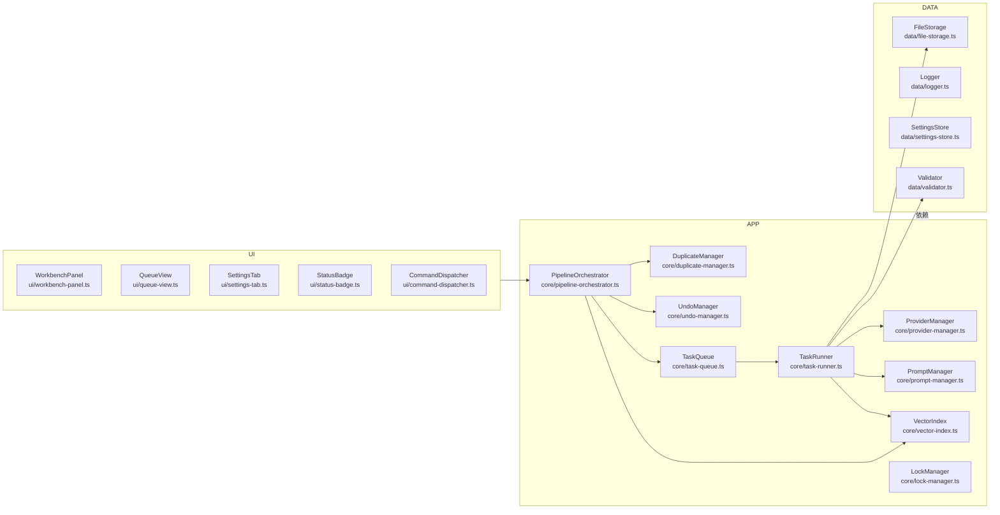

# Cognitive Razor - 技术设计文档
**版本**: 0.9.3 | **更新**: 2025-12-08 | **类型**: 控制平面 / SSOT

---

## 目录
1. 系统拓扑与依赖
2. 模块映射（双向溯源）
3. 数据模型与存储契约
4. 数据层组件（声明式行为）
5. 应用层组件（任务/管线/向量/快照）
6. UI 层组件
7. 业务流程（创建 / 增量 / 合并 / Ground）
8. 调度、锁与重试策略
9. 错误码与日志事件
10. 配置与性能约束
11. 代码索引

---

## 1. 系统拓扑与依赖

**依赖约束**：UI → 应用 → 数据（单向）；所有文件写入经 `FileStorage.atomicWrite`(data/file-storage.ts:271-370)；写入前快照经 `UndoManager.createSnapshot`(core/undo-manager.ts:152-243)。

---

## 2. 模块映射（双向溯源）
| 层级 | 模块 | 责任 | 物理位置 |
|------|------|------|----------|
| Entry | 插件生命周期 | 初始化/卸载、依赖注入、事件订阅 | `main.ts:103-173,252-733` |
| 数据 | FileStorage | 路径解析、原子写入、目录初始化 | `src/data/file-storage.ts:135-370` |
| 数据 | Logger | 1MB 循环日志、JSON 事件 | `src/data/logger.ts` |
| 数据 | SettingsStore | 版本兼容、验证、订阅通知 | `src/data/settings-store.ts:103-361,407-735` |
| 应用 | TaskQueue | 入队校验、调度、锁、持久化 | `src/core/task-queue.ts:85-1156` |
| 应用 | TaskRunner | 按任务类型调用 LLM/Embedding、验证、快照 | `src/core/task-runner.ts:169-1460` |
| 应用 | PipelineOrchestrator | 创建/增量/合并管线、确认、落盘 | `src/core/pipeline-orchestrator.ts:336-2073` |
| 应用 | ProviderManager | OpenAI 兼容调用、可用性缓存、网络事件 | `src/core/provider-manager.ts:133-439` |
| 应用 | PromptManager | 模板加载与槽位校验 | `src/core/prompt-manager.ts` |
| 应用 | VectorIndex | 分桶存储、余弦检索、维度校验 | `src/core/vector-index.ts:116-330` |
| 应用 | DuplicateManager | 相似度检测、重复对存储 | `src/core/duplicate-manager.ts:53-226,438-478` |
| 应用 | UndoManager | 快照创建/恢复/清理 | `src/core/undo-manager.ts:152-249,258-354,422-520` |
| 应用 | LockManager | 节点/类型锁获取与恢复 | `src/core/lock-manager.ts:27-143` |
| UI | WorkbenchPanel | 入口面板：标准化、创建、增量、合并、预览 | `src/ui/workbench-panel.ts:134-1873` |
| UI | QueueView | 队列状态与任务详情 | `src/ui/queue-view.ts` |
| UI | SettingsTab | 配置页（Provider/模型/目录/开关） | `src/ui/settings-tab.ts` |

---

## 3. 数据模型与存储契约
| 模型 | 描述 | 位置 |
|------|------|------|
| `CRType` | `"Domain" | "Issue" | "Theory" | "Entity" | "Mechanism"` | `src/types.ts:12` |
| `NoteState` | `"Stub" | "Draft" | "Evergreen"` | `src/types.ts:17` |
| `CRFrontmatter` | `uid,type,status,created,updated,aliases?,tags?,parentUid?,sourceUids?,version?` | `src/types.ts:26-49` |
| `TaskRecord` | `id,nodeId,taskType,state,providerRef,payload,result?,lockKey?,typeLockKey?,attempt,maxAttempts,errors?,timestamps` | `src/types.ts:94-131` |
| `DuplicatePair` | `id,noteA{uid,path},noteB{uid,path},type,similarity,status` | `src/types.ts:149-172` |
| `VectorEntry` | `uid,type,embedding[],name,path,updated` | `src/types.ts:181-194` |
| `Result<T>` | `ok|err` 单子 | `src/types.ts` |

**存储布局**（相对 Vault）：`main.ts:240-268` + `src/data/file-storage.ts:135-175`
```
<vault>/.obsidian/plugins/obsidian-cognitive-razor/
  data/
    queue-state.json      # 任务队列快照（TaskQueue.saveQueue）
    vector-index.json     # 向量索引（VectorIndex.save）
    duplicate-pairs.json  # 去重记录（DuplicateManager.saveStore）
    app.log               # 循环日志
    snapshots/
      index.json          # 快照索引
      *.json              # 快照内容
```

---

## 4. 数据层组件（声明式行为）
- **FileStorage** `src/data/file-storage.ts:135-370`
  - `initialize()`：创建 `data/`、`snapshots/` 并初始化核心文件；任何失败返回 `E300/E301`。
  - `atomicWrite(path, content)`：写临时→校验→备份→rename/copy→清理；失败清理 `.tmp/.bak`。
  - 所有调用必须传递相对路径（由构造注入 basePath）。
- **Logger** `src/data/logger.ts`：JSON 行日志，调用者提供 `module,event,message,context`；文件大小 1MB 超限循环覆盖。
- **SettingsStore** `src/data/settings-store.ts:103-361,407-735`
  - `loadSettings()`：合并 `DEFAULT_SETTINGS`，字段完整性校验（REQUIRED_SETTINGS_FIELDS），版本不兼容则重置。
  - `updateSettings(partial)`：深合并+验证，成功后通知订阅者。
  - 默认值：`namingTemplate="{{chinese}} ({{english}})"`、`similarityThreshold=0.9`、`topK=10`、`concurrency=1`、`enableGrounding=false`、`embeddingDimension=1536`。
- **Validator** `src/data/validator.ts`：基于 AJV 校验 JSON，返回 `valid + errors[]`；错误码映射 `C00x`。

---

## 5. 应用层组件（任务/管线/向量/快照）
- **TaskQueue** `src/core/task-queue.ts:85-1156`
  - 入队前校验：同 `nodeId` Pending/Running 去重 + 节点/类型锁冲突 → `E400`（140-199）。
  - 状态持久化：`saveQueue()` 串行写入 `queue-state.json`，更新 `locks/stats`（928-970）。
  - 调度：每秒 `scheduleNextTask()`；尊重 `concurrency` 设置与锁；缺 Runner/锁冲突跳过（534-652）。
  - 执行：`executeTask()` 调用 `TaskRunner.run`，根据结果进入 `handleTaskSuccess/Failure`，按重试策略重置或失败（660-857）。
  - 恢复：`restoreQueueState()` 将 Running→Pending，清理锁并持久化（991-1059）。
  - 事件：`task-added/task-started/task-completed/task-failed/queue-paused/resumed` 通过 `subscribe` 广播。
- **TaskRunner** `src/core/task-runner.ts:169-1460`
  - `run(task)`：能力校验→按 `taskType` 分发→记录耗时。
  - 快照：所有写入前调用 `createSnapshotBeforeWrite`（281-335）。
  - 类型必填校验：`validateTypeFieldCompleteness` 针对各 `CRType` 强制字段/格式（355-414）。
  - Evergreen 降级：增量改进时 `handleEvergreenDowngrade`（433-439）+ 状态写回（448-475）。
  - 任务执行：
    - `standardizeClassify`(654-720)：Prompt→chat→schema 校验。
    - `enrich`(726-793)：生成 aliases/tags。
    - `embedding`(799-852)：构造签名文本→embed API（支持自定义维度）。
    - `reason:new`(859-941)：按类型 Schema 验证 + 类型字段完整性 + 快照。
    - `reason:incremental`(949-1028)：使用当前正文/意图，输出 newContent，快照+Evergreen 降级记录。
    - `reason:merge`(1038-1141)：兼容 noteA/noteB 输入，输出结构化合并结果+快照并记录保留/删除节点。
    - `ground`(1151-1230)：事实核查，返回结构化评估结果。
  - Provider 能力前置校验：`validateProviderCapability`，无可用 Provider 返回 `E201`（1367-1439）。
- **PipelineOrchestrator** `src/core/pipeline-orchestrator.ts:336-2073`
  - 管线上下文持久在内存（Map），任务与管线映射 `taskToPipeline`。
  - 创建流程：`startCreatePipeline` → standardizeClassify → enrich → embedding → 用户确认 → Stub 写入 → reason:new → (可选 ground) → 用户确认写入 → Draft+向量+去重。
    - 入口 `startCreatePipeline`(336-398)，`standardizeDirect`(414-508) 为 UI 直接标准化。
    - 已标准化入口 `startCreatePipelineWithStandardized`(521-599)。
    - 用户确认创建 `confirmCreate`(1100-1166) 先生成 Stub(frontmatter 仅含元数据，1174-1236) 后入队 reason:new。
    - 写入确认 `confirmWrite`(1296-1336) 根据 kind 调 `confirmCreateWrite`(602-672)/`confirmIncrementalWrite`(675-717)/`confirmMergeWrite`(719-787)。
  - 增量流程：`startIncrementalPipeline`(929-999) → reason:incremental → (可选 ground) → 等待写入确认。
  - 合并流程：`startMergePipeline`(1006-1089) 读取双文件、标记 pair 状态、入队 reason:merge；写入阶段删除被合并文件、更新向量索引、清理重复对（719-787）。
  - Ground：`startGroundTask`(1715-1748) 在 reason 完成后可选执行；结果写入 `context.groundingResult`。
  - 任务事件订阅：`subscribeToTaskQueue`(1422-1429)→`handleTaskCompleted/Failed`(1435-1799) 驱动阶段迁移。
  - 写入渲染：`renderContentToMarkdown` 依据 `schemaRegistry` 字段描述生成正文（1879-2043）。
  - 所有写入使用 `atomicWriteVault`(1837-1857)；未通过 `FileStorage`，直接使用 Vault adapter 实现原子覆盖。
- **VectorIndex** `src/core/vector-index.ts:116-330`
  - 维度校验（116-145）；按 `CRType` 分桶；`search` 仅在同类型桶内余弦排序并返回 topK（196-236）。
  - `delete` 删除并保存（156-190）；`getStats` 汇总各桶（248-264）。
- **DuplicateManager** `src/core/duplicate-manager.ts:53-226,438-478`
  - `detect(nodeId,type,embedding)`：向量检索→阈值过滤→生成 `DuplicatePair` 存入 store，跳过已忽略/已存在对（111-200）。
  - `updateStatus/removePair` 管理合并状态与持久化（438-478）。
- **UndoManager** `src/core/undo-manager.ts:152-249,258-354,422-520`
  - 快照记录字段必含 `id,nodeId,taskId,path,content,created,fileSize,checksum`。
  - `restoreSnapshotToFile` 将快照写回原路径并返回元数据。
  - 清理：超过 `maxSnapshots` 或超龄通过 `cleanupOldestSnapshots`。
- **LockManager** `src/core/lock-manager.ts:27-143`
  - `acquire(key,type,taskId)` 成功返回 lockId；`release(lockId)`；`restoreLocks/clear/releaseByTaskId` 支持队列恢复。
- **ProviderManager** `src/core/provider-manager.ts:133-439`
  - `chat/embed` 使用 OpenAI 接口格式，支持自定义 baseUrl/apiKey；重试委托 `RetryHandler.executeWithRetry`。
  - 可用性缓存 5 分钟；`checkAvailability` 若 429/超时标记 offline 并通知监听者。
- **PromptManager** `src/core/prompt-manager.ts`
  - 模板块顺序约束 `<system><context><task><output_schema><reminder>`；槽位映射 `TASK_SLOT_MAPPING` 强校验；`build(taskType, slots, variant?)` 负责替换必填槽位。

---

## 6. UI 层组件
- **WorkbenchPanel** `src/ui/workbench-panel.ts:134-1873`
  - `handleStandardize`(549-610)：调用 `PipelineOrchestrator.standardizeDirect`，渲染类型置信度表(611-679)。
  - `handleCreateConcept`(692-752)：用户选择类型→`startCreatePipelineWithStandardized`→监听管线事件并渲染预览(753-973)。
  - 增量与合并：右键入口调用 `startIncrementalPipeline` / `startMergePipeline`，并弹出 diff 预览(1166-1241,1622-1671)。
  - 队列/重复/最近操作展示：`renderQueueStatus`(1318-1873 部分) 调用 `QueueView` 数据。
- **QueueView** `src/ui/queue-view.ts`：订阅 `TaskQueue.subscribe`，展示任务列表、清理/重试操作。
- **SettingsTab** `src/ui/settings-tab.ts`：编辑 Provider/模型/目录/开关，调用 `SettingsStore.updateSettings`。
- **StatusBadge** `src/ui/status-badge.ts`：显示队列状态和网络状态；监听 `TaskQueue` 和 `ProviderManager.subscribeNetworkStatus`。
- **CommandDispatcher** `src/ui/command-dispatcher.ts`：Obsidian 命令绑定（创建、增量、合并、撤销）。

---

## 7. 业务流程（声明式）
### 7.1 创建概念（标准化 → 丰富 → 嵌入 → 确认 → 推理 → Ground(可选) → 写入）
伪代码（行号溯源）：
```pseudo
user_input -> WorkbenchPanel.handleStandardize() ui/workbench-panel.ts:549-610
standardized = PipelineOrchestrator.standardizeDirect(user_input) core/pipeline-orchestrator.ts:414-508
user_select_type -> startCreatePipelineWithStandardized(standardized,type) core/pipeline-orchestrator.ts:521-599
enqueue enrich -> task-queue.ts:140-240
enrich done -> enqueue embedding (1556-1619) -> embedding done -> awaiting_create_confirm (1637-1670)
user confirm -> confirmCreate -> createStub (1174-1236) -> enqueue reason:new (1121-1142)
reason:new done -> optional startGroundTask (1715-1748) else transitionToAwaitingWriteConfirm (1753-1767)
user confirm write -> confirmCreateWrite (602-672) atomicWriteVault -> vectorIndex.upsert -> duplicateManager.detect
pipeline_completed event -> UI refresh
```

### 7.2 增量改进
```pseudo
WorkbenchPanel trigger -> startIncrementalPipeline(params) core/pipeline-orchestrator.ts:929-999
enqueue reason:incremental -> TaskRunner.executeReasonIncremental (949-1028) -> snapshot + Evergreen 降级提示
optional ground -> startGroundTask
user confirm -> confirmIncrementalWrite (675-717) atomic write -> vectorIndex.upsert(path update) -> duplicateManager.detect
```

### 7.3 合并
```pseudo
DuplicateManager.detect -> pair (111-200)
WorkbenchPanel merge action -> startMergePipeline(pair) core/pipeline-orchestrator.ts:1006-1089 (reads both files, mark status=merging)
TaskRunner.executeReasonMerge (1038-1141) -> structured merge result + snapshot for keep file
optional ground -> startGroundTask
user confirm -> confirmMergeWrite (719-787) atomic write keep file + delete merged file + vectorIndex.delete + duplicateManager.removePair
```

### 7.4 Ground（可选接地验证）
- 触发点：`enableGrounding=true` 时，reason:new/merge/incremental 完成后调用 `startGroundTask`。
- 结果写入 `context.groundingResult` 并附加到 `generatedContent._groundingResult`；用户仍需确认写入。

---

## 8. 调度、锁与重试策略
- **调度**：`TaskQueue.startScheduler` 每秒运行；达到 `settings.concurrency` 停止调度（534-557）。
- **锁**：节点锁 = `nodeId`；类型锁 = `type:<CRType>`；获取失败跳过任务并保留 Pending（563-595）。任务完成/失败/重试均释放锁（734-850,905-916）。
- **恢复**：重启后 Running 任务降级为 Pending 并清锁（1009-1059）。
- **重试**：`RetryHandler`（core/retry-handler.ts）
  - 错误分类 `classifyError`：内容错误(E001-E010) 重试≤3；网络(E102) 指数退避≤5；其他不重试。
  - TaskQueue 在 `handleTaskFailure` 中根据 `settings.autoRetry`、`maxAttempts` 动态更新并重置为 Pending（758-857）。
  - ProviderManager API 调用使用 `executeWithRetry`，429/超时触发重试并广播 offline。

---

## 9. 错误码与日志事件
- 错误码定义：`src/data/error-codes.ts:20-113`
  - 内容错误 E001-E010；网络 E100-E102；认证 E103；能力 E200-E201；文件 E300-E304。
- 日志规范（Logger JSON 行）：
  - 任务状态变更：`event=TASK_STATE_CHANGE`（enqueue/schedule/complete/fail）。
  - API 调用：`event=API_REQUEST|API_RESPONSE|API_ERROR|API_RETRY`。
  - Ground/合并等关键路径均记录 pipelineId/taskId。

---

## 10. 配置与性能约束
- 配置默认值：见 **SettingsStore**；每次加载版本兼容性检查（version=0.9.3）。
- 资源上限（建议）：`TaskQueue` 内存 ≤100 条（无硬限制但队列持久化）；`VectorIndex` 维度必须匹配 `embeddingDimension`。
- 性能目标（可验证指标）：
  - 调度延迟 ≤2s（1s tick）；Embedding/Ground 依赖外部 API。
  - 文件写入全程原子，写入前必须存在快照（TaskRunner 或 Pipeline 写入路径）。

---

## 11. 代码索引（精确溯源）
| 模块/函数 | 位置 |
|----------|------|
| 插件生命周期 `onload` | `main.ts:103-173` |
| 数据目录初始化 | `main.ts:251-269` |
| 数据层初始化 | `main.ts:283-338` |
| 设置加载 | `main.ts:350-405` |
| 应用层初始化 | `main.ts:448-633` |
| TaskQueue.initialize | `src/core/task-queue.ts:85-128` |
| TaskQueue.enqueue | `src/core/task-queue.ts:140-240` |
| TaskQueue.scheduleNextTask | `src/core/task-queue.ts:534-652` |
| TaskQueue.executeTask | `src/core/task-queue.ts:660-703` |
| TaskRunner.run | `src/core/task-runner.ts:169-249` |
| TaskRunner.executeReasonIncremental | `src/core/task-runner.ts:949-1028` |
| TaskRunner.executeReasonMerge | `src/core/task-runner.ts:1038-1141` |
| PipelineOrchestrator.startCreatePipeline | `src/core/pipeline-orchestrator.ts:336-398` |
| PipelineOrchestrator.standardizeDirect | `src/core/pipeline-orchestrator.ts:414-508` |
| PipelineOrchestrator.confirmCreate | `src/core/pipeline-orchestrator.ts:1100-1166` |
| PipelineOrchestrator.confirmWrite | `src/core/pipeline-orchestrator.ts:1296-1336` |
| Ground 任务启动 | `src/core/pipeline-orchestrator.ts:1715-1748` |
| VectorIndex.upsert/search | `src/core/vector-index.ts:116-150 / 196-236` |
| DuplicateManager.detect | `src/core/duplicate-manager.ts:111-200` |
| UndoManager.createSnapshot | `src/core/undo-manager.ts:152-243` |
| FileStorage.atomicWrite | `src/data/file-storage.ts:271-370` |

---
